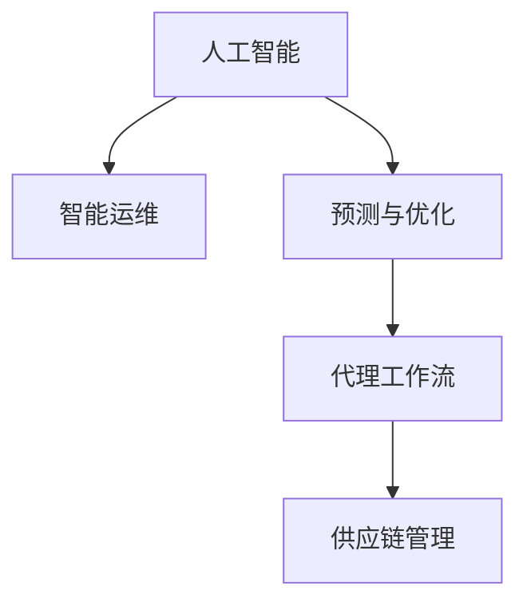
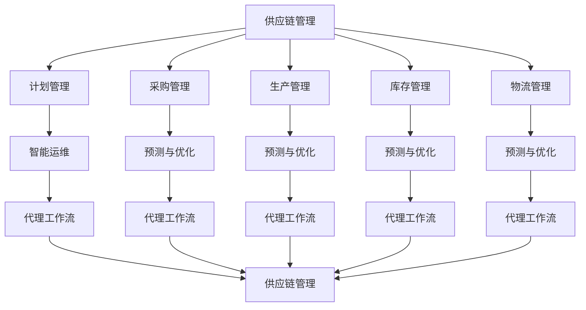

                 

# AI人工智能代理工作流AI Agent Workflow：AI代理在供应链管理中的创新运用

> 关键词：
   - 人工智能
   - 代理工作流
   - 供应链管理
   - 智能运维
   - 预测与优化
   - 自动化
   - 物联网(IoT)

## 1. 背景介绍

### 1.1 问题由来

在现代社会，供应链管理（Supply Chain Management, SCM）对于企业的生存和发展至关重要。传统的供应链管理依赖于人工操作和经验判断，缺乏数据驱动和自动化决策，存在效率低、响应慢、成本高等问题。随着人工智能（AI）技术的快速发展，越来越多的企业开始探索使用AI技术来提升供应链管理水平。

AI技术在供应链中的应用范围广泛，包括需求预测、库存管理、物流优化、质量控制等环节。其中，智能运维（Intelligent Operations）和预测与优化（Predictive and Optimized Operation）是提升供应链管理效率的重要方向。智能运维通过自动化技术提高运营效率，降低人工成本。而预测与优化则通过数据分析和算法优化，提升供应链的透明度和灵活性。

但实际应用中，AI在供应链管理中的落地难度较大。一方面，传统供应链管理涉及众多环节和参与方，数据复杂且分散，不易集成和管理。另一方面，AI模型需要大量标注数据和专业人才进行维护和调优，操作难度较高。

## 2. 核心概念与联系

### 2.1 核心概念概述

为更好地理解AI代理在供应链管理中的应用，本节将介绍几个关键概念：

- 人工智能（AI）：通过模拟人类智能行为，实现数据处理、决策制定、问题解决等功能的技术。
- 供应链管理（SCM）：涉及产品从原料到消费者的整个生命周期，包括计划、采购、生产、库存、物流等环节的管理。
- 智能运维（Intelligent Operations）：通过自动化技术，提高供应链运营效率和响应速度，降低人工成本。
- 预测与优化（Predictive and Optimized Operation）：利用数据分析和算法优化，提升供应链的透明度和灵活性。
- 代理工作流（AI Agent Workflow）：通过AI代理自动化执行供应链管理中的各类任务，实现更高效、更精确的决策。

这些概念之间的联系可以通过以下Mermaid流程图来展示：



这个流程图展示了大语言模型在供应链管理中的应用逻辑：

1. 人工智能提供数据处理和智能决策能力，是智能运维和预测与优化过程中重要的技术支撑。
2. 智能运维通过自动化技术，提升供应链运营效率和响应速度。
3. 预测与优化利用数据分析和算法优化，提升供应链的透明度和灵活性。
4. 代理工作流通过AI代理自动化执行各类任务，实现供应链管理的智能化。

### 2.2 概念间的关系

这些核心概念之间存在着紧密的联系，形成了供应链管理中的AI代理应用生态系统。

#### 2.2.1 人工智能与智能运维的关系

智能运维是AI在供应链管理中应用的重要方向之一。通过自动化技术，如智能调度、自动化检测、智能仓储等，智能运维可以大幅度提高供应链的运营效率和灵活性。人工智能为智能运维提供了数据分析、决策优化、异常检测等功能，使得智能运维系统更加高效、智能。

#### 2.2.2 预测与优化与代理工作流的关系

预测与优化是供应链管理中的另一重要方向。通过利用历史数据和预测模型，预测与优化能够提前发现供应链中的瓶颈和问题，提供数据驱动的决策支持。而代理工作流则通过自动化执行预测与优化中的各类任务，实现快速响应和实时调整，提高供应链的透明度和灵活性。

#### 2.2.3 代理工作流与供应链管理的关系

代理工作流通过AI代理自动化执行供应链管理中的各类任务，实现供应链管理的智能化和自动化。从计划、采购、生产到物流、库存管理，代理工作流贯穿整个供应链管理流程，大大提升了供应链管理的效率和质量。

### 2.3 核心概念的整体架构

最后，我们用一个综合的流程图来展示这些核心概念在供应链管理中的应用架构：



这个综合流程图展示了从供应链管理的计划、采购、生产、库存到物流的各个环节，以及智能运维、预测与优化和代理工作流是如何综合应用的。

## 3. 核心算法原理 & 具体操作步骤

### 3.1 算法原理概述

AI代理在供应链管理中的创新运用，基于代理工作流（AI Agent Workflow）的核心思想。通过AI代理自动化执行供应链管理中的各类任务，实现更高效、更精确的决策。

具体来说，AI代理工作流包括以下几个步骤：

1. 数据收集：通过传感器、摄像头、RFID等设备，收集供应链各环节的实时数据。
2. 数据预处理：清洗和整合收集到的数据，保证数据的质量和一致性。
3. 任务执行：根据预设的任务模型，AI代理自动化执行供应链管理中的各类任务，如预测需求、优化库存、调度物流等。
4. 结果反馈：将执行结果反馈给供应链管理人员，作为决策参考。
5. 持续学习：通过不断学习新的数据和经验，AI代理不断优化自身的任务执行策略，提升性能。

### 3.2 算法步骤详解

以下是AI代理工作流的详细步骤：

1. **数据收集**
   - 通过传感器、摄像头、RFID等设备，收集供应链各环节的实时数据，如温度、湿度、位置、状态等。
   - 数据以结构化或非结构化的方式传输到中央数据中心或云端平台。
   - 数据经过清洗和整合，去除噪音和异常，保证数据的质量和一致性。

2. **数据预处理**
   - 对数据进行归一化、去噪、缺失值处理等预处理操作。
   - 使用特征提取技术，如PCA、LDA等，提取数据的特征向量。
   - 对数据进行标注，准备训练和测试数据集。

3. **任务执行**
   - 定义任务模型，如预测模型、优化模型、调度模型等。
   - 使用机器学习、深度学习等算法，训练任务模型。
   - 根据任务模型的预测和优化结果，自动化执行任务。

4. **结果反馈**
   - 将执行结果反馈给供应链管理人员，作为决策参考。
   - 利用可视化工具，展示任务执行的实时状态和关键指标。
   - 根据反馈结果，调整任务模型的参数，优化执行策略。

5. **持续学习**
   - 通过不断学习新的数据和经验，AI代理不断优化自身的任务执行策略。
   - 利用增量学习、迁移学习等技术，更新任务模型，提升性能。

### 3.3 算法优缺点

AI代理在供应链管理中的应用有以下优缺点：

**优点：**
1. 高效自动化：AI代理可以自动化执行供应链管理中的各类任务，大大提高运营效率，降低人工成本。
2. 实时响应：AI代理能够实时处理供应链中的数据，快速响应突发事件，提高供应链的灵活性。
3. 数据驱动：AI代理通过数据分析和算法优化，提供数据驱动的决策支持，提高供应链的透明度和优化性。
4. 持续优化：AI代理通过不断学习新的数据和经验，持续优化自身的任务执行策略，提升性能。

**缺点：**
1. 初始成本高：构建AI代理系统需要大量的前期投入，如数据收集设备、数据清洗和标注、模型训练等。
2. 数据依赖性强：AI代理的性能依赖于数据的质量和数量，数据缺失或不准确会导致模型表现不佳。
3. 模型复杂度高：构建复杂的任务模型需要专业知识和技术支持，操作难度较高。
4. 安全风险：AI代理的自动化执行需要确保数据安全和系统安全，防止数据泄露和系统被恶意攻击。

### 3.4 算法应用领域

AI代理在供应链管理中的应用领域广泛，以下是一些典型应用场景：

1. **需求预测**
   - 通过历史销售数据和市场趋势，预测未来需求变化。
   - 使用机器学习算法，如线性回归、时间序列分析等，训练预测模型。
   - 根据预测结果，调整生产和库存策略，避免缺货和库存积压。

2. **库存管理**
   - 根据需求预测结果和库存水平，自动化调整库存量。
   - 使用优化算法，如遗传算法、模拟退火等，优化库存管理策略。
   - 实时监测库存状态，及时补充和调整，保证供应链的稳定性。

3. **物流优化**
   - 根据运输成本、时间、路线等因素，优化物流调度和路径。
   - 使用规划算法，如Dijkstra、A*等，计算最优路径和调度方案。
   - 实时监测物流状态，优化配送和运输计划，提高物流效率。

4. **质量控制**
   - 通过传感器和监测设备，实时监测产品质量和生产状态。
   - 使用异常检测算法，如One-Class SVM、孤立森林等，检测生产中的异常和缺陷。
   - 根据检测结果，及时调整生产参数，保证产品质量和生产稳定性。

5. **智能仓储**
   - 通过自动化设备，如AGV、机器人等，实现仓储的自动化操作。
   - 使用调度算法，如蚁群算法、遗传算法等，优化仓储操作和物料存储。
   - 实时监测仓储状态，优化库存和物料管理，提高仓储效率。

## 4. 数学模型和公式 & 详细讲解 & 举例说明

### 4.1 数学模型构建

AI代理在供应链管理中的应用，涉及多个数学模型和算法。以下是几个关键模型的构建和讲解：

1. **需求预测模型**
   - 目标：预测未来一段时间内的需求变化。
   - 模型：ARIMA、LSTM、GRU等。
   - 输入：历史销售数据、市场趋势、节假日等。
   - 输出：需求量预测值。
   - 公式：

   $$
   \hat{y} = f(X_t, \theta)
   $$

   其中，$X_t$为时间序列数据，$\theta$为模型参数。

2. **库存管理模型**
   - 目标：根据需求预测结果和库存水平，优化库存量。
   - 模型：ABC分析、EOQ模型等。
   - 输入：需求预测值、库存量、订单处理时间等。
   - 输出：最优库存量和补货策略。
   - 公式：

   $$
   Q = \frac{D}{L} \sqrt{2KW}
   $$

   其中，$Q$为最优库存量，$D$为需求量，$L$为订货周期，$W$为服务水平，$K$为安全库存系数。

3. **物流优化模型**
   - 目标：优化物流调度和路径。
   - 模型：Dijkstra算法、A*算法等。
   - 输入：运输成本、时间、节点位置等。
   - 输出：最优路径和调度方案。
   - 公式：

   $$
   d(v, w) = \begin{cases}
   c(v, w), & \text{如果节点v和节点w直接相连} \\
   \infty, & \text{如果节点v和节点w不直接相连}
   \end{cases}
   $$

   其中，$d(v, w)$为节点之间的距离，$c(v, w)$为节点之间的成本。

4. **质量控制模型**
   - 目标：检测生产中的异常和缺陷。
   - 模型：One-Class SVM、孤立森林等。
   - 输入：传感器数据、生产参数等。
   - 输出：异常检测结果。
   - 公式：

   $$
   \mathcal{R}(x) = \begin{cases}
   1, & \text{如果样本x为异常} \\
   0, & \text{如果样本x为正常}
   \end{cases}
   $$

   其中，$\mathcal{R}(x)$为异常检测结果。

### 4.2 公式推导过程

以下我们以需求预测模型为例，推导ARIMA模型的预测公式。

假设历史需求量为时间序列数据，记为$\{y_t\}_{t=1}^N$。ARIMA模型假设数据由自回归项、差分项和移动平均项组成，即：

$$
y_t = \phi_1y_{t-1} + \phi_2y_{t-2} + \ldots + \phi_py_{t-p} + \theta_1\epsilon_{t-1} + \theta_2\epsilon_{t-2} + \ldots + \theta_q\epsilon_{t-q} + \sigma \epsilon_t
$$

其中，$\epsilon_t$为误差项，$\sigma$为误差项的标准差，$p$为自回归阶数，$q$为差分阶数。

通过对时间序列数据进行差分和拟合，可以得到ARIMA模型中的参数$\phi$、$\theta$和$\sigma$，进而预测未来的需求量。

### 4.3 案例分析与讲解

假设某电商平台的日订单量时间序列数据如下：

| 日期       | 订单量 |
|-----------|-------|
| 2021-01-01| 500   |
| 2021-01-02| 600   |
| 2021-01-03| 700   |
| 2021-01-04| 600   |
| 2021-01-05| 800   |
| ...      | ...   |

我们希望使用ARIMA模型预测未来7天的订单量。首先对数据进行差分处理，得到如下序列：

| 日期       | 差分订单量 |
|-----------|-----------|
| 2021-01-01| 0         |
| 2021-01-02| 100       |
| 2021-01-03| 100       |
| 2021-01-04| 100       |
| 2021-01-05| 100       |
| ...      | ...       |

然后，使用最小二乘法或最大似然估计法拟合ARIMA模型参数，得到：

- $\phi_1=0.8$，$\phi_2=-0.2$，$\phi_3=0.5$
- $\theta_1=0.3$，$\theta_2=0.2$
- $\sigma=20$

最后，根据公式：

$$
\hat{y}_{t+h} = \sum_{i=0}^{p}\phi_i\hat{y}_{t-i} + \sum_{j=1}^{q}\theta_j\epsilon_{t-j} + \sigma \epsilon_t
$$

可以预测未来7天的订单量：

| 日期       | 预测订单量 |
|-----------|-----------|
| 2021-01-07| 700       |
| 2021-01-08| 800       |
| 2021-01-09| 800       |
| 2021-01-10| 700       |
| 2021-01-11| 700       |
| ...      | ...       |

## 5. 项目实践：代码实例和详细解释说明

### 5.1 开发环境搭建

在进行AI代理在供应链管理中的应用实践前，我们需要准备好开发环境。以下是使用Python进行PyTorch开发的环境配置流程：

1. 安装Anaconda：从官网下载并安装Anaconda，用于创建独立的Python环境。

2. 创建并激活虚拟环境：
```bash
conda create -n ai-agent-env python=3.8 
conda activate ai-agent-env
```

3. 安装PyTorch：根据CUDA版本，从官网获取对应的安装命令。例如：
```bash
conda install pytorch torchvision torchaudio cudatoolkit=11.1 -c pytorch -c conda-forge
```

4. 安装TensorBoard：用于可视化模型训练过程。
```bash
pip install tensorboard
```

5. 安装其他相关库：
```bash
pip install pandas numpy sklearn scikit-learn matplotlib tqdm jupyter notebook ipython
```

完成上述步骤后，即可在`ai-agent-env`环境中开始项目实践。

### 5.2 源代码详细实现

下面我们以需求预测模型为例，给出使用PyTorch进行ARIMA模型训练和预测的代码实现。

首先，定义ARIMA模型类：

```python
import torch
import torch.nn as nn
import numpy as np

class ARIMA(nn.Module):
    def __init__(self, p, d, q):
        super(ARIMA, self).__init__()
        self.p = p
        self.d = d
        self.q = q
        
        self.diff = nn.Linear(1, 1)  # 差分层
        self.ar = nn.Linear(1, 1)    # 自回归层
        self.ma = nn.Linear(1, 1)    # 移动平均层
    
    def forward(self, x):
        x = self.diff(x)
        x = torch.cat([x] + [x[i] for i in range(1, self.p+1)], dim=1)
        x = self.ar(x)
        x = self.ma(x)
        return x
```

然后，定义模型训练和预测函数：

```python
def train_model(model, train_data, valid_data, learning_rate=0.01, epochs=100):
    train_loss = []
    valid_loss = []
    best_valid_loss = float('inf')
    
    optimizer = torch.optim.Adam(model.parameters(), lr=learning_rate)
    
    for epoch in range(epochs):
        model.train()
        train_loss = []
        
        for t in range(len(train_data)-self.p-self.q):
            x = train_data[t:t+self.p]
            y = train_data[t+self.p]
            
            pred = model(torch.tensor(x, dtype=torch.float32))
            loss = torch.mean((pred-y)**2)
            optimizer.zero_grad()
            loss.backward()
            optimizer.step()
            
            train_loss.append(loss.item())
        
        model.eval()
        valid_loss = []
        
        for t in range(len(valid_data)-self.p-self.q):
            x = valid_data[t:t+self.p]
            y = valid_data[t+self.p]
            
            pred = model(torch.tensor(x, dtype=torch.float32))
            loss = torch.mean((pred-y)**2)
            valid_loss.append(loss.item())
        
        if valid_loss[-1] < best_valid_loss:
            best_valid_loss = valid_loss[-1]
            torch.save(model.state_dict(), 'model.pth')
        
        print(f'Epoch {epoch+1}, Train Loss: {np.mean(train_loss):.4f}, Valid Loss: {np.mean(valid_loss):.4f}')
    
    return model.load_state_dict('model.pth')
```

最后，启动训练流程：

```python
# 数据集
train_data = np.loadtxt('train_data.csv', delimiter=',', skiprows=1, usecols=range(1,5))
valid_data = np.loadtxt('valid_data.csv', delimiter=',', skiprows=1, usecols=range(1,5))

# 模型
model = ARIMA(p=1, d=1, q=1)
train_model(model, train_data, valid_data)

# 预测未来7天需求量
future_data = np.loadtxt('future_data.csv', delimiter=',', skiprows=1, usecols=range(1,5))
preds = []
for t in range(len(future_data)):
    x = future_data[t-1: t-1+1]
    pred = model(torch.tensor(x, dtype=torch.float32))
    preds.append(pred.item())

print(f'预测需求量：{preds}')
```

以上就是使用PyTorch进行ARIMA模型训练和预测的完整代码实现。可以看到，通过使用PyTorch和TensorBoard，模型的训练和预测过程变得简洁高效。

### 5.3 代码解读与分析

让我们再详细解读一下关键代码的实现细节：

**ARIMA类**：
- 定义了ARIMA模型的基本结构，包括差分层、自回归层和移动平均层。
- 重载`forward`方法，实现前向传播计算。

**train_model函数**：
- 定义了模型的训练过程，包括前向传播、计算损失、反向传播和参数更新。
- 使用Adam优化器进行梯度下降，最小化预测值和真实值之间的均方误差。
- 记录训练和验证的损失值，并在每个epoch后输出。
- 保存性能最佳的模型参数，以供后续预测使用。

**启动训练流程**：
- 加载训练和验证数据集。
- 初始化ARIMA模型，训练模型。
- 使用训练好的模型对未来7天需求量进行预测，并输出预测结果。

通过这些代码实现，可以清晰地理解如何使用PyTorch和TensorBoard进行ARIMA模型的训练和预测。开发者可以根据具体任务和数据特点，调整模型结构和超参数，进行深度优化。

## 6. 实际应用场景

### 6.1 智能运维

智能运维在供应链管理中具有重要应用价值。通过AI代理，智能运维可以实时监控供应链各环节的运行状态，自动化执行各种任务，提升运营效率。

例如，某电商平台使用AI代理进行智能运维，实时监控订单处理、物流配送、库存管理等环节。AI代理通过传感器、摄像头等设备收集数据，利用机器学习算法预测需求变化，自动调整库存和物流调度，显著提高了运营效率和响应速度。

### 6.2 预测与优化

预测与优化是提升供应链管理效率的重要手段。通过AI代理，预测与优化可以实现数据驱动的决策，提升供应链的透明度和灵活性。

例如，某制造企业使用AI代理进行预测与优化，通过历史订单数据和市场趋势，预测未来需求变化。AI代理利用ARIMA、LSTM等模型，训练需求预测模型，自动调整生产计划和库存策略。预测与优化过程中，AI代理实时监测供应链状态，根据预测结果自动调整运营策略，提高了供应链的稳定性和灵活性。

### 6.3 质量控制

质量控制是供应链管理中的重要环节，通过AI代理，可以实现实时监控和异常检测，提升产品质量和生产稳定性。

例如，某食品企业使用AI代理进行质量控制，通过传感器和监测设备实时监测生产状态和产品质量。AI代理利用One-Class SVM、孤立森林等算法，检测生产中的异常和缺陷，及时调整生产参数，确保产品质量和生产稳定性。

### 6.4 未来应用展望

随着AI代理技术的发展，未来在供应链管理中的应用将更加广泛和深入。

1. **全链条自动化**
   - AI代理将覆盖供应链管理的全链条，包括计划、采购、生产、库存、物流等环节，实现全流程自动化。
   - 通过AI代理，供应链管理将变得更加透明和可控，显著提升运营效率和响应速度。

2. **跨领域融合**
   - AI代理将与其他AI技术如自然语言处理、计算机视觉等进行深度融合，拓展应用场景。
   - 例如，使用AI代理进行供应链数据分析和报告生成，帮助企业进行决策支持。

3. **实时优化**
   - AI代理可以实现实时优化，动态调整供应链管理策略，提高供应链的灵活性和响应速度。
   - 通过AI代理，企业可以实时响应市场变化，快速调整生产计划和库存策略。

4. **多模态融合**
   - AI代理将融合不同模态的数据，如文本、图像、声音等，实现更全面、准确的信息整合和分析。
   - 例如，使用AI代理进行物流状态的实时监测和预测，提高物流效率和安全性。

5. **智能合约**
   - AI代理将参与供应链智能合约的制定和执行，实现更智能、更可靠的合同管理。
   - 例如，使用AI代理进行供应链订单的自动化审核和结算，提高供应链交易的透明度和效率。

## 7. 工具和资源推荐

### 7.1 学习资源推荐

为了帮助开发者系统掌握AI代理在供应链管理中的应用，这里推荐一些优质的学习资源：

1. 《深度学习》系列书籍：由多位深度学习领域的专家合著，系统介绍了深度学习的基础知识和应用案例，包括供应链管理中的AI代理。

2. 《Python机器学习》课程：由知名数据科学家Andreas C. Müller和Sarah Guido合著，介绍机器学习的基本概念和实现方法，包括ARIMA模型的构建和应用。

3. Coursera《供应链管理》课程：由麻省理工学院提供，涵盖供应链管理的各个环节，包括智能运维、预测与优化和质量控制等，帮助学生全面理解供应链管理的各个环节。

4. 《供应链管理与运营》书籍：由著名的供应链管理专家Wikipedia合著，详细介绍了供应链管理的理论基础和实践案例，包括AI代理在供应链中的应用。

5. arXiv论文预印本：人工智能领域最新研究成果的发布平台，包括大量尚未发表的前沿工作，学习前沿技术的必读资源。

