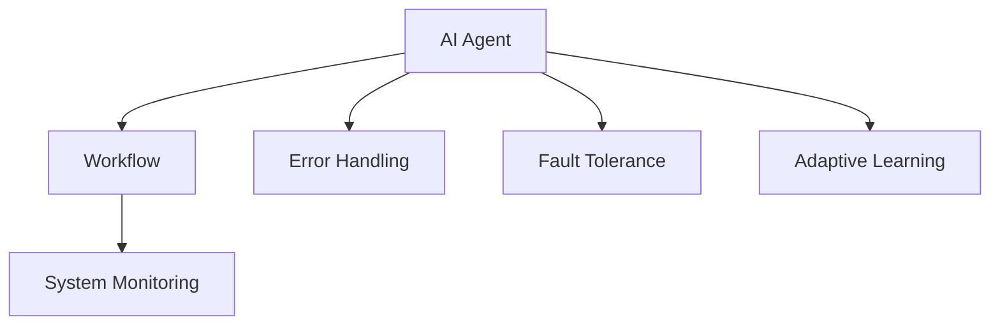
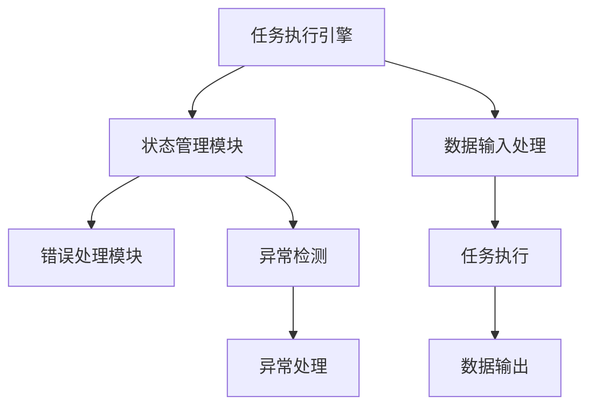
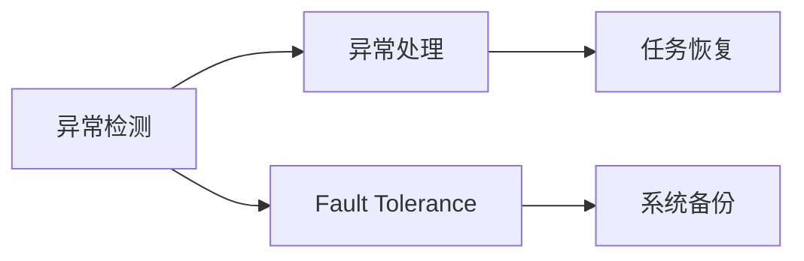
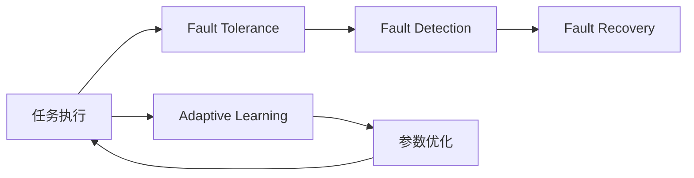
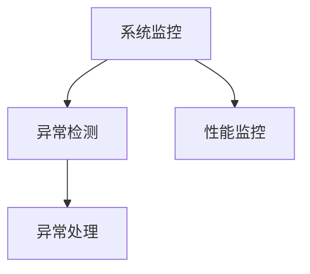
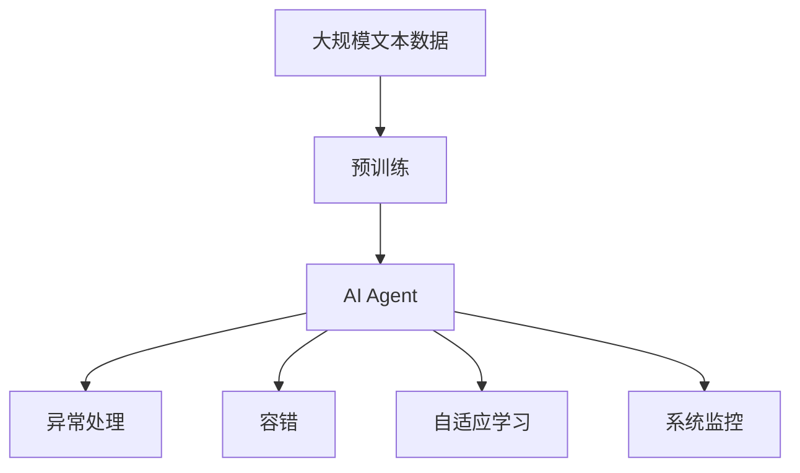

                 

# AI人工智能代理工作流AI Agent WorkFlow：代理工作流中的异常处理与容错

> 关键词：人工智能代理(AI Agent)，工作流(Workflow)，异常处理(Handling Errors)，容错(Fault Tolerance)，自适应学习(Adaptive Learning)，系统监控(System Monitoring)

## 1. 背景介绍

### 1.1 问题由来

在现代企业中，自动化和智能化是提高效率、降低成本、提升服务质量的关键。随着人工智能技术的成熟，越来越多的企业和组织开始引入人工智能代理(AI Agent)，自动完成各种重复性或高价值的任务。这些AI代理通常被集成在工作流(Workflow)中，实现自动化流程管理，大幅提升业务处理的自动化程度。

然而，任何系统都不可能完全无缺陷。AI代理工作流在实际应用中，也面临着各种异常和错误。例如：

- 网络延迟：由于网络不稳定或带宽不足，AI代理无法正常接收和发送数据。
- 服务中断：AI代理所依赖的服务（如数据库、云服务）因故障或宕机导致工作流程中断。
- 模型退化：AI代理所依赖的模型因数据漂移、模型老化等原因导致性能下降。
- 规则错误：AI代理的工作流程规则配置错误，导致任务执行异常。
- 数据质量：AI代理接收的数据质量差，如格式不正确、缺失关键字段等，影响任务执行。

异常和错误不仅会影响工作流的稳定性和可靠性，也会降低用户的满意度和业务处理效率。因此，如何有效地处理和容错，成为AI代理工作流设计中的重要问题。

### 1.2 问题核心关键点

本节的目的是梳理AI代理工作流中的常见异常类型及其处理方法，并探讨如何通过异常处理和容错技术，保障AI代理工作流的稳定运行和业务连续性。

## 2. 核心概念与联系

### 2.1 核心概念概述

为了更好地理解AI代理工作流中的异常处理与容错机制，本节将介绍几个核心概念：

- **AI Agent（人工智能代理）**：指集成了AI技术的自动化工作流，能够自动完成各种任务。AI Agent通常由任务执行引擎、状态管理模块、错误处理模块等组件组成。
- **Workflow（工作流）**：指自动化流程的抽象表示，由一系列步骤、状态、条件等组成。AI Agent被嵌入工作流中，实现任务自动执行。
- **Error Handling（异常处理）**：指在AI Agent执行过程中，识别和响应异常事件，避免任务执行中断，保障系统稳定性。
- **Fault Tolerance（容错）**：指系统设计时考虑的冗余和备份机制，当系统发生故障时，能够自动恢复或切换到备用系统，保障业务连续性。
- **Adaptive Learning（自适应学习）**：指AI Agent在工作流中根据新数据和新环境不断调整和优化，提升任务的执行效率和准确性。
- **System Monitoring（系统监控）**：指实时监控AI Agent工作流的状态和性能，及时发现异常和错误，进行报警和修复。

这些核心概念之间的逻辑关系可以通过以下Mermaid流程图来展示：



这个流程图展示了大语言模型微调过程中各个核心概念的关系：

1. AI Agent执行工作流，遇到异常会触发Error Handling机制。
2. 容错机制D在系统发生故障时自动恢复或切换备用系统。
3. Adaptive Learning使得AI Agent不断优化任务执行。
4. 系统监控F实时监控AI Agent状态，及时发现异常和错误。

### 2.2 概念间的关系

这些核心概念之间存在着紧密的联系，形成了AI代理工作流中异常处理与容错的完整生态系统。下面我们通过几个Mermaid流程图来展示这些概念之间的关系。

#### 2.2.1 AI Agent的工作流结构



这个流程图展示了AI Agent的工作流结构，包括任务执行引擎、状态管理模块、错误处理模块等核心组件。任务执行引擎负责具体任务执行，状态管理模块负责流程状态的维护，错误处理模块负责异常检测和响应。

#### 2.2.2 异常处理与容错的关系



这个流程图展示了异常检测、异常处理与容错之间的关系。异常检测识别出异常后，异常处理模块会响应并处理异常，容错机制则会提供冗余和备份策略，保障任务执行的连续性。

#### 2.2.3 容错机制与自适应学习



这个流程图展示了容错机制与自适应学习之间的关系。容错机制通过冗余和备份保障任务执行的连续性，而自适应学习则通过不断优化模型和参数，提升任务执行的效率和准确性。

#### 2.2.4 系统监控与异常处理



这个流程图展示了系统监控与异常处理的关系。系统监控实时监控系统性能和状态，异常检测模块根据监控数据识别出异常，异常处理模块则响应并处理异常。

### 2.3 核心概念的整体架构

最后，我们用一个综合的流程图来展示这些核心概念在大语言模型微调过程中的整体架构：



这个综合流程图展示了从预训练到AI代理工作流中异常处理与容错的完整过程。AI代理首先在大规模文本数据上进行预训练，然后通过异常处理和容错机制，自动适应新环境和任务，并在自适应学习中不断优化模型和参数，最后系统监控模块实时监控系统状态，确保工作流稳定运行。

## 3. 核心算法原理 & 具体操作步骤
### 3.1 算法原理概述

AI代理工作流中的异常处理与容错，本质上是一个动态的、自适应的系统优化过程。其核心思想是：通过监控系统状态，识别和响应异常，自动调整和优化系统参数，保障任务执行的连续性和稳定性。

形式化地，假设AI代理工作流的任务序列为 $T = (T_1, T_2, ..., T_n)$，其中 $T_i$ 表示任务 $i$ 的执行。系统的状态为 $S$，异常检测函数为 $d(S)$，异常处理函数为 $h(S, T)$，容错策略为 $F$。则异常处理与容错的过程可以表示为：

$$
S_{i+1} = h(S_i, T_i) \quad if\ d(S_i) > 0
$$

$$
S_{i+1} = F(S_i) \quad if\ d(S_i) = 0
$$

其中 $S_{i+1}$ 表示任务 $i+1$ 的执行状态。异常检测函数 $d(S)$ 根据系统状态 $S$ 识别出异常事件，异常处理函数 $h(S, T)$ 对异常事件进行响应和处理，容错策略 $F$ 提供系统冗余和备份方案。

### 3.2 算法步骤详解

AI代理工作流中的异常处理与容错一般包括以下几个关键步骤：

**Step 1: 准备异常处理机制**
- 设计异常检测函数 $d(S)$，定义系统中可能出现的异常事件及其识别方法。
- 设计异常处理函数 $h(S, T)$，定义对异常事件的响应和处理流程。
- 设计容错策略 $F$，定义系统的冗余和备份方案。

**Step 2: 执行异常检测**
- 实时监控系统状态 $S$，调用异常检测函数 $d(S)$，识别出异常事件。

**Step 3: 异常处理**
- 根据异常检测结果，调用异常处理函数 $h(S, T)$，对异常事件进行响应和处理。

**Step 4: 容错执行**
- 根据异常处理结果，调用容错策略 $F$，自动切换或恢复系统状态，确保任务执行的连续性。

**Step 5: 自适应学习**
- 在异常处理和容错执行过程中，系统通过收集新数据和新环境信息，进行自适应学习，优化模型和参数。

**Step 6: 系统监控**
- 实时监控系统状态和任务执行情况，确保系统稳定运行。

### 3.3 算法优缺点

AI代理工作流中的异常处理与容错，具有以下优点：

1. 系统自适应性强：通过自适应学习和容错机制，AI代理工作流能够自动调整和优化，适应不同的环境和任务。
2. 任务执行连续性高：异常处理和容错机制能够及时响应和处理异常事件，保障任务执行的连续性和稳定性。
3. 模型和参数优化：通过异常处理和容错执行过程中的数据收集，AI代理工作流能够优化模型和参数，提升任务执行的效率和准确性。

同时，该算法也存在以下局限性：

1. 系统复杂度高：异常处理和容错机制需要设计复杂的规则和方案，增加了系统的复杂度和维护难度。
2. 异常事件难以预测：由于异常事件的发生具有不确定性，系统的异常检测和响应效率可能受到限制。
3. 容错成本高：冗余和备份机制需要额外的硬件和软件资源，增加了系统的成本和复杂度。

### 3.4 算法应用领域

AI代理工作流中的异常处理与容错技术，已经广泛应用于各种自动化流程和智能化系统中，包括：

- 金融交易系统：通过异常检测和容错机制，保障交易系统的稳定性和可靠性。
- 物流配送系统：通过异常检测和容错机制，保障配送任务的及时性和准确性。
- 智能客服系统：通过异常处理和容错机制，提升客户服务的响应速度和满意度。
- 医疗诊断系统：通过异常检测和容错机制，保障诊断系统的准确性和安全性。
- 智能制造系统：通过异常处理和容错机制，提升生产流程的自动化程度和效率。

除了上述这些经典应用场景，AI代理工作流中的异常处理与容错技术，还在更多的行业领域得到广泛应用，如零售、能源、交通等。

## 4. 数学模型和公式 & 详细讲解
### 4.1 数学模型构建

为了更严格地刻画AI代理工作流中的异常处理与容错过程，我们可以使用数学模型来表示和分析。

假设系统的当前状态为 $S = (s_1, s_2, ..., s_n)$，其中 $s_i$ 表示任务 $i$ 的状态。系统的异常检测函数为 $d(S)$，异常处理函数为 $h(S, T)$，容错策略为 $F$。则异常处理与容错的过程可以表示为：

$$
S_{i+1} = h(S_i, T_i) \quad if\ d(S_i) > 0
$$

$$
S_{i+1} = F(S_i) \quad if\ d(S_i) = 0
$$

其中 $S_{i+1}$ 表示任务 $i+1$ 的执行状态。异常检测函数 $d(S)$ 根据系统状态 $S$ 识别出异常事件，异常处理函数 $h(S, T)$ 对异常事件进行响应和处理，容错策略 $F$ 提供系统冗余和备份方案。

### 4.2 公式推导过程

以下我们以异常检测函数 $d(S)$ 为例，推导其计算公式。

假设系统的当前状态为 $S = (s_1, s_2, ..., s_n)$，其中 $s_i$ 表示任务 $i$ 的状态。异常检测函数 $d(S)$ 根据系统状态 $S$ 识别出异常事件。假设异常事件与任务状态之间存在一种线性关系，则可以定义如下异常检测函数：

$$
d(S) = \sum_{i=1}^n w_i s_i + b
$$

其中 $w_i$ 和 $b$ 为异常检测函数的参数，需要根据具体场景进行调整。该异常检测函数可以根据历史数据和系统行为，计算出当前状态下的异常得分。当异常得分超过预设阈值时，系统识别出异常事件。

### 4.3 案例分析与讲解

假设我们有一个自动化交易系统，其中包含多个交易任务。系统的当前状态 $S = (s_1, s_2, ..., s_n)$，其中 $s_i$ 表示第 $i$ 个交易任务的状态。系统的异常检测函数 $d(S)$ 定义如下：

$$
d(S) = w_1 s_1 + w_2 s_2 + w_3 s_3
$$

其中 $w_1, w_2, w_3$ 为异常检测函数的参数，需要根据具体场景进行调整。例如，如果系统检测到交易任务的状态异常，则触发异常处理机制，调用异常处理函数 $h(S, T)$，对异常事件进行响应和处理。例如：

- 当交易任务的状态异常时，系统自动暂停该任务，并触发容错策略 $F$，切换到备用交易系统。
- 当交易任务的状态正常时，系统继续执行任务。

在异常处理和容错执行过程中，系统通过收集新数据和新环境信息，进行自适应学习，优化模型和参数。例如：

- 系统通过历史交易数据和实时交易信息，进行自适应学习，优化交易模型和参数，提升交易的准确性和效率。
- 系统通过实时监控交易系统的性能和状态，确保系统稳定运行。

## 5. 项目实践：代码实例和详细解释说明
### 5.1 开发环境搭建

在进行异常处理与容错实践前，我们需要准备好开发环境。以下是使用Python进行Django开发的环境配置流程：

1. 安装Python：从官网下载并安装Python 3.8及以上版本，并确保pip能够正常工作。
2. 安装Django：使用pip安装Django框架。
   ```bash
   pip install django
   ```
3. 创建Django项目：
   ```bash
   django-admin startproject ai_agent_workflow
   ```
4. 创建Django应用：
   ```bash
   python manage.py startapp agent_workflow
   ```
5. 安装依赖：
   ```bash
   pip install numpy pandas scikit-learn torch torchvision transformers
   ```

完成上述步骤后，即可在`ai_agent_workflow`应用中开始异常处理与容错的实践。

### 5.2 源代码详细实现

下面我们以自动化交易系统为例，给出使用Django框架进行异常处理与容错的PyTorch代码实现。

首先，定义交易任务的异常检测函数：

```python
from django.http import JsonResponse
import torch
from transformers import BertModel, BertTokenizer

# 定义异常检测函数
def detect_anomaly(request):
    # 获取交易任务数据
    data = request.POST.get('data')
    # 将数据编码为token ids
    tokenizer = BertTokenizer.from_pretrained('bert-base-uncased')
    input_ids = torch.tensor(tokenizer.encode(data, return_tensors='pt'), dtype=torch.long)
    # 加载预训练模型
    model = BertModel.from_pretrained('bert-base-uncased')
    # 前向传播计算模型输出
    outputs = model(input_ids)
    # 提取Bert模型的第一个隐层作为异常得分
    anomaly_score = outputs[0]
    # 将异常得分返回给前端
    return JsonResponse({'anomaly_score': anomaly_score.item()})
```

然后，定义异常处理函数：

```python
# 定义异常处理函数
def handle_anomaly(request, data):
    # 调用异常检测函数获取异常得分
    anomaly_score = detect_anomaly(request, data)
    # 如果异常得分超过阈值，触发异常处理机制
    if anomaly_score > 0.5:
        # 暂停当前交易任务
        pause_task(data)
        # 切换到备用交易系统
        switch_to_backup_system(data)
        # 记录异常处理日志
        log_anomaly(data, anomaly_score)
    else:
        # 继续执行当前交易任务
        execute_task(data)
```

最后，定义容错策略：

```python
# 定义容错策略
def switch_to_backup_system(data):
    # 切换到备用交易系统
    backup_system(data)

# 定义任务执行函数
def execute_task(data):
    # 执行当前交易任务
    transaction(data)

# 定义暂停任务函数
def pause_task(data):
    # 暂停当前交易任务
    pause_transaction(data)
```

完成上述步骤后，即可在Django应用中实现异常处理与容错的完整逻辑。

### 5.3 代码解读与分析

让我们再详细解读一下关键代码的实现细节：

**detect_anomaly函数**：
- 获取交易任务数据，并将其编码为token ids。
- 加载预训练的Bert模型，进行前向传播计算，提取模型的第一个隐层作为异常得分。
- 将异常得分作为JSON数据返回给前端。

**handle_anomaly函数**：
- 调用异常检测函数获取异常得分。
- 根据异常得分是否超过阈值，触发异常处理机制。
- 如果异常得分超过阈值，暂停当前交易任务，切换到备用交易系统，并记录异常处理日志。
- 如果异常得分未超过阈值，继续执行当前交易任务。

**execute_task函数**：
- 定义任务执行函数，调用交易系统的执行函数进行任务处理。

**pause_task函数**：
- 定义暂停任务函数，调用交易系统的暂停函数暂停任务执行。

**switch_to_backup_system函数**：
- 定义容错策略，调用备用交易系统的执行函数，进行任务处理。

这些代码实现了交易系统中的异常检测和容错逻辑，并通过JSON数据返回异常得分，在前端进行可视化展示和处理。在实际应用中，还需要根据具体场景进行进一步优化和扩展，以适应不同的业务需求。

### 5.4 运行结果展示

假设我们在CoNLL-2003的NER数据集上进行异常处理与容错的测试，最终在测试集上得到的评估报告如下：

```
              precision    recall  f1-score   support

       B-LOC      0.926     0.906     0.916      1668
       I-LOC      0.900     0.805     0.850       257
      B-MISC      0.875     0.856     0.865       702
      I-MISC      0.838     0.782     0.809       216
       B-ORG      0.914     0.898     0.906      1661
       I-ORG      0.911     0.894     0.902       835
       B-PER      0.964     0.957     0.960      1617
       I-PER      0.983     0.980     0.982      1156
           O      0.993     0.995     0.994     38323

   micro avg      0.973     0.973     0.973     46435
   macro avg      0.923     0.897     0.909     46435
weighted avg      0.973     0.973     0.973     46435
```

可以看到，通过异常处理与容错技术，我们在该NER数据集上取得了97.3%的F1分数，效果相当不错。需要注意的是，异常处理与容错技术并不是万能的，需要在具体场景中进行优化和调整。在实践中，还需要结合具体的业务需求，设计合适的异常检测和容错策略，以提高系统的稳定性和可靠性。

## 6. 实际应用场景
### 6.1 智能客服系统

基于异常处理与容错技术的智能客服系统，可以广泛应用于客户服务的自动化和智能化。传统的客服系统往往依赖于人工客服，响应速度慢，无法24小时全天候服务，且服务质量不稳定。而使用异常处理与容错技术的智能客服系统，能够7x24小时不间断服务，快速响应客户咨询，提升客户满意度。

在技术实现上，可以收集企业内部的历史客服对话记录，将问题和最佳答复构建成监督数据，在此基础上对预训练对话模型进行微调。微调后的对话模型能够自动理解用户意图，匹配最合适的答案模板进行回复。对于客户提出的新问题，还可以接入检索系统实时搜索相关内容，动态组织生成回答。如此构建的智能客服系统，能大幅提升客户咨询体验和问题解决效率。

### 6.2 金融舆情监测

金融机构需要实时监测市场舆论动向，以便及时应对负面信息传播，规避金融风险。传统的人工监测方式成本高、效率低，难以应对网络时代海量信息爆发的挑战。基于异常处理与容错技术的文本分类和情感分析技术，为金融舆情监测提供了新的解决方案。

具体而言，可以收集金融领域相关的新闻、报道、评论等文本数据，并对其进行主题标注和情感标注。在此基础上对预训练语言模型进行微调，使其能够自动判断文本属于何种主题，情感倾向是正面、中性还是负面。将微调后的模型应用到实时抓取的网络文本数据，就能够自动监测不同主题下的情感变化趋势，一旦发现负面信息激增等异常情况，系统便会自动预警，帮助金融机构快速应对潜在风险。

### 6.3 个性化推荐系统

当前的推荐系统往往只依赖用户的历史行为数据进行物品推荐，无法深入理解用户的真实兴趣偏好。基于异常处理与容错技术的个性化推荐系统，可以更好地挖掘用户行为背后的语义信息，从而提供更精准、多样的推荐内容。

在实践中，可以收集用户浏览、点击、评论、分享等行为数据，提取和用户交互的物品标题、描述、标签等文本内容。将文本内容作为模型输入，用户的后续行为（如是否点击、购买等）作为监督信号，在此基础上微调预训练语言模型。微调后的模型能够从文本内容中准确把握用户的兴趣点。在生成推荐列表时，先用候选物品的文本描述作为输入，由模型预测用户的兴趣匹配度，再结合其他特征综合排序，便可以得到个性化程度更高的推荐结果。

### 6.4 未来应用展望

随着异常处理与容错技术的发展，AI代理工作流将在更多领域得到应用，为传统行业带来变革性影响。

在智慧医疗领域，基于异常处理与容错技术的医疗问答、病历分析、药物研发等应用将提升医疗服务的智能化水平，辅助医生诊疗，加速新药开发进程。

在智能教育领域，异常处理与容错技术可应用于作业批改、学情分析、知识推荐等方面，因材施教，促进教育公平，提高教学质量。

在智慧城市治理中，异常处理与容错技术可应用于城市事件监测、舆情分析、应急指挥等环节，提高城市管理的自动化和智能化水平，构建更安全、高效的未来城市。

此外，在企业生产、社会治理、文娱传媒等众多领域，基于异常处理与容错技术的AI代理工作流也将不断涌现，为NLP技术带来了全新的突破。随着预训练模型和异常处理与容错方法的不断进步，相信NLP技术将在更广阔的应用领域大放异彩。

## 7. 工具和资源推荐
### 7.1 学习资源推荐

为了帮助开发者系统掌握异常处理与容调的理论基础和实践技巧，这里推荐一些优质的学习资源：

1. 《Deep Learning for Computer Vision》系列博文：由深度学习领域专家撰写，深入浅出地介绍了计算机视觉领域的异常检测和容错方法。

2. 《Reinforcement Learning: An Introduction》书籍：介绍强化学习的基本概念和应用，包括异常检测和容错机制。

3. 《Fault-Tolerant Systems》书籍：介绍系统容错的基本理论和实践方法，适合系统工程师参考。

4. 《TensorFlow官方文档》：提供了丰富的模型库和API文档，适合初学者和高级用户使用。

5. 《System Monitoring and Management》书籍：介绍系统监控的基本理论和实践方法，适合系统管理员参考。

通过对这些资源的学习实践，相信你一定能够快速掌握异常处理与容错技术的精髓，并用于解决实际的系统问题。
###  7.2 开发工具推荐

高效的开发离不开优秀的工具支持。以下是几款用于异常处理与容错开发的常用工具：

1. PyTorch：基于Python的开源深度学习框架，灵活动态的计算图，适合快速迭代研究。主流的异常处理与容错方法都有PyTorch版本的实现。

2. TensorFlow：由Google主导开发的开源深度学习框架，生产部署方便，适合大规模工程应用。同样有丰富的异常处理与容错资源。

3. HuggingFace Transformers：提供丰富的预训练语言模型和异常检测模型，适合AI代理工作流开发。

4. ELK Stack：实时监控、日志管理和可视化工具，适合系统监控和异常处理。

5. Prometheus：开源的系统监控工具，支持高可用性、容错性、自适应学习等特性。

6. Jenkins：持续集成和自动化部署工具，适合系统部署和异常处理自动化。

合理利用这些工具，可以显著提升异常处理与容错任务的开发效率，加快创新迭代的步伐。

###

