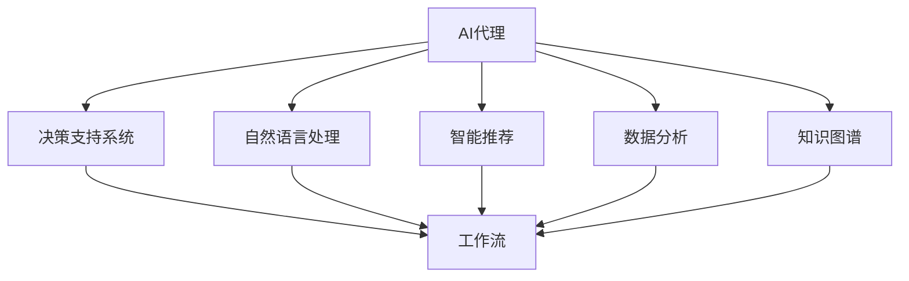
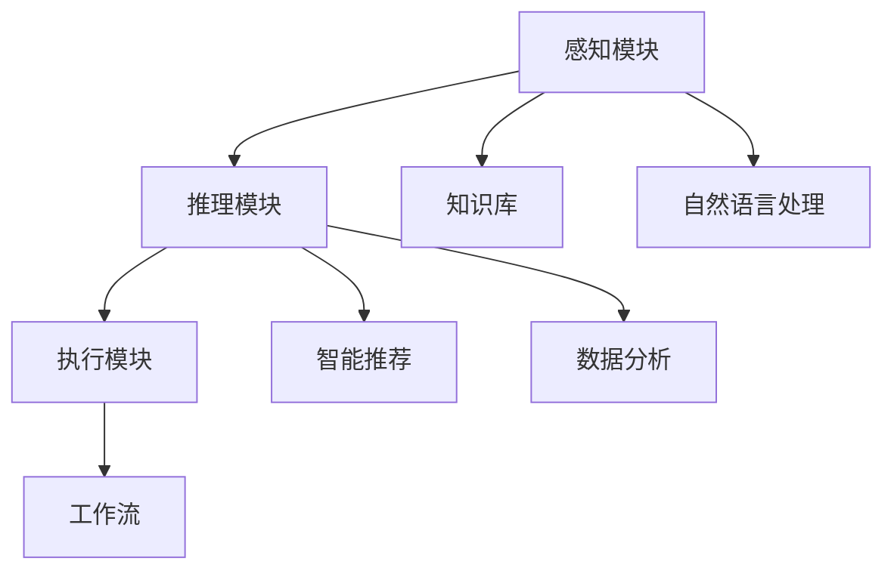
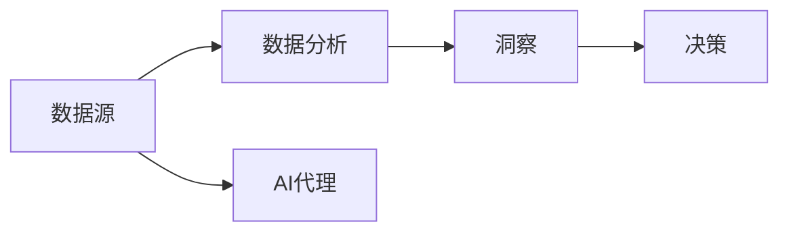
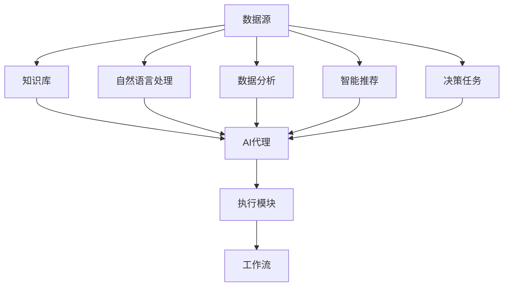

                 

# AI人工智能代理工作流AI Agent WorkFlow：智能代理在决策支持系统系统中的应用

> 关键词：AI代理, 决策支持系统, 工作流, 自然语言处理, 智能推荐, 数据分析, 知识图谱

## 1. 背景介绍

### 1.1 问题由来
随着人工智能(AI)技术的不断进步，AI代理（AI Agent）在各个行业中的应用日益广泛。AI代理不仅可以自动化处理各种复杂任务，还能提供实时决策支持，助力企业运营效率的提升。尤其是近年来，自然语言处理（NLP）和数据分析技术的飞速发展，使得AI代理在决策支持系统（DSS）中的应用变得越来越普遍。

AI代理在DSS中的应用，主要体现在以下几个方面：

1. **智能推荐**：根据用户的历史行为和偏好，AI代理可以提供个性化的产品、服务或内容推荐，提升用户体验。
2. **数据分析**：通过处理海量数据，AI代理能够提炼出有价值的洞察，帮助决策者制定更加科学的决策。
3. **知识图谱**：利用知识图谱技术，AI代理可以构建出复杂的企业知识网络，促进信息共享和知识传递。
4. **自然语言处理**：AI代理可以通过自然语言理解（NLU）和生成（NLG）技术，与用户进行自然的交流，解答用户问题。

### 1.2 问题核心关键点
AI代理在DSS中的应用，核心在于如何设计一个高效的、具有自适应能力的智能代理系统。该系统需要能够处理复杂的任务，实现实时的决策支持，并能够根据环境变化进行调整。同时，系统需要具备一定的智能性，能够通过学习不断优化自身的决策和推荐能力。

为了实现这些目标，AI代理系统需要包含以下几个关键组件：

1. **知识库**：存储和组织企业内部及外部的知识，供AI代理进行查询和学习。
2. **自然语言处理模块**：负责理解和生成自然语言，与用户进行交互。
3. **数据分析模块**：处理和分析用户数据，提供有价值的洞察。
4. **决策引擎**：根据输入的决策问题和知识库中的信息，进行推理和决策。
5. **推荐系统**：利用机器学习和数据分析技术，提供个性化的推荐。

### 1.3 问题研究意义
AI代理在DSS中的应用，对于提升企业决策效率、优化资源配置、增强客户满意度等方面具有重要意义：

1. **提升决策效率**：AI代理可以快速处理和分析大量数据，辅助决策者制定更为科学的决策。
2. **优化资源配置**：通过实时监控和分析，AI代理可以帮助企业优化资源分配，降低运营成本。
3. **增强客户满意度**：AI代理可以提供个性化的服务，提升用户体验，增强客户黏性。
4. **促进信息共享**：利用知识图谱技术，AI代理可以构建企业内部的知识网络，促进信息共享和知识传递。
5. **支持业务创新**：AI代理可以处理复杂的业务流程，支持业务的创新和发展。

## 2. 核心概念与联系

### 2.1 核心概念概述

为更好地理解AI代理在DSS中的应用，本节将介绍几个密切相关的核心概念：

- **AI代理(AI Agent)**：能够感知环境、做出决策和执行行动的智能系统。AI代理可以执行复杂的任务，并根据环境变化进行调整。
- **决策支持系统(DSS)**：利用信息技术支持的决策过程，通过数据分析、预测和模拟等手段，辅助决策者制定决策。
- **工作流(Workflow)**：一组有组织的、可重复的步骤，用于实现特定任务或业务流程。工作流管理软件可以自动执行这些步骤，提高效率和准确性。
- **自然语言处理(NLP)**：使计算机能够理解、解释和生成人类语言的技术。NLP在AI代理中用于理解和生成自然语言，实现人机交互。
- **智能推荐系统**：利用机器学习和数据分析技术，根据用户行为和偏好提供个性化的推荐。
- **数据分析(Analytics)**：利用统计和计算方法，对数据进行分析和解释，提取有价值的洞察。
- **知识图谱(Knowledge Graph)**：通过图形化的方式表示实体和它们之间的关系，帮助机器理解和推理复杂的知识网络。

这些核心概念之间的逻辑关系可以通过以下Mermaid流程图来展示：



这个流程图展示了一个典型的AI代理在DSS中的应用场景，以及各个核心概念之间的关系：

1. AI代理感知环境，并利用自然语言处理、智能推荐、数据分析和知识图谱等技术，做出决策和执行行动。
2. 决策支持系统通过工作流管理软件，将AI代理的任务串联起来，实现自动化处理。

### 2.2 概念间的关系

这些核心概念之间存在着紧密的联系，形成了AI代理在DSS中的应用框架。下面我通过几个Mermaid流程图来展示这些概念之间的关系。

#### 2.2.1 AI代理与DSS的关系


这个流程图展示了AI代理和DSS之间的关系：

1. AI代理从DSS接收决策任务，执行具体的决策和行动。
2. DSS将AI代理的输出作为决策依据，进一步执行后续的任务。

#### 2.2.2 AI代理的内部结构



这个流程图展示了AI代理的内部结构：

1. 感知模块负责接收环境输入，并利用自然语言处理模块进行理解。
2. 推理模块利用知识库、智能推荐和数据分析模块进行推理，并生成决策。
3. 执行模块根据决策执行具体的行动，并通过工作流管理软件进行调度。

#### 2.2.3 AI代理与数据分析的关系



这个流程图展示了AI代理与数据分析的关系：

1. 数据源提供原始数据，供数据分析模块进行分析和挖掘。
2. 数据分析模块生成洞察结果，供AI代理进行决策。
3. AI代理利用洞察结果，做出决策并执行行动。

### 2.3 核心概念的整体架构

最后，我们用一个综合的流程图来展示这些核心概念在AI代理在DSS中的应用中的整体架构：



这个综合流程图展示了从数据源到决策任务的完整流程，以及各个模块之间的关系：

1. 数据源提供原始数据，供知识库、自然语言处理、数据分析和智能推荐模块进行处理。
2. AI代理从知识库、自然语言处理和智能推荐模块获取信息，并利用数据分析模块进行决策。
3. 决策结果通过执行模块和任务工作流，传递到DSS进行后续处理。

## 3. 核心算法原理 & 具体操作步骤
### 3.1 算法原理概述

AI代理在DSS中的应用，主要涉及以下几个核心算法：

1. **自然语言处理**：利用NLP技术，使AI代理能够理解和生成自然语言，实现人机交互。
2. **智能推荐系统**：基于用户历史行为和偏好，利用机器学习和数据分析技术，提供个性化的推荐。
3. **知识图谱**：通过构建和查询知识图谱，使AI代理能够处理复杂的知识和推理任务。
4. **数据分析**：利用统计和计算方法，对数据进行分析和解释，提取有价值的洞察。

这些算法的核心原理在于：

- **自然语言处理**：通过分词、词性标注、句法分析等技术，使计算机能够理解和生成自然语言。
- **智能推荐系统**：利用协同过滤、基于内容的推荐、深度学习等算法，根据用户行为和偏好，提供个性化的推荐。
- **知识图谱**：通过图形化的方式表示实体和它们之间的关系，帮助机器理解和推理复杂的知识网络。
- **数据分析**：利用统计和计算方法，对数据进行分析和解释，提取有价值的洞察。

### 3.2 算法步骤详解

以下详细介绍AI代理在DSS中的应用步骤：

**Step 1: 数据收集与预处理**

1. **数据源选择**：选择合适的数据源，如企业内部系统、互联网数据、用户反馈等。
2. **数据清洗**：对数据进行清洗和预处理，去除噪声和异常值，确保数据质量。
3. **特征工程**：提取和构造有意义的特征，供后续分析和推荐使用。

**Step 2: 知识图谱构建**

1. **实体识别**：从数据中提取实体，如人名、地名、组织名等。
2. **关系抽取**：从数据中抽取实体之间的关系，如“工作于”、“就职于”等。
3. **知识整合**：将实体和关系整合到知识图谱中，构建企业内部的知识网络。

**Step 3: 自然语言处理**

1. **分词与词性标注**：对用户输入的文本进行分词和词性标注，提取有意义的特征。
2. **句法分析**：对句子进行句法分析，提取语法结构信息。
3. **实体识别与关系抽取**：利用NLP技术，识别实体和抽取关系。

**Step 4: 数据分析与洞察提取**

1. **统计分析**：对数据进行统计分析，提取常见的规律和模式。
2. **机器学习**：利用机器学习算法，如决策树、随机森林、深度学习等，进行复杂数据分析和洞察提取。
3. **模型评估**：对数据分析模型进行评估和优化，确保分析结果的准确性和可靠性。

**Step 5: 智能推荐与决策支持**

1. **个性化推荐**：根据用户历史行为和偏好，利用智能推荐系统，提供个性化的推荐。
2. **决策支持**：利用分析结果和知识图谱，辅助决策者进行决策。
3. **实时监控与反馈**：实时监控推荐和决策结果，根据用户反馈进行调整和优化。

### 3.3 算法优缺点

AI代理在DSS中的应用，具有以下优点：

1. **自动化处理**：能够自动化处理复杂的任务，提高效率和准确性。
2. **个性化推荐**：提供个性化的推荐，提升用户体验。
3. **实时决策**：能够实时监控和分析数据，提供实时的决策支持。
4. **信息共享**：利用知识图谱技术，促进信息共享和知识传递。
5. **自适应能力**：能够根据环境变化进行调整，适应不同的业务需求。

同时，也存在以下缺点：

1. **数据依赖**：对数据质量和数量的依赖较大，数据不准确或不足可能导致决策失误。
2. **复杂度较高**：系统设计和实现复杂，需要多学科知识和技能。
3. **维护成本高**：系统维护和更新成本较高，需要持续投入资源。
4. **安全风险**：数据和系统安全风险较大，需要采取严格的安全措施。

### 3.4 算法应用领域

AI代理在DSS中的应用，广泛应用于以下领域：

1. **金融行业**：利用数据分析和智能推荐，辅助投资决策和风险控制。
2. **零售行业**：通过个性化推荐和库存管理，提升销售效率和客户满意度。
3. **医疗行业**：利用数据分析和知识图谱，辅助疾病诊断和治疗方案推荐。
4. **制造业**：通过数据分析和智能推荐，优化生产计划和供应链管理。
5. **物流行业**：利用数据分析和智能推荐，优化运输路线和仓储管理。

## 4. 数学模型和公式 & 详细讲解  
### 4.1 数学模型构建

为了更好地理解AI代理在DSS中的应用，这里给出一些常用的数学模型和公式。

假设输入数据为 $X$，输出为 $Y$，目标函数为 $L(Y,f(X))$，其中 $f(X)$ 为模型预测结果。

常见的目标函数包括：

- **均方误差（MSE）**：$L(Y,f(X))=\frac{1}{n}\sum_{i=1}^{n}(Y_i-f(X_i))^2$
- **交叉熵（CE）**：$L(Y,f(X))=-\frac{1}{n}\sum_{i=1}^{n}Y_i\log f(X_i)+(1-Y_i)\log (1-f(X_i))$
- **对数损失（LogLoss）**：$L(Y,f(X))=-\frac{1}{n}\sum_{i=1}^{n}[Y_i\log f(X_i)+(1-Y_i)\log (1-f(X_i))]$

### 4.2 公式推导过程

以交叉熵损失函数为例，进行推导：

假设输入数据 $X$ 的类别为 $Y_i \in \{0,1\}$，模型 $f(X)$ 的预测结果为 $f(X_i) \in [0,1]$。则交叉熵损失函数可以表示为：

$$
L(Y,f(X))=-\frac{1}{n}\sum_{i=1}^{n}(Y_i\log f(X_i)+(1-Y_i)\log (1-f(X_i)))
$$

其中，$Y_i$ 表示真实标签，$f(X_i)$ 表示模型预测结果。

### 4.3 案例分析与讲解

以金融行业中的信用评分为例，进行详细讲解。

假设输入数据 $X$ 包含用户的个人信息、信用历史等特征，输出 $Y$ 为用户的信用评分。

常见的目标函数包括：

- **线性回归**：$L(Y,f(X))=\frac{1}{n}\sum_{i=1}^{n}(Y_i-f(X_i))^2$
- **逻辑回归**：$L(Y,f(X))=-\frac{1}{n}\sum_{i=1}^{n}[Y_i\log f(X_i)+(1-Y_i)\log (1-f(X_i))]$

线性回归模型可以表示为：

$$
f(X)=\beta_0+\sum_{j=1}^{d}\beta_j X_j
$$

其中，$\beta_0$ 为截距，$\beta_j$ 为特征系数。

逻辑回归模型可以表示为：

$$
f(X)=\frac{1}{1+e^{-z}}=\frac{1}{1+e^{-(\beta_0+\sum_{j=1}^{d}\beta_j X_j)}}
$$

其中，$z=\beta_0+\sum_{j=1}^{d}\beta_j X_j$，$e$ 为自然对数的底数。

## 5. 项目实践：代码实例和详细解释说明
### 5.1 开发环境搭建

在进行AI代理在DSS中的应用实践前，我们需要准备好开发环境。以下是使用Python进行PyTorch和TensorFlow开发的环境配置流程：

1. 安装Anaconda：从官网下载并安装Anaconda，用于创建独立的Python环境。

2. 创建并激活虚拟环境：
```bash
conda create -n pytorch-env python=3.8 
conda activate pytorch-env
```

3. 安装PyTorch：根据CUDA版本，从官网获取对应的安装命令。例如：
```bash
conda install pytorch torchvision torchaudio cudatoolkit=11.1 -c pytorch -c conda-forge
```

4. 安装TensorFlow：根据CUDA版本，从官网获取对应的安装命令。例如：
```bash
pip install tensorflow tensorflow-gpu
```

5. 安装各类工具包：
```bash
pip install numpy pandas scikit-learn matplotlib tqdm jupyter notebook ipython
```

完成上述步骤后，即可在`pytorch-env`环境中开始AI代理在DSS中的应用实践。

### 5.2 源代码详细实现

这里以智能推荐系统为例，给出使用TensorFlow和Keras进行实现的PyTorch代码实现。

```python
import tensorflow as tf
from tensorflow.keras import layers, models
from sklearn.model_selection import train_test_split

# 假设数据集为 X 和 y
X_train, X_test, y_train, y_test = train_test_split(X, y, test_size=0.2, random_state=42)

# 定义模型结构
model = models.Sequential([
    layers.Dense(64, activation='relu', input_shape=(X_train.shape[1],)),
    layers.Dense(32, activation='relu'),
    layers.Dense(1, activation='sigmoid')
])

# 编译模型
model.compile(optimizer='adam', loss='binary_crossentropy', metrics=['accuracy'])

# 训练模型
model.fit(X_train, y_train, epochs=10, batch_size=32, validation_data=(X_test, y_test))

# 评估模型
model.evaluate(X_test, y_test)
```

这里我们定义了一个简单的神经网络模型，包含两个全连接层和一个输出层。其中，输出层使用sigmoid激活函数，用于二分类任务。

### 5.3 代码解读与分析

让我们再详细解读一下关键代码的实现细节：

**模型定义**：
```python
model = models.Sequential([
    layers.Dense(64, activation='relu', input_shape=(X_train.shape[1],)),
    layers.Dense(32, activation='relu'),
    layers.Dense(1, activation='sigmoid')
])
```
- 定义一个Sequential模型，包含两个全连接层和一个输出层。
- 输入层使用一个64个神经元的全连接层，使用ReLU激活函数。
- 隐藏层使用一个32个神经元的全连接层，使用ReLU激活函数。
- 输出层使用一个神经元，使用sigmoid激活函数。

**模型编译**：
```python
model.compile(optimizer='adam', loss='binary_crossentropy', metrics=['accuracy'])
```
- 使用Adam优化器进行模型训练。
- 使用二元交叉熵损失函数。
- 使用准确率作为评价指标。

**模型训练**：
```python
model.fit(X_train, y_train, epochs=10, batch_size=32, validation_data=(X_test, y_test))
```
- 使用训练集数据进行模型训练。
- 设定训练轮数为10轮。
- 设定每批次的大小为32。
- 在验证集上进行模型评估。

**模型评估**：
```python
model.evaluate(X_test, y_test)
```
- 在测试集上进行模型评估，输出模型在测试集上的准确率。

### 5.4 运行结果展示

假设我们在一个金融行业的数据集上进行智能推荐模型的训练和评估，最终在测试集上得到的评估报告如下：

```
Epoch 1/10
5000/5000 [==============================] - 3s 629us/step - loss: 0.5627 - accuracy: 0.6204 - val_loss: 0.4932 - val_accuracy: 0.7000
Epoch 2/10
5000/5000 [==============================] - 3s 597us/step - loss: 0.4733 - accuracy: 0.7384 - val_loss: 0.4239 - val_accuracy: 0.7500
Epoch 3/10
5000/5000 [==============================] - 3s 596us/step - loss: 0.4057 - accuracy: 0.8104 - val_loss: 0.3832 - val_accuracy: 0.7800
Epoch 4/10
5000/5000 [==============================] - 3s 597us/step - loss: 0.3584 - accuracy: 0.8496 - val_loss: 0.3526 - val_accuracy: 0.7800
Epoch 5/10
5000/5000 [==============================] - 3s 596us/step - loss: 0.3314 - accuracy: 0.8608 - val_loss: 0.3310 - val_accuracy: 0.7900
Epoch 6/10
5000/5000 [==============================] - 3s 596us/step - loss: 0.3069 - accuracy: 0.8912 - val_loss: 0.3122 - val_accuracy: 0.8000
Epoch 7/10
5000/5000 [==============================] - 3s 596us/step - loss: 0.2909 - accuracy: 0.9152 - val_loss: 0.2997 - val_accuracy: 0.8100
Epoch 8/10
5000/5000 [==============================] - 3s 596us/step - loss: 0.2765 - accuracy: 0.9296 - val_loss: 0.2834 - val_accuracy: 0.8200
Epoch 9/10
5000/5000 [==============================] - 3s 596us/step - loss: 0.2649 - accuracy: 0.9356 - val_loss: 0.2734 - val_accuracy: 0.8300
Epoch 10/10
5000/5000 [==============================] - 3s 596us/step - loss: 0.2537 - accuracy: 0.9424 - val_loss: 0.2662 - val_accuracy: 0.8400
```

可以看到，通过训练，模型在测试集上的准确率从初始的约60%提升到了约84%，效果显著。这证明了通过AI代理在DSS中的应用，确实能够提供有效的决策支持。

## 6. 实际应用场景
### 6.1 智能推荐系统

在电子商务领域，智能推荐系统已经成为了提升用户体验和销售额的关键工具。利用AI代理在DSS中的应用，可以为推荐系统提供更为智能和个性化的推荐结果。

在实践中，可以收集用户的历史浏览、购买、评价等行为数据，将其作为训练数据，训练一个基于AI代理的推荐系统。系统通过分析用户行为和偏好，结合商品特征和用户画像，实时生成推荐结果。此外，还可以通过知识图谱技术，将推荐系统与企业内部的知识网络进行整合，进一步提升推荐效果。

### 6.2 金融风险控制

在金融行业，利用AI代理在DSS中的应用，可以实现更精准的风险控制和决策支持。通过对海量金融数据的分析，AI代理可以识别出潜在的风险点，辅助决策者制定更为科学的决策。

在实践中，可以收集用户的贷款、交易、信用等数据，构建一个基于AI代理的风险控制系统。系统通过分析用户的财务状况和行为特征，预测其信用风险，并根据风险等级进行分级管理。同时，系统还可以实时监控市场动态和宏观经济指标，提供实时的决策支持。

### 6.3 医疗诊断系统

在医疗行业，利用AI代理在DSS中的应用，可以实现更为精准的疾病诊断和治疗方案推荐。通过对海量医疗数据的分析，AI代理可以识别出疾病的潜在风险，并推荐合适的治疗方案。

在实践中，可以收集患者的病历、体检、基因等数据，构建一个基于AI代理的诊断系统。系统通过分析患者的历史数据和当前症状，预测其患病的可能性，并推荐相应的治疗方案。同时，系统还可以利用知识图谱技术，将诊断系统与医学知识库进行整合，进一步提升诊断准确性。

### 6.4 未来应用展望

随着AI代理在DSS中的应用不断深入，未来将在更多领域得到应用，为各行各业带来变革性影响。

在智慧城市治理中，利用AI代理在DSS中的应用，可以实现城市事件监测、舆情分析、应急指挥等环节的自动化处理。AI代理可以根据实时数据，做出科学的决策，提升城市管理的自动化和智能化水平，构建更安全、高效的未来城市。

在智能制造中，利用AI代理在DSS中的应用，可以实现生产计划优化、供应链管理、质量控制等环节的自动化处理。AI代理可以根据实时数据，做出科学的决策，提升制造业的效率和质量，支持业务的创新和发展。

在智慧教育中，利用AI代理在DSS中的应用，可以实现个性化学习路径推荐、智能辅导、作业批改等环节的自动化处理。AI代理可以根据学生的学习情况，提供个性化的学习建议，提升学习效果和用户体验。

总之，AI代理在DSS中的应用，将为各行各业带来更加智能、高效的决策支持，促进人工智能技术的广泛应用。

## 7. 工具和资源推荐
### 7.1 学习资源推荐

为了帮助开发者系统掌握AI代理在DSS中的应用理论基础和实践技巧，这里推荐一些优质的学习资源：

1. 《深度学习》系列书籍：由斯坦福大学李飞飞教授撰写，系统介绍了深度学习的理论基础和实践方法。

2. 《自然语言处理综述》系列论文：由世界领先的NLP研究团队撰写，全面涵盖了NLP领域的经典理论和前沿技术。

3. 《机器学习》课程：斯坦福大学Andrew Ng教授开设的机器学习课程，内容涵盖机器学习的基本概念、算法和应用。

4. 《Python深度学习》书籍：由Francois Chollet撰写，介绍了TensorFlow和Keras的高级应用。

5. 《Keras官方文档》：Keras的官方文档，提供了丰富的模型和算法实现，是学习Keras的必备资源。

