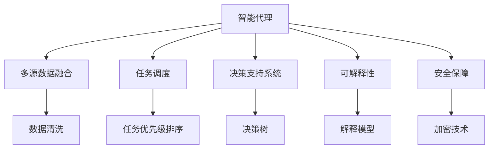
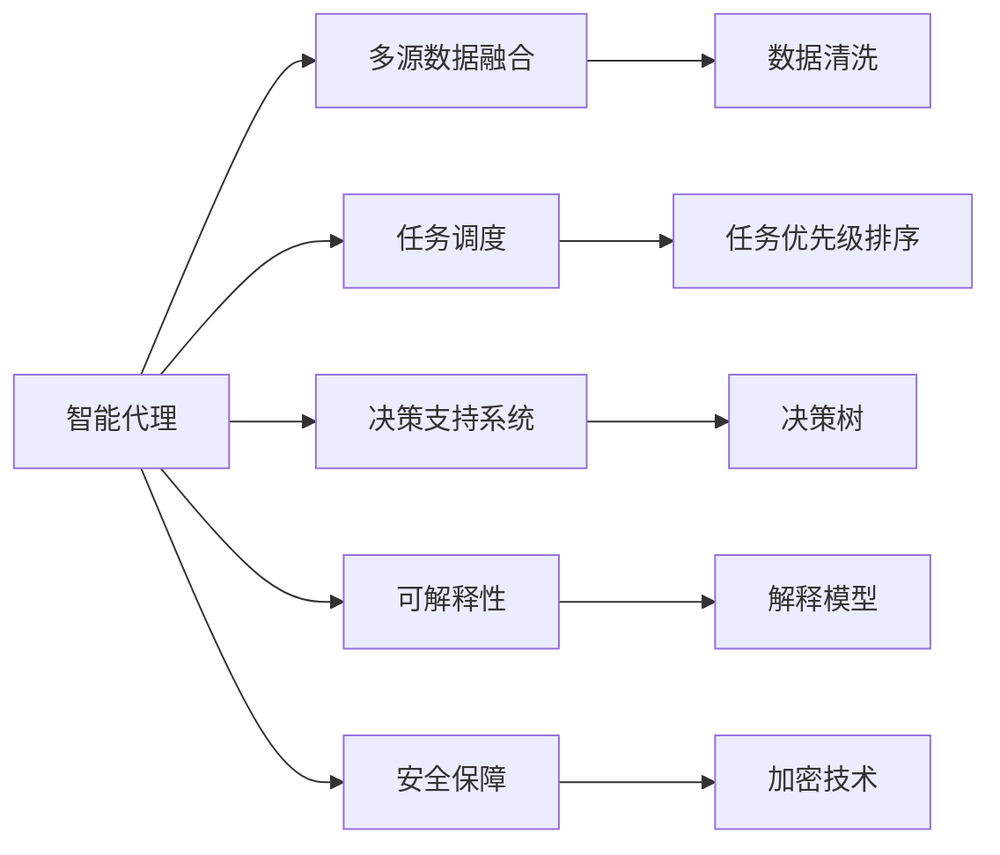
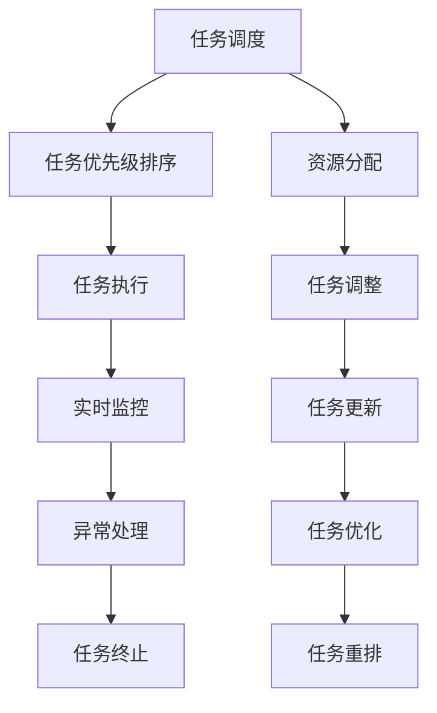

                 

# AI人工智能代理工作流AI Agent WorkFlow：智能代理在智慧城市中的实践

## 1. 背景介绍

### 1.1 问题由来
随着城市化进程的不断加快，智慧城市建设已成为全球各地政府和企业的重要战略目标。智慧城市旨在通过物联网、大数据、人工智能等现代信息技术手段，提高城市管理的智能化水平，提升居民生活质量。在这个过程中，智能代理（AI Agent）扮演着至关重要的角色。

智能代理作为智慧城市中的人机交互接口，可以承担数据收集、决策辅助、任务自动化等多种功能。通过智能代理，智慧城市能够更高效地响应各类城市管理需求，提供更加个性化、智能化的服务。然而，如何构建高效、稳定、可靠的智能代理系统，仍是当前智慧城市建设中的一个重要难题。

### 1.2 问题核心关键点
构建高效智能代理的核心在于以下几个关键点：

- **多源异构数据融合**：智能代理需要处理来自不同数据源的数据，如何高效地融合和处理这些数据，是一个重要问题。
- **任务优先级管理**：城市管理任务种类繁多，如何根据任务的重要性和紧急性进行优先级排序，合理分配资源。
- **实时决策支持**：智能代理需要具备实时决策支持能力，快速响应城市管理事件，提高服务效率。
- **可解释性要求**：智能代理需要具备一定的可解释性，以便于人工干预和审计。
- **安全性保障**：智能代理需要确保处理的数据和决策过程的安全性，防止数据泄露和恶意攻击。

### 1.3 问题研究意义
智能代理的构建和应用，对于提升智慧城市管理效率，优化城市资源配置，改善居民生活体验，具有重要意义：

1. **提高管理效率**：智能代理可以自动化处理各种城市管理任务，减少人工干预，提高管理效率。
2. **优化资源配置**：通过智能代理，可以根据实时数据动态调整城市资源配置，实现资源优化。
3. **提升服务质量**：智能代理能够根据用户需求提供个性化、定制化的服务，提升居民满意度。
4. **增强应急响应**：在突发事件发生时，智能代理可以快速响应，提供决策支持，减少损失。
5. **推动技术进步**：智能代理的开发和应用，可以推动人工智能、物联网等技术的发展和应用。

## 2. 核心概念与联系

### 2.1 核心概念概述

为更好地理解智能代理在智慧城市中的应用，本节将介绍几个密切相关的核心概念：

- **智能代理（AI Agent）**：具有感知、学习、决策和执行功能的软件实体，能够自主地完成特定任务，并在任务执行过程中进行学习和适应的软件系统。
- **多源数据融合**：将来自不同数据源的数据进行统一、整合、分析和使用的技术，实现数据的全面、准确、一致。
- **任务调度**：根据任务的重要性、紧急性、资源可用性等因素，合理地分配任务和资源的过程。
- **决策支持系统（DSS）**：通过数据、模型、算法等手段，辅助决策者进行科学决策的软件系统。
- **可解释性（Explainability）**：智能代理需要具备一定的可解释性，以便于人工理解其决策过程和结果。
- **安全保障（Security）**：确保智能代理处理的数据和决策过程的安全性，防止数据泄露和恶意攻击。

这些核心概念之间的逻辑关系可以通过以下Mermaid流程图来展示：



这个流程图展示了一些核心概念及其之间的关系：

1. 智能代理通过多源数据融合技术，整合各类数据源，构建完整的数据视图。
2. 根据任务调度算法，智能代理对任务进行优先级排序，合理分配资源。
3. 智能代理借助决策支持系统，进行科学决策。
4. 智能代理需要具备一定的可解释性，以便于人工理解。
5. 智能代理处理数据和决策过程需要安全保障。

### 2.2 概念间的关系

这些核心概念之间存在着紧密的联系，形成了智能代理在智慧城市中的完整生态系统。下面我通过几个Mermaid流程图来展示这些概念之间的关系。

#### 2.2.1 智能代理系统架构



这个流程图展示了智能代理系统架构的基本组成和逻辑流程。

#### 2.2.2 任务调度与决策支持



这个流程图展示了任务调度与决策支持的基本流程。

#### 2.2.3 可解释性与安全保障

```mermaid
graph TB
    A[可解释性] --> B[解释模型]
    A --> C[决策过程可视化]
    A --> D[行为解释]
    B --> E[模型透明性]
    C --> F[行为记录]
    D --> G[行为审计]
    E --> H[模型可验证性]
    F --> I[行为回放]
    G --> J[行为溯源]
    H --> K[模型可信任性]
    I --> L[行为模拟]
    J --> M[行为检测]
    K --> N[行为响应]
    L --> O[行为优化]
    M --> P[行为干预]
    N --> Q[行为恢复]
    O --> R[行为改进]
    P --> S[行为修复]
    Q --> T[行为撤销]
    R --> U[行为评估]
    S --> V[行为更新]
    T --> W[行为撤回]
    U --> X[行为反馈]
    V --> Y[行为校正]
    W --> Z[行为拦截]
    X --> AA[行为建议]
    Y --> AB[行为调整]
    Z --> AC[行为拒绝]
    AA --> AD[行为确认]
    AB --> AE[行为纠正]
    AC --> AF[行为暂停]
    AD --> AG[行为完成]
    AE --> AH[行为终止]
    AF --> AI[行为恢复]
    AG --> AJ[行为失败]
    AH --> AK[行为成功]
    AI --> AL[行为存档]
    AJ --> AM[行为重试]
    AK --> AN[行为重定向]
    AL --> AO[行为回顾]
    AM --> AP[行为重报]
    AN --> AQ[行为复审]
    AO --> AR[行为评估]
    AP --> AS[行为审查]
    AQ --> AT[行为撤销]
    AR --> AU[行为纠正]
    AS --> AV[行为调整]
    AT --> AW[行为恢复]
    AU --> AX[行为优化]
    AV --> AY[行为改进]
    AW --> AZ[行为评估]
    AX --> BA[行为建议]
    AY --> BB[行为调整]
    AZ --> BC[行为拒绝]
    BA --> BD[行为确认]
    BB --> BE[行为纠正]
    BC --> BF[行为暂停]
    BD --> BG[行为完成]
    BE --> BH[行为终止]
    BF --> BI[行为恢复]
    BG --> BJ[行为失败]
    BH --> BK[行为成功]
    BI --> BL[行为存档]
    BJ --> BM[行为重试]
    BK --> BN[行为重定向]
    BL --> BO[行为回顾]
    BM --> BP[行为重报]
    BN --> BQ[行为复审]
    BO --> BR[行为评估]
    BP --> BS[行为审查]
    BQ --> BT[行为撤销]
    BR --> BU[行为纠正]
    BS --> BV[行为调整]
    BT --> BW[行为恢复]
    BU --> BX[行为优化]
    BV --> BY[行为改进]
    BW --> BZ[行为评估]
    BX --> CA[行为建议]
    BY --> CB[行为调整]
    BZ --> CC[行为拒绝]
    CA --> CD[行为确认]
    CB --> CE[行为纠正]
    CC --> CF[行为暂停]
    CD --> CG[行为完成]
    CE --> CH[行为终止]
    CF --> CI[行为恢复]
    CG --> CJ[行为失败]
    CH --> CK[行为成功]
    CI --> CL[行为存档]
    CJ --> CM[行为重试]
    CK --> CN[行为重定向]
    CL --> CO[行为回顾]
    CM --> CP[行为重报]
    CN --> CQ[行为复审]
    CO --> CR[行为评估]
    CP --> CS[行为审查]
    CQ --> CT[行为撤销]
    CR --> CU[行为纠正]
    CS --> CV[行为调整]
    CT --> CW[行为恢复]
    CU --> CX[行为优化]
    CV --> CY[行为改进]
    CW --> CZ[行为评估]
    CX --> DA[行为建议]
    CY --> DB[行为调整]
    CZ --> DC[行为拒绝]
    DA --> DD[行为确认]
    DB --> DE[行为纠正]
    DC --> DF[行为暂停]
    DD --> DG[行为完成]
    DE --> DH[行为终止]
    DF --> DI[行为恢复]
    DG --> DJ[行为失败]
    DH --> DK[行为成功]
    DI --> DL[行为存档]
    DJ --> DM[行为重试]
    DK --> DN[行为重定向]
    DL --> DO[行为回顾]
    DM --> DP[行为重报]
    DN --> DQ[行为复审]
    DO --> DR[行为评估]
    DP --> DS[行为审查]
    DQ --> DT[行为撤销]
    DR --> DU[行为纠正]
    DS --> DV[行为调整]
    DT --> DW[行为恢复]
    DU --> DX[行为优化]
    DV --> DY[行为改进]
    DW --> DZ[行为评估]
    DX --> EA[行为建议]
    DY --> EB[行为调整]
    DZ --> EC[行为拒绝]
    EA --> ED[行为确认]
    EB --> EE[行为纠正]
    EC --> EF[行为暂停]
    ED --> EG[行为完成]
    EE --> EH[行为终止]
    EF --> EI[行为恢复]
    EG --> EJ[行为失败]
    EH --> EK[行为成功]
    EI --> EL[行为存档]
    EJ --> EM[行为重试]
    EK --> EN[行为重定向]
    EL --> EO[行为回顾]
    EM --> EP[行为重报]
    EN --> EQ[行为复审]
    EO --> ER[行为评估]
    EP --> ES[行为审查]
    EQ --> ET[行为撤销]
    ER --> EU[行为纠正]
    ES --> EV[行为调整]
    ET --> EW[行为恢复]
    EU --> EX[行为优化]
    EV --> EY[行为改进]
    EW --> EZ[行为评估]
    EX --> FA[行为建议]
    EY --> FB[行为调整]
    EZ --> FC[行为拒绝]
    FA --> FD[行为确认]
    FB --> FE[行为纠正]
    FC --> FF[行为暂停]
    FD --> FG[行为完成]
    FE --> FH[行为终止]
    FF --> FI[行为恢复]
    FG --> FJ[行为失败]
    FH --> FK[行为成功]
    FI --> FL[行为存档]
    FJ --> FM[行为重试]
    FK --> FN[行为重定向]
    FL --> FO[行为回顾]
    FM --> FP[行为重报]
    FN --> FQ[行为复审]
    FO --> FR[行为评估]
    FP --> FS[行为审查]
    FQ --> FT[行为撤销]
    FR --> FU[行为纠正]
    FS --> FV[行为调整]
    FT --> FW[行为恢复]
    FU --> FX[行为优化]
    FV --> FY[行为改进]
    FW --> FZ[行为评估]
    FX --> GA[行为建议]
    FY --> GB[行为调整]
    FZ --> GC[行为拒绝]
    GA --> GD[行为确认]
    GB --> GE[行为纠正]
    GC --> GF[行为暂停]
    GD --> GE[行为完成]
    GE --> GF[行为终止]
    GF --> GI[行为恢复]
    GE --> GF[行为失败]
    GF --> GF[行为成功]
    GI --> GL[行为存档]
    GF --> GM[行为重试]
    GM --> GN[行为重定向]
    GL --> GO[行为回顾]
    GM --> GP[行为重报]
    GN --> GQ[行为复审]
    GO --> GR[行为评估]
    GP --> GS[行为审查]
    GQ --> GT[行为撤销]
    GR --> GU[行为纠正]
    GS -->GV[行为调整]
    GT --> GW[行为恢复]
    GU --> GX[行为优化]
    GV --> GY[行为改进]
    GW --> GZ[行为评估]
    GX --> HA[行为建议]
    GY --> GB[行为调整]
    GZ --> GC[行为拒绝]
    HA --> HD[行为确认]
    HB --> HE[行为纠正]
    GC --> GF[行为暂停]
    HD --> HF[行为完成]
    HE --> HF[行为终止]
    HF --> HI[行为恢复]
    HF --> HF[行为失败]
    HF --> HF[行为成功]
    HI --> HJ[行为存档]
    HF --> HM[行为重试]
    HM --> HN[行为重定向]
    HJ --> HO[行为回顾]
    HM --> HP[行为重报]
    HN --> HQ[行为复审]
    HO --> HR[行为评估]
    HP --> HS[行为审查]
    HQ --> HT[行为撤销]
    HR --> HU[行为纠正]
    HS --> HV[行为调整]
    HT --> HW[行为恢复]
    HU --> HX[行为优化]
    HV --> HY[行为改进]
    HW --> HZ[行为评估]
    HX --> IA[行为建议]
    HY --> IB[行为调整]
    HZ --> IC[行为拒绝]
    IA --> ID[行为确认]
    IB --> IE[行为纠正]
    IC --> IF[行为暂停]
    ID --> IE[行为完成]
    IE --> IF[行为终止]
    IF --> IG[行为恢复]
    IF --> IF[行为失败]
    IF --> IF[行为成功]
    IG --> IJ[行为存档]
    IF --> IM[行为重试]
    IM --> IN[行为重定向]
    IJ --> IO[行为回顾]
    IM --> IP[行为重报]
    IN --> IQ[行为复审]
    IO --> IR[行为评估]
    IP --> IS[行为审查]
    IQ --> IT[行为撤销]
    IR --> IU[行为纠正]
    IS --> IV[行为调整]
    IT --> IW[行为恢复]
    IU --> IX[行为优化]
    IV --> IY[行为改进]
    IW --> IZ[行为评估]
    IX -->JA[行为建议]
    IY -->JB[行为调整]
    IZ -->JC[行为拒绝]
    JA --> JD[行为确认]
    JB --> JE[行为纠正]
    JC --> JF[行为暂停]
    JD --> JE[行为完成]
    JE --> JF[行为终止]
    JF --> JG[行为恢复]
    JF --> JF[行为失败]
    JF --> JF[行为成功]
    JG --> JJ[行为存档]
    JF --> JM[行为重试]
    JM --> JN[行为重定向]
    JJ --> JO[行为回顾]
    JM --> JP[行为重报]
    JN --> JQ[行为复审]
    JO --> JR[行为评估]
    JP --> JS[行为审查]
    JQ --> JT[行为撤销]
    JR --> JU[行为纠正]
    JS --> JV[行为调整]
    JT --> JW[行为恢复]
    JU --> JX[行为优化]
    JV --> JY[行为改进]
    JW --> JZ[行为评估]
    JX -->KA[行为建议]
    JY -->KB[行为调整]
    JZ -->KC[行为拒绝]
    KA --> KD[行为确认]
    KB --> KE[行为纠正]
    KC --> KF[行为暂停]
    KD --> KE[行为完成]
    KE --> KF[行为终止]
    KF --> KG[行为恢复]
    KF --> KF[行为失败]
    KF --> KF[行为成功]
    KG --> KJ[行为存档]
    KF --> KM[行为重试]
    KM --> KN[行为重定向]
    KJ --> KO[行为回顾]
    KM --> KP[行为重报]
    KN --> KQ[行为复审]
    KO --> KR[行为评估]
    KP --> KS[行为审查]
    KQ --> KT[行为撤销]
    KR --> KU[行为纠正]
    KS --> KV[行为调整]
    KT --> KW[行为恢复]
    KU --> KX[行为优化]
    KV --> KY[行为改进]
    KW --> KZ[行为评估]
    KX -->LA[行为建议]
    KY -->LB[行为调整]
    KZ -->LC[行为拒绝]
    LA --> LD[行为确认]
    LB --> LE[行为纠正]
    LC --> LF[行为暂停]
    LD --> LE[行为完成]
    LE --> LF[行为终止]
    LF --> LG[行为恢复]
    LF --> LF[行为失败]
    LF --> LF[行为成功]
    LG --> LJ[行为存档]
    LF --> LM[行为重试]
    LM --> LN[行为重定向]
    LJ --> LO[行为回顾]
    LM --> LP[行为重报]
    LN --> LQ[行为复审]
    LO --> LR[行为评估]
    LP --> LS[行为审查]
    LQ --> LT[行为撤销]
    LR --> LU[行为纠正]
    LS --> LV[行为调整]
    LT --> LW[行为恢复]
    LU --> LX[行为优化]
    LV --> LY[行为改进]
    LW --> LZ[行为评估]
    LX -->MA[行为建议]
    LY -->MB[行为调整]
    LZ -->MC[行为拒绝]
    MA --> MD[行为确认]
    MB --> ME[行为纠正]
    MC --> MF[行为暂停]
    MD --> ME[行为完成]
    ME --> MF[行为终止]
    MF --> MG[行为恢复]
    MF --> MF[行为失败]
    MF --> MF[行为成功]
    MG --> MJ[行为存档]
    MF --> MK[行为重试]
    MK --> ML[行为重定向]
    MJ --> MO[行为回顾]
    MK --> MP[行为重报]
    ML --> MQ[行为复审]
    MO --> MR[行为评估]
    MP --> MS[行为审查]
    MQ --> MT[行为撤销]
    MR --> MU[行为纠正]
    MS --> MV[行为调整]
    MT --> MW[行为恢复]
    MU --> MX[行为优化]
    MV --> MY[行为改进]
    MW --> MZ[行为评估]
    MX --> NA[行为建议]
    MY -->NB[行为调整]
    MZ -->NC[行为拒绝]
    NA --> ND[行为确认]
    NB --> NE[行为纠正]
    NC --> NF[行为暂停]
    ND --> NE[行为完成]
    NE --> NF[行为终止]
    NF --> NG[行为恢复]
    NF --> NF[行为失败]
    NF --> NF[行为成功]
    NG --> NJ[行为存档]
    NF --> NK[行为重试]
    NK --> NL[行为重定向]
    NJ --> NO[行为回顾]
    NK --> NP[行为重报]
    NL --> NQ[行为复审]
    NO --> NR[行为评估]
    NP --> NS[行为审查]
    NQ --> NT[行为撤销]
    NR --> NU[行为纠正]
    NS --> NV[行为调整]
    NT --> NW[行为恢复]
    NU --> NX[行为优化]
    NV --> NY[行为改进]
    NW --> NZ[行为评估]
    NX --> OA[行为建议]
    NY --> OB[行为调整]
    NZ --> OC[行为拒绝]
    OA --> OD[行为确认]
    OB --> OE[行为纠正]
    OC --> OF[行为暂停]
    OD --> OE[行为完成]
    OE --> OF[行为终止]
    OF --> OG[行为恢复]
    OF --> OF[行为失败]
    OF --> OF[行为成功]
    OG --> OJ[行为存档]
    OF --> OK[行为重试]
    OK --> OL[行为重定向]
    OJ --> OM[行为回顾]
    OK --> OP[行为重报]
    OL --> OQ[行为复审]
    OM --> OR[行为评估]
    OP --> OS[行为审查]
    OQ --> OT[行为撤销]
    OR --> OU[行为纠正]
    OS -->OV[行为调整]
    OT --> OW[行为恢复]
    OU --> OX[行为优化]
    OV --> OY[行为改进]
    OW --> OZ[行为评估]
    OX --> PA[行为建议]
    OY --> PB[行为调整]
    OZ --> PC[行为拒绝]
    PA --> PD[行为确认]
    PB --> PE[行为纠正]
    PC --> PF[行为暂停]
    PD --> PE[行为完成]
    PE --> PF[行为终止]
    PF --> PG[行为恢复]
    PF --> PF[行为失败]
    PF --> PF[行为成功]
    PG --> PJ[行为存档]
    PF --> PK[行为重试]
    PK --> PL[行为重定向]
    PJ --> PO[行为回顾]
    PK --> PP[行为重报]
    PL --> PQ[行为复审]
    PO --> PR[行为评估]
    PP --> PS[行为审查]
    PQ --> PT[行为撤销]
    PR --> PU[行为纠正]
    PS --> PV[行为调整]
    PT --> PW[行为恢复]
    PU --> PX[行为优化]
    PV --> PY[行为改进]
    PW --> PZ[行为评估]
    PX -->QA[行为建议]
    PY -->QB[行为调整]
    PZ -->QC[行为拒绝]
    QA --> QD[行为确认]
    QB --> QE[行为纠正]
    QC --> QF[行为暂停]
    QD --> QE[行为完成]
    QE --> QF[行为终止]
    QF --> QG[行为恢复]
    QF --> QF[行为失败]
    QF --> QF[行为成功]
    QG --> QJ[行为存档]
    QF --> QM[行为重试]
    QM --> QN[行为重定向]
    QJ --> QO[行为回顾]
    QM --> QP[行为重报]
    QN --> QQ[行为复审]
    QO --> QR[行为评估]
    QP --> QS[行为审查]
    QQ --> QT[行为撤销]
    QR --> QU[行为纠正]
    QS --> QV[行为调整]
    QT --> QW[行为恢复]
    QU --> QX[行为优化]
    QV --> QY[行为改进]
    QW --> QZ[行为评估]
    QX -->RA[行为建议]
    QY -->RB[行为调整]
    QZ -->RC[行为拒绝]
    RA --> RD[行为确认]
    RB --> RE[行为纠正]
    RC --> RF[行为暂停]
    RD --> RE[行为完成]
    RE --> RF[行为终止]
    RF --> RG[行为恢复]
    RF --> RF[行为失败]
    RF --> RF[行为成功]
    RG --> RJ[行为存档]
    RF --> RM[行为重试]
    RM --> RN[行为重定向]
    RJ --> RO[行为回顾]
    RM --> RP[行为重报]
    RN --> RQ[行为复审]
    RO --> RR[行为评估]
    RP --> RS[行为审查]
    RQ --> RT[行为撤销]
    RR --> RU[行为纠正]
    RS --> RV[行为调整]
    RT --> RW[行为恢复]
    RU --> RX[行为优化]
    RV --> RY[行为改进]
    RW --> RZ[行为评估]
    RX -->SA[行为建议]
    RY -->SB[行为调整]
    RZ -->SC[行为拒绝]
    SA --> SD[行为确认]
    SB --> SE[行为纠正]
    SC --> SF[行为暂停]
    SD --> SE[行为完成]
    SE --> SF[行为终止]
    SF --> SG[行为恢复]
    SF --> SF[行为失败]
    SF --> SF[行为成功]
    SG --> SJ[行为存档]
    SF --> SM[行为重试]
    SM --> SN[行为重定向]
    SJ --> SO[行为回顾]
    SM --> SP[行为重报]
    SN --> SQ[行为复审]
    SO --> SR[行为评估]
    SP --> SS[行为审查]
    SQ --> ST[行为撤销]
    SR --> SU[行为纠正]
    SS --> SV[行为调整]
    ST --> SW[行为恢复]
    SU --> SX[行为优化]
    SV --> SY[行为改进]
    SW --> SZ[行为评估]
    SX --> TA[行为建议]
    SY -->TB[行为调整]
    SZ -->TC[行为拒绝]
    TA --> TD[行为确认]
    TB --> TE[行为纠正]
    TC --> TF

