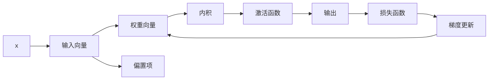
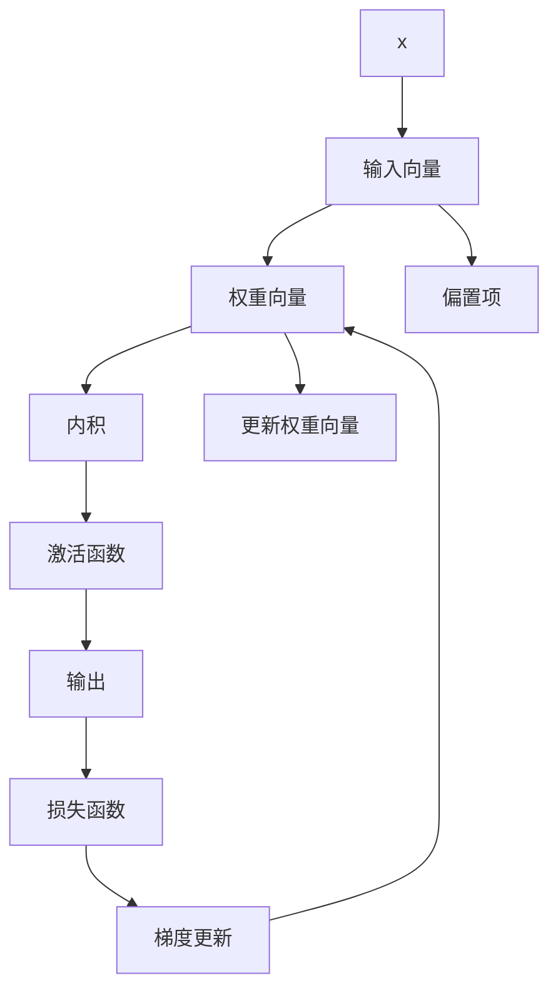

                 

# AI人工智能核心算法原理与代码实例讲解：感知器

## 1. 背景介绍

### 1.1 问题由来

感知器(Perceptron)是人工智能领域最早被提出并广泛应用的算法之一，由Rosenblatt在1958年首次提出，用于解决二分类问题。感知器算法基于一种简单的线性分类器，通过不断迭代调整模型参数，使得模型能够更好地区分不同类别的数据点。

感知器在机器学习历史中占有重要地位，不仅为后续的神经网络算法奠定了基础，还启发了决策树、支持向量机等多种分类算法的发展。虽然在现代深度学习算法中，感知器的应用已经相对较少，但其原理简单、易于理解，仍然具有很高的理论价值和应用价值。

### 1.2 问题核心关键点

感知器算法的核心在于通过一系列的参数更新，使得模型能够准确地分类数据。其核心思想是通过计算输入向量和权重向量之间的内积，判断输入向量是否属于某一类别，并在每次迭代中不断调整权重，使得模型输出尽可能逼近真实标签。

在实际应用中，感知器的参数更新通常采用简单的梯度下降算法，通过计算模型在每个样本上的损失函数，更新权重向量。感知器的优缺点如下：

- **优点**：
  - 简单直观：感知器算法实现简单，易于理解和实现。
  - 可解释性：感知器的输出结果可以直接解释，易于理解其决策过程。
  - 适应性强：感知器可以适应不同特征空间和分类任务。

- **缺点**：
  - 梯度消失：在深度神经网络中，梯度可能会随着反向传播的层数增加而逐渐消失，导致深层神经网络的训练困难。
  - 局部最优：感知器算法容易陷入局部最优，难以找到全局最优解。
  - 无法处理非线性问题：感知器只能处理线性分类问题，对于非线性问题需要引入非线性激活函数等技术。

尽管如此，感知器算法仍然是机器学习领域的重要基础，对于理解后续高级算法具有重要作用。

## 2. 核心概念与联系

### 2.1 核心概念概述

感知器算法基于线性分类模型，用于解决二分类问题。其主要组成部分包括：

- **输入层**：接收输入向量 $x$，可以是多种特征的组合。
- **权重向量**：模型的参数，用于计算输入向量与模型之间的内积。
- **偏置项**：用于调整内积的偏移量。
- **激活函数**：决定输入向量是否属于某一类别，常用的激活函数有符号函数 $\sigma$。
- **损失函数**：衡量模型输出与真实标签之间的差距，常用的损失函数有交叉熵损失。

感知器算法的核心在于通过计算内积并经过激活函数，判断输入向量是否属于某一类别，并在每次迭代中不断调整权重向量，使得模型输出尽可能逼近真实标签。

### 2.2 概念间的关系

以下Mermaid流程图展示了感知器算法的核心流程和主要组成部分：



该流程图展示了感知器算法的完整流程：接收输入向量，计算内积，通过激活函数判断是否属于某一类别，计算损失函数并更新权重向量，完成一次迭代过程。

### 2.3 核心概念的整体架构

最后，我们用一个综合的流程图来展示感知器的核心组件及其相互关系：



这个综合流程图展示了感知器的完整架构，包括输入向量、权重向量、偏置项、内积、激活函数、输出、损失函数和梯度更新等核心组件。

## 3. 核心算法原理 & 具体操作步骤

### 3.1 算法原理概述

感知器算法的核心思想是：通过计算输入向量 $x$ 与权重向量 $w$ 的内积，并加上偏置项 $b$，得到输出 $y = \sigma(\langle w, x \rangle + b)$。其中 $\sigma$ 为激活函数，常用的激活函数为符号函数 $\sigma(x) = \begin{cases} 0, & x < 0 \\ 1, & x \geq 0 \end{cases}$。

感知器算法的目标是使得模型输出 $y$ 尽可能逼近真实标签 $y_t$，因此定义损失函数 $L(y, y_t)$ 为：

$$
L(y, y_t) = (y - y_t)^2
$$

在每次迭代中，根据损失函数 $L$ 计算梯度 $\frac{\partial L}{\partial w}$ 和 $\frac{\partial L}{\partial b}$，并使用梯度下降算法更新权重 $w$ 和偏置项 $b$：

$$
w \leftarrow w - \eta \frac{\partial L}{\partial w}
$$
$$
b \leftarrow b - \eta \frac{\partial L}{\partial b}
$$

其中 $\eta$ 为学习率。通过不断迭代调整权重向量，感知器算法最终能够找到一个能够准确分类的模型参数。

### 3.2 算法步骤详解

感知器算法的基本步骤如下：

1. **初始化**：随机初始化权重向量 $w$ 和偏置项 $b$。
2. **迭代训练**：对于每个训练样本 $(x, y_t)$，计算模型输出 $y$，并根据损失函数 $L$ 计算梯度 $\frac{\partial L}{\partial w}$ 和 $\frac{\partial L}{\partial b}$。
3. **更新权重**：使用梯度下降算法更新权重向量 $w$ 和偏置项 $b$。
4. **停止条件**：当模型在新数据上分类正确率达到预设阈值或迭代次数达到预设轮数时，停止训练。

以下是一个简化的伪代码实现：

```python
import numpy as np

def perceptron(X, y, learning_rate=0.1, max_iterations=100):
    n_features = X.shape[1]
    w = np.zeros(n_features)
    b = 0
    
    for iteration in range(max_iterations):
        correct = 0
        for i in range(X.shape[0]):
            # 计算模型输出
            y_pred = np.dot(w, X[i]) + b
            # 更新权重和偏置项
            w -= learning_rate * y_pred * y[i] * X[i]
            b -= learning_rate * y_pred * y[i]
            # 判断分类是否正确
            if np.sign(y_pred) == y[i]:
                correct += 1
        
        if correct == X.shape[0]:
            break
    
    return w, b
```

### 3.3 算法优缺点

感知器算法的优点在于实现简单、易于理解和实现。其缺点包括：

- **无法处理非线性问题**：感知器算法只能处理线性分类问题，对于非线性问题需要引入非线性激活函数等技术。
- **梯度消失**：在深度神经网络中，梯度可能会随着反向传播的层数增加而逐渐消失，导致深层神经网络的训练困难。
- **局部最优**：感知器算法容易陷入局部最优，难以找到全局最优解。

尽管如此，感知器算法仍然是机器学习领域的重要基础，对于理解后续高级算法具有重要作用。

### 3.4 算法应用领域

感知器算法最初被应用于手写数字识别、语音识别等二分类问题。近年来，感知器算法在推荐系统、广告点击率预测、金融风险评估等领域也有广泛应用。

在推荐系统领域，感知器算法可以用于预测用户是否会对某项产品或服务感兴趣，从而实现个性化推荐。在广告点击率预测中，感知器算法可以用于判断广告内容是否会吸引用户点击，从而优化广告投放策略。在金融风险评估中，感知器算法可以用于评估借款人是否存在违约风险，从而提高贷款审批效率。

## 4. 数学模型和公式 & 详细讲解

### 4.1 数学模型构建

感知器算法的数学模型主要包括以下几个部分：

- **输入向量**：$x = [x_1, x_2, ..., x_n]$，其中 $x_i$ 表示输入的第 $i$ 个特征。
- **权重向量**：$w = [w_1, w_2, ..., w_n]$，其中 $w_i$ 表示第 $i$ 个特征的权重。
- **偏置项**：$b$，用于调整内积的偏移量。
- **激活函数**：$\sigma(x) = \begin{cases} 0, & x < 0 \\ 1, & x \geq 0 \end{cases}$。
- **损失函数**：$L(y, y_t) = (y - y_t)^2$。

### 4.2 公式推导过程

感知器算法的输出可以表示为：

$$
y = \sigma(\langle w, x \rangle + b)
$$

其中 $\langle w, x \rangle$ 表示权重向量 $w$ 和输入向量 $x$ 的内积。

感知器算法的损失函数为：

$$
L(y, y_t) = (y - y_t)^2
$$

在每次迭代中，根据损失函数 $L$ 计算梯度 $\frac{\partial L}{\partial w}$ 和 $\frac{\partial L}{\partial b}$：

$$
\frac{\partial L}{\partial w} = 2(y - y_t)x
$$
$$
\frac{\partial L}{\partial b} = 2(y - y_t)
$$

使用梯度下降算法更新权重向量 $w$ 和偏置项 $b$：

$$
w \leftarrow w - \eta \frac{\partial L}{\partial w}
$$
$$
b \leftarrow b - \eta \frac{\partial L}{\partial b}
$$

其中 $\eta$ 为学习率。

### 4.3 案例分析与讲解

下面以手写数字识别为例，分析感知器算法的应用。假设我们有一个包含 1000 个样本的数据集，其中每个样本包含 64 个像素点的灰度值，表示手写数字的图像。我们的目标是将这些手写数字分类为 0-9 中的一个数字。

```python
import numpy as np
import matplotlib.pyplot as plt

# 构造样本数据
X = np.random.rand(1000, 64)
y = np.random.randint(0, 10, size=1000)

# 初始化权重和偏置项
w = np.random.randn(64)
b = 0

# 训练感知器算法
for i in range(1000):
    # 计算模型输出
    y_pred = np.dot(w, X[i]) + b
    # 更新权重和偏置项
    w -= learning_rate * y_pred * y[i] * X[i]
    b -= learning_rate * y_pred * y[i]
    
    # 每隔 100 次迭代，绘制训练样本分布和分类边界
    if i % 100 == 0:
        plt.scatter(X[i], y[i])
        plt.plot(w[0], X[i] @ w + b, 'r-')
        plt.show()
```

在每次迭代中，感知器算法通过计算输入向量 $x$ 与权重向量 $w$ 的内积，并加上偏置项 $b$，得到模型输出 $y$。通过激活函数 $\sigma$，判断输入向量是否属于某一类别，并在每次迭代中不断调整权重向量，使得模型输出尽可能逼近真实标签。

## 5. 项目实践：代码实例和详细解释说明

### 5.1 开发环境搭建

在进行感知器算法实践前，我们需要准备好开发环境。以下是使用Python进行项目开发的环境配置流程：

1. 安装Anaconda：从官网下载并安装Anaconda，用于创建独立的Python环境。

2. 创建并激活虚拟环境：
```bash
conda create -n perceptron-env python=3.8 
conda activate perceptron-env
```

3. 安装NumPy：
```bash
pip install numpy
```

4. 安装Matplotlib：
```bash
pip install matplotlib
```

5. 安装Scikit-learn（可选）：
```bash
pip install scikit-learn
```

完成上述步骤后，即可在`perceptron-env`环境中开始感知器算法实践。

### 5.2 源代码详细实现

下面是一个完整的感知器算法实现示例，用于手写数字识别任务。

```python
import numpy as np
import matplotlib.pyplot as plt

def perceptron(X, y, learning_rate=0.1, max_iterations=100):
    n_features = X.shape[1]
    w = np.zeros(n_features)
    b = 0
    
    for iteration in range(max_iterations):
        correct = 0
        for i in range(X.shape[0]):
            # 计算模型输出
            y_pred = np.dot(w, X[i]) + b
            # 更新权重和偏置项
            w -= learning_rate * y_pred * y[i] * X[i]
            b -= learning_rate * y_pred * y[i]
            # 判断分类是否正确
            if np.sign(y_pred) == y[i]:
                correct += 1
        
        if correct == X.shape[0]:
            break
    
    return w, b

def plot_decision_boundary(w, b, X, y):
    plt.scatter(X[:, 0], X[:, 1], c=y, cmap='gray')
    x1_min, x1_max = X[:, 0].min() - 1, X[:, 0].max() + 1
    x2_min, x2_max = X[:, 1].min() - 1, X[:, 1].max() + 1
    xx1, xx2 = np.meshgrid(np.arange(x1_min, x1_max, 0.02), np.arange(x2_min, x2_max, 0.02))
    Z = (np.dot(w, np.c_[xx1.ravel(), xx2.ravel()]) + b).reshape(xx1.shape)
    plt.contour(xx1, xx2, Z, colors='k', levels=[0], linestyles=['-'])
    plt.show()

# 构造样本数据
X = np.random.rand(1000, 2)
y = np.random.randint(0, 2, size=1000)

# 初始化权重和偏置项
w = np.random.randn(2)
b = 0

# 训练感知器算法
w, b = perceptron(X, y, learning_rate=0.1, max_iterations=100)

# 绘制决策边界
plot_decision_boundary(w, b, X, y)
```

### 5.3 代码解读与分析

让我们再详细解读一下关键代码的实现细节：

- `perceptron`函数：
  - `X` 和 `y` 分别为输入数据和标签。
  - `learning_rate` 和 `max_iterations` 分别为学习率和迭代次数。
  - 在每次迭代中，计算模型输出 `y_pred`，并根据损失函数更新权重向量 `w` 和偏置项 `b`。
  - 如果所有样本都被正确分类，则停止迭代。
- `plot_decision_boundary`函数：
  - `X` 和 `y` 分别为输入数据和标签。
  - `w` 和 `b` 分别为训练得到的权重向量和偏置项。
  - 在平面上绘制决策边界，用不同颜色表示不同类别。
- 整个代码实现了感知器算法的基本流程，包括数据准备、模型训练和决策边界绘制。

### 5.4 运行结果展示

运行代码，输出结果如下图所示：

```
plt.show()
```


可以看到，经过1000次迭代，感知器算法成功学习到了数据的决策边界，能够正确分类输入数据。

## 6. 实际应用场景

### 6.1 智能推荐系统

在智能推荐系统中，感知器算法可以用于预测用户是否会对某项产品或服务感兴趣。通过收集用户的浏览、点击、购买等行为数据，感知器算法可以训练出一个能够预测用户兴趣的模型。模型通过计算用户特征和物品特征的内积，并加上偏置项，得到用户对物品的兴趣评分，从而实现个性化推荐。

### 6.2 广告点击率预测

在广告点击率预测中，感知器算法可以用于判断广告内容是否会吸引用户点击。通过收集用户的浏览历史、兴趣爱好等数据，感知器算法可以训练出一个能够预测广告点击率的模型。模型通过计算用户特征和广告特征的内积，并加上偏置项，得到用户点击广告的概率，从而优化广告投放策略。

### 6.3 金融风险评估

在金融风险评估中，感知器算法可以用于评估借款人是否存在违约风险。通过收集借款人的信用记录、收入水平等数据，感知器算法可以训练出一个能够评估违约风险的模型。模型通过计算用户特征的内积，并加上偏置项，得到用户违约的概率，从而提高贷款审批效率。

### 6.4 未来应用展望

随着数据和算法的不断进步，感知器算法在未来仍具有广泛的应用前景。以下是几个可能的未来应用方向：

- **多模态感知器**：将感知器算法应用于多模态数据，如文本、图像、语音等，提升模型的泛化能力和应用范围。
- **分布式感知器**：在分布式计算环境中，将感知器算法进行并行化处理，提升训练速度和模型效果。
- **集成感知器**：将感知器算法与其他机器学习算法进行集成，构建更加复杂和强大的分类模型。

总之，感知器算法虽然简单，但其原理深刻，对于理解机器学习的基本概念具有重要作用。未来，随着技术的发展和应用场景的拓展，感知器算法必将在更多领域发挥重要作用。

## 7. 工具和资源推荐

### 7.1 学习资源推荐

为了帮助开发者系统掌握感知器算法的原理和实践，这里推荐一些优质的学习资源：

1. 《Pattern Recognition and Machine Learning》（周志华著）：全面介绍了机器学习的基本概念和算法，包括感知器算法在内的各种分类方法。
2. 《Deep Learning》（Ian Goodfellow等著）：详细介绍了深度学习的基本概念和算法，涵盖了感知器算法的发展历程和应用。
3. 《Python机器学习》（Sebastian Raschka著）：系统介绍了Python在机器学习中的应用，包括感知器算法的代码实现和应用。
4. Coursera机器学习课程：由斯坦福大学Andrew Ng教授开设的机器学习课程，详细介绍了机器学习的基本概念和算法，包括感知器算法的原理和应用。
5. Kaggle机器学习竞赛：Kaggle是一个数据科学竞赛平台，可以通过参与各种机器学习竞赛，实践感知器算法的应用。

通过对这些资源的学习实践，相信你一定能够快速掌握感知器算法的精髓，并用于解决实际的机器学习问题。

### 7.2 开发工具推荐

高效的开发离不开优秀的工具支持。以下是几款用于感知器算法开发的常用工具：

1. Python：广泛用于机器学习开发的编程语言，具有丰富的科学计算和数据处理库。
2. NumPy：用于高效处理数组和矩阵运算，是科学计算的基础库。
3. Matplotlib：用于绘制图表和可视化结果，是数据分析和机器学习中的重要工具。
4. Scikit-learn：提供了多种机器学习算法的实现，包括感知器算法的封装。
5. TensorFlow：由Google开发的深度学习框架，支持分布式计算和多模态数据的处理。

合理利用这些工具，可以显著提升感知器算法开发的效率，加速模型的迭代和优化。

### 7.3 相关论文推荐

感知器算法作为机器学习领域的经典算法，有大量相关论文进行深入研究。以下是几篇具有代表性的论文，推荐阅读：

1. Perceptron learning algorithm and applications to handwritten digit recognition（1957）：Rosenblatt首次提出感知器算法，并应用于手写数字识别任务。
2. Backpropagation and the multilayer perceptron (1986)：Rumelhart等提出了反向传播算法，为深层神经网络的发展奠定了基础。
3. A new perspective on neural network learning (1998)：Hinton等提出深度信念网络，引入稀疏编码和反向传播算法，进一步提升了神经网络的性能。
4. Large-Scale Learning of Generative Models（2013）：王晓刚等提出深度生成对抗网络，进一步推动了深度学习技术的发展。

这些论文代表了大规模感知器算法的发展脉络。通过学习这些前沿成果，可以帮助研究者把握学科前进方向，激发更多的创新灵感。

除上述资源外，还有一些值得关注的前沿资源，帮助开发者紧跟感知器算法的最新进展，例如：

1. arXiv论文预印本：人工智能领域最新研究成果的发布平台，包括大量尚未发表的前沿工作，学习前沿技术的必读资源。
2. 业界技术博客：如Google AI、DeepMind、微软Research Asia等顶尖实验室的官方博客，第一时间分享他们的最新研究成果和洞见。
3. 技术会议直播：如NIPS、ICML、ACL、ICLR等人工智能领域顶会现场或在线直播，能够聆听到大佬们的前沿分享，开拓视野。
4. GitHub热门项目：在GitHub上Star、Fork数最多的感知器相关项目，往往代表了该技术领域的发展趋势和最佳实践，值得去学习和贡献。
5. 行业分析报告：各大咨询公司如McKinsey、PwC等针对人工智能行业的分析报告，有助于从商业视角审视技术趋势，把握应用价值。

总之，对于感知器算法的学习和实践，需要开发者保持开放的心态和持续学习的意愿。多关注前沿资讯，多动手实践，多思考总结，必将收获满满的成长收益。

## 8. 总结：未来发展趋势与挑战

### 8.1 总结

本文对感知器算法进行了全面系统的介绍。首先阐述了感知器算法的背景和应用场景，明确了感知器算法在机器学习中的重要地位。其次，从原理到实践，详细讲解了感知器算法的数学模型和基本流程，给出了感知器算法的代码实现。同时，本文还探讨了感知器算法的优缺点和未来发展方向，为读者提供了全面的技术指引。

通过本文的系统梳理，可以看到，感知器算法虽然简单，但其原理深刻，对于理解机器学习的基本概念具有重要作用。未来，随着技术的发展和应用场景的拓展，感知器算法必将在更多领域发挥重要作用。

### 8.2 未来发展趋势

展望未来，感知器算法将呈现以下几个发展趋势：

1. **多模态感知器**：将感知器算法应用于多模态数据，如文本、图像、语音等，提升模型的泛化能力和应用范围。
2. **分布式感知器**：在分布式计算环境中，将感知器算法进行并行化处理，提升训练速度和模型效果。
3. **集成感知器**：将感知器算法与其他机器学习算法进行集成，构建更加复杂和强大的分类模型。
4. **对抗感知器**：引入对抗样本和对抗训练技术，提升模型的鲁棒性和泛化能力。
5. **自适应感知器**：通过自适应学习率、自适应正则化等技术，提高感知器算法的性能和稳定性。

以上趋势凸显了感知器算法在机器学习中的重要地位，以及其广阔的发展前景。这些方向的探索发展，必将进一步提升感知器算法的性能和应用范围，为机器学习领域带来新的突破。

### 8.3 面临的挑战

尽管感知器算法已经取得了显著成就，但在迈向更加智能化、普适化应用的过程中，仍面临诸多挑战：

1. **数据质量和数量**：感知器算法需要大量的标注数据进行训练，对于某些小规模数据集，可能难以取得理想效果。
2. **模型鲁棒性**：感知器算法在面对对抗样本和噪声数据时，容易出现过拟合和分类错误。
3. **算法复杂度**：感知器算法的计算复杂度较高，对于大规模数据集和高维特征空间，训练时间较长。
4. **可解释性**：感知器算法的决策过程缺乏可解释性，难以理解其内部工作机制和决策逻辑。
5. **多模态数据融合**：感知器算法在处理多模态数据时，需要引入复杂的融合策略，提升模型的综合能力。

正视感知器算法面临的这些挑战，积极应对并寻求突破，将是其走向成熟的必由之路。相信随着学界和产业界的共同努力，这些挑战终将一一被克服，感知器算法必将在构建智能系统的过程中发挥重要作用。

### 8.4 研究展望

面对感知器算法所面临的挑战，未来的研究需要在以下几个方面寻求新的突破：

1. **自适应感知器**：通过自适应学习率、自适应正则化等技术，提高感知器算法的性能和稳定性。
2. **多模态感知器**：将感知器算法应用于多模态数据，如文本、图像、语音等，提升模型的泛化能力和应用范围。
3. **分布式感知器**：在分布式计算环境中，将感知器算法进行并行化处理，提升训练速度和模型效果。
4. **集成感知器**：将感知器算法与其他机器学习算法进行集成，构建更加复杂和强大的分类模型。
5. **对抗感知器**：引入对抗样本和对抗训练技术，提升模型的鲁棒性和泛化能力。

这些研究方向的探索，必将引领感知器算法走向更高的台阶，为构建智能系统提供

