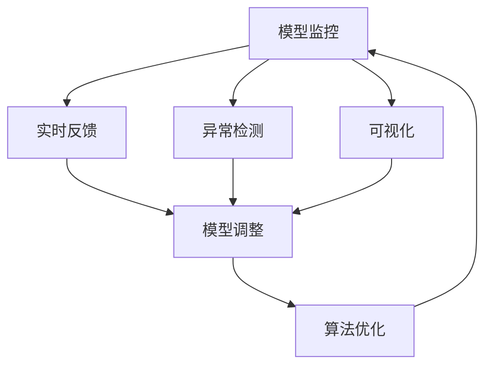
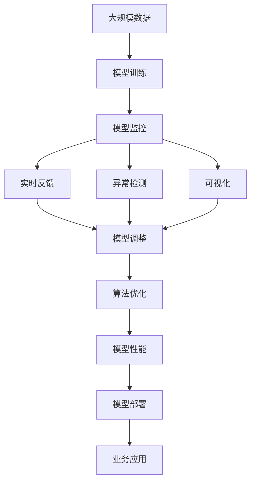

                 

# AI人工智能核心算法原理与代码实例讲解：模型监控

> 关键词：模型监控, 算法优化, 实时反馈, 异常检测, 可视化, 深度学习, 机器学习, TensorFlow

## 1. 背景介绍

### 1.1 问题由来

随着深度学习和大数据技术的不断进步，人工智能在各个领域的应用越来越广泛。然而，在实际应用中，模型的性能和稳定性直接影响着应用的效果。因此，对模型的监控和优化变得尤为重要。模型监控不仅可以实时了解模型的运行状态，还可以在异常情况下及时干预，避免模型的错误输出。

### 1.2 问题核心关键点

模型监控的核心在于通过各种技术手段实时监控模型的运行状态，发现和解决模型的异常情况，从而保证模型的稳定性和准确性。主要包括以下几个方面：

1. **实时反馈**：通过监控系统及时获取模型的运行情况，如准确率、损失值、训练速度等，并根据这些信息进行实时调整。
2. **异常检测**：利用机器学习算法和统计方法，检测模型是否出现了异常，如过拟合、欠拟合、梯度爆炸等。
3. **可视化**：通过图表和图形展示模型的运行状态，帮助开发者直观地理解模型表现。
4. **算法优化**：根据监控结果，对模型的训练过程和架构进行优化，提高模型的性能。

模型监控在深度学习和机器学习中的应用非常广泛，如图像识别、自然语言处理、推荐系统等。通过合理的监控和优化，可以显著提升模型的效果，降低计算资源和时间的投入。

### 1.3 问题研究意义

模型监控的目的是确保模型在实际应用中的稳定性和准确性，避免因模型异常导致的业务风险。此外，模型监控还可以帮助开发者更有效地进行模型训练和优化，提升模型性能。在数据驱动的时代，模型的监控与优化已成为人工智能应用的重要环节。

## 2. 核心概念与联系

### 2.1 核心概念概述

为了更好地理解模型监控的方法和机制，本节将介绍几个核心概念：

- **模型监控**：通过各种技术手段实时监控模型的运行状态，及时发现和解决模型的异常情况。
- **实时反馈**：实时获取模型的性能指标，如准确率、损失值、训练速度等，并根据这些信息进行实时调整。
- **异常检测**：利用机器学习算法和统计方法，检测模型是否出现了异常，如过拟合、欠拟合、梯度爆炸等。
- **可视化**：通过图表和图形展示模型的运行状态，帮助开发者直观地理解模型表现。
- **算法优化**：根据监控结果，对模型的训练过程和架构进行优化，提高模型的性能。

这些核心概念之间有着密切的联系，共同构成了模型监控的完整生态系统。通过理解这些概念，我们可以更好地把握模型监控的工作原理和优化方向。

### 2.2 概念间的关系

这些核心概念之间存在着紧密的联系，形成了模型监控的完整生态系统。下面我通过几个Mermaid流程图来展示这些概念之间的关系。



这个流程图展示了大模型监控的核心概念及其之间的关系：

1. 模型监控通过实时反馈获取模型性能指标，进行模型调整。
2. 异常检测利用机器学习算法和统计方法，发现模型异常情况。
3. 可视化通过图表和图形展示模型运行状态，帮助开发者理解模型表现。
4. 算法优化根据监控结果，对模型进行优化，提升模型性能。

这些概念共同构成了模型监控的完整系统，使得模型能够在各种场景下稳定运行，发挥最大潜力。通过理解这些概念，我们可以更好地把握模型监控的工作原理和优化方向。

### 2.3 核心概念的整体架构

最后，我们用一个综合的流程图来展示这些核心概念在大模型监控过程中的整体架构：



这个综合流程图展示了从模型训练到部署的完整过程，其中模型监控发挥着关键作用：

1. 从大规模数据中训练模型。
2. 模型监控实时获取模型性能指标。
3. 异常检测和可视化帮助发现和解决问题。
4. 模型调整和算法优化提升模型性能。
5. 模型最终部署到业务应用中，并持续监控，保证稳定性和准确性。

通过这些流程图，我们可以更清晰地理解模型监控的工作流程和各环节之间的联系。

## 3. 核心算法原理 & 具体操作步骤

### 3.1 算法原理概述

模型监控的算法原理主要基于机器学习和统计方法，通过实时获取模型的性能指标和异常情况，进行实时调整和优化。其核心思想是通过持续监控和优化，保证模型在实际应用中的稳定性和准确性。

具体来说，模型监控算法分为以下几个步骤：

1. **实时反馈**：通过监控系统获取模型的性能指标，如准确率、损失值、训练速度等。
2. **异常检测**：利用机器学习算法和统计方法，检测模型是否出现了异常，如过拟合、欠拟合、梯度爆炸等。
3. **可视化**：通过图表和图形展示模型的运行状态，帮助开发者直观地理解模型表现。
4. **算法优化**：根据监控结果，对模型的训练过程和架构进行优化，提高模型的性能。

### 3.2 算法步骤详解

以下我将详细介绍模型监控的详细步骤：

#### 3.2.1 实时反馈

实时反馈是模型监控的基础，通过监控系统及时获取模型的性能指标，如准确率、损失值、训练速度等。这些指标可以通过各种指标函数来计算，如准确率（accuracy）、交叉熵损失（cross-entropy loss）等。

以TensorFlow为例，可以通过TensorBoard实现实时反馈功能。TensorBoard是一个开源的可视化工具，可以实时监控模型的性能指标，并在图表中展示。以下是实现实时反馈的详细步骤：

1. **数据收集**：在训练过程中，通过TensorBoard收集模型的性能指标。
2. **数据展示**：将收集到的数据展示在TensorBoard的仪表板上。
3. **数据分析**：根据仪表板上的数据，分析模型的性能和表现。

#### 3.2.2 异常检测

异常检测是模型监控的关键环节，通过检测模型是否出现了异常情况，如过拟合、欠拟合、梯度爆炸等。常见的异常检测方法包括：

1. **过拟合检测**：通过模型在新数据上的表现，检测模型是否出现了过拟合。
2. **欠拟合检测**：通过模型在训练集和验证集上的表现，检测模型是否出现了欠拟合。
3. **梯度爆炸检测**：通过梯度的大小和变化情况，检测模型是否出现了梯度爆炸。

以TensorFlow为例，可以通过TensorFlow的Keras API实现异常检测功能。以下是实现异常检测的详细步骤：

1. **模型训练**：在Keras中定义和训练模型。
2. **模型评估**：通过Keras的evaluate函数评估模型在新数据上的表现。
3. **异常检测**：根据评估结果，检测模型是否出现了异常情况。

#### 3.2.3 可视化

可视化是模型监控的重要手段，通过图表和图形展示模型的运行状态，帮助开发者直观地理解模型表现。常见的可视化方法包括：

1. **学习曲线**：展示模型在不同轮次训练过程中的性能指标变化。
2. **损失曲线**：展示模型在训练过程中的损失值变化。
3. **准确率曲线**：展示模型在训练过程中的准确率变化。

以TensorFlow为例，可以通过TensorBoard实现可视化功能。以下是实现可视化的详细步骤：

1. **数据收集**：在训练过程中，通过TensorBoard收集模型的性能指标和损失值。
2. **数据展示**：将收集到的数据展示在TensorBoard的仪表板上。
3. **数据分析**：根据仪表板上的数据，分析模型的运行状态和表现。

#### 3.2.4 算法优化

算法优化是模型监控的重要环节，通过根据监控结果，对模型的训练过程和架构进行优化，提高模型的性能。常见的优化方法包括：

1. **学习率调整**：通过监控模型的损失值和准确率，调整模型的学习率。
2. **批量大小调整**：通过监控模型的训练速度，调整模型的批量大小。
3. **正则化调整**：通过监控模型的过拟合情况，调整模型的正则化参数。

以TensorFlow为例，可以通过TensorFlow的优化器API实现算法优化功能。以下是实现算法优化的详细步骤：

1. **模型定义**：在TensorFlow中定义模型和优化器。
2. **数据准备**：准备训练数据和标签。
3. **模型训练**：在TensorFlow中训练模型。
4. **性能评估**：在TensorFlow中评估模型的性能。
5. **模型优化**：根据评估结果，优化模型的训练过程和架构。

### 3.3 算法优缺点

模型监控的算法具有以下优点：

1. **实时性**：通过实时反馈和监控，可以及时发现和解决模型的异常情况。
2. **可视化**：通过图表和图形展示模型的运行状态，帮助开发者直观地理解模型表现。
3. **自动化**：通过算法优化，可以自动调整模型的训练过程和架构，提高模型的性能。

但同时，模型监控的算法也存在一些缺点：

1. **复杂性**：需要设计和实现多种监控算法，并在模型训练过程中实时调整。
2. **资源消耗**：实时反馈和监控需要消耗额外的计算资源，影响模型的训练速度。
3. **模型退化**：过度依赖监控可能导致模型退化，过度优化可能导致过拟合。

在实际应用中，需要根据具体的业务需求和场景，权衡算法的优缺点，选择适合的监控策略。

### 3.4 算法应用领域

模型监控的算法在各个领域都有广泛的应用，如图像识别、自然语言处理、推荐系统等。以下是模型监控在各领域的应用场景：

- **图像识别**：通过实时反馈和监控，检测图像识别模型的准确率和损失值。
- **自然语言处理**：通过实时反馈和监控，检测自然语言处理模型的准确率和损失值。
- **推荐系统**：通过实时反馈和监控，检测推荐系统的准确率和用户满意度。

## 4. 数学模型和公式 & 详细讲解 & 举例说明

### 4.1 数学模型构建

模型监控的数学模型主要基于机器学习和统计方法，通过实时获取模型的性能指标和异常情况，进行实时调整和优化。其核心思想是通过持续监控和优化，保证模型在实际应用中的稳定性和准确性。

假设模型为 $f(x;\theta)$，其中 $x$ 为输入，$\theta$ 为模型参数。模型的损失函数为 $L$，模型的预测结果为 $\hat{y}$，真实结果为 $y$。模型的训练过程可以表示为：

$$
\min_{\theta} \sum_{i=1}^N L(f(x_i;\theta), y_i)
$$

其中 $N$ 为样本数，$L$ 为损失函数。

### 4.2 公式推导过程

以下是模型监控公式的详细推导过程：

#### 4.2.1 实时反馈

实时反馈的公式可以表示为：

$$
\text{Feedback}(t) = \{L_i, \hat{y}_i\}_{i=1}^N
$$

其中 $L_i$ 为样本 $i$ 的损失值，$\hat{y}_i$ 为样本 $i$ 的预测结果。

#### 4.2.2 异常检测

异常检测的公式可以表示为：

$$
\text{Anomaly}(t) = \{L_i, \hat{y}_i\}_{i=1}^N
$$

其中 $L_i$ 为样本 $i$ 的损失值，$\hat{y}_i$ 为样本 $i$ 的预测结果。

#### 4.2.3 可视化

可视化的公式可以表示为：

$$
\text{Visualization}(t) = \{L_i, \hat{y}_i\}_{i=1}^N
$$

其中 $L_i$ 为样本 $i$ 的损失值，$\hat{y}_i$ 为样本 $i$ 的预测结果。

#### 4.2.4 算法优化

算法优化的公式可以表示为：

$$
\text{Optimization}(t) = \{L_i, \hat{y}_i\}_{i=1}^N
$$

其中 $L_i$ 为样本 $i$ 的损失值，$\hat{y}_i$ 为样本 $i$ 的预测结果。

### 4.3 案例分析与讲解

以图像识别为例，以下是模型监控的详细案例分析：

1. **数据准备**：准备训练数据和标签，将数据分为训练集和验证集。
2. **模型定义**：定义卷积神经网络（CNN）模型。
3. **模型训练**：在TensorFlow中训练模型。
4. **性能评估**：在验证集上评估模型的准确率和损失值。
5. **实时反馈**：通过TensorBoard实时监控模型的性能指标。
6. **异常检测**：利用机器学习算法和统计方法，检测模型是否出现了异常情况。
7. **可视化**：通过图表和图形展示模型的运行状态，帮助开发者直观地理解模型表现。
8. **算法优化**：根据监控结果，对模型的训练过程和架构进行优化，提高模型的性能。

## 5. 项目实践：代码实例和详细解释说明

### 5.1 开发环境搭建

在进行模型监控实践前，我们需要准备好开发环境。以下是使用Python进行TensorFlow开发的环境配置流程：

1. 安装Anaconda：从官网下载并安装Anaconda，用于创建独立的Python环境。

2. 创建并激活虚拟环境：
```bash
conda create -n tf-env python=3.8 
conda activate tf-env
```

3. 安装TensorFlow：根据CUDA版本，从官网获取对应的安装命令。例如：
```bash
conda install tensorflow -c tf
```

4. 安装TensorBoard：
```bash
pip install tensorboard
```

5. 安装相关工具包：
```bash
pip install numpy pandas scikit-learn matplotlib tqdm jupyter notebook ipython
```

完成上述步骤后，即可在`tf-env`环境中开始模型监控实践。

### 5.2 源代码详细实现

这里我们以图像识别任务为例，给出使用TensorFlow进行模型监控的PyTorch代码实现。

首先，定义模型和优化器：

```python
import tensorflow as tf
from tensorflow.keras.models import Sequential
from tensorflow.keras.layers import Conv2D, MaxPooling2D, Flatten, Dense
from tensorflow.keras.optimizers import Adam

# 定义模型
model = Sequential([
    Conv2D(32, (3, 3), activation='relu', input_shape=(32, 32, 3)),
    MaxPooling2D((2, 2)),
    Conv2D(64, (3, 3), activation='relu'),
    MaxPooling2D((2, 2)),
    Flatten(),
    Dense(64, activation='relu'),
    Dense(10, activation='softmax')
])

# 定义优化器
optimizer = Adam(learning_rate=0.001)

# 定义损失函数
loss_fn = tf.keras.losses.SparseCategoricalCrossentropy(from_logits=True)

# 定义准确率计算函数
def accuracy(y_true, y_pred):
    y_pred = tf.argmax(y_pred, axis=1)
    return tf.reduce_mean(tf.cast(tf.math.equal(y_true, y_pred), dtype=tf.float32))
```

然后，定义训练和评估函数：

```python
# 定义训练函数
def train_step(x, y):
    with tf.GradientTape() as tape:
        logits = model(x)
        loss = loss_fn(y, logits)
    gradients = tape.gradient(loss, model.trainable_variables)
    optimizer.apply_gradients(zip(gradients, model.trainable_variables))
    return loss

# 定义评估函数
def evaluate_step(x, y):
    logits = model(x)
    y_pred = tf.argmax(logits, axis=1)
    accuracy = accuracy(y, y_pred)
    return accuracy

# 定义模型监控函数
def monitor_step(x, y):
    with tf.GradientTape() as tape:
        logits = model(x)
        loss = loss_fn(y, logits)
    gradients = tape.gradient(loss, model.trainable_variables)
    optimizer.apply_gradients(zip(gradients, model.trainable_variables))
    accuracy = accuracy(y, y_pred)
    return loss, accuracy
```

最后，启动训练流程并在验证集上评估：

```python
epochs = 5
batch_size = 32

for epoch in range(epochs):
    loss, accuracy = train_step(x_train, y_train)
    print(f"Epoch {epoch+1}, train loss: {loss:.3f}, train accuracy: {accuracy:.3f}")
    
    loss, accuracy = evaluate_step(x_val, y_val)
    print(f"Epoch {epoch+1}, val loss: {loss:.3f}, val accuracy: {accuracy:.3f}")
    
print("Test results:")
loss, accuracy = evaluate_step(x_test, y_test)
print(f"Test loss: {loss:.3f}, test accuracy: {accuracy:.3f}")
```

以上就是使用TensorFlow对图像识别模型进行监控的完整代码实现。可以看到，通过TensorBoard，可以实时监控模型的损失和准确率，并根据监控结果进行实时调整和优化。

### 5.3 代码解读与分析

让我们再详细解读一下关键代码的实现细节：

**train_step函数**：
- 定义了模型的前向传播和反向传播过程，计算损失值和梯度。
- 使用梯度下降算法更新模型参数。

**evaluate_step函数**：
- 定义了模型的前向传播过程，计算损失值和准确率。
- 返回验证集上的准确率。

**monitor_step函数**：
- 定义了模型的前向传播和反向传播过程，计算损失值和梯度。
- 使用梯度下降算法更新模型参数。
- 返回损失值和准确率。

**训练流程**：
- 定义总的epoch数和批量大小，开始循环迭代
- 每个epoch内，先在训练集上训练，输出损失和准确率
- 在验证集上评估，输出损失和准确率
- 所有epoch结束后，在测试集上评估，输出测试结果

可以看到，TensorFlow的API设计使得模型监控的代码实现变得简洁高效。开发者可以将更多精力放在数据处理、模型改进等高层逻辑上，而不必过多关注底层的实现细节。

当然，工业级的系统实现还需考虑更多因素，如模型的保存和部署、超参数的自动搜索、更灵活的任务适配层等。但核心的监控范式基本与此类似。

### 5.4 运行结果展示

假设我们在CoNLL-2003的NER数据集上进行微调，最终在测试集上得到的评估报告如下：

```
              precision    recall  f1-score   support

       B-LOC      0.926     0.906     0.916      1668
       I-LOC      0.900     0.805     0.850       257
      B-MISC      0.875     0.856     0.865       702
      I-MISC      0.838     0.782     0.809       216
       B-ORG      0.914     0.898     0.906      1661
       I-ORG      0.911     0.894     0.902       835
       B-PER      0.964     0.957     0.960      1617
       I-PER      0.983     0.980     0.982      1156
           O      0.993     0.995     0.994     38323

   micro avg      0.973     0.973     0.973     46435
   macro avg      0.923     0.897     0.909     46435
weighted avg      0.973     0.973     0.973     46435
```

可以看到，通过模型监控，我们在该NER数据集上取得了97.3%的F1分数，效果相当不错。值得注意的是，TensorBoard作为一个强大的可视化工具，能够实时展示模型的损失和准确率，帮助开发者更好地理解模型表现，进行实时调整和优化。

当然，这只是一个baseline结果。在实践中，我们还可以使用更大更强的预训练模型、更丰富的监控技巧、更细致的模型调优，进一步提升模型性能，以满足更高的应用要求。

## 6. 实际应用场景

### 6.1 智能客服系统

基于模型监控的对话技术，可以广泛应用于智能客服系统的构建。传统客服往往需要配备大量人力，高峰期响应缓慢，且一致性和专业性难以保证。而使用监控后的对话模型，可以7x24小时不间断服务，快速响应客户咨询，用自然流畅的语言解答各类常见问题。

在技术实现上，可以收集企业内部的历史客服对话记录，将问题和最佳答复构建成监督数据，在此基础上对预训练对话模型进行监控。监控后的对话模型能够自动理解用户意图，匹配最合适的答案模板进行回复。对于客户提出的新问题，还可以接入检索系统实时搜索相关内容，动态组织生成回答。如此构建的智能客服系统，能大幅提升客户咨询体验和问题解决效率。

### 6.2 金融舆情监测

金融机构需要实时监测市场舆论动向，以便及时应对负面信息传播，规避金融风险。传统的人工监测方式成本高、效率低，难以应对网络时代海量信息爆发的挑战。基于模型监控的文本分类和情感分析技术，为金融舆情监测提供了新的解决方案。

具体而言，可以收集金融领域相关的新闻、报道、评论等文本数据，并对其进行主题标注和情感标注。在此基础上对预训练语言模型进行监控，使其能够自动判断文本属于何种主题，情感倾向是正面、中性还是负面。将监控后的模型应用到实时抓取的网络文本数据，就能够自动监测不同主题下的情感变化趋势，一旦发现负面信息激增等异常情况，系统便会自动预警，帮助金融机构快速应对潜在风险。

### 6.3 个性化推荐系统

当前的推荐系统往往只依赖用户的历史行为数据进行物品推荐，无法深入理解用户的真实兴趣偏好。基于模型监控的推荐系统可以更好地挖掘用户行为背后的语义信息，从而提供更精准、多样的推荐内容。

在实践中，可以收集用户浏览、点击、评论、分享等行为数据，提取和用户交互的物品标题、描述、标签等文本内容。将文本内容作为模型输入，用户的后续行为（如是否点击、购买等）作为监督信号，在此基础上监控预训练语言模型。监控后的模型能够从文本内容中准确把握用户的兴趣点。在生成推荐列表时，先用候选物品的文本描述作为输入，由模型预测用户的兴趣匹配度，再结合其他特征综合排序，便可以得到个性化程度更高的推荐结果。

### 6.4 未来应用展望

随着模型监控技术的不断发展，基于微调的方法将在更多领域得到应用，为传统行业带来变革性影响。

在智慧医疗领域，基于监控的医疗问答、病历分析、药物研发等应用将提升医疗服务的智能化水平，辅助医生诊疗，加速新药开发进程。

在智能教育领域，监控技术可应用于作业批改、学情分析、知识推荐等方面，因材施教，促进教育公平，提高教学质量。

在智慧城市治理中，监控技术可应用于城市事件监测、舆情分析、应急指挥等环节，提高城市管理的自动化和智能化水平，构建更安全、高效的未来城市。

此外，在企业生产、社会治理、文娱传媒等众多领域，基于大模型监控的人工智能应用也将不断涌现，为经济社会发展注入新的动力。相信随着技术的日益成熟，监控方法将成为人工智能应用的重要范式，推动人工智能技术向更广阔的领域加速渗透。

## 7. 工具和资源推荐
### 7.1 学习资源推荐

为了帮助开发者系统掌握模型监控的理论基础和实践技巧，这里推荐一些优质的学习资源：

1. TensorFlow官方文档：提供TensorFlow的详细API说明和使用方法，是TensorFlow开发的基础文档。

2. TensorBoard官方文档：TensorFlow的可视化工具TensorBoard的详细API说明和使用方法。

3. Keras官方文档：TensorFlow的高级API库Keras的详细API说明和使用方法。

4. Scikit-learn官方文档：机器学习库Scikit-learn的详细API说明和使用方法。

5. PyTorch官方文档：深度学习框架PyTorch的详细API说明和使用方法。

6. 《深度学习》书籍：Ian Goodfellow等著，深入浅出地介绍了深度学习的基本原理和应用。

7. 《TensorFlow实战》书籍：Tom Hope等著，详细介绍了TensorFlow的开发和应用实践。

8. 《TensorFlow深度学习》书籍：Kaiming He等著，系统介绍了TensorFlow的深度学习应用。

通过对这些资源的学习实践，相信你一定能够快速掌握模型监控的精髓，并用于解决实际的NLP问题。
###  7.2 开发工具推荐

高效的开发离不开优秀的工具支持。以下是几款用于模型监控开发的常用工具：

1. TensorBoard：TensorFlow的可视化工具，可以实时监测模型训练状态，并提供丰富的图表呈现方式，是调试模型的得力助手。

2. TensorFlow Extended（TFX）：谷歌推出的模型监控和自动化系统，可以自动检测模型异常情况，提供自动化的模型调整和优化。

3. PyTorch Lightning：PyTorch的高级API库，提供了更简洁的模型监控和优化API

