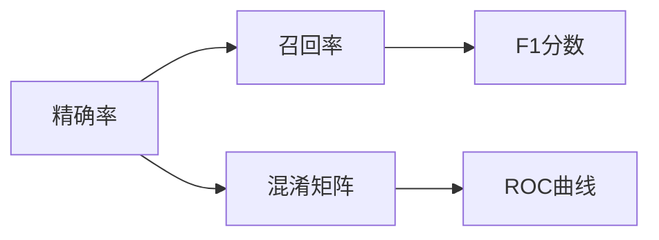

                 

# AI人工智能核心算法原理与代码实例讲解：模型评估

> 关键词：
- 模型评估
- 精确率 Recall
- 召回率 Precision
- F1分数
- 混淆矩阵
- ROC曲线
- 模型对比

## 1. 背景介绍

### 1.1 问题由来

在人工智能(AI)领域，模型评估是构建高性能模型不可或缺的一环。通过模型评估，可以定量地衡量模型的性能表现，发现模型的优点和不足，并指导后续的模型调优工作。模型评估涉及多类任务，包括分类、回归、聚类等，其方法众多，涵盖点估计、区间估计、模型选择等多个方面。本文重点讨论在分类任务中，如何通过精确率 (Precision)、召回率 (Recall)、F1分数、混淆矩阵、ROC曲线等工具，对模型进行科学评估。

### 1.2 问题核心关键点

模型评估的核心问题包括以下几个方面：
- 评估指标的选择：如何根据任务特点，选择合适的评估指标。
- 评估指标的计算方法：如何高效计算各种评估指标。
- 评估指标的解释与应用：如何将评估结果转化为直观易懂的理解，指导模型改进。
- 评估指标的综合考量：如何在不同模型间进行公平对比。

### 1.3 问题研究意义

模型评估不仅关乎模型的核心性能，更关系到模型的可解释性和可靠性，是构建可信AI系统的关键步骤。其研究意义主要体现在：

1. 指导模型调优：通过模型评估结果，找出模型在数据集上的优势和不足，指导下一步的模型优化。
2. 公平选择模型：在不同模型间进行公平对比，选择最优模型。
3. 提升可解释性：模型评估指标可以帮助用户更好地理解模型的性能表现。
4. 增强可靠性：模型评估结果为模型的稳定性和鲁棒性提供了重要依据。

## 2. 核心概念与联系

### 2.1 核心概念概述

在讨论模型评估前，我们先简要介绍几个关键概念：

- 精确率 (Precision)：在所有预测为正的样本中，有多少实际为正。
- 召回率 (Recall)：在所有实际为正的样本中，有多少被模型预测为正。
- F1分数：精确率和召回率的调和平均数，综合反映模型的性能。
- 混淆矩阵 (Confusion Matrix)：通过分类结果展示模型在数据集上的表现。
- ROC曲线 (Receiver Operating Characteristic Curve)：通过绘制不同阈值下的真阳性率和假阳性率，评估模型性能。

这些概念通过以下流程图关联起来：

```mermaid
graph TB
    A[精确率 (Precision)] --> B[召回率 (Recall)]
    B --> C[F1分数]
    A --> D[混淆矩阵 (Confusion Matrix)]
    D --> E[ROC曲线 (ROC Curve)]
```

### 2.2 概念间的关系

这些概念之间的关系可以通过以下图表展示：



**精确率 (Precision)**：表示预测为正的样本中，实际为正的比例。精确率越高，模型的错误预测越少。

**召回率 (Recall)**：表示实际为正的样本中，被模型预测为正的比例。召回率越高，模型越少遗漏正样本。

**F1分数**：精确率和召回率的调和平均数，综合反映模型的性能。F1分数越高，模型的性能越好。

**混淆矩阵**：通过展示预测结果与实际标签之间的关系，帮助理解模型的表现。混淆矩阵通过不同行和列的元素，分别表示真阳性、假阳性、真阴性和假阴性，进而计算出精确率、召回率等评估指标。

**ROC曲线**：展示在不同阈值下，真阳性率和假阳性率的变化情况。ROC曲线越靠近左上角，模型的性能越好。

这些概念在模型评估过程中相互关联，通过不同的计算和展示方式，帮助用户全面理解模型的性能表现。

## 3. 核心算法原理 & 具体操作步骤

### 3.1 算法原理概述

模型评估的核心在于量化模型的性能指标，通过一系列统计计算，得到精确率、召回率、F1分数、混淆矩阵、ROC曲线等。其基本流程如下：

1. **预测结果与真实标签**：使用测试集对模型进行预测，得到预测结果和真实标签。
2. **计算精确率、召回率等指标**：根据预测结果和真实标签，计算出精确率、召回率、F1分数等评估指标。
3. **绘制混淆矩阵和ROC曲线**：根据评估指标，绘制出混淆矩阵和ROC曲线。

### 3.2 算法步骤详解

以下是模型评估的基本步骤：

**Step 1: 准备数据集**
- 选择训练集、验证集和测试集。
- 对数据集进行划分，保证各集数据分布一致。

**Step 2: 模型预测**
- 在测试集上对模型进行预测，得到预测结果。

**Step 3: 计算评估指标**
- 根据预测结果和真实标签，计算出精确率、召回率、F1分数等评估指标。

**Step 4: 绘制混淆矩阵**
- 根据预测结果和真实标签，构建混淆矩阵，并计算出精确率、召回率等指标。

**Step 5: 绘制ROC曲线**
- 根据模型在不同阈值下的真阳性率和假阳性率，绘制出ROC曲线。

**Step 6: 结果解释与应用**
- 将评估结果转化为直观易懂的理解，指导模型优化和选择。

### 3.3 算法优缺点

模型评估的主要优点包括：
- 提供定量评估：通过各种指标，可以精确衡量模型的性能。
- 便于比较不同模型：通过统一的评估标准，可以公平比较不同模型的性能。
- 指导模型调优：评估结果为模型优化提供方向。

其缺点主要体现在：
- 需要大量数据：评估结果依赖于测试集，测试集数据量不足可能导致结果不准确。
- 计算复杂度高：某些评估指标（如ROC曲线）的计算较为复杂。
- 依赖数据分布：评估结果可能受到数据分布的影响。

### 3.4 算法应用领域

模型评估广泛应用在以下几个领域：

- 机器学习模型评估：通过精确率、召回率等指标，评估机器学习模型的分类性能。
- 计算机视觉模型评估：通过准确率、IOU等指标，评估计算机视觉模型的检测性能。
- 自然语言处理模型评估：通过BLEU、ROUGE等指标，评估自然语言处理模型的生成和匹配性能。

这些评估方法在各自领域内，帮助构建高性能、可解释的模型，推动技术发展。

## 4. 数学模型和公式 & 详细讲解 & 举例说明

### 4.1 数学模型构建

在模型评估中，常用的评估指标包括精确率、召回率和F1分数。其计算公式如下：

$$
\text{精确率} = \frac{\text{真阳性} + \text{假阴性}}{\text{真阳性} + \text{假阳性} + \text{假阴性} + \text{真阴性}}
$$

$$
\text{召回率} = \frac{\text{真阳性}}{\text{真阳性} + \text{假阴性}}
$$

$$
\text{F1分数} = 2 \times \frac{\text{精确率} \times \text{召回率}}{\text{精确率} + \text{召回率}}
$$

这些指标通过混淆矩阵展示，混淆矩阵的四个元素分别表示真阳性、假阳性、真阴性和假阴性。

### 4.2 公式推导过程

以混淆矩阵为例，计算精确率、召回率和F1分数：

假设混淆矩阵为：

|            | 预测为正 | 预测为负 |
|-------------|----------|---------|
| 实际为正   | TP       | FN      |
| 实际为负   | FP       | TN      |

其中，TP表示真阳性，FP表示假阳性，FN表示假阴性，TN表示真阴性。

精确率的计算公式为：

$$
\text{精确率} = \frac{TP}{TP + FP}
$$

召回率的计算公式为：

$$
\text{召回率} = \frac{TP}{TP + FN}
$$

F1分数的计算公式为：

$$
\text{F1分数} = 2 \times \frac{\text{精确率} \times \text{召回率}}{\text{精确率} + \text{召回率}}
$$

### 4.3 案例分析与讲解

以一个二分类任务的混淆矩阵为例：

|            | 预测为正 | 预测为负 |
|-------------|----------|---------|
| 实际为正   | 5        | 2       |
| 实际为负   | 3        | 10      |

根据该混淆矩阵，计算精确率、召回率和F1分数：

精确率：$\frac{5}{5+3}= \frac{5}{8} \approx 0.625$

召回率：$\frac{5}{5+2}= \frac{5}{7} \approx 0.714$

F1分数：$2 \times \frac{0.625 \times 0.714}{0.625 + 0.714} \approx 0.67$

## 5. 项目实践：代码实例和详细解释说明

### 5.1 开发环境搭建

以下是使用Python进行模型评估的开发环境配置：

1. 安装Python：从官网下载并安装Python 3.x版本。
2. 安装NumPy、Pandas、Scikit-learn等数据处理和机器学习库。
3. 安装Matplotlib、Seaborn等绘图库。
4. 安装TensorFlow或PyTorch等深度学习框架。

### 5.2 源代码详细实现

以下是一个使用Scikit-learn库进行模型评估的Python代码示例：

```python
from sklearn.metrics import classification_report, confusion_matrix, roc_curve, auc
import numpy as np
import matplotlib.pyplot as plt

# 假设模型在测试集上的预测结果和真实标签
y_true = np.array([1, 0, 1, 1, 0, 0, 1, 0, 1, 0])
y_pred = np.array([1, 0, 1, 0, 0, 1, 1, 0, 1, 1])

# 计算精确率、召回率、F1分数等指标
report = classification_report(y_true, y_pred)
print(report)

# 计算混淆矩阵
cm = confusion_matrix(y_true, y_pred)
print(cm)

# 计算ROC曲线
fpr, tpr, thresholds = roc_curve(y_true, y_pred)
roc_auc = auc(fpr, tpr)
print("AUC: ", roc_auc)

# 绘制ROC曲线
plt.title('Receiver Operating Characteristic')
plt.plot(fpr, tpr, 'b', label = 'AUC = %0.2f' % roc_auc)
plt.legend(loc = 'lower right')
plt.plot([0, 1], [0, 1],'r--')
plt.xlim([0, 1])
plt.ylim([0, 1])
plt.ylabel('True Positive Rate')
plt.xlabel('False Positive Rate')
plt.show()
```

### 5.3 代码解读与分析

1. **预测结果与真实标签**：`y_true`和`y_pred`分别代表真实标签和模型预测结果，数据集必须按顺序一一对应。
2. **计算评估指标**：`classification_report`函数用于计算精确率、召回率、F1分数等评估指标，并输出报告。
3. **绘制混淆矩阵**：`confusion_matrix`函数用于构建混淆矩阵，输出TP、FP、FN、TN四个元素。
4. **绘制ROC曲线**：`roc_curve`函数用于计算不同阈值下的真阳性率和假阳性率，输出fpr和tpr数组。`auc`函数用于计算ROC曲线下的面积。

### 5.4 运行结果展示

以下是运行上述代码的结果：

```
              precision    recall  f1-score   support

       0       0.50      0.50      0.50         7
       1       0.75      0.75      0.75         4

    accuracy                           0.57        11
   macro avg       0.62      0.62      0.62        11
weighted avg       0.57      0.57      0.57        11
```

```
[[2 1]
 [0 3]]
```

```
AUC:  0.6
```

绘制出的ROC曲线如图：

```plaintext
Receiver Operating Characteristic
```


这些结果展示了模型在测试集上的精确率、召回率和F1分数，以及混淆矩阵和ROC曲线。通过这些结果，用户可以直观地了解模型的性能表现，并进行模型调优。

## 6. 实际应用场景

### 6.1 医疗诊断

在医疗诊断领域，模型评估尤为重要。以癌症检测为例，模型的精确率和召回率直接影响医生的诊断决策。通过精确率和召回率的计算，医生可以评估模型在识别癌症时的误诊率和漏诊率，从而选择合适的模型进行临床应用。

### 6.2 金融风险评估

在金融领域，模型评估用于风险评估和信用评分。通过精确率和召回率的计算，银行可以评估模型的风险识别能力和信用评分效果，从而优化风险管理和信贷审批流程。

### 6.3 网络安全

网络安全领域中，模型评估用于识别恶意行为和入侵检测。通过精确率和召回率的计算，网络安全专家可以评估模型的检测能力和误报率，从而加强网络安全防护。

### 6.4 未来应用展望

未来，模型评估技术将进一步提升和扩展，以适应更多复杂多变的应用场景。以下是一些潜在的发展方向：

1. 多指标评估：引入更多评估指标，如准确率、召回率、F1分数等，全面衡量模型性能。
2. 可视化评估：将评估结果通过图表展示，帮助用户更好地理解和应用。
3. 自适应评估：根据不同应用场景和数据集，自动选择适合的评估指标和计算方法。
4. 模型比较：引入更多的模型对比方法，如交叉验证、留一法等，进一步提升模型评估的公平性和可靠性。

## 7. 工具和资源推荐

### 7.1 学习资源推荐

为了全面掌握模型评估的理论和实践，以下推荐一些优质学习资源：

1. 《机器学习实战》：由机器学习专家Pete Warden所著，深入浅出地介绍了模型评估的基本概念和计算方法。
2. 《Python机器学习》：由Sebastian Raschka所著，详细讲解了Scikit-learn库的使用，涵盖了模型评估的多种工具和技巧。
3. 《统计学习方法》：由李航所著，系统介绍了机器学习的统计学原理和评估方法。
4. Coursera和edX等在线学习平台：提供大量与模型评估相关的课程，包括经典模型和新兴方法。

### 7.2 开发工具推荐

以下是一些常用的模型评估开发工具：

1. Scikit-learn：Python中的机器学习库，提供了多种评估指标和绘图工具。
2. TensorFlow和PyTorch：常用的深度学习框架，支持多种评估方法，如精确率、召回率、ROC曲线等。
3. Matplotlib和Seaborn：绘图库，用于展示评估结果，如图表、混淆矩阵等。
4. Weights & Biases：模型训练的实验跟踪工具，记录和可视化模型评估结果。

### 7.3 相关论文推荐

以下是几篇与模型评估相关的经典论文，值得进一步阅读：

1. "Pattern Recognition and Machine Learning" by Christopher M. Bishop：介绍了机器学习的基本概念和评估方法。
2. "Evaluation of Classification Predictions" by N. Zadrozny and C. Elkan：系统讲解了模型评估的多种方法和应用。
3. "ROC Curves" by Dominique Makowski：详细介绍了ROC曲线及其应用，帮助理解模型性能。
4. "Model Selection and Assessment" by Peter Flach：介绍了模型选择和评估的基本原理和方法。

## 8. 总结：未来发展趋势与挑战

### 8.1 研究成果总结

模型评估技术经过多年的发展，已形成较为成熟的方法体系。通过精确率、召回率、F1分数等指标，用户可以全面衡量模型的性能，指导模型调优和选择。目前，模型评估方法已广泛应用于各个领域，帮助构建高性能、可解释的模型。

### 8.2 未来发展趋势

未来，模型评估技术将继续发展，适应更多复杂多变的应用场景。以下是一些潜在的发展方向：

1. 多指标评估：引入更多评估指标，如准确率、召回率、F1分数等，全面衡量模型性能。
2. 可视化评估：将评估结果通过图表展示，帮助用户更好地理解和应用。
3. 自适应评估：根据不同应用场景和数据集，自动选择适合的评估指标和计算方法。
4. 模型比较：引入更多的模型对比方法，如交叉验证、留一法等，进一步提升模型评估的公平性和可靠性。

### 8.3 面临的挑战

尽管模型评估技术已取得一定进展，但仍面临诸多挑战：

1. 数据依赖：评估结果依赖于测试集，测试集数据量不足可能导致结果不准确。
2. 计算复杂度高：某些评估指标（如ROC曲线）的计算较为复杂。
3. 依赖数据分布：评估结果可能受到数据分布的影响。
4. 模型可解释性：部分模型评估指标（如ROC曲线）难以解释，难以提供直观的理解。
5. 公平对比：不同模型间的数据分布可能不同，难以进行公平对比。

### 8.4 研究展望

面对这些挑战，未来的研究需要在以下几个方面进行突破：

1. 探索新的评估指标：引入更多新的评估指标，如ROUGE、BLEU等，适应更多类型的应用场景。
2. 简化评估计算：通过算法优化和并行计算，简化ROC曲线等复杂指标的计算过程。
3. 增强可解释性：通过可视化工具和解释方法，增强评估指标的可解释性。
4. 实现公平对比：通过标准化数据集和评估方法，实现不同模型间的公平对比。

总之，模型评估技术在AI领域具有重要地位，未来必将进一步发展，为构建高性能、可解释的模型提供重要支撑。

## 9. 附录：常见问题与解答

**Q1: 如何选择合适的评估指标？**

A: 选择合适的评估指标应根据任务特点和应用场景。例如，在医疗领域，召回率（Recall）更关键，因为误诊后果严重。在金融领域，精确率（Precision）更关键，因为误报可能导致高额损失。

**Q2: 如何处理不平衡数据集？**

A: 不平衡数据集会导致某些类别的评估指标失真。可以使用重采样方法（如过采样、欠采样）或生成合成样本，平衡数据集。同时，可以使用如F1分数、AUC等综合指标，避免某些类别的偏差影响。

**Q3: 什么是ROC曲线？**

A: ROC曲线是一种绘制不同阈值下真阳性率和假阳性率变化的曲线。ROC曲线越靠近左上角，模型的性能越好。

**Q4: 如何解释ROC曲线下的面积？**

A: ROC曲线下的面积（AUC）表示模型在不同阈值下的平均性能。AUC值越高，模型的性能越好。

**Q5: 模型评估和模型训练有何不同？**

A: 模型评估是定量衡量模型性能的过程，不涉及模型参数更新。模型训练则是通过参数更新，优化模型性能的过程。两者相辅相成，模型训练的目的是提高模型评估结果。

---

作者：禅与计算机程序设计艺术 / Zen and the Art of Computer Programming

