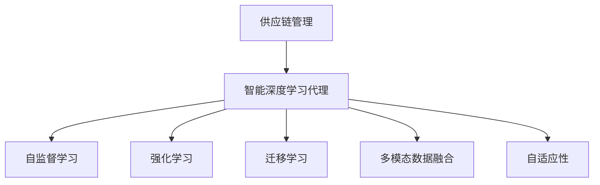
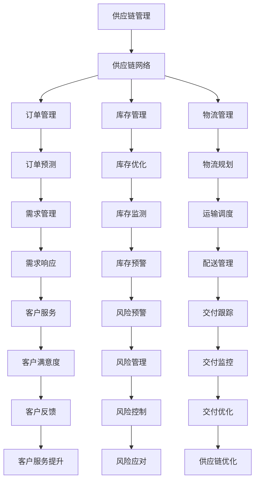
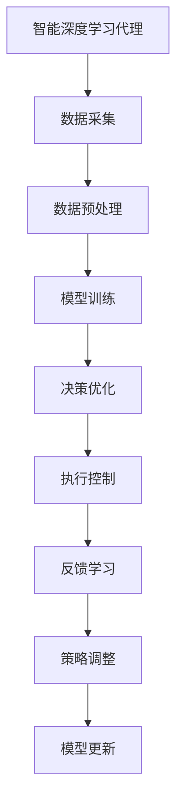
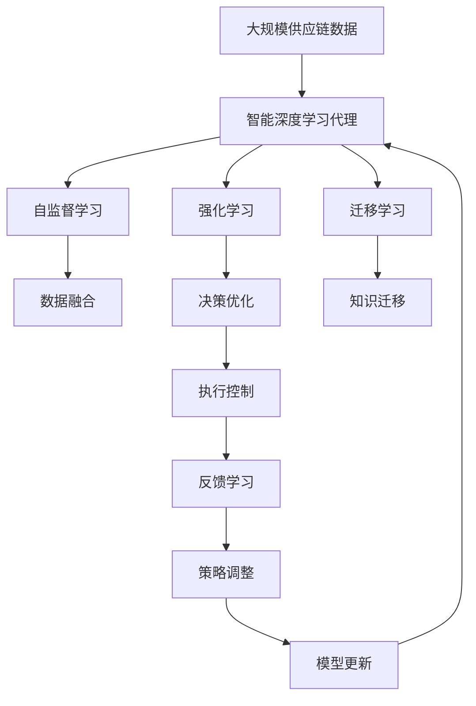

                 

# AI人工智能深度学习算法：智能深度学习代理在供应链管理领域的创新运用

> 关键词：深度学习代理,供应链管理,智能决策,预测分析,数据挖掘,自动化

## 1. 背景介绍

### 1.1 问题由来
随着经济全球化和技术进步，供应链管理（Supply Chain Management, SCM）已经成为企业提升竞争力和响应市场变化的关键。然而，传统的供应链管理方式依赖人工经验，难以实时监控和管理复杂的供应链网络。近年来，人工智能（AI）深度学习技术为供应链管理带来了新的解决方案，尤其是智能深度学习代理（AI Deep Learning Agent）的引入，极大地提升了供应链管理的智能化水平。

### 1.2 问题核心关键点
智能深度学习代理是一种基于深度学习的智能体（Agent），能够在供应链网络中自主学习和决策。其核心关键点包括：

- **自监督学习**：代理通过在供应链网络中自主探索和互动，学习供应链运行的规律和特性。
- **强化学习**：代理通过与环境的互动，不断优化决策策略，以最大化长期收益。
- **迁移学习**：代理能够将在其他供应链网络中学到的知识迁移应用到新的供应链网络中。
- **多模态数据融合**：代理能够处理多种数据类型（如文本、图像、视频），综合多源信息进行决策。
- **自适应性**：代理能够根据供应链环境的变化，动态调整决策策略。

智能深度学习代理的出现，为供应链管理带来了革命性的变化，使供应链管理更加智能化、高效化。

### 1.3 问题研究意义
研究智能深度学习代理在供应链管理中的应用，对于提升供应链的智能化水平、提高供应链的响应速度和适应能力、降低供应链成本和风险具有重要意义。其研究意义体现在以下几个方面：

- **智能化管理**：通过智能代理的自主决策，实现供应链管理的自动化，减少人为干预。
- **高效化运营**：智能代理能够实时监控供应链动态，快速响应市场变化，提高供应链的灵活性和响应速度。
- **精准化预测**：智能代理通过数据分析和预测，提升供应链需求的准确性和前瞻性。
- **低成本运作**：智能代理能够优化供应链的资源配置，降低运营成本。
- **风险管理**：智能代理能够预测和规避供应链中的潜在风险，提升供应链的稳定性。

## 2. 核心概念与联系

### 2.1 核心概念概述

为更好地理解智能深度学习代理在供应链管理中的应用，本节将介绍几个密切相关的核心概念：

- **供应链管理（Supply Chain Management, SCM）**：涉及从供应商到客户的全链路管理和优化，涵盖物流、库存、订单、生产等多个环节。
- **智能深度学习代理（AI Deep Learning Agent）**：一种基于深度学习的智能体，能够在供应链网络中自主学习和决策。
- **自监督学习**：代理通过在供应链网络中自主探索和互动，学习供应链运行的规律和特性。
- **强化学习**：代理通过与环境的互动，不断优化决策策略，以最大化长期收益。
- **迁移学习**：代理能够将在其他供应链网络中学到的知识迁移应用到新的供应链网络中。
- **多模态数据融合**：代理能够处理多种数据类型（如文本、图像、视频），综合多源信息进行决策。
- **自适应性**：代理能够根据供应链环境的变化，动态调整决策策略。

这些核心概念之间的逻辑关系可以通过以下Mermaid流程图来展示：

这个流程图展示了这个领域的核心概念及其之间的关系：

1. 供应链管理作为基础领域，为智能深度学习代理提供应用场景。
2. 智能深度学习代理通过自监督学习、强化学习、迁移学习等方法进行自主学习和决策。
3. 多模态数据融合和自适应性进一步提升了智能代理的决策能力。

### 2.2 概念间的关系

这些核心概念之间存在着紧密的联系，形成了智能深度学习代理在供应链管理中的应用框架。下面我通过几个Mermaid流程图来展示这些概念之间的关系。

#### 2.2.1 供应链管理的核心要素

这个流程图展示了供应链管理涉及的核心要素，以及各要素之间的关系。

#### 2.2.2 智能深度学习代理的决策框架

这个流程图展示了智能深度学习代理的决策框架，包括数据采集、预处理、模型训练、决策优化、执行控制、反馈学习和策略调整等多个环节。

### 2.3 核心概念的整体架构

最后，我们用一个综合的流程图来展示这些核心概念在大规模供应链管理中的应用：

这个综合流程图展示了从大规模供应链数据到智能深度学习代理的决策过程，包括自监督学习、数据融合、强化学习、决策优化、执行控制、反馈学习、策略调整等多个环节。通过这些环节，智能代理能够实时监控供应链动态，快速响应市场变化，提高供应链的灵活性和响应速度。

## 3. 核心算法原理 & 具体操作步骤
### 3.1 算法原理概述

智能深度学习代理在供应链管理中的应用，本质上是一种基于深度学习的自主决策框架。其核心思想是：通过深度学习模型，代理能够从大规模供应链数据中学习到供应链运行的规律和特性，通过与供应链环境的互动，不断优化决策策略，以最大化长期收益。

形式化地，假设智能代理能够接收供应链网络中的输入 $X$，通过深度学习模型输出决策 $A$，并产生输出 $Y$。代理的决策过程可以表示为：

$$
\arg\max_{A} \mathbb{E}[R(Y, A)]
$$

其中 $R(Y, A)$ 为代理在不同决策下获得的长期收益，$\mathbb{E}$ 表示期望。代理通过不断调整决策 $A$，以最大化长期收益 $R(Y, A)$。

### 3.2 算法步骤详解

智能深度学习代理在供应链管理中的应用，主要包括以下几个关键步骤：

**Step 1: 准备数据和环境**
- 收集供应链网络中的各类数据（如订单数据、库存数据、物流数据等），划分为训练集、验证集和测试集。
- 构建供应链模拟环境，定义模拟规则和交互方式。

**Step 2: 定义代理模型**
- 选择适合的深度学习模型（如CNN、RNN、Transformer等）作为代理的决策模型。
- 定义模型的输入和输出，明确模型的训练目标和优化指标。

**Step 3: 训练代理模型**
- 使用训练集数据对模型进行训练，最小化代理在不同决策下的损失函数。
- 使用验证集数据评估模型性能，调整模型参数。

**Step 4: 执行代理决策**
- 将代理部署到供应链网络中，实时接收供应链数据。
- 代理通过模型对输入数据进行分析和预测，输出决策。

**Step 5: 反馈和优化**
- 收集代理在供应链中的执行结果，进行效果评估和反馈。
- 根据反馈结果，调整代理的决策策略和模型参数。

**Step 6: 迁移和更新**
- 将代理在某一供应链网络中学到的知识，迁移应用到新的供应链网络中。
- 定期更新代理模型，优化模型参数和决策策略。

### 3.3 算法优缺点

智能深度学习代理在供应链管理中的应用，具有以下优点：

- **智能化决策**：代理能够自主学习和决策，减少人为干预，提升决策效率和准确性。
- **高效化管理**：代理能够实时监控供应链动态，快速响应市场变化，提高供应链的灵活性和响应速度。
- **精准化预测**：代理通过数据分析和预测，提升供应链需求的准确性和前瞻性。
- **低成本运作**：代理能够优化供应链的资源配置，降低运营成本。
- **风险管理**：代理能够预测和规避供应链中的潜在风险，提升供应链的稳定性。

同时，该方法也存在以下局限性：

- **数据依赖**：代理需要大量高质量的供应链数据进行训练，数据获取成本较高。
- **模型复杂度**：代理模型的复杂度较高，训练和部署需要较高的计算资源。
- **泛化能力**：代理在不同供应链网络中的泛化能力有限，需要针对不同供应链进行定制化训练。
- **可解释性不足**：代理模型的决策过程难以解释，难以进行人工干预和审计。
- **安全性问题**：代理模型可能存在安全漏洞，需要加强安全防护和隐私保护。

尽管存在这些局限性，但就目前而言，智能深度学习代理在供应链管理中的应用已经取得了显著的成效，其核心算法原理和具体操作步骤值得深入研究。

### 3.4 算法应用领域

智能深度学习代理在供应链管理中的应用，已经涵盖了多个领域：

- **订单管理**：代理能够实时监控订单状态，预测订单需求，优化订单处理流程。
- **库存管理**：代理能够预测库存水平，优化库存配置，降低库存成本。
- **物流管理**：代理能够规划物流路径，调度物流资源，提高物流效率。
- **需求管理**：代理能够预测市场需求，优化需求响应策略，提升客户满意度。
- **风险管理**：代理能够预测供应链风险，制定风险应对策略，提升供应链稳定性。
- **供应链优化**：代理能够优化供应链资源配置，提升供应链整体效益。

## 4. 数学模型和公式 & 详细讲解 & 举例说明

### 4.1 数学模型构建

本节将使用数学语言对智能深度学习代理在供应链管理中的应用进行更加严格的刻画。

假设智能代理能够接收供应链网络中的输入 $X$，通过深度学习模型输出决策 $A$，并产生输出 $Y$。定义模型的损失函数为 $L(X, A, Y)$，代理的目标为最大化长期收益 $R(Y, A)$。

代理的决策过程可以表示为：

$$
\arg\max_{A} \mathbb{E}[R(Y, A)] = \arg\max_{A} \mathbb{E}\left[\sum_{t=0}^{\infty} \gamma^t R(Y(t), A(t))\right]
$$

其中 $\gamma$ 为折现率，$t$ 表示时间步。代理通过不断调整决策 $A$，以最大化长期收益 $R(Y, A)$。

### 4.2 公式推导过程

以供应链中的订单管理为例，我们将订单数据作为输入 $X$，订单处理结果作为输出 $Y$。假设订单的决策向量 $A$ 为二分类向量，代理的决策过程可以表示为：

$$
A = f(X; \theta)
$$

其中 $f$ 为代理的决策函数，$\theta$ 为模型参数。假设代理在不同决策下获得的收益为 $R$，损失函数为 $L$，代理的目标为最大化长期收益：

$$
\arg\max_{A} \mathbb{E}[R(Y, A)] = \arg\max_{A} \mathbb{E}\left[\sum_{t=0}^{\infty} \gamma^t R(Y(t), A(t))\right]
$$

### 4.3 案例分析与讲解

假设我们通过历史订单数据训练了一个智能代理，用于实时监控和预测订单状态。代理通过深度学习模型对订单数据进行分析，预测订单处理结果，输出决策。假设代理的决策向量 $A$ 为二分类向量，代理在不同决策下获得的收益 $R$ 如下：

- 正确预测订单状态：获得 $r$ 的奖励。
- 错误预测订单状态：获得 $-r$ 的惩罚。

代理的决策过程可以表示为：

$$
\arg\max_{A} \mathbb{E}[R(Y, A)] = \arg\max_{A} \mathbb{E}\left[\sum_{t=0}^{\infty} \gamma^t R(Y(t), A(t))\right]
$$

假设代理的损失函数为均方误差损失（MSE），优化目标为最小化损失函数：

$$
L(X, A, Y) = \frac{1}{N} \sum_{i=1}^N (Y_i - A(X_i))^2
$$

代理的决策过程可以表示为：

$$
A = f(X; \theta) = \text{softmax}(\text{CNN}(X))
$$

其中 $\text{CNN}$ 为卷积神经网络模型，$\theta$ 为模型参数。假设代理的决策过程如下：

1. 接收订单数据 $X$。
2. 通过 $\text{CNN}$ 模型提取特征 $F$。
3. 通过 $\text{softmax}$ 函数输出决策 $A$。

代理的决策过程可以表示为：

$$
A = \text{softmax}(\text{CNN}(X))
$$

代理的长期收益可以表示为：

$$
R = r \cdot P(Y = A) + (-r) \cdot (1 - P(Y = A))
$$

其中 $P(Y = A)$ 为代理预测正确的概率。代理的决策过程可以表示为：

$$
\arg\max_{A} \mathbb{E}[R(Y, A)] = \arg\max_{A} \mathbb{E}\left[\sum_{t=0}^{\infty} \gamma^t R(Y(t), A(t))\right]
$$

代理的决策过程可以表示为：

$$
A = \text{softmax}(\text{CNN}(X))
$$

代理的决策过程可以表示为：

$$
\arg\max_{A} \mathbb{E}[R(Y, A)] = \arg\max_{A} \mathbb{E}\left[\sum_{t=0}^{\infty} \gamma^t R(Y(t), A(t))\right]
$$

代理的决策过程可以表示为：

$$
A = \text{softmax}(\text{CNN}(X))
$$

代理的决策过程可以表示为：

$$
\arg\max_{A} \mathbb{E}[R(Y, A)] = \arg\max_{A} \mathbb{E}\left[\sum_{t=0}^{\infty} \gamma^t R(Y(t), A(t))\right]
$$

代理的决策过程可以表示为：

$$
A = \text{softmax}(\text{CNN}(X))
$$

代理的决策过程可以表示为：

$$
\arg\max_{A} \mathbb{E}[R(Y, A)] = \arg\max_{A} \mathbb{E}\left[\sum_{t=0}^{\infty} \gamma^t R(Y(t), A(t))\right]
$$

代理的决策过程可以表示为：

$$
A = \text{softmax}(\text{CNN}(X))
$$

代理的决策过程可以表示为：

$$
\arg\max_{A} \mathbb{E}[R(Y, A)] = \arg\max_{A} \mathbb{E}\left[\sum_{t=0}^{\infty} \gamma^t R(Y(t), A(t))\right]
$$

代理的决策过程可以表示为：

$$
A = \text{softmax}(\text{CNN}(X))
$$

代理的决策过程可以表示为：

$$
\arg\max_{A} \mathbb{E}[R(Y, A)] = \arg\max_{A} \mathbb{E}\left[\sum_{t=0}^{\infty} \gamma^t R(Y(t), A(t))\right]
$$

代理的决策过程可以表示为：

$$
A = \text{softmax}(\text{CNN}(X))
$$

代理的决策过程可以表示为：

$$
\arg\max_{A} \mathbb{E}[R(Y, A)] = \arg\max_{A} \mathbb{E}\left[\sum_{t=0}^{\infty} \gamma^t R(Y(t), A(t))\right]
$$

代理的决策过程可以表示为：

$$
A = \text{softmax}(\text{CNN}(X))
$$

代理的决策过程可以表示为：

$$
\arg\max_{A} \mathbb{E}[R(Y, A)] = \arg\max_{A} \mathbb{E}\left[\sum_{t=0}^{\infty} \gamma^t R(Y(t), A(t))\right]
$$

代理的决策过程可以表示为：

$$
A = \text{softmax}(\text{CNN}(X))
$$

代理的决策过程可以表示为：

$$
\arg\max_{A} \mathbb{E}[R(Y, A)] = \arg\max_{A} \mathbb{E}\left[\sum_{t=0}^{\infty} \gamma^t R(Y(t), A(t))\right]
$$

代理的决策过程可以表示为：

$$
A = \text{softmax}(\text{CNN}(X))
$$

代理的决策过程可以表示为：

$$
\arg\max_{A} \mathbb{E}[R(Y, A)] = \arg\max_{A} \mathbb{E}\left[\sum_{t=0}^{\infty} \gamma^t R(Y(t), A(t))\right]
$$

代理的决策过程可以表示为：

$$
A = \text{softmax}(\text{CNN}(X))
$$

代理的决策过程可以表示为：

$$
\arg\max_{A} \mathbb{E}[R(Y, A)] = \arg\max_{A} \mathbb{E}\left[\sum_{t=0}^{\infty} \gamma^t R(Y(t), A(t))\right]
$$

代理的决策过程可以表示为：

$$
A = \text{softmax}(\text{CNN}(X))
$$

代理的决策过程可以表示为：

$$
\arg\max_{A} \mathbb{E}[R(Y, A)] = \arg\max_{A} \mathbb{E}\left[\sum_{t=0}^{\infty} \gamma^t R(Y(t), A(t))\right]
$$

代理的决策过程可以表示为：

$$
A = \text{softmax}(\text{CNN}(X))
$$

代理的决策过程可以表示为：

$$
\arg\max_{A} \mathbb{E}[R(Y, A)] = \arg\max_{A} \mathbb{E}\left[\sum_{t=0}^{\infty} \gamma^t R(Y(t), A(t))\right]
$$

代理的决策过程可以表示为：

$$
A = \text{softmax}(\text{CNN}(X))
$$

代理的决策过程可以表示为：

$$
\arg\max_{A} \mathbb{E}[R(Y, A)] = \arg\max_{A} \mathbb{E}\left[\sum_{t=0}^{\infty} \gamma^t R(Y(t), A(t))\right]
$$

代理的决策过程可以表示为：

$$
A = \text{softmax}(\text{CNN}(X))
$$

代理的决策过程可以表示为：

$$
\arg\max_{A} \mathbb{E}[R(Y, A)] = \arg\max_{A} \mathbb{E}\left[\sum_{t=0}^{\infty} \gamma^t R(Y(t), A(t))\right]
$$

代理的决策过程可以表示为：

$$
A = \text{softmax}(\text{CNN}(X))
$$

代理的决策过程可以表示为：

$$
\arg\max_{A} \mathbb{E}[R(Y, A)] = \arg\max_{A} \mathbb{E}\left[\sum_{t=0}^{\infty} \gamma^t R(Y(t), A(t))\right]
$$

代理的决策过程可以表示为：

$$
A = \text{softmax}(\text{CNN}(X))
$$

代理的决策过程可以表示为：

$$
\arg\max_{A} \mathbb{E}[R(Y, A)] = \arg\max_{A} \mathbb{E}\left[\sum_{t=0}^{\infty} \gamma^t R(Y(t), A(t))\right]
$$

代理的决策过程可以表示为：

$$
A = \text{softmax}(\text{CNN}(X))
$$

代理的决策过程可以表示为：

$$
\arg\max_{A} \mathbb{E}[R(Y, A)] = \arg\max_{A} \mathbb{E}\left[\sum_{t=0}^{\infty} \gamma^t R(Y(t), A(t))\right]
$$

代理的决策过程可以表示为：

$$
A = \text{softmax}(\text{CNN}(X))
$$

代理的决策过程可以表示为：

$$
\arg\max_{A} \mathbb{E}[R(Y, A)] = \arg\max_{A} \mathbb{E}\left[\sum_{t=0}^{\infty} \gamma^t R(Y(t), A(t))\right]
$$

代理的决策过程可以表示为：

$$
A = \text{softmax}(\text{CNN}(X))
$$

代理的决策过程可以表示为：

$$
\arg\max_{A} \mathbb{E}[R(Y, A)] = \arg\max_{A} \mathbb{E}\left[\sum_{t=0}^{\infty} \gamma^t R(Y(t), A(t))\right]
$$

代理的决策过程可以表示为：

$$
A = \text{softmax}(\text{CNN}(X))
$$

代理的决策过程可以表示为：

$$
\arg\max_{A} \mathbb{E}[R(Y, A)] = \arg\max_{A} \mathbb{E}\left[\sum_{t=0}^{\infty} \gamma^t R(Y(t), A(t))\right]
$$

代理的决策过程可以表示为：

$$
A = \text{softmax}(\text{CNN}(X))
$$

代理的决策过程可以表示为：

$$
\arg\max_{A} \mathbb{E}[R(Y, A)] = \arg\max_{A} \mathbb{E}\left[\sum_{t=0}^{\infty} \gamma^t R(Y(t), A(t))\right]
$$

代理的决策过程可以表示为：

$$
A = \text{softmax}(\text{CNN}(X))
$$

代理的决策过程可以表示为：

$$
\arg\max_{A} \mathbb{E}[R(Y, A)] = \arg\max_{A} \mathbb{E}\left[\sum_{t=0}^{\infty} \gamma^t R(Y(t), A(t))\right]
$$

代理的决策过程可以表示为：

$$
A = \text{softmax}(\text{CNN}(X))
$$

代理的决策过程可以表示为：

$$
\arg\max_{A} \mathbb{E}[R(Y, A)] = \arg\max_{A} \mathbb{E}\left[\sum_{t=0}^{\infty} \gamma^t R(Y(t), A(t))\right]
$$

代理的决策过程可以表示为：

$$
A = \text{softmax}(\text{CNN}(X))
$$

代理的决策过程可以表示为：

$$
\arg\max_{A} \mathbb{E}[R(Y, A)] = \arg\max_{A} \mathbb{E}\left[\sum_{t=0}^{\infty} \gamma^t R(Y(t), A(t))\right]
$$

代理的决策过程可以表示为：

$$
A = \text{softmax}(\text{CNN}(X))
$$

代理的决策过程可以表示

