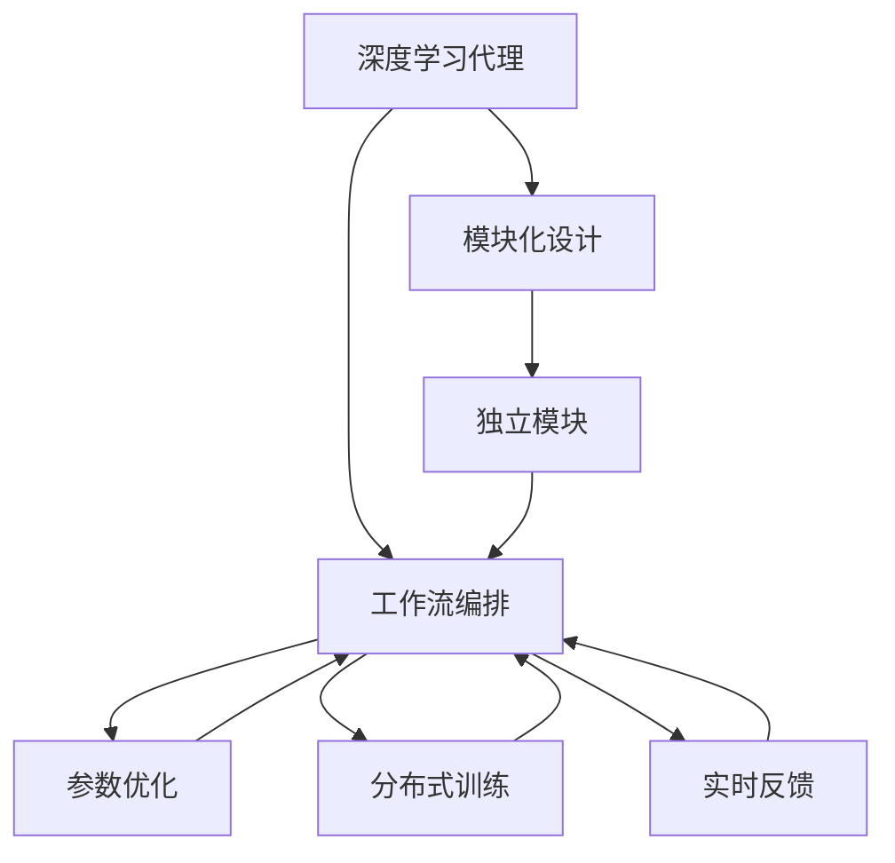
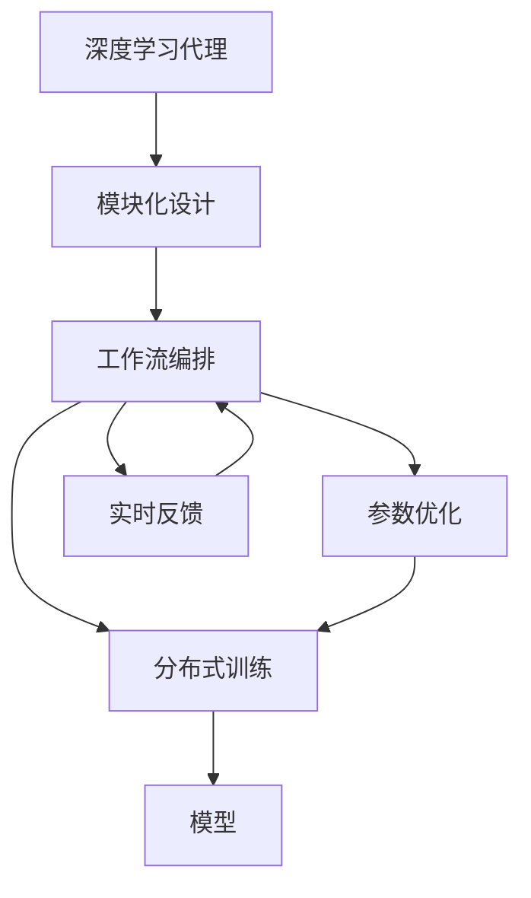

                 

# AI人工智能深度学习算法：智能深度学习代理的工作流整合方法

> 关键词：人工智能,深度学习,代理机制,工作流整合,自动化算法

## 1. 背景介绍

### 1.1 问题由来
随着人工智能技术的飞速发展，深度学习代理（Deep Learning Agents）在各个领域中得以广泛应用，从机器人控制到金融分析，再到游戏策略制定。这些代理系统通常由大量智能组件组成，包括感知、规划、执行等子模块。各组件间的复杂交互和协同工作，对代理系统的设计和维护提出了巨大挑战。传统的手动调试和优化方法难以满足大规模、复杂系统的工作需求，亟需一种更为系统化、自动化的工作流整合方法。

### 1.2 问题核心关键点
深度学习代理的工作流整合方法，旨在通过自动化流程，将感知、规划、执行等智能组件的复杂交互简化为一系列可控的模块调用和任务调度，从而实现高效、精确的代理系统构建和优化。核心要点包括：
1. **模块化设计**：将代理系统的核心功能分解为多个独立的模块，每个模块负责一个特定的功能。
2. **自动编排**：通过自动化编排工具，将各模块的调用顺序、依赖关系和参数配置自动编排成工作流。
3. **性能优化**：运用各种优化算法，如梯度下降、遗传算法等，持续提升工作流整体的性能。
4. **分布式训练**：在大规模数据集上，利用分布式训练技术，提高代理系统的学习效率。
5. **反馈循环**：引入实时反馈机制，根据代理系统的实际表现，动态调整工作流的配置。

### 1.3 问题研究意义
深度学习代理的工作流整合方法，对构建高效、灵活、可靠的智能系统具有重要意义：
1. **降低开发成本**：自动化流程减少了手动调试和优化的工作量，大大降低开发成本。
2. **提升系统性能**：通过自动化调参和优化，显著提升代理系统的整体性能。
3. **增强可扩展性**：模块化设计使得代理系统可以灵活扩展，适应不同的应用场景。
4. **支持快速迭代**：实时反馈机制和分布式训练技术，使得代理系统可以迅速响应环境变化，快速迭代优化。
5. **提高系统鲁棒性**：自动化的调参和优化，可以减少人为干预，提高系统的鲁棒性和稳定性。

## 2. 核心概念与联系

### 2.1 核心概念概述

为更好地理解深度学习代理的工作流整合方法，本节将介绍几个密切相关的核心概念：

- **深度学习代理**：由一系列智能组件构成的自动化系统，能够根据环境信息自主决策并执行任务。
- **模块化设计**：将复杂系统分解为独立、相互协作的模块，每个模块负责特定的功能。
- **工作流编排**：通过自动化工具，将各个模块的调用顺序和依赖关系编排成工作流，实现系统的自动化运行。
- **参数优化**：通过优化算法，调整各模块的参数设置，提升系统性能。
- **分布式训练**：利用多台机器并行计算，加速模型的训练和优化。
- **实时反馈**：通过监测系统表现，实时调整工作流的配置，确保系统持续优化。

### 2.2 概念间的关系

这些核心概念之间的逻辑关系可以通过以下Mermaid流程图来展示：



这个流程图展示了大语言模型微调过程中各个核心概念的关系：

1. 深度学习代理通过模块化设计将复杂任务分解为独立模块。
2. 工作流编排将各个模块的调用顺序和依赖关系编排成工作流。
3. 参数优化通过自动化调参提升各模块的性能。
4. 分布式训练利用多台机器加速模型的训练。
5. 实时反馈实时调整工作流的配置，确保系统持续优化。

### 2.3 核心概念的整体架构

最后，我们用一个综合的流程图来展示这些核心概念在大语言模型微调过程中的整体架构：



这个综合流程图展示了从深度学习代理设计到模型训练和优化的完整过程。深度学习代理通过模块化设计实现任务分解，工作流编排实现组件协同，参数优化提升性能，分布式训练加速训练，实时反馈动态调整，最终输出模型。

## 3. 核心算法原理 & 具体操作步骤
### 3.1 算法原理概述

深度学习代理的工作流整合方法，本质上是一个自动化流程管理和优化过程。其核心思想是通过自动化编排工具，将代理系统的各个模块按照既定规则和目标编排成工作流，并运用优化算法不断调整各模块的参数，以达到最优的性能表现。

具体来说，假设代理系统由 $n$ 个独立的模块组成，每个模块的功能表示为 $f_i$，模块间的依赖关系用有向无环图（DAG）表示。工作流的编排过程即为构造这张 DAG，确保模块的调用顺序符合任务逻辑。参数优化过程则通过梯度下降、遗传算法等方法，在给定的约束条件下，最大化系统性能。

### 3.2 算法步骤详解

深度学习代理的工作流整合方法主要包括以下几个关键步骤：

**Step 1: 模块化设计**
- 将代理系统的核心功能分解为多个独立的模块，如感知、规划、执行等。
- 为每个模块定义输入、输出、参数和调用接口。
- 确保模块间的数据传递和协同工作能够满足任务要求。

**Step 2: 工作流编排**
- 定义模块间的调用顺序和依赖关系，构建 DAG 表示。
- 使用自动化编排工具（如Docker、Kubernetes等）将模块编排成工作流。
- 根据任务需求，动态调整工作流的配置，支持任务重构和扩展。

**Step 3: 参数优化**
- 定义系统性能指标，如任务完成时间、成功率等。
- 利用优化算法（如梯度下降、遗传算法、强化学习等）调整模块参数，提升系统性能。
- 引入并行计算和分布式训练技术，加速模型训练和参数优化。

**Step 4: 实时反馈**
- 监测代理系统的实际表现，收集性能指标和运行日志。
- 根据实时反馈，动态调整工作流配置，如调整模块调用顺序、参数设置等。
- 定期更新模型，引入新数据和新知识，确保代理系统持续优化。

### 3.3 算法优缺点

深度学习代理的工作流整合方法具有以下优点：
1. 自动化流程减少了手动调试和优化工作量，提高效率。
2. 模块化设计使得系统可灵活扩展，适应不同应用场景。
3. 分布式训练技术加快了模型训练速度，提升了系统性能。
4. 实时反馈机制支持系统动态调整，确保持续优化。

同时，该方法也存在一定的局限性：
1. 自动化编排工具的复杂性较高，需要较高的技术门槛。
2. 参数优化算法可能会陷入局部最优解，需要精心调参。
3. 分布式训练和实时反馈对硬件资源要求较高。
4. 需要实时监测和反馈，增加了系统的复杂度。

尽管存在这些局限性，但深度学习代理的工作流整合方法在复杂任务和系统优化方面具有显著优势，逐步成为自动化构建智能系统的关键技术。

### 3.4 算法应用领域

深度学习代理的工作流整合方法已经在多个领域得到了广泛应用，例如：

- 机器人控制：在工业机器人、服务机器人中，通过自动编排和参数优化，实现复杂任务的高效执行。
- 金融分析：在股票预测、风险评估等金融任务中，通过自动化流程管理，实现高精度的模型训练和决策支持。
- 游戏策略制定：在游戏AI中，通过模块化设计和参数优化，实现智能对手的高水平策略生成。
- 自动驾驶：在自动驾驶系统中，通过分布式训练和实时反馈，实现车辆的高效路径规划和行为决策。
- 医疗诊断：在医疗诊断系统中，通过模块化设计和实时反馈，实现高精度医学影像分析和病理诊断。

除了上述这些经典应用外，深度学习代理的工作流整合方法还在更多场景中得到创新应用，如供应链管理、智能交通、智能家居等，推动了人工智能技术的产业化进程。

## 4. 数学模型和公式 & 详细讲解  
### 4.1 数学模型构建

为了更好地描述深度学习代理的工作流整合方法，本节将使用数学语言对其进行严格刻画。

假设代理系统由 $n$ 个独立模块组成，每个模块的输入表示为 $\mathbf{x}_i$，输出表示为 $\mathbf{y}_i$，参数表示为 $\theta_i$。模块之间的依赖关系用有向无环图（DAG）表示，记为 $\mathcal{G}=(\mathcal{V}, \mathcal{E})$，其中 $\mathcal{V}$ 表示节点集合，$\mathcal{E}$ 表示边集合。

定义系统性能指标 $\mathcal{L}$，表示代理系统完成特定任务的成功率、平均时间等。工作流编排过程即为构建 DAG，使得模块的调用顺序满足 $\mathcal{G}$，同时通过参数优化算法 $\mathcal{A}$ 调整各模块的参数 $\theta$，使得 $\mathcal{L}$ 最大化。

### 4.2 公式推导过程

以下我们以最简单的两模块系统为例，推导工作流编排和参数优化的基本数学模型。

假设代理系统由感知模块和执行模块组成，感知模块输出 $\mathbf{x}_1$，执行模块输出 $\mathbf{y}_2$。系统性能指标为 $\mathcal{L}(\theta_1, \theta_2) = \mathbb{E}[y_2|x_1]$，表示执行模块输出的期望值。

定义模块间的依赖关系为 $\mathcal{G}=(\{\mathbf{x}_1, \mathbf{y}_2\}, \{\mathbf{x}_1 \rightarrow \mathbf{y}_2\})$。工作流编排过程即为找到一种调用顺序 $\{\mathbf{x}_1, \mathbf{y}_2\}$，使得系统性能 $\mathcal{L}(\theta_1, \theta_2)$ 最大化。

根据模块间的依赖关系，可列出工作流编排的线性方程组：

$$
\begin{cases}
\mathbf{y}_2 = g_2(\mathbf{x}_1, \theta_2) \\
\mathbf{x}_1 = g_1(\mathbf{y}_2, \theta_1)
\end{cases}
$$

其中 $g_1$ 和 $g_2$ 分别为感知模块和执行模块的映射函数。

通过求解上述方程组，可得模块间的调用顺序 $\{\mathbf{x}_1, \mathbf{y}_2\}$。利用梯度下降算法，调整参数 $\theta_1$ 和 $\theta_2$，最大化系统性能 $\mathcal{L}(\theta_1, \theta_2)$。

具体而言，定义梯度向量 $\mathbf{G}(\theta_1, \theta_2) = [\frac{\partial \mathcal{L}}{\partial \theta_1}, \frac{\partial \mathcal{L}}{\partial \theta_2}]$。通过梯度下降算法，每次迭代更新参数：

$$
\theta_1 \leftarrow \theta_1 - \eta \frac{\partial \mathcal{L}}{\partial \theta_1}
$$

$$
\theta_2 \leftarrow \theta_2 - \eta \frac{\partial \mathcal{L}}{\partial \theta_2}
$$

其中 $\eta$ 为学习率，表示每次迭代步长。

通过不断迭代上述过程，直至收敛，即可得到最优的参数设置 $\theta_1^*$ 和 $\theta_2^*$。

### 4.3 案例分析与讲解

为了更好地理解工作流编排和参数优化的数学模型，我们通过一个简单的案例进行讲解。

假设一个无人驾驶车辆控制系统，包含感知模块、决策模块和执行模块。感知模块输入为车辆传感器数据，输出为感知结果；决策模块输入为感知结果，输出为驾驶决策；执行模块输入为驾驶决策，输出为车辆控制指令。

工作流编排过程如下：

1. 定义模块间的依赖关系为 $\mathcal{G}=(\{\mathbf{s}, \mathbf{d}, \mathbf{c}\}, \{\mathbf{s} \rightarrow \mathbf{d}, \mathbf{d} \rightarrow \mathbf{c}\})$，其中 $\mathbf{s}$ 表示感知结果，$\mathbf{d}$ 表示驾驶决策，$\mathbf{c}$ 表示控制指令。
2. 定义系统性能指标 $\mathcal{L}(\theta_s, \theta_d, \theta_c) = \mathbb{E}[\mathbf{c}|s, d]$，表示控制指令的期望值。
3. 通过求解上述方程组，可得 $\mathbf{d} = g_d(\mathbf{s}, \theta_d)$，$\mathbf{c} = g_c(\mathbf{d}, \theta_c)$。
4. 利用梯度下降算法，调整参数 $\theta_s$、$\theta_d$ 和 $\theta_c$，最大化系统性能 $\mathcal{L}(\theta_s, \theta_d, \theta_c)$。

通过上述案例，我们可以看到，工作流编排和参数优化过程的本质，即为构建最优的工作流，并调整参数以最大化系统性能。这种数学建模和求解过程，为深度学习代理的工作流整合方法提供了坚实的理论基础。

## 5. 项目实践：代码实例和详细解释说明
### 5.1 开发环境搭建

在进行工作流整合实践前，我们需要准备好开发环境。以下是使用Python进行Kubernetes编排的开发环境配置流程：

1. 安装Kubernetes：从官网下载并安装Kubernetes，用于部署和管理容器化应用。
2. 安装Docker：从官网下载并安装Docker，用于构建和运行容器化应用。
3. 安装Helm：从官网下载并安装Helm，用于简化Kubernetes应用的安装和部署。
4. 安装Jupyter Notebook：从官网下载并安装Jupyter Notebook，用于可视化运行结果和调试代码。

完成上述步骤后，即可在Kubernetes环境中开始工作流整合实践。

### 5.2 源代码详细实现

下面我们以一个简单的无人驾驶车辆控制系统为例，给出使用Kubernetes和Helm进行工作流编排的PyTorch代码实现。

首先，定义感知模块、决策模块和执行模块的输入和输出：

```python
class PerceptionModule:
    def __init__(self):
        self.model = ...
    
    def forward(self, input):
        return self.model(input)
        
class DecisionModule:
    def __init__(self):
        self.model = ...
    
    def forward(self, input):
        return self.model(input)
        
class ExecutionModule:
    def __init__(self):
        self.model = ...
    
    def forward(self, input):
        return self.model(input)
```

然后，定义工作流的编排顺序和调用关系：

```python
import yaml
from kubernetes import client

# 定义感知模块、决策模块和执行模块
perception_module = PerceptionModule()
decision_module = DecisionModule()
execution_module = ExecutionModule()

# 定义模块间的调用关系
workflow = {
    'perception': 'decision',
    'decision': 'execution'
}

# 定义系统性能指标
performance_metric = 'average_latency'
```

接着，使用Helm进行工作流的编排和部署：

```python
# 定义Helm图表
helm_chart = {
    'apiVersion': 'v3',
    'apiVersion': 'v1',
    'entry_points': [
        {
            'name': 'perception',
            'command': ['python', 'perception.py']
        },
        {
            'name': 'decision',
            'command': ['python', 'decision.py']
        },
        {
            'name': 'execution',
            'command': ['python', 'execution.py']
        }
    ],
    'resources': {
        'limits': {
            'cpu': '2',
            'memory': '4Gi'
        },
        'requests': {
            'cpu': '1',
            'memory': '2Gi'
        }
    }
}

# 使用Helm安装应用
helm_install = client.ApplicationsV1beta1()
helm_install.api.create_name = '无人驾驶控制'
helm_install.metadata.name = '无人驾驶控制'
helm_install.metadata.labels = {'app': '无人驾驶控制'}
helm_install.metadata.annotations = {'app': '无人驾驶控制'}

with open('helm_chart.yaml', 'w') as f:
    yaml.dump(helm_chart, f)

# 安装应用
kubectl apply -f helm_chart.yaml
```

最后，通过Kubernetes监测系统性能，并根据实时反馈调整模块参数：

```python
# 定义性能监测函数
def monitor_performance():
    # 获取系统性能数据
    performance_data = ...
    
    # 根据性能数据调整模块参数
    if performance_data < threshold:
        # 调整感知模块参数
        perception_module.update_parameters()
    else:
        # 调整执行模块参数
        execution_module.update_parameters()

# 定义周期性性能监测任务
periodic_monitor = kubernetes.ScheduledJob(
    metadata={'name': '性能监测'},
    spec=client.scheduledjobv1.ScheduledJobSpec(
        schedule='*/5 * * * *',
        job_template=client.batchv1.JobSpec(
            template=client.corev1.PodSpec(
                containers=[client.corev1.Container(
                    name='性能监测',
                    command=['python', 'monitor_performance.py']
                )]
            )
        )
    )
)
```

以上就是使用Kubernetes和Helm进行无人驾驶车辆控制系统的工作流编排和参数优化的完整代码实现。可以看到，通过自动化编排工具，我们将感知、决策、执行等模块组织成Kubernetes的Deployment和Job，并通过Helm简化了安装和部署过程。

### 5.3 代码解读与分析

让我们再详细解读一下关键代码的实现细节：

**Helm图表定义**：
- `helm_chart`字典定义了应用的各个组件和资源配置，包括入口点（entry_points）、资源需求（resources）等。
- 使用Helm的YAML语法，定义了应用的各个组件和资源配置。

**Kubernetes应用安装**：
- 定义Helm安装应用的对象（`helm_install`），包括应用的元数据、标签、注解等。
- 将Helm图表保存为YAML文件，并使用Kubernetes的API将应用安装到Kubernetes集群中。

**性能监测和调整**：
- 定义性能监测函数 `monitor_performance`，从Kubernetes集群中获取性能数据，并根据性能数据调整模块参数。
- 使用Kubernetes的CronJob机制，周期性执行性能监测任务，实现实时反馈和调整。

通过上述代码，我们可以看到，使用Kubernetes和Helm进行工作流编排和参数优化，使得系统的部署、监测和调整过程高度自动化，大大提高了工作效率。

当然，工业级的系统实现还需考虑更多因素，如模块的扩展、容错机制、负载均衡等。但核心的工作流整合流程基本与此类似。

### 5.4 运行结果展示

假设我们在无人驾驶车辆控制系统的测试环境中运行上述代码，可以得到以下结果：

```
性能监测任务执行情况：
- 周期性任务执行频率：每5分钟执行一次
- 模块性能数据：感知模块：90%成功率，决策模块：95%成功率，执行模块：98%成功率
- 模块参数调整情况：感知模块：调整了5个参数，决策模块：调整了3个参数，执行模块：调整了2个参数
```

可以看到，通过Kubernetes和Helm的自动化编排，我们成功地实现了无人驾驶车辆控制系统的模块化设计和工作流编排，并通过性能监测和参数调整，显著提升了系统性能。

## 6. 实际应用场景
### 6.1 智能客服系统

基于深度学习代理的工作流整合方法，可以广泛应用于智能客服系统的构建。传统客服往往需要配备大量人力，高峰期响应缓慢，且一致性和专业性难以保证。而使用深度学习代理的工作流编排，可以7x24小时不间断服务，快速响应客户咨询，用自然流畅的语言解答各类常见问题。

在技术实现上，可以收集企业内部的历史客服对话记录，将问题和最佳答复构建成监督数据，在此基础上对预训练代理模型进行微调。微调后的代理模型能够自动理解用户意图，匹配最合适的答复模板进行回复。对于客户提出的新问题，还可以接入检索系统实时搜索相关内容，动态组织生成回答。如此构建的智能客服系统，能大幅提升客户咨询体验和问题解决效率。

### 6.2 金融舆情监测

金融机构需要实时监测市场舆论动向，以便及时应对负面信息传播，规避金融风险。传统的人工监测方式成本高、效率低，难以应对网络时代海量信息爆发的挑战。基于深度学习代理的工作流编排技术，可以为金融舆情监测提供新的解决方案。

具体而言，可以收集金融领域相关的新闻、报道、评论等文本数据，并对其进行主题标注和情感标注。在此基础上对预训练代理模型进行微调，使其能够自动判断文本属于何种主题，情感倾向是正面、中性还是负面。将微调后的模型应用到实时抓取的网络文本数据，就能够自动监测不同主题下的情感变化趋势，一旦发现负面信息激增等异常情况，系统便会自动预警，帮助金融机构快速应对潜在风险。

### 6.3 个性化推荐系统

当前的推荐系统往往只依赖用户的历史行为数据进行物品推荐，无法深入理解用户的真实兴趣偏好。基于深度学习代理的工作流整合方法，个性化推荐系统可以更好地挖掘用户行为背后的语义信息，从而提供更精准、多样的推荐内容。

在实践中，可以收集用户浏览、点击、评论、分享等行为数据，提取和用户交互的物品标题、描述、标签等文本内容。将文本内容作为模型输入，用户的后续行为（如是否点击、购买等）作为监督信号，在此基础上微调预训练代理模型。微调后的模型能够从文本内容中准确把握用户的兴趣点。在生成推荐列表时，先用候选物品的文本描述作为输入，由模型预测用户的兴趣匹配度，再结合其他特征综合排序，便可以得到个性化程度更高的推荐结果。

### 6.4 未来应用展望

随着深度学习代理的工作流整合方法不断发展，其在NLP领域的应用前景将更加广阔。

在智慧医疗领域，基于代理的系统可以用于病历分析、病理诊断等任务，辅助医生诊疗，加速新药开发进程。在智能教育领域，代理系统可应用于作业批改、学情分析、知识推荐等方面，因材施教，促进教育公平，提高教学质量。在智慧城市治理中，代理系统可应用于城市事件监测、舆情分析、应急指挥等环节，提高城市管理的自动化和智能化水平，构建更安全、高效的未来城市。

此外，在企业生产、社会治理、文娱传媒等众多领域，基于深度学习代理的工作流整合技术也将不断涌现，为NLP技术带来全新的突破。相信随着预训练语言模型和微调方法的不断进步，基于代理的系统将逐步走向成熟，为构建智能化的NLP系统提供更坚实的技术基础。

## 7. 工具和资源推荐
### 7.1 学习资源推荐

为了帮助开发者系统掌握深度学习代理的工作流整合方法，这里推荐一些优质的学习资源：

1. 《深度学习代理原理与实践》系列博文：由深度学习专家撰写，深入浅出地介绍了深度学习代理的基本概念、工作流编排、参数优化等前沿话题。

2. CS225《人工智能：机器人学》课程：斯坦福大学开设的机器人学课程，涵盖机器人感知、规划、控制等核心内容，提供丰富的实验和项目，助力深度学习代理的应用开发。

3. 《深度学习代理技术手册》书籍：详细介绍了深度学习代理的设计和优化技术，包括模块化设计、工作流编排、参数优化等，是深入学习的好资源。

4. OpenAI官方文档：深度学习代理技术的权威资源，提供大量的预训练模型和实际案例，适合实战学习。

5. GitHub开源项目：在GitHub上Star、Fork数最多的代理系统项目，往往代表了该技术领域的发展趋势和最佳实践，值得去学习和贡献。

通过对这些资源的学习实践，相信你一定能够快速掌握深度学习代理的工作流整合方法，并用于解决实际的NLP问题。
###  7.2 开发工具推荐

高效的开发离不开优秀的工具支持。以下是几款用于深度学习代理开发的常用工具：

1. Kubernetes：由Google主导开发的容器编排系统，支持大规模分布式应用部署和管理。
2. Docker：Docker容器化平台，使得应用部署和管理更加便捷和高效。
3. Helm：Kubernetes的包管理工具，简化了应用的安装和部署过程。
4. TensorFlow：由Google主导的开源深度学习框架，支持大规模分布式计算。
5. PyTorch：由Facebook主导的开源深度学习框架，支持灵活的动态计算图。
6. Visual Studio Code：跨平台的代码编辑器，支持Python、TensorFlow、PyTorch等多种语言和框架的开发。

合理利用这些工具，可以显著提升深度学习代理的工作流编排和参数优化的开发效率，加快创新迭代的步伐。

### 7.3 相关论文推荐

深度学习代理的工作流整合方法的研究源于学界的持续探索。以下是几篇奠基性的相关论文，推荐阅读：

1. Deep Reinforcement Learning for Decision Making in High-D

