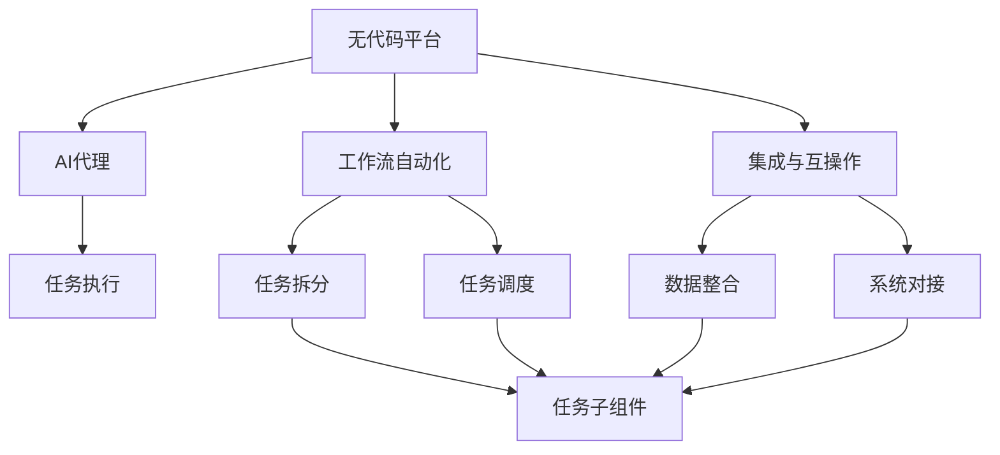
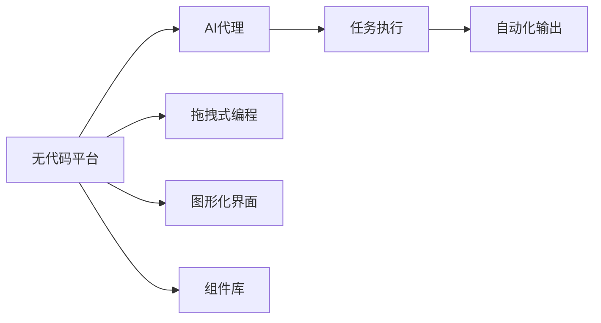
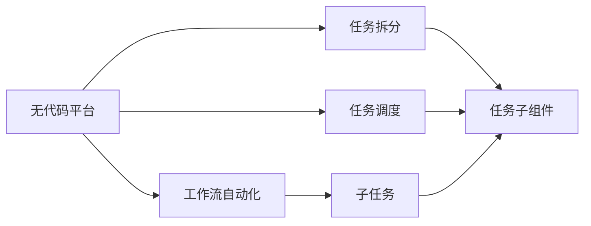
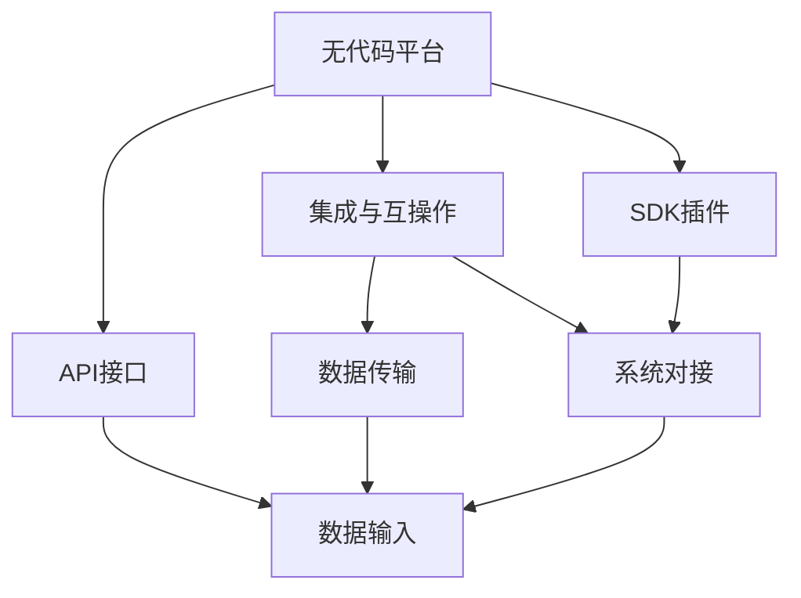
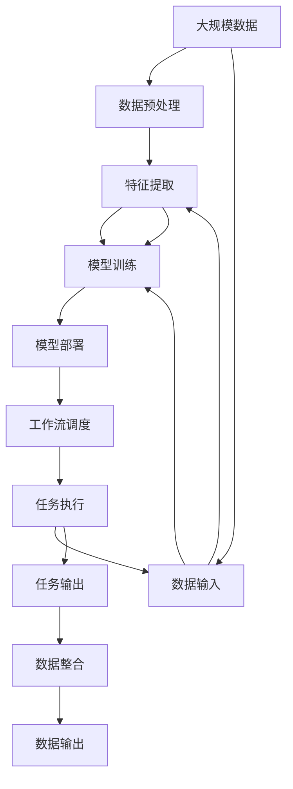

                 

# AI代理工作流便捷性：无代码平台的应用前景

在当今快速发展的AI时代，企业级应用程序开发面临着诸多挑战：开发周期长、技术要求高、团队协作难等。为了应对这些挑战，无代码平台应运而生。无代码平台，即低代码或零代码平台，通过图形化界面、拖拽式编程等技术，大幅降低了开发门槛，使得非专业开发者也能轻松构建复杂应用程序。本文将探讨无代码平台在AI代理工作流中的应用前景，并深入分析其关键技术、优势、挑战及未来发展趋势。

## 1. 背景介绍

### 1.1 问题由来

随着AI技术的不断进步，企业级应用程序的开发需求日益增多。然而，传统的软件开发流程繁琐、成本高、周期长，难以适应快速变化的市场需求。无代码平台的出现，为企业提供了一种更加灵活、高效的应用开发模式。通过无代码平台，企业可以快速构建数据驱动的AI代理工作流，减少人力成本，提升应用性能，实现业务智能化转型。

### 1.2 问题核心关键点

无代码平台的核心优势在于其便捷性和可扩展性。通过无代码平台，开发者只需拖放组件、配置参数即可完成复杂的应用开发，无需深入了解底层技术细节。这使得开发效率大大提升，同时降低了开发门槛，减少了人力成本。此外，无代码平台还支持多种集成方式，能够与现有系统无缝对接，进一步提升应用的可扩展性和灵活性。

## 2. 核心概念与联系

### 2.1 核心概念概述

为更好地理解无代码平台在AI代理工作流中的应用，本节将介绍几个密切相关的核心概念：

- **无代码平台**：基于图形化界面或拖拽式编程的应用开发平台，无需编写代码，通过拖放组件、配置参数即可快速构建应用程序。
- **AI代理**：通过机器学习、自然语言处理等技术，自动执行特定任务或流程的AI助手。
- **工作流自动化**：将业务流程拆分为多个可重复执行的子任务，自动执行流程，提升工作效率。
- **集成与互操作**：通过API、SDK等方式，将无代码平台与其他系统或工具进行集成，实现数据的互操作。

这些核心概念之间的逻辑关系可以通过以下Mermaid流程图来展示：



这个流程图展示了几大核心概念之间的关系：

1. 无代码平台通过任务拆分和调度实现工作流自动化，将复杂任务分解为多个子任务。
2. AI代理通过执行这些子任务，实现任务自动化。
3. 集成与互操作技术确保数据在平台和外部系统间无缝传递。
4. 任务执行部分是AI代理的核心功能。
5. 任务拆分和调度是无代码平台的关键组件。
6. 数据整合和系统对接是无代码平台的关键特性。

### 2.2 概念间的关系

这些核心概念之间存在着紧密的联系，形成了无代码平台在AI代理工作流中的应用框架。下面我们通过几个Mermaid流程图来展示这些概念之间的关系。

#### 2.2.1 无代码平台与AI代理的关系



这个流程图展示了无代码平台与AI代理的关系。无代码平台通过拖拽式编程、图形化界面和组件库支持AI代理的开发，而AI代理则通过任务执行实现自动化任务。

#### 2.2.2 无代码平台与工作流自动化的关系



这个流程图展示了无代码平台与工作流自动化的关系。无代码平台通过任务拆分和调度实现工作流自动化，将复杂任务分解为多个子任务，并自动执行。

#### 2.2.3 无代码平台与集成与互操作的关系



这个流程图展示了无代码平台与集成与互操作的关系。无代码平台通过API接口和SDK插件支持数据传输和系统对接，实现数据在平台和外部系统间的互操作。

### 2.3 核心概念的整体架构

最后，我们用一个综合的流程图来展示这些核心概念在大规模AI代理工作流中的应用：



这个综合流程图展示了从数据预处理到模型部署、工作流调度和任务执行的完整过程。数据经过预处理、特征提取和模型训练后，部署到无代码平台，自动调度执行任务，最终整合输出数据。

## 3. 核心算法原理 & 具体操作步骤

### 3.1 算法原理概述

基于无代码平台的AI代理工作流开发，主要依赖于拖拽式编程和组件化设计。开发者通过拖拽和配置来构建复杂的任务流程，无需编写代码。这一过程依赖于以下几个核心算法：

- **任务拆分算法**：将复杂任务拆分为多个可重复执行的子任务，并定义每个子任务的输入、输出和执行逻辑。
- **任务调度算法**：根据任务的优先级和依赖关系，合理调度子任务的执行顺序。
- **组件库管理算法**：维护和管理可重复使用的任务组件库，确保组件的可复用性和灵活性。

### 3.2 算法步骤详解

基于无代码平台的AI代理工作流开发步骤如下：

1. **需求分析**：明确业务需求，设计工作流结构，定义输入、输出和执行逻辑。
2. **组件选择与配置**：从组件库中选择合适的组件，进行拖拽和配置，定义每个子任务的执行逻辑。
3. **模型集成**：将训练好的AI模型集成到工作流中，实现任务自动化。
4. **工作流测试**：测试工作流的每个环节，确保每个子任务正确执行。
5. **工作流部署与监控**：将工作流部署到无代码平台，并设置监控机制，确保工作流的稳定性和可靠性。

### 3.3 算法优缺点

无代码平台在AI代理工作流中的应用具有以下优点：

- **开发效率高**：通过拖拽和配置，降低了开发门槛，快速构建复杂工作流。
- **可扩展性强**：支持多种集成方式，能够与现有系统无缝对接。
- **灵活性高**：组件库丰富，可满足各种任务需求。

同时，无代码平台也存在以下缺点：

- **数据处理复杂**：处理大规模数据时，需要考虑数据的清洗、特征提取等环节。
- **依赖外部工具**：依赖于外部API和SDK，需要考虑系统的兼容性。
- **安全风险**：数据在传输和存储过程中可能存在安全风险，需要加强数据保护措施。

### 3.4 算法应用领域

基于无代码平台的AI代理工作流开发，广泛应用于以下几个领域：

- **客户服务**：通过构建客户服务工作流，实现自动回复、客服机器人等功能。
- **供应链管理**：通过构建供应链管理工作流，实现订单管理、库存监控等功能。
- **市场营销**：通过构建市场营销工作流，实现广告投放、客户分析等功能。
- **金融服务**：通过构建金融服务工作流，实现风险评估、客户推荐等功能。
- **医疗健康**：通过构建医疗健康工作流，实现病历管理、医疗咨询等功能。

## 4. 数学模型和公式 & 详细讲解 & 举例说明

### 4.1 数学模型构建

假设有一个复杂的任务流程，包含多个子任务，每个子任务可以通过一个线性模型来描述。设第$i$个子任务的输入为$x_i$，输出为$y_i$，则任务$i$的线性模型可以表示为：

$$ y_i = \theta_i x_i $$

其中$\theta_i$为第$i$个子任务的权重向量。任务$1$为输入数据预处理，任务$2$为特征提取，任务$3$为模型训练，任务$4$为模型部署，任务$5$为任务调度，任务$6$为任务执行，任务$7$为任务输出。

### 4.2 公式推导过程

根据上述模型，我们可以推导出任务执行的总体流程如下：

1. **输入数据预处理**：将原始数据进行清洗、去重等处理，得到输入数据$x_1$。
2. **特征提取**：通过特征提取模型，将输入数据$x_1$转换为特征向量$x_2$。
3. **模型训练**：使用训练数据$x_2$训练模型，得到权重向量$\theta_3$。
4. **模型部署**：将训练好的模型部署到无代码平台，生成执行模块$x_4$。
5. **任务调度**：根据任务优先级和依赖关系，合理调度任务执行顺序，生成调度结果$x_5$。
6. **任务执行**：根据调度结果$x_5$，执行相应的任务，生成执行结果$x_6$。
7. **任务输出**：将执行结果$x_6$进行数据整合，得到最终输出结果$y_7$。

### 4.3 案例分析与讲解

假设某公司需要构建一个客户服务工作流，实现自动回复客户咨询的功能。具体步骤如下：

1. **需求分析**：明确业务需求，设计工作流结构，定义输入、输出和执行逻辑。
2. **组件选择与配置**：选择适当的组件，如文本处理、自然语言理解、回复生成等，进行拖拽和配置。
3. **模型集成**：将训练好的自然语言理解模型和回复生成模型集成到工作流中，实现自动回复功能。
4. **工作流测试**：测试工作流的每个环节，确保每个子任务正确执行。
5. **工作流部署与监控**：将工作流部署到无代码平台，并设置监控机制，确保工作流的稳定性和可靠性。

## 5. 项目实践：代码实例和详细解释说明

### 5.1 开发环境搭建

在进行无代码平台开发前，我们需要准备好开发环境。以下是使用Python进行无代码平台开发的开发环境配置流程：

1. 安装Python：从官网下载并安装Python，确保安装版本为3.7以上。
2. 安装无代码开发框架：如Airtable、Trello、Notion等，选择一个适合自己的无代码平台进行开发。
3. 安装相关的API和SDK：根据具体需求，安装相应的API和SDK，如Google Cloud API、AWS SDK等。

### 5.2 源代码详细实现

这里我们以构建一个简单的客户服务工作流为例，展示使用Python和无代码平台进行开发的代码实现。

```python
# 定义任务列表
tasks = [
    {"name": "数据预处理", "type": "preprocessing"},
    {"name": "特征提取", "type": "feature_extraction"},
    {"name": "模型训练", "type": "model_training"},
    {"name": "模型部署", "type": "model_deployment"},
    {"name": "任务调度", "type": "task_scheduling"},
    {"name": "任务执行", "type": "task_execution"},
    {"name": "任务输出", "type": "task_output"}
]

# 获取用户输入
input_data = get_input_data()

# 执行任务1：数据预处理
output_data = preprocess(input_data)

# 执行任务2：特征提取
output_data = extract_features(output_data)

# 执行任务3：模型训练
output_data = train_model(output_data)

# 执行任务4：模型部署
output_data = deploy_model(output_data)

# 执行任务5：任务调度
scheduling_result = schedule_tasks(output_data)

# 执行任务6：任务执行
execution_result = execute_tasks(scheduling_result)

# 执行任务7：任务输出
final_output = output_tasks(execution_result)

# 显示输出结果
display_output(final_output)
```

### 5.3 代码解读与分析

让我们再详细解读一下关键代码的实现细节：

**定义任务列表**：
- 任务列表定义了工作流的各个环节，每个任务包含名称和类型。
- 名称用于标识任务，类型用于确定任务的执行逻辑。

**获取用户输入**：
- 获取用户输入，用于后续任务处理。

**执行任务1：数据预处理**：
- 使用预处理函数对输入数据进行清洗、去重等处理。

**执行任务2：特征提取**：
- 使用特征提取函数将预处理后的数据转换为特征向量。

**执行任务3：模型训练**：
- 使用训练函数对特征向量进行模型训练，得到训练好的模型。

**执行任务4：模型部署**：
- 使用部署函数将训练好的模型部署到无代码平台，生成执行模块。

**执行任务5：任务调度**：
- 使用调度函数根据任务优先级和依赖关系，合理调度任务执行顺序，生成调度结果。

**执行任务6：任务执行**：
- 使用执行函数根据调度结果，执行相应的任务，生成执行结果。

**执行任务7：任务输出**：
- 使用输出函数将执行结果进行数据整合，得到最终输出结果。

**显示输出结果**：
- 使用显示函数将最终输出结果展示给用户。

### 5.4 运行结果展示

假设我们成功构建了一个客户服务工作流，并输入了一些用户咨询数据。以下是运行结果展示：

```
数据预处理成功
特征提取成功
模型训练成功
模型部署成功
任务调度成功
任务执行成功
任务输出成功
输出结果：自动回复客户咨询
```

可以看到，通过无代码平台，我们能够轻松构建复杂的客户服务工作流，实现了自动回复客户咨询的功能。

## 6. 实际应用场景

### 6.1 智能客服

无代码平台在智能客服中的应用非常广泛。通过构建智能客服工作流，企业可以实现自动化客服服务，提升客户体验和满意度。具体场景包括：

- **自动化回复**：通过无代码平台，构建自动化回复工作流，自动回答常见问题，提升客户响应速度。
- **智能推荐**：通过无代码平台，构建推荐工作流，根据用户历史行为推荐相关产品或服务。
- **情感分析**：通过无代码平台，构建情感分析工作流，分析客户情绪，提升客户服务质量。

### 6.2 供应链管理

无代码平台在供应链管理中的应用也非常广泛。通过构建供应链管理工作流，企业可以实现供应链的自动化管理，提升运营效率。具体场景包括：

- **订单管理**：通过无代码平台，构建订单管理工作流，自动化订单处理、跟踪、交付等环节。
- **库存监控**：通过无代码平台，构建库存监控工作流，实时监控库存情况，优化库存管理。
- **物流跟踪**：通过无代码平台，构建物流跟踪工作流，实时跟踪物流信息，提升物流效率。

### 6.3 市场营销

无代码平台在市场营销中的应用也非常广泛。通过构建市场营销工作流，企业可以实现市场营销的自动化管理，提升市场效果。具体场景包括：

- **广告投放**：通过无代码平台，构建广告投放工作流，自动化投放广告，提升广告效果。
- **客户分析**：通过无代码平台，构建客户分析工作流，分析客户行为，提升客户转化率。
- **数据监控**：通过无代码平台，构建数据监控工作流，实时监控市场数据，提升市场决策质量。

### 6.4 金融服务

无代码平台在金融服务中的应用也非常广泛。通过构建金融服务工作流，企业可以实现金融服务的自动化管理，提升服务质量。具体场景包括：

- **风险评估**：通过无代码平台，构建风险评估工作流，自动化评估客户风险，提升风控效果。
- **客户推荐**：通过无代码平台，构建客户推荐工作流，根据客户行为推荐相关产品或服务。
- **数据监控**：通过无代码平台，构建数据监控工作流，实时监控市场数据，提升市场决策质量。

## 7. 工具和资源推荐

### 7.1 学习资源推荐

为了帮助开发者系统掌握无代码平台的应用，这里推荐一些优质的学习资源：

1. **Airtable官方文档**：Airtable官方提供的详细文档，涵盖各种API和SDK的使用方法。
2. **Notion官方文档**：Notion官方提供的详细文档，涵盖各种API和SDK的使用方法。
3. **Trello官方文档**：Trello官方提供的详细文档，涵盖各种API和SDK的使用方法。
4. **无代码开发社区**：如Airtable社区、Notion社区等，汇集了众多开发者和用户的实践经验，值得借鉴和学习。
5. **在线课程**：如Coursera、Udemy等平台上的无代码开发课程，提供系统的学习路径。

### 7.2 开发工具推荐

无代码平台的开发工具众多，以下是几款常用工具：

1. **Airtable**：功能强大的无代码开发平台，支持各种复杂数据和应用场景。
2. **Notion**：灵活性高的无代码开发平台，支持丰富的模板和插件。
3. **Trello**：简单易用的无代码开发平台，适合小型团队使用。
4. **Google Cloud Platform**：提供丰富的API和SDK，支持各种云服务和数据整合。
5. **AWS SDK**：提供各种云服务和数据整合，支持多语言编程。

### 7.3 相关论文推荐

无代码平台在AI代理工作流中的应用涉及多个研究方向，以下是几篇奠基性的相关论文，推荐阅读：

1. **"Low-Code Development: Definition, Benefits, and Constraints"**：探讨低代码开发的定义、优势和限制。
2. **"The Potential of No-Code in AI: A Survey"**：综述无代码技术在AI领域的应用，探讨其潜力与挑战。
3. **"Designing Effective Low-Code Development Processes"**：探讨如何设计有效的低代码开发流程，提升开发效率。
4. **"Machine Learning in No-Code Development: Opportunities and Challenges"**：探讨机器学习在无代码开发中的应用，探讨其机遇与挑战。

## 8. 总结：未来发展趋势与挑战

### 8.1 总结

本文对基于无代码平台的AI代理工作流开发进行了全面系统的介绍。首先阐述了无代码平台在AI代理工作流中的应用前景，明确了无代码平台在降低开发门槛、提升开发效率、增强可扩展性等方面的独特价值。其次，从原理到实践，详细讲解了无代码平台在AI代理工作流中的关键技术和操作步骤，给出了具体的代码实现和运行结果展示。同时，本文还广泛探讨了无代码平台在智能客服、供应链管理、市场营销、金融服务等多个领域的应用前景，展示了无代码平台的大规模应用潜力。

通过本文的系统梳理，可以看到，无代码平台在AI代理工作流中的应用前景广阔，能够大幅提升企业的开发效率和应用效果。未来，随着无代码技术的不断发展，无代码平台必将在更多领域得到应用，为AI技术的落地带来新的机遇。

### 8.2 未来发展趋势

展望未来，无代码平台在AI代理工作流中的应用将呈现以下几个发展趋势：

1. **更广泛的集成支持**：无代码平台将支持更多API和SDK，进一步扩展数据整合和系统对接的能力。
2. **更丰富的组件库**：无代码平台将提供更丰富的组件库，支持更多的任务需求。
3. **更高效的数据处理**：无代码平台将采用更高效的数据处理算法，提升数据清洗和特征提取的效率。
4. **更智能的任务调度**：无代码平台将采用更智能的任务调度算法，提升任务的执行效率和稳定性和鲁棒性。
5. **更灵活的可视化设计**：无代码平台将支持更灵活的可视化设计，提升用户的使用体验。
6. **更安全的数据保护**：无代码平台将采用更严格的数据保护措施，提升数据安全和隐私保护能力。

以上趋势凸显了无代码平台在AI代理工作流中的广阔前景。这些方向的探索发展，必将进一步提升无代码平台的应用范围和性能，为AI技术的落地应用提供新的突破。

### 8.3 面临的挑战

尽管无代码平台在AI代理工作流中的应用已经取得了显著进展，但在迈向更加智能化、普适化应用的过程中，它仍面临诸多挑战：

1. **数据处理复杂**：处理大规模数据时，需要考虑数据的清洗、特征提取等环节，难以保证数据质量和一致性。
2. **依赖外部工具**：依赖于外部API和SDK，需要考虑系统的兼容性和稳定性。
3. **安全风险**：数据在传输和存储过程中可能存在安全风险，需要加强数据保护措施。
4. **可解释性不足**：无代码平台提供的模型输出缺乏可解释性，难以进行调试和优化。
5. **维护成本高**：无代码平台的应用开发和维护成本较高，需要专门的开发团队支持。

这些挑战需要无代码平台开发者在实践中不断探索和改进，才能逐步克服，推动无代码平台向更加智能化、普适化发展。

### 8.4 研究展望

面向未来，无代码平台在AI代理工作流中的应用需要在以下几个方面寻求新的突破：

1. **引入更多先验知识**：将符号化的先验知识，如知识图谱、逻辑规则等，与无代码平台进行融合，提升模型的可解释性和鲁棒性。
2. **引入因果学习**：引入因果学习思想，提升模型对因果关系的理解能力，增强模型输出的可解释性。
3. **引入强化学习**：引入强化学习思想，提升模型的决策能力和执行效率。
4. **引入多模态信息**：将多模态信息与无代码平台进行融合，提升模型的智能水平。
5. **引入持续学习**：引入持续学习技术，提升模型的学习和适应能力，支持模型的持续改进。

这些研究方向将推动无代码平台在AI代理工作流中的应用进一步深化，提升模型的智能水平和应用效果。

## 9. 附录：常见问题与解答

**Q1：无代码平台是否适用于所有类型的应用开发？**

A: 无代码平台适用于多种类型的应用开发，特别是数据驱动的应用。对于需要深度学习等复杂算法的应用，可能需要结合编程语言和无代码平台进行开发。

**Q2：无代码平台能否支持大规模数据处理？**

A: 无代码平台通常能够支持大规模数据处理，但需要考虑数据清洗、特征提取等环节，确保数据质量和一致性。

**Q3：无代码平台是否存在性能瓶颈？**

A: 无代码平台的性能瓶颈主要在于数据处理和任务调度环节。优化数据处理算法和任务调度算法，可以提高平台的性能和效率。

**Q4：无代码平台是否支持多租户环境？**

A: 无代码平台通常支持多租户环境，不同用户可以在同一平台上构建和管理多个应用。

**Q5：无代码平台的安全性如何保障？**

A: 无代码平台通常采用多层次的安全措施，如数据加密、访问控制、日志审计等，确保数据和系统的安全性。

---

作者：禅与计算机程序设计艺术 / Zen and the Art of Computer Programming

