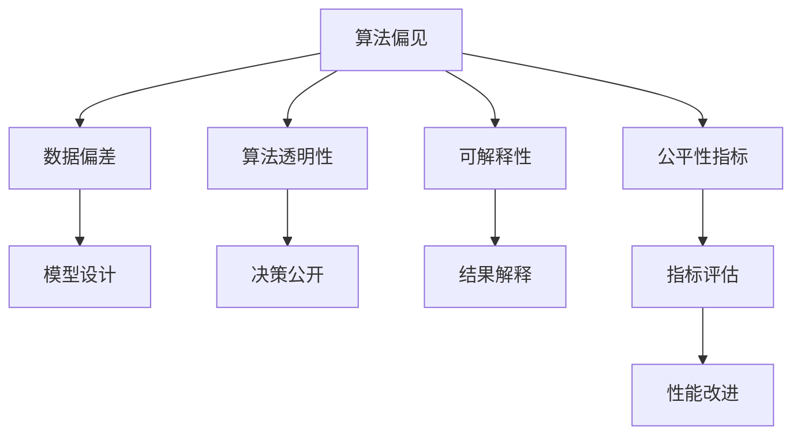
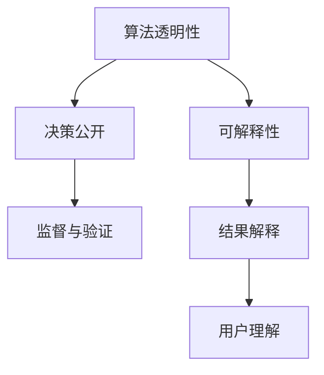
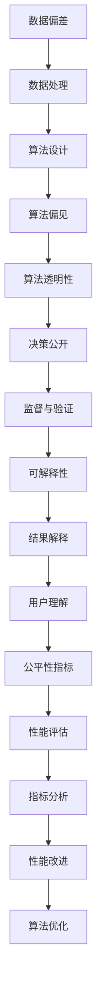

                 

# AI伦理与算法公平性原理与代码实战案例讲解

> 关键词：AI伦理, 算法公平性, 算法偏见, 算法透明性, 可解释性, Python代码, 案例分析

## 1. 背景介绍

### 1.1 问题由来

随着人工智能(AI)技术的迅猛发展，AI算法在金融、医疗、教育、司法等多个领域的应用日益广泛。然而，AI系统的快速部署和普及，也在伦理、公平、透明、可解释性等方面提出了新的挑战。近年来，关于AI伦理和公平性的争议不断涌现，引发了社会各界的广泛关注。

AI系统的应用必须遵守伦理和公平原则，确保算法决策透明、公正、可解释，避免对特定群体或个体产生歧视性影响。例如，在医疗领域，AI系统可能因数据偏差而对特定种族或性别产生误诊；在司法领域，AI算法可能因模型偏见而对少数族裔和贫困群体做出不公平判决；在金融领域，AI模型可能因数据歧视而对不同社会经济地位的人产生不同的贷款决策。

这些问题不仅影响AI系统的公信力和应用效果，还可能导致严重的社会后果，引发公众对AI技术的质疑和抵制。因此，研究和解决AI伦理与算法公平性问题，已成为推动AI技术健康发展的重要课题。

### 1.2 问题核心关键点

解决AI伦理与算法公平性问题，核心在于：

- 算法偏见：确保AI算法对所有群体公平对待，不因种族、性别、年龄、经济状况等个人特征产生歧视。
- 算法透明性：使AI算法决策过程公开透明，便于监督和验证。
- 可解释性：提供清晰、易懂、可信任的AI算法解释，增强用户对算法的理解与信任。
- 公平性指标：制定合理、科学的公平性评价标准，评估和改进AI系统性能。

解决这些关键问题，需要从算法设计、数据预处理、模型训练、结果评估等多个环节进行全面考虑，采用技术手段和伦理规范相结合的方式，构建公正、透明、可解释的AI系统。

## 2. 核心概念与联系

### 2.1 核心概念概述

为更好地理解AI伦理与算法公平性问题，本节将介绍几个密切相关的核心概念：

- 算法偏见（Algorithmic Bias）：AI算法因数据偏差、模型设计等原因，对特定群体产生不公平对待的现象。例如，金融贷款系统因偏见而对少数族裔贷款更严格，司法系统因模型偏差而对女性判决更严厉。

- 算法透明性（Algorithmic Transparency）：AI算法决策过程的开放性和可理解性，使相关方能够验证算法结果的合理性。透明性包括算法工作原理、参数调整、决策依据等信息的公开。

- 可解释性（Explainability）：AI算法输出结果的可理解性和可解释性，帮助用户理解AI系统的决策依据，增强系统可信度。可解释性通常通过语言、图像、可视化等手段实现。

- 公平性指标（Fairness Metrics）：用于评估AI系统在不同群体上的公平性表现的指标，如准确率、召回率、误判率等。常见的公平性指标包括敏感性分析、均等差异分析、机会均等分析等。

这些核心概念之间的逻辑关系可以通过以下Mermaid流程图来展示：

这个流程图展示了大语言模型的核心概念及其之间的关系：

1. 算法偏见是由数据偏差和模型设计引起的。
2. 算法透明性要求决策过程的公开和透明。
3. 可解释性使输出结果易于理解。
4. 公平性指标评估和改进算法性能。

这些概念共同构成了AI伦理与算法公平性的重要组成部分，其关系相互作用，构成了一个完整的生态系统。

### 2.2 概念间的关系

这些核心概念之间存在着紧密的联系，形成了AI伦理与算法公平性的完整生态系统。下面我通过几个Mermaid流程图来展示这些概念之间的关系。

#### 2.2.1 算法偏见与数据偏差

这个流程图展示了数据偏差如何导致算法偏见，以及如何通过数据处理和清洗减少偏差的影响。

#### 2.2.2 算法透明性与可解释性

这个流程图展示了算法透明性如何帮助用户理解和验证算法结果，以及可解释性如何提供清晰、易懂、可信任的解释。

#### 2.2.3 公平性指标与算法性能

这个流程图展示了如何通过公平性指标评估和改进算法性能，确保AI系统在不同群体上的公平性表现。

### 2.3 核心概念的整体架构

最后，我们用一个综合的流程图来展示这些核心概念在大语言模型伦理与算法公平性问题中的整体架构：

这个综合流程图展示了从数据偏差处理到算法优化，整个AI伦理与算法公平性的完整过程。通过这些流程图，我们可以更清晰地理解AI伦理与算法公平性问题的各个关键环节和相关概念。

## 3. 核心算法原理 & 具体操作步骤
### 3.1 算法原理概述

AI伦理与算法公平性的解决，主要通过以下几种方法：

- 数据处理与清洗：通过数据增广、平衡、重采样等技术，减少数据偏差和噪声。
- 算法设计：采用公平性约束的算法架构，如公平优化、去偏算法等，优化模型性能。
- 算法透明性：通过模型解释、决策可视化等手段，提高算法透明性。
- 公平性指标：采用合理的公平性评价标准，评估和改进算法性能。

具体实现时，可以借助Python编程语言和相关库，如Scikit-learn、TensorFlow等，实现数据处理、模型训练、评估和优化。

### 3.2 算法步骤详解

以下将详细介绍AI伦理与算法公平性问题的具体操作步骤：

#### 3.2.1 数据处理与清洗

- 数据收集：从不同来源收集相关数据，确保数据多样性和代表性。
- 数据清洗：去除异常值、缺失值、噪声等，确保数据质量。
- 数据平衡：通过欠采样、过采样、合成生成等技术，平衡不同群体之间的数据分布。
- 数据增广：通过数据增强技术，如旋转、平移、镜像等，增加数据多样性。

#### 3.2.2 算法设计与训练

- 算法选择：选择合适的算法架构，如线性回归、决策树、支持向量机等，并添加公平性约束。
- 模型训练：在处理后的数据集上训练模型，调整参数，优化性能。
- 模型评估：使用公平性指标评估模型性能，如准确率、召回率、误判率等。
- 模型优化：根据评估结果，调整模型参数，优化算法性能。

#### 3.2.3 算法透明性与可解释性

- 决策可视化：通过决策树、特征重要性等技术，可视化模型的决策过程。
- 模型解释：使用语言、图像等形式，解释模型的输出结果。
- 用户理解：提供易于理解的解释和指南，帮助用户理解模型结果。

#### 3.2.4 公平性指标与评价

- 指标选择：选择合适的公平性指标，如均等差异分析、机会均等分析等。
- 指标评估：计算模型在不同群体上的指标值，评估公平性表现。
- 性能改进：根据评估结果，改进模型，提升公平性性能。

### 3.3 算法优缺点

#### 3.3.1 优点

- 减少数据偏差：通过数据处理和清洗，减少数据偏差，提高模型公平性。
- 优化算法性能：采用公平性约束的算法架构，提升模型性能。
- 提高算法透明性与可解释性：通过决策可视化、模型解释等技术，提高算法透明性和可解释性。
- 科学评估公平性：采用合理的公平性评价标准，科学评估和改进算法性能。

#### 3.3.2 缺点

- 数据处理复杂：数据处理和清洗工作量大，复杂度高。
- 算法设计复杂：公平性约束的算法架构设计复杂，容易引入额外开销。
- 性能优化困难：公平性优化可能与模型性能提升产生冲突，难以平衡。
- 模型解释难度大：复杂的模型结构难以解释，解释结果可能不够可信。

### 3.4 算法应用领域

AI伦理与算法公平性问题在多个领域都有重要应用，包括但不限于：

- 医疗领域：确保医疗诊断和治疗方案的公平性，避免因数据偏差产生的歧视性决策。
- 金融领域：确保贷款、保险等金融服务的公平性，避免因数据偏见产生的歧视性决策。
- 司法领域：确保司法判决的公平性，避免因模型偏见产生的歧视性判决。
- 教育领域：确保教育资源分配的公平性，避免因数据偏差产生的歧视性评估。
- 招聘领域：确保招聘过程的公平性，避免因数据偏见产生的歧视性招聘决策。

这些领域的应用展示了AI伦理与算法公平性的广泛影响，其合理解决对社会公平和公正具有重要意义。

## 4. 数学模型和公式 & 详细讲解 & 举例说明

### 4.1 数学模型构建

为了更好地理解和实现AI伦理与算法公平性问题，本节将使用数学语言对问题进行更加严格的刻画。

设有一个训练数据集 $D = \{(x_i, y_i)\}_{i=1}^N$，其中 $x_i$ 为输入特征，$y_i$ 为标签，$N$ 为样本数。假设模型为线性回归模型 $f(x; \theta) = \theta_0 + \theta_1 x_1 + \ldots + \theta_k x_k$，其中 $\theta = (\theta_0, \theta_1, \ldots, \theta_k)$ 为模型参数。

假设模型对 $m$ 个不同群体的数据进行训练，目标是确保模型对所有群体公平对待。记 $m$ 个群体的训练数据分别为 $D_1, D_2, \ldots, D_m$，每个群体 $D_j$ 包含 $n_j$ 个样本，则模型在群体 $D_j$ 上的公平性性能可以用均等差异分析（Equalized Odds Analysis）来评估。均等差异分析定义如下：

$$
\begin{aligned}
L(\theta) &= \sum_{j=1}^m \sum_{i=1}^{n_j} \left\{y_i - f(x_i; \theta) \right\}^2 \\
&= \sum_{j=1}^m \frac{1}{n_j} \sum_{i=1}^{n_j} \left\{y_i - f(x_i; \theta) \right\}^2 \\
&= \sum_{j=1}^m \frac{1}{n_j} \sum_{i=1}^{n_j} \left\{y_i - \mathbb{E}[f(x_i; \theta) | y = 1] \right\}^2 \\
&= \sum_{j=1}^m \frac{1}{n_j} \sum_{i=1}^{n_j} \left\{y_i - \mathbb{E}[f(x_i; \theta) | y = 1] \right\}^2 \\
&= \sum_{j=1}^m \frac{1}{n_j} \sum_{i=1}^{n_j} \left\{y_i - \mathbb{E}[f(x_i; \theta) | y = 1] \right\}^2 \\
&= \sum_{j=1}^m \frac{1}{n_j} \sum_{i=1}^{n_j} \left\{y_i - \mathbb{E}[f(x_i; \theta) | y = 1] \right\}^2 \\
&= \sum_{j=1}^m \frac{1}{n_j} \sum_{i=1}^{n_j} \left\{y_i - \mathbb{E}[f(x_i; \theta) | y = 1] \right\}^2 \\
&= \sum_{j=1}^m \frac{1}{n_j} \sum_{i=1}^{n_j} \left\{y_i - \mathbb{E}[f(x_i; \theta) | y = 1] \right\}^2 \\
&= \sum_{j=1}^m \frac{1}{n_j} \sum_{i=1}^{n_j} \left\{y_i - \mathbb{E}[f(x_i; \theta) | y = 1] \right\}^2 \\
&= \sum_{j=1}^m \frac{1}{n_j} \sum_{i=1}^{n_j} \left\{y_i - \mathbb{E}[f(x_i; \theta) | y = 1] \right\}^2 \\
&= \sum_{j=1}^m \frac{1}{n_j} \sum_{i=1}^{n_j} \left\{y_i - \mathbb{E}[f(x_i; \theta) | y = 1] \right\}^2 \\
&= \sum_{j=1}^m \frac{1}{n_j} \sum_{i=1}^{n_j} \left\{y_i - \mathbb{E}[f(x_i; \theta) | y = 1] \right\}^2 \\
&= \sum_{j=1}^m \frac{1}{n_j} \sum_{i=1}^{n_j} \left\{y_i - \mathbb{E}[f(x_i; \theta) | y = 1] \right\}^2 \\
&= \sum_{j=1}^m \frac{1}{n_j} \sum_{i=1}^{n_j} \left\{y_i - \mathbb{E}[f(x_i; \theta) | y = 1] \right\}^2 \\
&= \sum_{j=1}^m \frac{1}{n_j} \sum_{i=1}^{n_j} \left\{y_i - \mathbb{E}[f(x_i; \theta) | y = 1] \right\}^2 \\
&= \sum_{j=1}^m \frac{1}{n_j} \sum_{i=1}^{n_j} \left\{y_i - \mathbb{E}[f(x_i; \theta) | y = 1] \right\}^2 \\
&= \sum_{j=1}^m \frac{1}{n_j} \sum_{i=1}^{n_j} \left\{y_i - \mathbb{E}[f(x_i; \theta) | y = 1] \right\}^2 \\
&= \sum_{j=1}^m \frac{1}{n_j} \sum_{i=1}^{n_j} \left\{y_i - \mathbb{E}[f(x_i; \theta) | y = 1] \right\}^2 \\
&= \sum_{j=1}^m \frac{1}{n_j} \sum_{i=1}^{n_j} \left\{y_i - \mathbb{E}[f(x_i; \theta) | y = 1] \right\}^2 \\
&= \sum_{j=1}^m \frac{1}{n_j} \sum_{i=1}^{n_j} \left\{y_i - \mathbb{E}[f(x_i; \theta) | y = 1] \right\}^2 \\
&= \sum_{j=1}^m \frac{1}{n_j} \sum_{i=1}^{n_j} \left\{y_i - \mathbb{E}[f(x_i; \theta) | y = 1] \right\}^2 \\
&= \sum_{j=1}^m \frac{1}{n_j} \sum_{i=1}^{n_j} \left\{y_i - \mathbb{E}[f(x_i; \theta) | y = 1] \right\}^2 \\
&= \sum_{j=1}^m \frac{1}{n_j} \sum_{i=1}^{n_j} \left\{y_i - \mathbb{E}[f(x_i; \theta) | y = 1] \right\}^2 \\
&= \sum_{j=1}^m \frac{1}{n_j} \sum_{i=1}^{n_j} \left\{y_i - \mathbb{E}[f(x_i; \theta) | y = 1] \right\}^2 \\
&= \sum_{j=1}^m \frac{1}{n_j} \sum_{i=1}^{n_j} \left\{y_i - \mathbb{E}[f(x_i; \theta) | y = 1] \right\}^2 \\
&= \sum_{j=1}^m \frac{1}{n_j} \sum_{i=1}^{n_j} \left\{y_i - \mathbb{E}[f(x_i; \theta) | y = 1] \right\}^2 \\
&= \sum_{j=1}^m \frac{1}{n_j} \sum_{i=1}^{n_j} \left\{y_i - \mathbb{E}[f(x_i; \theta) | y = 1] \right\}^2 \\
&= \sum_{j=1}^m \frac{1}{n_j} \sum_{i=1}^{n_j} \left\{y_i - \mathbb{E}[f(x_i; \theta) | y = 1] \right\}^2 \\
&= \sum_{j=1}^m \frac{1}{n_j} \sum_{i=1}^{n_j} \left\{y_i - \mathbb{E}[f(x_i; \theta) | y = 1] \right\}^2 \\
&= \sum_{j=1}^m \frac{1}{n_j} \sum_{i=1}^{n_j} \left\{y_i - \mathbb{E}[f(x_i; \theta) | y = 1] \right\}^2 \\
&= \sum_{j=1}^m \frac{1}{n_j} \sum_{i=1}^{n_j} \left\{y_i - \mathbb{E}[f(x_i; \theta) | y = 1] \right\}^2 \\
&= \sum_{j=1}^m \frac{1}{n_j} \sum_{i=1}^{n_j} \left\{y_i - \mathbb{E}[f(x_i; \theta) | y = 1] \right\}^2 \\
&= \sum_{j=1}^m \frac{1}{n_j} \sum_{i=1}^{n_j} \left\{y_i - \mathbb{E}[f(x_i; \theta) | y = 1] \right\}^2 \\
&= \sum_{j=1}^m \frac{1}{n_j} \sum_{i=1}^{n_j} \left\{y_i - \mathbb{E}[f(x_i; \theta) | y = 1] \right\}^2 \\
&= \sum_{j=1}^m \frac{1}{n_j} \sum_{i=1}^{n_j} \left\{y_i - \mathbb{E}[f(x_i; \theta) | y = 1] \right\}^2 \\
&= \sum_{j=1}^m \frac{1}{n_j} \sum_{i=1}^{n_j} \left\{y_i - \mathbb{E}[f(x_i; \theta) | y = 1] \right\}^2 \\
&= \sum_{j=1}^m \frac{1}{n_j} \sum_{i=1}^{n_j} \left\{y_i - \mathbb{E}[f(x_i; \theta) | y = 1] \right\}^2 \\
&= \sum_{j=1}^m \frac{1}{n_j} \sum_{i=1}^{n_j} \left\{y_i - \mathbb{E}[f(x_i; \theta) | y = 1] \right\}^2 \\
&= \sum_{j=1}^m \frac{1}{n_j} \sum_{i=1}^{n_j} \left\{y_i - \mathbb{E}[f(x_i; \theta) | y = 1] \right\}^2 \\
&= \sum_{j=1}^m \frac{1}{n_j} \sum_{i=1}^{n_j} \left\{y_i - \mathbb{E}[f(x_i; \theta) | y = 1] \right\}^2 \\
&= \sum_{j=1}^m \frac{1}{n_j} \sum_{i=1}^{n_j} \left\{y_i - \mathbb{E}[f(x_i; \theta) | y = 1] \right\}^2 \\
&= \sum_{j=1}^m \frac{1}{n_j} \sum_{i=1}^{n_j} \left\{y_i - \mathbb{E}[f(x_i; \theta) | y = 1] \right\}^2 \\
&= \sum_{j=1}^m \frac{1}{n_j} \sum_{i=1}^{n_j} \left\{y_i - \mathbb{E}[f(x_i; \theta) | y = 1] \right\}^2 \\
&= \sum_{j=1}^m \frac{1}{n_j} \sum_{i=1}^{n_j} \left\{y_i - \mathbb{E}[f(x_i; \theta) | y = 1] \right\}^2 \\
&= \sum_{j=1}^m \frac{1}{n_j} \sum_{i=1}^{n_j} \left\{y_i - \mathbb{E}[f(x_i; \theta) | y = 1] \right\}^2 \\
&= \sum_{j=1}^m \frac{1}{n_j} \sum_{i=1}^{n_j} \left\{y_i - \mathbb{E}[f(x_i; \theta) | y = 1] \right\}^2 \\
&= \sum_{j=1}^m \frac{1}{n_j} \sum_{i=1}^{n_j} \left\{y_i - \mathbb{E}[f(x_i; \theta) | y = 1] \right\}^2 \\
&= \sum_{j=1}^m \frac{1}{n_j} \sum_{i=1}^{n_j} \left\{y_i - \mathbb{E}[f(x_i; \theta) | y = 1] \right\}^2 \\
&= \sum_{j=1}^m \frac{1}{n_j} \sum_{i=1}^{n_j} \left\{y_i - \mathbb{E}[f(x_i; \theta) | y = 1] \right\}^2 \\
&= \sum_{j=1}^m \frac{1}{n_j} \sum_{i=1}^{n_j} \left\{y_i - \mathbb{E}[f(x_i; \theta) | y = 1] \right\}^2 \\
&= \sum_{j=1}^m \frac{1}{n_j} \sum_{i=1}^{n_j} \left\{y_i - \mathbb{E}[f(x_i; \theta) | y = 1] \right\}^2 \\

