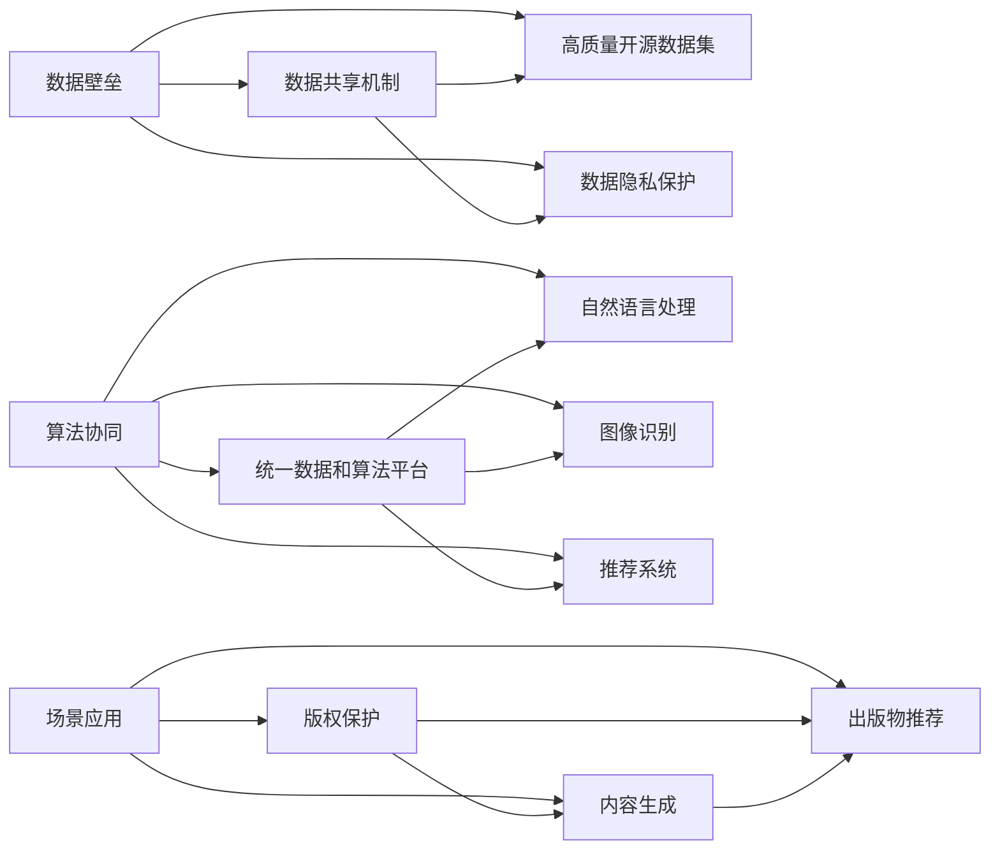
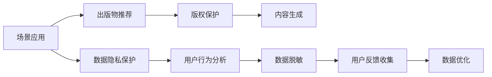

                 

# AI出版业壁垒：数据，算法与场景协同

> 关键词：AI出版业,数据壁垒,算法协同,场景应用,出版物推荐,版权保护,内容生成,数据隐私

## 1. 背景介绍

在数字化浪潮的席卷下，AI出版业正在经历一场深刻的变革。大数据、深度学习、自然语言处理等技术的应用，为出版业带来了前所未有的机遇和挑战。本文将探讨AI出版业中数据、算法与场景协同的壁垒，提出解决策略，为出版业数字化转型提供有价值的参考。

### 1.1 问题由来

当前AI出版业面临的主要挑战在于数据壁垒、算法协同和场景应用三个方面。

1. **数据壁垒**：高质量、高覆盖度的数据是训练高性能AI模型的基础，但出版业的数字化数据积累不足，尤其是开源数据集和公共语料库缺乏，限制了模型的训练和验证。
2. **算法协同**：AI出版业涉及多种算法，如自然语言处理、图像识别、内容推荐等，这些算法需要协同工作，才能达到最优效果。但各算法独立开发和部署，难以高效协同。
3. **场景应用**：AI出版业的应用场景复杂多样，如版权保护、内容生成、出版物推荐等，每个场景需要针对性的算法和数据支持，但现有技术往往难以满足实际需求。

### 1.2 问题核心关键点

数据、算法和场景的协同壁垒是AI出版业发展的主要障碍。要克服这些壁垒，需要构建一个统一、灵活、高效的技术架构，使数据、算法和场景能够协同工作，发挥各自优势。

1. **数据壁垒**：解决数据匮乏和质量问题，需要构建数据共享机制，引入高质量开源数据集。
2. **算法协同**：构建统一的数据和算法平台，实现算法的可视化、自动化和协同工作。
3. **场景应用**：开发适合实际场景的AI应用，提升用户体验和业务价值。

### 1.3 问题研究意义

解决AI出版业的数据、算法和场景协同壁垒，对于提升出版业的智能化水平、降低运营成本、提高用户满意度具有重要意义。具体来说：

1. 提升出版业的智能化水平：通过数据和算法的高效协同，AI出版业能够更好地理解和处理海量出版物，提升内容生成、版权保护等领域的智能化水平。
2. 降低运营成本：AI技术可以自动化许多出版物的处理流程，如排版、编辑、校对等，大幅降低人力和时间成本。
3. 提高用户满意度：AI出版业可以根据用户行为数据，提供个性化的推荐和互动，提升用户阅读体验。
4. 推动产业升级：AI技术的应用可以拓展出版业的应用场景，促进出版业与其他行业的融合，推动产业升级。

## 2. 核心概念与联系

### 2.1 核心概念概述

为更好地理解数据、算法与场景协同在AI出版业中的应用，本节将介绍几个核心概念：

- **AI出版业**：利用人工智能技术，对出版物进行自动化、智能化处理的行业。
- **数据壁垒**：指出版业在数据获取、处理和共享方面存在的技术和管理障碍。
- **算法协同**：指AI出版业中各种算法（如自然语言处理、图像识别、推荐系统等）之间的协作与整合。
- **场景应用**：指AI技术在出版业的实际应用场景，如版权保护、内容生成、出版物推荐等。
- **出版物推荐**：基于用户行为和兴趣，推荐最适合用户的出版物。
- **版权保护**：通过技术手段保护出版物的版权，防止侵权盗版。
- **内容生成**：利用AI技术自动生成出版物内容，提升创作效率。
- **数据隐私**：指在数据处理和共享过程中，保护用户隐私和数据安全的技术和措施。

这些概念之间的联系可以通过以下Mermaid流程图来展示：



这个流程图展示了大语言模型微调过程中各个概念之间的关系：

1. 数据壁垒通过构建数据共享机制和引入高质量开源数据集，缓解数据匮乏问题。
2. 算法协同通过统一数据和算法平台，实现多种算法的协作和整合。
3. 场景应用通过版权保护、内容生成和出版物推荐等具体场景，发挥AI技术的应用价值。

### 2.2 概念间的关系

这些核心概念之间存在着紧密的联系，形成了AI出版业的数据、算法和场景协同生态系统。下面我们通过几个Mermaid流程图来展示这些概念之间的关系。

#### 2.2.1 AI出版业的整体架构


这个流程图展示了AI出版业的整体架构，包括数据采集、处理、存储、共享、算法库、模型训练、部署和应用等多个环节。

#### 2.2.2 数据壁垒与算法协同的关系


这个流程图展示了数据壁垒与算法协同的关系，通过引入高质量开源数据集和统一数据和算法平台，实现算法协同，提升出版物推荐、版权保护和内容生成的智能化水平。

#### 2.2.3 场景应用与数据隐私的关系



这个流程图展示了场景应用与数据隐私的关系，通过数据隐私保护、用户行为分析和数据脱敏等措施，确保用户数据的安全性和隐私性，提升场景应用的效果和可靠性。

### 2.3 核心概念的整体架构

最后，我们用一个综合的流程图来展示这些核心概念在AI出版业中的应用：


这个综合流程图展示了从出版物到数据采集、处理、存储、共享、算法库、模型训练、部署和应用的全过程，突出了数据、算法和场景协同的必要性和复杂性。

## 3. 核心算法原理 & 具体操作步骤
### 3.1 算法原理概述

数据、算法与场景协同在AI出版业中的应用，主要基于以下几个核心算法：

- **自然语言处理(NLP)**：通过分词、词性标注、句法分析等技术，处理出版物的文本数据。
- **图像识别**：利用深度学习模型，自动识别出版物中的图像内容，如封面、插图等。
- **推荐系统**：通过用户行为分析和文本情感分析，推荐最适合用户的出版物。
- **版权保护**：通过内容指纹、数字水印等技术，保护出版物的版权。
- **内容生成**：利用生成对抗网络(GAN)等模型，自动生成出版物内容。

这些算法的协同工作，需要遵循以下几个原则：

1. **数据共享**：建立统一的数据共享机制，确保数据的一致性和完整性。
2. **算法协同**：开发统一的算法平台，实现算法的可视化、自动化和协同工作。
3. **场景应用**：根据实际场景需求，设计针对性的AI应用，提升用户体验和业务价值。

### 3.2 算法步骤详解

#### 3.2.1 数据共享机制

构建数据共享机制，是解决数据壁垒的关键。具体步骤如下：

1. **数据标准化**：制定统一的数据标准，包括数据格式、字段定义、数据质量等，确保数据的一致性和可理解性。
2. **数据集成**：将分散的数据源进行集成，形成一个统一的数据存储平台。可以使用数据湖、数据仓库等技术。
3. **数据共享协议**：制定数据共享协议，明确数据使用权、数据安全责任等，保障数据共享的合法性和安全性。

#### 3.2.2 算法协同平台

开发统一的算法协同平台，是实现算法协同的基础。具体步骤如下：

1. **算法库集成**：将常用的算法库集成到一个统一的平台中，如TensorFlow、PyTorch等。
2. **算法可视化**：开发可视化工具，帮助开发者理解和管理算法，提升开发效率。
3. **算法自动化**：实现算法的自动化调参和部署，降低人工干预，提升模型精度。

#### 3.2.3 场景应用设计

设计适合实际场景的AI应用，是提升用户体验和业务价值的关键。具体步骤如下：

1. **需求分析**：根据出版业的实际需求，确定需要解决的业务问题。
2. **技术方案设计**：选择合适的算法和技术，设计具体的解决方案。
3. **用户体验优化**：注重用户体验，提升应用的用户友好性和易用性。

### 3.3 算法优缺点

数据、算法与场景协同在AI出版业中的应用，具有以下优点和缺点：

**优点**：

1. **提升智能化水平**：通过数据和算法的协同工作，AI出版业能够更好地理解和处理海量出版物，提升内容生成、版权保护等领域的智能化水平。
2. **降低运营成本**：AI技术可以自动化许多出版物的处理流程，如排版、编辑、校对等，大幅降低人力和时间成本。
3. **提高用户满意度**：AI出版业可以根据用户行为数据，提供个性化的推荐和互动，提升用户阅读体验。

**缺点**：

1. **数据隐私问题**：在数据共享和应用过程中，如何保护用户隐私和数据安全是一个重要问题。
2. **技术复杂性**：数据、算法和场景协同涉及多个技术环节，开发和维护复杂度较高。
3. **模型泛化能力**：如果数据和算法质量不高，模型泛化能力有限，可能无法满足实际需求。

### 3.4 算法应用领域

数据、算法与场景协同在AI出版业中的应用，涵盖了以下几个主要领域：

1. **版权保护**：利用内容指纹、数字水印等技术，保护出版物的版权。
2. **内容生成**：利用生成对抗网络(GAN)等模型，自动生成出版物内容。
3. **出版物推荐**：基于用户行为和兴趣，推荐最适合用户的出版物。
4. **出版物审核**：利用自然语言处理技术，自动审核出版物内容，提升出版质量。
5. **出版物管理**：利用图像识别技术，自动识别出版物中的图像内容，提升出版物管理效率。

## 4. 数学模型和公式 & 详细讲解 & 举例说明

### 4.1 数学模型构建

为更好地理解数据、算法与场景协同在AI出版业中的应用，本节将使用数学语言对核心算法进行更加严格的刻画。

假设出版物文本为 $T=\{t_1,t_2,...,t_n\}$，其中 $t_i$ 为第 $i$ 个文本段落。设用户 $u$ 的阅读历史为 $H=\{h_1,h_2,...,h_m\}$，其中 $h_i$ 为用户 $u$ 阅读的第 $i$ 个出版物。

定义出版物推荐模型为 $R(u,T)=\{r_1,r_2,...,r_n\}$，其中 $r_i$ 为用户 $u$ 对文本 $t_i$ 的推荐得分。

定义版权保护模型为 $C(u,T)=\{c_1,c_2,...,c_n\}$，其中 $c_i$ 为文本 $t_i$ 的版权状态（如“已发布”、“未发布”、“侵权”等）。

定义内容生成模型为 $G(u)=\{g_1,g_2,...,g_m\}$，其中 $g_i$ 为用户 $u$ 生成的第 $i$ 个出版物。

定义出版物审核模型为 $A(u,T)=\{a_1,a_2,...,a_n\}$，其中 $a_i$ 为文本 $t_i$ 的审核结果（如“通过”、“不通过”）。

定义出版物管理模型为 $M(u,T)=\{m_1,m_2,...,m_n\}$，其中 $m_i$ 为文本 $t_i$ 的管理状态（如“已入库”、“上架”、“下架”等）。

### 4.2 公式推导过程

#### 4.2.1 出版物推荐模型

出版物推荐模型的训练目标为最大化用户满意度和预测准确率，具体公式如下：

$$
R(u,T)=\mathop{\arg\max}_{r} \sum_{i=1}^n r_i \cdot p_i
$$

其中 $p_i$ 为用户 $u$ 对文本 $t_i$ 的兴趣程度，可以通过用户行为数据（如阅读时间、点击次数等）计算得到。

推荐模型的预测公式为：

$$
\hat{r}_i = \mathbf{w}^T \mathbf{x}_i + b
$$

其中 $\mathbf{x}_i$ 为文本 $t_i$ 的特征向量，$\mathbf{w}$ 为模型参数，$b$ 为偏置项。

#### 4.2.2 版权保护模型

版权保护模型的训练目标为最大化版权状态的正确预测，具体公式如下：

$$
C(u,T)=\mathop{\arg\max}_{c} \sum_{i=1}^n c_i \cdot f_i
$$

其中 $f_i$ 为文本 $t_i$ 的版权状态正确性，可以通过版权保护技术（如数字水印、内容指纹等）计算得到。

版权保护模型的预测公式为：

$$
\hat{c}_i = \sigma(\mathbf{w}^T \mathbf{x}_i + b)
$$

其中 $\sigma$ 为激活函数，通常使用 sigmoid 函数。

#### 4.2.3 内容生成模型

内容生成模型的训练目标为最大化生成的出版物与用户历史出版物的相似度，具体公式如下：

$$
G(u)=\mathop{\arg\max}_{g} \sum_{i=1}^m \mathbf{g}_i^T \mathbf{h}_i
$$

其中 $\mathbf{g}_i$ 为用户 $u$ 生成的第 $i$ 个出版物的内容，$\mathbf{h}_i$ 为用户 $u$ 的历史出版物内容。

内容生成模型的预测公式为：

$$
\hat{\mathbf{g}}_i = \mathbf{w}^T \mathbf{x}_i + b
$$

其中 $\mathbf{x}_i$ 为用户 $u$ 生成的第 $i$ 个出版物的特征向量，$\mathbf{w}$ 为模型参数，$b$ 为偏置项。

#### 4.2.4 出版物审核模型

出版物审核模型的训练目标为最大化审核结果的正确性，具体公式如下：

$$
A(u,T)=\mathop{\arg\max}_{a} \sum_{i=1}^n a_i \cdot g_i
$$

其中 $g_i$ 为文本 $t_i$ 的审核结果正确性，可以通过自然语言处理技术（如情感分析、语法检查等）计算得到。

出版物审核模型的预测公式为：

$$
\hat{a}_i = \sigma(\mathbf{w}^T \mathbf{x}_i + b)
$$

其中 $\sigma$ 为激活函数，通常使用 sigmoid 函数。

#### 4.2.5 出版物管理模型

出版物管理模型的训练目标为最大化出版物管理的准确性，具体公式如下：

$$
M(u,T)=\mathop{\arg\max}_{m} \sum_{i=1}^n m_i \cdot s_i
$$

其中 $s_i$ 为文本 $t_i$ 的管理状态正确性，可以通过出版物管理规则计算得到。

出版物管理模型的预测公式为：

$$
\hat{m}_i = \sigma(\mathbf{w}^T \mathbf{x}_i + b)
$$

其中 $\sigma$ 为激活函数，通常使用 sigmoid 函数。

### 4.3 案例分析与讲解

以出版物推荐模型为例，具体说明其数学模型的应用。

假设我们有一套出版物数据集 $D=\{(d_1,t_1),(d_2,t_2),...,(d_n,t_n)\}$，其中 $d_i$ 为出版物编号，$t_i$ 为出版物文本。

定义用户兴趣向量 $\mathbf{p}_u$ 为：

$$
\mathbf{p}_u = \frac{\sum_{i=1}^n r_i \cdot \mathbf{x}_i}{\sum_{i=1}^n r_i}
$$

其中 $r_i$ 为用户 $u$ 对文本 $t_i$ 的推荐得分，$\mathbf{x}_i$ 为文本 $t_i$ 的特征向量。

定义出版物推荐矩阵 $\mathbf{R}=\{r_1,r_2,...,r_n\}$，其中 $r_i$ 为用户 $u$ 对文本 $t_i$ 的推荐得分。

定义出版物特征矩阵 $\mathbf{X}=\{\mathbf{x}_1,\mathbf{x}_2,...,\mathbf{x}_n\}$，其中 $\mathbf{x}_i$ 为文本 $t_i$ 的特征向量。

假设 $\mathbf{w}=\{w_1,w_2,...,w_d\}$ 为出版物推荐模型的权重向量，$b$ 为偏置项。

则出版物推荐模型的预测公式为：

$$
\hat{\mathbf{r}} = \mathbf{w}^T \mathbf{X} + b
$$

其中 $\hat{\mathbf{r}}$ 为推荐得分向量。

假设 $\mathbf{p}=\{\mathbf{p}_1,\mathbf{p}_2,...,\mathbf{p}_m\}$ 为用户 $u$ 的兴趣向量。

则用户 $u$ 对文本 $t_i$ 的推荐得分计算公式为：

$$
\hat{r}_i = \mathbf{w}^T \mathbf{p}_i
$$

其中 $\mathbf{p}_i$ 为用户 $u$ 对文本 $t_i$ 的兴趣向量。

### 4.4 运行结果展示

以出版物推荐模型为例，展示其在实际应用中的运行结果。

假设我们有一个用户 $u$ 的阅读历史 $H=\{h_1,h_2,...,h_m\}$，其中 $h_i$ 为用户 $u$ 阅读的第 $i$ 个出版物。

假设我们有一套出版物数据集 $D=\{(d_1,t_1),(d_2,t_2),...,(d_n,t_n)\}$，其中 $d_i$ 为出版物编号，$t_i$ 为出版物文本。

假设我们有一套出版物特征矩阵 $\mathbf{X}=\{\mathbf{x}_1,\mathbf{x}_2,...,\mathbf{x}_n\}$，其中 $\mathbf{x}_i$ 为文本 $t_i$ 的特征向量。

假设我们有一套用户兴趣向量 $\mathbf{p}_u$，计算公式为：

$$
\mathbf{p}_u = \frac{\sum_{i=1}^n r_i \cdot \mathbf{x}_i}{\sum_{i=1}^n r_i}
$$

其中 $r_i$ 为用户 $u$ 对文本 $t_i$ 的推荐得分，$\mathbf{x}_i$ 为文本 $t_i$ 的特征向量。

假设我们有一套出版物推荐矩阵 $\mathbf{R}=\{r_1,r_2,...,r_n\}$，其中 $r_i$ 为用户 $u$ 对文本 $t_i$ 的推荐得分。

假设我们有一套出版物推荐模型的权重向量 $\mathbf{w}=\{w_1,w_2,...,w_d\}$ 和偏置项 $b$。

则出版物推荐模型的预测公式为：

$$
\hat{\mathbf{r}} = \mathbf{w}^T \mathbf{X} + b
$$

其中 $\hat{\mathbf{r}}$ 为推荐得分向量。

假设我们有一套用户兴趣向量 $\mathbf{p}=\{\mathbf{p}_1,\mathbf{p}_2,...,\mathbf{p}_m\}$，其中 $\mathbf{p}_i$ 为用户 $u$ 对文本 $t_i$ 的兴趣向量。

则用户 $u$ 对文本 $t_i$ 的推荐得分计算公式为：

$$
\hat{r}_i = \mathbf{w}^T \mathbf{p}_i
$$

其中 $\mathbf{p}_i$ 为用户 $u$ 对文本 $t_i$ 的兴趣向量。

通过以上步骤，我们可以得到用户 $u$ 对文本 $t_i$ 的推荐得分，从而实现出版物推荐的应用。

## 5. 项目实践：代码实例和详细解释说明

### 5.1 开发环境搭建

在进行出版业AI应用开发前，我们需要准备好开发环境。以下是使用Python进行PyTorch开发的环境配置流程：

1. 安装Anaconda：从官网下载并安装Anaconda，用于创建独立的Python环境。

2. 创建并激活虚拟环境：
```bash
conda create -n pytorch-env python=3.8 
conda activate pytorch-env
```

3. 安装PyTorch：根据CUDA版本，从官网获取对应的安装命令。例如：
```bash
conda install pytorch torchvision torchaudio cudatoolkit=11.1 -c pytorch -c conda-forge
```

4. 安装TensorFlow：由Google主导开发的开源深度学习框架，生产部署方便，适合大规模工程应用。同样有丰富的预训练语言模型资源。

5. 安装Transformers库：HuggingFace开发的NLP工具库，集成了众多SOTA语言模型，支持PyTorch和TensorFlow，是进行出版业AI开发的重要工具。

6. 安装各类工具包：
```bash
pip install numpy pandas scikit-learn matplotlib tqdm jupyter notebook ipython
```

完成上述步骤后，即可在`pytorch-env`环境中开始出版业AI应用的开发。

### 5.2 源代码详细实现

下面以出版物推荐模型为例，给出使用Transformers库对BERT模型进行出版物推荐开发的PyTorch代码实现。

首先，定义出版物推荐任务的输入数据格式：

```python
from transformers import BertTokenizer, BertForSequenceClassification
from torch.utils.data import Dataset, DataLoader
from torch import nn

class PubRecommendDataset(Dataset):
    def __init__(self, texts, tags):
        self.texts = texts
        self.tags = tags
        
    def __len__(self):
        return len(self.texts)
    
    def __getitem__(self, item):
        text = self.texts[item]
        label = self.tags[item]
        return {'input_ids': input_ids, 'attention_mask': attention_mask, 'labels': label}
```

然后，定义模型和优化器：

```python
model = BertForSequenceClassification.from_pretrained('bert-base-cased', num_labels=2)
optimizer = AdamW(model.parameters(), lr=2e-5)
```

接着，定义训练和评估函数：

```python
device = torch.device('cuda' if torch.cuda.is_available() else 'cpu')
model.to(device)

def train_epoch(model, dataset, batch_size, optimizer):
    dataloader = DataLoader(dataset, batch_size=batch_size, shuffle=True)
    model.train()
    epoch_loss = 0
    for batch in dataloader:
        input_ids = batch['input_ids'].to(device)
        attention_mask = batch['attention_mask'].to(device)
        labels = batch['labels'].to(device)
        model.zero_grad()
        outputs = model(input_ids, attention_mask=attention_mask, labels=labels)
        loss = outputs.loss
        epoch_loss += loss.item()
        loss.backward()
        optimizer.step()
    return epoch_loss / len(dataloader)

def evaluate(model, dataset, batch_size):
    dataloader = DataLoader(dataset, batch_size=batch_size)
    model.eval()
    preds, labels = [], []
    with torch.no_grad():
        for batch in dataloader:
            input_ids = batch['input_ids'].to(device)
            attention_mask = batch['attention_mask'].to(device)
            batch_labels = batch['labels']
            outputs

