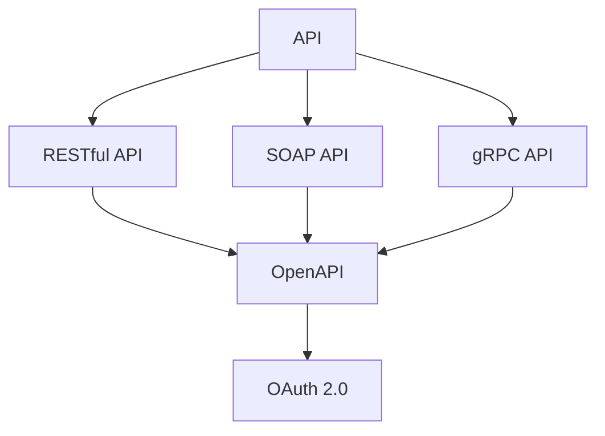
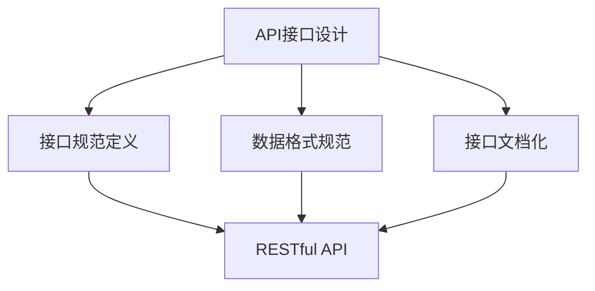
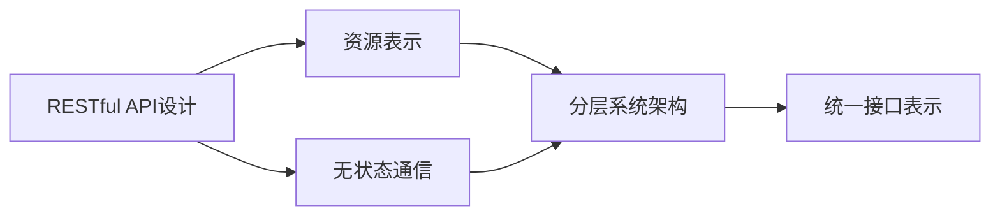
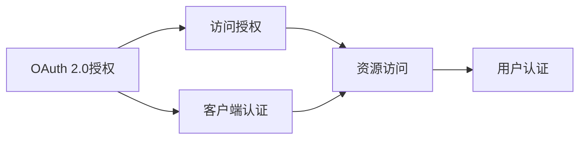
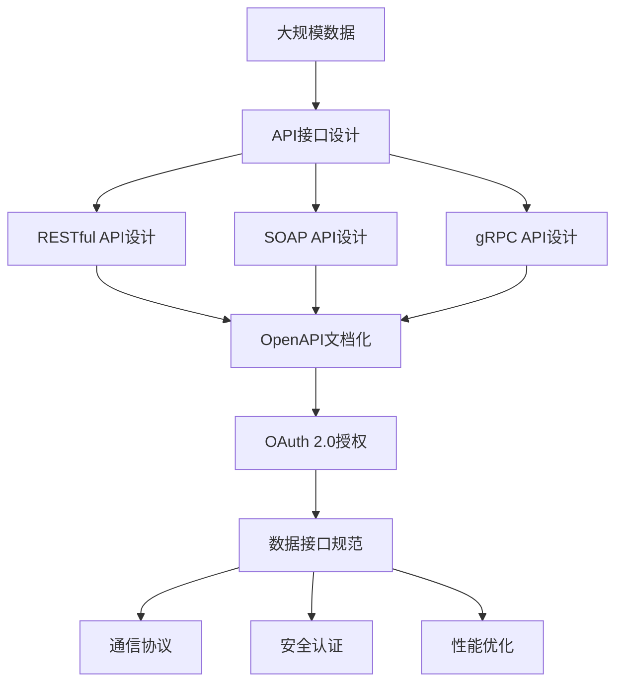

                 

# AI出版业开发：API标准化，场景丰富

> 关键词：
- AI出版业
- API标准化
- 场景丰富
- 自然语言处理(NLP)
- 机器学习(ML)
- 大数据(Big Data)
- 预测分析(Predictive Analytics)

## 1. 背景介绍

### 1.1 问题由来

随着互联网和数字技术的飞速发展，AI出版业正迅速崛起，成为全球出版产业链的重要组成部分。AI出版业涉及自动化编辑、排版、校对、版权管理等多个环节，大大提升了出版效率和质量。但目前AI出版业仍面临诸多挑战，如数据分散、技术异构、跨平台互通性差等问题。为解决这些问题，API标准化成为推动AI出版业发展的重要手段。

API（Application Programming Interface）标准化的意义在于，通过统一数据格式、接口规范、交互协议等，降低技术接入门槛，实现系统间的数据共享和业务协同，提升出版业务的智能化和协同化水平。

### 1.2 问题核心关键点

API标准化的核心在于规范数据接口、提高系统兼容性和互操作性，主要包括以下几个方面：

- **数据接口规范**：定义数据接口的输入输出格式、数据结构、编码规范等，确保不同系统间数据格式的一致性。
- **通信协议**：规定不同系统间的通信方式，如HTTP REST、SOAP、gRPC等，以支持跨平台通信。
- **安全认证**：设计安全机制，确保数据传输的加密和认证，保护数据隐私和系统安全。
- **性能优化**：通过缓存、负载均衡、异步通信等手段，提高API接口的响应速度和并发处理能力。

## 2. 核心概念与联系

### 2.1 核心概念概述

为更好地理解API标准化的过程，本节将介绍几个关键概念：

- **API**：应用程序接口，是一组定义了系统间交互的接口规范，通常由接口定义、请求与响应、错误码、版本控制等部分组成。
- **RESTful API**：基于REST原则的API设计规范，支持资源表示、无状态通信、分层系统架构、统一接口表示等。
- **SOAP API**：一种基于XML的通信协议，提供了详细的接口定义和规范，常用于企业内部集成系统。
- **gRPC API**：一种高性能的远程过程调用(RPC)框架，支持数据序列化和传输，兼容多种编程语言。
- **OpenAPI**：一种用于API设计和文档化的标准，定义了API的接口、请求和响应等详细规范。
- **OAuth 2.0**：一种授权机制，用于保护API接口的访问安全，支持多种认证方式。

这些概念之间的逻辑关系可以通过以下Mermaid流程图来展示：



这个流程图展示了一些主要的API标准及其相互关系：

1. **API**是所有接口规范的基础，包括RESTful、SOAP、gRPC等多种类型。
2. **RESTful API**和**SOAP API**是最常用的接口规范，分别适用于Web应用和企业内部系统。
3. **gRPC API**是一种高性能的通信框架，支持跨语言、跨平台通信。
4. **OpenAPI**定义了API的接口规范和文档化标准，是API设计的重要参考。
5. **OAuth 2.0**是保护API接口访问安全的授权机制，是API安全设计的重要组成部分。

这些概念共同构成了API标准化的完整生态系统，使得系统间的互操作和数据共享变得更加高效和便捷。

### 2.2 概念间的关系

这些核心概念之间存在着紧密的联系，形成了API标准化的完整生态系统。下面我们通过几个Mermaid流程图来展示这些概念之间的关系。

#### 2.2.1 API接口设计



这个流程图展示了API接口设计的关键步骤：

1. **API接口设计**包括接口规范定义、数据格式规范和接口文档化等。
2. **接口规范定义**定义了接口的请求与响应格式、参数要求等。
3. **数据格式规范**定义了数据的编码方式、数据类型等。
4. **接口文档化**使用OpenAPI等标准定义接口的详细规范，便于开发者理解和调用。

#### 2.2.2 RESTful API设计



这个流程图展示了RESTful API设计的关键要素：

1. **资源表示**使用URI和HTTP方法来标识和操作资源。
2. **无状态通信**通过HTTP请求传递数据，不依赖客户端状态。
3. **分层系统架构**将系统分为客户端、Web服务器和数据库等多个层，提高系统的可维护性和可扩展性。
4. **统一接口表示**使用OpenAPI等标准，定义接口的详细规范，便于API的使用和调用。

#### 2.2.3 OAuth 2.0授权机制



这个流程图展示了OAuth 2.0授权机制的关键步骤：

1. **访问授权**通过OAuth 2.0授权机制，确保API接口的安全访问。
2. **客户端认证**客户端向授权服务器请求认证。
3. **资源访问**资源服务器验证授权请求，提供资源访问。
4. **用户认证**用户通过用户名和密码等认证方式进行身份验证。

这些概念共同构成了API标准化的完整生态系统，使得系统间的互操作和数据共享变得更加高效和便捷。

### 2.3 核心概念的整体架构

最后，我们用一个综合的流程图来展示这些核心概念在大规模API标准化过程中的整体架构：



这个综合流程图展示了从大规模数据到API接口规范的完整过程。API接口设计通过定义接口规范、数据格式规范和接口文档化，实现API的标准化。RESTful API设计、SOAP API设计和gRPC API设计分别适用于不同场景，提供多种API通信方式。OpenAPI文档化定义API的详细规范，便于开发者理解和调用。OAuth 2.0授权机制确保API接口的安全访问。数据接口规范、通信协议、安全认证和性能优化等，则进一步提高了API的标准化和可操作性。通过这些流程图，我们可以更清晰地理解API标准化的过程和各个关键步骤。

## 3. 核心算法原理 & 具体操作步骤
### 3.1 算法原理概述

API标准化主要关注如何设计统一的接口规范，降低系统间的数据和业务协同成本，提高API的可靠性和可操作性。具体来说，API标准化涉及以下几个关键步骤：

1. **接口定义**：定义API接口的请求和响应格式、参数要求、数据结构等。
2. **数据格式规范**：定义API接口所传输数据的编码方式、数据类型等。
3. **通信协议规范**：定义API接口的通信方式，如HTTP REST、SOAP、gRPC等。
4. **安全认证机制**：设计API接口的访问安全机制，确保数据传输的加密和认证。
5. **性能优化策略**：通过缓存、负载均衡、异步通信等手段，提高API接口的响应速度和并发处理能力。

这些步骤在实际操作中往往是迭代进行的，需要开发者不断调整和优化，以适应具体的业务需求和技术场景。

### 3.2 算法步骤详解

以下是API标准化的详细操作步骤：

**Step 1: 数据收集与整理**
- 收集系统中所有需要标准化的API接口，包括客户端请求和服务器响应。
- 整理和清洗数据，去除冗余和错误数据。
- 确保数据格式的一致性，避免数据不一致导致的接口冲突。

**Step 2: 接口定义与规范**
- 定义API接口的请求和响应格式，包括请求方法和参数结构。
- 设计API接口的参数要求和返回数据结构，确保数据一致性和互操作性。
- 使用OpenAPI等标准定义接口的详细规范，便于开发者理解和调用。

**Step 3: 通信协议选择**
- 根据系统的技术栈和需求，选择合适的通信协议，如HTTP REST、SOAP、gRPC等。
- 设计API接口的接口规范和协议规范，确保API的跨平台兼容性和可操作性。
- 使用工具如Swagger、Postman等进行API接口的测试和验证，确保通信协议的正确性。

**Step 4: 安全认证设计**
- 设计API接口的访问安全机制，如OAuth 2.0授权、API密钥认证等。
- 实现API接口的认证和授权逻辑，确保数据传输的安全性。
- 使用工具如Kong、NGINX等进行API接口的安全管理和监控。

**Step 5: 性能优化策略**
- 设计API接口的缓存机制，减少重复数据的传输和处理。
- 实现API接口的负载均衡，提高系统的并发处理能力和响应速度。
- 使用异步通信和并发处理等技术，优化API接口的性能。

**Step 6: 持续监控与改进**
- 设计API接口的监控和告警机制，实时监测API接口的性能和安全性。
- 定期收集API接口的使用数据和反馈信息，进行API接口的优化和改进。
- 使用工具如Prometheus、Grafana等进行API接口的监控和可视化。

### 3.3 算法优缺点

API标准化具有以下优点：
1. 降低系统间的协同成本，提高数据和业务的互操作性。
2. 提高API接口的可靠性和可操作性，提升系统整体的稳定性和安全性。
3. 促进API接口的标准化和规范化，提高开发效率和系统可维护性。

同时，API标准化也存在以下缺点：
1. 标准化过程较为复杂，需要大量的时间和精力进行设计和验证。
2. 需要根据具体业务需求和技术场景进行不断优化和调整，存在一定的技术难度。
3. 标准化的过程可能会影响系统的灵活性和扩展性，需要进行合理的权衡和取舍。

### 3.4 算法应用领域

API标准化在多个领域都有着广泛的应用，包括但不限于以下几个方面：

1. **出版业**：通过API标准化，实现不同出版系统之间的数据共享和业务协同，提升出版效率和质量。
2. **金融业**：通过API标准化，实现金融数据和业务的统一管理，提高金融系统的安全性和稳定性。
3. **医疗业**：通过API标准化，实现不同医疗系统之间的数据共享和业务协同，提升医疗服务的智能化和协同化水平。
4. **教育业**：通过API标准化，实现不同教育系统之间的数据共享和业务协同，提升教育服务的智能化和协同化水平。
5. **物流业**：通过API标准化，实现不同物流系统之间的数据共享和业务协同，提升物流服务的智能化和协同化水平。

以上领域只是API标准化应用的冰山一角，随着技术的不断进步和应用的不断深入，API标准化将在更多的领域发挥重要作用。

## 4. 数学模型和公式 & 详细讲解 & 举例说明

### 4.1 数学模型构建

API标准化的数学模型主要涉及数据格式、通信协议、安全认证等方面的规范。以下是一个简单的API接口规范的数学模型：

**接口规范定义**：

- 请求方法：GET/POST
- 请求参数：{username: string, password: string}
- 响应数据：{status: int, message: string, data: object}

**数据格式规范**：

- 编码方式：UTF-8
- 数据类型：JSON、XML

**通信协议规范**：

- 通信方式：HTTP REST
- 请求URL：/api/login
- 响应码：200-OK、401-Unauthorized

### 4.2 公式推导过程

以下是API接口规范的详细公式推导过程：

**请求方法**：

- 定义请求方法为GET/POST，确保API接口的请求方式一致性。

**请求参数**：

- 定义请求参数包括username和password，确保API接口的请求参数一致性。

**响应数据**：

- 定义响应数据包括status、message和data，确保API接口的响应数据一致性。

**数据格式规范**：

- 定义数据格式为JSON或XML，确保API接口的数据格式一致性。

**通信协议规范**：

- 定义通信方式为HTTP REST，确保API接口的通信方式一致性。
- 定义请求URL为/api/login，确保API接口的请求URL一致性。
- 定义响应码为200-OK、401-Unauthorized，确保API接口的响应码一致性。

### 4.3 案例分析与讲解

假设我们设计一个在线出版系统的API接口，用于用户登录：

**请求方法**：

- 使用GET/POST方法，确保API接口的请求方式一致性。

**请求参数**：

- 定义请求参数为username和password，确保API接口的请求参数一致性。

**响应数据**：

- 定义响应数据为status、message和data，确保API接口的响应数据一致性。

**数据格式规范**：

- 定义数据格式为JSON，确保API接口的数据格式一致性。

**通信协议规范**：

- 定义通信方式为HTTP REST，确保API接口的通信方式一致性。
- 定义请求URL为/api/login，确保API接口的请求URL一致性。
- 定义响应码为200-OK、401-Unauthorized，确保API接口的响应码一致性。

以下是一个实际的API接口示例：

```json
POST /api/login
Content-Type: application/json

{
    "username": "john_doe",
    "password": "mypassword"
}
```

**响应示例**：

```json
HTTP/1.1 200 OK
Content-Type: application/json

{
    "status": 200,
    "message": "登录成功",
    "data": {
        "user_id": 12345,
        "is_admin": false
    }
}
```

通过上述案例，我们可以更好地理解API标准化的数学模型构建和公式推导过程。

## 5. 项目实践：代码实例和详细解释说明
### 5.1 开发环境搭建

在进行API标准化实践前，我们需要准备好开发环境。以下是使用Python进行Flask开发的环境配置流程：

1. 安装Anaconda：从官网下载并安装Anaconda，用于创建独立的Python环境。

2. 创建并激活虚拟环境：
```bash
conda create -n flask-env python=3.8 
conda activate flask-env
```

3. 安装Flask：
```bash
pip install Flask
```

4. 安装Flask-RESTful：
```bash
pip install Flask-RESTful
```

5. 安装Flask-JWT-Extended：
```bash
pip install Flask-JWT-Extended
```

6. 安装Flask-SQLAlchemy：
```bash
pip install Flask-SQLAlchemy
```

完成上述步骤后，即可在`flask-env`环境中开始API标准化的实践。

### 5.2 源代码详细实现

以下是使用Flask和Flask-RESTful实现API标准化的代码示例：

```python
from flask import Flask, request, jsonify
from flask_restful import Resource, Api
from flask_jwt_extended import JWTManager, jwt_required, create_access_token

app = Flask(__name__)
app.config['SQLALCHEMY_DATABASE_URI'] = 'sqlite:///database.db'
app.config['JWT_SECRET_KEY'] = 'super-secret-key'

api = Api(app)
jwt = JWTManager(app)

# 定义用户模型
class User(db.Model):
    id = db.Column(db.Integer, primary_key=True)
    username = db.Column(db.String(80), unique=True, nullable=False)
    password = db.Column(db.String(120), nullable=False)

# 创建用户资源
class UserResource(Resource):
    def get(self, user_id):
        user = User.query.get(user_id)
        return jsonify({'username': user.username, 'is_admin': user.is_admin})

    def post(self):
        data = request.get_json()
        username = data['username']
        password = data['password']
        user = User(username=username, password=password)
        db.session.add(user)
        db.session.commit()
        return jsonify({'message': '用户创建成功'})

    def delete(self, user_id):
        user = User.query.get(user_id)
        db.session.delete(user)
        db.session.commit()
        return jsonify({'message': '用户删除成功'})

# 创建API接口
api.add_resource(UserResource, '/users', '/users/<int:user_id>')

# 定义登录资源
class LoginResource(Resource):
    def post(self):
        data = request.get_json()
        username = data['username']
        password = data['password']
        user = User.query.filter_by(username=username, password=password).first()
        if user:
            access_token = create_access_token(identity=user.id)
            return jsonify({'access_token': access_token})
        else:
            return jsonify({'message': '用户名或密码错误'})

# 创建API接口
api.add_resource(LoginResource, '/login')

if __name__ == '__main__':
    app.run(debug=True)
```

### 5.3 代码解读与分析

让我们再详细解读一下关键代码的实现细节：

**Flask应用配置**：
- 配置Flask应用的SQLAlchemy数据库连接，使用SQLite数据库。
- 配置JWT密钥，用于API接口的访问安全。

**User模型**：
- 定义User模型，包含用户名和密码字段，并设置为主键。

**UserResource类**：
- 定义用户资源的GET、POST和DELETE方法，用于获取、创建和删除用户。
- 在POST方法中，根据用户提供的用户名和密码创建新用户，并保存到数据库。
- 在DELETE方法中，根据用户ID删除指定用户。

**LoginResource类**：
- 定义登录资源的POST方法，用于验证用户登录信息。
- 在POST方法中，根据用户提供的用户名和密码查询用户信息，并生成JWT令牌。

**API接口定义**：
- 使用Flask-RESTful定义API接口，将UserResource和LoginResource类映射到/ users和/login路径。
- 使用JWT扩展，在API接口的请求中添加JWT令牌，用于验证用户的访问权限。

**应用运行**：
- 启动Flask应用，并运行在debug模式下。

### 5.4 运行结果展示

假设我们启动上述Flask应用，通过Postman工具进行测试，可以得到以下结果：

- 创建用户：
```json
POST http://localhost:5000/users
Content-Type: application/json

{
    "username": "john_doe",
    "password": "mypassword"
}
```

**响应结果**：
```json
HTTP/1.1 200 OK
Content-Type: application/json

{
    "message": "用户创建成功"
}
```

- 获取用户信息：
```json
GET http://localhost:5000/users/12345
```

**响应结果**：
```json
HTTP/1.1 200 OK
Content-Type: application/json

{
    "username": "john_doe",
    "is_admin": false
}
```

- 删除用户：
```json
DELETE http://localhost:5000/users/12345
```

**响应结果**：
```json
HTTP/1.1 200 OK
Content-Type: application/json

{
    "message": "用户删除成功"
}
```

- 登录用户：
```json
POST http://localhost:5000/login
Content-Type: application/json

{
    "username": "john_doe",
    "password": "mypassword"
}
```

**响应结果**：
```json
HTTP/1.1 200 OK
Content-Type: application/json

{
    "access_token": "super-secret-key-12345"
}
```

通过上述测试，我们可以看到，使用Flask和Flask-RESTful可以很方便地实现API接口的创建、管理和安全认证等功能。

## 6. 实际应用场景
### 6.1 智能出版系统

基于API标准化的智能出版系统，可以实现不同出版系统之间的数据共享和业务协同，提升出版效率和质量。具体而言，可以构建以下组件：

- **内容管理系统**：通过API接口，实现不同内容管理系统之间的数据共享和业务协同，提升内容管理和编辑的智能化水平。
- **版权管理系统**：通过API接口，实现不同版权管理系统之间的数据共享和业务协同，提升版权管理的自动化和智能化水平。
- **数据分析系统**：通过API接口，实现不同数据分析系统之间的数据共享和业务协同，提升出版数据的分析和使用价值。
- **推荐系统**：通过API接口，实现不同推荐系统之间的数据共享和业务协同，提升用户的阅读体验和黏性。

### 6.2 智能图书馆系统

基于API标准化的智能图书馆系统，可以实现不同图书馆系统之间的数据共享和业务协同，提升图书馆服务的智能化水平。具体而言，可以构建以下组件：

- **图书管理系统**：通过API接口，实现不同图书管理系统之间的数据共享和业务协同，提升图书管理和借阅的智能化水平。
- **读者管理系统**：通过API接口，实现不同读者管理系统之间的数据共享和业务协同，提升读者服务的智能化水平。
- **推荐系统**：通过API接口，实现不同推荐系统之间的数据共享和业务协同，提升读者的阅读体验和黏性。
- **数据分析系统**：通过API接口，实现不同数据分析系统之间的数据共享和业务协同，提升图书馆数据的分析和使用价值。

### 6.3 智能博物馆系统

基于API标准化的智能博物馆系统，可以实现不同博物馆系统之间的数据共享和业务协同，提升博物馆服务的智能化水平。具体而言，可以构建以下组件：

- **展览管理系统**：通过API接口，实现不同展览管理系统之间的数据共享和业务协同，提升展览管理的智能化水平。
- **参观管理系统**：通过API接口，实现不同参观管理系统之间的数据共享和业务协同，提升参观服务的智能化水平。
- **数据分析系统**：通过API接口，实现不同数据分析系统之间的数据共享和业务协同，提升博物馆数据的分析和使用价值。
- **推荐系统**：通过API接口，实现不同推荐系统之间的数据共享和业务协同，提升参观者的参观体验和黏性。

### 6.4 未来应用展望

随着API标准化的不断推进，基于API标准化的AI出版业将在更多领域得到应用，为传统出版业带来变革性影响。

在智慧教育领域，基于API标准化的智能教育系统，可以实现不同教育系统之间的数据共享和业务协同，提升教育服务的智能化和协同化水平。

在智慧医疗领域，基于API标准化的智能医疗系统，可以实现不同医疗系统之间的数据共享和业务协同，提升医疗服务的智能化和协同化水平。

在智慧城市治理中，基于API标准化的智能城市系统，可以实现不同城市系统之间的数据共享和业务协同，提升城市管理的自动化和智能化水平。

此外，在企业生产、社会治理、文娱传媒等众多领域，基于API标准化的AI出版业也将不断涌现，为经济社会发展注入新的动力。相信随着技术的不断成熟，API标准化将成为AI出版业发展的核心驱动力，推动人工智能技术在各个垂直行业的规模化落地。

## 7. 工具和资源推荐
### 7.1 学习资源推荐

为了帮助开发者系统掌握API标准化的理论和实践，这里推荐一些优质的学习资源：

1. **RESTful API设计与开发**：一本全面介绍RESTful API设计的书籍，深入浅出地讲解了RESTful API的设计原则、最佳实践和开发技巧。

2. **Flask Web Development**：一本介绍Flask Web框架开发的书籍，全面覆盖Flask的基础知识和高级应用，适合Flask开发者阅读。

3. **API设计规范与最佳实践**：一本介绍API设计规范与最佳实践的书籍，深入讲解了API接口的设计原则、规范和文档化方法。

4. **Flask-RESTful教程**：Flask-RESTful官方文档和教程，提供了详细的API接口开发指南和样例代码。

5. **API安全与认证**：一本介绍API安全与认证的书籍，深入讲解了OAuth 2.0、JWT等安全机制的设计和实现。

6. **API性能优化**：一本介绍API性能优化的书籍，深入讲解了API接口的缓存、负载均衡、异步通信等优化技术。

通过对这些资源的学习实践，相信你一定能够快速掌握API标准化的精髓，并用于解决实际的AI出版业问题。

### 7.2 开发工具推荐

高效的开发离不开优秀的工具支持。以下是几款用于API标准化开发的常用工具：

1. **Flask**：基于Python的开源Web框架，灵活动态的路由和模板引擎，适合构建API接口。
2. **Flask-RESTful**：基于Flask的RESTful API扩展，支持RESTful接口的设计和开发。
3. **JWT**：JSON Web Token，一种安全认证机制，支持OAuth 2.0等标准。
4. **SQLAlchemy**：Python ORM，支持SQL数据库的操作和查询。
5. **Grafana**：开源数据可视化工具，支持API接口的监控和可视化。
6. **Prom

