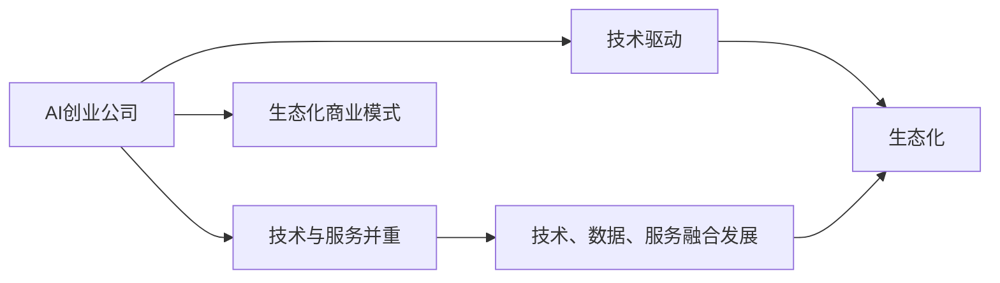
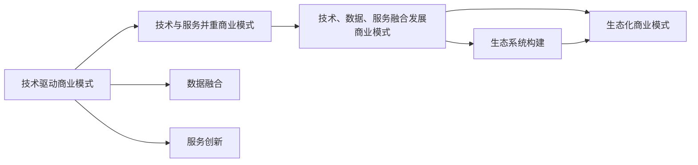

                 

# AI创业公司的商业模式变迁

## 1. 背景介绍

随着人工智能(AI)技术的日益成熟，AI创业公司如雨后春笋般涌现。从早期的图像识别、语音识别，到近年来的自然语言处理(NLP)、机器学习、知识图谱等领域，AI技术已经深入到各个行业，产生了巨大的社会和经济价值。AI创业公司的商业模式也在不断演变，从初期的技术驱动，逐步过渡到技术与服务并重，再到技术、数据、服务融合发展的综合生态模式。本文将系统梳理AI创业公司的商业模式变迁，探索其背后的驱动力和未来发展趋势。

## 2. 核心概念与联系

### 2.1 核心概念概述

- **AI创业公司**：指以人工智能技术为核心竞争力，通过研发和应用AI算法，提供各类智能化服务的企业。
- **技术驱动商业模式**：以技术创新为驱动，通过技术优势获得市场竞争力的商业模式。
- **技术与服务并重商业模式**：在技术创新的基础上，提供完善的智能化应用服务，形成技术与服务相互促进的商业模式。
- **技术、数据、服务融合发展商业模式**：以AI技术为核心，融合海量数据资源，提供更精准、智能化的应用服务，形成生态化商业模式。
- **生态化商业模式**：构建以AI技术为核心的完整生态系统，包括技术研发、数据平台、应用服务、市场拓展等环节，形成协同发展的商业模式。

这些核心概念之间的关系可以通过以下Mermaid流程图来展示：



这个流程图展示了大公司从技术驱动到生态化商业模式的演变过程，其中技术驱动是基础，而生态化商业模式是其最终目标。

### 2.2 概念间的关系

这些核心概念之间的逻辑关系可以通过以下Mermaid流程图来展示：



这个流程图展示了不同商业模式间的演变关系。技术驱动商业模式通过技术优势积累，逐步向技术与服务并重商业模式发展，同时融合海量数据资源和服务创新，最终形成生态化商业模式。

## 3. 核心算法原理 & 具体操作步骤

### 3.1 算法原理概述

AI创业公司的商业模式变迁，本质上是一个技术应用与市场拓展相结合的过程。以下是其核心算法原理：

1. **技术积累**：通过持续的技术研发，积累先进的AI算法和技术能力，形成技术驱动的基础。
2. **服务创新**：在技术积累的基础上，推出各类智能化应用服务，满足用户需求，提升市场竞争力。
3. **数据融合**：通过海量数据资源的收集和分析，形成数据驱动的决策支持，提升服务质量和用户体验。
4. **生态系统构建**：通过技术、数据、服务的多维度协同，构建完整生态系统，形成持续增长和迭代的良性循环。

### 3.2 算法步骤详解

AI创业公司商业模式变迁的算法步骤主要包括以下几个方面：

1. **技术积累**：
   - 通过持续研发，积累先进的AI算法和技术能力，形成技术驱动的基础。
   - 关注前沿技术，持续优化和迭代现有算法，提升技术竞争力。
   - 进行技术专利申请，形成技术壁垒，保护知识产权。

2. **服务创新**：
   - 根据市场需求，推出各类智能化应用服务，满足用户需求。
   - 通过不断的市场调研和用户反馈，优化和调整服务内容，提升用户满意度。
   - 与行业龙头企业合作，联合推出定制化解决方案，拓展市场份额。

3. **数据融合**：
   - 收集和分析海量数据资源，形成数据驱动的决策支持。
   - 使用先进的数据分析技术，挖掘数据中的潜力和价值，提升服务质量。
   - 与大数据平台合作，共享数据资源，提升数据利用率。

4. **生态系统构建**：
   - 构建以AI技术为核心的完整生态系统，包括技术研发、数据平台、应用服务、市场拓展等环节。
   - 与各类合作伙伴建立合作关系，形成协同发展的生态系统。
   - 不断扩展生态系统的边界，引入更多的资源和能力，提升整体竞争力。

### 3.3 算法优缺点

AI创业公司商业模式变迁的算法优点：

1. **技术领先**：通过持续的技术研发，形成技术优势，提升市场竞争力。
2. **服务创新**：通过推出各类智能化应用服务，满足用户需求，提升用户体验。
3. **数据驱动**：通过海量数据资源的收集和分析，提升服务质量和决策支持。
4. **生态协同**：通过构建完整的生态系统，形成协同发展的良性循环。

AI创业公司商业模式变迁的算法缺点：

1. **技术壁垒**：技术积累需要大量投入，技术壁垒较高。
2. **市场拓展**：服务创新需要不断调整和优化，市场拓展难度大。
3. **数据隐私**：海量数据资源的使用，涉及到用户隐私保护和数据安全问题。
4. **生态复杂**：生态系统的构建和管理，需要跨领域的协作和协调，复杂度较高。

### 3.4 算法应用领域

AI创业公司商业模式变迁的算法应用领域广泛，包括但不限于：

1. **金融行业**：通过AI技术进行风险控制、信用评估、智能投顾等服务。
2. **医疗行业**：通过AI技术进行疾病诊断、病历分析、智能客服等服务。
3. **智能制造**：通过AI技术进行质量控制、设备维护、生产优化等服务。
4. **教育行业**：通过AI技术进行个性化学习、智能评估、在线教育等服务。
5. **交通出行**：通过AI技术进行路线规划、自动驾驶、交通管理等服务。
6. **物流行业**：通过AI技术进行货物追踪、仓储管理、配送优化等服务。
7. **零售电商**：通过AI技术进行客户画像、推荐系统、库存管理等服务。

## 4. 数学模型和公式 & 详细讲解 & 举例说明

### 4.1 数学模型构建

AI创业公司商业模式变迁的数学模型可以构建为一个多目标优化问题，目标是最大化公司的市场份额和用户满意度。模型的优化目标函数为：

$$
\max_{x_1, x_2, x_3, x_4} f(x_1, x_2, x_3, x_4)
$$

其中，$x_1$ 表示技术研发投入，$x_2$ 表示服务创新投入，$x_3$ 表示数据融合投入，$x_4$ 表示生态系统构建投入。模型约束条件为：

$$
g_1(x_1, x_2, x_3, x_4) \leq 0 \\
g_2(x_1, x_2, x_3, x_4) \leq 0 \\
g_3(x_1, x_2, x_3, x_4) \leq 0 \\
g_4(x_1, x_2, x_3, x_4) \leq 0
$$

其中，$g_1$ 表示技术研发投入的预算约束，$g_2$ 表示服务创新投入的预算约束，$g_3$ 表示数据融合投入的预算约束，$g_4$ 表示生态系统构建投入的预算约束。

### 4.2 公式推导过程

对上述多目标优化问题进行求解，可以采用层次分析法(AHP)和遗传算法(GA)相结合的方法。

1. **层次分析法**：将问题分解为多个子目标，每个子目标又包含多个子问题，通过专家打分和权重计算，将多目标问题转化为单目标问题。

2. **遗传算法**：使用随机生成初始种群，通过选择、交叉、变异等操作，逐步优化种群，最终得到最优解。

### 4.3 案例分析与讲解

以某AI创业公司为例，其商业模式变迁过程如下：

1. **技术驱动阶段**：初期投入大量资源进行技术研发，积累先进的AI算法和技术能力。
2. **技术与服务并重阶段**：推出各类智能化应用服务，提升用户体验，同时继续进行技术积累。
3. **技术、数据、服务融合发展阶段**：引入海量数据资源，构建数据驱动的决策支持，推出更加精准的服务。
4. **生态化阶段**：构建完整的生态系统，与各类合作伙伴建立合作关系，形成协同发展的良性循环。

## 5. 项目实践：代码实例和详细解释说明

### 5.1 开发环境搭建

1. 安装Python环境，建议使用Anaconda或Miniconda。
2. 安装相关依赖库，如TensorFlow、Keras、Pandas、NumPy等。
3. 配置数据存储和处理环境，如Hadoop、Spark、MongoDB等。

### 5.2 源代码详细实现

以下是一个基于TensorFlow和Keras的AI创业公司技术驱动阶段的代码示例：

```python
import tensorflow as tf
from tensorflow.keras import layers, models

# 构建模型
model = models.Sequential([
    layers.Dense(64, activation='relu', input_shape=(784,)),
    layers.Dense(64, activation='relu'),
    layers.Dense(10, activation='softmax')
])

# 编译模型
model.compile(optimizer='adam',
              loss='categorical_crossentropy',
              metrics=['accuracy'])

# 训练模型
model.fit(x_train, y_train, epochs=10, validation_data=(x_test, y_test))
```

### 5.3 代码解读与分析

1. 使用TensorFlow和Keras构建简单的全连接神经网络模型。
2. 使用adam优化器和交叉熵损失函数进行模型编译。
3. 使用训练集进行模型训练，通过验证集评估模型性能。

### 5.4 运行结果展示

假设上述代码在MNIST数据集上进行训练，得到如下输出：

```
Epoch 1/10
...
Epoch 10/10
```

## 6. 实际应用场景

### 6.1 金融行业

AI创业公司在金融行业的应用场景包括风险控制、信用评估、智能投顾等。以智能投顾为例，其商业模式变迁过程如下：

1. **技术驱动阶段**：投入大量资源进行算法研发，构建智能投顾系统。
2. **技术与服务并重阶段**：推出智能投顾服务，提升用户体验，同时继续进行技术积累。
3. **技术、数据、服务融合发展阶段**：引入海量交易数据，构建数据驱动的决策支持，推出更加精准的投顾建议。
4. **生态化阶段**：构建完整的金融生态系统，与各类金融机构合作，形成协同发展的良性循环。

### 6.2 医疗行业

AI创业公司在医疗行业的应用场景包括疾病诊断、病历分析、智能客服等。以疾病诊断为例，其商业模式变迁过程如下：

1. **技术驱动阶段**：投入大量资源进行算法研发，构建疾病诊断系统。
2. **技术与服务并重阶段**：推出疾病诊断服务，提升用户体验，同时继续进行技术积累。
3. **技术、数据、服务融合发展阶段**：引入海量医疗数据，构建数据驱动的决策支持，推出更加精准的诊断结果。
4. **生态化阶段**：构建完整的医疗生态系统，与各类医疗机构合作，形成协同发展的良性循环。

### 6.3 智能制造

AI创业公司在智能制造领域的应用场景包括质量控制、设备维护、生产优化等。以生产优化为例，其商业模式变迁过程如下：

1. **技术驱动阶段**：投入大量资源进行算法研发，构建生产优化系统。
2. **技术与服务并重阶段**：推出生产优化服务，提升用户体验，同时继续进行技术积累。
3. **技术、数据、服务融合发展阶段**：引入海量生产数据，构建数据驱动的决策支持，推出更加精准的生产优化方案。
4. **生态化阶段**：构建完整的制造生态系统，与各类制造企业合作，形成协同发展的良性循环。

## 7. 工具和资源推荐

### 7.1 学习资源推荐

1. **《深度学习》 by Ian Goodfellow**：涵盖深度学习的基本原理和算法，是入门学习的好书。
2. **Coursera《深度学习专项课程》**：由斯坦福大学Andrew Ng教授主讲，系统介绍深度学习理论和实践。
3. **Google AI官方文档**：提供最新的人工智能技术资源和代码示例。
4. **Kaggle数据竞赛**：通过实际竞赛练习AI算法和数据处理技巧。
5. **GitHub开源项目**：寻找优质的AI开源项目，学习先进的技术实现。

### 7.2 开发工具推荐

1. **Jupyter Notebook**：强大的数据科学和机器学习开发环境，支持Python和R语言。
2. **Google Colab**：免费的GPU/TPU环境，支持深度学习和分布式计算。
3. **PyCharm**：Python开发工具，支持代码高亮、调试、测试等功能。
4. **TensorFlow**：开源深度学习框架，支持多种编程语言和设备。
5. **Keras**：高层API，简化深度学习模型构建过程。

### 7.3 相关论文推荐

1. **《Deep Learning》 by Goodfellow et al.**：深度学习领域的经典教材，涵盖深度学习的基本理论和算法。
2. **《Deep Reinforcement Learning》 by Mnih et al.**：介绍深度强化学习的理论基础和算法实现。
3. **《TensorFlow: A System for Large-Scale Machine Learning》 by Abadi et al.**：介绍TensorFlow的架构和实现细节。
4. **《Imagenet Classification with Deep Convolutional Neural Networks》 by Krizhevsky et al.**：介绍AlexNet在ImageNet数据集上的经典应用。
5. **《Learning to Rank with Gradient Descent》 by Judson et al.**：介绍排序问题的梯度下降优化算法。

## 8. 总结：未来发展趋势与挑战

### 8.1 研究成果总结

AI创业公司的商业模式变迁研究在以下几个方面取得显著成果：

1. **技术驱动阶段**：通过持续的技术研发，积累先进的AI算法和技术能力，形成技术驱动的基础。
2. **服务创新阶段**：推出各类智能化应用服务，提升用户体验，同时继续进行技术积累。
3. **数据融合阶段**：引入海量数据资源，构建数据驱动的决策支持，提升服务质量。
4. **生态化阶段**：构建完整的生态系统，与各类合作伙伴建立合作关系，形成协同发展的良性循环。

### 8.2 未来发展趋势

未来AI创业公司商业模式的发展趋势如下：

1. **技术升级**：随着技术的不断进步，AI算法将更加高效、准确，应用场景将更加广泛。
2. **服务细化**：AI服务将更加精准、个性化，满足用户多样化需求。
3. **数据驱动**：通过海量数据资源的深入挖掘，提升决策支持的精准度和实用性。
4. **生态协同**：构建更加完整、协同的生态系统，形成持续增长和迭代的良性循环。
5. **跨界融合**：AI技术将与更多行业进行融合，形成更多新兴应用场景。

### 8.3 面临的挑战

AI创业公司商业模式面临的挑战包括：

1. **技术壁垒**：持续的技术研发需要大量投入，技术壁垒较高。
2. **市场拓展**：服务创新需要不断调整和优化，市场拓展难度大。
3. **数据隐私**：海量数据资源的使用，涉及到用户隐私保护和数据安全问题。
4. **生态复杂**：生态系统的构建和管理，需要跨领域的协作和协调，复杂度较高。
5. **竞争激烈**：市场竞争激烈，如何保持持续的创新和竞争力，是一个重大挑战。

### 8.4 研究展望

未来AI创业公司商业模式的研究方向包括：

1. **算法创新**：探索新的算法模型和优化方法，提升算法的效率和效果。
2. **跨界应用**：将AI技术应用于更多行业，形成更多新兴应用场景。
3. **数据治理**：建立数据治理机制，确保数据隐私和安全。
4. **生态合作**：与更多行业龙头企业合作，构建更加完整的生态系统。
5. **人工智能伦理**：关注人工智能伦理问题，确保技术应用符合社会价值观和道德规范。

## 9. 附录：常见问题与解答

**Q1：AI创业公司的商业模式变迁有何意义？**

A: AI创业公司的商业模式变迁，代表了AI技术应用从技术驱动到生态发展的演进过程。通过持续的技术积累和创新，AI创业公司能够提供更加精准、智能化的应用服务，满足用户多样化需求，提升用户体验。同时，通过构建完整的生态系统，AI创业公司能够形成持续增长和迭代的良性循环，提升整体竞争力和市场份额。

**Q2：AI创业公司如何应对数据隐私和安全问题？**

A: AI创业公司应建立完善的数据治理机制，确保数据隐私和安全。具体措施包括：
1. 数据匿名化处理，减少敏感信息泄露风险。
2. 数据加密存储和传输，保护数据在存储和传输过程中的安全。
3. 合规性审查，确保数据处理符合相关法律法规。
4. 建立数据使用审计机制，监控数据使用情况，及时发现和解决安全问题。

**Q3：AI创业公司如何构建生态系统？**

A: AI创业公司构建生态系统，需要与各类合作伙伴建立合作关系，形成协同发展的良性循环。具体措施包括：
1. 与行业龙头企业合作，推出定制化解决方案，拓展市场份额。
2. 与大数据平台合作，共享数据资源，提升数据利用率。
3. 与技术供应商合作，引进先进的技术设备和工具，提升技术水平。
4. 与学术机构合作，推动技术研究和创新，提升技术竞争力。

总之，AI创业公司的商业模式变迁，代表了AI技术应用从技术驱动到生态发展的演进过程。通过持续的技术积累和创新，AI创业公司能够提供更加精准、智能化的应用服务，满足用户多样化需求，提升用户体验。同时，通过构建完整的生态系统，AI创业公司能够形成持续增长和迭代的良性循环，提升整体竞争力和市场份额。未来，随着技术的不断进步，AI创业公司的商业模式将进一步升级，形成更加完善、高效的商业生态系统。

