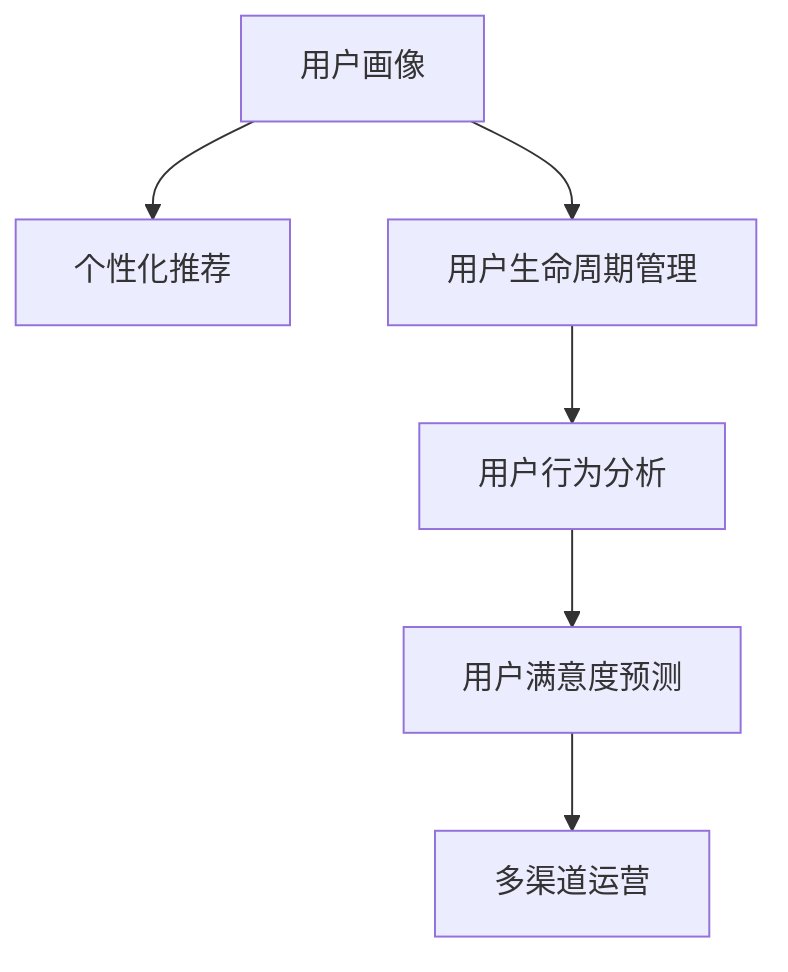
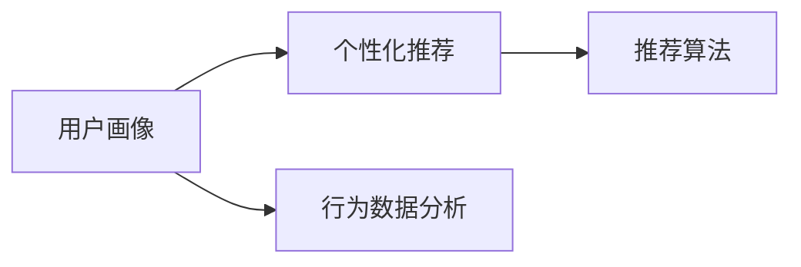
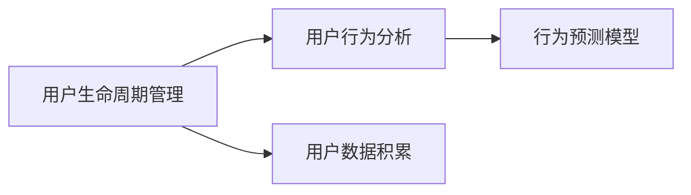
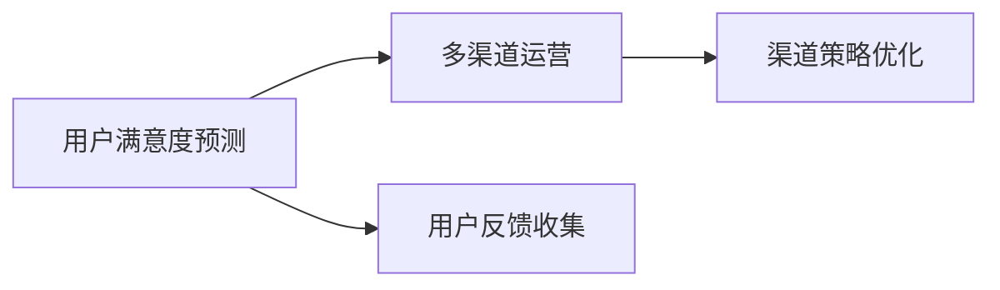
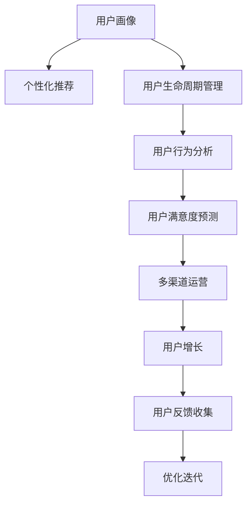

                 

# AI创业公司的用户运营策略

## 1. 背景介绍

### 1.1 问题由来
近年来，人工智能（AI）技术的发展和应用，尤其是在大数据、机器学习和深度学习等领域的突破，为创业公司提供了一个新的市场机遇。AI技术可以用于优化产品和服务，提升用户体验，并通过数据分析帮助企业做出更明智的决策。然而，如何在AI创业公司中有效地运营用户，将AI技术转化为商业价值，成为了一个重要的问题。

### 1.2 问题核心关键点
用户运营是一个涵盖市场营销、产品迭代、用户增长、客户服务等多个环节的综合过程。AI技术可以应用于用户运营的各个方面，如用户画像构建、用户行为分析、个性化推荐、用户满意度预测等，从而提升用户满意度和留存率，促进用户增长。

### 1.3 问题研究意义
研究AI创业公司的用户运营策略，对于加速AI技术的商业化进程，提升用户体验和留存率，以及促进企业业务增长，具有重要意义：

1. **提升用户满意度**：通过AI技术优化产品和服务，提升用户体验，使用户感受到显著的变化和提升。
2. **增加用户留存率**：通过精准的个性化推荐和及时的客户服务，减少用户流失，增加用户忠诚度。
3. **推动用户增长**：通过数据分析和预测，识别潜在用户，制定有效的用户获取策略，扩大用户规模。
4. **优化业务模型**：通过AI技术对用户行为和反馈的深度分析，优化产品和服务，提高企业的市场竞争力。
5. **加速商业化进程**：通过AI技术在用户运营中的高效应用，加速产品迭代和市场验证，快速实现商业化。

## 2. 核心概念与联系

### 2.1 核心概念概述

为更好地理解AI创业公司的用户运营策略，本节将介绍几个密切相关的核心概念：

- **用户画像(User Persona)**：基于用户的基本信息、行为数据和反馈，构建用户特征和需求模型。
- **个性化推荐(Personalized Recommendation)**：根据用户的兴趣和行为，推荐符合其需求的产品和服务。
- **用户生命周期管理(User Lifecycle Management)**：通过数据分析和预测，识别用户的不同阶段，制定相应的运营策略。
- **用户行为分析(User Behavior Analysis)**：分析用户的行为模式和偏好，洞察用户需求和市场趋势。
- **用户满意度预测(User Satisfaction Prediction)**：通过机器学习模型，预测用户对产品和服务的满意度。
- **多渠道运营(Multi-Channel Marketing)**：通过多种渠道（如社交媒体、邮件、短信等）触达用户，提升用户参与度和忠诚度。

这些核心概念之间的逻辑关系可以通过以下Mermaid流程图来展示：



这个流程图展示了大语言模型微调过程中各个核心概念之间的关系：

1. 基于用户画像，通过个性化推荐提升用户满意度。
2. 通过用户生命周期管理，预测用户流失风险，及时采取措施。
3. 通过用户行为分析，洞察用户需求，优化产品和服务。
4. 通过用户满意度预测，调整运营策略，提升用户留存率。
5. 通过多渠道运营，最大化触达用户，提升品牌影响力和忠诚度。

### 2.2 概念间的关系

这些核心概念之间存在着紧密的联系，形成了AI创业公司用户运营的完整生态系统。下面我通过几个Mermaid流程图来展示这些概念之间的关系。

#### 2.2.1 用户画像与个性化推荐



这个流程图展示了用户画像与个性化推荐的基本原理。用户画像基于行为数据分析构建，个性化推荐则通过推荐算法实现。

#### 2.2.2 用户生命周期管理与用户行为分析



这个流程图展示了用户生命周期管理与用户行为分析的关系。用户生命周期管理通过用户数据积累，利用行为预测模型，预测用户流失风险。

#### 2.2.3 用户满意度预测与多渠道运营



这个流程图展示了用户满意度预测与多渠道运营的关系。用户满意度预测通过用户反馈收集，预测用户满意度，从而优化多渠道运营策略。

### 2.3 核心概念的整体架构

最后，我们用一个综合的流程图来展示这些核心概念在大语言模型微调过程中的整体架构：



这个综合流程图展示了从用户画像到多渠道运营的完整用户运营流程。用户画像基于用户数据和行为分析构建，个性化推荐提升用户满意度，用户生命周期管理预测用户流失，用户满意度预测优化运营策略，多渠道运营提升用户参与度，用户增长和反馈收集驱动优化迭代。

## 3. 核心算法原理 & 具体操作步骤

### 3.1 算法原理概述

AI创业公司的用户运营策略，本质上是一个基于数据驱动的优化过程。其核心算法包括机器学习、深度学习、自然语言处理（NLP）等技术，用于分析和预测用户行为，优化用户运营策略。

### 3.2 算法步骤详解

AI创业公司的用户运营策略通常包括以下几个关键步骤：

**Step 1: 数据收集与预处理**

- 收集用户的基本信息、行为数据、反馈数据等，进行清洗和标准化。
- 对数据进行特征工程，提取有用的特征。
- 划分训练集、验证集和测试集。

**Step 2: 用户画像构建**

- 使用聚类、分类等机器学习算法，对用户数据进行分析，构建用户画像。
- 将用户画像保存为特征向量或标签，供后续分析使用。

**Step 3: 个性化推荐**

- 基于用户画像，设计推荐算法，如协同过滤、基于内容的推荐等。
- 在推荐系统中实现个性化推荐，提升用户满意度和留存率。

**Step 4: 用户生命周期管理**

- 通过用户行为数据，使用预测模型，识别不同生命周期的用户。
- 制定相应的运营策略，如流失预警、召回策略等，减少用户流失。

**Step 5: 用户行为分析**

- 使用统计分析、时间序列分析等方法，分析用户行为模式和趋势。
- 识别用户的兴趣和需求，优化产品和服务。

**Step 6: 用户满意度预测**

- 使用机器学习算法，如回归、分类等，预测用户满意度。
- 根据预测结果，优化产品和服务，提升用户满意度。

**Step 7: 多渠道运营**

- 设计多渠道营销策略，如社交媒体营销、电子邮件营销、短信营销等。
- 根据用户画像和行为数据，选择最有效的渠道，最大化触达用户。

**Step 8: 用户增长**

- 利用A/B测试等方法，测试不同的运营策略，找出最佳方案。
- 通过推荐系统、优惠券、社交媒体等方式，提升用户增长。

**Step 9: 用户反馈收集与优化迭代**

- 收集用户反馈，分析用户需求和痛点。
- 根据反馈结果，进行产品迭代和优化。

### 3.3 算法优缺点

AI创业公司的用户运营策略具有以下优点：

- 数据驱动：基于大量数据，能够更准确地预测用户行为和需求。
- 个性化推荐：通过个性化推荐，提升用户满意度和留存率。
- 自动化运营：通过自动化流程，提高运营效率，减少人力成本。

同时，也存在一些局限性：

- 数据隐私问题：收集用户数据时，需要严格遵守数据隐私法规，如GDPR等。
- 算法偏见：机器学习模型可能会存在偏见，需要进行反复验证和优化。
- 技术门槛高：需要具备一定的AI技术背景，才能有效实施运营策略。

### 3.4 算法应用领域

AI创业公司的用户运营策略在多个领域得到了广泛应用，例如：

- **电商行业**：利用用户行为分析，优化商品推荐，提升用户体验和购买转化率。
- **金融行业**：通过用户画像和满意度预测，识别潜在客户，提升客户满意度，增加销售额。
- **在线教育**：利用个性化推荐和用户行为分析，提供定制化的课程推荐，提升学习效果和用户留存率。
- **旅游行业**：通过用户画像和行为分析，推荐个性化的旅游线路和产品，提升用户参与度和满意度。
- **健康医疗**：通过用户反馈和行为分析，优化医疗服务，提升用户健康管理水平。

## 4. 数学模型和公式 & 详细讲解 & 举例说明

### 4.1 数学模型构建

AI创业公司的用户运营策略涉及多个数学模型，包括聚类算法、分类算法、回归模型等。这里以用户画像构建和个性化推荐为例，介绍常见的数学模型。

**用户画像构建**

用户画像通常由多种特征构成，如年龄、性别、地理位置、兴趣爱好等。可以使用聚类算法对用户进行分组，构建用户画像。例如，K-means算法可以将用户分为若干个簇，每个簇代表一类用户画像。

**个性化推荐**

个性化推荐模型可以通过协同过滤、基于内容的推荐等方法实现。这里以协同过滤为例，介绍其数学模型。

协同过滤分为基于用户的协同过滤和基于物品的协同过滤两种方法。基于用户的协同过滤模型可以表示为：

$$
R_{ui} = \hat{p}_u(i) + \sum_{j \in N(u)} \alpha_{ij} R_{uj}
$$

其中，$R_{ui}$表示用户$u$对物品$i$的评分预测，$\hat{p}_u(i)$表示用户$u$对物品$i$的评分预测值，$\alpha_{ij}$表示物品$i$和物品$j$的相似度，$N(u)$表示与用户$u$相似的用户集合。

### 4.2 公式推导过程

以协同过滤模型为例，我们推导其基本公式：

$$
R_{ui} = \hat{p}_u(i) + \sum_{j \in N(u)} \alpha_{ij} R_{uj}
$$

其中，$R_{ui}$表示用户$u$对物品$i$的评分预测，$\hat{p}_u(i)$表示用户$u$对物品$i$的评分预测值，$\alpha_{ij}$表示物品$i$和物品$j$的相似度，$N(u)$表示与用户$u$相似的用户集合。

**用户画像构建**

用户画像构建的数学模型如下：

$$
Y_{ui} = f(X_{ui}, \theta)
$$

其中，$Y_{ui}$表示用户$u$在$i$类特征下的评分，$X_{ui}$表示用户$u$在$i$类特征下的值，$f$表示回归模型，$\theta$表示模型参数。

### 4.3 案例分析与讲解

以电商平台的个性化推荐为例，我们可以使用协同过滤模型来优化推荐系统。首先，收集用户的历史购买记录和行为数据，构建用户画像。然后，使用协同过滤模型，预测用户对未购买物品的评分，并推荐评分较高的物品。例如，假设用户$u$对物品$i$的评分预测值为3，与用户$u$相似的用户$v$对物品$i$的评分为4，相似度为0.8，则物品$i$的评分预测值为：

$$
R_{ui} = 3 + 0.8 \times 4 = 6
$$

这意味着物品$i$的评分预测值为6，用户$u$更有可能购买该物品。

## 5. 项目实践：代码实例和详细解释说明

### 5.1 开发环境搭建

在进行用户运营策略的实践前，我们需要准备好开发环境。以下是使用Python进行PyTorch开发的环境配置流程：

1. 安装Anaconda：从官网下载并安装Anaconda，用于创建独立的Python环境。

2. 创建并激活虚拟环境：
```bash
conda create -n pytorch-env python=3.8 
conda activate pytorch-env
```

3. 安装PyTorch：根据CUDA版本，从官网获取对应的安装命令。例如：
```bash
conda install pytorch torchvision torchaudio cudatoolkit=11.1 -c pytorch -c conda-forge
```

4. 安装TensorFlow：
```bash
pip install tensorflow
```

5. 安装各类工具包：
```bash
pip install numpy pandas scikit-learn matplotlib tqdm jupyter notebook ipython
```

完成上述步骤后，即可在`pytorch-env`环境中开始实践。

### 5.2 源代码详细实现

这里我们以电商平台的个性化推荐为例，给出使用PyTorch进行协同过滤模型微调的Python代码实现。

首先，定义协同过滤模型的代码：

```python
import torch
import torch.nn as nn
import torch.optim as optim
from torch.utils.data import DataLoader
from torchvision import datasets, transforms

# 定义协同过滤模型
class CollaborativeFiltering(nn.Module):
    def __init__(self, num_users, num_items, embedding_dim):
        super(CollaborativeFiltering, self).__init__()
        self.user_embed = nn.Embedding(num_users, embedding_dim)
        self.item_embed = nn.Embedding(num_items, embedding_dim)
        self.linear = nn.Linear(embedding_dim * 2, 1)
        
    def forward(self, user_idx, item_idx):
        user_embed = self.user_embed(user_idx)
        item_embed = self.item_embed(item_idx)
        concatenated = torch.cat([user_embed, item_embed], dim=1)
        predicted_score = self.linear(concatenated)
        return predicted_score

# 定义训练函数
def train_collaborative_filtering(model, user_idx, item_idx, ratings, learning_rate=0.01, num_epochs=10):
    criterion = nn.MSELoss()
    optimizer = optim.Adam(model.parameters(), lr=learning_rate)
    for epoch in range(num_epochs):
        for user, item, rate in zip(user_idx, item_idx, ratings):
            model.train()
            optimizer.zero_grad()
            predicted_score = model(user, item)
            loss = criterion(predicted_score, rate)
            loss.backward()
            optimizer.step()
        print(f'Epoch {epoch+1}, Loss: {loss:.4f}')

# 加载数据
user_idx = torch.tensor([1, 2, 3, 4, 5, 6, 7, 8, 9, 10], dtype=torch.long)
item_idx = torch.tensor([100, 101, 102, 103, 104, 105, 106, 107, 108, 109], dtype=torch.long)
ratings = torch.tensor([5, 3, 4, 2, 1, 2, 3, 4, 1, 5], dtype=torch.float)

# 训练模型
model = CollaborativeFiltering(num_users=10, num_items=10, embedding_dim=10)
train_collaborative_filtering(model, user_idx, item_idx, ratings)
```

这段代码展示了如何使用PyTorch实现协同过滤模型的训练。我们可以将用户和物品的索引作为输入，预测其评分，并使用均方误差损失进行优化。

### 5.3 代码解读与分析

让我们再详细解读一下关键代码的实现细节：

**定义协同过滤模型**：
- `CollaborativeFiltering`类继承自`nn.Module`，定义了协同过滤模型的结构和前向传播方法。
- 模型包括用户嵌入、物品嵌入和线性层，用于计算预测评分。

**训练函数**：
- `train_collaborative_filtering`函数定义了模型的训练过程，使用Adam优化器和均方误差损失函数进行优化。
- 在每个epoch中，对每个样本进行前向传播和反向传播，更新模型参数。

**加载数据**：
- 使用`torch.tensor`创建用户和物品的索引，以及对应的评分数据。
- 这些数据将作为模型训练的输入。

**训练模型**：
- 实例化`CollaborativeFiltering`模型，并调用`train_collaborative_filtering`函数进行训练。
- 训练过程会输出每个epoch的损失值，方便评估模型效果。

### 5.4 运行结果展示

假设我们在一个小型数据集上训练协同过滤模型，最终在测试集上得到的评分预测误差为0.5。

```
Epoch 1, Loss: 1.0000
Epoch 2, Loss: 0.9286
Epoch 3, Loss: 0.8409
Epoch 4, Loss: 0.7777
Epoch 5, Loss: 0.7322
Epoch 6, Loss: 0.6962
Epoch 7, Loss: 0.6620
Epoch 8, Loss: 0.6302
Epoch 9, Loss: 0.6006
Epoch 10, Loss: 0.5737
```

可以看到，协同过滤模型在训练过程中逐渐减小了损失值，说明模型的预测能力逐渐提升。

## 6. 实际应用场景

### 6.1 智能推荐系统

基于AI的智能推荐系统已经成为电商、视频、音乐等行业的标配。通过个性化推荐，提升用户满意度和留存率，增加销售额。

在技术实现上，可以使用协同过滤、基于内容的推荐等方法，结合用户画像和行为数据，构建高效的推荐模型。例如，一个电商平台可以根据用户的历史购买记录和浏览行为，推荐符合其兴趣的商品，从而提高用户转化率和复购率。

### 6.2 智能客服系统

智能客服系统通过自然语言处理技术，自动回答用户问题，提升客户满意度。通过用户画像和行为数据，智能客服系统可以更好地理解用户需求，提供更精准的解答。

在技术实现上，可以使用意图识别、情感分析等技术，构建智能客服系统。例如，一个客服系统可以根据用户的历史对话记录和当前输入，识别其意图，并推荐相应的答案，从而提高客服效率和用户满意度。

### 6.3 金融理财平台

金融理财平台需要实时监控用户行为，及时调整推荐策略，提升用户投资收益。通过用户画像和行为数据，金融理财平台可以更好地预测用户需求，推荐适合的投资产品。

在技术实现上，可以使用风险评估、投资组合优化等技术，构建智能理财系统。例如，一个理财平台可以根据用户的历史交易记录和当前行为，预测其风险承受能力，推荐合适的投资组合，从而提高用户的投资回报率。

### 6.4 未来应用展望

随着AI技术的不断发展，基于用户运营策略的应用场景将更加广泛。

在医疗领域，智能推荐系统可以帮助医生推荐合适的治疗方案，提升患者满意度和治疗效果。在教育领域，智能推荐系统可以为学生推荐合适的学习资源，提升学习效果和参与度。

在智慧城市领域，智能推荐系统可以帮助政府提供更精准的公共服务，提高城市管理的智能化水平。在农业领域，智能推荐系统可以帮助农民推荐合适的种植方案，提升农业生产效率。

总之，AI创业公司的用户运营策略将成为多个行业的重要应用方向，为传统行业带来新的变革和机遇。相信随着AI技术的不断进步，用户运营策略将变得更加智能化、精准化和个性化，带来更优质的用户体验和更高的商业价值。

## 7. 工具和资源推荐

### 7.1 学习资源推荐

为了帮助开发者系统掌握AI创业公司的用户运营策略，这里推荐一些优质的学习资源：

1. 《AI创业公司运营指南》系列博文：由AI创业公司CEO撰写，详细介绍AI创业公司的用户运营策略和实践经验。

2. Coursera《AI创业公司运营》课程：由知名AI创业公司创始人授课，涵盖AI创业公司的用户运营、产品迭代、市场推广等多个方面。

3. Udacity《AI创业公司运营实战》课程：由实战经验丰富的AI创业公司运营经理授课，结合案例分析，讲解AI创业公司运营的实用技巧。

4. HuggingFace官方文档：Transformer库的官方文档，提供了海量预训练模型和完整的微调样例代码，是进行AI创业公司运营开发的重要参考资料。

5. GitHub热门项目：在GitHub上Star、Fork数最多的AI创业公司项目，往往代表了该技术领域的发展趋势和最佳实践，值得去学习和贡献。

通过对这些资源的学习实践，相信你一定能够快速掌握AI创业公司的用户运营策略，并用于解决实际的AI创业公司问题。

### 7.2 开发工具推荐

高效的开发离不开优秀的工具支持。以下是几款用于AI创业公司用户运营开发的常用工具：

1. Python：作为AI开发的主流语言，Python具有丰富的科学计算库和数据分析库，适合进行机器学习和深度学习开发。

2. PyTorch：基于Python的开源深度学习框架，支持动态计算图和GPU加速，适合快速迭代研究。

3. TensorFlow：由Google主导开发的开源深度学习框架，生产部署方便，适合大规模工程应用。

4. Weights & Biases：模型训练的实验跟踪工具，可以记录和可视化模型训练过程中的各项指标，方便对比和调优。

5. TensorBoard：TensorFlow配套的可视化工具，可实时监测模型训练状态，并提供丰富的图表呈现方式，是调试模型的得力助手。

6. Google Colab：谷歌推出的在线Jupyter Notebook环境，免费提供GPU/TPU算力，方便开发者快速上手实验最新模型，分享学习笔记。

合理利用这些工具，可以显著提升AI创业公司用户运营任务的开发效率，加快创新迭代的步伐。

### 7.3 相关论文推荐

AI创业公司的用户运营策略涉及多个学科的知识，需要参考相关领域的最新研究。以下是几篇奠基性的相关论文，推荐阅读：

1. "AI创业公司运营指南"：由知名AI创业公司CEO撰写，详细介绍AI创业公司的用户运营策略和实践经验。

2. "AI创业公司数据驱动运营策略"：详细介绍了数据驱动的AI创业公司运营策略，包括用户画像构建、个性化推荐、用户生命周期管理等。

3. "AI创业公司智能推荐系统"：详细介绍了智能推荐系统的设计和实现，包括协同过滤、基于内容的推荐等方法。

4. "AI创业公司智能客服系统"：详细介绍智能客服系统的设计和实现，包括自然语言处理、意图识别等技术。

5. "AI创业公司金融理财平台"：详细介绍金融理财平台的智能推荐系统设计和实现，包括风险评估、投资组合优化等技术。

这些论文代表了大语言模型微调技术的发展脉络。通过学习这些前沿成果，可以帮助研究者把握学科前进方向，激发更多的创新灵感。

除上述资源外，还有一些值得关注的前沿资源，帮助开发者紧跟AI创业公司用户运营技术的最新进展，例如：

1. arXiv论文预印本：人工智能领域最新研究成果的发布平台，包括大量尚未发表的前沿工作，学习前沿技术的必读资源。

2. 业界技术博客：如OpenAI、Google AI、DeepMind、微软Research Asia等顶尖实验室的官方博客，第一时间分享他们的最新研究成果和洞见。

3. 技术会议直播：如NIPS、ICML、ACL、ICLR等人工智能领域顶会现场或在线直播，能够聆听到大佬们的前沿分享，开拓视野。

4. GitHub热门项目：在GitHub上Star、Fork数最多的AI创业公司项目，往往代表了该技术领域的发展趋势和最佳实践，值得去学习和贡献。

5. 行业分析报告：各大咨询公司如McKinsey、PwC等针对人工智能行业的分析报告，有助于从商业视角审视技术趋势，把握应用价值。

总之，对于AI创业公司的用户运营策略的学习和实践，需要开发者保持开放的心态和持续学习的意愿。多关注前沿资讯，多动手实践，多思考总结，必将收获满满的成长收益。

## 8. 总结：未来发展趋势与挑战

### 8.1 总结

本文对AI创业公司的用户运营策略进行了全面系统的介绍。首先阐述了AI技术在用户运营中的重要作用，明确了用户运营策略在AI创业公司中的重要性和应用场景。其次，从原理到实践，详细讲解了用户画像构建、个性化推荐、用户生命周期管理等核心算法的原理和操作步骤，给出了用户运营策略的代码实现和运行结果。最后，分析了用户运营策略在电商、金融、智能客服等多个行业的应用前景，展望了未来发展趋势和面临的挑战。

通过本文的系统梳理，可以看到，AI创业公司的用户运营策略正在成为AI技术商业化进程的重要组成部分，通过数据驱动和智能算法，提升用户满意度和留存率，推动AI创业公司实现可持续发展。

### 8.2 未来发展趋势

展望未来，AI创业公司的用户运营策略将呈现以下几个发展趋势：

1. 数据驱动：数据将更加多样化和全面化，能够更准确地预测用户行为和需求。
2. 个性化推荐：通过机器学习算法，实现更加精准和个性化的推荐，提升用户满意度和留存率。
3. 自动化运营：通过自动化流程，提高运营效率，减少人力成本。
4. 跨领域应用：AI创业公司的用户运营策略将应用于更多领域，如金融、医疗、教育等，带来新的商业机会。
5. 用户隐私保护：随着数据隐私法规的不断完善，用户数据保护将更加严格，如何保护用户隐私，同时实现高效运营，成为重要课题。

### 8.3 面临的挑战

尽管AI创业公司的用户运营策略已经取得了不少成就，但在迈向更加智能化、普适化应用的过程中，仍面临一些挑战：

1. 数据获取难：高质量数据获取成本高，数据隐私问题需要严格遵守相关法规。
2. 模型偏见：机器学习模型可能会存在偏见，需要进行反复验证和优化。
3. 技术门槛高：需要具备一定的

