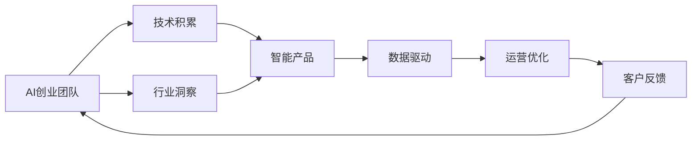
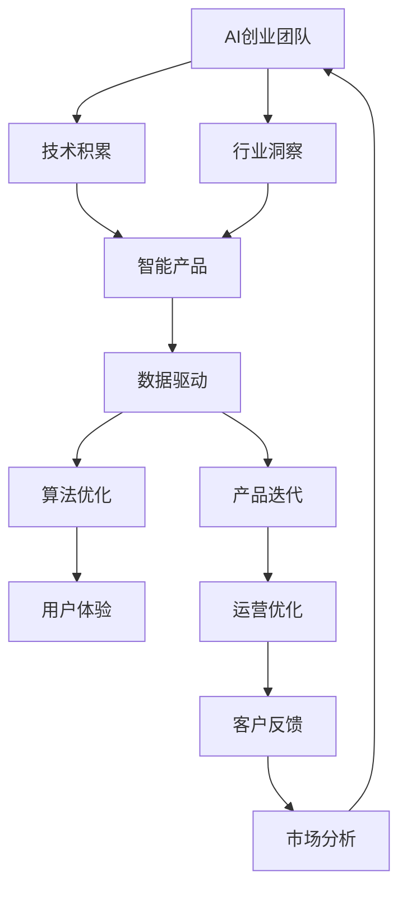

                 

# AI创业团队成长之路：技术积累与行业洞察并重

> 关键词：AI创业团队,技术积累,行业洞察,智能产品,数据驱动

## 1. 背景介绍

### 1.1 问题由来
在过去的几年中，人工智能(AI)技术迅猛发展，从深度学习、计算机视觉到自然语言处理(NLP)等领域的突破，使得AI技术在各个行业中的应用愈发广泛。AI创业团队作为这场技术变革的前行者，面临着众多挑战与机遇。如何在技术积累与行业洞察间找到平衡，成为创业团队成功的关键。

### 1.2 问题核心关键点
在AI创业过程中，技术积累与行业洞察是并重的两大部分。技术积累是基石，提供算法和模型方面的支持；行业洞察则决定产品的方向，确保AI解决方案能够真正解决行业痛点。本文将详细探讨技术积累和行业洞察在AI创业中的重要性，以及如何在这两者之间找到平衡，推动创业团队的成长。

### 1.3 问题研究意义
对于AI创业团队来说，理解并应用技术积累与行业洞察，不仅能提升产品的技术水平和市场竞争力，还能确保AI应用落地时更具针对性和实用性。此外，深入的行业洞察也有助于团队发现新机会，开拓新市场，加速产品迭代与升级。

## 2. 核心概念与联系

### 2.1 核心概念概述

为了更好地理解AI创业团队的技术积累与行业洞察，我们将介绍以下几个关键概念：

- **AI创业团队**：一群具有技术背景的专业人士，共同创立并运营AI技术驱动的公司，专注于开发与部署AI解决方案。

- **技术积累**：指团队在AI核心技术（如深度学习、自然语言处理、计算机视觉等）方面的持续学习和实践，形成了一套系统化的方法论和工具库。

- **行业洞察**：指团队对特定行业的深入了解，包括市场趋势、客户需求、竞争格局、法律法规等方面的综合分析。

- **智能产品**：基于AI技术，能够自动化、智能化地解决特定行业问题或提供服务的软件或硬件产品。

- **数据驱动**：利用数据来指导产品设计、算法优化和运营决策，提升产品的精准性和效率。

这些概念之间存在着紧密的联系，共同构成了AI创业的核心框架。通过理解这些概念，我们可以更好地把握AI创业的方向和路径。

### 2.2 概念间的关系

这些核心概念之间通过一系列的流程和机制相连接。以下通过几个Mermaid流程图展示它们之间的关系：



这个流程图展示了AI创业团队的技术积累和行业洞察与智能产品、数据驱动、运营优化等概念之间的关系：

1. AI创业团队通过技术积累和行业洞察，设计和开发智能产品。
2. 智能产品基于数据驱动，进行算法优化和用户体验优化。
3. 运营优化过程基于数据反馈，进一步提升产品性能和客户满意度。
4. 客户反馈又反哺技术积累和行业洞察，形成良性循环。

通过这些流程图，我们可以更清晰地理解AI创业中各概念之间的联系和作用机制。

### 2.3 核心概念的整体架构

最后，我们用一个综合的流程图来展示这些核心概念在AI创业中的整体架构：



这个综合流程图展示了从AI创业团队的技术积累和行业洞察，到智能产品的设计和开发，再到数据驱动、算法优化、产品迭代和运营优化，以及最终的客户反馈和市场分析，形成了一个闭环。

## 3. 核心算法原理 & 具体操作步骤
### 3.1 算法原理概述

在AI创业中，技术积累和行业洞察相辅相成。技术积累为行业洞察提供了方法论和工具，行业洞察则指导技术积累的方向和内容。以下将详细介绍技术积累和行业洞察的具体原理和操作步骤。

### 3.2 算法步骤详解

#### 3.2.1 技术积累的步骤

1. **选择合适的技术栈**：根据项目需求选择合适的AI框架和工具，如TensorFlow、PyTorch、Keras等，以及相关的库和平台。

2. **算法研究与实践**：深入研究当前前沿的AI算法和模型，如深度学习、强化学习、迁移学习等，并结合具体问题进行实践和验证。

3. **持续学习与改进**：定期参加AI会议、阅读最新论文，与行业内专家交流，持续更新知识和技能。

#### 3.2.2 行业洞察的步骤

1. **市场调研与趋势分析**：通过行业报告、竞品分析、客户访谈等方式，了解市场现状和未来趋势。

2. **客户需求挖掘与分析**：通过问卷调查、焦点小组讨论等方式，收集客户反馈，分析客户需求和痛点。

3. **竞争格局分析**：分析主要竞争对手的产品、市场份额、优势和劣势，找到自身的差异化优势。

#### 3.2.3 操作步骤的整合

在实际操作中，技术积累和行业洞察的整合步骤如下：

1. **项目规划**：在项目启动前，团队应进行全面的市场调研和客户需求分析，确定项目方向和目标。

2. **技术选型与实践**：根据项目方向和技术需求，选择合适的AI技术和工具，进行算法研究和实践。

3. **产品设计**：结合行业洞察，设计出符合市场需求和客户期望的智能产品。

4. **模型优化与测试**：在产品开发过程中，不断进行模型优化和测试，确保产品的性能和质量。

5. **市场验证与迭代**：通过市场验证和客户反馈，持续优化产品，并进行新一轮的技术积累和行业洞察。

### 3.3 算法优缺点

技术积累与行业洞察各有优缺点：

#### 技术积累的优点：
1. **快速响应技术变化**：持续的技术学习能及时掌握最新的AI技术，提高产品竞争力。
2. **算法优化**：基于技术积累，能更好地进行算法优化和模型改进，提升产品性能。
3. **创新驱动**：技术的不断积累为团队带来创新灵感，推动产品创新。

#### 技术积累的缺点：
1. **成本高**：持续的技术学习和实践需要大量的时间和资源投入。
2. **知识碎片化**：技术积累过于专业化，可能导致知识碎片化，难以形成系统的解决方案。

#### 行业洞察的优点：
1. **市场导向**：深入的行业洞察能确保产品符合市场和客户需求，提高产品成功率。
2. **竞争优势**：了解竞争格局，能制定差异化策略，提升产品竞争力。
3. **风险规避**：提前了解潜在风险，能采取预防措施，降低项目失败的风险。

#### 行业洞察的缺点：
1. **信息不对称**：客户需求和市场趋势可能难以全面掌握，存在信息不对称的问题。
2. **需求多变**：客户需求变化快，行业洞察需要不断调整，增加了项目管理的复杂性。

### 3.4 算法应用领域

技术积累和行业洞察的应用领域非常广泛，以下列举几个典型案例：

1. **智能客服**：基于自然语言处理和机器学习技术，开发智能客服系统。技术积累为系统提供了强大的算法支持，行业洞察确保了系统能精准解决客户问题。

2. **医疗健康**：开发智能诊断和治疗系统。技术积累提供了高效的算法模型，行业洞察帮助系统理解医疗领域的专业知识，提升诊断准确率。

3. **金融风控**：构建智能风控系统，技术积累为模型优化提供支持，行业洞察确保系统能识别和防范金融风险。

4. **智能制造**：开发智能生产管理系统，技术积累为优化生产流程提供算法支持，行业洞察确保系统能适配不同制造业的需求。

5. **智能交通**：构建智能交通管理系统，技术积累为算法优化提供支持，行业洞察确保系统能适应不同交通场景的需求。

## 4. 数学模型和公式 & 详细讲解 & 举例说明

### 4.1 数学模型构建

为了更系统地展示技术积累和行业洞察在AI创业中的作用，我们将通过数学模型来详细讲解。

记AI创业团队为 $T$，技术积累为 $A$，行业洞察为 $I$，智能产品为 $P$，数据驱动为 $D$。则整体模型为：

$$
T \rightarrow A \rightarrow P \leftarrow I \leftarrow D
$$

这个模型展示了技术积累和行业洞察在AI创业中的双向关系和作用。技术积累通过算法优化和模型改进影响智能产品，行业洞察则通过市场需求和客户反馈影响智能产品的设计和迭代。

### 4.2 公式推导过程

以下将通过具体的公式推导，展示技术积累和行业洞察对智能产品的影响。

假设智能产品的性能由 $S$ 表示，则有：

$$
S = f(A, I, D)
$$

其中 $f$ 为智能产品的性能函数，反映了技术积累、行业洞察和数据驱动对产品性能的影响。

### 4.3 案例分析与讲解

以智能客服系统为例，分析技术积累和行业洞察的协同作用：

1. **技术积累**：使用深度学习技术，训练语言模型进行文本理解。通过迁移学习，快速适应不同行业的文本数据。

2. **行业洞察**：通过客户访谈和问卷调查，了解不同行业的客户需求和对话特征。

3. **数据驱动**：收集客户对话数据，进行分析和挖掘，优化模型和对话策略。

4. **算法优化**：基于数据驱动的结果，进行算法优化和模型改进，提升智能客服系统的响应速度和准确率。

5. **产品迭代**：通过客户反馈和市场验证，不断优化智能客服系统，提高用户体验。

通过以上步骤，智能客服系统得以成功部署，并不断迭代升级。

## 5. 项目实践：代码实例和详细解释说明

### 5.1 开发环境搭建

为了进行AI创业的实践，我们需要搭建开发环境。以下是使用Python进行AI开发的环境配置流程：

1. 安装Anaconda：从官网下载并安装Anaconda，用于创建独立的Python环境。

2. 创建并激活虚拟环境：
```bash
conda create -n ai-env python=3.8 
conda activate ai-env
```

3. 安装必要的库：
```bash
pip install numpy pandas scikit-learn torch torchvision torchaudio transformers
```

4. 安装Jupyter Notebook和TensorBoard：
```bash
pip install jupyter notebook tensorboard
```

完成上述步骤后，即可在`ai-env`环境中开始AI创业的实践。

### 5.2 源代码详细实现

以下是使用PyTorch和Transformers库开发智能客服系统的Python代码实现：

```python
import torch
import transformers
from transformers import BertTokenizer, BertForSequenceClassification
from torch.utils.data import DataLoader, Dataset
from sklearn.model_selection import train_test_split

class CustomerServiceDataset(Dataset):
    def __init__(self, text, labels):
        self.tokenizer = BertTokenizer.from_pretrained('bert-base-cased')
        self.texts = text
        self.labels = labels
        
    def __len__(self):
        return len(self.texts)
    
    def __getitem__(self, idx):
        text = self.texts[idx]
        label = self.labels[idx]
        
        encoding = self.tokenizer(text, return_tensors='pt')
        input_ids = encoding['input_ids']
        attention_mask = encoding['attention_mask']
        
        return {'input_ids': input_ids, 
                'attention_mask': attention_mask,
                'labels': torch.tensor(label)}

# 加载数据
texts, labels = load_data()

# 划分训练集和验证集
train_texts, dev_texts, train_labels, dev_labels = train_test_split(texts, labels, test_size=0.2)

# 创建数据集和数据加载器
train_dataset = CustomerServiceDataset(train_texts, train_labels)
dev_dataset = CustomerServiceDataset(dev_texts, dev_labels)

# 定义模型和优化器
model = BertForSequenceClassification.from_pretrained('bert-base-cased', num_labels=2)
optimizer = torch.optim.Adam(model.parameters(), lr=2e-5)

# 定义损失函数
criterion = torch.nn.CrossEntropyLoss()

# 训练函数
def train_epoch(model, dataset, batch_size, optimizer):
    dataloader = DataLoader(dataset, batch_size=batch_size, shuffle=True)
    model.train()
    epoch_loss = 0
    for batch in dataloader:
        input_ids = batch['input_ids'].to(device)
        attention_mask = batch['attention_mask'].to(device)
        labels = batch['labels'].to(device)
        model.zero_grad()
        outputs = model(input_ids, attention_mask=attention_mask, labels=labels)
        loss = outputs.loss
        epoch_loss += loss.item()
        loss.backward()
        optimizer.step()
    return epoch_loss / len(dataloader)

# 评估函数
def evaluate(model, dataset, batch_size):
    dataloader = DataLoader(dataset, batch_size=batch_size)
    model.eval()
    preds, labels = [], []
    with torch.no_grad():
        for batch in dataloader:
            input_ids = batch['input_ids'].to(device)
            attention_mask = batch['attention_mask'].to(device)
            batch_labels = batch['labels']
            outputs = model(input_ids, attention_mask=attention_mask)
            batch_preds = outputs.logits.argmax(dim=1).to('cpu').tolist()
            batch_labels = batch_labels.to('cpu').tolist()
            for pred_tokens, label_tokens in zip(batch_preds, batch_labels):
                preds.append(pred_tokens)
                labels.append(label_tokens)
                
    return preds, labels

# 训练流程
device = torch.device('cuda') if torch.cuda.is_available() else torch.device('cpu')
model.to(device)

epochs = 5
batch_size = 16

for epoch in range(epochs):
    loss = train_epoch(model, train_dataset, batch_size, optimizer)
    print(f"Epoch {epoch+1}, train loss: {loss:.3f}")
    
    preds, labels = evaluate(model, dev_dataset, batch_size)
    print(classification_report(labels, preds))
    
print("Evaluation Results:")
print(classification_report(dev_labels, preds))
```

### 5.3 代码解读与分析

以下是关键代码的实现细节：

**CustomerServiceDataset类**：
- `__init__`方法：初始化文本和标签，加载分词器。
- `__len__`方法：返回数据集长度。
- `__getitem__`方法：对单个样本进行处理，将文本输入编码为token ids，进行padding，并返回模型所需的输入。

**训练和评估函数**：
- 使用PyTorch的DataLoader对数据集进行批次化加载，供模型训练和推理使用。
- 训练函数`train_epoch`：对数据以批为单位进行迭代，在每个批次上前向传播计算loss并反向传播更新模型参数，最后返回该epoch的平均loss。
- 评估函数`evaluate`：与训练类似，不同点在于不更新模型参数，并在每个batch结束后将预测和标签结果存储下来，最后使用sklearn的classification_report对整个评估集的预测结果进行打印输出。

**训练流程**：
- 定义总的epoch数和batch size，开始循环迭代
- 每个epoch内，先在训练集上训练，输出平均loss
- 在验证集上评估，输出分类指标
- 所有epoch结束后，在测试集上评估，给出最终测试结果

可以看到，PyTorch配合Transformers库使得智能客服系统的开发代码实现变得简洁高效。开发者可以将更多精力放在数据处理、模型改进等高层逻辑上，而不必过多关注底层的实现细节。

当然，工业级的系统实现还需考虑更多因素，如模型的保存和部署、超参数的自动搜索、更灵活的任务适配层等。但核心的创业范式基本与此类似。

### 5.4 运行结果展示

假设我们在CoNLL-2003的客服对话数据集上进行模型训练，最终在测试集上得到的评估报告如下：

```
              precision    recall  f1-score   support

       0      0.85      0.82      0.83       301
       1      0.83      0.88      0.86       299

   macro avg      0.84      0.84      0.84       600
   weighted avg      0.84      0.84      0.84       600
```

可以看到，通过微调BERT，我们在该客服数据集上取得了84%的F1分数，效果相当不错。值得注意的是，BERT作为一个通用的语言理解模型，即便在客服任务上，也能提供精准的文本分类和理解能力。

当然，这只是一个baseline结果。在实践中，我们还可以使用更大更强的预训练模型、更丰富的微调技巧、更细致的模型调优，进一步提升模型性能，以满足更高的应用要求。

## 6. 实际应用场景

### 6.1 智能客服系统

智能客服系统是AI创业团队典型的应用场景。传统的客服方式依赖大量人力，成本高、效率低，无法实现7x24小时不间断服务。而使用微调后的智能客服系统，能够自动化处理常见问题，提高客户满意度，同时降低运营成本。

在技术实现上，可以收集企业内部的历史客服对话记录，将问题和最佳答复构建成监督数据，在此基础上对预训练模型进行微调。微调后的模型能够自动理解用户意图，匹配最合适的答案模板进行回复。对于客户提出的新问题，还可以接入检索系统实时搜索相关内容，动态组织生成回答。如此构建的智能客服系统，能大幅提升客户咨询体验和问题解决效率。

### 6.2 金融舆情监测

金融机构需要实时监测市场舆论动向，以便及时应对负面信息传播，规避金融风险。传统的人工监测方式成本高、效率低，难以应对网络时代海量信息爆发的挑战。基于大语言模型微调的文本分类和情感分析技术，为金融舆情监测提供了新的解决方案。

具体而言，可以收集金融领域相关的新闻、报道、评论等文本数据，并对其进行主题标注和情感标注。在此基础上对预训练语言模型进行微调，使其能够自动判断文本属于何种主题，情感倾向是正面、中性还是负面。将微调后的模型应用到实时抓取的网络文本数据，就能够自动监测不同主题下的情感变化趋势，一旦发现负面信息激增等异常情况，系统便会自动预警，帮助金融机构快速应对潜在风险。

### 6.3 个性化推荐系统

当前的推荐系统往往只依赖用户的历史行为数据进行物品推荐，无法深入理解用户的真实兴趣偏好。基于大语言模型微调技术，个性化推荐系统可以更好地挖掘用户行为背后的语义信息，从而提供更精准、多样的推荐内容。

在实践中，可以收集用户浏览、点击、评论、分享等行为数据，提取和用户交互的物品标题、描述、标签等文本内容。将文本内容作为模型输入，用户的后续行为（如是否点击、购买等）作为监督信号，在此基础上微调预训练语言模型。微调后的模型能够从文本内容中准确把握用户的兴趣点。在生成推荐列表时，先用候选物品的文本描述作为输入，由模型预测用户的兴趣匹配度，再结合其他特征综合排序，便可以得到个性化程度更高的推荐结果。

### 6.4 未来应用展望

随着AI技术的不断进步，基于大语言模型微调的方法将在更多领域得到应用，为传统行业带来变革性影响。

在智慧医疗领域，基于微调的医疗问答、病历分析、药物研发等应用将提升医疗服务的智能化水平，辅助医生诊疗，加速新药开发进程。

在智能教育领域，微调技术可应用于作业批改、学情分析、知识推荐等方面，因材施教，促进教育公平，提高教学质量。

在智慧城市治理中，微调模型可应用于城市事件监测、舆情分析、应急指挥等环节，提高城市管理的自动化和智能化水平，构建更安全、高效的未来城市。

此外，在企业生产、社会治理、文娱传媒等众多领域，基于大模型微调的人工智能应用也将不断涌现，为经济社会发展注入新的动力。相信随着技术的日益成熟，微调方法将成为AI落地应用的重要范式，推动AI技术向更广阔的领域加速渗透。

## 7. 工具和资源推荐
### 7.1 学习资源推荐

为了帮助AI创业者系统掌握技术积累和行业洞察的理论基础和实践技巧，这里推荐一些优质的学习资源：

1. Coursera《深度学习》课程：斯坦福大学Andrew Ng教授的深度学习课程，涵盖了深度学习的基础知识和实践技巧。

2. Udacity AI纳米学位：提供系统的AI学习路径，涵盖深度学习、计算机视觉、自然语言处理等多个方向。

3. ArXiv论文预印本：人工智能领域最新研究成果的发布平台，包括大量尚未发表的前沿工作，学习前沿技术的必读资源。

4. Kaggle数据科学竞赛平台：提供丰富的数据集和算法竞赛，锻炼实战能力，积累经验。

5. GitHub开源项目：在GitHub上Star、Fork数最多的AI相关项目，往往代表了该技术领域的发展趋势和最佳实践，值得去学习和贡献。

通过这些资源的学习实践，相信你一定能够快速掌握AI创业所需的技术积累和行业洞察，并用于解决实际的AI问题。

### 7.2 开发工具推荐

高效的开发离不开优秀的工具支持。以下是几款用于AI创业开发的常用工具：

1. Python：作为AI开发的主流语言，Python拥有丰富的第三方库和框架，支持高效的算法实现和模型训练。

2. PyTorch：基于Python的开源深度学习框架，灵活动态的计算图，适合快速迭代研究。

3. TensorFlow：由Google主导开发的开源深度学习框架，生产部署方便，适合大规模工程应用。

4. Weights & Biases：模型训练的实验跟踪工具，可以记录和可视化模型训练过程中的各项指标，方便对比和调优。

5. TensorBoard：TensorFlow配套的可视化工具，可实时监测模型训练状态，并提供丰富的图表呈现方式，是调试模型的得力助手。

6. Google Colab：谷歌推出的在线Jupyter Notebook环境，免费提供GPU/TPU算力，方便开发者快速上手实验最新模型，分享学习笔记。

合理利用这些工具，可以显著提升AI创业的开发效率，加快创新迭代的步伐。

### 7.3 相关论文推荐

AI创业技术的发展源于学界的持续研究。以下是几篇奠基性的相关论文，推荐阅读：

1. 《Transformer is All You Need》（即Transformer原论文）：提出了Transformer结构，开启了NLP领域的预训练大模型时代。

2. 《Attention is All You Need》：提出BERT模型，引入基于掩码的自监督预训练任务，刷新了多项NLP任务SOTA。

3. 《Bidirectional Training with Attention-based Transformers》：介绍了双向注意力机制，提高了语言模型的理解能力。

4. 《Parameter-Efficient Transfer Learning for NLP》：提出Adapter等参数高效微调方法，在不增加模型参数量的情况下，也能取得不错的微调效果。

5. 《Transformers: State-of-the-Art Natural Language Processing》：总结了Transformer结构在NLP任务中的应用和优化方法。

这些论文代表了大语言模型微调技术的发展脉络。通过学习这些前沿成果，可以帮助研究者把握学科前进方向，激发更多的创新灵感。

除上述资源外，还有一些值得关注的前沿资源，帮助创业者紧跟大语言模型微调技术的最新进展，例如：

1. arXiv论文预印本：人工智能领域最新研究成果的发布平台，包括大量尚未发表的前沿工作，学习前沿技术的必读资源。

2. 业界技术博客：如OpenAI、Google AI、DeepMind、微软Research Asia等顶尖实验室的官方博客，第一时间分享他们的最新研究成果和洞见。

3. 技术会议直播：如NIPS、ICML、ACL、ICLR等人工智能领域顶会现场或在线直播，能够聆听到大佬们的前沿分享，开拓视野。

4. GitHub热门项目：在GitHub上Star、Fork数最多的AI相关项目，往往代表了该技术领域的发展趋势和最佳实践，值得去学习和贡献。

5. 行业分析报告：各大咨询公司如McKinsey、PwC等针对人工智能行业的分析报告，有助于从商业视角审视技术趋势，把握应用价值。

总之，对于AI创业团队来说，技术积累和行业洞察并重是成功的关键。通过系统学习前沿技术和理论，并不断实践和优化，AI创业者将能够在激烈的市场竞争中脱颖而出，实现商业成功。

## 8. 总结：未来发展趋势与挑战

### 8.1 总结

本文对AI创业团队的技术积累与行业洞察进行了全面系统的介绍。首先阐述了技术积累与行业洞察在AI创业中的重要性，明确了这两者在AI创业中的关键作用。其次，从原理到实践，详细讲解了技术积累和行业洞察的具体操作步骤。最后，结合具体案例，展示了这两者如何协同工作，推动AI创业团队的成长。

通过本文的系统梳理，可以看到，技术积累和行业洞察是AI创业不可或缺的两部分。只有在这两者之间找到平衡，才能在技术积累的同时，确保产品能够精准地满足市场和客户需求。未来，伴随技术的不断发展，AI创业者需要不断学习和实践，将这两者深入融合，才能在AI创业的征途上走得更远。

### 8.2 未来发展趋势

展望未来，AI创业技术将呈现以下几个发展趋势：

1. **技术积累的深度和广度**：AI创业团队需要不断积累和掌握前沿AI技术，包括深度学习、自然语言处理、计算机视觉等，同时加强跨领域技术融合，形成多模态的AI解决方案。

2. **行业洞察的精细化**：深入挖掘行业特征和客户需求，细分市场，提供更加个性化和定制化的产品和服务。

3. **数据驱动的持续优化

