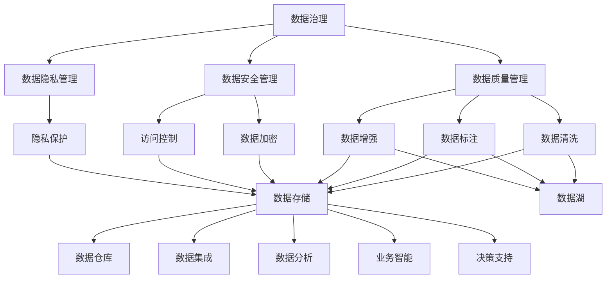
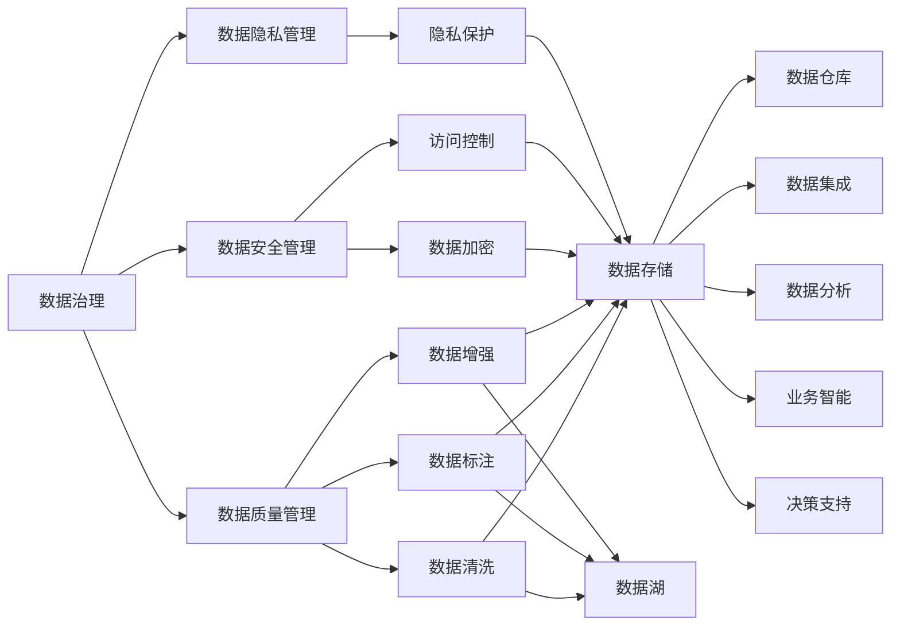

                 

# AI创业：数据管理的策略与对策探讨

> 关键词：AI创业, 数据管理, 策略与对策, 数据治理, 数据安全, 数据合规, 数据质量, 数据湖, 数据仓库

## 1. 背景介绍

随着人工智能技术的迅猛发展，AI创业领域涌现出众多前沿公司和创新模式。然而，数据作为AI技术的核心资产，其管理、治理和应用问题始终是企业和投资者关注的焦点。如何高效、安全、合规地管理海量数据，构建数据治理框架，是大规模AI创业项目成功的关键之一。

### 1.1 问题由来

数据管理和治理问题在大规模AI项目中尤为突出。数据集的质量、规模、结构以及数据处理流程，直接影响AI模型的训练效果和应用性能。特别是在AI创业项目中，数据管理和治理能力的不足，可能导致数据质量差、数据泄露、数据版权纠纷等问题，进而影响企业的核心竞争力。

当前，AI创业公司在数据管理和治理方面面临的主要挑战包括：

- **数据质量参差不齐**：企业内部不同业务领域的数据格式和来源各异，数据质量参差不齐。
- **数据安全风险高**：涉及大量敏感信息，数据泄露风险大。
- **数据合规要求高**：不同国家/地区的隐私保护法规差异大，企业面临严格的合规要求。
- **数据孤岛问题**：企业内部数据分散在不同部门，缺乏统一管理和共享机制。
- **数据处理流程复杂**：数据采集、存储、清洗、处理流程涉及多环节，流程复杂且容易出错。

### 1.2 问题核心关键点

为有效解决上述问题，本文将聚焦于数据管理和治理的策略与对策，提出一系列系统化、可行的解决方案。

- **数据质量提升**：通过数据清洗、数据增强、数据标注等技术，提升数据质量。
- **数据安全保障**：采用数据脱敏、数据加密、访问控制等技术，保护数据安全。
- **数据合规管理**：制定数据合规策略，确保数据处理符合各地区法规要求。
- **数据湖和数据仓库的建设**：构建统一的数据治理平台，实现数据的集中管理和共享。
- **数据处理流程优化**：通过流程自动化、流程可视化、流程监控等技术，优化数据处理流程。

通过系统梳理和总结，本文旨在为AI创业者提供实用的数据管理与治理指南，帮助其构建完善的数据管理体系，提升AI项目的成功率和竞争力。

## 2. 核心概念与联系

### 2.1 核心概念概述

为更好地理解数据管理和治理的策略与对策，本节将介绍几个密切相关的核心概念：

- **数据治理(Data Governance)**：定义、制定和实施数据管理策略和措施，确保数据的准确性、完整性和可用性。数据治理包括数据质量管理、数据安全管理、数据隐私管理等关键内容。
- **数据管理(Data Management)**：涵盖数据生命周期的管理，包括数据采集、存储、处理、清洗、共享、保护等环节。数据管理的目标是构建高效、安全、可靠的数据体系。
- **数据湖(Data Lake)**：构建数据集中存储的体系，涵盖结构化和非结构化数据，为数据集成、分析和共享提供支持。
- **数据仓库(Data Warehouse)**：对大规模数据进行清洗、整理、聚合和存储，为数据分析、业务智能和决策支持提供数据支持。
- **数据标注(Data Labeling)**：对数据进行标记，为模型训练提供监督信号。数据标注可以提高数据质量，提升模型训练效果。
- **数据加密(Data Encryption)**：对数据进行加密处理，防止数据泄露和未授权访问。
- **数据脱敏(Data Masking)**：对敏感数据进行处理，保留关键特征的同时隐藏敏感信息。
- **数据隐私保护(Data Privacy)**：在数据处理过程中，遵循隐私保护法规，保护个人隐私。

这些核心概念之间的逻辑关系可以通过以下Mermaid流程图来展示：

这个流程图展示了大规模AI创业项目中数据管理和治理的核心环节及其相互关系：

1. 数据治理作为整体策略，涵盖数据质量、安全和隐私管理等多个方面。
2. 数据质量管理通过数据清洗、标注和增强等技术，提升数据质量。
3. 数据安全管理通过数据加密和访问控制等技术，保障数据安全。
4. 数据隐私管理在数据处理过程中遵循隐私保护法规，保护个人隐私。
5. 数据湖和数据仓库构建统一的数据管理体系，实现数据的集中存储和共享。
6. 数据标注为模型训练提供监督信号，提升数据质量。
7. 数据加密和访问控制保护数据安全。
8. 数据隐私保护在数据处理过程中遵循隐私保护法规，保护个人隐私。

### 2.2 概念间的关系

这些核心概念之间存在着紧密的联系，形成了数据管理和治理的完整生态系统。下面我通过几个Mermaid流程图来展示这些概念之间的关系。

#### 2.2.1 数据治理的整体架构

这个流程图展示了大规模AI创业项目中数据治理的整体架构。

#### 2.2.2 数据治理与数据管理的联系

这个流程图展示了大规模AI创业项目中数据治理与数据管理的联系。

#### 2.2.3 数据治理与数据湖和数据仓库的关系

这个流程图展示了大规模AI创业项目中数据治理与数据湖和数据仓库的关系。

## 3. 核心算法原理 & 具体操作步骤
### 3.1 算法原理概述

数据管理和治理的策略与对策，涉及数据质量提升、数据安全保障、数据合规管理、数据湖和数据仓库的建设以及数据处理流程优化等多个环节。以下是各环节的算法原理概述。

### 3.2 算法步骤详解

#### 3.2.1 数据质量提升

**算法步骤**：

1. **数据清洗**：
   - 对原始数据进行去重、去噪、填补缺失值等操作，确保数据完整性和一致性。
   - 采用统计分析和机器学习方法，识别和修正数据中的错误和异常值。

2. **数据标注**：
   - 对数据进行人工标注或自动标注，为模型训练提供监督信号。
   - 采用半监督学习、弱监督学习等技术，减少标注工作量和成本。

3. **数据增强**：
   - 通过数据扩充、数据合成等技术，增加数据样本多样性和数量。
   - 采用数据扩充技术，如旋转、平移、缩放等，提升数据泛化能力。

#### 3.2.2 数据安全保障

**算法步骤**：

1. **数据加密**：
   - 采用对称加密或非对称加密技术，对数据进行加密处理。
   - 使用AES、RSA等加密算法，确保数据传输和存储的安全性。

2. **访问控制**：
   - 采用身份验证、权限管理等技术，限制对数据的访问权限。
   - 使用RBAC（基于角色的访问控制）或ABAC（基于属性的访问控制）策略，细粒度管理数据访问权限。

3. **数据脱敏**：
   - 对敏感数据进行处理，保留关键特征的同时隐藏敏感信息。
   - 使用数据脱敏技术，如数据替换、数据模糊化等，保护数据隐私。

#### 3.2.3 数据合规管理

**算法步骤**：

1. **制定合规策略**：
   - 根据不同地区和行业的隐私保护法规，制定数据合规策略。
   - 使用GDPR、CCPA等隐私保护法规，确保数据处理符合法规要求。

2. **合规审查**：
   - 对数据处理流程进行合规审查，识别潜在的合规风险。
   - 使用合规审计工具，自动化监控数据处理过程，确保合规性。

#### 3.2.4 数据湖和数据仓库的建设

**算法步骤**：

1. **数据湖构建**：
   - 构建统一的数据存储体系，存储结构化和非结构化数据。
   - 使用Hadoop、Spark等大数据技术，实现数据的集中管理和共享。

2. **数据仓库建设**：
   - 对大规模数据进行清洗、整理、聚合和存储。
   - 使用数据仓库技术，如ODBC、JDBC等，实现数据的查询和分析。

#### 3.2.5 数据处理流程优化

**算法步骤**：

1. **流程自动化**：
   - 使用流程自动化工具，如Talend、Airflow等，自动化数据处理流程。
   - 采用ETL（抽取、转换、加载）技术，实现数据的自动提取、转换和加载。

2. **流程可视化**：
   - 使用流程可视化工具，如Grafana、Kibana等，可视化数据处理流程。
   - 采用图形化界面，实时监控数据处理状态，及时发现和解决问题。

3. **流程监控**：
   - 使用流程监控工具，如Zabbix、Prometheus等，监控数据处理流程。
   - 采用实时告警机制，自动生成异常报告，及时处理数据处理故障。

### 3.3 算法优缺点

#### 3.3.1 数据质量提升

**优点**：
- **提升数据质量**：通过数据清洗、标注和增强等技术，显著提升数据质量，为模型训练提供高质量的数据支撑。
- **降低标注成本**：使用半监督学习和弱监督学习技术，减少人工标注工作量，降低标注成本。

**缺点**：
- **技术复杂性高**：数据清洗和标注技术需要专业知识，实施难度较大。
- **算法依赖性强**：数据清洗和标注效果依赖于算法选择和参数设置，可能存在误识别和误标注的风险。

#### 3.3.2 数据安全保障

**优点**：
- **保障数据安全**：通过数据加密和访问控制等技术，有效防止数据泄露和未授权访问，保护数据隐私。
- **细粒度权限管理**：采用RBAC或ABAC策略，细粒度管理数据访问权限，提高数据安全性。

**缺点**：
- **技术复杂性高**：数据加密和访问控制技术需要专业知识和经验，实施难度较大。
- **性能开销大**：加密和脱敏操作会增加数据处理的时间开销和计算资源消耗。

#### 3.3.3 数据合规管理

**优点**：
- **合规性强**：制定合规策略并自动化监控数据处理过程，确保数据处理符合各地区法规要求。
- **自动化合规审计**：使用合规审计工具，自动化监控数据处理过程，及时发现和纠正合规风险。

**缺点**：
- **法规更新频繁**：不同地区和行业的隐私保护法规频繁更新，合规策略需要定期调整和更新。
- **复杂法规处理**：不同地区和行业的隐私保护法规差异大，需要综合考虑法规要求。

#### 3.3.4 数据湖和数据仓库的建设

**优点**：
- **数据集中管理**：构建数据湖和数据仓库，实现数据的集中管理和共享，提高数据利用率。
- **支持大规模数据分析**：使用大数据技术，如Hadoop、Spark等，支持大规模数据的存储和分析。

**缺点**：
- **技术复杂性高**：构建数据湖和数据仓库需要专业知识和经验，实施难度较大。
- **存储成本高**：大规模数据存储需要高昂的存储成本。

#### 3.3.5 数据处理流程优化

**优点**：
- **提高数据处理效率**：通过流程自动化、可视化、监控等技术，优化数据处理流程，提高数据处理效率。
- **减少人为错误**：使用自动化工具和监控系统，减少人为错误，提升数据处理质量。

**缺点**：
- **技术复杂性高**：流程自动化和监控技术需要专业知识和经验，实施难度较大。
- **系统集成难度大**：数据处理流程涉及多个系统，系统集成难度较大。

### 3.4 算法应用领域

数据管理和治理的策略与对策，广泛应用于各种AI创业项目中，例如：

- **智能推荐系统**：通过数据清洗和标注，提升用户行为数据的质量，构建高效的推荐模型。
- **自然语言处理（NLP）**：通过数据清洗和标注，提升文本数据的质量，构建高质量的NLP模型。
- **图像识别系统**：通过数据增强和标注，提升图像数据的泛化能力，构建高效的图像识别模型。
- **医疗AI**：通过数据清洗和标注，提升医疗数据的质量，构建高效的医疗诊断模型。
- **金融风控**：通过数据清洗和标注，提升金融数据的质量，构建高效的金融风险预测模型。
- **智能制造**：通过数据清洗和标注，提升工业数据的质量，构建高效的工业智能化系统。

以上应用领域展示了数据管理和治理策略与对策的广泛应用，数据管理和治理在大规模AI项目中的重要性不言而喻。

## 4. 数学模型和公式 & 详细讲解 & 举例说明

### 4.1 数学模型构建

#### 4.1.1 数据质量提升

**数学模型**：
- **数据清洗模型**：
  $$
  \text{cleaned\_data} = \text{clean\_data}(\text{raw\_data})
  $$
  其中 $\text{clean\_data}$ 为清洗后的数据，$\text{raw\_data}$ 为原始数据。

- **数据标注模型**：
  $$
  \text{annotated\_data} = \text{annotate\_data}(\text{raw\_data})
  $$
  其中 $\text{annotated\_data}$ 为标注后的数据，$\text{raw\_data}$ 为原始数据。

- **数据增强模型**：
  $$
  \text{augmented\_data} = \text{augment\_data}(\text{raw\_data})
  $$
  其中 $\text{augmented\_data}$ 为增强后的数据，$\text{raw\_data}$ 为原始数据。

#### 4.1.2 数据安全保障

**数学模型**：
- **数据加密模型**：
  $$
  \text{encrypted\_data} = \text{encrypt\_data}(\text{raw\_data})
  $$
  其中 $\text{encrypted\_data}$ 为加密后的数据，$\text{raw\_data}$ 为原始数据。

- **访问控制模型**：
  $$
  \text{access\_permission} = \text{grant\_permission}( \text{user}, \text{data}, \text{role})
  $$
  其中 $\text{access\_permission}$ 为用户对数据的访问权限，$\text{user}$ 为用户的身份信息，$\text{data}$ 为数据的标识信息，$\text{role}$ 为用户的角色信息。

- **数据脱敏模型**：
  $$
  \text{masked\_data} = \text{mask\_data}(\text{raw\_data})
  $$
  其中 $\text{masked\_data}$ 为脱敏后的数据，$\text{raw\_data}$ 为原始数据。

#### 4.1.3 数据合规管理

**数学模型**：
- **合规策略模型**：
  $$
  \text{compliance\_strategy} = \text{generate\_strategy}( \text{data}, \text{regulation})
  $$
  其中 $\text{compliance\_strategy}$ 为生成的合规策略，$\text{data}$ 为数据源信息，$\text{regulation}$ 为法规信息。

- **合规审计模型**：
  $$
  \text{compliance\_audit} = \text{audit\_data}( \text{data}, \text{strategy})
  $$
  其中 $\text{compliance\_audit}$ 为合规审计结果，$\text{data}$ 为数据源信息，$\text{strategy}$ 为生成的合规策略。

#### 4.1.4 数据湖和数据仓库的建设

**数学模型**：
- **数据湖模型**：
  $$
  \text{data\_lake} = \text{build\_data\_lake}( \text{data\_raw})
  $$
  其中 $\text{data\_lake}$ 为构建的数据湖，$\text{data\_raw}$ 为原始数据。

- **数据仓库模型**：
  $$
  \text{data\_warehouse} = \text{build\_data\_warehouse}( \text{data\_lake})
  $$
  其中 $\text{data\_warehouse}$ 为构建的数据仓库，$\text{data\_lake}$ 为构建的数据湖。

#### 4.1.5 数据处理流程优化

**数学模型**：
- **流程自动化模型**：
  $$
  \text{automated\_process} = \text{automate\_process}( \text{data\_flow})
  $$
  其中 $\text{automated\_process}$ 为自动化的数据处理流程，$\text{data\_flow}$ 为原始数据流。

- **流程可视化模型**：
  $$
  \text{visualized\_process} = \text{visualize\_process}( \text{data\_flow}, \text{process})
  $$
  其中 $\text{visualized\_process}$ 为可视化的数据处理流程，$\text{data\_flow}$ 为原始数据流，$\text{process}$ 为数据处理过程。

- **流程监控模型**：
  $$
  \text{monitored\_process} = \text{monitor\_process}( \text{data\_flow}, \text{process})
  $$
  其中 $\text{monitored\_process}$ 为监控的数据处理流程，$\text{data\_flow}$ 为原始数据流，$\text{process}$ 为数据处理过程。

### 4.2 公式推导过程

#### 4.2.1 数据质量提升

- **数据清洗**：
  $$
  \text{clean\_data} = \text{clean\_data}(\text{raw\_data})
  $$
  其中 $\text{clean\_data}$ 为清洗后的数据，$\text{raw\_data}$ 为原始数据。

- **数据标注**：
  $$
  \text{annotated\_data} = \text{annotate\_data}(\text{raw\_data})
  $$
  其中 $\text{annotated\_data}$ 为标注后的数据，$\text{raw\_data}$ 为原始数据。

- **数据增强**：
  $$
  \text{augmented\_data} = \text{augment\_data}(\text{raw\_data})
  $$
  其中 $\text{augmented\_data}$ 为增强后的数据，$\text{raw\_data}$ 为原始数据。

#### 4.2.2 数据安全保障

- **数据加密**：
  $$
  \text{encrypted\_data} = \text{encrypt\_data}(\text{raw\_data})
  $$
  其中 $\text{encrypted\_data}$ 为加密后的数据，$\text{raw\_data}$ 为原始数据。

- **访问控制**：
  $$
  \text{access\_permission} = \text{grant\_permission}( \text{user}, \text{data}, \text{role})
  $$
  其中 $\text{access\_permission}$ 为用户对数据的访问权限，$\text{user}$ 为用户的身份信息，$\text{data}$ 为数据的标识信息，$\text{role}$ 为用户的角色信息。

- **数据脱敏**：
  $$
  \text{masked\_data} = \text{mask\_data}(\text{raw\_data})
  $$
  其中 $\text{masked\_data}$ 为脱敏后的数据，$\text{raw\_data}$ 为原始数据。

#### 4.2.3 数据合规管理

- **合规策略**：
  $$
  \text{compliance\_strategy} = \text{generate\_strategy}( \text{data}, \text{regulation})
  $$
  其中 $\text{compliance\_strategy}$ 为生成的合规策略，$\text{data}$ 为数据源信息，$\text{regulation}$ 为法规信息。

- **合规审计**：
  $$
  \text{compliance\_audit} = \text{audit\_data}( \text{data}, \text{strategy})
  $$
  其中 $\text{compliance\_audit}$ 为合规审计结果，$\text{data}$ 为数据源信息，$\text{strategy}$ 为生成的合规策略。

#### 4.2.4 数据湖和数据仓库的建设

- **数据湖**：
  $$
  \text{data\_lake} = \text{build\_data\_lake}( \text{data\_raw})
  $$
  其中 $\text{data\_lake}$ 为构建的数据湖，$\text{data\_raw}$ 为原始数据。

- **数据仓库**：
  $$
  \text{data\_warehouse} = \text{build\_data\_warehouse}( \text{data\_lake})
  $$
  其中 $\text{data\_warehouse}$ 为构建的数据仓库，$\text{data\_lake}$ 为构建的数据湖。

#### 4.2.5 数据处理流程优化

- **流程自动化**：
  $$
  \text{automated\_process} = \text{automate\_process}( \text{data\_flow})
  $$
  其中 $\text{automated\_process}$ 为自动化的数据处理流程，$\text{data\_flow}$ 为原始数据流。

- **流程可视化**：
  $$
  \text{visualized\_process} = \text{visualize\_process}( \text{data\_flow}, \text{process})
  $$
  其中 $\text{visualized\_process}$ 为可视化的数据处理流程，$\text{data\_flow}$ 为原始数据流，$\text{process}$ 为数据处理过程。

- **流程监控**：
  $$
  \text{monitored\_process} = \text{monitor\_process}( \text{data\_flow}, \text{process})
  $$
  其中 $\text{monitored\_process}$ 为监控的数据处理流程，$\text{data\_flow}$ 为原始数据流，$\text{process}$ 为数据处理过程。

### 4.3 案例分析与讲解

#### 4.3.1 案例一：智能推荐系统

**背景**：
某电商公司欲构建智能推荐系统，提升用户体验和销售额。

**数据处理流程**：
1. **数据清洗**：从多个数据源（用户行为、商品信息、评价等）收集原始数据，去除重复、缺失数据。
2. **数据标注**：对用户行为数据进行标注，识别用户的兴趣点。
3. **数据增强**：使用数据扩充技术，生成更多推荐候选物品。
4. **数据加密**：对用户隐私信息进行加密处理。
5. **访问控制**：

