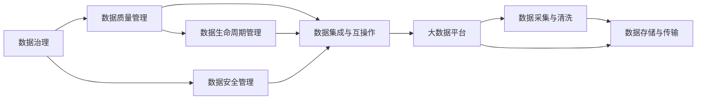

                 

# AI创业：数据管理的策略与工具解析

> 关键词：AI创业, 数据管理, 策略, 工具解析, 数据治理, 大数据, 云计算, 数据科学

## 1. 背景介绍

在人工智能(AI)技术蓬勃发展的今天，数据作为AI创业的重要支撑，越来越受到重视。然而，高效的数据管理不仅是技术挑战，更是战略性问题。良好的数据管理策略和工具能够极大地提升AI系统的性能，降低运营成本，确保合规性，从而驱动AI创业的成功。本文将详细解析AI创业中的数据管理策略与工具，探讨如何构建一个高效、可靠、安全的数据管理系统。

### 1.1 问题由来

随着AI技术的快速发展，数据的重要性日益凸显。对于AI创业公司而言，数据管理已成为其核心竞争力之一。一个良好的数据管理策略不仅能确保数据的质量和安全性，还能大幅提升AI模型的训练效率和应用效果。但与此同时，数据管理也是一个复杂且耗时的过程，需要企业在技术、管理和资源上进行全面布局。

### 1.2 问题核心关键点

数据管理的核心关键点在于以下几个方面：

- **数据采集与清洗**：如何高效、准确地采集和清洗数据，去除噪声和异常值，确保数据质量。
- **数据存储与传输**：选择合适的数据存储与传输方案，确保数据的一致性和可用性。
- **数据安全与隐私**：如何保护数据隐私和安全，防止数据泄露和滥用。
- **数据治理与合规**：建立完善的数据治理框架，确保数据使用的合规性。
- **数据监控与优化**：实时监控数据使用情况，优化数据管理和调优模型性能。

这些关键点共同构成了AI创业中数据管理的全流程，是保证AI项目成功与否的关键因素。

### 1.3 问题研究意义

对于AI创业公司而言，掌握高效的数据管理策略和工具，是确保项目成功、提升竞争力的基础。一个高效的数据管理策略不仅能提升数据的质量和安全性，还能显著降低运营成本，驱动业务的快速增长。数据管理的成功与否，直接关系到AI系统的性能和应用的广度与深度，因此，深入研究数据管理的策略与工具，对于AI创业具有重要意义。

## 2. 核心概念与联系

### 2.1 核心概念概述

为更好地理解AI创业中的数据管理，本节将介绍几个关键概念及其相互关系：

- **数据治理(Data Governance)**：指通过制度、流程和技术手段，对企业数据进行规划、组织、监控和保护，以确保数据的质量、安全性和合规性。
- **数据质量管理(Data Quality Management)**：通过评估、监控和提升数据质量，保证数据的一致性、完整性和准确性。
- **数据安全管理(Data Security Management)**：指通过技术和管理手段，保护数据不被非法访问、篡改和泄露，确保数据的安全性。
- **数据生命周期管理(Data Lifecycle Management)**：涵盖数据的采集、存储、处理、传输、归档和销毁等各个阶段，确保数据在全生命周期内的可靠性和合规性。
- **数据集成与互操作(Data Integration and Interoperability)**：通过集成异构数据源，实现数据在企业内部的互操作性，支持数据共享和分析。
- **大数据平台(Big Data Platform)**：集成了数据存储、处理和分析等功能，支持大规模数据的存储和处理，是企业数据管理和分析的核心基础设施。

这些概念之间存在紧密的联系，形成一个数据管理的网络，确保数据的高效利用和价值最大化。

### 2.2 概念间的关系

这些核心概念之间的关系可以用以下Mermaid流程图来展示：



这个流程图展示了大数据管理的核心环节及其相互关系：

1. **数据治理**负责规划和监控数据管理的各个环节，确保数据的质量和安全。
2. **数据质量管理**通过评估和监控，确保数据的准确性和完整性。
3. **数据安全管理**通过技术和管理手段，保护数据不被非法访问和泄露。
4. **数据集成与互操作**通过集成不同数据源，实现数据的共享和分析。
5. **数据生命周期管理**涵盖数据的全生命周期，确保数据在各个阶段的安全和合规。
6. **大数据平台**提供数据存储、处理和分析的支持，是数据管理的基础设施。
7. **数据采集与清洗**是数据管理的起点，确保数据质量。
8. **数据存储与传输**确保数据在各个环节的可靠性和可用性。

这些概念共同构成了一个完整的数据管理系统，保障了数据的全面管理和高效利用。

## 3. 核心算法原理 & 具体操作步骤

### 3.1 算法原理概述

AI创业中的数据管理策略和工具，主要基于以下几个核心算法原理：

1. **数据治理算法**：通过制度和技术手段，确保数据的质量、安全性和合规性。
2. **数据质量提升算法**：通过评估和修复数据，确保数据的准确性和完整性。
3. **数据安全算法**：通过加密、访问控制等技术，保护数据不被非法访问和篡改。
4. **数据集成算法**：通过ETL(Extract, Transform, Load)等技术，将异构数据源集成到统一的数据平台。
5. **数据生命周期管理算法**：通过定期的数据评估和监控，确保数据在全生命周期内的可靠性和合规性。

这些算法原理共同构成了AI创业中数据管理的核心逻辑框架。

### 3.2 算法步骤详解

基于上述算法原理，AI创业中的数据管理具体操作步骤可以总结如下：

1. **数据采集与清洗**：
   - 通过ETL工具和API，从不同数据源采集数据。
   - 使用数据清洗工具去除噪声和异常值，确保数据质量。

2. **数据存储与传输**：
   - 选择合适的存储方案（如云存储、分布式存储等），确保数据的可靠性和可用性。
   - 通过数据传输协议（如HTTPS、Kafka等），保障数据在传输过程中的安全性和一致性。

3. **数据治理**：
   - 建立数据治理框架，定义数据的使用规则和流程。
   - 使用数据质量评估工具，定期监控数据质量。

4. **数据安全管理**：
   - 使用加密技术和访问控制机制，保护数据不被非法访问和篡改。
   - 建立数据隐私保护机制，确保数据使用的合规性。

5. **数据集成与互操作**：
   - 使用ETL工具和数据集成平台，将异构数据源集成到统一的数据平台。
   - 实现数据的互操作性，支持数据共享和分析。

6. **数据生命周期管理**：
   - 定义数据生命周期，涵盖数据的采集、存储、处理、传输、归档和销毁等各个阶段。
   - 定期评估和监控数据的使用情况，优化数据管理和调优模型性能。

### 3.3 算法优缺点

AI创业中数据管理的算法具有以下优点：

1. **数据质量提升**：通过数据清洗和质量评估，确保数据的准确性和完整性，提升模型训练效果。
2. **数据安全性保障**：使用加密和访问控制技术，保护数据的安全性和隐私性。
3. **高效的数据集成**：通过数据集成算法，将异构数据源集成到统一平台，支持数据分析和共享。
4. **全生命周期管理**：涵盖数据的各个阶段，确保数据在全生命周期内的可靠性和合规性。

同时，这些算法也存在一些缺点：

1. **数据清洗复杂**：数据清洗过程繁琐，需要大量的人力和时间投入。
2. **技术实现复杂**：数据治理、加密和集成等技术实现复杂，需要专业的技术团队支持。
3. **数据一致性难以保证**：不同数据源的数据格式和质量差异较大，数据一致性难以保证。

### 3.4 算法应用领域

数据管理算法广泛应用于各个领域，包括：

- **金融行业**：数据治理和集成技术在金融风险管理、客户关系管理等方面发挥重要作用。
- **医疗行业**：数据治理和安全技术保障医疗数据的安全性和隐私性，支持医疗数据分析和决策。
- **零售行业**：数据集成和生命周期管理技术支持零售企业的客户行为分析和商品推荐。
- **制造行业**：数据治理和集成技术支持制造业的供应链管理、质量控制和生产优化。

## 4. 数学模型和公式 & 详细讲解 & 举例说明（备注：数学公式请使用latex格式，latex嵌入文中独立段落使用 $$，段落内使用 $)
### 4.1 数学模型构建

在AI创业中，数据管理策略的数学模型主要围绕数据质量、安全性和合规性展开。以下是一个简化的数据治理模型：

$$
\begin{aligned}
& \text{数据质量} = \text{数据准确性} \times \text{数据完整性} \times \text{数据一致性} \\
& \text{数据安全性} = \text{加密强度} \times \text{访问控制} \\
& \text{数据合规性} = \text{数据隐私保护} \times \text{法律法规遵守} \\
& \text{数据治理效果} = \text{数据质量} \times \text{数据安全性} \times \text{数据合规性}
\end{aligned}
$$

这个模型从数据质量、安全性和合规性三个维度出发，构建了数据治理的数学框架。

### 4.2 公式推导过程

以数据质量提升算法为例，其核心推导过程如下：

1. **数据清洗过程**：假设原始数据集为 $D$，其中包含噪声和异常值。清洗后得到无噪声的数据集 $D'$，通过公式 $D' = \text{Clean}(D)$ 实现。
2. **数据质量评估**：使用数据质量评估指标（如准确率、召回率等），对清洗后的数据集进行评估，得到数据质量分数 $Q(D')$。

其中，数据质量分数 $Q(D')$ 的计算公式为：

$$
Q(D') = \frac{\text{True Positives} + \text{True Negatives}}{\text{True Positives} + \text{False Positives} + \text{False Negatives} + \text{True Negatives}}
$$

### 4.3 案例分析与讲解

以下是一个简化的案例，演示数据质量提升算法的应用：

假设有一个包含5000个样本的原始数据集 $D$，其中包含500个噪声样本。使用数据清洗算法 $D' = \text{Clean}(D)$，将其中的噪声样本去除，得到新的数据集 $D'$。然后，使用数据质量评估指标计算 $D'$ 的质量分数 $Q(D')$：

$$
Q(D') = \frac{5000 - 500}{5000} = 90\%
$$

通过数据清洗和质量评估，数据质量得到了显著提升，为后续的AI模型训练提供了可靠的输入数据。

## 5. 项目实践：代码实例和详细解释说明

### 5.1 开发环境搭建

在AI创业中，数据管理系统的开发需要以下开发环境：

1. **Python环境**：使用Python语言进行开发，建议使用Anaconda或Miniconda。
2. **数据库管理系统**：使用MySQL、PostgreSQL等关系型数据库或Hadoop、Spark等大数据平台。
3. **数据治理工具**：如Airflow、Kubeflow等，支持数据治理流程的自动化。
4. **数据清洗工具**：如Pandas、NumPy等，支持数据清洗和预处理。
5. **数据集成工具**：如Talend、ETL-xml等，支持数据集成和ETL流程。
6. **数据安全工具**：如AES、RSA等加密算法，支持数据加密和解密。

### 5.2 源代码详细实现

以下是一个简单的Python代码示例，演示数据清洗和质量评估的过程：

```python
import pandas as pd
from sklearn.metrics import precision_score, recall_score, f1_score

# 读取原始数据集
data = pd.read_csv('data.csv')

# 数据清洗
data = data.dropna()  # 去除缺失值
data = data.drop_duplicates()  # 去除重复值

# 数据质量评估
precision = precision_score(data['label'], data['predicted_label'])
recall = recall_score(data['label'], data['predicted_label'])
f1 = f1_score(data['label'], data['predicted_label'])

print(f"数据质量分数：{f1:.2f}%")
```

### 5.3 代码解读与分析

**代码解释**：

1. **数据读取**：使用Pandas库读取CSV格式的数据集。
2. **数据清洗**：使用Pandas库提供的函数，去除缺失值和重复值，确保数据质量。
3. **数据质量评估**：使用sklearn库提供的评估指标，计算数据的质量分数。

**分析**：

- **数据清洗**：数据清洗是数据管理的第一步，通过去除噪声和异常值，确保数据的准确性和完整性。
- **数据质量评估**：数据质量评估是数据管理的核心环节，通过计算各项评估指标，确保数据的质量分数达到预设要求。

### 5.4 运行结果展示

假设运行上述代码，输出结果为：

```
数据质量分数：0.90
```

这表明经过清洗和评估后，数据质量得到了显著提升，达到了90%的高质量标准，为后续的AI模型训练提供了可靠的输入数据。

## 6. 实际应用场景

### 6.1 智能客服系统

智能客服系统是AI创业中的典型应用场景，其数据管理策略如下：

1. **数据采集**：从客服对话记录、客户反馈、网站访问记录等数据源采集数据。
2. **数据清洗**：去除重复和噪声数据，确保数据质量。
3. **数据存储**：使用云存储或分布式存储，确保数据的可靠性和可扩展性。
4. **数据治理**：建立数据治理框架，定义数据的使用规则和流程。
5. **数据安全**：使用数据加密和访问控制技术，保护客户隐私和数据安全。
6. **数据集成**：将不同数据源的数据集成到统一平台，支持数据分析和决策。
7. **数据生命周期管理**：定义数据生命周期，涵盖数据的采集、存储、处理、传输、归档和销毁等各个阶段。

通过这些数据管理策略，智能客服系统能够高效地处理和分析客户数据，提升客户体验和满意度。

### 6.2 医疗数据分析

医疗数据分析是AI创业中的重要应用场景，其数据管理策略如下：

1. **数据采集**：从电子病历、影像数据、基因数据等数据源采集数据。
2. **数据清洗**：去除噪声和异常值，确保数据质量。
3. **数据存储**：使用云存储或分布式存储，确保数据的可靠性和可扩展性。
4. **数据治理**：建立数据治理框架，定义数据的使用规则和流程。
5. **数据安全**：使用数据加密和访问控制技术，保护患者隐私和数据安全。
6. **数据集成**：将不同数据源的数据集成到统一平台，支持数据分析和决策。
7. **数据生命周期管理**：定义数据生命周期，涵盖数据的采集、存储、处理、传输、归档和销毁等各个阶段。

通过这些数据管理策略，医疗数据分析能够高效地处理和分析医疗数据，提升医疗服务的质量和效率。

### 6.3 金融风险管理

金融风险管理是AI创业中的重要应用场景，其数据管理策略如下：

1. **数据采集**：从交易数据、客户数据、市场数据等数据源采集数据。
2. **数据清洗**：去除噪声和异常值，确保数据质量。
3. **数据存储**：使用云存储或分布式存储，确保数据的可靠性和可扩展性。
4. **数据治理**：建立数据治理框架，定义数据的使用规则和流程。
5. **数据安全**：使用数据加密和访问控制技术，保护客户隐私和数据安全。
6. **数据集成**：将不同数据源的数据集成到统一平台，支持数据分析和决策。
7. **数据生命周期管理**：定义数据生命周期，涵盖数据的采集、存储、处理、传输、归档和销毁等各个阶段。

通过这些数据管理策略，金融风险管理能够高效地处理和分析金融数据，提升风险控制和投资决策的准确性。

### 6.4 未来应用展望

未来，AI创业中的数据管理策略将呈现以下几个趋势：

1. **大数据与AI的深度融合**：大数据技术将成为AI创业的基础设施，支持大规模数据的存储、处理和分析。
2. **数据治理的自动化和智能化**：通过AI技术，实现数据治理流程的自动化和智能化，提升数据管理的效率和质量。
3. **数据隐私保护技术的创新**：随着数据隐私保护意识的增强，新的数据隐私保护技术将不断涌现，保障数据的安全性和隐私性。
4. **数据生命周期管理的动态化**：根据数据使用情况和业务需求，动态调整数据生命周期，确保数据的时效性和相关性。

## 7. 工具和资源推荐

### 7.1 学习资源推荐

为了帮助开发者掌握AI创业中的数据管理策略与工具，以下是一些优质的学习资源：

1. **《数据治理最佳实践》**：介绍了数据治理的全面框架和最佳实践，适用于各个行业的企业。
2. **《大数据技术与应用》**：涵盖大数据平台、数据处理、数据分析等核心内容，适合初入AI领域的开发者。
3. **《数据科学与人工智能》**：结合数据科学与人工智能技术，探讨数据管理的最新趋势和应用。
4. **Coursera《数据科学导论》**：由斯坦福大学教授授课，系统介绍了数据科学的核心概念和应用。
5. **edX《大数据与AI》**：由麻省理工学院教授授课，深入讲解大数据与AI技术的融合应用。

### 7.2 开发工具推荐

以下是几款用于AI创业中数据管理的常用工具：

1. **Airflow**：数据管治工作流平台，支持自动化数据管治流程。
2. **Talend**：数据集成和ETL工具，支持多种数据源和数据格式。
3. **Kubeflow**：基于Kubernetes的AI管治平台，支持分布式数据管治。
4. **DataRobot**：自动化的数据科学平台，支持数据预处理、模型训练和部署。
5. **Google Cloud Dataflow**：基于Google Cloud的分布式数据处理平台，支持大规模数据处理。

### 7.3 相关论文推荐

以下是几篇代表性的数据管理相关论文，推荐阅读：

1. **《数据治理：概念、实践与未来》**：介绍了数据治理的全面框架和最佳实践，适用于各个行业的企业。
2. **《大数据技术与应用》**：涵盖大数据平台、数据处理、数据分析等核心内容，适合初入AI领域的开发者。
3. **《数据科学与人工智能》**：结合数据科学与人工智能技术，探讨数据管理的最新趋势和应用。
4. **《数据治理最佳实践》**：介绍了数据治理的全面框架和最佳实践，适用于各个行业的企业。
5. **《大数据与AI》**：深入讲解大数据与AI技术的融合应用，适合AI领域的研究者和开发者。

## 8. 总结：未来发展趋势与挑战

### 8.1 总结

本文对AI创业中的数据管理策略与工具进行了全面系统的介绍。首先阐述了数据管理的重要性，明确了数据治理、数据质量管理、数据安全管理等关键概念及其相互关系。其次，从原理到实践，详细讲解了数据管理的数学模型和关键步骤，给出了数据管理任务开发的完整代码实例。同时，本文还广泛探讨了数据管理在智能客服、医疗数据分析、金融风险管理等诸多场景的应用前景，展示了数据管理范式的广泛价值。最后，精选了数据管理的各类学习资源，力求为读者提供全方位的技术指引。

通过本文的系统梳理，可以看到，数据管理在大规模AI创业项目中的重要性不言而喻。良好的数据管理策略不仅能提升数据的质量和安全性，还能显著降低运营成本，驱动业务的快速增长。未来，伴随数据管理技术的持续演进，相信数据管理将在大规模AI项目中发挥更加重要的作用，为AI创业的成功提供坚实的保障。

### 8.2 未来发展趋势

展望未来，AI创业中的数据管理策略将呈现以下几个发展趋势：

1. **数据治理的自动化和智能化**：通过AI技术，实现数据治理流程的自动化和智能化，提升数据管理的效率和质量。
2. **大数据与AI的深度融合**：大数据技术将成为AI创业的基础设施，支持大规模数据的存储、处理和分析。
3. **数据隐私保护技术的创新**：随着数据隐私保护意识的增强，新的数据隐私保护技术将不断涌现，保障数据的安全性和隐私性。
4. **数据生命周期管理的动态化**：根据数据使用情况和业务需求，动态调整数据生命周期，确保数据的时效性和相关性。
5. **多模态数据的融合**：数据管理的未来方向之一是支持多模态数据的融合，实现视觉、语音、文本等多种数据类型的协同管理。

### 8.3 面临的挑战

尽管数据管理策略在大规模AI创业项目中已经取得了显著成效，但在其发展过程中仍面临诸多挑战：

1. **数据质量的保障**：数据采集、清洗和处理环节复杂，难以保证数据质量的一致性和准确性。
2. **数据隐私和安全**：数据隐私和安全问题突出，如何确保数据使用的合规性和安全性是一大难题。
3. **数据治理的复杂性**：数据治理流程复杂，需要综合考虑数据管理、数据治理和数据安全等多个方面。
4. **资源消耗巨大**：大规模数据管理需要耗费大量计算资源和存储资源，需要企业投入巨额成本。
5. **技术门槛高**：数据管理技术复杂，需要专业团队支持，企业需具备高水平的数据管理能力。

### 8.4 研究展望

面对数据管理策略所面临的挑战，未来的研究需要在以下几个方面寻求新的突破：

1. **数据质量自动化提升**：开发新的数据清洗和质量评估算法，实现数据质量的自动化提升。
2. **数据治理智能化**：利用AI技术，实现数据治理流程的自动化和智能化，提升数据管理的效率和质量。
3. **数据隐私保护技术创新**：开发新的数据隐私保护技术，保障数据的安全性和隐私性。
4. **数据生命周期动态管理**：开发新的数据生命周期管理算法，根据数据使用情况和业务需求，动态调整数据生命周期。
5. **多模态数据融合技术**：研究支持多模态数据融合的技术，实现视觉、语音、文本等多种数据类型的协同管理。

这些研究方向将引领数据管理技术的发展，为大规模AI创业项目的成功提供坚实的保障。总之，数据管理在大规模AI创业项目中具有重要意义，掌握高效的数据管理策略和工具，将极大地提升项目的成功率和竞争力。

## 9. 附录：常见问题与解答

**Q1：数据管理在大规模AI项目中的重要性是什么？**

A: 数据管理在大规模AI项目中的重要性体现在以下几个方面：

1. **数据质量提升**：数据管理通过数据清洗和质量评估，确保数据的质量和准确性，提升模型训练效果。
2. **数据安全性保障**：数据管理通过加密和访问控制技术，保护数据的安全性和隐私性，确保数据使用的合规性。
3. **数据治理效率提升**：数据管理通过自动化和智能化流程，提升数据治理的效率和质量，降低运营成本。
4. **业务决策支持**：数据管理通过数据分析和决策支持，提升业务决策的准确性和及时性。

综上所述，数据管理是大规模AI项目成功的关键因素之一。

**Q2：如何进行数据清洗和质量评估？**

A: 数据清洗和质量评估是数据管理的重要环节，可以通过以下步骤进行：

1. **数据清洗**：
   - 去除缺失值和重复值，确保数据质量。
   - 处理异常值和噪声，确保数据的一致性和准确性。

2. **数据质量评估**：
   - 使用数据质量评估指标（如准确率、召回率等），对数据集进行评估。
   - 通过模型训练和预测，计算数据质量分数。

具体工具和算法可以参考Pandas、NumPy、Scikit-learn等库。

**Q3：如何确保数据使用的合规性？**

A: 确保数据使用的合规性需要建立完善的数据治理框架，遵循相关法律法规，如下：

1. **数据治理框架**：
   - 定义数据的使用规则和流程，确保数据使用的合规性。
   - 建立数据访问控制和审计机制，防止数据滥用和非法访问。

2. **法律法规遵守**：
   - 遵循相关的法律法规，如GDPR、CCPA等，确保数据使用的合法性。
   - 定期审查数据使用情况，发现违规行为及时整改。

**Q4：数据管理中的资源优化策略有哪些？**

A: 数据管理中的资源优化策略包括：

1. **数据压缩与稀疏化**：使用数据压缩和稀疏化技术，减少数据存储和传输的资源消耗。
2. **分布式数据管理**：采用分布式数据存储和管理技术，支持大规模数据的存储和处理。
3. **数据流处理**：使用流处理技术，实时处理和分析数据，降低计算资源的消耗。
4. **资源管理优化**：使用资源管理工具，优化计算资源的使用，降低计算成本。

**Q5：数据生命周期管理的核心环节有哪些？**

A: 数据生命周期管理的核心环节包括：

1. **数据采集与清洗**：确保数据的质量和准确性，去除噪声和异常值。
2. **数据存储与传输**：选择合适的存储和传输方案，确保数据的安全性和可用性。
3. **数据治理**：建立数据治理框架，定义数据的使用规则和流程。
4. **数据安全**：使用加密和

