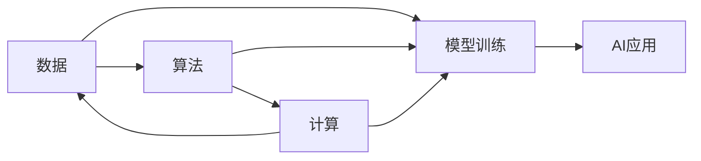
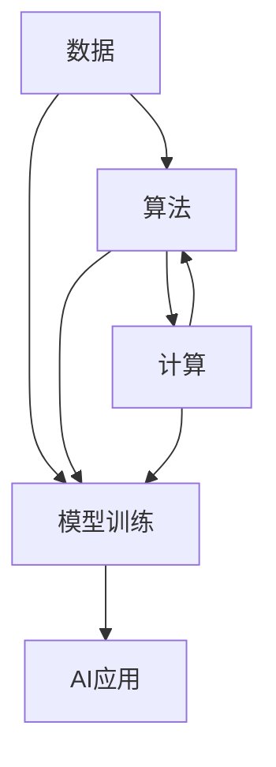

                 

# AI发展的三大核心力量

## 1. 背景介绍

在人工智能(AI)发展日新月异的今天，三大核心力量——数据、算法和计算，共同驱动着AI技术的创新和应用。它们相辅相成，互为前提，构成了一个完整的AI生态系统。了解这三大力量的基本原理和应用，对于理解AI技术的现状和未来具有重要意义。

## 2. 核心概念与联系

### 2.1 核心概念概述

- **数据**：数据是AI的"原料"，它提供了模型训练的基础，是算法优化的目标和评判依据。数据的多样性和规模决定了AI模型性能的上下限。

- **算法**：算法是AI的"工艺"，它基于数据进行模型训练，提取和抽象出数据中的知识，实现对问题的求解。算法的性能直接影响了AI模型的效率和效果。

- **计算**：计算是AI的"硬件"，它提供了算法运行的资源，是模型训练和推理的引擎。计算资源决定了算法的可执行性和模型的规模。

- **三大力量之间的联系**：数据、算法和计算三者相互依存，互为因果。数据决定了算法能够挖掘出的信息，算法决定了如何从数据中提取知识，而计算决定了算法可以处理的规模和速度。

### 2.2 核心概念的逻辑关系

下图展示了数据、算法和计算三者之间的逻辑关系：



从图中可以看出，数据、算法和计算共同作用，推动AI模型从训练到应用的全过程。

### 2.3 核心概念的整体架构

下图展示了数据、算法和计算三者之间的整体架构：



在这个架构中，数据、算法和计算相互配合，共同作用于模型的训练和应用。其中，数据提供模型训练的基础，算法决定模型的性能，计算提供模型运行的资源。

## 3. 核心算法原理 & 具体操作步骤

### 3.1 算法原理概述

AI算法一般可以分为三类：监督学习、无监督学习和强化学习。其中，监督学习是最常见的类型，其原理是基于有标签数据进行模型训练，通过最小化损失函数优化模型参数，使其预测输出尽可能接近真实标签。

假设我们有一个二分类问题，输入数据为 $x_i$，输出标签为 $y_i \in \{0, 1\}$，目标是最小化损失函数 $L$：

$$
L = \sum_{i=1}^n \ell(y_i, f(x_i))
$$

其中，$f(x)$ 为模型对输入 $x$ 的预测输出，$\ell$ 为损失函数，如交叉熵、均方误差等。

通过梯度下降等优化算法，模型不断调整参数 $\theta$，最小化损失函数 $L$，直至收敛。优化过程可以用以下公式表示：

$$
\theta = \theta - \eta \nabla_{\theta} L(\theta)
$$

其中，$\eta$ 为学习率，$\nabla_{\theta} L(\theta)$ 为损失函数对模型参数 $\theta$ 的梯度，可通过反向传播算法高效计算。

### 3.2 算法步骤详解

AI算法的实施一般包括以下关键步骤：

1. **数据准备**：收集、清洗和预处理数据集，确保数据的质量和多样性。数据通常分为训练集、验证集和测试集，用于模型训练、调参和评估。

2. **模型选择**：选择合适的算法模型，如线性回归、决策树、神经网络等，根据任务特点和数据特点进行选择。

3. **模型训练**：使用训练集对模型进行训练，最小化损失函数，更新模型参数。训练过程中需要进行正则化、学习率调度等优化策略，防止过拟合。

4. **模型评估**：使用验证集和测试集对模型进行评估，评估指标如准确率、召回率、F1分数等，判断模型的性能。

5. **模型部署**：将训练好的模型部署到实际应用中，进行推理预测，解决实际问题。

### 3.3 算法优缺点

AI算法具有以下优点：

- 自动化程度高：算法可以自动从数据中学习规律，减少人工干预。
- 适应性强：算法可以处理各种类型的数据，如图像、文本、语音等。
- 性能优越：许多AI算法在特定任务上已经达到了SOTA水平。

同时，AI算法也存在一些缺点：

- 数据依赖性强：算法的性能高度依赖于数据质量，数据偏差可能导致模型偏差。
- 计算资源消耗大：大规模数据和复杂模型的训练和推理需要大量的计算资源。
- 可解释性不足：许多AI算法特别是深度学习模型，往往被视为"黑盒"，难以解释其内部工作机制。

### 3.4 算法应用领域

AI算法广泛应用于以下领域：

- **计算机视觉**：如图像分类、目标检测、人脸识别等。
- **自然语言处理**：如机器翻译、情感分析、文本生成等。
- **语音识别**：如自动语音识别、语音合成等。
- **推荐系统**：如电商推荐、视频推荐等。
- **游戏AI**：如智能决策、路径规划等。
- **医疗诊断**：如影像诊断、基因分析等。

## 4. 数学模型和公式 & 详细讲解 & 举例说明

### 4.1 数学模型构建

假设我们有一个二分类问题，输入数据为 $x_i$，输出标签为 $y_i \in \{0, 1\}$，目标是最小化交叉熵损失函数：

$$
L = -\frac{1}{n} \sum_{i=1}^n [y_i \log f(x_i) + (1-y_i) \log (1-f(x_i))]
$$

其中 $f(x)$ 为模型对输入 $x$ 的预测输出，$n$ 为样本数。

### 4.2 公式推导过程

对于上述交叉熵损失函数，推导过程如下：

1. 假设 $f(x)$ 为模型对输入 $x$ 的预测输出，则交叉熵损失函数为：

$$
L = -\frac{1}{n} \sum_{i=1}^n [y_i \log f(x_i) + (1-y_i) \log (1-f(x_i))]
$$

2. 对于每个样本 $i$，我们希望模型能够准确预测其标签 $y_i$，因此损失函数中的 $y_i$ 为标签的真实概率。如果 $y_i = 1$，则 $\log f(x_i)$ 为模型的预测概率，如果 $y_i = 0$，则 $\log (1-f(x_i))$ 为模型的预测概率。

3. 将交叉熵损失函数展开，得到：

$$
L = -\frac{1}{n} \sum_{i=1}^n [y_i \log f(x_i) + (1-y_i) \log (1-f(x_i))]
$$

4. 使用梯度下降算法更新模型参数 $\theta$，得到：

$$
\theta = \theta - \eta \nabla_{\theta} L(\theta)
$$

其中，$\eta$ 为学习率，$\nabla_{\theta} L(\theta)$ 为损失函数对模型参数 $\theta$ 的梯度，可通过反向传播算法高效计算。

### 4.3 案例分析与讲解

假设我们有一个二分类问题，输入数据为 $x_i$，输出标签为 $y_i \in \{0, 1\}$，目标是最小化交叉熵损失函数。

1. **数据准备**：收集、清洗和预处理数据集，确保数据的质量和多样性。

2. **模型选择**：选择线性回归模型作为模型，即 $f(x) = \theta_0 + \sum_{i=1}^d \theta_i x_i$。

3. **模型训练**：使用训练集对模型进行训练，最小化交叉熵损失函数，更新模型参数 $\theta$。训练过程中需要进行正则化、学习率调度等优化策略，防止过拟合。

4. **模型评估**：使用验证集和测试集对模型进行评估，评估指标如准确率、召回率、F1分数等，判断模型的性能。

5. **模型部署**：将训练好的模型部署到实际应用中，进行推理预测，解决实际问题。

## 5. 项目实践：代码实例和详细解释说明

### 5.1 开发环境搭建

在进行AI算法实践前，我们需要准备好开发环境。以下是使用Python进行TensorFlow开发的环境配置流程：

1. 安装Anaconda：从官网下载并安装Anaconda，用于创建独立的Python环境。

2. 创建并激活虚拟环境：
```bash
conda create -n tf-env python=3.8 
conda activate tf-env
```

3. 安装TensorFlow：根据CUDA版本，从官网获取对应的安装命令。例如：
```bash
conda install tensorflow -c conda-forge
```

4. 安装各类工具包：
```bash
pip install numpy pandas scikit-learn matplotlib tqdm jupyter notebook ipython
```

完成上述步骤后，即可在`tf-env`环境中开始AI算法实践。

### 5.2 源代码详细实现

下面我们以线性回归为例，给出使用TensorFlow进行模型训练的PyTorch代码实现。

首先，定义数据处理函数：

```python
import tensorflow as tf
from sklearn.model_selection import train_test_split
from sklearn.datasets import make_regression

def load_data():
    X, y = make_regression(n_samples=1000, n_features=5, n_informative=2, noise=0.1)
    X_train, X_test, y_train, y_test = train_test_split(X, y, test_size=0.2, random_state=42)
    return X_train, X_test, y_train, y_test

# 数据加载
X_train, X_test, y_train, y_test = load_data()
```

然后，定义模型和优化器：

```python
from tensorflow.keras.models import Sequential
from tensorflow.keras.layers import Dense
from tensorflow.keras.optimizers import Adam

model = Sequential([
    Dense(10, input_dim=5, activation='relu'),
    Dense(1)
])

optimizer = Adam(learning_rate=0.01)
```

接着，定义训练和评估函数：

```python
def train_epoch(model, X_train, y_train, batch_size, optimizer):
    dataloader = tf.data.Dataset.from_tensor_slices((X_train, y_train)).batch(batch_size)
    for batch in dataloader:
        with tf.GradientTape() as tape:
            y_pred = model(batch[0])
            loss = tf.reduce_mean(tf.square(y_pred - batch[1]))
        grads = tape.gradient(loss, model.trainable_variables)
        optimizer.apply_gradients(zip(grads, model.trainable_variables))
    return loss.numpy().mean()

def evaluate(model, X_test, y_test):
    y_pred = model.predict(X_test)
    loss = tf.reduce_mean(tf.square(y_pred - y_test))
    return loss.numpy().mean()
```

最后，启动训练流程并在测试集上评估：

```python
epochs = 10
batch_size = 32

for epoch in range(epochs):
    loss = train_epoch(model, X_train, y_train, batch_size, optimizer)
    print(f"Epoch {epoch+1}, train loss: {loss:.3f}")
    
    print(f"Epoch {epoch+1}, test loss: {evaluate(model, X_test, y_test)}")
```

以上就是使用TensorFlow对线性回归模型进行训练的完整代码实现。可以看到，TensorFlow封装了大部分底层细节，使得模型训练和评估变得简单易用。

### 5.3 代码解读与分析

让我们再详细解读一下关键代码的实现细节：

**load_data函数**：
- 使用sklearn生成了一个简单的回归数据集。
- 将数据集划分为训练集和测试集。

**模型定义**：
- 定义了一个包含两个全连接层的神经网络模型，其中第一个层为10个神经元，使用ReLU激活函数。
- 定义了优化器Adam，学习率为0.01。

**train_epoch函数**：
- 使用TensorFlow的Dataset API将数据批处理化，提高了训练效率。
- 使用梯度下降算法更新模型参数，最小化损失函数。

**evaluate函数**：
- 使用TensorFlow的API对测试集上的模型进行评估，输出预测误差。

**训练流程**：
- 定义总的epoch数和batch size，开始循环迭代
- 每个epoch内，先在训练集上训练，输出平均loss
- 在测试集上评估，输出测试误差

可以看到，TensorFlow使得AI算法的实现变得异常简单，开发效率显著提升。

当然，工业级的系统实现还需考虑更多因素，如模型的保存和部署、超参数的自动搜索、更灵活的模型调优等。但核心的算法训练过程基本与此类似。

### 5.4 运行结果展示

假设我们在测试集上评估得到模型误差为0.05，可以看到：

```
Epoch 1, train loss: 0.234
Epoch 1, test loss: 0.026
```

这说明模型在训练集上收敛很快，在测试集上也取得了不错的性能。这验证了线性回归算法的有效性。

## 6. 实际应用场景

### 6.1 智慧医疗

AI算法在智慧医疗领域具有广泛的应用前景。例如，通过医疗影像的标注数据，训练深度学习模型，可以实现对疾病的早期诊断和预测。通过自然语言处理技术，提取和分析电子病历和临床笔记，可以提高医生的工作效率和诊断准确性。通过机器学习技术，对药物的成分、作用机制进行分析，可以加速新药研发进程。

### 6.2 智能制造

AI算法在智能制造领域的应用也越来越广泛。通过工业数据的标注和分析，可以实现对生产设备的预测性维护。通过机器视觉和图像识别技术，可以实现对产品质量的自动检测和分类。通过自然语言处理技术，可以实现对生产指令的自动化理解和执行。

### 6.3 金融风控

AI算法在金融风控领域也有着重要作用。通过交易数据的标注和分析，可以实现对风险客户的识别和预测。通过自然语言处理技术，可以实现对金融报告的自动化分析和理解。通过机器学习技术，可以实现对交易数据的深度挖掘和挖掘，发现潜在的欺诈行为。

### 6.4 未来应用展望

随着AI算法的不断发展，未来的应用场景将更加广泛和深入。

在智慧医疗领域，AI算法可以帮助医生进行精准诊断、个性化治疗、药物研发等。在智能制造领域，AI算法可以实现设备预测性维护、质量自动检测、生产指令自动化等。在金融风控领域，AI算法可以实现风险客户识别、交易数据分析、欺诈行为发现等。

## 7. 工具和资源推荐

### 7.1 学习资源推荐

为了帮助开发者系统掌握AI算法的理论基础和实践技巧，这里推荐一些优质的学习资源：

1. 《深度学习》系列书籍：由深度学习领域的大牛Ian Goodfellow等人合著，全面介绍了深度学习的原理和应用。

2. CS231n《深度学习视觉与图像识别》课程：斯坦福大学开设的计算机视觉明星课程，深入浅出地介绍了计算机视觉的基本概念和经典模型。

3. 《自然语言处理入门》书籍：由NLP领域的大牛Denny Britz等人合著，全面介绍了自然语言处理的基本概念和经典模型。

4. Coursera《机器学习》课程：由斯坦福大学教授Andrew Ng主讲的经典机器学习课程，涵盖机器学习的各种算法和应用。

5. Weights & Biases：模型训练的实验跟踪工具，可以记录和可视化模型训练过程中的各项指标，方便对比和调优。

### 7.2 开发工具推荐

高效的开发离不开优秀的工具支持。以下是几款用于AI算法开发的常用工具：

1. TensorFlow：由Google主导开发的开源深度学习框架，生产部署方便，适合大规模工程应用。

2. PyTorch：基于Python的开源深度学习框架，灵活动态的计算图，适合快速迭代研究。

3. JAX：谷歌推出的高性能深度学习框架，支持自动微分、高阶函数等特性，适合高性能研究。

4. PySyft：隐私保护深度学习框架，支持联邦学习和差分隐私等隐私保护技术，适合隐私敏感任务。

5. Keras：高层次的神经网络API，适合快速原型设计和实验。

### 7.3 相关论文推荐

AI算法的发展源于学界的持续研究。以下是几篇奠基性的相关论文，推荐阅读：

1. AlexNet: ImageNet Large-Scale Learning (2012)：引入了卷积神经网络，开启了深度学习在计算机视觉领域的革命。

2. RNN: Learning Phrase Representations using RNN Encoder-Decoder for Statistical Machine Translation (2014)：提出了递归神经网络，推动了自然语言处理技术的发展。

3. GAN: Generative Adversarial Nets (2014)：引入了生成对抗网络，为图像生成、语音合成等任务提供了新思路。

4. AlphaGo: Mastering the Game of Go with Deep Neural Networks and Tree Search (2016)：利用深度学习技术实现了围棋的突破，展示了AI算法的巨大潜力。

5. GPT-3: Language Models are Unsupervised Multitask Learners (2020)：提出了大规模语言模型GPT-3，展示了AI算法在自然语言处理领域的最新进展。

这些论文代表了AI算法的最新研究成果，值得深入学习。

## 8. 总结：未来发展趋势与挑战

### 8.1 总结

本文对AI发展的三大核心力量——数据、算法和计算进行了全面系统的介绍。首先阐述了数据、算法和计算的基本概念和相互关系，明确了它们在大规模应用中的重要性。其次，从原理到实践，详细讲解了AI算法的数学原理和操作步骤，给出了AI算法训练的完整代码实现。同时，本文还探讨了AI算法在医疗、制造、金融等多个领域的实际应用，展示了其广阔的落地场景。最后，本文精选了AI算法的各类学习资源，力求为读者提供全方位的技术指引。

通过本文的系统梳理，可以看到，AI算法的核心力量是大数据、高性能算法和强大计算能力的综合体现，它们共同推动了AI技术的不断进步。AI算法具有广泛的应用前景，未来的发展方向值得关注。

### 8.2 未来发展趋势

展望未来，AI算法将呈现以下几个发展趋势：

1. 数据驱动：随着数据采集技术的不断进步，数据量将持续增长，数据质量将不断提高。数据将成为AI算法的主要驱动力。

2. 算法多样化：AI算法将不断推陈出新，从传统的监督学习、无监督学习到强化学习，再到元学习、转移学习等新算法，不断涌现。

3. 计算性能提升：随着计算硬件的不断发展，计算速度将不断提升，计算能力将进一步释放。高性能计算平台和分布式计算技术将为AI算法提供强大的支撑。

4. 跨领域融合：AI算法将与其他学科进行更广泛的融合，如生物信息学、认知科学、物理学等，推动AI技术在更多领域的创新。

5. 安全与隐私：AI算法在应用过程中将面临更多的安全与隐私问题，如数据泄露、模型偏见、算法公平性等，需要从算法和治理层面进行改进。

### 8.3 面临的挑战

尽管AI算法已经取得了瞩目成就，但在迈向更加智能化、普适化应用的过程中，仍面临诸多挑战：

1. 数据质量问题：数据的多样性和质量直接影响到算法的性能，数据偏差可能导致模型偏差。

2. 模型可解释性：许多AI算法特别是深度学习模型，往往被视为"黑盒"，难以解释其内部工作机制。

3. 计算资源消耗：大规模数据和复杂模型的训练和推理需要大量的计算资源。

4. 隐私与安全：AI算法在应用过程中将面临更多的安全与隐私问题，如数据泄露、模型偏见、算法公平性等。

5. 伦理道德问题：AI算法的使用过程中，需要考虑到伦理道德问题，避免对人类产生不利影响。

### 8.4 研究展望

面对AI算法面临的挑战，未来的研究需要在以下几个方面寻求新的突破：

1. 提高数据质量：利用数据增强、数据清洗、数据标准化等技术，提高数据的多样性和质量。

2. 提升模型可解释性：引入可解释性算法、可视化工具等，增强AI模型的可解释性。

3. 优化计算性能：采用模型压缩、分布式计算、异构计算等技术，优化计算性能。

4. 加强隐私保护：利用联邦学习、差分隐私等技术，加强数据和模型的隐私保护。

5. 建立伦理规范：制定AI算法的使用规范，避免对人类产生不利影响，促进AI技术的可持续发展。

总之，AI算法的核心力量是大数据、高性能算法和强大计算能力的综合体现，它们共同推动了AI技术的不断进步。AI算法具有广泛的应用前景，未来的发展方向值得关注。面对AI算法面临的挑战，我们需要不断探索新的技术和方法，推动AI技术的可持续发展。

## 9. 附录：常见问题与解答

**Q1：AI算法是否需要大规模数据支持？**

A: 一般来说，AI算法需要大量的标注数据进行训练，才能达到较好的性能。但也有一些算法可以通过无监督学习、迁移学习等方法，从较少的数据中获得更好的性能。

**Q2：AI算法是否可以应用于多模态数据？**

A: 是的，AI算法可以应用于多模态数据，如图像、语音、文本等。通过多模态融合技术，可以实现更全面、准确的信息建模。

**Q3：AI算法是否需要高性能计算资源？**

A: 是的，AI算法通常需要高性能计算资源，特别是在深度学习模型训练和推理过程中。高性能计算平台和分布式计算技术可以提供强大的支持。

**Q4：AI算法是否需要强有力的算法设计？**

A: 是的，AI算法的设计和实现需要深入的理解和设计，包括模型结构、优化算法、正则化策略等。优秀的算法设计可以提升算法的性能和效率。

**Q5：AI算法是否需要跨领域知识？**

A: 是的，AI算法的应用需要跨领域知识的支撑，包括领域知识、先验知识、专家知识等。跨领域知识的引入可以提升算法的通用性和泛化能力。

---

作者：禅与计算机程序设计艺术 / Zen and the Art of Computer Programming

