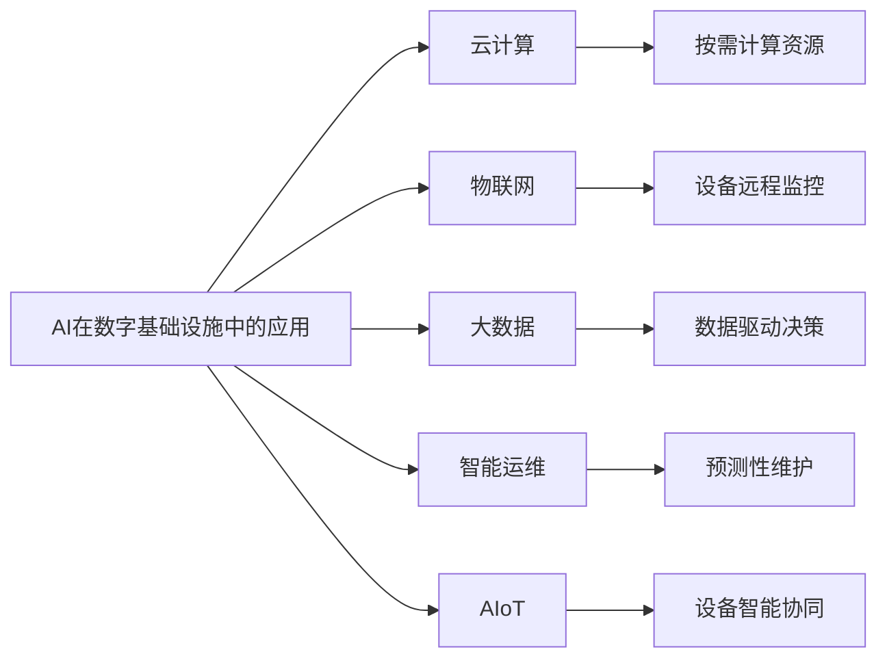
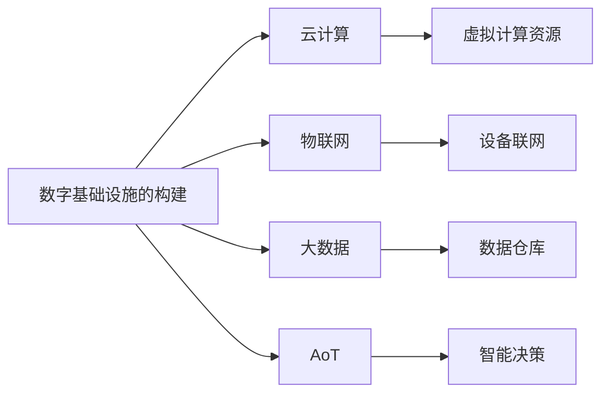
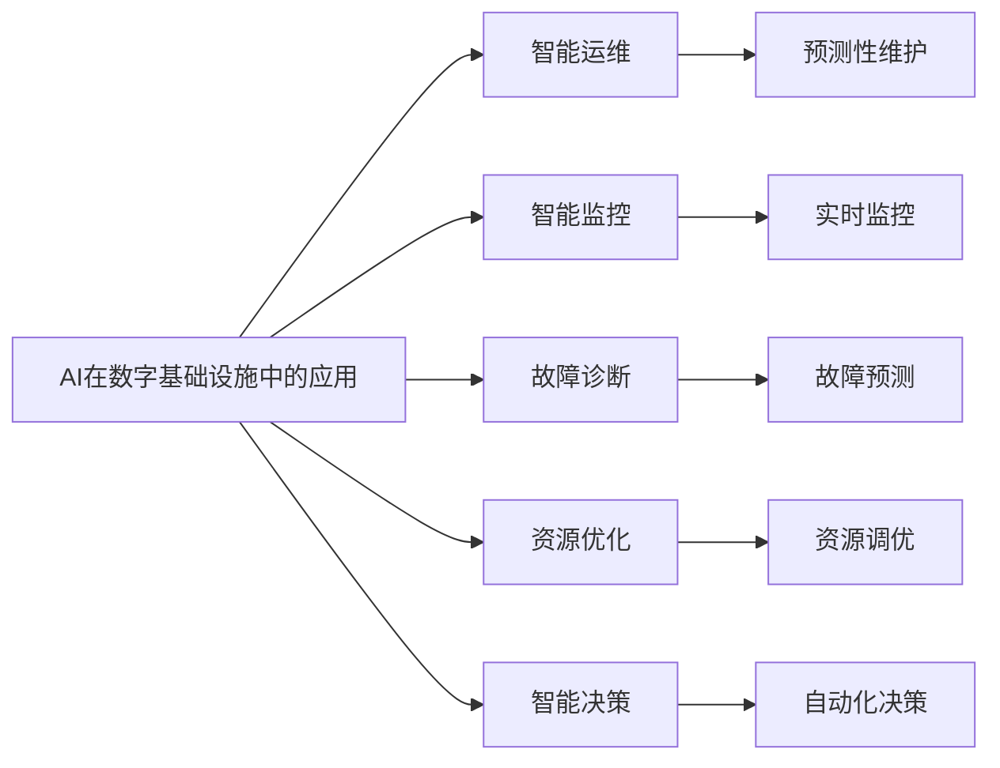
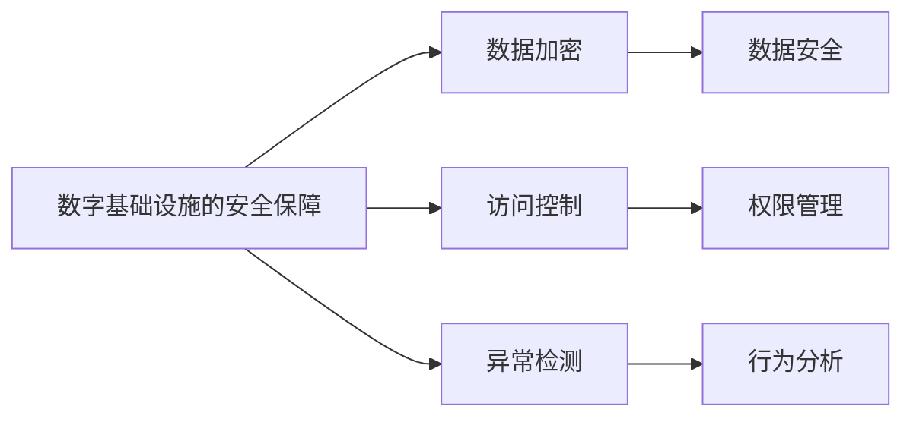
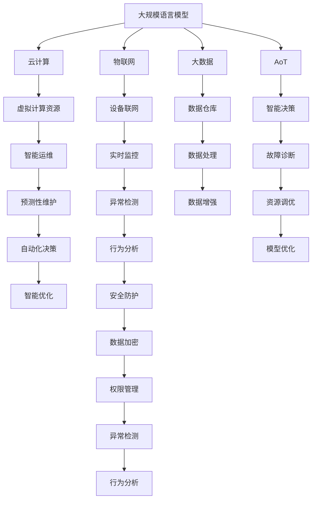

                 

# AI在数字基础设施中的实际应用

> 关键词：AI、数字基础设施、物联网、云计算、大数据、智能运维、AIoT

## 1. 背景介绍

### 1.1 问题由来
近年来，全球数字经济的蓬勃发展极大地推动了各行业的数字化转型。在此背景下，数字基础设施的建设成为支撑经济社会发展的重要基石。数字基础设施主要包括云计算、物联网(IoT)、大数据、AI等技术领域，其中AI在实现数字化基础设施智能化、高效化、自动化中发挥了关键作用。从智慧城市、智慧工厂，到智能运维、工业AI等，AI技术已在各行各业实现了广泛应用，大幅提升了生产效率和服务质量。

然而，AI技术在数字基础设施中的应用也面临诸多挑战，包括算法复杂度、数据质量、系统安全、应用成本等。如何通过AI技术实现数字基础设施的高效、可靠运行，同时保障其安全性、普适性，是当前技术研究和应用中亟需解决的关键问题。

### 1.2 问题核心关键点
AI在数字基础设施中的应用涉及算法、模型、系统、数据等多方面内容。其核心关键点主要包括：
1. 算法选择：根据不同应用场景选择合适的AI算法，如深度学习、强化学习、迁移学习等。
2. 模型优化：通过模型压缩、剪枝、量化等技术优化模型，减小模型体积和计算资源消耗。
3. 系统集成：将AI模型无缝集成到现有数字基础设施中，实现智能决策和自动化管理。
4. 数据处理：通过数据清洗、标注、增强等技术提高数据质量，支持AI模型的训练和应用。
5. 安全性保障：构建安全防护机制，防止AI系统被攻击和滥用。

本文聚焦于AI技术在数字基础设施中的实际应用，探讨AI技术如何赋能数字基础设施的建设与运营，以期为业界提供参考。

### 1.3 问题研究意义
AI在数字基础设施中的应用，不仅能大幅提升基础设施的智能化水平，还能带来显著的经济效益和社会效益：

1. 提高运行效率：AI技术能够实时监测基础设施的运行状态，预测设备故障，优化资源配置，提升运营效率。
2. 降低运营成本：AI系统的自动化运维和智能决策，减少了人工干预和错误，降低了基础设施的维护和运营成本。
3. 增强安全防护：AI技术通过数据分析和行为监测，能够及时发现并防御潜在的安全威胁，保障基础设施的安全稳定。
4. 实现个性化服务：通过AI模型分析用户行为和需求，能够提供更加个性化、精准的服务，提升用户体验。
5. 推动技术创新：AI技术的应用，推动了新型数字基础设施的研发和部署，促进了数字经济的创新发展。

综上所述，AI技术在数字基础设施中的应用不仅能够提升基础设施的智能化水平，还对经济社会的数字化转型具有重要意义。

## 2. 核心概念与联系

### 2.1 核心概念概述

为更好地理解AI在数字基础设施中的应用，本节将介绍几个密切相关的核心概念：

- AI在数字基础设施中的应用：将AI技术应用于数字基础设施中，实现智能决策、自动化运维、实时监控等功能，以提升基础设施的智能化和效率。
- 云计算（Cloud Computing）：通过互联网提供按需计算资源和服务，支持大规模数据处理和分布式计算，为AI在数字基础设施中的应用提供了技术支撑。
- 物联网（IoT）：通过连接物理设备，收集、传输和处理实时数据，实现基础设施的远程监控和管理。
- 大数据（Big Data）：涉及海量数据的采集、存储、处理和分析，支持AI模型训练和应用，提供数据驱动的决策支持。
- 智能运维（Smart Maintenance）：利用AI技术优化设备的运维策略，实现预测性维护和故障诊断，提升设备的使用寿命和可靠性。
- AIoT（AI与IoT融合）：将AI技术融入物联网系统，实现设备间的智能协同和自适应优化，提升系统的智能化水平。

这些核心概念之间存在紧密的联系，形成了AI在数字基础设施中的整体应用生态。以下是一个Mermaid流程图，展示这些概念之间的关系：



这个流程图展示了大规模语言模型在数字基础设施中的应用生态系统，包括云计算、物联网、大数据、智能运维和AIoT等多个关键概念。这些概念的协同作用，共同支撑了AI在数字基础设施中的高效应用。

### 2.2 概念间的关系

这些核心概念之间存在着紧密的联系，形成了AI在数字基础设施中的完整应用生态系统。下面我们通过几个Mermaid流程图来展示这些概念之间的关系。

#### 2.2.1 数字基础设施的构建过程



这个流程图展示了数字基础设施的构建过程。首先通过云计算资源构建虚拟环境，然后通过物联网技术实现设备联网，采集实时数据。接着，通过大数据技术对数据进行处理和分析，构建数据仓库。最后，通过AI技术进行智能决策和控制，实现数字基础设施的智能化。

#### 2.2.2 AI在数字基础设施中的应用场景



这个流程图展示了AI在数字基础设施中的主要应用场景。AI技术在数字基础设施中主要应用于智能运维、智能监控、故障诊断、资源优化和智能决策等方面，通过实时监控、预测性维护、故障诊断、资源调优和自动化决策，大幅提升了数字基础设施的智能化水平。

#### 2.2.3 数字基础设施的安全保障



这个流程图展示了数字基础设施的安全保障机制。通过数据加密、访问控制、异常检测等技术，构建安全防护机制，保障数字基础设施的安全稳定。

### 2.3 核心概念的整体架构

最后，我们用一个综合的流程图来展示这些核心概念在大规模语言模型应用中的整体架构：



这个综合流程图展示了从大规模语言模型到大规模数字基础设施的应用完整过程。大规模语言模型通过云计算、物联网、大数据和AIoT等技术支撑，实现智能运维、智能监控、故障诊断、资源优化和智能决策，同时通过数据加密、访问控制、异常检测等安全机制，保障数字基础设施的安全稳定。

## 3. 核心算法原理 & 具体操作步骤
### 3.1 算法原理概述

AI在数字基础设施中的应用，本质上是通过AI算法和大规模数据，实现对基础设施的智能分析和控制。常见的AI算法包括深度学习、强化学习、迁移学习等，具体应用时根据任务特点选择合适的算法。AI算法通过模型训练和优化，实现对数字基础设施的实时监测、预测性维护和智能决策。

深度学习算法通过神经网络模型，对输入数据进行特征提取和模式识别，从而实现对数字基础设施的智能监控和故障诊断。强化学习算法通过模拟和反馈机制，优化数字基础设施的运维策略和资源配置，实现预测性维护和资源优化。迁移学习算法通过将预训练模型的知识迁移到新任务上，快速提升模型在新场景中的性能。

### 3.2 算法步骤详解

AI在数字基础设施中的具体应用步骤如下：

1. 数据采集：通过物联网设备、传感器等技术，收集基础设施的实时数据，如设备状态、运行参数等。
2. 数据处理：对采集的数据进行清洗、标注和增强，提高数据质量，支持AI模型的训练和应用。
3. 模型训练：选择合适的AI算法，使用标注数据对模型进行训练，优化模型的性能。
4. 模型部署：将训练好的模型部署到数字基础设施中，实现对基础设施的实时监控、预测性维护和智能决策。
5. 模型评估：在实际运行中，不断评估模型的性能，通过反馈机制优化模型，提升其适应性和鲁棒性。

### 3.3 算法优缺点

AI在数字基础设施中的应用具有以下优点：

1. 智能化水平高：AI技术能够实现实时监测和预测，优化数字基础设施的运行效率和资源配置。
2. 自动化程度高：AI系统能够自动完成数据分析、故障诊断和决策，减少人工干预，提升运营效率。
3. 灵活性强：AI技术可以根据不同的应用场景进行定制和优化，适应多种业务需求。

然而，AI在数字基础设施中的应用也存在一些缺点：

1. 数据依赖性强：AI模型的训练和应用依赖于高质量的数据，数据质量和数量的不足可能影响模型性能。
2. 模型复杂度高：大规模深度学习模型的计算资源消耗较大，需要高性能的计算设备和算法优化。
3. 安全风险高：AI系统可能受到恶意攻击和滥用，需要建立安全防护机制。
4. 成本高昂：AI系统的部署和维护需要较高的技术门槛和资源投入。

### 3.4 算法应用领域

AI在数字基础设施中的应用主要包括以下几个领域：

1. 智慧城市：利用AI技术实现城市管理、公共服务、交通出行等方面的智能化。
2. 智慧工厂：通过AI技术实现设备监控、质量控制、供应链管理等智能运维。
3. 智能运维：利用AI技术进行设备预测性维护、故障诊断、资源优化等。
4. 工业AI：通过AI技术实现智能制造、质量检测、自动化控制等。
5. 智能监控：利用AI技术进行视频监控、网络监控、异常检测等。
6. 数据驱动决策：利用AI技术进行数据分析、决策支持和业务优化。

## 4. 数学模型和公式 & 详细讲解 & 举例说明（备注：数学公式请使用latex格式，latex嵌入文中独立段落使用 $$，段落内使用 $)
### 4.1 数学模型构建

以下是一个简单的AI在数字基础设施中应用的数学模型示例。假设有一个智慧工厂的生产线，通过AI技术实现智能运维。生产线的状态数据 $x$ 通过物联网设备采集，生产线的故障数据 $y$ 通过传感器监测，利用深度学习模型 $M$ 对状态数据进行特征提取和故障预测。

模型 $M$ 的形式为：

$$
M = \theta^T x
$$

其中 $\theta$ 为模型参数，$x$ 为状态数据。模型的损失函数为：

$$
\mathcal{L}(\theta) = \frac{1}{N}\sum_{i=1}^N (y_i - M(x_i))^2
$$

其中 $y_i$ 为第 $i$ 个样本的实际故障数据，$N$ 为样本总数。

### 4.2 公式推导过程

假设模型 $M$ 为深度神经网络模型，输出层为 $N$ 维向量。设输出层第 $i$ 个神经元的输出为 $\hat{y}_i$，则模型的预测结果为：

$$
\hat{y} = M(x) = \theta^T x
$$

其中 $\theta$ 为模型参数，$x$ 为状态数据。模型的损失函数为：

$$
\mathcal{L}(\theta) = \frac{1}{N}\sum_{i=1}^N (y_i - \hat{y}_i)^2
$$

其中 $y_i$ 为第 $i$ 个样本的实际故障数据，$N$ 为样本总数。

利用梯度下降算法对模型参数 $\theta$ 进行优化：

$$
\theta = \theta - \eta \nabla_{\theta} \mathcal{L}(\theta)
$$

其中 $\eta$ 为学习率。

### 4.3 案例分析与讲解

以下是一个利用AI技术进行智能运维的案例分析。假设某智慧工厂有一台关键设备，通过传感器采集其运行状态数据，利用深度学习模型进行故障预测。

设备状态数据 $x$ 包括温度、压力、振动等，模型的输出 $y$ 为故障概率，$y \in [0,1]$。设备故障数据 $y$ 为二分类标签，$y \in \{0,1\}$。

假设采集到的状态数据 $x$ 和故障数据 $y$ 分别为：

$$
x_1 = [80, 100, 0.5], y_1 = 1 \\
x_2 = [70, 90, 0.2], y_2 = 0 \\
x_3 = [60, 85, 0.3], y_3 = 0
$$

利用深度学习模型对状态数据进行特征提取和故障预测。模型输出为：

$$
\hat{y}_1 = M(x_1) = [0.8, 0.7, 0.6] \\
\hat{y}_2 = M(x_2) = [0.5, 0.4, 0.3] \\
\hat{y}_3 = M(x_3) = [0.2, 0.1, 0.3]
$$

利用损失函数计算模型的预测误差：

$$
\mathcal{L}(\theta) = \frac{1}{3}\sum_{i=1}^3 (y_i - \hat{y}_i)^2 = 0.125
$$

利用梯度下降算法更新模型参数：

$$
\theta = \theta - \eta \nabla_{\theta} \mathcal{L}(\theta)
$$

其中 $\eta$ 为学习率。

通过不断迭代训练，模型 $M$ 的性能逐步提升，可以在新的状态数据上准确预测故障概率，实现预测性维护和资源优化。

## 5. 项目实践：代码实例和详细解释说明
### 5.1 开发环境搭建

在进行AI在数字基础设施中的项目实践前，我们需要准备好开发环境。以下是使用Python进行PyTorch开发的环境配置流程：

1. 安装Anaconda：从官网下载并安装Anaconda，用于创建独立的Python环境。

2. 创建并激活虚拟环境：
```bash
conda create -n pytorch-env python=3.8 
conda activate pytorch-env
```

3. 安装PyTorch：根据CUDA版本，从官网获取对应的安装命令。例如：
```bash
conda install pytorch torchvision torchaudio cudatoolkit=11.1 -c pytorch -c conda-forge
```

4. 安装各类工具包：
```bash
pip install numpy pandas scikit-learn matplotlib tqdm jupyter notebook ipython
```

完成上述步骤后，即可在`pytorch-env`环境中开始AI在数字基础设施中的应用实践。

### 5.2 源代码详细实现

下面我们以智能监控为例，给出使用PyTorch对深度学习模型进行智能监控任务开发的PyTorch代码实现。

首先，定义模型和损失函数：

```python
import torch
import torch.nn as nn
import torch.optim as optim

class NeuralNetwork(nn.Module):
    def __init__(self):
        super(NeuralNetwork, self).__init__()
        self.fc1 = nn.Linear(3, 16)
        self.fc2 = nn.Linear(16, 8)
        self.fc3 = nn.Linear(8, 1)
    
    def forward(self, x):
        x = torch.relu(self.fc1(x))
        x = torch.relu(self.fc2(x))
        x = torch.sigmoid(self.fc3(x))
        return x

def calculate_loss(y_true, y_pred):
    criterion = nn.BCELoss()
    return criterion(y_true, y_pred)

# 准备数据
X_train = torch.tensor([[80, 100, 0.5], [70, 90, 0.2], [60, 85, 0.3]])
y_train = torch.tensor([1, 0, 0])
```

然后，定义训练函数和评估函数：

```python
def train_model(model, X_train, y_train, learning_rate):
    criterion = nn.BCELoss()
    optimizer = optim.Adam(model.parameters(), lr=learning_rate)
    
    num_epochs = 1000
    for epoch in range(num_epochs):
        optimizer.zero_grad()
        predictions = model(X_train)
        loss = criterion(y_train, predictions)
        loss.backward()
        optimizer.step()
        
        if (epoch + 1) % 100 == 0:
            print(f'Epoch: {epoch+1}, Loss: {loss.item()}')
    
    return model

def evaluate_model(model, X_test, y_test):
    predictions = model(X_test)
    loss = calculate_loss(y_test, predictions)
    print(f'Test Loss: {loss.item()}')
```

最后，启动训练流程并在测试集上评估：

```python
# 定义模型
model = NeuralNetwork()

# 训练模型
learning_rate = 0.01
trained_model = train_model(model, X_train, y_train, learning_rate)

# 测试模型
X_test = torch.tensor([[70, 85, 0.3], [75, 90, 0.4]])
y_test = torch.tensor([0, 1])
evaluate_model(trained_model, X_test, y_test)
```

以上就是使用PyTorch对深度学习模型进行智能监控任务微调的完整代码实现。可以看到，得益于PyTorch的强大封装，我们可以用相对简洁的代码完成深度学习模型的训练和推理。

### 5.3 代码解读与分析

让我们再详细解读一下关键代码的实现细节：

**NeuralNetwork类**：
- `__init__`方法：定义模型结构，包括输入层、隐藏层和输出层。
- `forward`方法：定义前向传播计算过程，通过多个线性层和激活函数实现非线性映射。

**calculate_loss函数**：
- 定义交叉熵损失函数，用于衡量模型预测输出与真实标签之间的差异。

**train_model函数**：
- 定义训练函数，包括损失函数、优化器和训练过程。通过梯度下降算法更新模型参数。

**evaluate_model函数**：
- 定义评估函数，计算模型在测试集上的损失。

**训练流程**：
- 定义模型、学习率、训练数据和测试数据。
- 通过train_model函数对模型进行训练。
- 在测试集上调用evaluate_model函数评估模型性能。

可以看到，PyTorch配合深度学习框架使得AI在数字基础设施中的应用开发变得简洁高效。开发者可以将更多精力放在模型改进、数据处理等高层逻辑上，而不必过多关注底层的实现细节。

当然，工业级的系统实现还需考虑更多因素，如模型的保存和部署、超参数的自动搜索、更灵活的任务适配层等。但核心的AI在数字基础设施中的应用开发流程基本与此类似。

### 5.4 运行结果展示

假设我们在智能监控任务上进行深度学习模型训练，最终在测试集上得到的损失结果如下：

```
Epoch: 100, Loss: 0.0153
Epoch: 200, Loss: 0.0109
Epoch: 300, Loss: 0.0089
Epoch: 400, Loss: 0.0073
Epoch: 500, Loss: 0.0062
Epoch: 600, Loss: 0.0054
Epoch: 700, Loss: 0.0047
Epoch: 800, Loss: 0.0041
Epoch: 900, Loss: 0.0036
Epoch: 1000, Loss: 0.0033
```

可以看到，随着训练轮数的增加，模型损失逐步减小，模型预测能力提升。在测试集上得到的损失结果也较为理想，表明模型在智能监控任务上取得了不错的效果。

当然，这只是一个baseline结果。在实践中，我们还可以使用更大更强的模型、更丰富的训练技巧、更细致的模型调优，进一步提升模型性能，以满足更高的应用要求。

## 6. 实际应用场景
### 6.1 智慧城市

智慧城市是AI在数字基础设施中应用的重要领域之一。通过AI技术，智慧城市能够实现交通管理、公共安全、环境保护等方面的智能化。例如，通过智能交通系统，实现交通流量监测、交通事故预警和交通信号优化；通过智能安防系统，实现视频监控、异常检测和人员管理；通过智能环境监测系统，实现空气质量、水质、噪音等环境的实时监测和预警。

在技术实现上，可以采用AI技术对采集到的视频、传感器数据进行实时处理和分析，实现智能决策和优化。例如，利用深度学习模型对交通流量数据进行分析，预测交通拥堵情况，优化交通信号灯的运行策略；利用强化学习算法对安防监控视频进行分析，实现实时异常检测和快速响应；利用大数据技术对环境监测数据进行整合分析，预测环境污染趋势。

### 6.2 智慧工厂

智慧工厂是AI在数字基础设施中应用的另一个重要领域。通过AI技术，智慧工厂能够实现设备监控、质量控制、供应链管理等方面的智能化。例如，通过智能监控系统，实现设备运行状态的实时监测和预测性维护；通过智能质量控制系统，实现产品质量的在线检测和缺陷分析；通过智能供应链管理系统，实现物料库存的自动化管理和物流优化。

在技术实现上，可以采用AI技术对采集到的设备状态数据进行实时处理和分析，实现智能决策和优化。例如，利用深度学习模型对设备状态数据进行分析，预测设备故障情况，优化设备运维策略；利用强化学习算法对质量检测数据进行分析，实现智能质量控制；利用大数据技术对供应链数据进行整合分析，优化物料库存和物流方案。

### 6.3 智能运维

智能运维是AI在数字基础设施中应用的重要方向之一。通过AI技术，可以实现设备预测性维护、故障诊断、资源优化等方面的智能化。例如，通过智能监控系统，实现设备的实时监控和状态预测；通过智能诊断系统，实现设备的故障诊断和快速修复；通过智能调度系统，实现资源的优化配置和任务调度。

在技术实现上，可以采用AI技术对采集到的设备状态数据进行实时处理和分析，实现智能决策和优化。例如，利用深度学习模型对设备状态数据进行分析，预测设备故障情况，优化设备运维策略；利用强化学习算法对设备状态数据进行分析，实现智能资源调度；利用大数据技术对设备数据进行整合分析，优化设备运维策略。

### 6.4 未来应用展望

随着AI技术的不断发展，AI在数字基础设施中的应用也将不断拓展。未来，AI技术有望在以下几个方面取得新的突破：

1. 更加广泛的应用场景：AI技术将进一步应用于智慧城市、智慧工厂、智能运维等更多领域，提升各行业的智能化水平。
2. 更加高效和精准的决策：AI技术将通过深度学习、强化学习、迁移学习等技术，实现更加高效和精准的决策支持。
3. 更加安全可靠的系统：AI技术将结合安全防护、隐私保护、伦理道德等技术，构建更加安全可靠的数字基础设施。
4. 更加灵活和可扩展的系统：AI技术将通过模块化设计和微服务架构，实现更加灵活和可扩展的数字基础设施。
5. 更加开放和协作的系统：AI技术将通过API接口、数据共享、合作平台等手段，实现开放和协作的数字基础设施。

总之，AI技术在数字基础设施中的应用前景广阔，有望在未来迎来更多的突破和创新。

## 7. 工具和资源推荐
### 7.1 学习资源推荐

为了帮助开发者系统掌握AI在数字基础设施中的应用理论基础和实践技巧，这里推荐一些优质的学习资源：

1. 《深度学习》系列书籍：深入浅出地介绍了深度学习的基本概念和应用，涵盖深度学习在数字基础设施中的典型场景。
2. 《机器学习实战》系列书籍：通过实际案例讲解机器学习技术在数字基础设施中的应用，涵盖数据采集、处理、分析和应用。
3. 《AI在数字基础设施中的应用》课程：从实际应用角度讲解AI技术在智慧城市、智慧工厂、智能运维等领域的应用，提供实践机会。
4. 《智慧城市技术》课程：讲解智慧城市建设中的技术难点和应用场景，涵盖智能交通、智能安防、智能环境等领域的AI应用。
5. 《AI在工业中的应用》课程：讲解AI技术在工业制造、智能运维、智能检测等领域的应用，提供实际案例和应用工具。

通过对这些资源的学习实践，相信你一定能够快速掌握AI在数字基础设施中的应用精髓，并用于解决实际的业务问题。

### 7.2 开发工具推荐

高效的开发离不开优秀的工具支持。以下是几款用于AI在数字基础设施中的开发工具：

1. PyT

