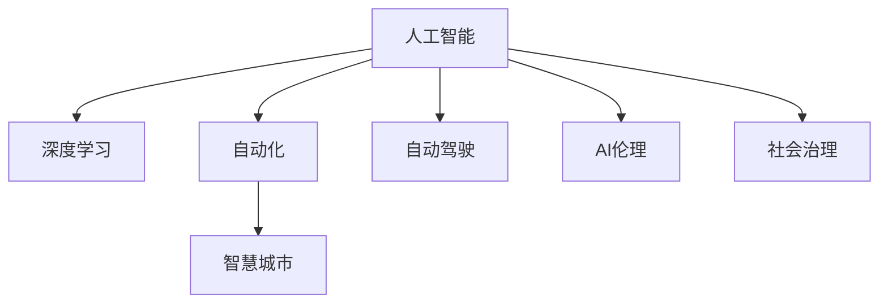
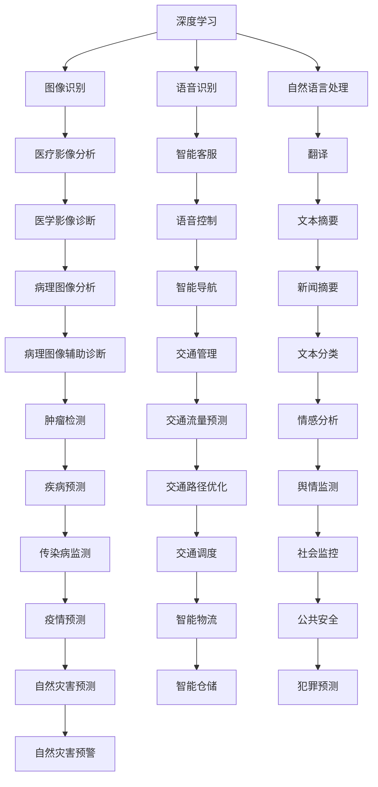
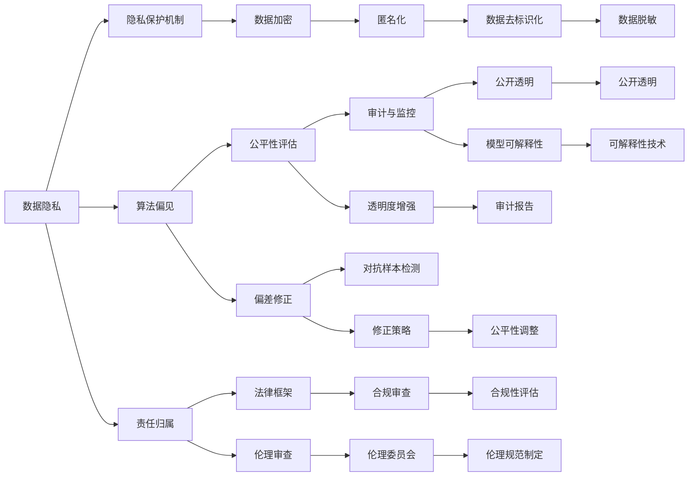

                 

# AI在社会中的作用与应用

> 关键词：人工智能,AI伦理,智慧城市,自动驾驶,AI医疗

## 1. 背景介绍

### 1.1 问题由来
人工智能（AI）技术自20世纪50年代诞生以来，经历了从规则导向到基于统计的机器学习的演进。近年来，以深度学习为代表的先进神经网络技术，使得AI在图像识别、语音识别、自然语言处理等领域取得了突破性进展。AI技术的广泛应用，不仅极大地提升了生产效率，还引发了社会、伦理、经济等多方面的深刻变革。

AI技术的快速发展，给各行业带来了前所未有的机遇和挑战。机器自动化的兴起，使得许多传统劳动密集型工作得以被替代，释放了人力资源。与此同时，AI也在医疗、教育、交通等关键领域发挥了重要作用，推动了社会的全面进步。但随着AI技术的广泛应用，也出现了隐私泄露、伦理困境、就业问题等新的社会挑战。因此，理解AI在社会中的作用及其应用，对于把握未来发展方向，引导技术健康发展具有重要意义。

### 1.2 问题核心关键点
本节将从社会、经济、伦理、技术等多个维度，详细阐述AI技术在社会中的作用与应用。主要包括以下几个关键点：
1. AI在各行业的广泛应用：包括自动驾驶、智慧医疗、智慧教育、智慧城市等。
2. AI技术带来的社会变革：如就业结构变化、隐私保护挑战等。
3. AI伦理问题探讨：如算法偏见、数据隐私、责任归属等。
4. AI在社会治理中的角色：如社会监控、公共安全、灾害预测等。

通过这些关键点的探讨，能够帮助我们全面理解AI技术在现代社会中的多维作用，为其健康发展提供科学的指导。

### 1.3 问题研究意义
深入研究AI技术在社会中的作用与应用，对于推动社会科技进步，改善民生福祉，解决社会问题具有重要意义：

1. 推动社会进步：AI技术在各行业的广泛应用，可以提升生产效率，优化资源配置，推动社会整体进步。
2. 改善民生福祉：AI技术在医疗、教育、交通等领域的应用，可以显著改善人民生活质量，提升幸福感。
3. 解决社会问题：AI技术在公共安全、灾害预测、社会治理等方面的应用，可以有效提升社会管理水平，解决社会问题。
4. 促进经济发展：AI技术的快速发展，带动了新的经济增长点，推动了产业结构升级。
5. 引导技术健康发展：理解AI在社会中的作用与应用，有助于引导其健康发展，避免技术滥用。

## 2. 核心概念与联系

### 2.1 核心概念概述

为更好地理解AI技术在社会中的作用与应用，本节将介绍几个密切相关的核心概念：

- 人工智能(Artificial Intelligence, AI)：指利用计算机系统来模拟人类智能行为的技术，包括感知、推理、学习、规划等方面。AI技术在数据处理、模式识别、自然语言处理等领域展现了强大的能力。

- 深度学习(Deep Learning)：一种基于神经网络的机器学习方法，通过多层非线性变换，学习数据中的复杂特征表示。深度学习在图像识别、语音识别、自然语言处理等领域取得了突破性进展。

- 自动化(Automation)：指通过技术手段，实现任务的自动化、智能化处理，减少人工干预。自动化是AI技术的重要应用方向，涵盖了生产制造、交通物流、客服等众多领域。

- 智慧城市(Smart City)：利用信息技术和AI技术，对城市资源进行全方位、全时段的管理和优化，提升城市运行效率，改善居民生活质量。智慧城市是AI技术在城市治理中的应用典范。

- 自动驾驶(Autonomous Driving)：通过AI技术，实现汽车等交通工具的自主驾驶，提高交通效率，减少交通事故。自动驾驶是AI在交通运输领域的重要应用方向。

- AI伦理(Ethics in AI)：指在AI技术开发和应用中，应考虑的社会、伦理问题，如隐私保护、算法偏见、责任归属等。AI伦理是AI技术健康发展的基石。

- 社会治理(Social Governance)：指通过AI技术，提升公共安全、应急管理、灾害预测等方面的社会治理水平，提升社会管理效率和公平性。

这些核心概念之间的逻辑关系可以通过以下Mermaid流程图来展示：



这个流程图展示了人工智能技术的核心概念及其应用方向：

1. 人工智能技术通过深度学习等方法，实现复杂数据的处理与分析。
2. 自动化的应用领域广泛，涵盖了生产制造、交通物流、客服等众多行业。
3. 智慧城市通过AI技术优化城市资源配置，提升管理效率。
4. 自动驾驶技术提升了交通效率，降低了交通事故。
5. AI伦理是AI技术应用的前提，确保技术健康发展。
6. AI技术在社会治理中的应用，提升了社会管理水平。

通过理解这些核心概念，我们可以更好地把握AI技术的作用与应用，为其在各领域的推广和应用提供理论基础。

### 2.2 概念间的关系

这些核心概念之间存在着紧密的联系，形成了AI技术的完整应用生态系统。下面我们通过几个Mermaid流程图来展示这些概念之间的关系。

#### 2.2.1 AI技术的应用场景



这个流程图展示了AI技术在多个应用场景中的应用：

1. 深度学习技术在图像识别、语音识别、自然语言处理等方面展示了其强大的能力。
2. 这些技术在医疗影像分析、医学影像诊断、病理图像分析等场景中发挥了重要作用。
3. 自动驾驶、智能客服、语音控制等自动化技术，提高了生产效率和用户体验。
4. AI伦理在隐私保护、算法偏见、责任归属等方面得到了重视。
5. AI技术在智慧城市、智慧医疗、智慧教育等社会治理领域中得到了广泛应用。

#### 2.2.2 AI伦理的保障机制



这个流程图展示了AI伦理保障机制的构成：

1. 数据隐私保护机制，如数据加密、匿名化、去标识化等技术，确保用户数据的安全性。
2. 算法偏见处理，通过公平性评估、偏差修正、透明性增强等方法，提高算法的公平性和透明性。
3. 责任归属机制，包括法律框架、伦理审查、合规审查等，确保AI系统的责任归属明确。
4. 伦理规范制定，通过伦理委员会、伦理规范、法律框架等，引导AI技术的健康发展。

### 2.3 核心概念的整体架构

最后，我们用一个综合的流程图来展示这些核心概念在AI技术应用中的整体架构：

```mermaid
graph TB
    A[数据] --> B[预处理]
    B --> C[深度学习]
    C --> D[自动化]
    D --> E[智慧城市]
    D --> F[自动驾驶]
    D --> G[AI伦理]
    D --> H[社会治理]
    E --> I[智慧医疗]
    E --> J[智慧教育]
    F --> K[交通管理]
    G --> L[隐私保护]
    G --> M[公平性评估]
    G --> N[责任归属]
    H --> O[社会监控]
    H --> P[应急管理]
    H --> Q[灾害预测]
    I --> R[医学影像分析]
    I --> S[医学影像诊断]
    I --> T[病理图像分析]
    J --> U[智能教育]
    J --> V[在线学习]
    K --> W[交通流量预测]
    K --> X[交通路径优化]
    L --> Y[数据加密]
    L --> Z[匿名化]
    M --> AA[公平性检测]
    M --> AB[偏差修正]
    N --> AC[责任追溯]
    O --> AD[社会监控]
    O --> AE[公共安全]
    P --> AF[应急响应]
    Q --> AG[灾害预警]
    R --> AH[病理图像辅助诊断]
    S --> AI[医学影像辅助诊断]
    T --> AJ[病理图像分析]
    U --> AK[智能课程推荐]
    V --> AL[在线作业批改]
    W --> AM[交通流量监测]
    X --> AN[交通路径优化]
    Y --> AO[数据加密]
    Y --> AP[匿名化]
    Z --> AQ[数据去标识化]
    AA --> AR[公平性报告]
    AB --> AS[偏差报告]
    AC --> AT[责任报告]
    AD --> AU[安全监控]
    AE --> AV[犯罪预测]
    AF --> AW[灾害预警]
    AG --> AH[自然灾害预警]
    AH --> AI[自然灾害预警]
    AI --> AJ[自然灾害预警]
    AJ --> AK[智能课程推荐]
    AL --> AM[在线作业批改]
    AM --> AN[交通流量监测]
    AN --> AO[交通路径优化]
    AO --> AP[交通路径优化]
    AP --> AQ[交通路径优化]
    AQ --> AR[交通路径优化]
    AR --> AS[交通路径优化]
    AS --> AT[交通路径优化]
    AT --> AU[智能课程推荐]
    AU --> AV[在线作业批改]
    AV --> AW[智能课程推荐]
    AW --> AX[智能课程推荐]
    AX --> AY[智能课程推荐]
    AY --> AZ[智能课程推荐]
    AZ --> BA[智能课程推荐]
    BA --> BB[智能课程推荐]
    BB --> BC[智能课程推荐]
    BC --> BD[智能课程推荐]
    BD --> BE[智能课程推荐]
    BE --> BF[智能课程推荐]
    BF --> BG[智能课程推荐]
    BG --> BH[智能课程推荐]
    BH --> BI[智能课程推荐]
    BI --> BJ[智能课程推荐]
    BJ --> BK[智能课程推荐]
    BK --> BL[智能课程推荐]
    BL --> BM[智能课程推荐]
    BM --> BN[智能课程推荐]
    BN --> BO[智能课程推荐]
    BO --> BP[智能课程推荐]
    BP --> BQ[智能课程推荐]
    BQ --> BR[智能课程推荐]
    BR --> BS[智能课程推荐]
    BS --> BT[智能课程推荐]
    BT --> BU[智能课程推荐]
    BU --> BV[智能课程推荐]
    BV --> BW[智能课程推荐]
    BW --> BX[智能课程推荐]
    BX --> BY[智能课程推荐]
    BY --> BZ[智能课程推荐]
    BZ --> CA[智能课程推荐]
    CA --> CB[智能课程推荐]
    CB --> CC[智能课程推荐]
    CC --> CD[智能课程推荐]
    CD --> CE[智能课程推荐]
    CE --> CF[智能课程推荐]
    CF --> CG[智能课程推荐]
    CG --> CH[智能课程推荐]
    CH --> CI[智能课程推荐]
    CI --> CJ[智能课程推荐]
    CJ --> CK[智能课程推荐]
    CK --> CL[智能课程推荐]
    CL --> CM[智能课程推荐]
    CM --> CN[智能课程推荐]
    CN --> CO[智能课程推荐]
    CO --> CP[智能课程推荐]
    CP --> CQ[智能课程推荐]
    CQ --> CR[智能课程推荐]
    CR --> CS[智能课程推荐]
    CS --> CT[智能课程推荐]
    CT --> CU[智能课程推荐]
    CU --> CV[智能课程推荐]
    CV --> CW[智能课程推荐]
    CW --> CX[智能课程推荐]
    CX --> CY[智能课程推荐]
    CY --> CZ[智能课程推荐]
    CZ --> DA[智能课程推荐]
    DA --> DB[智能课程推荐]
    DB --> DC[智能课程推荐]
    DC --> DD[智能课程推荐]
    DD --> DE[智能课程推荐]
    DE --> DF[智能课程推荐]
    DF --> DG[智能课程推荐]
    DG --> DH[智能课程推荐]
    DH --> DI[智能课程推荐]
    DI --> DJ[智能课程推荐]
    DJ --> DK[智能课程推荐]
    DK --> DL[智能课程推荐]
    DL --> DM[智能课程推荐]
    DM --> DN[智能课程推荐]
    DN --> DO[智能课程推荐]
    DO --> DP[智能课程推荐]
    DP --> DQ[智能课程推荐]
    DQ --> DR[智能课程推荐]
    DR --> DS[智能课程推荐]
    DS --> DT[智能课程推荐]
    DT --> DU[智能课程推荐]
    DU --> DV[智能课程推荐]
    DV --> DW[智能课程推荐]
    DW --> DX[智能课程推荐]
    DX --> DY[智能课程推荐]
    DY --> DZ[智能课程推荐]
    DZ --> EA[智能课程推荐]
    EA --> EB[智能课程推荐]
    EB --> EC[智能课程推荐]
    EC --> ED[智能课程推荐]
    ED --> EE[智能课程推荐]
    EE --> EF[智能课程推荐]
    EF --> EG[智能课程推荐]
    EG --> EH[智能课程推荐]
    EH --> EI[智能课程推荐]
    EI --> EJ[智能课程推荐]
    EJ --> EK[智能课程推荐]
    EK --> EL[智能课程推荐]
    EL --> EM[智能课程推荐]
    EM --> EN[智能课程推荐]
    EN --> EO[智能课程推荐]
    EO --> EP[智能课程推荐]
    EP --> EQ[智能课程推荐]
    EQ --> ER[智能课程推荐]
    ER --> ES[智能课程推荐]
    ES --> ET[智能课程推荐]
    ET --> EU[智能课程推荐]
    EU --> EV[智能课程推荐]
    EV --> EW[智能课程推荐]
    EW --> EX[智能课程推荐]
    EX --> EY[智能课程推荐]
    EY --> EZ[智能课程推荐]
    EZ --> FA[智能课程推荐]
    FA --> FB[智能课程推荐]
    FB --> FC[智能课程推荐]
    FC --> FD[智能课程推荐]
    FD --> FE[智能课程推荐]
    FE --> FF[智能课程推荐]
    FF --> FG[智能课程推荐]
    FG --> FH[智能课程推荐]
    FH --> FI[智能课程推荐]
    FI --> FJ[智能课程推荐]
    FJ --> FK[智能课程推荐]
    FK --> FL[智能课程推荐]
    FL --> FM[智能课程推荐]
    FM --> FN[智能课程推荐]
    FN --> FO[智能课程推荐]
    FO --> FP[智能课程推荐]
    FP --> FQ[智能课程推荐]
    FQ --> FR[智能课程推荐]
    FR --> FS[智能课程推荐]
    FS --> FT[智能课程推荐]
    FT --> FU[智能课程推荐]
    FU --> FV[智能课程推荐]
    FV --> FW[智能课程推荐]
    FW --> FX[智能课程推荐]
    FX --> FY[智能课程推荐]
    FY --> FZ[智能课程推荐]
    FZ --> GA[智能课程推荐]
    GA --> GB[智能课程推荐]
    GB --> GC[智能课程推荐]
    GC --> GD[智能课程推荐]
    GD --> GE[智能课程推荐]
    GE --> GF[智能课程推荐]
    GF --> GG[智能课程推荐]
    GG --> GH[智能课程推荐]
    GH --> GI[智能课程推荐]
    GI --> GJ[智能课程推荐]
    GJ --> GK[智能课程推荐]
    GK --> GL[智能课程推荐]
    GL --> GM[智能课程推荐]
    GM --> GN[智能课程推荐]
    GN --> GO[智能课程推荐]
    GO --> GP[智能课程推荐]
    GP --> GQ[智能课程推荐]
    GQ --> GR[智能课程推荐]
    GR --> GS[智能课程推荐]
    GS --> GT[智能课程推荐]
    GT --> GU[智能课程推荐]
    GU --> GV[智能课程推荐]
    GV --> GW[智能课程推荐]
    GW --> GX[智能课程推荐]
    GX --> GY[智能课程推荐]
    GY --> GZ[智能课程推荐]
    GZ --> HA[智能课程推荐]
    HA --> HB[智能课程推荐]
    HB --> HC[智能课程推荐]
    HC --> HD[智能课程推荐]
    HD --> HE[智能课程推荐]
    HE --> HF[智能课程推荐]
    HF --> HG[智能课程推荐]
    HG --> HH[智能课程推荐]
    HH --> HI[智能课程推荐]
    HI --> HJ[智能课程推荐]
    HJ --> HK[智能课程推荐]
    HK --> HL[智能课程推荐]
    HL --> HM[智能课程推荐]
    HM --> HN[智能课程推荐]
    HN --> HO[智能课程推荐]
    HO --> HP[智能课程推荐]
    HP --> HQ[智能课程推荐]
    HQ --> HR[智能课程推荐]
    HR --> HS[智能课程推荐]
    HS --> HT[智能课程推荐]
    HT --> HU[智能课程推荐]
    HU --> HV[智能课程推荐]
    HV --> HW[智能课程推荐]
    HW --> HX[智能课程推荐]
    HX --> HY[智能课程推荐]
    HY --> HZ[智能课程推荐]
    HZ --> IA[智能课程推荐]
    IA --> IB[智能课程推荐]
    IB --> IC[智能课程推荐]
    IC --> ID[智能课程推荐]
    ID --> IE[智能课程推荐]
    IE --> IF[智能课程推荐]
    IF --> IG[智能课程推荐]
    IG --> IH[智能课程推荐]
    IH --> II[智能课程推荐]
    II --> IJ[智能课程推荐]
    IJ --> IK[智能课程推荐]
    IK --> IL[智能课程推荐]
    IL --> IM[智能课程推荐]
    IM --> IN[智能课程推荐]
    IN --> IO[智能课程推荐]
    IO --> IP[智能课程推荐]
    IP --> IQ[智能课程推荐]
    IQ --> IR[智能课程推荐]
    IR --> IS[智能课程推荐]
    IS --> IT[智能课程推荐]
    IT --> IU[智能课程推荐]
    IU --> IV[智能课程推荐]
    IV --> IW[智能课程推荐]
    IW --> IX[智能课程推荐]
    IX --> IY[智能课程推荐]
    IY --> IZ[智能课程推荐]
    IZ -->JA[智能课程推荐]
    JA --> JB[智能课程推荐]
    JB --> JC[智能课程推荐]
    JC --> JD[智能课程推荐]
    JD --> JE[智能课程推荐]
    JE --> JF[智能课程推荐]
    JF --> JG[智能课程推荐]
    JG --> JH[智能课程推荐]
    JH --> JI[智能课程推荐]
    JI --> JJ[智能课程推荐]
    JJ --> JK[智能课程推荐]
    JK --> JL[智能课程推荐]
    JL --> JM[智能课程推荐]
    JM --> JN[智能课程推荐]
    JN --> JO[智能课程推荐]
    JO --> JP[智能课程推荐]
    JP --> JQ[智能课程推荐]
    JQ --> JR[智能课程推荐]
    JR --> JS[智能课程推荐]
    JS --> JT[智能课程推荐]
    JT --> JU[智能课程推荐]
    JU --> JV[智能课程推荐]
    JV --> JW[智能课程推荐]
    JW --> JX[智能课程推荐]
    JX --> JY[智能课程推荐]
    JY --> JZ[智能课程推荐]
    JZ --> KA[智能课程推荐]
    KA --> KB[智能课程推荐]
    KB --> KC[智能课程推荐]
    KC --> KD[智能课程推荐]
    KD --> KE[智能课程推荐]
    KE --> KF[智能课程推荐]
    KF --> KG[智能课程推荐]
    KG --> KH[智能课程推荐]
    KH --> KI[智能课程推荐]
    KI --> KJ[智能课程推荐]
    KJ --> KK[智能课程推荐]
    KK --> KL[智能课程推荐]
    KL --> KM[智能课程推荐]
    KM --> KN[智能课程推荐]
    KN --> KO[智能课程推荐]
    KO --> KP[智能课程推荐]
    KP --> KQ[智能课程推荐]
    KQ --> KR[智能课程推荐]
    KR --> KS[智能课程推荐]
    KS --> KT[智能课程推荐]
    KT --> KU[智能课程推荐]
    KU --> KV[智能课程推荐]
    KV --> KW[智能课程推荐]
    KW --> KX[智能课程推荐]
    KX --> KY[智能课程推荐]
    KY --> KZ[智能课程推荐]
    KZ --> LA[智能课程推荐]
    LA --> LB[智能课程推荐]
    LB --> LC[智能课程推荐]
    LC --> LD[智能课程推荐]
    LD --> LE[智能课程推荐]
    LE --> LF[智能课程推荐]
    LF --> LG[智能课程推荐]
    LG --> LH[智能课程推荐]
    LH --> LI[智能课程推荐]
    LI --> LJ[智能课程推荐]
    LJ --> LK[智能课程推荐]
    LK --> LL[智能课程推荐]
    LL --> LM[智能课程推荐]
    LM --> LN[智能课程推荐]
    LN --> LO[智能课程推荐]
    LO --> LP[智能课程推荐]
    LP --> LQ[智能课程推荐]
    LQ --> LR[智能课程推荐]
    LR --> LS[智能课程推荐]
    LS --> LT[智能课程推荐]
    LT --> LU[智能课程推荐]
    LU --> LV[智能课程推荐]
    LV --> LW[智能课程推荐]
    LW --> LX[智能课程推荐]
    LX --> LY[智能课程推荐]
    LY --> LZ[智能课程推荐]
    LZ --> MA[智能课程推荐]
    MA --> MB[智能课程推荐]
    MB --> MC[智能课程推荐]
    MC --> MD[智能课程推荐]
    MD --> ME[智能课程推荐]
    ME --> MF[智能课程推荐]
    MF --> MG[智能课程推荐]
    MG --> MH[智能课程推荐]
    MH --> MI[智能课程推荐]
    MI --> MJ[智能课程推荐]
    MJ --> MK[智能课程推荐]
    MK --> ML[智能课程推荐]
    ML --> MN[智能课程推荐]
    MN --> MO[智能课程推荐]
    MO --> MP[智能课程推荐]
    MP --> MQ[智能课程推荐]
    MQ --> MR[智能课程推荐]
    MR --> MS[智能课程推荐]
    MS --> MT[智能课程推荐]
    MT --> MU[智能课程推荐]
    MU --> MV[智能课程推荐]
    MV --> MW[智能课程推荐]
    MW --> MX[智能课程推荐]
    MX --> MY[智能课程推荐]
    MY --> MZ[智能课程推荐]
    MZ --> NA[智能课程推荐]
    NA --> NB[智能课程推荐]
    NB --> NC[智能课程推荐]
    NC --> ND[智能课程推荐]
    ND --> NE[智能课程推荐]
    NE --> NF[智能课程推荐]
    NF --> NG[智能课程推荐]
    NG --> NH[智能课程推荐]
    NH --> NI[智能课程推荐]
    NI --> NJ[智能课程推荐]
    NJ --> NK[智能课程推荐]
    NK --> NL[智能课程推荐]
    NL --> NM[智能课程推荐]
    NM --> NN[智能课程推荐]
    NN --> NO[智能课程推荐]
    NO --> NP[智能课程推荐]
    NP --> NQ[智能课程推荐]
    NQ --> NR[智能课程推荐]
    NR --> NS[智能课程推荐]
    NS --> NT[智能课程推荐]
    NT --> NU[智能课程推荐]
    NU --> NV[智能课程推荐]
    NV --> NW[智能课程推荐]
    NW --> NX[智能课程推荐]
    NX --> NY[智能课程推荐]
    NY --> NZ[智能课程推荐]
    NZ --> OA[智能课程推荐]
    OA --> OB[智能课程推荐]
    OB --> OC[智能课程推荐]
    OC --> OD[智能课程推荐]
    OD --> OE[智能课程推荐]
    OE --> OF[智能课程推荐]
    OF --> OG[智能课程推荐]
    OG --> OH[智能课程推荐]
    OH --> OI[智能课程推荐]
    OI

