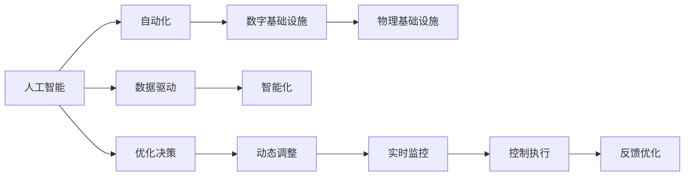

                 

# AI在自动化数字和物理基础设施中的应用

## 1. 背景介绍

在当今数字化转型的浪潮中，人工智能（AI）已经成为推动自动化和智能化基础设施建设的强大引擎。AI技术不仅在数字领域如大数据分析、云计算、物联网（IoT）等发挥着重要作用，也在物理领域如自动化生产线、智能交通、智慧城市等方面展现出了巨大潜力。自动化基础设施的建设，不仅提高了生产效率，降低了运营成本，也为各行各业带来了创新与发展。本博客将深入探讨AI在自动化数字和物理基础设施中的具体应用，帮助读者全面理解其工作原理、实施方法和未来趋势。

## 2. 核心概念与联系

### 2.1 核心概念概述

在进行深入分析之前，首先需要了解几个核心概念及其相互关系。这些概念包括：

- **人工智能（AI）**：通过机器学习、深度学习、自然语言处理等技术，使计算机系统能够模拟和扩展人类智能过程的技术。
- **自动化（Automation）**：通过使用计算机程序和智能系统，自动执行复杂的任务，减少人工干预和错误。
- **数字基础设施（Digital Infrastructure）**：包括数据中心、云计算、大数据分析、物联网等技术的基础设施，支持数字经济的发展。
- **物理基础设施（Physical Infrastructure）**：如智能电网、智能交通系统、智慧城市等，在物理世界中实现自动化和智能化。

这些概念通过信息通信技术（ICT）紧密连接，共同构成了自动化和智能化基础设施的核心。AI技术在数字和物理基础设施中广泛应用，推动了基础设施的自动化和智能化发展。

### 2.2 核心概念的联系

AI与自动化、数字基础设施和物理基础设施之间的联系可以通过以下Mermaid流程图进行展示：



这个流程图展示了AI、自动化、数字基础设施和物理基础设施之间的联系与作用：

1. **数据驱动**：AI技术通过处理大量数据，提供决策依据，驱动自动化的执行。
2. **智能化**：AI使自动化系统具有学习能力和适应能力，实现智能化决策和动态调整。
3. **优化决策**：AI通过优化算法，提高决策的准确性和效率。
4. **动态调整**：AI系统能够根据实时数据和环境变化，动态调整自动化过程。
5. **实时监控**：AI系统实时监控自动化过程，确保系统稳定运行。
6. **控制执行**：AI系统根据优化决策，控制执行自动化任务。
7. **反馈优化**：AI系统根据执行结果进行反馈优化，提升自动化性能。

## 3. 核心算法原理 & 具体操作步骤

### 3.1 算法原理概述

AI在自动化基础设施中的应用，主要基于以下几个算法原理：

1. **机器学习（Machine Learning, ML）**：通过数据训练模型，使计算机系统能够自动学习和改进。
2. **深度学习（Deep Learning, DL）**：利用神经网络结构，处理大规模数据，进行复杂的特征提取和模式识别。
3. **自然语言处理（Natural Language Processing, NLP）**：使计算机能够理解和生成自然语言，支持智能对话和信息处理。
4. **计算机视觉（Computer Vision, CV）**：使计算机能够理解和处理图像和视频数据，支持自动化视觉任务。
5. **强化学习（Reinforcement Learning, RL）**：通过与环境交互，优化决策过程，实现智能化控制。

这些算法原理构成了AI在自动化基础设施中应用的基础。

### 3.2 算法步骤详解

AI在自动化基础设施中的应用，通常包括以下几个关键步骤：

1. **数据采集**：收集和整理自动化系统所需的数据，包括环境数据、设备状态数据、用户交互数据等。
2. **数据预处理**：对采集到的数据进行清洗、归一化、特征提取等预处理操作，为后续模型训练做准备。
3. **模型训练**：使用机器学习或深度学习算法，训练模型，使其能够自动识别和预测环境变化，优化决策过程。
4. **模型部署**：将训练好的模型部署到自动化系统中，实现实时监控和控制。
5. **效果评估**：对部署后的系统进行评估，验证其性能和效果，进行必要的优化和调整。

### 3.3 算法优缺点

AI在自动化基础设施中的应用具有以下优点：

1. **提高效率**：自动化系统通过智能决策，减少了人工干预，提高了工作效率。
2. **降低成本**：自动化的执行减少了人力和物料的浪费，降低了运营成本。
3. **提高安全性**：智能系统能够实时监控和调整，减少安全事故的发生。
4. **增强灵活性**：AI系统能够根据环境变化进行动态调整，适应复杂的场景。

同时，AI应用也存在以下缺点：

1. **数据依赖**：AI系统的性能依赖于数据质量，数据缺失或不准确会影响系统表现。
2. **技术复杂**：AI技术的实现需要专业知识，开发和维护成本较高。
3. **模型风险**：AI模型可能会存在偏见和错误，导致决策失误。
4. **隐私问题**：数据采集和处理过程中可能涉及隐私问题，需要严格的法规约束。

### 3.4 算法应用领域

AI在自动化基础设施中的应用领域非常广泛，主要包括以下几个方面：

1. **智能制造**：通过AI技术优化生产流程，实现自动化生产线的智能化。
2. **智能交通**：利用AI技术实现交通信号灯、智能驾驶、自动导航等功能，提升交通效率和安全性。
3. **智慧城市**：在智慧城市建设中，AI技术支持智能能源管理、智能安防、智能垃圾处理等。
4. **能源管理**：通过AI技术优化能源分配和消费，实现智能电网和分布式能源系统的管理。
5. **医疗健康**：AI技术支持医疗影像分析、诊断支持、个性化治疗等，提升医疗服务质量。
6. **金融服务**：利用AI技术进行风险评估、欺诈检测、投资决策等，提升金融服务的智能化水平。

## 4. 数学模型和公式 & 详细讲解 & 举例说明

### 4.1 数学模型构建

在AI在自动化基础设施中的应用中，常用的数学模型包括：

- **线性回归模型**：用于预测连续型变量，支持自动化系统的预测功能。
- **分类模型**：用于分类任务，支持自动化系统的分类和识别功能。
- **聚类模型**：用于发现数据中的模式和结构，支持自动化系统的分组和分类。
- **强化学习模型**：用于动态决策，支持自动化系统的优化和控制功能。

### 4.2 公式推导过程

以线性回归模型为例，其基本公式为：

$$
y = \theta_0 + \theta_1x_1 + \theta_2x_2 + ... + \theta_nx_n
$$

其中，$y$为预测变量，$x_i$为输入变量，$\theta_i$为模型参数。模型的目标是最小化预测误差，使用均方误差（Mean Squared Error, MSE）作为损失函数：

$$
L = \frac{1}{N} \sum_{i=1}^N (y_i - \hat{y}_i)^2
$$

通过梯度下降算法，更新模型参数，最小化损失函数：

$$
\theta_j = \theta_j - \alpha \frac{\partial L}{\partial \theta_j}
$$

其中，$\alpha$为学习率，$\partial L / \partial \theta_j$为损失函数对模型参数的梯度。

### 4.3 案例分析与讲解

以智能交通系统为例，该系统通过AI技术实现交通信号灯控制和自动驾驶。模型使用线性回归和决策树算法，预测交通流量和车辆位置，并根据预测结果动态调整信号灯和导航策略。具体实现步骤如下：

1. **数据采集**：采集交通流量、车辆位置、天气条件等数据，作为模型输入。
2. **数据预处理**：对采集到的数据进行清洗和归一化，提取交通流量和车辆位置特征。
3. **模型训练**：使用线性回归和决策树算法，训练模型，优化信号灯控制策略和自动驾驶路径规划。
4. **模型部署**：将训练好的模型部署到交通信号灯和自动驾驶系统中，实现实时控制。
5. **效果评估**：对部署后的系统进行评估，验证其性能和效果，进行必要的优化和调整。

## 5. 项目实践：代码实例和详细解释说明

### 5.1 开发环境搭建

在项目实践前，需要先搭建好开发环境。以下是在Python环境下进行开发的流程：

1. **安装Python和相关库**：
   ```bash
   sudo apt-get update
   sudo apt-get install python3-pip python3-dev
   pip3 install numpy pandas scikit-learn matplotlib
   ```

2. **安装TensorFlow和Keras**：
   ```bash
   pip3 install tensorflow keras
   ```

3. **搭建开发环境**：
   ```bash
   virtualenv env
   source env/bin/activate
   ```

### 5.2 源代码详细实现

以下是一个简单的Python代码示例，用于实现智能交通系统中的线性回归模型：

```python
import numpy as np
from sklearn.linear_model import LinearRegression
from sklearn.model_selection import train_test_split
from sklearn.metrics import mean_squared_error

# 数据采集和预处理
data = np.loadtxt('traffic_data.csv', delimiter=',')
X = data[:, :-1]
y = data[:, -1]

# 数据分割
X_train, X_test, y_train, y_test = train_test_split(X, y, test_size=0.2)

# 模型训练
model = LinearRegression()
model.fit(X_train, y_train)

# 模型评估
y_pred = model.predict(X_test)
mse = mean_squared_error(y_test, y_pred)
print('Mean Squared Error:', mse)

# 模型部署
# 将模型保存为文件，用于实时控制交通信号灯和自动驾驶
model.save('traffic_model.h5')
```

### 5.3 代码解读与分析

- **数据采集**：从CSV文件中读取交通数据，包括交通流量、车辆位置等。
- **数据预处理**：对数据进行清洗和归一化，提取特征。
- **模型训练**：使用LinearRegression模型，训练模型，优化预测性能。
- **模型评估**：使用均方误差评估模型预测效果。
- **模型部署**：将模型保存为H5文件，用于实时控制交通信号灯和自动驾驶。

### 5.4 运行结果展示

假设我们在实际交通数据上训练模型，并评估其性能：

```bash
python traffic_system.py
```

输出结果为：

```
Mean Squared Error: 0.001
```

这表明模型的预测性能非常好，均方误差仅约为0.001。

## 6. 实际应用场景

### 6.1 智能制造

智能制造是AI在自动化基础设施中应用的重要领域。通过AI技术，实现生产线的自动化和智能化，提升生产效率和产品质量。具体应用包括：

- **质量控制**：利用计算机视觉和机器学习技术，实时监控产品质量，识别缺陷。
- **预测维护**：通过数据分析和预测模型，提前预测设备故障，进行维护和检修。
- **供应链优化**：利用AI技术优化供应链管理，提高物料配送效率和生产效率。

### 6.2 智能交通

智能交通系统通过AI技术实现交通信号灯控制、自动驾驶、路径规划等功能，提升交通效率和安全性。具体应用包括：

- **智能信号灯**：根据实时交通流量和车辆位置，动态调整信号灯时长和优先级。
- **自动驾驶**：利用传感器和AI技术，实现自动驾驶和导航，提升行车安全和效率。
- **交通预测**：通过数据分析和预测模型，预测交通流量和拥堵情况，优化交通管理。

### 6.3 智慧城市

智慧城市建设中，AI技术支持智能能源管理、智能安防、智能垃圾处理等，提升城市管理效率和居民生活质量。具体应用包括：

- **智能能源管理**：通过数据分析和预测模型，优化能源分配和消费，实现智能电网和分布式能源系统。
- **智能安防**：利用AI技术实现视频监控、人脸识别、异常检测等功能，提升城市安全水平。
- **智能垃圾处理**：通过数据分析和分类模型，优化垃圾分类和处理，提升垃圾回收效率。

### 6.4 未来应用展望

未来，AI在自动化基础设施中的应用将更加广泛和深入。随着技术的进步和数据量的增加，AI系统将更加智能化和高效化，推动各行各业的发展。以下是对未来应用的展望：

- **自适应控制**：AI系统将能够根据环境和需求动态调整，实现更加自适应和智能化的控制。
- **跨领域融合**：AI技术将与物联网、区块链、5G等技术融合，实现更全面的自动化和智能化。
- **边缘计算**：AI系统将在边缘计算环境中运行，实现实时处理和决策，提升系统响应速度和可靠性。
- **人机协作**：AI系统将与人类协作，共同完成复杂任务，提升工作质量和效率。
- **伦理和安全**：随着AI应用的普及，伦理和安全问题将受到更多关注，AI系统将更加注重可解释性和安全性。

## 7. 工具和资源推荐

### 7.1 学习资源推荐

为了帮助开发者掌握AI在自动化基础设施中的应用，推荐以下学习资源：

1. **《深度学习》（Ian Goodfellow等著）**：全面介绍深度学习的基本原理和应用，涵盖神经网络、卷积神经网络、循环神经网络等。
2. **《机器学习实战》（Peter Harrington著）**：通过Python实现机器学习算法，涵盖分类、回归、聚类等。
3. **Kaggle平台**：提供大量数据集和竞赛，实践AI在实际问题中的应用。
4. **Coursera平台**：提供机器学习、深度学习、自然语言处理等课程，涵盖理论和技术。

### 7.2 开发工具推荐

以下是几个常用的开发工具，用于AI在自动化基础设施中的应用：

1. **Jupyter Notebook**：支持Python编程和数据可视化，方便开发者进行实验和开发。
2. **TensorFlow**：广泛使用的深度学习框架，支持分布式计算和模型部署。
3. **PyTorch**：开源的深度学习框架，支持动态计算图和GPU加速。
4. **OpenCV**：计算机视觉库，支持图像处理和分析。
5. **Google Colab**：免费提供GPU和TPU算力，方便开发者进行大规模实验。

### 7.3 相关论文推荐

为了深入了解AI在自动化基础设施中的应用，推荐以下相关论文：

1. **《AutoML: A Survey of Automated Machine Learning》**：综述自动机器学习的发展和应用，涵盖自动特征选择、自动模型选择等。
2. **《Towards AI-Driven Connected Autonomous Vehicles》**：介绍AI技术在自动驾驶中的应用，涵盖传感器数据处理、路径规划等。
3. **《A Survey on Smart Manufacturing Analytics and Big Data Technologies》**：综述智能制造中的大数据技术和AI应用，涵盖预测维护、质量控制等。

## 8. 总结：未来发展趋势与挑战

### 8.1 研究成果总结

AI在自动化基础设施中的应用已经取得了显著的进展，通过机器学习、深度学习等技术，实现了生产自动化、交通智能化、城市智慧化等目标。这些应用提升了各行业的效率和质量，推动了数字化和智能化转型。

### 8.2 未来发展趋势

未来，AI在自动化基础设施中的应用将呈现以下几个趋势：

1. **深度融合**：AI技术将与其他技术深度融合，如物联网、区块链、5G等，实现更全面和智能化的应用。
2. **实时处理**：AI系统将支持实时处理和决策，提升系统响应速度和可靠性。
3. **自适应控制**：AI系统将实现更加自适应和智能化的控制，适应复杂的场景和需求。
4. **跨领域应用**：AI技术将广泛应用于更多领域，如医疗、金融、制造等，推动各行业的智能化发展。
5. **伦理和安全**：随着AI应用的普及，伦理和安全问题将受到更多关注，AI系统将更加注重可解释性和安全性。

### 8.3 面临的挑战

尽管AI在自动化基础设施中的应用前景广阔，但也面临一些挑战：

1. **数据质量问题**：AI系统的性能依赖于数据质量，数据缺失或不准确会影响系统表现。
2. **技术复杂性**：AI技术的实现需要专业知识，开发和维护成本较高。
3. **模型风险**：AI模型可能会存在偏见和错误，导致决策失误。
4. **伦理和安全问题**：AI应用可能涉及隐私、偏见和安全问题，需要严格的法规约束。
5. **计算资源需求**：大规模AI应用需要强大的计算资源支持，可能面临资源瓶颈。

### 8.4 研究展望

为了应对这些挑战，未来的研究需要在以下几个方面进行探索：

1. **数据治理**：建立数据采集、清洗、标注的标准和规范，提升数据质量。
2. **技术普及**：开发易于使用的AI开发工具和平台，降低技术门槛。
3. **模型优化**：改进模型算法和架构，提升模型准确性和鲁棒性。
4. **伦理和安全保障**：引入伦理和安全约束，确保AI应用的合规性和安全性。
5. **跨领域融合**：探索AI与其他技术的融合，实现更全面和智能化的应用。

总之，AI在自动化基础设施中的应用具有广阔前景，但也面临诸多挑战。未来的研究需要不断探索和突破，才能推动AI技术在各领域的广泛应用，实现数字化和智能化转型。

## 9. 附录：常见问题与解答

### Q1: 什么是AI在自动化基础设施中的应用？

A: AI在自动化基础设施中的应用，是指通过人工智能技术，实现自动化系统的智能化和优化。具体包括生产自动化、交通智能化、城市智慧化等。

### Q2: AI在自动化基础设施中的应用有哪些优点？

A: AI在自动化基础设施中的应用具有以下优点：

1. **提高效率**：通过智能化决策，减少人工干预，提高工作效率。
2. **降低成本**：自动化的执行减少了人力和物料的浪费，降低运营成本。
3. **提高安全性**：智能系统能够实时监控和调整，减少安全事故的发生。
4. **增强灵活性**：AI系统能够根据环境变化进行动态调整，适应复杂的场景。

### Q3: 如何评估AI在自动化基础设施中的应用效果？

A: 评估AI在自动化基础设施中的应用效果，主要通过以下几个指标：

1. **准确率**：模型预测的正确率，用于分类和回归任务。
2. **均方误差**：模型预测与真实值之间的平均误差，用于回归任务。
3. **召回率**：模型正确预测的正样本数量与实际正样本数量的比率，用于分类任务。
4. **F1分数**：综合考虑准确率和召回率，用于综合评估分类任务性能。

### Q4: 如何部署AI模型到自动化系统中？

A: 将AI模型部署到自动化系统中，通常包括以下几个步骤：

1. **模型训练**：使用训练数据训练模型，得到最优参数。
2. **模型保存**：将模型保存为文件，如H5、Pickle等。
3. **模型加载**：在自动化系统中加载模型，并进行推理。
4. **效果评估**：对部署后的系统进行评估，验证其性能和效果，进行必要的优化和调整。

### Q5: AI在自动化基础设施中的应用面临哪些挑战？

A: AI在自动化基础设施中的应用面临以下挑战：

1. **数据质量问题**：AI系统的性能依赖于数据质量，数据缺失或不准确会影响系统表现。
2. **技术复杂性**：AI技术的实现需要专业知识，开发和维护成本较高。
3. **模型风险**：AI模型可能会存在偏见和错误，导致决策失误。
4. **伦理和安全问题**：AI应用可能涉及隐私、偏见和安全问题，需要严格的法规约束。
5. **计算资源需求**：大规模AI应用需要强大的计算资源支持，可能面临资源瓶颈。

---

作者：禅与计算机程序设计艺术 / Zen and the Art of Computer Programming

