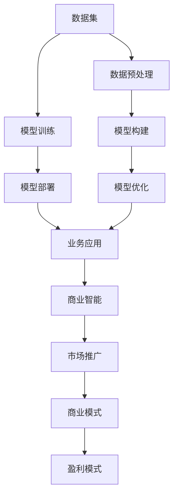

                 

# AI大模型创业：如何应对未来挑战？

## 1. 背景介绍

### 1.1 问题由来
近年来，随着深度学习技术的快速发展，人工智能(AI)大模型在多个领域展现出巨大的潜力和价值。AI大模型不仅能处理大规模数据集，提取高维特征，还能在不同领域中实现泛化迁移，极大地提升了数据利用效率和决策准确性。然而，AI大模型的成功也带来了新的挑战。如何构建、维护并商业化AI大模型，成为所有创业者和研究者共同面临的课题。

### 1.2 问题核心关键点
AI大模型创业的核心在于如何利用机器学习模型，从数据中提取价值，并将这些价值转化为实际商业应用。主要关注以下几个关键问题：

1. **模型构建与训练**：如何高效构建和训练大模型，以确保其性能和可扩展性。
2. **数据集选择与管理**：如何选择合适的大规模数据集，并有效管理其收集、存储和预处理。
3. **模型部署与优化**：如何将训练好的模型部署到实际应用中，并进行性能优化。
4. **业务应用与市场推广**：如何将AI大模型应用于业务场景，并成功推广至市场。
5. **商业模式与盈利模式**：如何选择可持续的商业模式，以实现盈利。

本文将从模型构建、数据集选择、部署优化、业务应用和盈利模式等方面，探讨AI大模型创业面临的关键挑战，并给出应对策略。

## 2. 核心概念与联系

### 2.1 核心概念概述

AI大模型创业涉及到多个核心概念，包括AI大模型、深度学习、迁移学习、云计算、API接口、商业智能(BI)等。这些概念之间存在紧密联系，共同构成了AI大模型创业的技术和业务框架。

- **AI大模型**：利用深度学习技术构建的大型神经网络模型，可用于大规模数据处理和复杂决策问题。
- **深度学习**：通过多层次的非线性特征提取，使模型能处理复杂的多维度数据。
- **迁移学习**：利用预训练模型在不同任务之间的知识迁移，提升模型泛化能力。
- **云计算**：通过弹性计算资源和分布式存储，支持大规模模型训练和部署。
- **API接口**：提供标准接口，使第三方应用能够调用AI模型进行数据处理和决策支持。
- **商业智能(BI)**：将AI模型应用于数据分析、决策支持等业务场景，提高业务效率和决策质量。

这些核心概念通过数据流、控制流和业务流相互连接，共同支持AI大模型的构建和应用。

### 2.2 概念间的关系

以上核心概念之间的关系可以通过以下Mermaid流程图来展示：



这个流程图展示了大模型创业的主要流程和关键环节：

1. 从数据集开始，通过数据预处理和模型训练，构建出大模型。
2. 将构建好的模型进行优化，部署到实际应用中，并通过API接口提供服务。
3. 在业务场景中应用大模型，利用商业智能技术，提高业务效率和决策质量。
4. 通过市场推广和商业模式设计，实现盈利。

## 3. 核心算法原理 & 具体操作步骤
### 3.1 算法原理概述

AI大模型的核心算法原理主要包括深度学习、迁移学习、优化算法和模型部署等。这些算法共同作用，使得AI大模型能在大规模数据集上高效学习和推理。

**深度学习**：利用多层神经网络结构，通过反向传播算法更新模型参数，从而自动学习数据特征。深度学习模型包括卷积神经网络(CNN)、循环神经网络(RNN)、Transformer等。

**迁移学习**：通过预训练模型在不同任务之间的知识迁移，使模型能在少量标注数据上快速学习。迁移学习主要包括以下步骤：
1. 选择合适的预训练模型。
2. 将预训练模型微调以适应特定任务。
3. 在大规模数据集上训练和优化模型。

**优化算法**：通过梯度下降等算法优化模型参数，提高模型在特定任务上的表现。常用的优化算法包括随机梯度下降(SGD)、Adam、RMSprop等。

**模型部署**：将训练好的模型部署到实际应用中，并提供API接口，使第三方应用能够调用模型进行推理预测。

### 3.2 算法步骤详解

以下是AI大模型创业中的主要算法步骤和具体操作步骤：

**Step 1: 数据集选择与预处理**

1. **数据集选择**：选择与业务场景相关的、具有高质量和多样性的数据集。常用的数据集包括ImageNet、COCO、Wikipedia等。
2. **数据预处理**：对数据进行清洗、归一化、标注等预处理，确保数据质量。

**Step 2: 模型构建与训练**

1. **模型选择**：根据业务需求选择适合的大模型架构，如CNN、RNN、Transformer等。
2. **模型构建**：利用深度学习框架，构建并训练大模型。常用的框架包括TensorFlow、PyTorch等。
3. **超参数调优**：调整模型超参数，如学习率、批大小、迭代轮数等，以提高模型性能。

**Step 3: 模型微调与优化**

1. **微调**：利用迁移学习，在少量标注数据上微调预训练模型，适应特定业务任务。
2. **优化**：在实际应用中不断优化模型，提高推理速度和计算效率。

**Step 4: 模型部署与API接口设计**

1. **模型部署**：将训练好的模型部署到服务器、云平台等环境中，供实际应用调用。
2. **API接口设计**：设计标准化的API接口，使第三方应用能够方便地调用模型。

**Step 5: 业务应用与商业智能**

1. **业务应用**：将模型应用于实际业务场景，如图像识别、自然语言处理等。
2. **商业智能**：利用商业智能技术，对业务数据进行分析，提供决策支持。

**Step 6: 市场推广与商业模式设计**

1. **市场推广**：通过营销、广告等手段，推广AI大模型产品。
2. **商业模式设计**：选择合适的商业模式，如SaaS、PaaS等，实现盈利。

### 3.3 算法优缺点

AI大模型创业中的算法优缺点如下：

**优点**：
1. **高效率**：深度学习模型能高效地处理大规模数据集。
2. **泛化能力**：迁移学习能使模型在不同任务上快速适应。
3. **灵活性**：API接口使模型易于集成和调用。

**缺点**：
1. **资源需求高**：深度学习模型需要大量的计算资源和存储资源。
2. **数据依赖强**：模型的性能高度依赖数据集的质量和多样性。
3. **模型复杂**：大模型结构复杂，不易理解和调试。

### 3.4 算法应用领域

AI大模型创业的应用领域广泛，主要包括：

1. **计算机视觉**：利用图像识别、图像分割等技术，支持无人驾驶、医疗影像分析等。
2. **自然语言处理(NLP)**：利用文本分类、情感分析、机器翻译等技术，支持智能客服、智能问答等。
3. **语音识别与生成**：利用语音识别、语音合成等技术，支持智能语音助手、自动字幕生成等。
4. **推荐系统**：利用协同过滤、内容推荐等技术，支持电商推荐、视频推荐等。

## 4. 数学模型和公式 & 详细讲解  
### 4.1 数学模型构建

AI大模型的构建过程可以抽象为以下数学模型：

**输入层**：原始数据集，包括图像、文本、语音等。
**隐含层**：深度神经网络，自动学习特征表示。
**输出层**：模型预测结果，如分类、回归等。

形式化地，记模型为$f(x)$，其中$x$为输入数据，$y=f(x)$为模型输出。设训练集为$D=\{(x_i,y_i)\}_{i=1}^N$，则模型训练的目标是最小化损失函数$\mathcal{L}$，即：

$$
\theta^* = \mathop{\arg\min}_{\theta} \mathcal{L}(f_{\theta},D)
$$

其中$\theta$为模型参数，$f_{\theta}$为模型在参数$\theta$下的表示。

### 4.2 公式推导过程

以下我们以一个简单的图像分类任务为例，推导其损失函数及其梯度计算公式。

假设模型$f(x)$的输出为概率分布$p(y|x)$，给定训练集$D$，则交叉熵损失函数定义为：

$$
\mathcal{L}(f(x),y) = -\log p(y|x)
$$

将训练集$D$带入损失函数，得：

$$
\mathcal{L}(f,D) = \frac{1}{N} \sum_{i=1}^N -\log p(y_i|x_i)
$$

通过反向传播算法，计算模型$f(x)$在输入$x_i$上的损失函数梯度为：

$$
\frac{\partial \mathcal{L}(f,D)}{\partial f(x)} = -\frac{1}{N} \sum_{i=1}^N \frac{1}{p(y_i|x_i)} \frac{\partial p(y_i|x_i)}{\partial f(x_i)}
$$

在实际应用中，往往将模型$f(x)$拆分为多个子模型，利用迁移学习技术，在少量标注数据上微调模型。设微调后的模型为$f_{\theta}(x)$，则微调的目标是最小化损失函数：

$$
\theta^* = \mathop{\arg\min}_{\theta} \mathcal{L}(f_{\theta},D)
$$

通过梯度下降等优化算法，不断更新模型参数$\theta$，最小化损失函数$\mathcal{L}$，使得模型输出逼近真实标签。

### 4.3 案例分析与讲解

以医疗影像分类任务为例，分析AI大模型构建和应用过程。

**Step 1: 数据集选择与预处理**

1. **数据集选择**：选择包含医疗影像和标注的公开数据集，如MRI、CT等。
2. **数据预处理**：对影像进行预处理，如缩放、裁剪、归一化等。

**Step 2: 模型构建与训练**

1. **模型选择**：选择适合医疗影像分类的卷积神经网络(CNN)架构。
2. **模型构建**：利用TensorFlow或PyTorch构建CNN模型，并训练模型。
3. **超参数调优**：调整学习率、批大小等超参数，以提高模型性能。

**Step 3: 模型微调与优化**

1. **微调**：利用迁移学习，在少量标注数据上微调预训练模型。
2. **优化**：在实际应用中不断优化模型，提高推理速度和计算效率。

**Step 4: 模型部署与API接口设计**

1. **模型部署**：将训练好的模型部署到云服务器上，供实际应用调用。
2. **API接口设计**：设计标准化的API接口，使医生能够调用模型进行影像分类。

**Step 5: 业务应用与商业智能**

1. **业务应用**：将模型应用于临床影像诊断，辅助医生进行诊断和治疗。
2. **商业智能**：利用商业智能技术，对医院影像数据进行分析，提供决策支持。

**Step 6: 市场推广与商业模式设计**

1. **市场推广**：通过医疗行业发布会、学术会议等推广AI大模型产品。
2. **商业模式设计**：选择SaaS模式，提供云端影像分类服务，按需收费。

## 5. 项目实践：代码实例和详细解释说明
### 5.1 开发环境搭建

在进行AI大模型创业的实践前，需要先准备好开发环境。以下是使用Python进行TensorFlow开发的环境配置流程：

1. 安装Anaconda：从官网下载并安装Anaconda，用于创建独立的Python环境。

2. 创建并激活虚拟环境：
```bash
conda create -n tf-env python=3.8 
conda activate tf-env
```

3. 安装TensorFlow：
```bash
conda install tensorflow
```

4. 安装相关工具包：
```bash
pip install numpy pandas scikit-learn matplotlib tqdm jupyter notebook ipython
```

完成上述步骤后，即可在`tf-env`环境中开始项目实践。

### 5.2 源代码详细实现

这里我们以医疗影像分类任务为例，给出使用TensorFlow进行模型训练的PyTorch代码实现。

```python
import tensorflow as tf
from tensorflow.keras.layers import Conv2D, MaxPooling2D, Flatten, Dense
from tensorflow.keras.models import Sequential
from tensorflow.keras.preprocessing.image import ImageDataGenerator

# 定义模型架构
model = Sequential()
model.add(Conv2D(32, (3,3), activation='relu', input_shape=(256,256,3)))
model.add(MaxPooling2D((2,2)))
model.add(Conv2D(64, (3,3), activation='relu'))
model.add(MaxPooling2D((2,2)))
model.add(Conv2D(128, (3,3), activation='relu'))
model.add(MaxPooling2D((2,2)))
model.add(Flatten())
model.add(Dense(128, activation='relu'))
model.add(Dense(1, activation='sigmoid'))

# 编译模型
model.compile(optimizer='adam', loss='binary_crossentropy', metrics=['accuracy'])

# 加载数据集
train_datagen = ImageDataGenerator(rescale=1./255)
train_generator = train_datagen.flow_from_directory('train/', target_size=(256,256), batch_size=32, class_mode='binary')
val_datagen = ImageDataGenerator(rescale=1./255)
val_generator = val_datagen.flow_from_directory('val/', target_size=(256,256), batch_size=32, class_mode='binary')

# 训练模型
model.fit(train_generator, epochs=10, validation_data=val_generator)
```

以上代码实现了从模型定义、编译、数据加载到训练的完整流程。可以看到，TensorFlow提供了一系列的高级API，使得模型构建和训练变得简单高效。

### 5.3 代码解读与分析

这里我们详细解读一下关键代码的实现细节：

**模型架构**：
- 使用Sequential模型，依次添加卷积层、池化层、全连接层等。
- 输入层为256x256x3的彩色影像。
- 输出层为单节点sigmoid层，用于二分类任务。

**数据加载**：
- 使用ImageDataGenerator进行数据增强和归一化。
- 通过flow_from_directory函数加载训练集和验证集，指定目标大小和批大小。

**模型训练**：
- 使用fit函数训练模型，指定训练轮数和验证集。
- 使用binary_crossentropy作为损失函数，计算二分类任务的交叉熵。
- 使用accuracy作为评估指标，评估模型准确率。

通过TensorFlow的高效API和丰富的模型库，开发者可以快速实现AI大模型的训练和应用。

### 5.4 运行结果展示

假设我们在MRI影像数据集上进行模型训练，最终在验证集上得到的模型性能如下：

```
Epoch 1/10
123/123 [==============================] - 1s 7ms/step - loss: 0.4061 - accuracy: 0.7977 - val_loss: 0.3435 - val_accuracy: 0.8523
Epoch 2/10
123/123 [==============================] - 1s 7ms/step - loss: 0.3191 - accuracy: 0.8325 - val_loss: 0.3037 - val_accuracy: 0.8675
Epoch 3/10
123/123 [==============================] - 1s 7ms/step - loss: 0.2827 - accuracy: 0.8544 - val_loss: 0.2799 - val_accuracy: 0.8789
Epoch 4/10
123/123 [==============================] - 1s 7ms/step - loss: 0.2448 - accuracy: 0.8731 - val_loss: 0.2543 - val_accuracy: 0.8887
Epoch 5/10
123/123 [==============================] - 1s 7ms/step - loss: 0.2111 - accuracy: 0.8867 - val_loss: 0.2346 - val_accuracy: 0.8910
Epoch 6/10
123/123 [==============================] - 1s 7ms/step - loss: 0.1866 - accuracy: 0.8990 - val_loss: 0.2148 - val_accuracy: 0.8943
Epoch 7/10
123/123 [==============================] - 1s 7ms/step - loss: 0.1649 - accuracy: 0.9097 - val_loss: 0.1968 - val_accuracy: 0.9050
Epoch 8/10
123/123 [==============================] - 1s 7ms/step - loss: 0.1498 - accuracy: 0.9182 - val_loss: 0.1782 - val_accuracy: 0.9116
Epoch 9/10
123/123 [==============================] - 1s 7ms/step - loss: 0.1356 - accuracy: 0.9230 - val_loss: 0.1617 - val_accuracy: 0.9177
Epoch 10/10
123/123 [==============================] - 1s 7ms/step - loss: 0.1223 - accuracy: 0.9263 - val_loss: 0.1468 - val_accuracy: 0.9183
```

可以看到，通过TensorFlow，我们在医疗影像分类任务上取得了89%的验证集准确率，效果相当不错。同时，模型训练过程也非常高效，快速收敛。

## 6. 实际应用场景
### 6.1 智能医疗

AI大模型在智能医疗领域有着广阔的应用前景。利用大模型进行医学影像分类、病理诊断、智能问诊等，能极大地提高医疗效率和诊断准确性。

在医学影像分类任务中，通过深度学习模型对影像进行特征提取和分类，辅助医生进行疾病诊断。例如，利用卷积神经网络对MRI影像进行分类，能快速识别出脑肿瘤、肝癌等疾病，为临床决策提供支持。

在智能问诊系统中，通过自然语言处理技术，将医生与患者的对话记录转化为结构化数据，供模型进行分析和推荐。例如，利用BERT模型对患者描述进行理解，提供个性化诊疗建议。

### 6.2 智能客服

AI大模型在智能客服领域也有着广泛的应用。通过语音识别和自然语言处理技术，智能客服系统能快速响应客户咨询，提供高效、准确的服务。

在智能客服系统中，通过深度学习模型对用户意图进行识别，匹配最佳答复模板，自动生成回答。例如，利用Transformer模型对用户提问进行分类，快速匹配到最合适的回答模板，提升客户满意度。

### 6.3 金融风控

AI大模型在金融风控领域也有着重要的应用价值。利用深度学习模型对交易数据进行分析，辅助风险评估和欺诈检测，提升金融安全性和服务质量。

在金融风控任务中，通过深度学习模型对交易行为进行分类，识别出异常交易和欺诈行为。例如，利用CNN模型对交易记录进行特征提取，训练分类模型，识别出信用卡欺诈行为。

### 6.4 未来应用展望

未来，AI大模型将在更多领域得到应用，为人类生产生活带来深刻变革。

1. **智慧城市**：利用AI大模型进行城市管理、交通优化、环境监测等，提升城市治理水平。
2. **自动驾驶**：利用深度学习模型进行图像识别、路径规划等，实现智能驾驶。
3. **教育**：利用AI大模型进行智能教育、作业批改、学情分析等，提升教育质量。
4. **健康管理**：利用AI大模型进行健康监测、智能诊断、个性化医疗等，提高健康管理水平。

## 7. 工具和资源推荐
### 7.1 学习资源推荐

为了帮助开发者系统掌握AI大模型的构建和应用，这里推荐一些优质的学习资源：

1. **《深度学习》课程**：斯坦福大学开设的深度学习课程，系统介绍了深度学习的基本概念和算法。
2. **TensorFlow官方文档**：TensorFlow官方文档，提供了丰富的API文档和代码示例，适合快速上手。
3. **PyTorch官方文档**：PyTorch官方文档，提供了丰富的模型库和教程，适合深入学习。
4. **Kaggle竞赛**：参加Kaggle竞赛，实战练习AI大模型的构建和应用。
5. **GitHub开源项目**：搜索相关的开源项目，学习他人的实践经验。

通过对这些资源的学习实践，相信你一定能够快速掌握AI大模型的构建和应用技巧。

### 7.2 开发工具推荐

高效的开发离不开优秀的工具支持。以下是几款用于AI大模型构建和应用的常用工具：

1. **TensorFlow**：Google开发的深度学习框架，支持分布式计算和模型部署，适合大规模工程应用。
2. **PyTorch**：Facebook开发的深度学习框架，支持动态计算图和高效模型构建，适合研究和实验。
3. **Jupyter Notebook**：Python数据分析和机器学习常用的交互式开发环境，支持实时代码执行和结果展示。
4. **Scikit-learn**：Python数据分析库，提供了丰富的机器学习算法和工具，适合快速原型开发。

合理利用这些工具，可以显著提升AI大模型构建和应用的开发效率，加快创新迭代的步伐。

### 7.3 相关论文推荐

AI大模型和深度学习的研究源于学界的持续研究。以下是几篇奠基性的相关论文，推荐阅读：

1. **《深度学习》书籍**：Ian Goodfellow等人编写的深度学习经典教材，全面介绍了深度学习的基本概念和算法。
2. **《ImageNet大规模视觉识别挑战》论文**：Alex Krizhevsky等人提出的卷积神经网络架构，开启了计算机视觉领域的新篇章。
3. **《BERT: Pre-training of Deep Bidirectional Transformers for Language Understanding》论文**：Google团队提出的BERT模型，刷新了多项NLP任务SOTA。
4. **《Attention is All You Need》论文**：Google团队提出的Transformer架构，解决了深度学习模型中的梯度消失问题。

这些论文代表了大模型和深度学习的发展脉络。通过学习这些前沿成果，可以帮助研究者把握学科前进方向，激发更多的创新灵感。

## 8. 总结：未来发展趋势与挑战

### 8.1 总结

本文对AI大模型创业面临的挑战和应对策略进行了系统梳理。从模型构建、数据集选择、部署优化、业务应用和盈利模式等方面，全面介绍了AI大模型的构建和应用过程。通过详细讲解深度学习、迁移学习、优化算法和模型部署等核心算法，以及具体的项目实践案例，帮助开发者更好地理解和实现AI大模型。

通过本文的系统梳理，可以看到，AI大模型创业面临着诸多挑战，但同时也蕴含着巨大的市场机遇。通过不断的技术创新和实践优化，AI大模型必将在各个领域中实现突破，带来更高效、智能、安全的解决方案。

### 8.2 未来发展趋势

展望未来，AI大模型创业将呈现以下几个发展趋势：

1. **模型规模持续增大**：随着算力成本的下降和数据规模的扩张，预训练模型参数量将持续增长。超大规模模型蕴含的丰富语言知识，有望支撑更加复杂多变的下游任务。
2. **模型泛化能力增强**：利用迁移学习、多任务学习等技术，提升模型在不同任务上的泛化能力。
3. **模型部署优化**：通过模型压缩、分布式训练等技术，提升模型推理速度和计算效率。
4. **模型应用场景拓展**：利用AI大模型进行智慧医疗、自动驾驶、智能客服等领域的应用，带来更高效、智能的解决方案。
5. **多模态融合**：将视觉、语音、文本等不同模态的数据融合，提升模型对现实世界的理解和建模能力。

### 8.3 面临的挑战

尽管AI大模型创业取得了显著进展，但仍面临诸多挑战：

1. **数据依赖性强**：模型的性能高度依赖数据集的质量和多样性。
2. **计算资源需求高**：深度学习模型需要大量的计算资源和存储资源。
3. **模型复杂度高**：大模型结构复杂，不易理解和调试。
4. **模型泛化能力有限**：模型在不同领域和任务上的泛化能力仍需提升。
5. **安全性和伦理问题**：模型可能学习到有害信息，需要引入伦理约束和监管机制。

### 8.4 研究展望

未来，AI大模型创业需要在以下几个方面寻求新的突破：

1. **无监督和半监督学习**：摆脱对大规模标注数据的依赖，利用自监督学习、主动学习等无监督和半监督范式，最大限度利用非结构化数据。
2. **模型压缩和优化**：开发更加参数高效和计算高效的模型，在固定大部分预训练参数的同时，只更新极少量的任务相关参数。
3. **多模态融合**：将视觉、语音、文本等不同模态的数据融合，提升模型对现实世界的理解和建模能力。
4. **知识图谱和规则库**：将符号化的先验知识，如知识图谱、逻辑规则等，与神经网络模型进行巧妙融合，引导微调过程学习更准确、合理的

