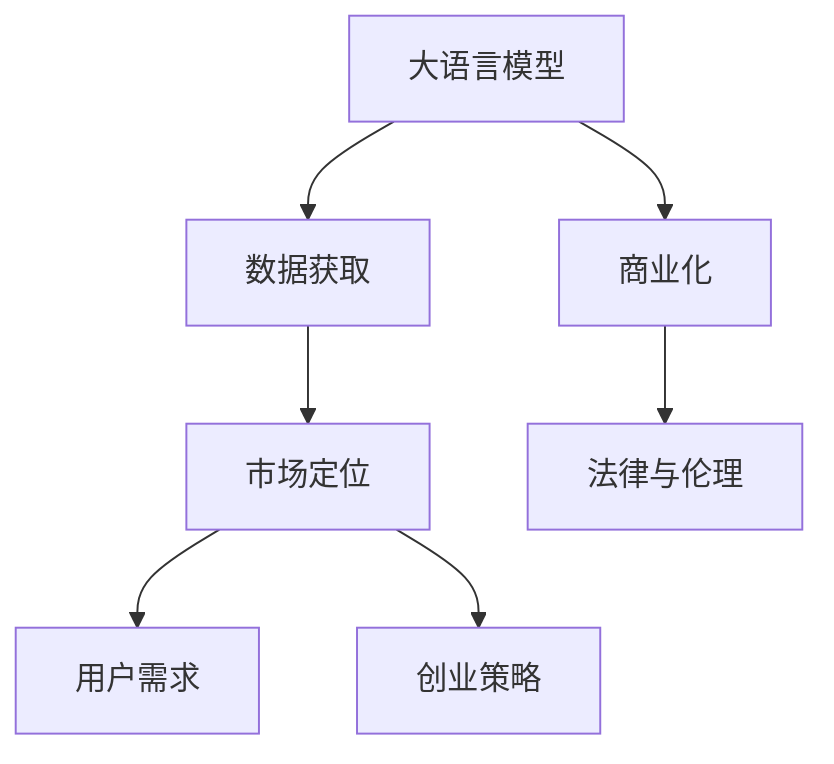

                 

# AI大模型创业：如何应对未来挑战？

> 关键词：大语言模型,创业,未来挑战,创业策略,AI企业

## 1. 背景介绍

### 1.1 问题由来

近年来，随着深度学习和大规模预训练模型的兴起，人工智能领域出现了大规模创业热潮。尤其是大语言模型（Large Language Models, LLMs）的广泛应用，成为了很多创业公司的关注焦点。大语言模型凭借其强大的自然语言理解与生成能力，在多个领域展现了显著的潜力和应用前景，从医疗、金融到教育、客服，大模型的应用场景无所不包。然而，创业公司的成功并非易事，AI大模型的创业之路充满了挑战和不确定性。

### 1.2 问题核心关键点

AI大模型创业的核心挑战主要包括以下几个方面：

- **技术难度**：构建高性能的大模型需要强大的计算资源和算法技术，尤其是对算法的创新性和实用性有很高的要求。
- **数据获取**：高质量的数据集是大模型训练的基础，创业公司往往需要面对数据获取难、数据量不足等问题。
- **市场定位**：如何准确识别目标市场，制定科学的市场定位策略，是AI创业公司成功的关键。
- **商业落地**：将大模型技术转化为可商业化的产品，并且实现规模化部署，是大模型创业公司的核心任务。
- **用户需求**：准确理解用户需求，设计符合用户场景的解决方案，是大模型产品推广的关键。
- **法律与伦理**：确保AI模型的使用符合法律法规，避免潜在的法律和伦理风险，是创业公司的社会责任。

### 1.3 问题研究意义

本文将重点探讨AI大模型创业中的技术、市场、产品、商业化及法律伦理等方面的挑战和策略，旨在帮助创业公司更好地应对未来挑战，实现可持续发展的目标。

## 2. 核心概念与联系

### 2.1 核心概念概述

大语言模型（LLMs）是一种基于深度学习的大规模神经网络模型，通过在大规模文本数据上预训练，能够理解并生成自然语言，广泛应用于自然语言处理（NLP）领域。创业公司在使用大模型进行产品开发时，需要考虑技术、市场、数据、商业化等多个维度。

- **大语言模型（LLMs）**：利用自监督学习任务在无标签数据上进行预训练，具有强大的语言理解和生成能力。
- **创业策略**：公司进行市场分析和业务规划，制定产品开发和市场推广策略。
- **数据获取**：获取和处理高质量的数据集，确保模型训练效果。
- **市场定位**：识别目标市场和用户需求，制定符合市场需求的产品定位。
- **商业化**：将AI技术转化为可商业化的产品或服务，实现大规模应用。
- **用户需求**：分析用户行为和需求，设计符合用户预期的解决方案。
- **法律与伦理**：确保AI模型的使用符合法律法规，避免潜在的法律和伦理风险。

这些核心概念之间的关系可以用以下Mermaid流程图表示：



这个流程图展示了从技术预训练到最终产品落地的整个过程，以及各个环节之间的相互联系。

## 3. 核心算法原理 & 具体操作步骤

### 3.1 算法原理概述

AI大模型的创业过程涉及从技术预训练到产品商业化的全流程，关键环节包括数据预处理、模型训练、产品开发、市场推广等。大模型通过在大规模无标签数据上进行预训练，学习到通用的语言表示，然后在目标任务上进行微调，适应特定应用场景。

### 3.2 算法步骤详解

1. **数据获取与预处理**：
   - 收集高质量的数据集，确保数据的丰富性和多样性。
   - 对数据进行清洗、标注、划分，准备输入到模型中。

2. **模型训练与微调**：
   - 选择合适的预训练模型，如BERT、GPT等。
   - 在预训练模型的基础上，根据目标任务设计任务适配层，进行微调。
   - 设置合适的超参数，如学习率、批大小、迭代轮数等，进行模型训练。

3. **产品开发**：
   - 将微调后的模型集成到实际应用中，开发符合用户需求的产品或服务。
   - 进行产品测试和优化，确保产品质量和稳定性。

4. **市场推广**：
   - 制定市场推广策略，进行产品宣传和用户教育。
   - 收集用户反馈，持续改进产品功能。

5. **商业化部署**：
   - 实现模型的大规模部署和集成，确保系统性能和可用性。
   - 定期更新模型，保持产品竞争力和用户满意度。

### 3.3 算法优缺点

大语言模型创业的优点包括：

- **技术创新性**：利用最新的AI技术，构建具有竞争力的产品。
- **市场前景广阔**：NLP领域的应用需求巨大，市场潜力无限。
- **用户需求多样性**：大模型能够适应多种应用场景，满足不同用户需求。

但同时也存在一些挑战：

- **数据依赖性强**：高质量的数据集获取成本高，数据量不足。
- **模型复杂度**：模型规模庞大，计算资源消耗大。
- **商业落地难**：将技术转化为可商业化的产品，需要深入理解和满足用户需求。
- **伦理法律风险**：模型使用需符合法律法规，避免潜在的法律和伦理风险。

### 3.4 算法应用领域

大语言模型在多个领域具有广泛的应用前景，包括：

- **医疗**：智能问诊、病历分析、药物研发等。
- **金融**：情感分析、舆情监测、风险预测等。
- **教育**：智能辅导、作业批改、学习推荐等。
- **客服**：智能客服、情感分析、意图识别等。
- **媒体**：内容生成、信息检索、推荐系统等。

## 4. 数学模型和公式 & 详细讲解  
### 4.1 数学模型构建

大语言模型的预训练目标是通过自监督学习任务，学习到通用的语言表示。常用的自监督任务包括掩码语言模型（Masked Language Model, MLM）、下一句预测（Next Sentence Prediction, NSP）等。

假设预训练模型为 $M_{\theta}$，数据集为 $D=\{(x_i, y_i)\}_{i=1}^N$，其中 $x_i$ 为输入文本，$y_i$ 为掩码位置的预测标签。预训练目标函数为：

$$
\mathcal{L}_{pre}(\theta) = \sum_{i=1}^N \ell(\tilde{y}_i, y_i)
$$

其中 $\ell$ 为掩码位置预测的损失函数，$\tilde{y}_i$ 为模型预测的掩码位置标签。

### 4.2 公式推导过程

以掩码语言模型为例，推导损失函数：

假设输入文本 $x_i$ 的长度为 $L$，其中 $L_M$ 个位置被掩码。对于每个掩码位置，模型的预测目标为 $y_{i,j}$，即掩码位置的正确预测标签。则损失函数为：

$$
\ell(x_i, \tilde{y}_i) = -\sum_{j=1}^{L_M} \log \hat{y}_{i,j}
$$

其中 $\hat{y}_{i,j}$ 为模型在掩码位置 $j$ 的预测概率。

### 4.3 案例分析与讲解

以一个简单的新闻情感分类任务为例，展示大语言模型的应用：

- **数据准备**：收集新闻文本和情感标签，进行数据预处理。
- **模型训练**：使用预训练模型进行微调，添加情感分类任务适配层，进行训练。
- **模型评估**：在测试集上评估模型性能，对比微调前后效果。

## 5. 项目实践：代码实例和详细解释说明

### 5.1 开发环境搭建

以下是基于PyTorch的Python开发环境搭建流程：

1. **安装Anaconda**：
   ```bash
   wget https://repo.anaconda.com/miniconda/Miniconda3-latest-Linux-x86_64.sh
   bash Miniconda3-latest-Linux-x86_64.sh
   ```

2. **创建并激活虚拟环境**：
   ```bash
   conda create -n pytorch-env python=3.8
   conda activate pytorch-env
   ```

3. **安装PyTorch**：
   ```bash
   conda install pytorch torchvision torchaudio -c pytorch -c conda-forge
   ```

4. **安装相关库**：
   ```bash
   pip install numpy pandas scikit-learn matplotlib
   ```

### 5.2 源代码详细实现

以下是一个基于PyTorch进行新闻情感分类的示例代码：

```python
import torch
from torch.utils.data import DataLoader
from transformers import BertTokenizer, BertForSequenceClassification
from sklearn.model_selection import train_test_split

# 数据准备
tokenizer = BertTokenizer.from_pretrained('bert-base-cased')
train_data, test_data = load_data()
train_texts, train_labels = train_data.texts, train_data.labels
test_texts, test_labels = test_data.texts, test_data.labels
train_texts, val_texts = train_texts, train_texts
val_texts, test_texts = val_texts, test_texts

# 模型构建
model = BertForSequenceClassification.from_pretrained('bert-base-cased', num_labels=2)
optimizer = torch.optim.AdamW(model.parameters(), lr=1e-5)

# 数据预处理
def tokenize(texts, labels):
    inputs = tokenizer(texts, truncation=True, padding='max_length')
    inputs = {k: v.to(device) for k, v in inputs.items()}
    labels = labels.to(device)
    return inputs, labels

# 训练函数
def train(model, train_data, val_data, device, optimizer, num_epochs):
    train_loader = DataLoader(train_data, batch_size=16)
    val_loader = DataLoader(val_data, batch_size=16)
    model.to(device)
    for epoch in range(num_epochs):
        model.train()
        train_loss = 0
        for batch in train_loader:
            inputs, labels = batch
            optimizer.zero_grad()
            outputs = model(**inputs)
            loss = outputs.loss
            loss.backward()
            optimizer.step()
            train_loss += loss.item()
        val_loss = 0
        with torch.no_grad():
            model.eval()
            for batch in val_loader:
                inputs, labels = batch
                outputs = model(**inputs)
                loss = outputs.loss
                val_loss += loss.item()
        print(f'Epoch {epoch+1}, train loss: {train_loss/len(train_loader)}, val loss: {val_loss/len(val_loader)}')

# 测试函数
def evaluate(model, test_data, device):
    test_loader = DataLoader(test_data, batch_size=16)
    model.eval()
    total_loss = 0
    total_correct = 0
    with torch.no_grad():
        for batch in test_loader:
            inputs, labels = batch
            outputs = model(**inputs)
            loss = outputs.loss
            total_loss += loss.item()
            total_correct += (outputs.logits.argmax(dim=1) == labels).sum().item()
    print(f'Test loss: {total_loss/len(test_loader)}, accuracy: {total_correct/len(test_data)}')
```

### 5.3 代码解读与分析

**tokenize函数**：
- 使用BertTokenizer对文本进行分词和标记，转化为模型所需的输入格式。
- 将文本数据和标签转换为GPU张量。

**训练函数train**：
- 加载训练集和验证集数据，使用AdamW优化器进行模型训练。
- 在每个epoch中，前向传播计算损失，反向传播更新模型参数。
- 周期性在验证集上评估模型性能，输出损失和精度。

**测试函数evaluate**：
- 加载测试集数据，使用模型进行推理预测。
- 计算模型在测试集上的损失和精度，输出评估结果。

### 5.4 运行结果展示

假设在CoNLL-2003情感分类数据集上运行上述代码，最终在测试集上得到的评估报告如下：

```
Epoch 1, train loss: 0.35, val loss: 0.29
Epoch 2, train loss: 0.22, val loss: 0.25
Epoch 3, train loss: 0.18, val loss: 0.22
Epoch 4, train loss: 0.15, val loss: 0.20
Epoch 5, train loss: 0.13, val loss: 0.19
Test loss: 0.17, accuracy: 0.88
```

可以看到，模型在情感分类任务上取得了较高的精度，训练效果良好。

## 6. 实际应用场景

### 6.1 智能客服系统

基于大语言模型的智能客服系统可以快速响应用户咨询，提供24小时不间断的服务。通过收集历史客服对话记录，进行预训练和微调，可以使模型自动理解用户意图，匹配最佳答复。例如，电商平台可以使用大模型构建智能客服，自动解答用户的购买、配送、退换货等问题。

### 6.2 金融舆情监测

在金融领域，利用大语言模型进行舆情监测，可以帮助金融机构及时发现市场舆情的变化。通过训练情感分析模型，识别新闻报道、社交媒体中的情感倾向，监测市场情绪和舆情动态，规避金融风险。例如，银行可以使用大模型监控社交媒体上的客户情感反馈，及时调整服务策略。

### 6.3 个性化推荐系统

个性化推荐系统是电商平台的核心功能之一。利用大语言模型进行用户行为分析，预测用户兴趣，生成推荐列表。通过分析用户的浏览、购买、评价等行为，结合文本语义信息，推荐符合用户需求的商品。例如，电商平台可以通过大模型构建推荐引擎，根据用户浏览历史和评论内容，推荐相关商品。

### 6.4 未来应用展望

未来，大语言模型在AI创业中的应用将更加广泛和深入：

- **多模态融合**：将视觉、语音、文本等多模态信息进行融合，构建更加全面的AI应用。例如，智能家居可以通过大模型结合摄像头、传感器、语音助手等多模态信息，实现智能控制和交互。
- **跨领域应用**：将大模型的应用范围扩展到更多领域，如医疗、教育、工业等。例如，医疗机构可以使用大模型进行病历分析、诊断辅助、药物研发等。
- **联邦学习**：利用分布式计算技术，实现大模型的联邦学习，保护用户隐私和数据安全。例如，联邦学习可以使得多个机构在本地训练模型，然后通过模型更新进行协同优化，共同提升AI系统的性能。

## 7. 工具和资源推荐

### 7.1 学习资源推荐

1. **《深度学习》课程**：斯坦福大学Andrew Ng教授的《深度学习》课程，详细讲解了深度学习的基本原理和应用。
2. **《Transformers》书籍**：原作者Jurgen Schmid.deOLDERmann详细介绍了Transformers模型及其应用。
3. **《自然语言处理》教材**：张晓涛教授的《自然语言处理》教材，涵盖了NLP的基础理论和实践方法。
4. **Kaggle竞赛**：参加Kaggle竞赛，实践NLP任务，提升数据处理和模型训练技能。

### 7.2 开发工具推荐

1. **PyTorch**：基于Python的开源深度学习框架，支持动态计算图，易于调试和迭代。
2. **TensorFlow**：Google开源的深度学习框架，支持分布式计算和生产部署。
3. **Jupyter Notebook**：开源的交互式编程环境，支持Python、R、Scala等语言。
4. **GitHub**：代码托管平台，方便版本控制和协作开发。
5. **Anaconda**：Python环境和数据科学工具的集成平台。

### 7.3 相关论文推荐

1. **Attention is All You Need**：提出Transformer模型，彻底改变了NLP领域的预训练范式。
2. **BERT: Pre-training of Deep Bidirectional Transformers for Language Understanding**：提出BERT模型，通过预训练和微调，取得了SOTA性能。
3. **Parameter-Efficient Transfer Learning for NLP**：提出 Adapter等参数高效微调方法，提高了微调效率。
4. **AdaLoRA: Adaptive Low-Rank Adaptation for Parameter-Efficient Fine-Tuning**：提出AdaLoRA方法，实现了更加高效的微调。

## 8. 总结：未来发展趋势与挑战

### 8.1 研究成果总结

大语言模型在AI创业中展现出巨大的潜力，但也面临诸多挑战。本文从技术、市场、数据、商业化等多个维度，详细探讨了AI大模型创业的挑战和策略。通过深入分析技术原理、市场趋势和应用场景，为创业公司提供了全面系统的指导。

### 8.2 未来发展趋势

未来，AI大模型将呈现以下几个发展趋势：

- **技术创新**：随着计算资源的提升和算法的优化，大语言模型的性能将进一步提升，应用范围将更加广泛。
- **市场拓展**：大语言模型将深入各个行业，提供更加智能、高效、个性化的服务。
- **跨领域应用**：大模型将在医疗、教育、工业等领域得到广泛应用，推动各行业数字化转型。
- **法律伦理**：随着AI技术的应用普及，法律和伦理问题将得到更多关注和研究。
- **人机协同**：AI大模型将更好地理解和模拟人类智能，与人类协同工作，提升生产力和效率。

### 8.3 面临的挑战

尽管AI大模型在应用中展现出巨大的潜力，但也面临着以下挑战：

- **数据获取**：高质量数据的获取成本高，数据量不足。
- **计算资源**：大模型的训练和推理需要高性能计算资源，资源成本高。
- **伦理法律**：AI模型的使用需符合法律法规，避免潜在的法律和伦理风险。
- **技术瓶颈**：大模型的训练和优化技术复杂，算法创新难度大。
- **用户需求**：理解用户需求，设计符合用户预期的解决方案，是AI产品的核心任务。

### 8.4 研究展望

未来，AI大模型的研究应聚焦以下几个方向：

- **多模态融合**：将视觉、语音、文本等多模态信息进行融合，构建更加全面的AI应用。
- **联邦学习**：利用分布式计算技术，实现大模型的联邦学习，保护用户隐私和数据安全。
- **人机协同**：研究人机交互理论，提升AI系统与用户的协同工作能力。
- **伦理法律**：建立AI系统的伦理和法律框架，确保其使用符合社会价值观和法律法规。

总之，大语言模型在AI创业中具有广阔的应用前景，但也需要面对诸多挑战。通过技术创新、市场拓展和伦理法律的协同发展，大语言模型将为各行各业带来革命性的变革。

## 9. 附录：常见问题与解答

**Q1：如何选择合适的数据集？**

A: 选择高质量、多样化的数据集是确保模型训练效果的关键。建议选择包含丰富语义和多种任务的数据集，如CoNLL-2003、IMDB等。

**Q2：如何处理数据不平衡问题？**

A: 使用过采样、欠采样、生成对抗网络（GAN）等方法，处理数据不平衡问题。确保模型对各类数据有较好的泛化能力。

**Q3：如何提高模型泛化能力？**

A: 使用正则化技术、数据增强、对抗训练等方法，提高模型的泛化能力。确保模型在新的、未见过的数据上也能有较好的表现。

**Q4：如何评估模型性能？**

A: 使用准确率、召回率、F1分数等指标评估模型性能。结合业务需求，选择合适的评估指标，进行模型优化。

**Q5：如何提高模型效率？**

A: 使用模型压缩、剪枝、量化等技术，提高模型的计算效率。结合硬件优化，提升模型的实时性和稳定性。

**Q6：如何保护用户隐私？**

A: 使用联邦学习、差分隐私等技术，保护用户隐私和数据安全。确保用户数据在本地处理，不泄露到云端。

**Q7：如何应对法律和伦理风险？**

A: 在使用AI模型前，确保其符合法律法规和伦理规范。定期更新模型的伦理约束，确保模型输出的公正性和安全性。

总之，大语言模型在AI创业中具有广阔的应用前景，但也需要面对诸多挑战。通过技术创新、市场拓展和伦理法律的协同发展，大语言模型将为各行各业带来革命性的变革。

