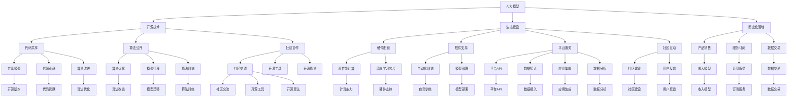
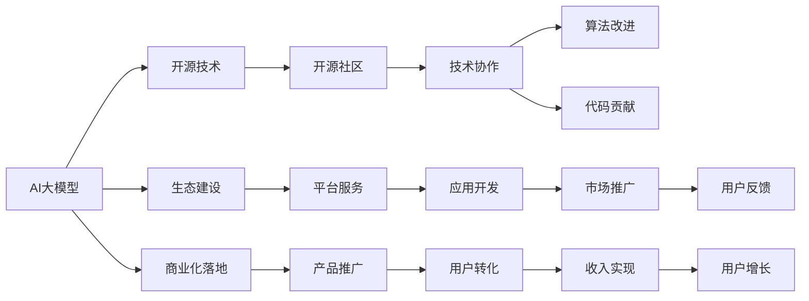
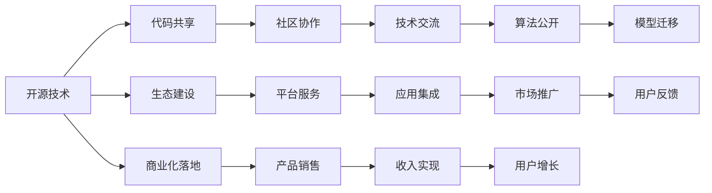

                 

# AI大模型创业：如何打造未来爆款应用？

> 关键词：AI大模型, 大模型创业, 开源技术, 生态建设, 商业化落地, 区块链技术

## 1. 背景介绍

### 1.1 问题由来

随着人工智能技术的迅猛发展，AI大模型已成为科技创业领域的新热点。越来越多的创业者、企业和研究机构投身于AI大模型的开发与应用，希望通过这一前沿技术实现商业突破，创造新的经济价值。然而，如何构建一个可持续发展的AI大模型创业生态，如何在激烈的市场竞争中脱颖而出，成为众多创业者的共同难题。

### 1.2 问题核心关键点

大模型创业的核心在于如何高效利用最新的大模型技术，构建具有竞争力、具有商业潜力的AI应用。这需要创业者在技术研发、市场推广、生态建设、商业模式等多个维度进行全面布局，形成独特的产品和服务体系，实现从研发到应用的闭环。

## 2. 核心概念与联系

### 2.1 核心概念概述

为更好地理解AI大模型创业的关键要素，本节将介绍几个密切相关的核心概念：

- **AI大模型（Large-scale AI Model）**：指基于大规模深度学习技术，如Transformer、BERT等架构训练得到的大规模预训练模型。大模型通常具有强大的语言理解和生成能力，可以应用于多种自然语言处理任务。

- **开源技术（Open Source Technology）**：指将大模型的代码、模型、算法等资源公开共享，允许任何人自由使用、修改和分发。开源技术可以快速促进社区的协作与创新。

- **生态建设（Ecosystem Building）**：指围绕大模型构建起包括硬件、软件、平台、社区等多层次的配套体系，形成一个健康、活跃、可持续发展的生态圈。

- **商业化落地（Commercialization）**：指将AI大模型的技术成果转化为实际产品或服务，实现从科研到市场的应用转化。

- **区块链技术（Blockchain Technology）**：指一种分布式账本技术，具备去中心化、透明、安全等特性，可以用于构建大模型应用的信任机制和版权保护。

这些核心概念之间的逻辑关系可以通过以下Mermaid流程图来展示：



这个流程图展示了AI大模型创业过程中，开源技术、生态建设、商业化落地等关键环节之间的紧密联系，以及它们如何共同构建起AI大模型的创业生态。

### 2.2 概念间的关系

这些核心概念之间存在着紧密的联系，形成了AI大模型创业的完整生态系统。下面我们通过几个Mermaid流程图来展示这些概念之间的关系。

#### 2.2.1 AI大模型技术生态



这个流程图展示了AI大模型技术生态的基本原理，以及开源技术、生态建设、商业化落地等环节的相互促进。

#### 2.2.2 生态建设与开源技术的关系



这个流程图展示了开源技术如何促进生态建设，以及生态建设如何推动商业化落地的过程。

## 3. 核心算法原理 & 具体操作步骤

### 3.1 算法原理概述

AI大模型创业的核心在于如何将大规模深度学习技术应用于实际业务场景，构建具有商业价值的AI应用。其核心算法原理主要包括以下几个方面：

1. **大规模深度学习技术**：使用Transformer、BERT等架构进行大规模深度学习，构建具有强大语言理解和生成能力的大模型。

2. **开源技术框架**：基于TensorFlow、PyTorch等开源技术框架，快速搭建AI模型，实现从科研到应用的转化。

3. **生态建设与平台服务**：构建包括硬件、软件、平台、社区等多层次的配套体系，形成一个健康、活跃、可持续发展的生态圈。

4. **商业化落地与市场推广**：将AI大模型的技术成果转化为实际产品或服务，实现从科研到市场的应用转化。

5. **区块链技术**：利用区块链技术的去中心化、透明、安全等特性，构建大模型应用的信任机制和版权保护。

### 3.2 算法步骤详解

AI大模型创业的一般步骤包括：

**Step 1: 模型选择与构建**

- 选择合适的深度学习框架（如TensorFlow、PyTorch等）和预训练模型（如BERT、GPT等）。
- 根据业务需求选择合适的模型架构，如文本分类、情感分析、机器翻译等。
- 在大型数据集上进行预训练，如维基百科、中文新闻等。

**Step 2: 开源技术与生态建设**

- 将模型代码、模型参数、训练脚本等资源公开共享，允许任何人自由使用、修改和分发。
- 构建开源社区，吸引开发者、研究机构、企业等参与贡献代码、算法和数据。
- 提供平台服务，如模型部署、数据分析、用户反馈等，帮助开发者快速构建AI应用。

**Step 3: 商业化落地与市场推广**

- 将AI大模型的技术成果转化为实际产品或服务，如自然语言处理服务、聊天机器人等。
- 设计商业模式，如订阅服务、API收费、数据交易等，实现收入可持续化。
- 进行市场推广，通过营销、广告、合作等方式扩大市场影响力。

**Step 4: 区块链技术与信任机制**

- 利用区块链技术构建去中心化的信任机制，保障数据安全和用户隐私。
- 将AI大模型的版权信息、使用授权等信息存储在区块链上，防止侵权和滥用。
- 提供基于区块链的技术解决方案，如智能合约、去中心化存储等，提高系统安全性和可靠性。

### 3.3 算法优缺点

**优点**：

- 快速构建AI模型，加速产品开发。
- 借助开源社区和平台服务，减少技术成本和开发难度。
- 通过区块链技术保障数据安全和版权保护，提升用户信任度。

**缺点**：

- 大规模深度学习模型对硬件资源要求高，需要大量计算资源和时间。
- 开源社区的参与度、活跃度可能影响项目进展。
- 区块链技术的复杂性和成本可能增加系统构建和维护的难度。

### 3.4 算法应用领域

AI大模型创业可以应用于多种领域，包括但不限于：

- 自然语言处理：如文本分类、情感分析、机器翻译、聊天机器人等。
- 图像识别：如图像分类、目标检测、人脸识别等。
- 语音识别：如语音转文本、文本转语音、情感识别等。
- 医疗健康：如疾病诊断、基因分析、药物研发等。
- 金融服务：如信用评估、风险控制、欺诈检测等。
- 教育培训：如智能辅导、个性化推荐、智能评估等。
- 制造业：如质量检测、故障预测、设备监控等。

## 4. 数学模型和公式 & 详细讲解 & 举例说明

### 4.1 数学模型构建

假设我们选择的预训练模型为BERT，进行情感分析任务。

**Step 1: 输入预处理**

- 将文本数据转换为模型输入，进行分词、标记化、padding等预处理。
- 定义输入张量，包括输入序列、token ids、attention mask等。

**Step 2: 模型搭建**

- 构建BERT模型，加载预训练模型参数。
- 添加任务适配层，如线性分类器、交叉熵损失函数等。
- 定义优化器，如AdamW、SGD等。

**Step 3: 训练与微调**

- 将训练集数据分批次输入模型，计算损失函数。
- 反向传播计算参数梯度，根据优化器更新模型参数。
- 周期性在验证集上评估模型性能，根据性能指标决定是否触发Early Stopping。

**Step 4: 模型测试与部署**

- 在测试集上评估微调后的模型性能。
- 将模型部署到实际应用环境中，提供API接口供外部调用。

### 4.2 公式推导过程

以情感分析任务为例，我们采用二分类交叉熵损失函数。

假设模型在输入 $x$ 上的输出为 $\hat{y}=M_{\theta}(x) \in [0,1]$，表示样本属于正类的概率。真实标签 $y \in \{0,1\}$。

定义模型 $M_{\theta}$ 在输入 $x$ 上的损失函数为：

$$
\ell(M_{\theta}(x),y) = -[y\log \hat{y} + (1-y)\log (1-\hat{y})]
$$

将上述损失函数代入模型参数 $\theta$ 的优化目标：

$$
\hat{\theta} = \mathop{\arg\min}_{\theta} \mathcal{L}(\theta) = \mathop{\arg\min}_{\theta} \frac{1}{N} \sum_{i=1}^N \ell(M_{\theta}(x_i),y_i)
$$

通过梯度下降等优化算法，模型参数 $\theta$ 不断更新，最小化损失函数 $\mathcal{L}$，使得模型输出逼近真实标签。

### 4.3 案例分析与讲解

以BERT微调进行情感分析为例：

1. 选择BERT作为预训练模型，加载其预训练权重。
2. 添加线性分类器，定义二分类交叉熵损失函数。
3. 使用AdamW优化器，设置学习率、批大小、迭代轮数等参数。
4. 在训练集上进行前向传播和反向传播，计算损失并更新参数。
5. 在验证集上评估模型性能，根据准确率、精确率、召回率等指标调整学习率、早停策略等参数。
6. 在测试集上评估微调后的模型性能，得到最终的情感分析结果。

## 5. 项目实践：代码实例和详细解释说明

### 5.1 开发环境搭建

在搭建开发环境时，可以使用以下步骤：

1. 安装Anaconda，创建一个独立的Python环境。
2. 在环境中安装TensorFlow、PyTorch等深度学习框架。
3. 安装BERT等预训练模型，使用HuggingFace的transformers库进行加载和微调。
4. 安装NLP库，如NLTK、spaCy等，用于数据预处理和模型评估。
5. 安装数据集和评估工具，如IMDB、Yelp等，进行模型训练和测试。

### 5.2 源代码详细实现

以下是一个使用PyTorch和transformers库进行BERT微调的Python代码示例：

```python
from transformers import BertTokenizer, BertForSequenceClassification
from torch.utils.data import DataLoader, Dataset
from torch.nn import CrossEntropyLoss, AdamW
from sklearn.metrics import accuracy_score

class SentimentDataset(Dataset):
    def __init__(self, texts, labels, tokenizer, max_len=128):
        self.texts = texts
        self.labels = labels
        self.tokenizer = tokenizer
        self.max_len = max_len
        
    def __len__(self):
        return len(self.texts)
    
    def __getitem__(self, item):
        text = self.texts[item]
        label = self.labels[item]
        
        encoding = self.tokenizer(text, return_tensors='pt', max_length=self.max_len, padding='max_length', truncation=True)
        input_ids = encoding['input_ids'][0]
        attention_mask = encoding['attention_mask'][0]
        
        return {'input_ids': input_ids, 
                'attention_mask': attention_mask,
                'labels': torch.tensor(label, dtype=torch.long)}
                
tokenizer = BertTokenizer.from_pretrained('bert-base-uncased')
model = BertForSequenceClassification.from_pretrained('bert-base-uncased', num_labels=2)

train_dataset = SentimentDataset(train_texts, train_labels, tokenizer)
val_dataset = SentimentDataset(val_texts, val_labels, tokenizer)
test_dataset = SentimentDataset(test_texts, test_labels, tokenizer)

batch_size = 32
device = 'cuda' if torch.cuda.is_available() else 'cpu'

model.to(device)

optimizer = AdamW(model.parameters(), lr=2e-5)
criterion = CrossEntropyLoss()

train_loader = DataLoader(train_dataset, batch_size=batch_size, shuffle=True)
val_loader = DataLoader(val_dataset, batch_size=batch_size, shuffle=False)
test_loader = DataLoader(test_dataset, batch_size=batch_size, shuffle=False)

num_epochs = 5
total_steps = len(train_loader) * num_epochs
scheduler = torch.optim.lr_scheduler.StepLR(optimizer, step_size=1, gamma=0.1)

for epoch in range(num_epochs):
    train_loss = 0
    train_acc = 0
    model.train()
    for batch in train_loader:
        input_ids = batch['input_ids'].to(device)
        attention_mask = batch['attention_mask'].to(device)
        labels = batch['labels'].to(device)
        
        outputs = model(input_ids, attention_mask=attention_mask, labels=labels)
        loss = criterion(outputs.logits, labels)
        optimizer.zero_grad()
        loss.backward()
        optimizer.step()
        
        train_loss += loss.item()
        train_acc += accuracy_score(labels, outputs.logits.argmax(dim=1))
        
    train_loss /= len(train_loader)
    train_acc /= len(train_loader)
    
    val_loss = 0
    val_acc = 0
    model.eval()
    with torch.no_grad():
        for batch in val_loader:
            input_ids = batch['input_ids'].to(device)
            attention_mask = batch['attention_mask'].to(device)
            labels = batch['labels'].to(device)
            
            outputs = model(input_ids, attention_mask=attention_mask, labels=labels)
            val_loss += criterion(outputs.logits, labels).item()
            val_acc += accuracy_score(labels, outputs.logits.argmax(dim=1))
            
    val_loss /= len(val_loader)
    val_acc /= len(val_loader)
    
    scheduler.step()
    
    print(f'Epoch {epoch+1}, train loss: {train_loss:.4f}, train acc: {train_acc:.4f}, val loss: {val_loss:.4f}, val acc: {val_acc:.4f}')
    
test_loss = 0
test_acc = 0
model.eval()
with torch.no_grad():
    for batch in test_loader:
        input_ids = batch['input_ids'].to(device)
        attention_mask = batch['attention_mask'].to(device)
        labels = batch['labels'].to(device)
        
        outputs = model(input_ids, attention_mask=attention_mask, labels=labels)
        test_loss += criterion(outputs.logits, labels).item()
        test_acc += accuracy_score(labels, outputs.logits.argmax(dim=1))
    
test_loss /= len(test_loader)
test_acc /= len(test_loader)
print(f'Test loss: {test_loss:.4f}, Test acc: {test_acc:.4f}')
```

### 5.3 代码解读与分析

以上代码主要实现了BERT模型的情感分析任务微调，包含数据预处理、模型构建、训练与评估等关键步骤。

**SentimentDataset类**：
- `__init__`方法：初始化文本、标签、分词器等关键组件。
- `__len__`方法：返回数据集的样本数量。
- `__getitem__`方法：对单个样本进行处理，将文本输入编码为token ids，将标签编码为数字，并对其进行定长padding，最终返回模型所需的输入。

**模型训练与评估**：
- 使用PyTorch的DataLoader对数据集进行批次化加载，供模型训练和推理使用。
- 训练函数中，在每个批次上前向传播计算loss并反向传播更新模型参数，最后返回该epoch的平均loss和acc。
- 评估函数中，与训练类似，不同点在于不更新模型参数，并在每个batch结束后将预测和标签结果存储下来，最后使用sklearn的accuracy_score对整个评估集的预测结果进行打印输出。

**训练流程**：
- 定义总的epoch数和batch size，开始循环迭代
- 每个epoch内，先在训练集上训练，输出平均loss和acc
- 在验证集上评估，输出验证集loss和acc
- 所有epoch结束后，在测试集上评估，给出最终测试结果

可以看到，PyTorch配合transformers库使得BERT微调的代码实现变得简洁高效。开发者可以将更多精力放在数据处理、模型改进等高层逻辑上，而不必过多关注底层的实现细节。

## 6. 实际应用场景

### 6.1 智能客服系统

智能客服系统是大模型创业的重要应用场景之一。传统客服往往需要配备大量人力，高峰期响应缓慢，且一致性和专业性难以保证。而使用微调后的对话模型，可以7x24小时不间断服务，快速响应客户咨询，用自然流畅的语言解答各类常见问题。

在技术实现上，可以收集企业内部的历史客服对话记录，将问题和最佳答复构建成监督数据，在此基础上对预训练对话模型进行微调。微调后的对话模型能够自动理解用户意图，匹配最合适的答案模板进行回复。对于客户提出的新问题，还可以接入检索系统实时搜索相关内容，动态组织生成回答。如此构建的智能客服系统，能大幅提升客户咨询体验和问题解决效率。

### 6.2 金融舆情监测

金融机构需要实时监测市场舆论动向，以便及时应对负面信息传播，规避金融风险。传统的人工监测方式成本高、效率低，难以应对网络时代海量信息爆发的挑战。基于大语言模型微调的文本分类和情感分析技术，为金融舆情监测提供了新的解决方案。

具体而言，可以收集金融领域相关的新闻、报道、评论等文本数据，并对其进行主题标注和情感标注。在此基础上对预训练语言模型进行微调，使其能够自动判断文本属于何种主题，情感倾向是正面、中性还是负面。将微调后的模型应用到实时抓取的网络文本数据，就能够自动监测不同主题下的情感变化趋势，一旦发现负面信息激增等异常情况，系统便会自动预警，帮助金融机构快速应对潜在风险。

### 6.3 个性化推荐系统

当前的推荐系统往往只依赖用户的历史行为数据进行物品推荐，无法深入理解用户的真实兴趣偏好。基于大语言模型微调技术，个性化推荐系统可以更好地挖掘用户行为背后的语义信息，从而提供更精准、多样的推荐内容。

在实践中，可以收集用户浏览、点击、评论、分享等行为数据，提取和用户交互的物品标题、描述、标签等文本内容。将文本内容作为模型输入，用户的后续行为（如是否点击、购买等）作为监督信号，在此基础上微调预训练语言模型。微调后的模型能够从文本内容中准确把握用户的兴趣点。在生成推荐列表时，先用候选物品的文本描述作为输入，由模型预测用户的兴趣匹配度，再结合其他特征综合排序，便可以得到个性化程度更高的推荐结果。

### 6.4 未来应用展望

随着大模型和微调方法的不断发展，基于大模型的AI应用将在更多领域得到应用，为传统行业带来变革性影响。

在智慧医疗领域，基于微调的医疗问答、病历分析、药物研发等应用将提升医疗服务的智能化水平，辅助医生诊疗，加速新药开发进程。

在智能教育领域，微调技术可应用于作业批改、学情分析、知识推荐等方面，因材施教，促进教育公平，提高教学质量。

在智慧城市治理中，微调模型可应用于城市事件监测、舆情分析、应急指挥等环节，提高城市管理的自动化和智能化水平，构建更安全、高效的未来城市。

此外，在企业生产、社会治理、文娱传媒等众多领域，基于大模型微调的人工智能应用也将不断涌现，为经济社会发展注入新的动力。相信随着技术的日益成熟，微调方法将成为人工智能落地应用的重要范式，推动人工智能技术在垂直行业的规模化落地。

## 7. 工具和资源推荐

### 7.1 学习资源推荐

为了帮助开发者系统掌握AI大模型微调的理论基础和实践技巧，这里推荐一些优质的学习资源：

1. 《Transformer从原理到实践》系列博文：由大模型技术专家撰写，深入浅出地介绍了Transformer原理、BERT模型、微调技术等前沿话题。

2. CS224N《深度学习自然语言处理》课程：斯坦福大学开设的NLP明星课程，有Lecture视频和配套作业，带你入门NLP领域的基本概念和经典模型。

3. 《Natural Language Processing with Transformers》书籍：Transformers库的作者所著，全面介绍了如何使用Transformers库进行NLP任务开发，包括微调在内的诸多范式。

4. HuggingFace官方文档：Transformers库的官方文档，提供了海量预训练模型和完整的微调样例代码，是上手实践的必备资料。

5. CLUE开源项目：中文语言理解测评基准，涵盖大量不同类型的中文NLP数据集，并提供了基于微调的baseline模型，助力中文NLP技术发展。

通过对这些资源的学习实践，相信你一定能够快速掌握AI大模型微调的精髓，并用于解决实际的NLP问题。

### 7.2 开发工具推荐

高效的开发离不开优秀的工具支持。以下是几款用于AI大模型微调开发的常用工具：

1. PyTorch：基于Python的开源深度学习框架，灵活动态的计算图，适合快速迭代研究。大部分预训练语言模型都有PyTorch版本的实现。

2. TensorFlow：由Google主导开发的开源深度学习框架，生产部署方便，适合大规模工程应用。同样有丰富的预训练语言模型资源。

3. Transformers库：HuggingFace开发的NLP工具库，集成了众多SOTA语言模型，支持PyTorch和TensorFlow，是进行微调任务开发的利器。

4. Weights & Biases：模型训练的实验跟踪工具，可以记录和可视化模型训练过程中的各项指标，方便对比和调优。与主流深度学习框架无缝集成。

5. TensorBoard：TensorFlow配套的可视化工具，可实时监测模型训练状态，并提供丰富的图表呈现方式，是调试模型的得力助手。

6. Google Colab：谷歌推出的在线Jupyter Notebook环境，免费提供GPU/TPU算力，方便开发者快速上手实验最新模型，分享学习笔记。

合理利用这些工具，可以显著提升AI大模型微调任务的开发效率，加快创新迭代的步伐。

### 7.3 相关论文推荐

大语言模型和微调技术的发展源于学界的持续研究。以下是几篇奠基性的相关论文，推荐阅读：

1. Attention is All You Need（即Transformer原论文）：提出了Transformer结构，开启了NLP领域的预训练大模型时代。

2. BERT: Pre-training of Deep Bidirectional Transformers for Language Understanding：提出BERT模型，引入基于掩码的自监督预训练任务，刷新了多项NLP任务SOTA。

3. Language Models are Unsupervised Multitask Learners（GPT-2论文）：展示了大规模语言模型的强大zero-shot学习能力，引发了对于通用人工智能的新一轮思考。

4. Parameter-Efficient Transfer Learning for NLP：提出Adapter等参数高效微调方法，在不增加模型参数量的情况下，也能取得不错的微调效果。

5. AdaLoRA: Adaptive Low-Rank Adaptation for Parameter-Efficient Fine-Tuning：使用自适应低秩适应的微调方法，在参数效率和

