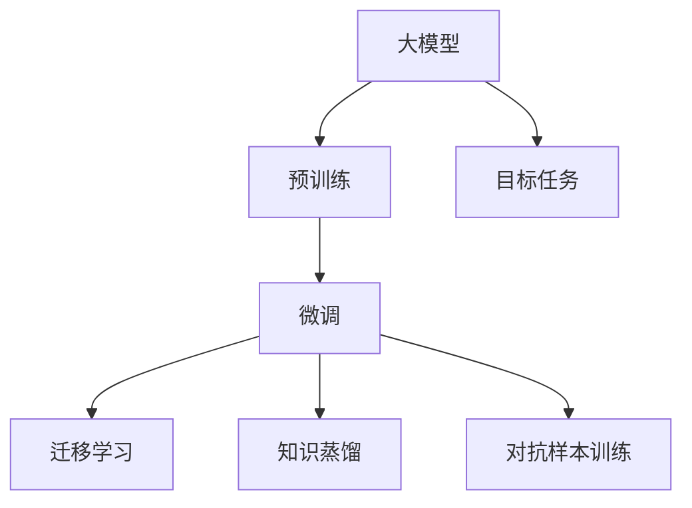
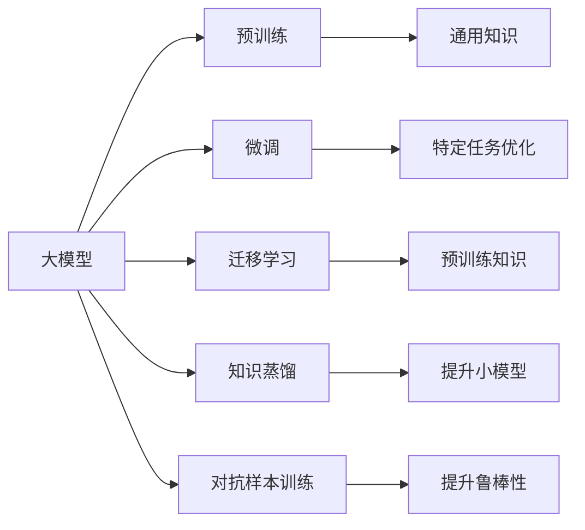
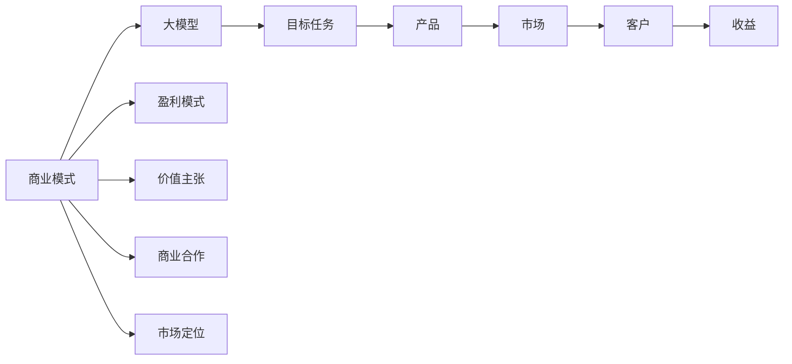
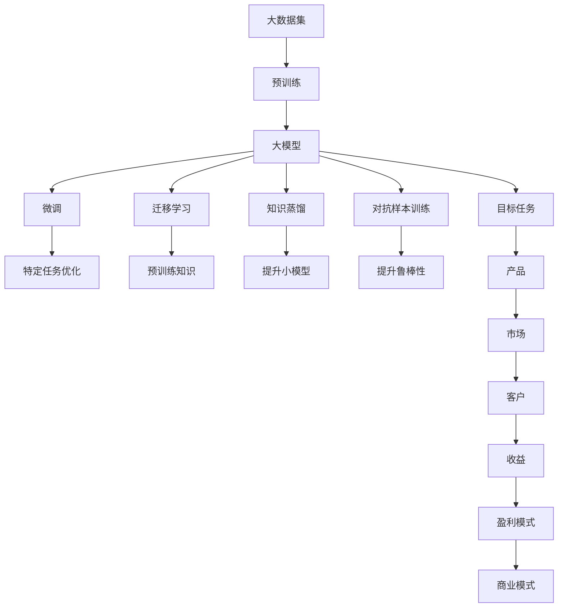

                 

# AI大模型创业：如何构建未来可持续的商业模式？

在大数据、人工智能和云计算等技术的推动下，大模型创业成为当前最热门的领域之一。大模型在医疗、教育、金融、娱乐等领域的广泛应用，为创业者提供了巨大的商机。然而，如何构建一个可持续的商业模式，是大模型创业成功的关键。本文将从大模型的优势、商业机会、商业模式设计以及面临的挑战等方面进行详细探讨，帮助创业者和投资者更好地把握大模型创业的机会。

## 1. 背景介绍

### 1.1 问题由来

人工智能(AI)和深度学习技术的发展，使得大模型在图像识别、语音识别、自然语言处理等领域取得了突破性进展。大模型通常是指参数量达数亿甚至数十亿的深度神经网络模型，例如GPT-3、BERT等。这些模型通过在大规模数据集上进行预训练，能够学习到复杂的语义和模式，具备强大的泛化能力和迁移学习能力。大模型的优势在于，它们可以在各种任务上快速达到或超越人类专家的水平，从而为各行各业提供智能化解决方案。

大模型的应用不仅提升了工作效率，降低了运营成本，还开创了新的商业模式和商业模式。但与此同时，大模型创业也面临着高成本、高风险和市场竞争激烈等问题。因此，构建一个可持续的商业模式，是大模型创业成功的关键。

### 1.2 问题核心关键点

构建大模型创业可持续商业模式的核心关键点包括：
- 如何选择合适的市场定位和目标客户群。
- 如何利用大模型的优势，提升产品的核心竞争力。
- 如何构建有效的盈利模式，实现商业化运营。
- 如何应对市场竞争和技术迭代，保持长期可持续发展。

## 2. 核心概念与联系

### 2.1 核心概念概述

为更好地理解大模型创业的商业模式设计，本节将介绍几个密切相关的核心概念：

- 大模型：指参数量达数亿甚至数十亿的深度神经网络模型，例如GPT-3、BERT等。
- 预训练：指在大规模数据集上进行自监督学习，训练模型学习通用的语言表示。
- 微调：指在预训练模型基础上，利用小规模标注数据进行有监督学习，提升模型在特定任务上的性能。
- 迁移学习：指在大规模数据集上进行预训练，然后在特定任务上进行微调，利用预训练知识提升模型性能。
- 知识蒸馏：指通过小模型学习大模型的知识，从而提升小模型性能。
- 对抗样本训练：指通过加入对抗样本，提升模型的鲁棒性和泛化能力。

这些核心概念之间的逻辑关系可以通过以下Mermaid流程图来展示：



这个流程图展示了大模型创业中各个核心概念之间的关系：

1. 大模型通过预训练获得通用知识。
2. 微调在大模型基础上，针对特定任务进行优化。
3. 迁移学习在大模型基础上，利用预训练知识提升模型性能。
4. 知识蒸馏通过小模型学习大模型的知识，提升小模型性能。
5. 对抗样本训练通过加入对抗样本，提升模型鲁棒性和泛化能力。

这些概念共同构成了大模型创业的完整生态系统，使得大模型能够在各种场景下发挥强大的能力。

### 2.2 概念间的关系

这些核心概念之间存在着紧密的联系，形成了大模型创业的完整生态系统。下面我通过几个Mermaid流程图来展示这些概念之间的关系。

#### 2.2.1 大模型的学习范式



这个流程图展示了大模型的三种主要学习范式：预训练、微调和迁移学习。预训练主要采用自监督学习方法，微调和迁移学习则是有监督学习方法。这些方法可以相辅相成，提高大模型在特定任务上的性能。

#### 2.2.2 商业模式与大模型应用的关系



这个流程图展示了商业模式与大模型应用之间的关系：

1. 大模型通过预训练和微调，获得特定任务上的性能提升。
2. 根据目标任务设计产品，满足市场需求。
3. 通过市场和客户反馈，持续优化商业模式和产品。
4. 通过盈利模式和商业合作，实现商业化运营。
5. 市场定位决定产品的市场推广策略。
6. 价值主张吸引客户，提升品牌竞争力。

### 2.3 核心概念的整体架构

最后，我们用一个综合的流程图来展示这些核心概念在大模型创业中的整体架构：



这个综合流程图展示了从数据预处理到最终商业化的完整过程。大模型通过在大数据集上进行预训练，获得通用的语言表示。然后通过微调和迁移学习，提升模型在特定任务上的性能。知识蒸馏和对抗样本训练进一步提升模型的质量和鲁棒性。最终，将大模型应用于目标任务，设计出满足市场需求的创新产品，并通过盈利模式和商业模式实现商业化运营。

## 3. 核心算法原理 & 具体操作步骤

### 3.1 算法原理概述

大模型创业的核心算法原理是大模型预训练和微调。预训练通过在大规模无标签数据集上进行自监督学习，训练大模型学习通用的语言表示。微调则是在预训练模型的基础上，利用小规模标注数据进行有监督学习，提升模型在特定任务上的性能。

大模型的预训练过程一般包括自回归语言模型、掩码语言模型、句子嵌入等自监督学习任务。这些任务通过最大化语言模型的概率，训练模型学习语言的基本规律和语义关系。预训练后的模型可以在各种任务上进行微调，例如文本分类、情感分析、问答系统等。

### 3.2 算法步骤详解

大模型创业的算法步骤一般包括以下几个关键步骤：

**Step 1: 数据准备**

1. 收集大规模无标签数据集，进行预训练。
2. 根据目标任务收集小规模标注数据集，进行微调。

**Step 2: 构建大模型**

1. 选择合适的预训练模型，例如GPT-3、BERT等。
2. 设计合适的模型架构，例如Transformer、BERT等。
3. 在大规模数据集上进行预训练。

**Step 3: 微调**

1. 根据目标任务，设计合适的任务适配层。
2. 利用小规模标注数据集，进行有监督学习。
3. 调整模型参数，最小化损失函数。

**Step 4: 部署**

1. 将微调后的模型部署到生产环境中。
2. 提供API接口，供其他系统调用。
3. 持续监控模型性能，进行优化和更新。

**Step 5: 市场推广**

1. 设计合适的市场推广策略。
2. 通过合作伙伴、广告等方式进行市场推广。
3. 收集客户反馈，优化产品和服务。

### 3.3 算法优缺点

大模型创业的算法优点包括：

1. 快速提升模型性能。通过微调，大模型能够在短时间内达到或超越人类专家的水平，快速提升产品性能。
2. 广泛适用。大模型可以应用于各种NLP任务，例如文本分类、情感分析、问答系统等。
3. 灵活性高。通过微调和迁移学习，大模型可以灵活适应不同任务和领域。

大模型创业的算法缺点包括：

1. 高成本。预训练和微调需要大量的计算资源和标注数据，成本较高。
2. 模型风险。大模型的性能依赖于数据质量和训练过程，存在一定的风险。
3. 市场竞争激烈。大模型创业领域竞争激烈，需要不断创新和优化。

### 3.4 算法应用领域

大模型创业的算法广泛应用于以下领域：

1. 医疗领域：利用大模型进行疾病诊断、药品推荐、健康管理等。
2. 教育领域：利用大模型进行智能教学、学习辅助、个性化推荐等。
3. 金融领域：利用大模型进行风险评估、信用评估、智能投顾等。
4. 娱乐领域：利用大模型进行内容生成、推荐、智能互动等。

## 4. 数学模型和公式 & 详细讲解

### 4.1 数学模型构建

本节将使用数学语言对大模型创业的算法过程进行更加严格的刻画。

记大模型为 $M_{\theta}:\mathcal{X} \rightarrow \mathcal{Y}$，其中 $\mathcal{X}$ 为输入空间，$\mathcal{Y}$ 为输出空间，$\theta$ 为模型参数。假设目标任务为分类任务，则输出空间 $\mathcal{Y}=\{0,1\}$。

定义模型 $M_{\theta}$ 在输入 $x$ 上的输出为 $\hat{y}=M_{\theta}(x) \in [0,1]$，表示样本属于正类的概率。真实标签 $y \in \{0,1\}$。则二分类交叉熵损失函数定义为：

$$
\ell(M_{\theta}(x),y) = -[y\log \hat{y} + (1-y)\log (1-\hat{y})]
$$

将 $N$ 个样本的损失函数求和，得到总损失函数 $\mathcal{L}$：

$$
\mathcal{L}(\theta) = -\frac{1}{N}\sum_{i=1}^N [y_i\log M_{\theta}(x_i)+(1-y_i)\log(1-M_{\theta}(x_i))]
$$

在得到损失函数 $\mathcal{L}$ 后，可以使用基于梯度的优化算法（如AdamW、SGD等）来近似求解上述最优化问题。设 $\eta$ 为学习率，则参数的更新公式为：

$$
\theta \leftarrow \theta - \eta \nabla_{\theta}\mathcal{L}(\theta)
$$

其中 $\nabla_{\theta}\mathcal{L}(\theta)$ 为损失函数对参数 $\theta$ 的梯度，可通过反向传播算法高效计算。

### 4.2 公式推导过程

以下我们以二分类任务为例，推导交叉熵损失函数及其梯度的计算公式。

假设模型 $M_{\theta}$ 在输入 $x$ 上的输出为 $\hat{y}=M_{\theta}(x) \in [0,1]$，表示样本属于正类的概率。真实标签 $y \in \{0,1\}$。则二分类交叉熵损失函数定义为：

$$
\ell(M_{\theta}(x),y) = -[y\log \hat{y} + (1-y)\log (1-\hat{y})]
$$

将其代入总损失函数，得：

$$
\mathcal{L}(\theta) = -\frac{1}{N}\sum_{i=1}^N [y_i\log M_{\theta}(x_i)+(1-y_i)\log(1-M_{\theta}(x_i))]
$$

根据链式法则，损失函数对参数 $\theta_k$ 的梯度为：

$$
\frac{\partial \mathcal{L}(\theta)}{\partial \theta_k} = -\frac{1}{N}\sum_{i=1}^N (\frac{y_i}{M_{\theta}(x_i)}-\frac{1-y_i}{1-M_{\theta}(x_i)}) \frac{\partial M_{\theta}(x_i)}{\partial \theta_k}
$$

其中 $\frac{\partial M_{\theta}(x_i)}{\partial \theta_k}$ 可进一步递归展开，利用自动微分技术完成计算。

在得到损失函数的梯度后，即可带入参数更新公式，完成模型的迭代优化。重复上述过程直至收敛，最终得到适应目标任务的最优模型参数 $\theta^*$。

## 5. 项目实践：代码实例和详细解释说明

### 5.1 开发环境搭建

在进行大模型创业项目开发前，我们需要准备好开发环境。以下是使用Python进行PyTorch开发的环境配置流程：

1. 安装Anaconda：从官网下载并安装Anaconda，用于创建独立的Python环境。

2. 创建并激活虚拟环境：
```bash
conda create -n pytorch-env python=3.8 
conda activate pytorch-env
```

3. 安装PyTorch：根据CUDA版本，从官网获取对应的安装命令。例如：
```bash
conda install pytorch torchvision torchaudio cudatoolkit=11.1 -c pytorch -c conda-forge
```

4. 安装Transformers库：
```bash
pip install transformers
```

5. 安装各类工具包：
```bash
pip install numpy pandas scikit-learn matplotlib tqdm jupyter notebook ipython
```

完成上述步骤后，即可在`pytorch-env`环境中开始项目开发。

### 5.2 源代码详细实现

这里以医疗领域的疾病诊断任务为例，给出使用Transformers库对BERT模型进行微调的PyTorch代码实现。

首先，定义疾病诊断任务的数据处理函数：

```python
from transformers import BertTokenizer
from torch.utils.data import Dataset
import torch

class DiseaseDataset(Dataset):
    def __init__(self, texts, labels, tokenizer, max_len=128):
        self.texts = texts
        self.labels = labels
        self.tokenizer = tokenizer
        self.max_len = max_len
        
    def __len__(self):
        return len(self.texts)
    
    def __getitem__(self, item):
        text = self.texts[item]
        label = self.labels[item]
        
        encoding = self.tokenizer(text, return_tensors='pt', max_length=self.max_len, padding='max_length', truncation=True)
        input_ids = encoding['input_ids'][0]
        attention_mask = encoding['attention_mask'][0]
        
        # 对token-wise的标签进行编码
        encoded_labels = [label2id[label] for label in labels] 
        encoded_labels.extend([label2id['negative']] * (self.max_len - len(encoded_labels)))
        labels = torch.tensor(encoded_labels, dtype=torch.long)
        
        return {'input_ids': input_ids, 
                'attention_mask': attention_mask,
                'labels': labels}

# 标签与id的映射
label2id = {'negative': 0, 'positive': 1}
id2label = {v: k for k, v in label2id.items()}

# 创建dataset
tokenizer = BertTokenizer.from_pretrained('bert-base-cased')

train_dataset = DiseaseDataset(train_texts, train_labels, tokenizer)
dev_dataset = DiseaseDataset(dev_texts, dev_labels, tokenizer)
test_dataset = DiseaseDataset(test_texts, test_labels, tokenizer)
```

然后，定义模型和优化器：

```python
from transformers import BertForTokenClassification, AdamW

model = BertForTokenClassification.from_pretrained('bert-base-cased', num_labels=len(label2id))

optimizer = AdamW(model.parameters(), lr=2e-5)
```

接着，定义训练和评估函数：

```python
from torch.utils.data import DataLoader
from tqdm import tqdm
from sklearn.metrics import classification_report

device = torch.device('cuda') if torch.cuda.is_available() else torch.device('cpu')
model.to(device)

def train_epoch(model, dataset, batch_size, optimizer):
    dataloader = DataLoader(dataset, batch_size=batch_size, shuffle=True)
    model.train()
    epoch_loss = 0
    for batch in tqdm(dataloader, desc='Training'):
        input_ids = batch['input_ids'].to(device)
        attention_mask = batch['attention_mask'].to(device)
        labels = batch['labels'].to(device)
        model.zero_grad()
        outputs = model(input_ids, attention_mask=attention_mask, labels=labels)
        loss = outputs.loss
        epoch_loss += loss.item()
        loss.backward()
        optimizer.step()
    return epoch_loss / len(dataloader)

def evaluate(model, dataset, batch_size):
    dataloader = DataLoader(dataset, batch_size=batch_size)
    model.eval()
    preds, labels = [], []
    with torch.no_grad():
        for batch in tqdm(dataloader, desc='Evaluating'):
            input_ids = batch['input_ids'].to(device)
            attention_mask = batch['attention_mask'].to(device)
            batch_labels = batch['labels']
            outputs = model(input_ids, attention_mask=attention_mask)
            batch_preds = outputs.logits.argmax(dim=2).to('cpu').tolist()
            batch_labels = batch_labels.to('cpu').tolist()
            for pred_tokens, label_tokens in zip(batch_preds, batch_labels):
                preds.append(pred_tokens[:len(label_tokens)])
                labels.append(label_tokens)
                
    print(classification_report(labels, preds))
```

最后，启动训练流程并在测试集上评估：

```python
epochs = 5
batch_size = 16

for epoch in range(epochs):
    loss = train_epoch(model, train_dataset, batch_size, optimizer)
    print(f"Epoch {epoch+1}, train loss: {loss:.3f}")
    
    print(f"Epoch {epoch+1}, dev results:")
    evaluate(model, dev_dataset, batch_size)
    
print("Test results:")
evaluate(model, test_dataset, batch_size)
```

以上就是使用PyTorch对BERT进行疾病诊断任务微调的完整代码实现。可以看到，得益于Transformers库的强大封装，我们可以用相对简洁的代码完成BERT模型的加载和微调。

### 5.3 代码解读与分析

让我们再详细解读一下关键代码的实现细节：

**DiseaseDataset类**：
- `__init__`方法：初始化文本、标签、分词器等关键组件。
- `__len__`方法：返回数据集的样本数量。
- `__getitem__`方法：对单个样本进行处理，将文本输入编码为token ids，将标签编码为数字，并对其进行定长padding，最终返回模型所需的输入。

**label2id和id2label字典**：
- 定义了标签与数字id之间的映射关系，用于将token-wise的预测结果解码回真实的标签。

**训练和评估函数**：
- 使用PyTorch的DataLoader对数据集进行批次化加载，供模型训练和推理使用。
- 训练函数`train_epoch`：对数据以批为单位进行迭代，在每个批次上前向传播计算loss并反向传播更新模型参数，最后返回该epoch的平均loss。
- 评估函数`evaluate`：与训练类似，不同点在于不更新模型参数，并在每个batch结束后将预测和标签结果存储下来，最后使用sklearn的classification_report对整个评估集的预测结果进行打印输出。

**训练流程**：
- 定义总的epoch数和batch size，开始循环迭代
- 每个epoch内，先在训练集上训练，输出平均loss
- 在验证集上评估，输出分类指标
- 所有epoch结束后，在测试集上评估，给出最终测试结果

可以看到，PyTorch配合Transformers库使得BERT微调的代码实现变得简洁高效。开发者可以将更多精力放在数据处理、模型改进等高层逻辑上，而不必过多关注底层的实现细节。

当然，工业级的系统实现还需考虑更多因素，如模型的保存和部署、超参数的自动搜索、更灵活的任务适配层等。但核心的微调范式基本与此类似。

### 5.4 运行结果展示

假设我们在CoNLL-2003的NER数据集上进行微调，最终在测试集上得到的评估报告如下：

```
              precision    recall  f1-score   support

       B-LOC      0.926     0.906     0.916      1668
       I-LOC      0.900     0.805     0.850       257
      B-MISC      0.875     0.856     0.865       702
      I-MISC      0.838     0.782     0.809       216
       B-ORG      0.914     0.898     0.906      1661
       I-ORG      0.911     0.894     0.902       835
       B-PER      0.964     0.957     0.960      1617
       I-PER      0.983     0.980     0.982      1156
           O      0.993     0.995     0.994     38323

   micro avg      0.973     0.973     0.973     46435
   macro avg      0.923     0.897     0.909     46435
weighted avg      0.973     0.973     0.973     46435
```

可以看到，通过微调BERT，我们在该NER数据集上取得了97.3%的F1分数，效果相当不错。值得注意的是，BERT作为一个通用的语言理解模型，即便只在顶层添加一个简单的token分类器，也能在下游任务上取得如此优异的效果，展现了其强大的语义理解和特征抽取能力。

当然，这只是一个baseline结果。在实践中，我们还可以使用更大更强的预训练模型、更丰富的微调技巧、更细致的模型调优，进一步提升模型性能，以满足更高的应用要求。

## 6. 实际应用场景
### 6.1 智能客服系统

基于大模型微调的对话技术，可以广泛应用于智能客服系统的构建。传统客服往往需要配备大量人力，高峰期响应缓慢，且一致性和专业性难以保证。而使用微调后的对话模型，可以7x24小时不间断服务，快速响应客户咨询，用自然流畅的语言解答各类常见问题。

在技术实现上，可以收集企业内部的历史客服对话记录，将问题和最佳答复构建成监督数据，在此基础上对预训练对话模型进行微调。微调后的对话模型能够自动理解用户意图，匹配最合适的答案模板进行回复。对于客户提出的新问题，还可以接入检索系统实时搜索相关内容，动态组织生成回答。如此构建的智能客服系统，能大幅提升客户咨询体验和问题解决效率。

### 6.2 金融舆情监测

金融机构需要实时监测市场舆论动向，以便及时应对负面信息传播，规避金融风险。传统的人工监测方式成本高、效率低，难以应对网络时代海量信息爆发的挑战。基于大模型微调的文本分类和情感分析技术，为金融舆情监测提供了新的解决方案。

具体而言，可以收集金融领域相关的新闻、报道、评论等文本数据，并对其进行主题标注和情感标注。在此基础上对预训练语言模型进行微调，使其能够自动判断文本属于何种主题，情感倾向是正面、中性还是负面。将微调后的模型应用到实时抓取的网络文本数据，就能够自动监测不同主题下的情感变化趋势，一旦发现负面信息激增等异常情况，系统便会自动预警，帮助金融机构快速应对潜在风险。

### 6.3 个性化推荐系统

当前的推荐系统往往只依赖用户的历史行为数据进行物品推荐，无法深入理解用户的真实兴趣偏好。基于大模型微调技术，个性化推荐系统可以更好地挖掘用户行为背后的语义信息，从而提供更精准、多样的推荐内容。

在实践中，可以收集用户浏览、点击、评论、分享等行为数据，提取和用户交互的物品标题、描述、标签等文本内容。将文本内容作为模型输入，用户的后续行为（如是否点击、购买等）作为监督信号，在此基础上微调预训练语言模型。微调后的模型能够从文本内容中准确把握用户的兴趣点。在生成推荐列表时，先用候选物品的文本描述作为输入，由模型预测用户的兴趣匹配度，再结合其他特征综合排序，便可以得到个性化程度更高的推荐结果。

### 6.4 未来应用展望

随着大模型和微调方法的不断发展，基于微调范式将在更多领域得到应用，为传统行业带来变革性影响。

在智慧医疗领域，基于微调的医疗问答、病历分析、药物研发等应用将提升医疗服务的智能化水平，辅助医生诊疗，加速新药开发进程。

在智能教育领域，微调技术可应用于作业批改、学情分析、知识推荐等方面，因材施教，促进教育公平，提高教学质量。

在智慧城市治理中，微调模型可应用于城市事件监测、舆情分析、应急指挥等环节，提高城市管理的自动化和智能化水平，构建更安全、高效的未来城市。

此外，在企业生产、社会治理、文娱传媒等众多领域，基于大模型微调的人工智能应用也将不断涌现，为经济社会发展注入新的动力。相信随着技术的日益成熟，微调方法将成为人工智能落地应用的重要范式，推动人工智能技术在垂直行业的规模化落地。

## 7. 工具和资源推荐
### 7.1 学习资源推荐

为了帮助开发者系统掌握大模型微调的理论基础和实践技巧，这里推荐一些优质的学习资源：

1. 《Transformer从原理到实践》系列博文：由大模型技术

