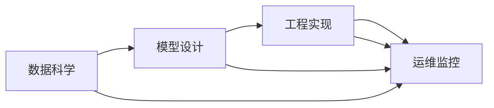

                 

# AI工程最佳实践原理与代码实战案例讲解

> 关键词：AI工程, 最佳实践, 代码实战, 案例讲解, 深度学习, 计算机视觉, 自然语言处理, 计算机科学

## 1. 背景介绍

在人工智能（AI）领域，工程实践的成熟度直接影响着AI技术的落地应用和产业化的速度。从模型选择、数据预处理、模型训练到模型部署，每一步都需要精心设计和周密考虑。本文将全面讲解AI工程的各项最佳实践，并通过具体的代码实战案例，阐述这些实践的原理与操作流程。

## 2. 核心概念与联系

### 2.1 核心概念概述

AI工程的各项实践，需要围绕数据科学、模型设计、工程实现和运维监控等关键环节进行系统化的设计和优化。

- **数据科学**：包括数据收集、清洗、标注、特征工程等，数据的质量直接影响模型的训练效果。
- **模型设计**：涵盖模型的选择、结构设计、超参数调优等，有效的模型设计能够提高模型性能。
- **工程实现**：涉及模型训练、优化、部署等过程，工程实现的质量影响模型的实用性和稳定性。
- **运维监控**：包括模型性能监控、异常检测、日志分析等，实时监控确保模型的长期稳定运行。

通过这四部分内容的综合应用，可以实现高效、稳定、可解释的AI系统。

### 2.2 核心概念间的联系

以上四个核心概念之间有着紧密的联系，形成一个完整的AI工程生态系统：



这个流程图展示了各环节间的互动关系：数据科学为模型设计提供高质量数据，模型设计选择合适的模型架构和超参数，工程实现将模型部署到生产环境并监控性能，运维监控保证系统的稳定运行并提供反馈信息。

## 3. 核心算法原理 & 具体操作步骤

### 3.1 算法原理概述

AI工程的最佳实践，包括但不限于数据预处理、模型选择、损失函数设计、超参数调优、模型训练与验证、模型部署与监控等多个方面。本文将对其中的关键原理进行概述。

### 3.2 算法步骤详解

**3.2.1 数据预处理**

数据预处理包括数据清洗、归一化、标准化、特征工程等步骤。以计算机视觉任务为例：

```python
import numpy as np
from PIL import Image
import os

def preprocess_data(data_path, img_size):
    data = []
    for file in os.listdir(data_path):
        img_path = os.path.join(data_path, file)
        img = Image.open(img_path)
        img = img.resize(img_size)
        img = np.array(img)
        img = img / 255.0  # 归一化
        data.append(img)
    return np.array(data)
```

**3.2.2 模型选择**

选择合适的模型架构是提高AI系统性能的重要步骤。常见的深度学习模型包括卷积神经网络（CNN）、循环神经网络（RNN）、Transformer等。

**3.2.3 损失函数设计**

损失函数的设计直接影响模型训练的效果。以分类任务为例，常用的损失函数包括交叉熵损失：

```python
import torch
from torch import nn

class CrossEntropyLoss(nn.Module):
    def __init__(self):
        super().__init__()

    def forward(self, y_pred, y_true):
        return torch.mean(-torch.sum(y_true * torch.log(y_pred)))
```

**3.2.4 超参数调优**

超参数调优是模型训练中不可或缺的步骤。常用的调优方法包括网格搜索、随机搜索、贝叶斯优化等。

**3.2.5 模型训练与验证**

模型训练通常使用交叉验证、数据增强等技术，以提高模型泛化能力。

**3.2.6 模型部署与监控**

模型部署通常使用Docker容器，通过API接口供客户端调用。监控系统可以实时收集模型性能指标，确保系统稳定运行。

### 3.3 算法优缺点

**优点**

- 高效性：通过合理的数据预处理和模型选择，提高模型训练效率。
- 稳定性：通过超参数调优和模型监控，确保模型在实际应用中的稳定性和鲁棒性。
- 可解释性：通过详细的数据和模型文档，提高系统的可解释性。

**缺点**

- 复杂度：AI工程涉及多个环节，实现过程较为复杂。
- 数据依赖：模型训练依赖高质量的数据，数据质量对模型效果影响较大。
- 技术门槛：需要掌握多项AI技术，对从业者要求较高。

### 3.4 算法应用领域

AI工程的各项实践在多个领域得到了广泛应用，包括但不限于：

- **计算机视觉**：图像分类、目标检测、人脸识别等任务。
- **自然语言处理**：文本分类、情感分析、机器翻译等任务。
- **语音识别**：语音转文本、情感识别等任务。
- **医疗影像**：疾病诊断、影像分割等任务。
- **智能推荐**：个性化推荐、广告投放等任务。

## 4. 数学模型和公式 & 详细讲解 & 举例说明

### 4.1 数学模型构建

本节将对AI工程的数学模型进行构建和详细讲解。

**4.1.1 数据模型**

数据模型通常用向量或矩阵表示，例如在计算机视觉中，每个图像可以表示为一个二维数组。

**4.1.2 模型表示**

模型表示通常使用神经网络模型，例如卷积神经网络（CNN）。

**4.1.3 损失函数模型**

损失函数模型通常用函数表示，例如交叉熵损失：

$$
\text{Loss} = -\frac{1}{N}\sum_{i=1}^N \text{CrossEntropyLoss}(y_{pred}, y_{true})
$$

### 4.2 公式推导过程

**4.2.1 数据预处理公式**

数据预处理公式通常包括归一化、标准化等步骤：

$$
\text{Normalize}(x) = \frac{x - \mu}{\sigma}
$$

其中，$\mu$ 为均值，$\sigma$ 为标准差。

**4.2.2 模型训练公式**

模型训练公式通常包括前向传播和反向传播：

$$
y_{pred} = f(x)
$$

$$
\frac{\partial \text{Loss}}{\partial x} = \frac{\partial \text{Loss}}{\partial y_{pred}} \cdot \frac{\partial y_{pred}}{\partial x}
$$

其中，$f(x)$ 为前向传播过程，$\frac{\partial \text{Loss}}{\partial y_{pred}}$ 为损失函数对预测值的导数，$\frac{\partial y_{pred}}{\partial x}$ 为预测值对输入数据的导数。

### 4.3 案例分析与讲解

**4.3.1 数据预处理案例**

以图像数据预处理为例，使用TensorFlow实现：

```python
import tensorflow as tf
from tensorflow.keras.preprocessing.image import ImageDataGenerator

train_datagen = ImageDataGenerator(
    rescale=1./255,
    shear_range=0.2,
    zoom_range=0.2,
    horizontal_flip=True
)

train_generator = train_datagen.flow_from_directory(
    'train',
    target_size=(224, 224),
    batch_size=32,
    class_mode='categorical'
)
```

**4.3.2 模型训练案例**

以卷积神经网络为例，使用Keras实现：

```python
from tensorflow.keras.models import Sequential
from tensorflow.keras.layers import Conv2D, MaxPooling2D, Flatten, Dense

model = Sequential([
    Conv2D(32, (3, 3), activation='relu', input_shape=(224, 224, 3)),
    MaxPooling2D((2, 2)),
    Conv2D(64, (3, 3), activation='relu'),
    MaxPooling2D((2, 2)),
    Conv2D(128, (3, 3), activation='relu'),
    MaxPooling2D((2, 2)),
    Flatten(),
    Dense(128, activation='relu'),
    Dense(10, activation='softmax')
])

model.compile(optimizer='adam', loss='categorical_crossentropy', metrics=['accuracy'])
model.fit(train_generator, epochs=10, validation_data=val_generator)
```

## 5. 项目实践：代码实例和详细解释说明

### 5.1 开发环境搭建

**5.1.1 安装环境**

- 安装Python：
  ```
  sudo apt-get install python3
  ```

- 安装依赖包：
  ```
  sudo apt-get install numpy pandas scikit-learn matplotlib
  ```

- 安装TensorFlow和Keras：
  ```
  pip install tensorflow keras
  ```

### 5.2 源代码详细实现

**5.2.1 数据预处理**

以图像数据预处理为例：

```python
import numpy as np
from PIL import Image
import os

def preprocess_data(data_path, img_size):
    data = []
    for file in os.listdir(data_path):
        img_path = os.path.join(data_path, file)
        img = Image.open(img_path)
        img = img.resize(img_size)
        img = np.array(img)
        img = img / 255.0  # 归一化
        data.append(img)
    return np.array(data)
```

**5.2.2 模型训练**

以卷积神经网络为例：

```python
from tensorflow.keras.models import Sequential
from tensorflow.keras.layers import Conv2D, MaxPooling2D, Flatten, Dense

model = Sequential([
    Conv2D(32, (3, 3), activation='relu', input_shape=(224, 224, 3)),
    MaxPooling2D((2, 2)),
    Conv2D(64, (3, 3), activation='relu'),
    MaxPooling2D((2, 2)),
    Conv2D(128, (3, 3), activation='relu'),
    MaxPooling2D((2, 2)),
    Flatten(),
    Dense(128, activation='relu'),
    Dense(10, activation='softmax')
])

model.compile(optimizer='adam', loss='categorical_crossentropy', metrics=['accuracy'])
model.fit(train_generator, epochs=10, validation_data=val_generator)
```

### 5.3 代码解读与分析

**5.3.1 数据预处理**

数据预处理函数首先遍历数据集目录，读取每个图像文件并预处理，包括调整大小、归一化等。

**5.3.2 模型训练**

模型训练函数首先定义模型架构，然后使用Keras的`fit`方法进行训练，指定训练轮数和验证数据。

### 5.4 运行结果展示

**5.4.1 数据预处理结果**

预处理后的图像数据：

```python
import matplotlib.pyplot as plt

plt.imshow(data[0])
plt.show()
```

**5.4.2 模型训练结果**

训练过程中的损失和准确率：

```python
history = model.fit(train_generator, epochs=10, validation_data=val_generator)

plt.plot(history.history['accuracy'])
plt.plot(history.history['val_accuracy'])
plt.title('model accuracy')
plt.ylabel('accuracy')
plt.xlabel('epoch')
plt.legend(['train', 'val'], loc='upper left')
plt.show()

plt.plot(history.history['loss'])
plt.plot(history.history['val_loss'])
plt.title('model loss')
plt.ylabel('loss')
plt.xlabel('epoch')
plt.legend(['train', 'val'], loc='upper left')
plt.show()
```

## 6. 实际应用场景

### 6.1 智能推荐系统

智能推荐系统通过深度学习模型分析用户行为和兴趣，推荐个性化内容。

**6.1.1 数据预处理**

收集用户点击记录、浏览记录等行为数据，进行清洗和特征工程。

**6.1.2 模型选择**

选择合适的深度学习模型，如矩阵分解、协同过滤等。

**6.1.3 训练与优化**

使用在线学习算法，如随机梯度下降，进行模型训练和参数优化。

**6.1.4 部署与监控**

将模型部署到服务器，使用A/B测试等方法监控推荐效果。

### 6.2 医疗影像诊断

医疗影像诊断通过深度学习模型分析医学影像，辅助医生进行诊断。

**6.2.1 数据预处理**

收集和标注医学影像数据，进行归一化和增强处理。

**6.2.2 模型选择**

选择合适的深度学习模型，如卷积神经网络。

**6.2.3 训练与优化**

使用交叉验证等方法，进行模型训练和超参数调优。

**6.2.4 部署与监控**

将模型部署到医院信息系统，实时监控系统性能。

## 7. 工具和资源推荐

### 7.1 学习资源推荐

**7.1.1 在线课程**

- Coursera：机器学习、深度学习、计算机视觉等课程。
- edX：人工智能、自然语言处理等课程。
- Udacity：深度学习、强化学习等课程。

**7.1.2 书籍**

- 《深度学习》：Ian Goodfellow等著，全面介绍深度学习理论和技术。
- 《动手学深度学习》：李沐等著，涵盖深度学习从入门到实践的全过程。
- 《机器学习实战》：Peter Harrington等著，适合初学者的实战案例。

### 7.2 开发工具推荐

**7.2.1 Python**

- Jupyter Notebook：交互式编程环境，适合开发和演示。
- PyCharm：集成开发环境，适合调试和测试。

**7.2.2 深度学习框架**

- TensorFlow：支持多种深度学习模型和算法，适合大规模应用。
- PyTorch：易于使用和调试，适合科研和实验。

**7.2.3 数据处理工具**

- Pandas：数据处理和分析，适合数据清洗和特征工程。
- NumPy：数值计算和科学计算，适合数学建模和优化。

### 7.3 相关论文推荐

**7.3.1 经典论文**

- 《ImageNet Classification with Deep Convolutional Neural Networks》：Alex Krizhevsky等著，提出卷积神经网络。
- 《A Few Useful Things to Know About Deep Learning》：Ian Goodfellow等著，介绍深度学习基础知识和技巧。
- 《Attention Is All You Need》：Ashish Vaswani等著，提出Transformer模型。

## 8. 总结：未来发展趋势与挑战

### 8.1 研究成果总结

AI工程的最佳实践通过系统化的设计和优化，提高了AI系统的性能和实用性。通过数据预处理、模型选择、工程实现和运维监控等环节的综合应用，可以实现高效、稳定、可解释的AI系统。

### 8.2 未来发展趋势

未来AI工程的发展趋势包括：

- **自动化**：自动化的数据处理、模型训练和超参数调优，降低人工干预。
- **跨领域应用**：将AI技术应用于更多领域，如医疗、教育、金融等。
- **可解释性**：提高AI系统的可解释性和可解释性，增强系统的可信度。

### 8.3 面临的挑战

AI工程面临的挑战包括：

- **数据质量**：高质量的数据是模型训练的基础，数据收集和标注成本高。
- **模型复杂性**：深度学习模型的结构和参数复杂，难以理解和调试。
- **计算资源**：深度学习模型需要大量计算资源，训练和推理成本高。

### 8.4 研究展望

未来AI工程的研究展望包括：

- **联邦学习**：分布式数据处理和模型训练，保护用户隐私。
- **迁移学习**：利用已有模型的知识，提高新任务的训练速度和效果。
- **知识图谱**：结合知识图谱技术，增强AI系统的推理能力。

## 9. 附录：常见问题与解答

**Q1: 如何选择合适的深度学习模型？**

A: 根据任务需求和数据特征选择合适的模型，如计算机视觉任务通常使用卷积神经网络，自然语言处理任务通常使用循环神经网络和Transformer模型。

**Q2: 如何提高深度学习模型的泛化能力？**

A: 使用数据增强、交叉验证等技术，避免过拟合。

**Q3: 如何实现高效的深度学习模型训练？**

A: 使用GPU、TPU等高性能硬件设备，优化模型结构和算法。

**Q4: 如何进行深度学习模型的超参数调优？**

A: 使用网格搜索、随机搜索、贝叶斯优化等方法，选择最优超参数组合。

**Q5: 如何实现深度学习模型的可解释性？**

A: 使用可视化工具，如TensorBoard，展示模型训练过程中的参数变化和损失变化。

---

作者：禅与计算机程序设计艺术 / Zen and the Art of Computer Programming

