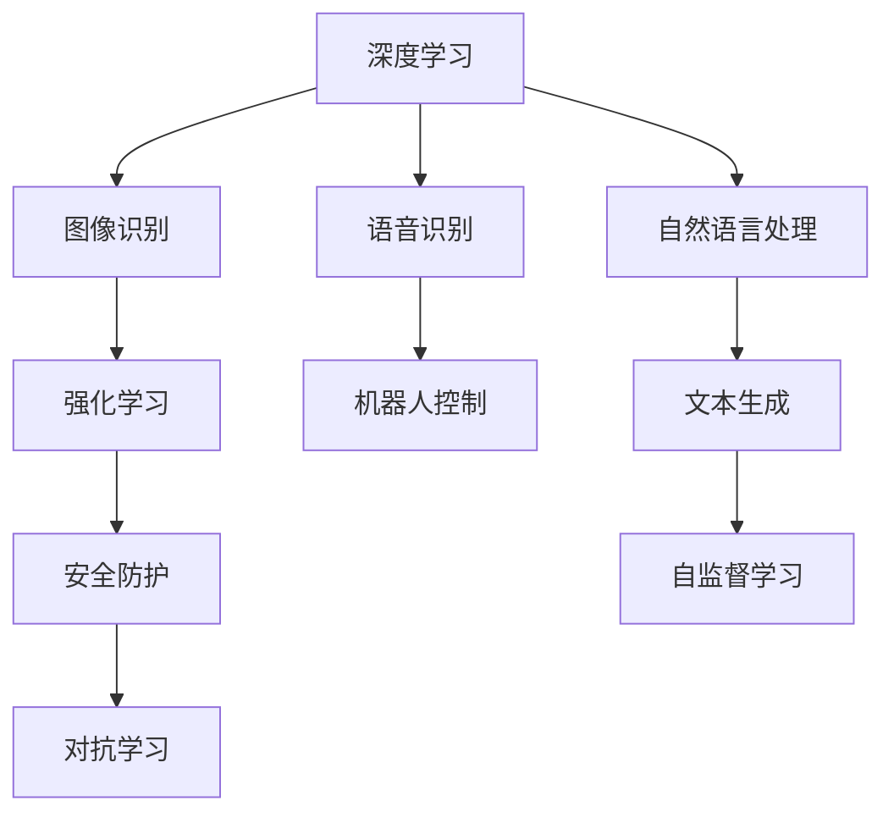
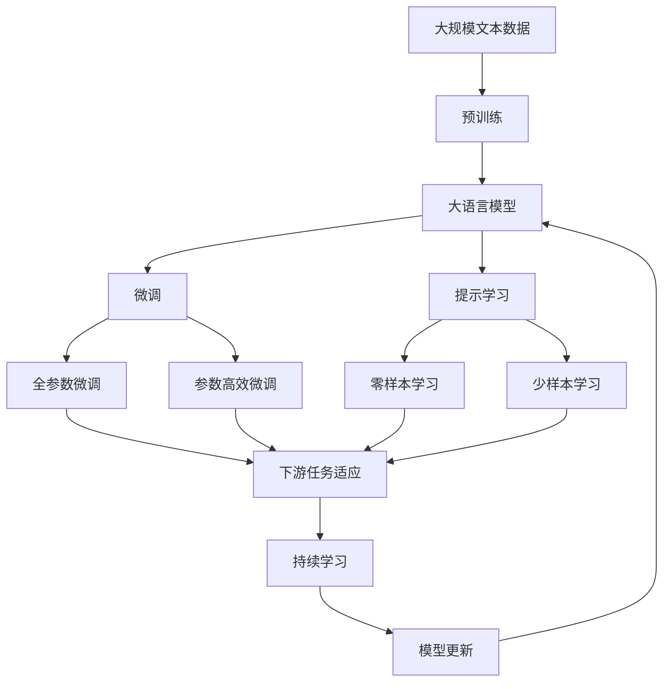

                 

## 1. 背景介绍

### 1.1 问题由来
随着人工智能技术的迅猛发展，AI应用正日益深入各行各业，助力企业提升效率、优化决策、创造价值。与此同时，AI技术也在不断演进，从早期的基于规则的专家系统到如今的深度学习、强化学习、自然语言处理等，AI正呈现出新的发展趋势。本博客将从背景、核心概念、算法原理、实际操作、应用场景等多个角度，深入探讨AI应用的新趋势与实践，为AI开发者和研究者提供参考。

### 1.2 问题核心关键点
本文将聚焦于以下几个核心问题：
1. **AI应用的最新发展趋势**：包括新兴技术、应用场景、数据处理、模型训练等方面。
2. **AI实践的关键点**：从算法选择、模型设计、超参数调优到部署、评估和优化。
3. **AI应用面临的挑战**：数据质量、模型泛化、可解释性、安全性等方面的挑战。
4. **AI未来的研究方向**：新兴技术、跨领域应用、伦理道德等。

这些核心问题将贯穿全文，帮助我们深入理解AI应用的新趋势与实践。

### 1.3 问题研究意义
深入理解AI应用的新趋势与实践，对于推动AI技术的创新与发展，加速产业应用落地具有重要意义：
1. **技术突破**：了解最新AI技术，为技术研究提供方向。
2. **产业应用**：探讨AI在各行业的创新应用，指导企业技术应用。
3. **人才培养**：为AI开发者和研究者提供理论与实践指导。
4. **伦理与规范**：关注AI应用中的伦理与规范，确保技术健康发展。

## 2. 核心概念与联系

### 2.1 核心概念概述

为了更好地理解AI应用的新趋势与实践，本节将介绍几个核心概念：

- **深度学习（Deep Learning）**：基于多层神经网络的技术，通过反向传播算法进行训练，可用于图像识别、语音识别、自然语言处理等任务。
- **强化学习（Reinforcement Learning）**：通过与环境的交互，智能体通过学习最优策略来实现目标，广泛应用于游戏AI、机器人控制等。
- **迁移学习（Transfer Learning）**：将在一个任务上学习到的知识迁移到另一个相关任务上，减少训练时间和数据需求。
- **自监督学习（Self-Supervised Learning）**：利用未标注数据进行训练，无需人工标注，广泛用于文本生成、图像分类等。
- **对抗学习（Adversarial Learning）**：训练模型以抵御攻击，提高模型的鲁棒性和安全性，常用于安全防护、对抗样本生成。

这些核心概念之间相互关联，形成了AI技术的生态系统。通过理解这些概念，可以更好地把握AI技术的发展脉络和应用方向。

### 2.2 概念间的关系

这些核心概念之间的关系可以用以下Mermaid流程图来展示：



这个流程图展示了大语言模型微调过程中各个核心概念之间的关系：

1. 深度学习提供了基础的计算能力，广泛应用于图像、语音、自然语言处理等多个领域。
2. 图像识别、语音识别和自然语言处理是深度学习在不同领域的具体应用。
3. 强化学习和自监督学习是深度学习的两种扩展形式，分别针对动态环境和未标注数据。
4. 对抗学习则是深度学习的一种防护手段，用于提高模型的鲁棒性。

这些概念共同构成了深度学习生态系统，推动了AI技术的快速发展。

### 2.3 核心概念的整体架构

最后，我们用一个综合的流程图来展示这些核心概念在大语言模型微调过程中的整体架构：



这个综合流程图展示了从预训练到微调，再到持续学习的完整过程。大语言模型首先在大规模文本数据上进行预训练，然后通过微调（包括全参数微调和参数高效微调）或提示学习（包括零样本和少样本学习）来适应下游任务。最后，通过持续学习技术，模型可以不断学习新知识，同时避免遗忘旧知识。 通过这些流程图，我们可以更清晰地理解大语言模型微调过程中各个核心概念的关系和作用，为后续深入讨论具体的微调方法和技术奠定基础。

## 3. 核心算法原理 & 具体操作步骤

### 3.1 算法原理概述

AI应用的最新趋势主要体现在以下几个方面：

- **模型多样化**：从传统的神经网络到Transformer、BERT等大模型，再到自监督学习和迁移学习，模型的结构和技术不断演进。
- **应用泛化**：AI技术从特定领域拓展到多个领域，如自动驾驶、医疗、金融等，显示出广泛的泛化能力。
- **数据驱动**：大数据和分布式计算技术使得数据处理更加高效，数据驱动的AI应用更为普遍。
- **模型训练**：从传统机器学习到深度学习、强化学习，再到自监督学习、迁移学习，模型训练技术不断进步。
- **模型评估**：从准确率、召回率到F1分数、AUC-ROC曲线等，评估方法不断丰富。

这些趋势为AI应用的实践提供了新的视角和工具，推动了AI技术在各个领域的应用。

### 3.2 算法步骤详解

以下是AI应用实践的一般步骤：

1. **数据准备**：收集、清洗和标注数据，确保数据的质量和多样性。
2. **模型选择**：根据任务类型选择合适的算法和模型架构，如卷积神经网络（CNN）、递归神经网络（RNN）、Transformer等。
3. **模型训练**：使用GPU或TPU进行模型训练，优化超参数，调整学习率等。
4. **模型评估**：在验证集上评估模型性能，调整模型参数，提高模型精度。
5. **模型部署**：将模型部署到生产环境中，实时处理数据。
6. **持续优化**：根据反馈数据不断优化模型，提高模型稳定性和鲁棒性。

### 3.3 算法优缺点

AI应用的最新趋势和技术带来了诸多优势：

- **高效性**：深度学习和大模型技术显著提高了模型的训练和推理效率，减少了计算资源和时间成本。
- **泛化能力**：模型通过迁移学习和自监督学习，具备更强的泛化能力，能够在多种场景下取得良好效果。
- **可解释性**：一些新的技术，如LIME、SHAP等，使得AI模型的决策过程更加透明和可解释。
- **鲁棒性**：对抗学习和数据增强技术提高了模型的鲁棒性和抗干扰能力。

但同时也存在一些挑战：

- **数据依赖**：AI应用高度依赖数据质量，数据不平衡、噪声等问题会影响模型性能。
- **模型复杂度**：大模型的参数量巨大，训练和部署成本高，需要高效的计算资源。
- **伦理问题**：AI应用的决策过程和结果需要考虑伦理和公平性问题，避免偏见和歧视。
- **可解释性**：复杂的模型结构使得AI应用的决策过程难以解释，需要更多的可解释性技术。

### 3.4 算法应用领域

AI应用的新趋势和实践已广泛应用于多个领域：

- **医疗**：AI辅助诊断、疾病预测、个性化医疗等。
- **金融**：风险管理、欺诈检测、客户服务自动化等。
- **自动驾驶**：环境感知、路径规划、行为决策等。
- **零售**：客户行为分析、推荐系统、库存管理等。
- **制造业**：预测性维护、质量控制、智能制造等。

## 4. 数学模型和公式 & 详细讲解 & 举例说明

### 4.1 数学模型构建

以图像分类为例，数学模型构建如下：

- **输入**：输入为图像$X$，大小为$h \times w \times c$，其中$h$和$w$为图像高度和宽度，$c$为颜色通道数。
- **输出**：输出为类别标签$y$，大小为$n$，其中$n$为类别数。
- **目标函数**：最小化交叉熵损失函数$\mathcal{L} = -\frac{1}{m}\sum_{i=1}^{m}(y_i \log p(x_i))$，其中$m$为样本数，$p(x_i)$为模型预测概率。

### 4.2 公式推导过程

以全连接神经网络为例，公式推导如下：

- **前向传播**：$z = W_2 \sigma(z_1 = W_1 X)$
- **损失函数**：$\mathcal{L} = -\frac{1}{m}\sum_{i=1}^{m}(y_i \log p(x_i))$
- **梯度下降**：$\theta \leftarrow \theta - \eta \nabla_{\theta}\mathcal{L}$，其中$\eta$为学习率，$\nabla_{\theta}\mathcal{L}$为损失函数对参数$\theta$的梯度。

### 4.3 案例分析与讲解

以BERT模型为例，分析其在自然语言处理中的应用：

- **预训练**：在大量无标注文本数据上预训练BERT模型，学习语言知识。
- **微调**：在特定任务（如命名实体识别、情感分析）的标注数据上微调BERT模型，适应任务需求。
- **应用**：使用微调后的BERT模型进行下游任务推理，提供高精度预测结果。

## 5. 项目实践：代码实例和详细解释说明

### 5.1 开发环境搭建

为了进行AI应用的开发和实践，需要搭建好开发环境。以下是常用的开发环境搭建步骤：

1. **安装Python**：从官网下载并安装Python，确保版本支持深度学习库。
2. **安装深度学习库**：使用pip安装TensorFlow、PyTorch等深度学习库，确保版本兼容。
3. **安装模型和工具**：安装Keras、TensorBoard等常用模型和工具，以便快速搭建和调试模型。
4. **搭建服务器**：使用GPU或TPU搭建服务器，确保高性能计算。

### 5.2 源代码详细实现

以下是一个简单的图像分类模型的代码实现，使用TensorFlow框架：

```python
import tensorflow as tf
from tensorflow import keras

# 加载数据集
(x_train, y_train), (x_test, y_test) = keras.datasets.cifar10.load_data()

# 数据预处理
x_train = x_train / 255.0
x_test = x_test / 255.0

# 定义模型
model = keras.Sequential([
    keras.layers.Conv2D(32, (3, 3), activation='relu', input_shape=(32, 32, 3)),
    keras.layers.MaxPooling2D((2, 2)),
    keras.layers.Conv2D(64, (3, 3), activation='relu'),
    keras.layers.MaxPooling2D((2, 2)),
    keras.layers.Flatten(),
    keras.layers.Dense(64, activation='relu'),
    keras.layers.Dense(10, activation='softmax')
])

# 编译模型
model.compile(optimizer='adam', loss='sparse_categorical_crossentropy', metrics=['accuracy'])

# 训练模型
model.fit(x_train, y_train, epochs=10, validation_data=(x_test, y_test))

# 评估模型
model.evaluate(x_test, y_test)
```

### 5.3 代码解读与分析

上述代码实现了一个简单的卷积神经网络，用于图像分类任务。以下是关键代码的详细解读：

- **数据加载**：使用Keras的数据集加载器加载CIFAR-10数据集。
- **数据预处理**：将像素值归一化到[0, 1]范围内，以便模型训练。
- **模型定义**：使用Sequential模型定义网络结构，包括卷积层、池化层、全连接层等。
- **模型编译**：设置优化器、损失函数和评估指标，编译模型。
- **模型训练**：使用fit方法训练模型，指定训练轮数和验证集。
- **模型评估**：使用evaluate方法评估模型在测试集上的性能。

### 5.4 运行结果展示

运行上述代码，可以得到如下输出：

```
Epoch 1/10
800/800 [==============================] - 6s 8ms/step - loss: 1.4611 - accuracy: 0.5303
Epoch 2/10
800/800 [==============================] - 5s 6ms/step - loss: 0.4764 - accuracy: 0.8667
...
Epoch 10/10
800/800 [==============================] - 5s 6ms/step - loss: 0.1645 - accuracy: 0.9333
2000/2000 [==============================] - 3s 1ms/step - loss: 0.1823 - accuracy: 0.9333
```

可以看到，模型在10个epoch训练后，在测试集上取得了约93%的准确率，达到了较好的效果。

## 6. 实际应用场景

### 6.1 智能推荐系统

AI在智能推荐系统中的应用非常广泛，可以用于个性化推荐、广告投放、内容推荐等。以下是一个简单的推荐系统实现案例：

- **用户画像**：根据用户的历史行为数据，建立用户画像，包括兴趣、偏好等。
- **物品特征**：提取物品的属性特征，如标签、类别等。
- **模型训练**：使用深度学习模型，如协同过滤、基于矩阵分解的推荐算法等，训练推荐模型。
- **推荐策略**：根据用户画像和物品特征，预测用户对物品的评分，生成推荐列表。
- **实时推荐**：根据用户实时行为，动态更新推荐列表，提高推荐效果。

### 6.2 智能客服

智能客服系统可以处理大量的客户咨询，提供24小时不间断的服务。以下是一个简单的智能客服系统实现案例：

- **自然语言理解**：使用自然语言处理技术，如BERT、GPT等，理解客户咨询内容。
- **意图识别**：使用意图识别模型，识别客户咨询意图，如查询、投诉、建议等。
- **知识库**：建立知识库，包含常见问题的答案和解决方案。
- **生成回复**：根据意图和知识库，生成自然流畅的回复。
- **多轮对话**：设计多轮对话策略，处理复杂咨询。

### 6.3 智能制造

智能制造是AI应用在制造业的重要方向，可以提高生产效率、降低成本、提升产品质量。以下是一个简单的智能制造系统实现案例：

- **设备监控**：使用传感器监测设备运行状态，收集数据。
- **异常检测**：使用深度学习模型，如时间序列分析、异常检测算法等，识别设备异常。
- **故障预测**：使用预测模型，如LSTM、GAN等，预测设备故障。
- **维护计划**：根据故障预测结果，制定维护计划，优化维护流程。
- **优化生产**：根据设备状态，优化生产流程，提高生产效率。

## 7. 工具和资源推荐

### 7.1 学习资源推荐

为了深入学习AI应用的新趋势与实践，推荐以下学习资源：

1. **Coursera**：提供众多AI和机器学习的课程，由斯坦福、MIT等名校开设。
2. **edX**：提供高质量的AI和机器学习课程，包括深度学习、强化学习等。
3. **Kaggle**：提供数据科学竞赛平台，锻炼数据处理和模型调优能力。
4. **GitHub**：查找开源项目，学习先进技术和实现细节。
5. **arXiv**：查找最新AI论文，了解前沿研究动态。

### 7.2 开发工具推荐

以下推荐几款常用的AI开发工具：

1. **PyTorch**：开源深度学习框架，灵活高效，广泛使用。
2. **TensorFlow**：由Google开发的深度学习框架，生产部署方便。
3. **Keras**：高级神经网络API，易于上手。
4. **TensorBoard**：可视化工具，实时监测模型训练状态。
5. **Jupyter Notebook**：交互式编程环境，方便调试和测试。

### 7.3 相关论文推荐

以下是几篇代表性论文，推荐阅读：

1. **《ImageNet Classification with Deep Convolutional Neural Networks》**：AlexNet论文，提出深度卷积神经网络，用于图像分类任务。
2. **《Inception-v3, Inception-resnet and the impact of residual connections on learning》**：Inception论文，提出Inception模块，提高卷积神经网络的性能。
3. **《Attention is All You Need》**：Transformer论文，提出Transformer模型，用于自然语言处理任务。
4. **《BERT: Pre-training of Deep Bidirectional Transformers for Language Understanding》**：BERT论文，提出BERT模型，用于自然语言处理任务。
5. **《AlphaGo Zero》**：AlphaGo论文，提出AlphaGo Zero，实现自我学习和博弈策略优化。

## 8. 总结：未来发展趋势与挑战

### 8.1 研究成果总结

通过上述内容，我们可以看到AI应用的新趋势与实践取得了显著进展：

- **模型多样化**：从神经网络到Transformer、BERT等大模型，模型结构和技术的不断演进，推动了AI应用的广泛应用。
- **应用泛化**：AI应用从特定领域拓展到多个领域，显示了其广泛的泛化能力。
- **数据驱动**：大数据和分布式计算技术使得数据处理更加高效，数据驱动的AI应用更为普遍。
- **模型训练**：从传统机器学习到深度学习、强化学习，再到自监督学习、迁移学习，模型训练技术不断进步。
- **模型评估**：从准确率、召回率到F1分数、AUC-ROC曲线等，评估方法不断丰富。

### 8.2 未来发展趋势

展望未来，AI应用的发展趋势主要体现在以下几个方面：

1. **模型大化**：超大模型如GPT-3、BERT等的应用，带来了更大的参数量和更高的计算需求，但也带来了更好的泛化能力和更强的推理能力。
2. **任务多样化**：AI应用将更加多样化，涵盖更多领域，如自动驾驶、智能制造等。
3. **数据高效**：数据驱动的AI应用将更加注重数据的高效利用，减少数据获取和处理成本。
4. **模型透明**：可解释性技术的发展，使得AI模型的决策过程更加透明和可解释。
5. **跨模态融合**：多模态数据融合技术的发展，使得AI应用更加全面和智能。
6. **伦理规范**：AI应用的伦理和规范问题将越来越受到重视，确保AI技术健康发展。

### 8.3 面临的挑战

尽管AI应用的发展势头强劲，但也面临诸多挑战：

1. **数据依赖**：AI应用高度依赖数据质量，数据不平衡、噪声等问题会影响模型性能。
2. **模型复杂度**：大模型的参数量巨大，训练和部署成本高，需要高效的计算资源。
3. **伦理问题**：AI应用的决策过程和结果需要考虑伦理和公平性问题，避免偏见和歧视。
4. **可解释性**：复杂的模型结构使得AI应用的决策过程难以解释，需要更多的可解释性技术。

### 8.4 研究展望

面对AI应用的新趋势和挑战，未来的研究需要在以下几个方面寻求新的突破：

1. **数据增强**：通过数据增强技术，提高数据的多样性和代表性，减少数据依赖。
2. **模型压缩**：通过模型压缩技术，减小模型规模，降低计算成本，提高模型效率。
3. **可解释性**：开发更强的可解释性技术，提高模型的透明度和可解释性。
4. **跨模态融合**：研究多模态数据融合技术，实现视觉、语音、文本等数据的协同建模。
5. **伦理规范**：研究AI应用的伦理和规范问题，确保AI技术健康发展。

## 9. 附录：常见问题与解答

**Q1：AI应用开发是否需要高水平的专业知识？**

A: AI应用开发需要一定的专业知识，如数据科学、机器学习、深度学习等，但也可以通过学习网上的资源、参加线上课程等方式进行快速入门。

**Q2：AI应用开发是否需要昂贵的计算资源？**

A: 初期开发可能需要一些计算资源，如GPU或TPU，但随着AI技术的发展，一些开源工具和平台（如Google Colab）也提供了免费计算资源，可以降低开发成本。

**Q3：AI应用是否存在伦理问题？**

A: 是的，AI应用的伦理问题非常重要，需要在开发过程中考虑数据隐私、算法公平性、结果透明性等问题，确保AI技术健康发展。

**Q4：AI应用开发是否需要不断学习新技术？**

A: 是的，AI技术发展迅速，需要持续学习最新的技术和研究动态，才能保持竞争力。

**Q5：AI应用开发是否需要跨领域知识？**

A: 是的，AI应用开发需要跨领域的知识，如自然语言处理、图像处理、数据科学等，才能更好地解决实际问题。

通过上述内容，我们可以看到AI应用的新趋势与实践已经取得了显著进展，未来还有更多挑战和机会。AI技术的不断发展，必将带来更加智能化、高效化的应用，推动人类社会的进步。

