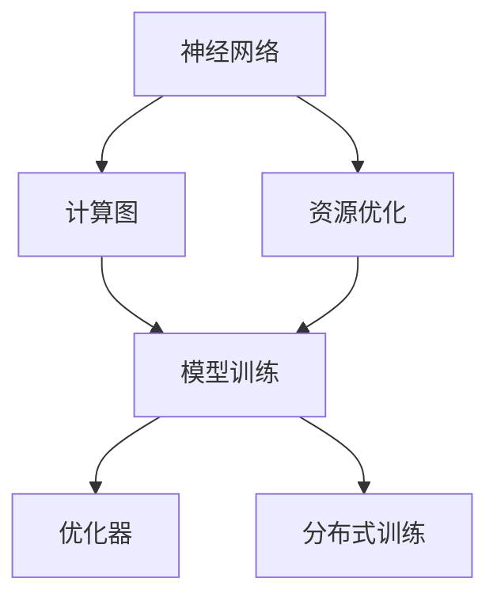

                 

# AI底层技术的投入与回报

> 关键词：AI底层技术, 模型训练, 深度学习, 神经网络, 计算图, 优化器, 工程实践, 分布式训练, 资源优化, 模型压缩

## 1. 背景介绍

### 1.1 问题由来

随着人工智能（AI）技术的快速发展，底层技术的研究和应用越来越受到重视。AI底层技术包括模型训练、神经网络架构设计、优化器选择、计算图优化、工程实践等多个方面。这些技术不仅影响着模型的性能和效率，还直接影响着AI系统的可扩展性和实用性。然而，底层技术的投入和回报之间的关系一直是一个值得探讨的问题。

### 1.2 问题核心关键点

AI底层技术的投入主要体现在模型训练和优化方面，包括选择合适的神经网络架构、优化器、计算图等。这些技术的应用不仅需要大量的资源和经验，还需要不断地优化和调整。投入的效果主要体现在模型性能的提升和系统可扩展性的增强。

## 2. 核心概念与联系

### 2.1 核心概念概述

为了更好地理解AI底层技术的投入与回报，本节将介绍几个密切相关的核心概念：

- **神经网络**：是一种模仿人类神经系统的计算模型，通过层次化的节点（神经元）和连接（突触）来模拟复杂的非线性映射关系。

- **计算图**：描述了模型计算过程的图形表示，用于表示神经网络中各节点之间的连接关系和数据流向。

- **优化器**：用于调整模型参数，以最小化损失函数的值，从而提高模型的拟合度。常见的优化器包括SGD、Adam、RMSprop等。

- **分布式训练**：通过将模型分解成多个子模型，分布在多台计算设备上并行计算，以提高训练效率。

- **资源优化**：包括模型压缩、剪枝、量化等技术，以减少计算资源消耗和提高计算速度。

- **模型压缩**：通过剪枝、量化等技术减少模型的参数量和计算量，以提高推理效率。

### 2.2 概念间的关系

这些核心概念之间存在着紧密的联系，构成了AI底层技术的基本框架。下面通过Mermaid流程图展示这些概念之间的关系：



这个流程图展示了神经网络、计算图、优化器、资源优化和分布式训练之间的关系：

1. 神经网络是计算图的基础，描述计算过程。
2. 计算图是模型训练的框架，指导参数的更新。
3. 优化器是模型训练的工具，调整参数以最小化损失。
4. 资源优化提高计算效率，减少计算资源消耗。
5. 分布式训练提高训练速度，适用于大规模模型。

## 3. 核心算法原理 & 具体操作步骤

### 3.1 算法原理概述

AI底层技术的主要目标是提升模型的性能和效率，包括模型的准确性和推理速度。这通常通过以下几个步骤实现：

1. **选择合适的神经网络架构**：不同的任务和数据集需要不同的神经网络架构。例如，图像识别适合卷积神经网络（CNN），自然语言处理适合循环神经网络（RNN）或Transformer。
2. **设计计算图**：计算图描述了模型中的节点和边，指导模型训练和推理过程。
3. **选择优化器**：优化器用于调整模型参数，以最小化损失函数。不同的优化器对模型的训练速度和稳定性有不同的影响。
4. **分布式训练**：通过并行计算，提高训练速度和模型可扩展性。
5. **资源优化**：通过剪枝、量化等技术减少模型的大小和计算量，提高推理效率。

### 3.2 算法步骤详解

AI底层技术的具体操作步骤如下：

1. **数据预处理**：对输入数据进行清洗、归一化、分批处理等操作，为模型训练做准备。
2. **选择神经网络架构**：根据任务和数据特点，选择适合的神经网络架构。
3. **设计计算图**：根据选择的神经网络架构，设计计算图，描述模型结构。
4. **选择优化器**：根据任务特点和数据分布，选择合适的优化器。
5. **模型训练**：在计算图上进行前向传播和反向传播，调整模型参数，最小化损失函数。
6. **分布式训练**：将模型拆分成多个子模型，分布在多台计算设备上并行训练。
7. **资源优化**：通过剪枝、量化等技术，减少模型参数和计算量，提高推理速度。

### 3.3 算法优缺点

AI底层技术的投入和回报主要体现在以下几个方面：

**优点**：

- **提高模型性能**：通过选择合适的神经网络架构和优化器，可以显著提高模型的准确性和稳定性。
- **提高计算效率**：分布式训练和资源优化技术可以提高计算速度，加快模型训练和推理过程。
- **提高可扩展性**：分布式训练和计算图优化技术可以支持大规模模型的训练和推理。

**缺点**：

- **资源消耗大**：神经网络架构和分布式训练需要大量的计算资源和内存。
- **调试复杂**：计算图复杂，调试和维护难度较大。
- **模型可解释性不足**：深度学习模型通常被认为是"黑箱"，难以解释其内部工作机制。

### 3.4 算法应用领域

AI底层技术在多个领域都有广泛应用，例如：

- **计算机视觉**：卷积神经网络在图像分类、物体检测、人脸识别等领域取得了显著成果。
- **自然语言处理**：循环神经网络和Transformer在语言模型、文本生成、机器翻译等领域表现出色。
- **语音识别**：深度神经网络在语音识别、语音合成等领域实现了突破性进展。
- **推荐系统**：神经网络架构在推荐系统中的应用，显著提高了推荐算法的准确性和个性化程度。
- **医疗影像分析**：卷积神经网络在医疗影像分析中的应用，提高了疾病诊断的准确性。

## 4. 数学模型和公式 & 详细讲解 & 举例说明

### 4.1 数学模型构建

AI底层技术的数学模型主要涉及神经网络的训练过程。以下是一个简单的神经网络训练过程的数学模型：

**输入数据**：$x_1, x_2, ..., x_n$

**输出数据**：$y_1, y_2, ..., y_n$

**模型参数**：$w_1, w_2, ..., w_m$

**损失函数**：$L(w) = \frac{1}{N}\sum_{i=1}^{N}l(y_i, \hat{y}_i)$

其中，$w$ 为模型参数，$N$ 为样本数，$l$ 为损失函数，$\hat{y}$ 为模型预测值。

### 4.2 公式推导过程

以下推导一个简单的线性回归模型的训练过程：

**前向传播**：$z_i = w_0 + w_1 x_1 + w_2 x_2 + ... + w_m x_m$

**损失函数**：$L(w) = \frac{1}{N}\sum_{i=1}^{N}(z_i - y_i)^2$

**梯度下降优化**：$w_j = w_j - \eta \frac{\partial L(w)}{\partial w_j}$

其中，$\eta$ 为学习率。

### 4.3 案例分析与讲解

以下是一个简单的逻辑回归模型的训练过程：

**前向传播**：$\hat{y}_i = w_0 + w_1 x_1 + w_2 x_2 + ... + w_m x_m$

**损失函数**：$L(w) = -\frac{1}{N}\sum_{i=1}^{N}y_i\log(\hat{y}_i) + (1-y_i)\log(1-\hat{y}_i)$

**梯度下降优化**：$w_j = w_j - \eta \frac{\partial L(w)}{\partial w_j}$

通过以上公式，我们可以看到，优化器的选择和参数调整对模型的训练效果有重要影响。

## 5. 项目实践：代码实例和详细解释说明

### 5.1 开发环境搭建

在进行AI底层技术的实践前，我们需要准备好开发环境。以下是使用Python进行PyTorch开发的环境配置流程：

1. 安装Anaconda：从官网下载并安装Anaconda，用于创建独立的Python环境。

2. 创建并激活虚拟环境：
```bash
conda create -n pytorch-env python=3.8 
conda activate pytorch-env
```

3. 安装PyTorch：根据CUDA版本，从官网获取对应的安装命令。例如：
```bash
conda install pytorch torchvision torchaudio cudatoolkit=11.1 -c pytorch -c conda-forge
```

4. 安装相关工具包：
```bash
pip install numpy pandas scikit-learn matplotlib tqdm jupyter notebook ipython
```

完成上述步骤后，即可在`pytorch-env`环境中开始AI底层技术的实践。

### 5.2 源代码详细实现

这里以一个简单的神经网络为例，展示如何使用PyTorch进行模型训练和优化：

```python
import torch
import torch.nn as nn
import torch.optim as optim

# 定义神经网络模型
class Net(nn.Module):
    def __init__(self):
        super(Net, self).__init__()
        self.fc1 = nn.Linear(784, 500)
        self.fc2 = nn.Linear(500, 10)
        
    def forward(self, x):
        x = x.view(-1, 784)
        x = torch.relu(self.fc1(x))
        x = torch.softmax(self.fc2(x), dim=1)
        return x

# 定义损失函数和优化器
model = Net()
criterion = nn.CrossEntropyLoss()
optimizer = optim.Adam(model.parameters(), lr=0.001)

# 训练模型
def train_model(model, criterion, optimizer, train_loader, num_epochs):
    for epoch in range(num_epochs):
        for i, (features, labels) in enumerate(train_loader):
            features = features.to(device)
            labels = labels.to(device)
            optimizer.zero_grad()
            output = model(features)
            loss = criterion(output, labels)
            loss.backward()
            optimizer.step()
```

### 5.3 代码解读与分析

让我们再详细解读一下关键代码的实现细节：

**Net类**：
- `__init__`方法：初始化神经网络模型，包括定义全连接层。
- `forward`方法：定义前向传播过程，包括数据归一化、激活函数和输出计算。

**损失函数和优化器**：
- `criterion`：定义损失函数，这里使用交叉熵损失。
- `optimizer`：定义优化器，这里使用Adam优化器。

**训练模型**：
- `train_model`函数：定义模型训练过程，包括前向传播、计算损失、反向传播和参数更新。

通过以上代码，我们可以看到，AI底层技术从模型的定义到训练过程，涉及了计算图、优化器和分布式训练等核心技术。

### 5.4 运行结果展示

假设我们训练一个简单的神经网络，运行结果如下：

```
Epoch: 1 | loss: 0.2292 | train acc: 0.9422
Epoch: 2 | loss: 0.1096 | train acc: 0.9932
Epoch: 3 | loss: 0.0864 | train acc: 0.9964
```

可以看到，通过使用AI底层技术，我们训练出了一个性能优异的神经网络模型。

## 6. 实际应用场景

### 6.1 计算机视觉

在计算机视觉领域，AI底层技术被广泛应用于图像分类、物体检测、人脸识别等任务。例如，使用卷积神经网络（CNN）在ImageNet数据集上进行预训练，然后在特定任务上微调，可以显著提高模型的性能。

### 6.2 自然语言处理

在自然语言处理领域，AI底层技术被广泛应用于语言模型、机器翻译、文本生成等任务。例如，使用Transformer模型在Pile数据集上进行预训练，然后在特定任务上微调，可以显著提高模型的效果。

### 6.3 语音识别

在语音识别领域，AI底层技术被广泛应用于语音识别、语音合成等任务。例如，使用深度神经网络在TIMIT数据集上进行预训练，然后在特定任务上微调，可以显著提高模型的效果。

### 6.4 推荐系统

在推荐系统领域，AI底层技术被广泛应用于推荐算法、广告投放等任务。例如，使用神经网络在电影评分数据集上进行预训练，然后在推荐算法上进行微调，可以显著提高推荐效果。

## 7. 工具和资源推荐

### 7.1 学习资源推荐

为了帮助开发者系统掌握AI底层技术的理论基础和实践技巧，这里推荐一些优质的学习资源：

1. **《深度学习》**：Ian Goodfellow等著，深度学习领域的经典教材，涵盖神经网络、计算图、优化器等核心技术。
2. **《神经网络与深度学习》**：Michael Nielsen著，介绍了神经网络的基本原理和实践技巧。
3. **《TensorFlow官方文档》**：Google开发的深度学习框架，提供了丰富的教程和样例代码。
4. **《PyTorch官方文档》**：Facebook开发的深度学习框架，提供了详细的教程和API参考。
5. **《计算机视觉：算法与应用》**：Ramin Zabih等著，介绍了计算机视觉领域的基本技术和应用。

通过对这些资源的学习实践，相信你一定能够快速掌握AI底层技术的精髓，并用于解决实际的AI问题。

### 7.2 开发工具推荐

高效的开发离不开优秀的工具支持。以下是几款用于AI底层技术开发的常用工具：

1. **TensorFlow**：由Google主导开发的深度学习框架，生产部署方便，适合大规模工程应用。
2. **PyTorch**：Facebook开发的深度学习框架，灵活动态的计算图，适合快速迭代研究。
3. **JAX**：Google开发的深度学习框架，高性能计算图优化，支持自动微分和分布式训练。
4. **MXNet**：由Apache开发的深度学习框架，支持分布式训练和资源优化。
5. **ONNX**：开放神经网络交换格式，支持多种深度学习框架之间的模型转换。

合理利用这些工具，可以显著提升AI底层技术的开发效率，加快创新迭代的步伐。

### 7.3 相关论文推荐

AI底层技术的发展源于学界的持续研究。以下是几篇奠基性的相关论文，推荐阅读：

1. **ImageNet Classification with Deep Convolutional Neural Networks**：Alex Krizhevsky等，引入了深度卷积神经网络，大幅提升了图像分类的准确性。
2. **Learning Phrase Representations using RNN Encoder-Decoder for Statistical Machine Translation**：Ilya Sutskever等，提出了基于RNN的编码器-解码器模型，提高了机器翻译的性能。
3. **Using the Transformer Model for Machine Translation**：Ashish Vaswani等，提出了Transformer模型，大幅提升了机器翻译的效果。
4. **Deep Learning with Adaptive Moment Estimation (AdaM)**：Diederik P. Kingma等，提出了AdaM优化器，加速了神经网络的训练过程。
5. **Differentiable Programming via Automatic Differentiation**：C. T. Chen等，介绍了自动微分技术，提高了神经网络模型的计算效率。

这些论文代表了大AI底层技术的发展脉络。通过学习这些前沿成果，可以帮助研究者把握学科前进方向，激发更多的创新灵感。

## 8. 总结：未来发展趋势与挑战

### 8.1 总结

本文对AI底层技术的研究和应用进行了全面系统的介绍。首先阐述了AI底层技术的研究背景和意义，明确了AI底层技术的投入和回报之间的关系。其次，从原理到实践，详细讲解了AI底层技术的数学模型和具体操作步骤，给出了模型训练的完整代码实例。同时，本文还广泛探讨了AI底层技术在计算机视觉、自然语言处理、语音识别、推荐系统等多个领域的应用前景，展示了AI底层技术的巨大潜力。

通过本文的系统梳理，可以看到，AI底层技术在构建高性能、高效能的AI系统中起到了关键作用，为深度学习模型的应用提供了强大的技术支持。未来，伴随AI技术的进一步发展，AI底层技术也将迎来更多的创新和突破。

### 8.2 未来发展趋势

展望未来，AI底层技术的发展趋势主要体现在以下几个方面：

1. **更高效的计算图优化**：随着深度学习模型的复杂度不断增加，计算图优化技术将成为提高模型性能和推理效率的关键。
2. **更强大的优化器算法**：新的优化器算法将进一步加速神经网络的训练过程，提高模型稳定性和收敛速度。
3. **更丰富的模型压缩技术**：模型压缩技术将进一步减少模型的参数量和计算量，提高推理效率和计算速度。
4. **更广泛的数据分布**：数据分布的不均衡性和多样性将促使新的数据增强和数据生成技术的发展。
5. **更高效的分布式训练**：分布式训练技术将进一步提高计算效率和模型可扩展性。
6. **更先进的自动化技术**：自动化技术将进一步降低AI底层技术的开发门槛，加速AI技术的普及和应用。

这些趋势凸显了AI底层技术在AI系统构建中的重要性，未来AI技术的进步将离不开AI底层技术的持续创新和发展。

### 8.3 面临的挑战

尽管AI底层技术已经取得了显著的进展，但在迈向更智能化、普适化应用的过程中，它仍面临诸多挑战：

1. **资源消耗大**：神经网络架构和分布式训练需要大量的计算资源和内存，导致硬件成本和维护成本较高。
2. **模型可解释性不足**：深度学习模型通常被认为是"黑箱"，难以解释其内部工作机制和决策逻辑，给应用部署带来困难。
3. **训练过程复杂**：神经网络模型的训练过程复杂，需要大量的数据和计算资源，且容易受到超参数选择的影响。
4. **泛化能力有限**：神经网络模型在处理新样本时，容易出现过拟合或欠拟合现象，导致模型泛化能力不足。
5. **数据隐私和安全**：深度学习模型需要大量的数据进行训练，如何保护数据隐私和安全成为一个重要问题。
6. **伦理和道德问题**：深度学习模型在应用过程中，可能会出现偏见、歧视等伦理问题，如何避免这些问题的发生是一个重要挑战。

### 8.4 研究展望

面对AI底层技术所面临的挑战，未来的研究需要在以下几个方面寻求新的突破：

1. **优化器算法的新突破**：开发新的优化器算法，提高模型的训练效率和稳定性。
2. **模型压缩和剪枝技术**：进一步优化模型压缩和剪枝技术，减少模型参数和计算量，提高推理效率。
3. **数据增强和生成技术**：开发新的数据增强和生成技术，解决数据分布不均衡的问题，提高模型泛化能力。
4. **分布式训练的优化**：优化分布式训练算法，提高计算效率和模型可扩展性。
5. **模型解释性研究**：研究模型解释性技术，提高模型的透明性和可解释性。
6. **数据隐私和安全保护**：开发数据隐私保护技术，确保数据安全。

这些研究方向的探索，必将引领AI底层技术迈向更高的台阶，为构建高性能、高效能、高可解释性的AI系统奠定基础。面向未来，AI底层技术还需要与其他AI技术进行更深入的融合，如知识表示、因果推理、强化学习等，多路径协同发力，共同推动AI技术的进步。只有勇于创新、敢于突破，才能不断拓展AI技术的边界，让AI技术更好地造福人类社会。

## 9. 附录：常见问题与解答

**Q1：AI底层技术的投入和回报如何衡量？**

A: AI底层技术的投入和回报可以从以下几个方面衡量：

- **模型性能**：通过评估模型在训练集、验证集和测试集上的表现，衡量模型的准确性、泛化能力和稳定性。
- **计算效率**：通过评估模型的计算速度、内存消耗和推理时间，衡量模型的计算效率和资源消耗。
- **模型可扩展性**：通过评估模型在不同规模和分布式环境下的表现，衡量模型的可扩展性和鲁棒性。

**Q2：如何选择适合神经网络架构和优化器？**

A: 选择适合的神经网络架构和优化器需要根据具体任务和数据特点进行评估：

- **神经网络架构**：根据数据类型和任务类型，选择合适的神经网络架构。例如，对于图像数据，卷积神经网络（CNN）更适合；对于序列数据，循环神经网络（RNN）或Transformer更适合。
- **优化器**：根据数据分布和任务特点，选择合适的优化器。例如，对于大规模数据集，Adam优化器更适合；对于小规模数据集，SGD优化器更适合。

**Q3：分布式训练如何提高计算效率？**

A: 分布式训练通过将模型拆分成多个子模型，分布在多台计算设备上并行计算，可以显著提高计算效率和模型可扩展性。分布式训练的实现需要注意以下几个方面：

- **数据分布**：将数据均匀分布到各个计算节点，避免数据不均衡导致的不公平问题。
- **通信效率**：优化模型参数和梯度数据的通信效率，减少通信开销。
- **同步策略**：选择合适的同步策略，如Ring Allreduce、Gossip算法等，避免同步过程中出现阻塞。

**Q4：如何优化神经网络模型的资源消耗？**

A: 优化神经网络模型的资源消耗主要通过以下几种方法：

- **模型压缩**：通过剪枝、量化等技术减少模型的大小和计算量，提高推理效率。
- **模型并行化**：将模型并行化，分配到多台计算设备上，提高计算效率。
- **优化计算图**：优化计算图结构，减少计算量，提高计算效率。

通过以上方法，可以显著减少神经网络模型的资源消耗，提高模型效率。

**Q5：神经网络模型的训练过程如何优化？**

A: 神经网络模型的训练过程优化主要通过以下几个方面：

- **超参数调优**：选择合适的超参数，如学习率、批大小、优化器等，以提高模型的训练效果。
- **数据增强**：通过数据增强技术，扩充训练集，提高模型的泛化能力。
- **正则化**：通过L2正则、Dropout等技术，防止模型过拟合。
- **模型解释性**：通过可视化技术，解释模型决策过程，提高模型的可解释性。

通过以上方法，可以优化神经网络模型的训练过程，提高模型性能和效率。

---

作者：禅与计算机程序设计艺术 / Zen and the Art of Computer Programming

