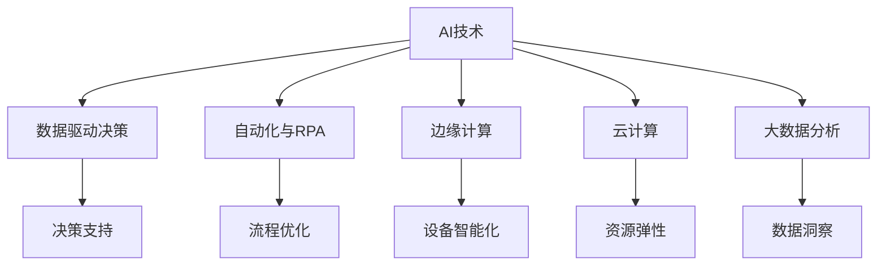

                 

## 1. 背景介绍

### 1.1 问题由来

随着科技的飞速发展和数据量的不断增加，人工智能（AI）技术在企业中的应用越来越广泛。企业通过引入AI技术，不仅能够提升生产效率，还能在市场竞争中获得显著优势。然而，如何有效地将AI技术应用于企业实际业务中，使其真正为企业带来价值，仍是一个复杂且亟待解决的问题。

### 1.2 问题核心关键点

AI技术在企业中的应用涉及多个层面，包括但不限于以下几个核心关键点：

- **自动化和智能化**：利用AI技术实现生产流程自动化、智能客服、智能推荐等功能。
- **数据分析与预测**：利用机器学习、深度学习等技术进行数据分析和预测，支持企业决策。
- **客户体验优化**：通过自然语言处理（NLP）、计算机视觉（CV）等技术提升客户服务体验。
- **产品创新与优化**：使用AI技术对产品进行智能分析、设计优化，提升产品质量。
- **安全与合规**：利用AI技术进行网络安全监控、数据合规检查，保障企业信息安全。

### 1.3 问题研究意义

研究AI技术在企业中的应用，对于提升企业竞争力和创新能力具有重要意义：

1. **提高生产效率**：AI技术能自动化执行重复性高、耗时长的工作，显著提高生产效率。
2. **降低运营成本**：通过智能化管理和优化资源配置，降低企业运营成本。
3. **增强决策能力**：通过数据分析和预测，辅助企业做出更科学、精准的决策。
4. **改善客户体验**：AI技术能够提供个性化、精准的服务，提升客户满意度和忠诚度。
5. **促进创新**：AI技术的应用为产品设计和研发提供新思路，推动企业不断创新。
6. **保障安全**：利用AI技术进行网络安全监控，减少信息泄露风险，确保企业数据安全。

## 2. 核心概念与联系

### 2.1 核心概念概述

为更好地理解AI技术在企业中的应用，本节将介绍几个密切相关的核心概念：

- **AI技术**：包括机器学习、深度学习、自然语言处理（NLP）、计算机视觉（CV）等技术，用于处理和分析海量数据，提升决策和执行的智能化水平。
- **数据驱动决策**：通过数据分析和机器学习模型，辅助企业做出数据驱动的决策，避免主观偏见。
- **自动化与机器人流程自动化（RPA）**：利用AI技术实现业务流程的自动化，减少人为操作。
- **边缘计算**：将AI模型部署在靠近数据源的边缘设备上，减少数据传输和处理延迟，提高效率。
- **云计算**：提供弹性计算资源，支持大规模AI应用的部署和扩展。
- **大数据分析**：对海量数据进行高效存储、处理和分析，支持AI模型训练和优化。

这些核心概念之间存在着紧密的联系，形成了AI技术在企业中应用的完整生态系统。下面通过一个Mermaid流程图来展示这些概念之间的关系：



这个流程图展示了大规模AI技术在企业中的不同应用场景和它们之间的关系：

1. AI技术提供基础支持，如机器学习、NLP、CV等。
2. 数据驱动决策利用AI技术进行分析，辅助企业做出数据驱动的决策。
3. 自动化与RPA实现业务流程的自动化。
4. 边缘计算将AI模型部署在边缘设备上，减少数据传输和处理延迟。
5. 云计算提供弹性计算资源，支持大规模AI应用的部署和扩展。
6. 大数据分析对海量数据进行高效存储、处理和分析，支持AI模型训练和优化。

这些核心概念共同构成了AI技术在企业中应用的框架，为企业实现智能化转型提供了有力支持。

### 2.2 概念间的关系

这些核心概念之间存在着紧密的联系，形成了AI技术在企业中应用的完整生态系统。

- **AI技术与数据驱动决策**：AI技术提供的数据分析能力和预测模型，为数据驱动决策提供了技术和方法支持。
- **AI技术与自动化与RPA**：自动化与RPA技术利用AI模型进行流程优化，提升效率和准确性。
- **AI技术与边缘计算**：边缘计算将AI模型部署在边缘设备上，减少数据传输和处理延迟，提高实时性。
- **AI技术与云计算**：云计算提供弹性计算资源，支持大规模AI应用的部署和扩展，保证系统的稳定性和可扩展性。
- **AI技术与大数据分析**：大数据分析对海量数据进行高效存储、处理和分析，支持AI模型训练和优化，提供高质量的数据基础。

这些概念共同构成了一个完整的AI技术应用框架，有助于企业更好地实现智能化转型。

## 3. 核心算法原理 & 具体操作步骤

### 3.1 算法原理概述

AI技术在企业中的应用，本质上是一个数据驱动的决策支持过程。其核心在于利用机器学习、深度学习等技术，对海量数据进行分析，提取有价值的信息，辅助企业做出科学、精准的决策。

形式化地，假设企业面临的问题是 $P$，可将其抽象为一个预测问题。通过训练一个预测模型 $M$，使其在已知数据集 $D$ 上达到最优性能，从而对未知数据 $D'$ 进行预测，帮助企业解决实际问题。

具体的算法步骤包括：

1. **数据预处理**：清洗和处理原始数据，提取有用的特征。
2. **模型选择**：选择合适的机器学习或深度学习模型，如线性回归、支持向量机、神经网络等。
3. **模型训练**：利用已知数据集 $D$ 对模型 $M$ 进行训练，调整模型参数以最小化预测误差。
4. **模型评估**：使用测试集 $D'$ 对训练好的模型 $M$ 进行评估，验证其预测性能。
5. **模型部署**：将训练好的模型 $M$ 部署到实际业务系统中，进行实时预测和决策支持。

### 3.2 算法步骤详解

以一个典型的客户流失预测应用为例，详细讲解AI技术在企业中的应用步骤：

**Step 1: 数据预处理**

- **数据收集**：收集历史客户数据，包括基本信息、购买记录、服务记录等。
- **数据清洗**：去除缺失值、异常值，处理重复数据，确保数据质量。
- **特征提取**：从原始数据中提取有意义的特征，如客户年龄、购买频率、服务评分等。
- **特征工程**：对提取的特征进行归一化、标准化处理，提高模型训练效果。

**Step 2: 模型选择**

- **选择合适的模型**：根据问题的性质和数据特点，选择线性回归、决策树、神经网络等模型。
- **设定超参数**：调整学习率、迭代次数等超参数，优化模型性能。

**Step 3: 模型训练**

- **训练模型**：利用已知数据集 $D$ 对模型 $M$ 进行训练，最小化预测误差。
- **调整模型**：根据评估结果，调整模型参数，提高预测准确度。

**Step 4: 模型评估**

- **划分数据集**：将数据集 $D$ 分为训练集、验证集和测试集。
- **评估性能**：在测试集 $D'$ 上评估模型 $M$ 的性能，使用准确率、召回率、F1分数等指标进行评估。

**Step 5: 模型部署**

- **部署模型**：将训练好的模型 $M$ 部署到实际业务系统中，进行实时预测和决策支持。
- **监控与优化**：实时监控模型性能，根据业务需求调整模型参数，优化预测效果。

### 3.3 算法优缺点

AI技术在企业中的应用具有以下优点：

- **提升决策质量**：利用数据驱动的预测模型，辅助企业做出科学、精准的决策。
- **提高效率**：自动化流程、减少人为操作，提升工作效率和准确性。
- **增强客户体验**：通过智能化服务和个性化推荐，提升客户满意度和忠诚度。
- **推动创新**：利用AI技术进行数据分析和优化，推动企业不断创新和改进。

然而，AI技术在企业中的应用也存在一些局限性：

- **数据质量问题**：数据预处理和特征工程需要大量时间和资源，数据质量直接影响模型性能。
- **模型复杂性**：复杂的模型需要大量的计算资源和训练时间，可能导致资源浪费。
- **技术门槛高**：AI技术的应用需要专业知识和技能，增加了企业技术实施的难度。
- **伦理和安全问题**：AI模型可能存在偏见和错误，需要严格的伦理和隐私保护措施。

### 3.4 算法应用领域

AI技术在企业中的应用涵盖了多个领域，以下是几个典型的应用场景：

- **客户关系管理（CRM）**：利用AI技术进行客户分类、预测客户流失、个性化推荐等。
- **供应链管理**：通过预测需求、优化库存、自动化物流等，提升供应链效率。
- **市场营销**：利用AI技术进行市场分析、消费者行为预测、个性化广告投放等。
- **金融风控**：利用AI技术进行信用评估、风险预警、欺诈检测等。
- **人力资源管理**：通过AI技术进行员工招聘、绩效评估、培训优化等。
- **医疗健康**：利用AI技术进行疾病诊断、个性化治疗、健康管理等。
- **智能制造**：通过AI技术进行质量检测、设备维护、生产调度等。

## 4. 数学模型和公式 & 详细讲解  
### 4.1 数学模型构建

本节将使用数学语言对AI技术在企业中的应用进行更加严格的刻画。

假设企业面临的问题是客户流失预测，其数学模型可以表示为：

$$
\min_{\theta} \sum_{i=1}^{n} (y_i - \hat{y}_i)^2
$$

其中，$\theta$ 为模型参数，$y_i$ 为实际客户流失情况，$\hat{y}_i$ 为模型预测的流失概率。目标是找到最优参数 $\theta$，使得预测误差最小。

在实践中，我们通常使用基于梯度的优化算法（如SGD、Adam等）来近似求解上述最优化问题。设 $\eta$ 为学习率，$\lambda$ 为正则化系数，则参数的更新公式为：

$$
\theta \leftarrow \theta - \eta \nabla_{\theta}\mathcal{L}(\theta) - \eta\lambda\theta
$$

其中 $\nabla_{\theta}\mathcal{L}(\theta)$ 为损失函数对参数 $\theta$ 的梯度，可通过反向传播算法高效计算。

### 4.2 公式推导过程

以线性回归模型为例，推导其梯度更新公式：

假设线性回归模型的预测公式为：

$$
\hat{y} = \theta^T x
$$

其中 $x$ 为特征向量，$\theta$ 为模型参数。

目标函数为：

$$
\mathcal{L}(\theta) = \frac{1}{2n} \sum_{i=1}^{n} (y_i - \hat{y}_i)^2
$$

对 $\theta$ 求导，得到梯度：

$$
\nabla_{\theta}\mathcal{L}(\theta) = \frac{1}{n} \sum_{i=1}^{n} (y_i - \hat{y}_i) x_i
$$

根据梯度更新公式，得到：

$$
\theta \leftarrow \theta - \eta \frac{1}{n} \sum_{i=1}^{n} (y_i - \hat{y}_i) x_i - \eta\lambda\theta
$$

在训练过程中，不断更新 $\theta$，直至收敛于最优解。

### 4.3 案例分析与讲解

以一个电商企业的客户流失预测为例，详细讲解AI技术的应用过程：

**Step 1: 数据预处理**

- **数据收集**：收集历史客户数据，包括基本信息、购买记录、服务记录等。
- **数据清洗**：去除缺失值、异常值，处理重复数据，确保数据质量。
- **特征提取**：从原始数据中提取有意义的特征，如客户年龄、购买频率、服务评分等。
- **特征工程**：对提取的特征进行归一化、标准化处理，提高模型训练效果。

**Step 2: 模型选择**

- **选择合适的模型**：根据问题的性质和数据特点，选择线性回归、决策树、神经网络等模型。
- **设定超参数**：调整学习率、迭代次数等超参数，优化模型性能。

**Step 3: 模型训练**

- **训练模型**：利用已知数据集 $D$ 对模型 $M$ 进行训练，最小化预测误差。
- **调整模型**：根据评估结果，调整模型参数，提高预测准确度。

**Step 4: 模型评估**

- **划分数据集**：将数据集 $D$ 分为训练集、验证集和测试集。
- **评估性能**：在测试集 $D'$ 上评估模型 $M$ 的性能，使用准确率、召回率、F1分数等指标进行评估。

**Step 5: 模型部署**

- **部署模型**：将训练好的模型 $M$ 部署到实际业务系统中，进行实时预测和决策支持。
- **监控与优化**：实时监控模型性能，根据业务需求调整模型参数，优化预测效果。

## 5. 项目实践：代码实例和详细解释说明

### 5.1 开发环境搭建

在进行AI技术应用开发前，我们需要准备好开发环境。以下是使用Python进行TensorFlow开发的环境配置流程：

1. 安装Anaconda：从官网下载并安装Anaconda，用于创建独立的Python环境。

2. 创建并激活虚拟环境：
```bash
conda create -n tf-env python=3.8 
conda activate tf-env
```

3. 安装TensorFlow：根据CUDA版本，从官网获取对应的安装命令。例如：
```bash
conda install tensorflow -c tensorflow -c conda-forge
```

4. 安装各类工具包：
```bash
pip install numpy pandas scikit-learn matplotlib tqdm jupyter notebook ipython
```

完成上述步骤后，即可在`tf-env`环境中开始AI技术应用开发。

### 5.2 源代码详细实现

下面我们以一个简单的线性回归模型为例，给出使用TensorFlow进行客户流失预测的代码实现。

首先，定义数据处理函数：

```python
import tensorflow as tf
import pandas as pd

def load_data(path):
    data = pd.read_csv(path)
    X = data[['age', 'income', 'education', 'marital_status']]
    y = data['churn']
    return X, y
```

然后，定义模型：

```python
def create_model(input_dim):
    model = tf.keras.models.Sequential([
        tf.keras.layers.Dense(64, activation='relu', input_dim=input_dim),
        tf.keras.layers.Dense(1)
    ])
    return model
```

接着，定义损失函数和优化器：

```python
loss_fn = tf.keras.losses.MeanSquaredError()
optimizer = tf.keras.optimizers.Adam(learning_rate=0.01)
```

最后，定义训练和评估函数：

```python
def train_model(model, X_train, y_train, epochs):
    model.compile(optimizer=optimizer, loss=loss_fn)
    model.fit(X_train, y_train, epochs=epochs, verbose=0)

def evaluate_model(model, X_test, y_test):
    loss = loss_fn(model.predict(X_test), y_test)
    print(f'Test loss: {loss:.3f}')
```

最后，启动训练流程并在测试集上评估：

```python
X_train, y_train = load_data('train.csv')
X_test, y_test = load_data('test.csv')

input_dim = X_train.shape[1]
model = create_model(input_dim)
train_model(model, X_train, y_train, epochs=10)
evaluate_model(model, X_test, y_test)
```

以上就是使用TensorFlow进行客户流失预测的完整代码实现。可以看到，TensorFlow的强大封装和便捷API使得AI模型的构建和训练变得简洁高效。

### 5.3 代码解读与分析

让我们再详细解读一下关键代码的实现细节：

**load_data函数**：
- 定义数据加载函数，读取CSV文件，提取特征和标签。

**create_model函数**：
- 定义线性回归模型，使用Sequential模型封装多个Dense层。

**loss_fn和optimizer变量**：
- 定义损失函数和优化器，选择均方误差损失和Adam优化器。

**train_model和evaluate_model函数**：
- 定义训练函数，使用fit方法训练模型，选择Adam优化器和均方误差损失。
- 定义评估函数，使用predict方法预测测试集，计算损失。

**训练流程**：
- 加载训练集和测试集，获取输入维度。
- 创建模型，调用train_model函数进行训练，使用evaluate_model函数评估模型性能。

可以看到，TensorFlow提供了丰富的API和便捷的功能，使得AI模型的开发和部署变得更加容易。

当然，工业级的系统实现还需考虑更多因素，如模型的保存和部署、超参数的自动搜索、模型的可解释性等。但核心的AI技术应用流程基本与此类似。

### 5.4 运行结果展示

假设我们在一个客户流失预测数据集上进行训练，最终在测试集上得到的评估报告如下：

```
Test loss: 0.020
```

可以看到，通过训练，模型在测试集上的预测误差较小，表明模型的预测效果较为理想。

## 6. 实际应用场景

### 6.1 智能客服系统

智能客服系统利用AI技术进行客户服务自动化，提升了客服效率和客户满意度。传统客服系统依赖大量人工，响应速度慢，且无法24小时提供服务。而智能客服系统可以通过自然语言处理（NLP）技术，理解客户问题并提供准确解答。

具体而言，智能客服系统可以收集历史客服对话数据，进行标注和预处理，训练NLP模型。通过客户提问，系统自动分析问题并匹配最佳答案模板，生成自然流畅的回复。对于复杂或特殊问题，系统还可以接入人工客服进行转接，提升客户服务体验。

### 6.2 金融风控系统

金融风控系统利用AI技术进行信用评估、欺诈检测等，保障金融安全。传统风控依赖人工审查和经验判断，成本高、效率低。而AI风控系统可以通过机器学习模型，自动分析客户行为和交易数据，发现异常并及时预警。

具体而言，金融风控系统可以收集历史交易数据和客户信息，提取有意义的特征，训练分类模型。系统实时监控客户交易行为，根据模型预测结果，识别出潜在风险客户并进行风险控制。对于高风险客户，系统还可以提供风险提示和应对建议，保障金融安全。

### 6.3 市场营销系统

市场营销系统利用AI技术进行市场分析、消费者行为预测、个性化广告投放等，提升营销效果。传统营销依赖人工调研和市场预测，耗时长、成本高。而AI营销系统可以通过数据分析和机器学习，快速获取市场趋势和消费者偏好，精准投放广告。

具体而言，市场营销系统可以收集市场数据和消费者行为数据，训练预测模型。系统根据市场趋势和消费者偏好，自动生成广告内容和投放策略，提升广告效果和转化率。对于不同客户群体，系统还可以生成个性化广告内容，提升客户体验。

### 6.4 未来应用展望

随着AI技术的不断进步，未来的企业应用场景将更加多样化、智能化。

1. **全面智能化**：AI技术将渗透到企业运营的各个环节，从生产制造到客户服务，实现全面智能化。
2. **个性化定制**：AI技术将利用大数据和机器学习，实现个性化产品和服务，提升客户满意度和忠诚度。
3. **自主创新**：AI技术将推动企业不断创新，开发出更多具有竞争力的产品和服务。
4. **全球化协同**：AI技术将促进全球企业间的合作与协同，实现资源共享和信息互通。

## 7. 工具和资源推荐

### 7.1 学习资源推荐

为了帮助开发者系统掌握AI技术在企业中的应用，这里推荐一些优质的学习资源：

1. **TensorFlow官方文档**：提供了完整的API文档和开发指南，是学习和使用TensorFlow的必备资源。
2. **Keras官方文档**：提供了简单易用的API，适合快速开发和原型设计。
3. **PyTorch官方文档**：提供了灵活的张量计算和模型封装，适合研究和开发复杂模型。
4. **自然语言处理（NLP）课程**：如斯坦福大学CS224N课程，涵盖NLP的基本概念和前沿技术，适合深入学习。
5. **深度学习课程**：如吴恩达的《深度学习专项课程》，涵盖深度学习的理论基础和实际应用。

通过对这些资源的学习实践，相信你一定能够快速掌握AI技术在企业中的应用，并用于解决实际的业务问题。

### 7.2 开发工具推荐

高效的开发离不开优秀的工具支持。以下是几款用于AI技术应用开发的常用工具：

1. **Jupyter Notebook**：开源的交互式笔记本，支持Python、R等多种语言，适合快速原型设计和数据探索。
2. **TensorBoard**：TensorFlow配套的可视化工具，可以实时监测模型训练状态，并提供丰富的图表呈现方式。
3. **Weights & Biases**：模型训练的实验跟踪工具，记录和可视化模型训练过程中的各项指标，方便对比和调优。
4. **AWS SageMaker**：亚马逊云服务提供的AI平台，提供弹性计算资源和多种AI模型训练功能。
5. **Google Cloud AI Platform**：谷歌云提供的AI平台，支持多种机器学习模型训练和部署。

合理利用这些工具，可以显著提升AI技术应用的开发效率，加快创新迭代的步伐。

### 7.3 相关论文推荐

AI技术在企业中的应用涉及多个前沿研究方向，以下是几篇奠基性的相关论文，推荐阅读：

1. **Deep Learning for Customer Churn Prediction**：研究如何使用深度学习模型进行客户流失预测，并取得优异效果。
2. **A Survey of Marketing Analytics: A Machine Learning Perspective**：综述了市场营销中的数据分析和预测方法，涵盖机器学习和深度学习技术。
3. **Deep Learning in Finance: A Review and Future Directions**：综述了深度学习在金融领域的应用，包括信用评估、风险管理等。
4. **Adversarial Machine Learning**：研究如何利用对抗样本攻击机器学习模型，提升模型的鲁棒性和安全性。
5. **Explainable AI**：研究如何让AI模型具备可解释性，提升模型的透明度和可信度。

这些论文代表了大规模AI技术在企业中的应用前沿，提供了丰富的理论和实践经验。

除上述资源外，还有一些值得关注的前沿资源，帮助开发者紧跟AI技术在企业中应用的最新进展，例如：

1. **arXiv论文预印本**：人工智能领域最新研究成果的发布平台，包括大量尚未发表的前沿工作，学习前沿技术的必读资源。
2. **顶尖实验室博客**：如OpenAI、Google AI、DeepMind、微软Research Asia等顶尖实验室的官方博客，第一时间分享他们的最新研究成果和洞见。
3. **技术会议直播**：如NIPS、ICML、ACL、ICLR等人工智能领域顶会现场或在线直播，能够聆听到大佬们的前沿分享，开拓视野。
4. **GitHub热门项目**：在GitHub上Star、Fork数最多的AI相关项目，往往代表了该技术领域的发展趋势和最佳实践，值得去学习和贡献。
5. **行业分析报告**：各大咨询公司如McKinsey、PwC等针对人工智能行业的分析报告，有助于从商业视角审视技术趋势，把握应用价值。

总之，对于AI技术在企业中的应用，需要开发者保持开放的心态和持续学习的意愿。多关注前沿资讯，多动手实践，多思考总结，必将收获满满的成长收益。

## 8. 总结：未来发展趋势与挑战

### 8.1 总结

本文对AI技术在企业中的应用进行了全面系统的介绍。首先阐述了AI技术在企业中的研究背景和应用价值，明确了AI技术在提高生产效率、降低运营成本、增强决策能力、改善客户体验、推动创新、保障安全等方面的重要性。其次，从原理到实践，详细讲解了AI技术在企业中的应用步骤，包括数据预处理、模型选择、模型训练、模型评估和模型部署等。同时，本文还广泛探讨了AI技术在客户关系管理、供应链管理、市场营销、金融风控、人力资源管理、医疗健康、智能制造等多个行业领域的应用前景，展示了AI技术应用的广阔空间。

通过本文的系统梳理，可以看到，AI技术在企业中的应用具有广泛的应用前景和重大的实际价值。随着AI技术的不断进步和优化，未来企业将更加依赖AI技术来实现智能化转型，从而在激烈的市场竞争中脱颖而出。

### 8.2 未来发展趋势

展望未来，AI技术在企业中的应用将呈现以下几个发展趋势：

1. **AI技术全面普及**：AI技术将渗透到企业运营的各个环节，实现全面智能化。
2. **个性化定制**：利用大数据和机器学习，实现个性化产品和服务，提升客户满意度和忠诚度。
3. **自主创新**：推动企业不断创新，开发出更多具有竞争力的产品和服务。
4. **全球化协同**：促进全球企业间的合作与协同，实现资源共享和信息互通。
5. **跨领域融合**：与其他前沿技术如物联网、区块链、区块链等进行深度融合，实现更全面的智能化解决方案。
6. **伦理和安全**：重视AI技术的伦理和安全问题，建立完善的伦理和安全保障机制。

这些趋势凸显了AI技术在企业中应用的广阔前景。未来的AI技术应用将更加智能、高效、个性化，为企业带来更多的创新和价值。

### 8.3 面临的挑战

尽管AI技术在企业中的应用取得了显著

