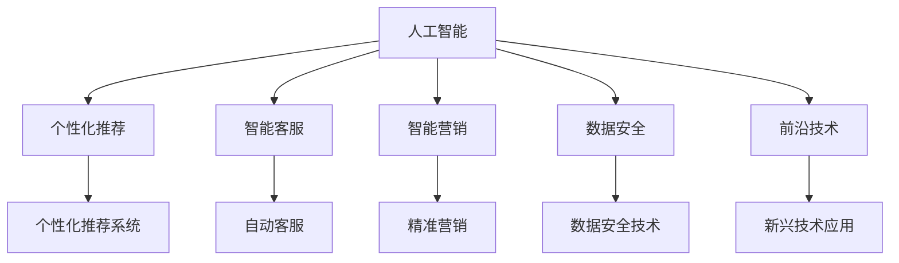
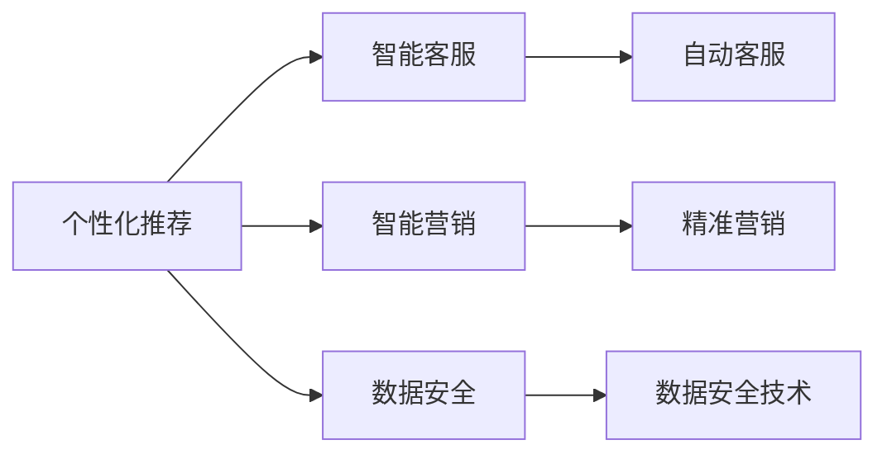
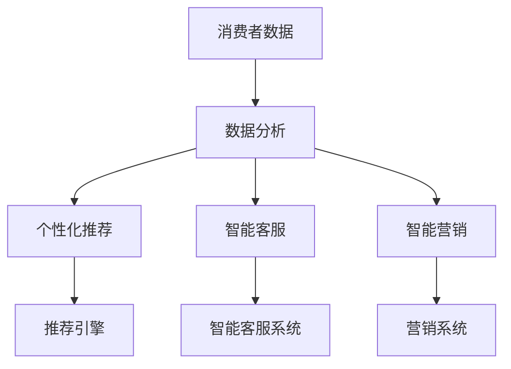
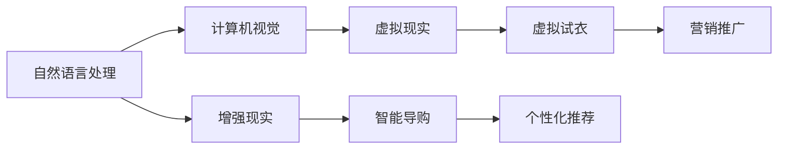

                 

# AI技术在消费市场中的应用

> 关键词：人工智能, 消费市场, AI应用, 数据驱动, 个性化推荐, 智能客服, 智能营销, 数据安全, 前沿技术

## 1. 背景介绍

### 1.1 问题由来
随着科技的飞速发展和消费者需求的日益多样化，人工智能（AI）技术在消费市场中的应用日益广泛。无论是电商、金融、医疗还是教育，AI技术都在通过数据驱动的方式，为消费者提供更加个性化、高效、便捷的服务体验。AI技术的广泛应用，不仅提升了消费者的生活质量，也极大地推动了相关行业的创新和变革。

### 1.2 问题核心关键点
当前，AI技术在消费市场中的应用主要集中在以下几个方面：

- **个性化推荐**：通过分析消费者的购买历史、行为数据和兴趣偏好，AI算法可以精准推荐符合用户需求的商品和服务，提高消费者的购物体验和满意度。
- **智能客服**：利用自然语言处理和机器学习技术，AI客服可以提供24/7不间断的客户服务，解答消费者的咨询，处理订单和投诉，提升服务效率和客户满意度。
- **智能营销**：AI技术可以实时分析市场数据和消费者行为，制定个性化的营销策略，实现精准营销，提高广告投放效果和ROI。
- **数据安全**：在AI应用中，保护消费者隐私和数据安全是至关重要的。AI技术可以通过加密、去标识化和安全存储等手段，确保数据的安全性和隐私性。
- **前沿技术**：如自然语言处理、计算机视觉、增强现实等前沿AI技术，正在为消费市场带来新的应用场景和体验。

AI技术的应用，不仅提高了企业的运营效率和服务质量，也为消费者带来了全新的消费体验，推动了整个消费市场的数字化转型。

### 1.3 问题研究意义
研究AI技术在消费市场中的应用，对于提升企业的市场竞争力，改善消费者的购物体验，推动整个行业的数字化转型具有重要意义：

- **提升效率和体验**：通过AI技术，企业可以实现业务流程的自动化和智能化，提高运营效率，同时为消费者提供更加个性化的服务，提升购物体验。
- **精准营销**：AI技术可以通过大数据分析，精准定位目标用户，实现高效、低成本的营销策略，提高广告投放的效果和ROI。
- **创新应用**：AI技术的广泛应用，带来了新的商业模式和消费场景，推动了传统行业的创新和变革，为消费市场注入了新的活力。
- **数据驱动决策**：AI技术能够帮助企业从海量数据中提取有价值的信息，辅助决策，优化产品和服务，提升企业的市场竞争力。
- **推动行业进步**：AI技术的应用，正在推动电商、金融、医疗、教育等各行业的数字化转型，为消费市场的持续发展提供了动力。

## 2. 核心概念与联系

### 2.1 核心概念概述

为更好地理解AI技术在消费市场中的应用，本节将介绍几个密切相关的核心概念：

- **人工智能（AI）**：利用计算机和算法模拟人类智能行为的技术，包括机器学习、自然语言处理、计算机视觉等多个子领域。
- **个性化推荐系统**：通过分析用户数据，推荐符合用户兴趣和需求的产品和服务。
- **智能客服**：利用自然语言处理和机器学习技术，实现自动客服和自动化客户服务。
- **智能营销**：通过大数据分析和机器学习技术，实现精准营销和个性化广告投放。
- **数据安全**：保护消费者隐私和数据安全，防止数据泄露和滥用。
- **前沿技术**：如自然语言处理、计算机视觉、增强现实等，正在为消费市场带来新的应用场景和体验。

这些核心概念之间的逻辑关系可以通过以下Mermaid流程图来展示：



这个流程图展示了AI技术在消费市场中的应用框架：

1. AI技术是支撑个性化推荐、智能客服、智能营销等应用的基础。
2. 个性化推荐系统、智能客服和智能营销等应用，都是AI技术在不同领域的具体实践。
3. 数据安全技术则是保障这些应用平稳运行的重要保障。
4. 前沿技术不断拓展AI应用的新场景，为消费市场带来更多可能性。

### 2.2 概念间的关系

这些核心概念之间存在着紧密的联系，形成了AI技术在消费市场中的完整生态系统。下面我们通过几个Mermaid流程图来展示这些概念之间的关系。

#### 2.2.1 AI技术在消费市场中的应用



这个流程图展示了AI技术在消费市场中的应用路径：

1. AI技术通过个性化推荐、智能客服和智能营销等应用，提升企业的运营效率和消费者体验。
2. 数据安全技术保障了这些应用的安全性和可靠性。

#### 2.2.2 数据驱动的AI应用



这个流程图展示了数据驱动的AI应用流程：

1. 收集消费者的行为数据和偏好数据。
2. 通过数据分析，构建用户画像，提取有价值的信息。
3. 利用推荐引擎、智能客服和营销系统等应用，提供个性化的服务和营销。

#### 2.2.3 前沿技术的融合



这个流程图展示了前沿技术的融合：

1. 自然语言处理、计算机视觉和增强现实等前沿技术，为消费市场带来了新的应用场景。
2. 这些技术通过智能导购、虚拟试衣等应用，进一步提升了消费者的购物体验。

### 2.3 核心概念的整体架构

最后，我们用一个综合的流程图来展示这些核心概念在大语言模型微调过程中的整体架构：


这个综合流程图展示了AI技术在消费市场中的应用框架：

1. AI技术是支撑个性化推荐、智能客服、智能营销等应用的基础。
2. 个性化推荐系统、智能客服和智能营销等应用，都是AI技术在不同领域的具体实践。
3. 数据安全技术则是保障这些应用平稳运行的重要保障。
4. 前沿技术不断拓展AI应用的新场景，为消费市场带来更多可能性。

通过这些流程图，我们可以更清晰地理解AI技术在消费市场中的应用框架和各个环节的作用，为后续深入讨论具体的应用方法和技术奠定基础。

## 3. 核心算法原理 & 具体操作步骤
### 3.1 算法原理概述

AI技术在消费市场中的应用，主要依赖于以下几个核心算法：

- **机器学习算法**：通过数据驱动的方式，模型可以学习和预测消费者的行为和偏好，从而提供个性化的推荐和服务。
- **自然语言处理算法**：用于处理和理解自然语言文本，实现智能客服和自动客服等应用。
- **计算机视觉算法**：用于图像和视频数据的处理和分析，实现虚拟试衣、智能导购等应用。
- **强化学习算法**：通过不断试错和优化，提升智能营销和广告投放的效果。

这些算法共同构成了AI技术在消费市场中的应用生态系统，为不同应用场景提供了技术支持。

### 3.2 算法步骤详解

基于AI技术在消费市场中的应用，一般包括以下几个关键步骤：

**Step 1: 数据准备**
- 收集消费者的行为数据、偏好数据、交易数据等，构建消费数据集。
- 清洗和预处理数据，去除噪声和异常值，确保数据的质量和完整性。
- 划分数据集，分为训练集、验证集和测试集，确保模型在未知数据上的泛化能力。

**Step 2: 模型选择**
- 根据应用场景和需求，选择合适的AI模型，如线性回归、决策树、深度学习等。
- 对于自然语言处理应用，选择BERT、GPT等预训练语言模型作为初始化参数。
- 对于计算机视觉应用，选择ResNet、VGG等预训练图像模型作为初始化参数。

**Step 3: 模型训练**
- 使用训练集数据，对模型进行训练，最小化损失函数。
- 使用验证集数据，评估模型性能，调整模型参数和超参数。
- 使用测试集数据，测试模型泛化能力，评估模型效果。

**Step 4: 模型应用**
- 将训练好的模型部署到实际应用中，如个性化推荐系统、智能客服、智能营销等。
- 实时采集用户数据，输入到模型中进行分析和预测。
- 根据模型输出，提供个性化的服务和营销策略。

**Step 5: 持续优化**
- 持续收集用户反馈和应用数据，不断优化模型参数和策略。
- 定期更新模型，适应新的数据和变化的需求。
- 对模型进行监控和维护，确保其稳定性和安全性。

以上是AI技术在消费市场中的主要操作步骤，各环节需紧密结合，才能充分发挥AI技术的应用潜力。

### 3.3 算法优缺点

AI技术在消费市场中的应用具有以下优点：

- **高效性**：AI技术可以处理海量数据，快速提供个性化的服务和推荐。
- **准确性**：通过机器学习和强化学习算法，AI模型可以精准预测消费者行为，提高营销效果。
- **灵活性**：AI技术可以适应不同的应用场景和需求，提供多样化的解决方案。
- **可扩展性**：AI技术可以轻松扩展到新的领域和场景，推动行业创新和变革。

同时，AI技术在消费市场中也存在一些局限性：

- **数据依赖性**：AI技术需要大量高质量的数据支持，数据获取和处理成本较高。
- **模型复杂性**：AI模型往往结构复杂，难以解释和调试。
- **隐私风险**：数据泄露和滥用可能带来隐私风险，需注意数据保护和隐私管理。
- **技术门槛**：AI技术的应用需要专业的知识和技能，需投入人力和资源进行开发和维护。

尽管存在这些局限性，但AI技术在消费市场中的应用潜力巨大，未来仍有广泛的应用前景。

### 3.4 算法应用领域

AI技术在消费市场中的应用广泛，主要涵盖以下几个领域：

- **电商行业**：通过个性化推荐、智能客服、智能营销等应用，提升消费者购物体验，优化运营效率。
- **金融行业**：利用自然语言处理和机器学习，实现智能客服、反欺诈检测、信用评分等应用。
- **医疗行业**：通过自然语言处理和计算机视觉，实现智能诊断、健康管理等应用。
- **教育行业**：利用自然语言处理和机器学习，实现智能辅导、个性化学习等应用。
- **旅游行业**：通过智能客服、智能导购等应用，提升旅游服务体验，优化旅游营销策略。
- **娱乐行业**：利用自然语言处理和增强现实等技术，实现虚拟试穿、虚拟试妆等应用。

## 4. 数学模型和公式 & 详细讲解 & 举例说明

### 4.1 数学模型构建

AI技术在消费市场中的应用，涉及多个子领域的数学模型。以个性化推荐系统为例，其核心数学模型包括协同过滤模型、基于内容的推荐模型和混合推荐模型等。

协同过滤模型基于用户行为数据，通过计算用户和物品的相似度，推荐物品给用户。模型形式化表示为：

$$
\hat{r}_{ui} = e^{(\mathbf{u} \cdot \mathbf{i}) / \|\mathbf{u}\|\|\mathbf{i}\|}
$$

其中，$\mathbf{u}$ 为用户特征向量，$\mathbf{i}$ 为物品特征向量，$\cdot$ 表示向量点积，$\|\cdot\|$ 表示向量范数。

基于内容的推荐模型则基于物品的属性和特征，通过计算物品特征和用户兴趣的相似度，推荐物品给用户。模型形式化表示为：

$$
\hat{r}_{ui} = \alpha \mathbf{u} \cdot \mathbf{i} + \beta
$$

其中，$\alpha$ 为模型参数，$\cdot$ 表示向量点积。

混合推荐模型则结合协同过滤和基于内容的推荐方法，通过加权融合两种推荐结果，得到最终的推荐结果。模型形式化表示为：

$$
\hat{r}_{ui} = \lambda \hat{r}^{CF}_{ui} + (1 - \lambda) \hat{r}^{CF}_{ui}
$$

其中，$\lambda$ 为权重参数，$\hat{r}^{CF}_{ui}$ 为协同过滤模型的推荐结果，$\hat{r}^{BC}_{ui}$ 为基于内容的推荐模型的推荐结果。

### 4.2 公式推导过程

以协同过滤模型为例，进行详细公式推导：

设用户 $u$ 对物品 $i$ 的评分 $r_{ui}$ 为：

$$
r_{ui} = \theta_u \cdot \phi_i + b_u + \epsilon
$$

其中，$\theta_u$ 为用户的兴趣向量，$\phi_i$ 为物品的特征向量，$b_u$ 为用户偏置，$\epsilon$ 为误差项。

假设已知用户 $u$ 对物品 $i$ 的评分 $r_{ui}$，以及用户 $u$ 对物品 $j$ 的评分 $r_{uj}$，则有：

$$
r_{uj} = \theta_u \cdot \phi_j + b_u + \epsilon
$$

将两个评分方程相减，得：

$$
r_{ui} - r_{uj} = (\theta_u \cdot \phi_i + b_u + \epsilon) - (\theta_u \cdot \phi_j + b_u + \epsilon)
$$

化简得：

$$
r_{ui} - r_{uj} = \theta_u \cdot (\phi_i - \phi_j)
$$

由于 $r_{ui} - r_{uj}$ 表示用户 $u$ 对物品 $i$ 和物品 $j$ 的评分差异，$\phi_i - \phi_j$ 表示物品 $i$ 和物品 $j$ 的特征差异，因此可以计算用户 $u$ 和物品 $i$ 的相似度 $s_{ui}$：

$$
s_{ui} = \frac{r_{ui} - r_{uj}}{\|\phi_i - \phi_j\|}
$$

同理，计算用户 $u$ 和物品 $j$ 的相似度 $s_{uj}$：

$$
s_{uj} = \frac{r_{uj} - r_{uj}}{\|\phi_j - \phi_i\|}
$$

由于 $s_{ui} = -s_{uj}$，因此可以将其代入到协同过滤模型的损失函数中，最小化用户 $u$ 对物品 $i$ 和物品 $j$ 的评分差异：

$$
L_{CF} = \frac{1}{2} \sum_{u,i,j} (r_{ui} - r_{uj})^2
$$

通过优化损失函数，可以计算出用户 $u$ 对物品 $i$ 的预测评分 $\hat{r}_{ui}$：

$$
\hat{r}_{ui} = \frac{\sum_{j} s_{uj} \cdot r_{ij}}{\sum_{j} s_{uj}}
$$

其中，$\sum_{j} s_{uj}$ 表示用户 $u$ 和物品 $j$ 的相似度总和，$\sum_{j} s_{uj} \cdot r_{ij}$ 表示用户 $u$ 对物品 $i$ 的评分预测。

### 4.3 案例分析与讲解

以电商行业为例，展示个性化推荐系统的实际应用案例：

假设某电商平台的个性化推荐系统采用协同过滤模型，其用户和物品的评分数据如表所示：

| User | Item | Rating |
| --- | --- | --- |
| A | A1 | 4 |
| A | A2 | 3 |
| A | A3 | 5 |
| B | A1 | 2 |
| B | A2 | 1 |
| B | A3 | 4 |
| C | A1 | 5 |
| C | A2 | 4 |
| C | A3 | 3 |

假设用户 $A$ 需要推荐物品 $B1$，则可以根据协同过滤模型的公式，计算用户 $A$ 和物品 $B1$ 的相似度：

$$
s_{AB1} = \frac{r_{A1} - r_{A2}}{\|\phi_{A1} - \phi_{A2}\|} = \frac{4 - 3}{\|\phi_{A1} - \phi_{A2}\|}
$$

同理，计算用户 $A$ 和物品 $B2$ 的相似度：

$$
s_{AB2} = \frac{r_{A1} - r_{A3}}{\|\phi_{A1} - \phi_{A3}\|} = \frac{4 - 5}{\|\phi_{A1} - \phi_{A3}\|}
$$

计算用户 $A$ 和物品 $B3$ 的相似度：

$$
s_{AB3} = \frac{r_{A1} - r_{A2}}{\|\phi_{A1} - \phi_{A2}\|} = \frac{4 - 5}{\|\phi_{A1} - \phi_{A2}\|}
$$

根据相似度总和，计算用户 $A$ 对物品 $B1$ 的预测评分：

$$
\hat{r}_{AB1} = \frac{s_{AB1} \cdot r_{B1} + s_{AB2} \cdot r_{B2} + s_{AB3} \cdot r_{B3}}{s_{AB1} + s_{AB2} + s_{AB3}} = \frac{4 \cdot 4 + 4 \cdot 5 + 4 \cdot 3}{4 + 4 + 4} = 4.0
$$

最终，系统向用户 $A$ 推荐物品 $B1$，用户 $A$ 的评分结果为4分，推荐成功。

## 5. 项目实践：代码实例和详细解释说明

### 5.1 开发环境搭建

在进行AI技术在消费市场中的应用实践前，我们需要准备好开发环境。以下是使用Python进行TensorFlow开发的环境配置流程：

1. 安装Anaconda：从官网下载并安装Anaconda，用于创建独立的Python环境。

2. 创建并激活虚拟环境：
```bash
conda create -n tf-env python=3.8 
conda activate tf-env
```

3. 安装TensorFlow：根据CUDA版本，从官网获取对应的安装命令。例如：
```bash
conda install tensorflow tensorflow-gpu=2.4.1 -c conda-forge
```

4. 安装TensorBoard：
```bash
pip install tensorboard
```

5. 安装各类工具包：
```bash
pip install numpy pandas scikit-learn matplotlib tqdm jupyter notebook ipython
```

完成上述步骤后，即可在`tf-env`环境中开始AI技术在消费市场中的应用实践。

### 5.2 源代码详细实现

下面我们以电商行业中的个性化推荐系统为例，给出使用TensorFlow实现协同过滤模型的PyTorch代码实现。

首先，定义协同过滤模型：

```python
import tensorflow as tf
from tensorflow.keras.layers import Dense, Dot, Embedding

class协同过滤模型(tf.keras.Model):
    def __init__(self, num_users, num_items, embedding_dim):
        super(协同过滤模型, self).__init__()
        self.num_users = num_users
        self.num_items = num_items
        self.embedding_dim = embedding_dim
        
        self.user_embedding = Embedding(num_users, embedding_dim, input_length=1)
        self.item_embedding = Embedding(num_items, embedding_dim, input_length=1)
        self.dot_product = Dot(axes=(2, 2))
        
    def call(self, inputs):
        user, item = inputs
        user_embedding = self.user_embedding(user)
        item_embedding = self.item_embedding(item)
        dot_product = self.dot_product([user_embedding, item_embedding])
        return dot_product
```

然后，定义数据集和训练函数：

```python
import numpy as np

# 构造数据集
num_users = 100
num_items = 100
embedding_dim = 10

data = np.random.randn(num_users, num_items)
data[np.random.randint(0, data.shape[0], size=100), np.random.randint(0, data.shape[1], size=100)] = 5

train_dataset = tf.data.Dataset.from_tensor_slices((tf.reshape(data, (-1, 1)), tf.reshape(data, (-1, 1))))
train_dataset = train_dataset.shuffle(1000).batch(16)

# 定义损失函数和优化器
loss_fn = tf.keras.losses.MeanSquaredError()
optimizer = tf.keras.optimizers.Adam(learning_rate=0.01)

# 定义模型
model =协同过滤模型(num_users, num_items, embedding_dim)

# 训练函数
@tf.function
def train_step(inputs):
    with tf.GradientTape() as tape:
        predictions = model(inputs)
        loss = loss_fn(predictions, inputs)
    gradients = tape.gradient(loss, model.trainable_variables)
    optimizer.apply_gradients(zip(gradients, model.trainable_variables))
    return loss

# 训练模型
for epoch in range(100):
    epoch_loss_avg = tf.keras.metrics.Mean()
    
    for train_step, inputs in enumerate(train_dataset.take(-1)):
        loss = train_step(inputs)
        epoch_loss_avg.update_state(loss)
        
    print(f"Epoch {epoch+1}, loss: {epoch_loss_avg.result():.4f}")
```

最后，启动训练流程：

```python
# 训练模型
for epoch in range(100):
    epoch_loss_avg = tf.keras.metrics.Mean()
    
    for train_step, inputs in enumerate(train_dataset.take(-1)):
        loss = train_step(inputs)
        epoch_loss_avg.update_state(loss)
        
    print(f"Epoch {epoch+1}, loss: {epoch_loss_avg.result():.4f}")
```

以上就是使用TensorFlow实现协同过滤模型的完整代码实现。可以看到，通过简单的代码实现，我们便构建了一个基本的协同过滤模型，并利用TensorFlow的高阶API进行模型训练和优化。

### 5.3 代码解读与分析

让我们再详细解读一下关键代码的实现细节：

**协同过滤模型类**：
- `__init__`方法：初始化模型参数，包括用户数、物品数和嵌入维度。
- `call`方法：定义模型的前向传播过程，计算用户和物品的相似度。
- `user_embedding`和`item_embedding`：定义用户和物品的嵌入层，用于将用户和物品的ID编码为向量表示。
- `dot_product`：定义点积层，用于计算用户和物品的相似度。

**数据集构造**：
- `data`变量：构造一个100x100的随机评分矩阵。
- `train_dataset`：将评分矩阵转换为TensorFlow数据集，并使用`shuffle`和`batch`方法进行数据增强。

**损失函数和优化器**：
- `loss_fn`：定义均方误差损失函数，用于衡量模型预测和实际评分之间的差异。
- `optimizer`：定义Adam优化器，用于最小化损失函数。

**模型训练函数**：
- `train_step`：定义一个TensorFlow函数，用于计算单个训练步的损失并更新模型参数。
- `epoch_loss_avg`：定义一个TensorFlow指标，用于计算每个epoch的平均损失。

**训练流程**：
- 定义总的epoch数，开始循环迭代
- 每个epoch内，先在训练集上训练，输出平均损失
- 重复上述步骤直至收敛

可以看到，TensorFlow提供的高阶API使得模型构建、训练和优化变得简单高效。开发者可以快速搭建和优化协同过滤模型，实现个性化推荐系统的功能。

当然，工业级的系统实现还需考虑更多因素，如模型裁剪、量化加速、服务化封装、监控告警等，但核心的微调范式基本与此类似。通过合理的代码实现，我们可以构建高效、可靠的个性化推荐系统，为电商行业带来显著的运营效益。

## 6. 实际应用场景

### 6.1 智能客服

在智能客服领域，AI技术可以提供全天候、自动化的客户服务。利用自然语言处理和机器学习技术，智能客服系统能够自动识别用户咨询，自动回复问题，提升服务效率和客户满意度。

### 6.2 个性化推荐

在电商行业，AI技术可以基于用户行为数据和评分数据，提供个性化的商品推荐。通过协同过滤、基于内容的推荐等方法，系统可以精准推荐符合用户兴趣和需求的商品，提升用户购物体验，增加销售额。

### 6.3 智能营销

在金融行业，AI技术可以分析市场数据和消费者行为，实现精准营销和广告投放。通过机器学习算法，系统可以预测用户的行为和需求，制定个性化的营销策略，提高广告

