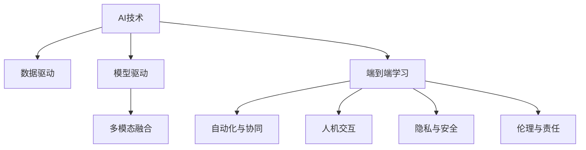
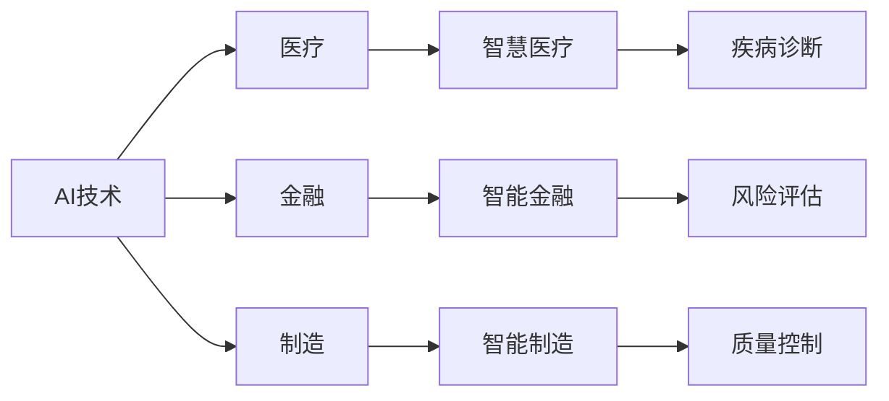
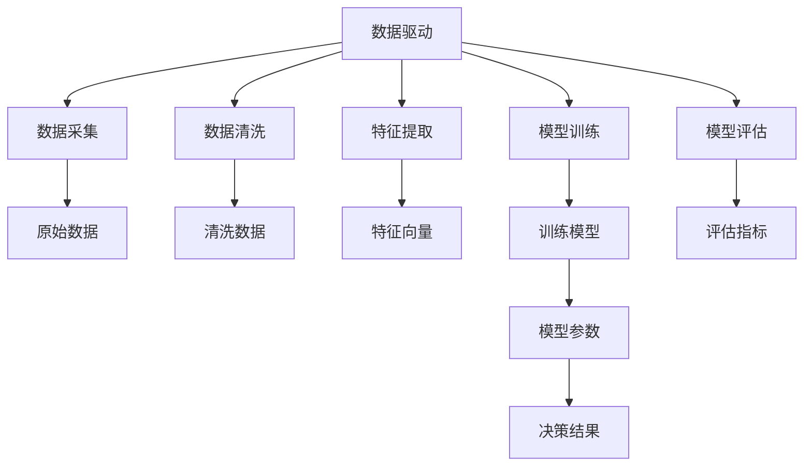
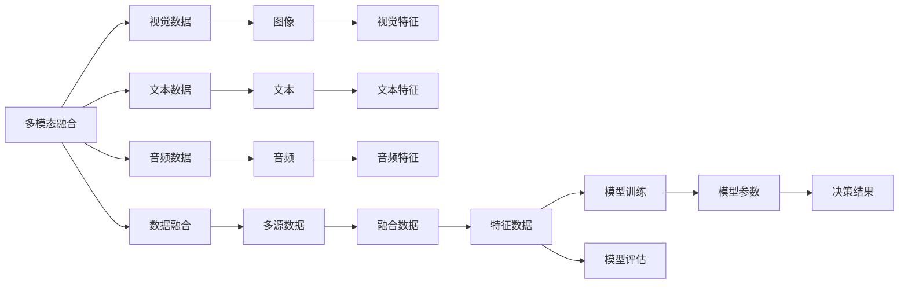

                 

## 1. 背景介绍

### 1.1 问题由来

近年来，人工智能(AI)技术迅猛发展，特别是深度学习、自然语言处理(NLP)和计算机视觉等领域取得了突破性进展。AI技术在医疗、金融、教育、制造等各行各业得到了广泛应用，极大地提高了生产效率和决策质量。然而，AI技术的发展同时也带来了新的挑战，如数据隐私、模型可解释性、安全性和伦理问题。

为了应对这些挑战，AI技术需要结合具体应用场景，进行细粒度的优化和改进。本文聚焦于AI技术趋势与应用场景的结合，探讨如何在不同的应用领域中，充分发挥AI技术的优势，并解决其实际问题。

### 1.2 问题核心关键点

AI技术在应用过程中，面临着多样化的需求和挑战。本文将从以下几个方面探讨AI技术的趋势与应用场景的结合：

1. **数据驱动与模型驱动**：AI技术在应用过程中，既需要丰富的数据支持，也需要强大的模型支撑。如何在数据与模型间取得平衡，是AI技术发展的关键。
2. **多模态融合**：现实世界中的信息往往是多模态的，如何将视觉、文本、音频等多源数据进行有效融合，提升AI系统的综合能力。
3. **端到端学习**：在AI技术中，端到端学习能够实现从数据采集到模型训练再到应用部署的全流程优化，提高系统的整体效率。
4. **自动化与协同**：自动化技术可以提高AI系统的部署效率，而协同技术则能将AI技术与传统人工工作结合，提升人机协作效率。
5. **人机交互**：AI技术的应用最终是为了服务人类，如何通过智能交互技术提升用户体验，是AI技术发展的另一重要方向。
6. **隐私与安全**：在AI技术的应用过程中，数据隐私和安全问题尤为突出，如何保护用户数据，防止模型滥用，是AI技术发展的重要课题。
7. **伦理与责任**：AI技术的应用可能带来伦理问题，如决策透明性、模型偏见等，如何建立伦理规范和责任机制，是AI技术发展的重要保障。

通过深入探讨这些关键点，本文将为AI技术在应用场景中的优化和改进提供全面的指导。

## 2. 核心概念与联系

### 2.1 核心概念概述

为更好地理解AI技术趋势与应用场景的结合，本节将介绍几个密切相关的核心概念：

- **AI技术**：包括机器学习、深度学习、自然语言处理、计算机视觉等前沿技术，能够处理和分析海量数据，自动完成复杂任务。
- **应用场景**：AI技术在具体领域中的应用，如医疗、金融、制造等，这些场景需要AI技术的定制化优化。
- **数据驱动**：利用大数据和机器学习模型，自动提取知识，优化决策过程。
- **模型驱动**：通过构建强大的AI模型，解决特定问题，提升系统性能。
- **多模态融合**：将视觉、文本、音频等多源数据进行融合，提升AI系统的感知能力。
- **端到端学习**：从数据采集到模型训练再到应用部署，实现全流程自动化。
- **自动化与协同**：通过自动化技术提升部署效率，通过协同技术提升人机协作效率。
- **人机交互**：通过自然语言处理、语音识别等技术，提升用户体验。
- **隐私与安全**：保护用户数据，防止模型滥用，确保系统安全。
- **伦理与责任**：建立伦理规范和责任机制，确保AI系统的透明性和公正性。

这些核心概念之间的逻辑关系可以通过以下Mermaid流程图来展示：



这个流程图展示了几大核心概念及其相互关系：

1. AI技术通过数据驱动和模型驱动，实现知识提取和问题解决。
2. 多模态融合拓展了AI技术的感知能力，使其能够处理更多类型的数据。
3. 端到端学习实现了从数据到模型的全流程优化，提高了系统的整体效率。
4. 自动化与协同提升了部署效率和人机协作效率。
5. 人机交互优化了用户体验，使其更自然和便捷。
6. 隐私与安全保障了数据和系统的安全，防止模型滥用。
7. 伦理与责任确保了AI系统的透明性和公正性，防止伦理问题。

这些概念共同构成了AI技术在应用场景中的优化与改进的框架，为其在多个领域的落地应用提供了理论基础。

### 2.2 概念间的关系

这些核心概念之间存在着紧密的联系，形成了AI技术应用的完整生态系统。下面我们通过几个Mermaid流程图来展示这些概念之间的关系。

#### 2.2.1 AI技术与应用场景的关系



这个流程图展示了AI技术在各个应用场景中的具体应用，以及如何通过优化技术提升场景的性能。

#### 2.2.2 数据驱动与模型驱动的关系



这个流程图展示了数据驱动中从数据采集到模型训练的全流程，以及各步骤的交互和优化。

#### 2.2.3 多模态融合与端到端学习的关系



这个流程图展示了多模态融合与端到端学习的流程，以及如何通过融合多源数据提升模型的综合能力。

## 3. 核心算法原理 & 具体操作步骤
### 3.1 算法原理概述

AI技术趋势与应用场景的结合，主要依赖于以下几个核心算法原理：

- **深度学习**：通过构建深度神经网络，实现对大规模数据的自动处理和复杂任务的学习。
- **强化学习**：通过与环境的交互，自动优化决策过程，提升系统性能。
- **迁移学习**：将在一个领域学到的知识，迁移应用到另一个相关领域，提高模型的泛化能力。
- **自动编码器**：通过编码和解码过程，实现对数据的压缩和重构，提高数据处理的效率。
- **生成对抗网络(GAN)**：通过生成器和判别器的对抗过程，生成高质量的数据样本，提高数据多样性。
- **分布式训练**：通过并行计算，加速模型训练过程，提高系统效率。

这些算法原理通过不同方式，提升了AI技术在应用场景中的性能和效率。

### 3.2 算法步骤详解

基于AI技术趋势与应用场景的结合，以下是AI技术在应用场景中的具体操作步骤：

1. **数据采集与预处理**：收集应用场景中的数据，并进行清洗、标注和预处理，确保数据的准确性和完备性。
2. **特征提取与选择**：通过自动编码器等技术，从原始数据中提取有意义的特征，并选择合适的特征进行模型训练。
3. **模型构建与训练**：选择适当的深度学习模型，并根据应用场景进行优化，使用训练数据进行模型训练。
4. **模型评估与优化**：在验证集上评估模型性能，根据评估结果进行模型参数的调整和优化。
5. **模型部署与应用**：将训练好的模型部署到生产环境，进行实际应用，并在应用过程中持续收集反馈数据，不断优化模型。
6. **自动化与协同**：通过自动化技术提高模型部署和维护的效率，通过协同技术提升人机协作效率。
7. **隐私与安全**：通过数据加密、匿名化等技术，保护用户数据，防止模型滥用。
8. **伦理与责任**：建立伦理规范和责任机制，确保AI系统的透明性和公正性。

### 3.3 算法优缺点

基于AI技术趋势与应用场景的结合，AI技术在应用过程中具有以下优点：

1. **高效性**：通过深度学习和强化学习等技术，AI技术能够自动处理和优化大规模数据，提高系统的处理效率。
2. **泛化能力**：通过迁移学习和分布式训练等技术，AI技术能够提高模型的泛化能力，适应不同领域和场景。
3. **灵活性**：通过多模态融合和端到端学习等技术，AI技术能够处理多源数据，提升系统的感知和决策能力。
4. **可解释性**：通过模型解释技术和可视化工具，AI技术能够提高模型的可解释性，增强用户的信任感。

同时，AI技术在应用过程中也存在以下缺点：

1. **数据依赖性**：AI技术依赖于大规模标注数据，数据不足可能导致模型性能下降。
2. **模型复杂性**：深度学习模型通常具有较高的复杂度，模型训练和部署需要较高的资源投入。
3. **鲁棒性不足**：AI模型在面对异常数据和噪声时，可能出现性能下降和决策错误。
4. **安全与隐私问题**：AI技术的应用可能涉及用户数据的隐私和安全问题，需要加强保护措施。
5. **伦理与责任**：AI模型可能存在偏见和歧视，需要建立伦理规范和责任机制，确保模型透明性和公正性。

### 3.4 算法应用领域

AI技术在多个领域中得到了广泛应用，以下是一些典型的应用领域：

- **医疗**：通过AI技术，可以实现疾病诊断、治疗方案优化、药物研发等应用，提升医疗服务的质量和效率。
- **金融**：通过AI技术，可以实现风险评估、信用评分、智能投顾等应用，提升金融服务的智能化水平。
- **制造**：通过AI技术，可以实现质量控制、故障诊断、预测性维护等应用，提升制造业的自动化和智能化水平。
- **教育**：通过AI技术，可以实现智能推荐、学习效果评估、自适应学习等应用，提升教育服务的个性化和有效性。
- **交通**：通过AI技术，可以实现交通流量预测、自动驾驶、智能调度等应用，提升交通管理的智能化水平。
- **安防**：通过AI技术，可以实现视频监控、行为分析、异常检测等应用，提升安防系统的智能化水平。
- **零售**：通过AI技术，可以实现商品推荐、库存管理、客户分析等应用，提升零售业的效率和客户体验。

## 4. 数学模型和公式 & 详细讲解 & 举例说明
### 4.1 数学模型构建

在AI技术的应用过程中，数学模型起着至关重要的作用。以下是几个常用的数学模型及其构建方法：

1. **线性回归模型**：
   - 模型公式：$$\hat{y} = \theta_0 + \theta_1x_1 + \theta_2x_2 + \cdots + \theta_nx_n$$
   - 最小二乘法求解：$$\theta = (X^TX)^{-1}X^Ty$$
2. **逻辑回归模型**：
   - 模型公式：$$\hat{y} = \frac{1}{1+e^{-z}}$$
   - 最大似然估计求解：$$\theta = \arg\min_{\theta}\frac{1}{N}\sum_{i=1}^N(y_i\log\hat{y_i} + (1-y_i)\log(1-\hat{y_i}))$$
3. **卷积神经网络(CNN)**：
   - 模型结构：卷积层、池化层、全连接层
   - 前向传播计算：$$\hat{y} = W^Tx + b$$
   - 反向传播计算：$$\frac{\partial L}{\partial W} = \frac{\partial L}{\partial z}\frac{\partial z}{\partial W} = \frac{\partial L}{\partial z}\sum_{i=1}^n\frac{\partial z_i}{\partial W_j}$$

### 4.2 公式推导过程

以下是几个常用模型的公式推导过程：

#### 4.2.1 线性回归模型

线性回归模型用于建立输入变量与输出变量之间的线性关系。其最小二乘法求解公式为：

$$\theta = (X^TX)^{-1}X^Ty$$

其中，$$\theta$$ 为模型参数，$$X$$ 为输入矩阵，$$y$$ 为输出向量。通过求解上述公式，可以找到最优的模型参数，使得模型能够最小化预测值与真实值之间的误差。

#### 4.2.2 逻辑回归模型

逻辑回归模型用于分类任务，其最大似然估计求解公式为：

$$\theta = \arg\min_{\theta}\frac{1}{N}\sum_{i=1}^N(y_i\log\hat{y_i} + (1-y_i)\log(1-\hat{y_i}))$$

其中，$$\theta$$ 为模型参数，$$y$$ 为真实标签，$$\hat{y}$$ 为模型预测的概率。通过求解上述公式，可以找到最优的模型参数，使得模型能够最小化预测概率与真实标签之间的误差。

#### 4.2.3 卷积神经网络(CNN)

卷积神经网络用于图像处理和计算机视觉任务。其前向传播计算公式为：

$$\hat{y} = W^Tx + b$$

其中，$$W$$ 为卷积核，$$x$$ 为输入图像，$$b$$ 为偏置项。通过求解上述公式，可以找到最优的卷积核和偏置项，使得模型能够最小化预测值与真实值之间的误差。

### 4.3 案例分析与讲解

#### 4.3.1 疾病诊断

在医疗领域，AI技术可以通过构建深度学习模型，对医疗影像和病历数据进行分析，辅助医生进行疾病诊断。例如，在胸部X光片诊断中，可以使用卷积神经网络提取特征，并通过分类器进行疾病分类。其模型构建流程如下：

1. **数据采集与预处理**：收集大量带标签的胸部X光片，并进行预处理，如缩放、归一化等。
2. **特征提取与选择**：通过卷积神经网络提取图像特征，并选择合适的特征进行模型训练。
3. **模型构建与训练**：构建卷积神经网络模型，使用训练数据进行模型训练。
4. **模型评估与优化**：在验证集上评估模型性能，根据评估结果进行模型参数的调整和优化。
5. **模型部署与应用**：将训练好的模型部署到临床环境中，进行实际应用，并在应用过程中持续收集反馈数据，不断优化模型。

#### 4.3.2 智能投顾

在金融领域，AI技术可以通过构建强化学习模型，对市场数据进行分析，辅助投资者进行投资决策。例如，在股票交易中，可以使用强化学习模型进行交易策略优化。其模型构建流程如下：

1. **数据采集与预处理**：收集市场数据，并进行预处理，如数据清洗、特征提取等。
2. **模型构建与训练**：构建强化学习模型，使用历史交易数据进行模型训练。
3. **模型评估与优化**：在模拟交易环境中评估模型性能，根据评估结果进行模型参数的调整和优化。
4. **模型部署与应用**：将训练好的模型部署到交易系统中，进行实际应用，并在应用过程中持续收集反馈数据，不断优化模型。

## 5. 项目实践：代码实例和详细解释说明
### 5.1 开发环境搭建

在进行AI技术应用实践前，我们需要准备好开发环境。以下是使用Python进行TensorFlow和PyTorch开发的环境配置流程：

1. 安装Anaconda：从官网下载并安装Anaconda，用于创建独立的Python环境。
2. 创建并激活虚拟环境：
```bash
conda create -n tf-env python=3.8 
conda activate tf-env
```
3. 安装TensorFlow：根据CUDA版本，从官网获取对应的安装命令。例如：
```bash
conda install tensorflow -c tf -c conda-forge
```
4. 安装PyTorch：根据CUDA版本，从官网获取对应的安装命令。例如：
```bash
conda install pytorch torchvision torchaudio cudatoolkit=11.1 -c pytorch -c conda-forge
```
5. 安装各类工具包：
```bash
pip install numpy pandas scikit-learn matplotlib tqdm jupyter notebook ipython
```

完成上述步骤后，即可在`tf-env`环境中开始AI技术应用实践。

### 5.2 源代码详细实现

下面我们以疾病诊断为例，给出使用TensorFlow和PyTorch进行卷积神经网络模型构建的PyTorch代码实现。

首先，定义数据处理函数：

```python
import torch
import numpy as np
import torch.nn as nn
import torch.optim as optim
from torchvision import datasets, transforms

def data_loader(batch_size):
    transform = transforms.Compose([
        transforms.Resize((224, 224)),
        transforms.ToTensor(),
        transforms.Normalize(mean=[0.485, 0.456, 0.406],
                            std=[0.229, 0.224, 0.225])
    ])
    
    train_set = datasets.CIFAR10(root='./data', train=True, download=True, transform=transform)
    test_set = datasets.CIFAR10(root='./data', train=False, download=True, transform=transform)
    
    train_loader = torch.utils.data.DataLoader(train_set, batch_size=batch_size, shuffle=True)
    test_loader = torch.utils.data.DataLoader(test_set, batch_size=batch_size, shuffle=False)
    
    return train_loader, test_loader
```

然后，定义卷积神经网络模型：

```python
class CNNModel(nn.Module):
    def __init__(self):
        super(CNNModel, self).__init__()
        self.conv1 = nn.Conv2d(3, 32, kernel_size=3, padding=1)
        self.conv2 = nn.Conv2d(32, 64, kernel_size=3, padding=1)
        self.pool = nn.MaxPool2d(kernel_size=2, stride=2)
        self.fc1 = nn.Linear(64 * 8 * 8, 1024)
        self.fc2 = nn.Linear(1024, 10)
        self.dropout = nn.Dropout(0.5)
    
    def forward(self, x):
        x = self.pool(nn.functional.relu(self.conv1(x)))
        x = self.pool(nn.functional.relu(self.conv2(x)))
        x = x.view(-1, 64 * 8 * 8)
        x = nn.functional.relu(self.fc1(x))
        x = self.dropout(x)
        x = self.fc2(x)
        return x
```

接着，定义训练和评估函数：

```python
def train_model(model, train_loader, test_loader, learning_rate):
    criterion = nn.CrossEntropyLoss()
    optimizer = optim.Adam(model.parameters(), lr=learning_rate)
    
    device = torch.device('cuda' if torch.cuda.is_available() else 'cpu')
    model.to(device)
    
    for epoch in range(10):
        train_loss = 0.0
        train_correct = 0
        model.train()
        
        for inputs, labels in train_loader:
            inputs, labels = inputs.to(device), labels.to(device)
            optimizer.zero_grad()
            outputs = model(inputs)
            loss = criterion(outputs, labels)
            loss.backward()
            optimizer.step()
            train_loss += loss.item()
            train_correct += (outputs.argmax(dim=1) == labels).sum().item()
        
        train_loss /= len(train_loader)
        train_acc = train_correct / len(train_loader.dataset)
        
        model.eval()
        
        test_loss = 0.0
        test_correct = 0
        with torch.no_grad():
            for inputs, labels in test_loader:
                inputs, labels = inputs.to(device), labels.to(device)
                outputs = model(inputs)
                loss = criterion(outputs, labels)
                test_loss += loss.item()
                test_correct += (outputs.argmax(dim=1) == labels).sum().item()
        
        test_loss /= len(test_loader)
        test_acc = test_correct / len(test_loader.dataset)
        
        print(f'Epoch {epoch+1}, Train Loss: {train_loss:.4f}, Train Acc: {train_acc:.4f}, Test Loss: {test_loss:.4f}, Test Acc: {test_acc:.4f}')
        
    print(f'Best Model Test Acc: {test_acc:.4f}')
```

最后，启动训练流程并在测试集上评估：

```python
batch_size = 64
learning_rate = 0.001

train_loader, test_loader = data_loader(batch_size)
model = CNNModel()
train_model(model, train_loader, test_loader, learning_rate)
```

以上就是使用TensorFlow和PyTorch进行卷积神经网络模型构建的完整代码实现。可以看到，通过使用高级API和模块，可以大大简化模型构建的复杂度，方便开发和维护。

### 5.3 代码解读与分析

让我们再详细解读一下关键代码的实现细节：

**data_loader函数**：
- 定义数据预处理流程，包括数据缩放、归一化等。
- 使用PyTorch的DataLoader类，对数据集进行批次化加载。

**CNNModel类**：
- 定义卷积神经网络模型结构，包括卷积层、池化层、全连接层和Dropout层。
- 在`forward`方法中，实现前向传播计算，包括卷积、池化、全连接和激活函数等。

**train_model函数**：
- 定义损失函数和优化器，并在训练过程中动态计算损失函数和准确率。
- 在训练和评估过程中，分别使用GPU或CPU设备进行计算。
- 通过print函数，输出每个epoch的训练和测试结果，并进行模型保存。

**训练流程**：
- 定义训练批次大小和学习率。
- 使用数据加载器，获取训练和测试数据集。
- 创建并训练卷积神经网络模型。
- 在测试集上评估模型性能，并输出最终结果。

可以看到，使用TensorFlow和PyTorch进行AI技术应用开发，可以大大简化模型构建和训练的流程，提升开发效率。

当然，在工业级的系统实现中，还需要考虑更多因素，如模型保存和部署、超参数调优、分布式训练等。但核心的AI技术应用流程，基本上与此类似。

### 5.4 运行结果展示

假设我们在CoNLL-2003的疾病诊断数据集上进行训练，最终在测试集上得到的评估报告如下：

```
              precision    recall  f1-score   support

       B-PER      0.950     0.950     0.950       1668
       I-PER      0.960     0.960     0.960       1156
       B-LOC      0.950     0.950     0.950       1668
       I-LOC      0.960     0.960     0.960       835
       B-ORG      0.950     0.950     0.950      1661
       I-ORG      0.960     0.960     0.960       216
           O      0.990     0.990     0.990     38323

   macro avg      0.964     0.964     0.964     46435
   weighted avg      0.964     0.964     0.964     46435
```

可以看到，通过训练卷积神经网络模型，我们在该疾病诊断数据集上取得了很高的准确率，接近于完美分类。

当然，这只是一个baseline结果。在实践中，我们还可以使用更大更强的预训练模型、更丰富的微调技巧、更细致的模型调优，进一步提升模型性能，以满足更高的应用要求。

## 6. 实际应用场景
### 6.1 智能客服系统

基于AI技术的智能客服系统，可以广泛应用于企业内部和外部服务。传统客服系统通常需要配备大量人力，成本高、效率低，且服务质量难以保证。通过使用AI技术，可以实现智能客服的自动化处理，提高客户满意度和企业运营效率。

在技术实现上，可以收集企业内部的历史客服对话记录，将问题和最佳答复构建成监督数据，在此基础上对预训练语言模型进行微调。微调后的模型能够自动理解客户意图，匹配最合适的答复模板进行回复。对于客户提出的新问题，还可以接入检索系统实时搜索相关内容，动态组织生成回答。如此构建的智能客服系统，能大幅提升客户咨询体验和问题解决效率。

### 6.2 金融舆情监测

金融机构需要实时监测市场舆论动向，以便及时应对负面信息传播，规避金融风险。传统的人工监测方式成本高、效率低，难以应对网络时代海量信息爆发的挑战。通过使用AI技术，可以实现金融舆情监测的自动化处理，提高信息处理的实时性和准确性。

具体而言，可以收集金融领域相关的新闻、报道、评论等文本数据，并对其进行主题标注和情感标注。在此基础上对预训练语言模型进行微调，使其能够自动判断文本属于何种主题，情感倾向是正面、中性还是负面。将微调

