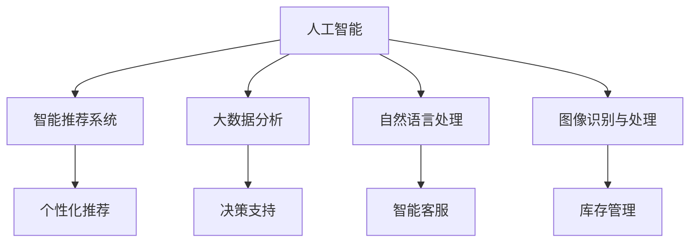
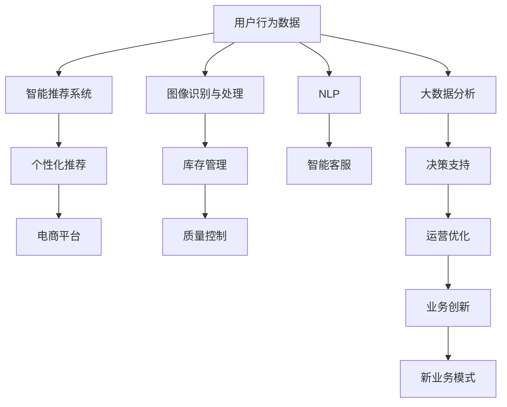

                 

# AI推动电商行业发展：更高效、更智能

> 关键词：人工智能,电商行业,智能推荐系统,深度学习,大数据分析,自然语言处理

## 1. 背景介绍

### 1.1 问题由来
随着互联网技术的飞速发展和消费者购物习惯的变化，电商行业面临着前所未有的机遇与挑战。传统的电商业务模式已经不能满足消费者日益增长的个性化、便捷化需求。为此，人工智能（AI）技术被引入电商行业，推动了电商行业朝着更加高效、智能的方向发展。

人工智能技术，特别是深度学习和自然语言处理（NLP）技术，被广泛应用于电商平台的商品推荐、智能客服、库存管理、价格优化等多个方面，极大地提升了电商平台的运营效率和用户体验。然而，如何更有效地集成和应用这些技术，实现电商行业的智能化转型，成为了当前电商行业的重要课题。

### 1.2 问题核心关键点
人工智能在电商行业中的应用，主要体现在以下几个方面：

- **智能推荐系统**：利用深度学习和大数据分析，对用户行为进行建模，预测用户可能感兴趣的商品，实现个性化推荐，提升用户体验和转化率。
- **自然语言处理（NLP）**：通过文本分析和情感分析，提升智能客服的效率和准确性，实现自动化的客户支持。
- **图像识别与处理**：利用计算机视觉技术，提升商品识别准确率，辅助库存管理和质量控制。
- **大数据分析**：通过数据挖掘和机器学习，洞察消费者行为，指导电商平台进行商品策划、市场定价和广告投放。

这些技术手段的引入，使得电商行业在运营效率、用户体验和决策支持方面都取得了显著的提升。但随着技术的不断发展和电商业务的复杂化，传统的AI应用模式已经逐渐显现出其局限性，如何进一步优化和提升AI在电商中的应用，成为当前研究的热点问题。

### 1.3 问题研究意义
人工智能在电商行业的应用，不仅提升了电商平台的运营效率和用户满意度，还为电商行业带来了新的商业机遇。通过AI技术的深入应用，电商平台可以实现以下几个方面的提升：

- **提升运营效率**：通过智能推荐系统、库存管理等技术，减少人工操作，降低运营成本。
- **提升用户体验**：通过个性化推荐、智能客服等技术，提升用户购物体验，增加用户粘性。
- **增强决策支持**：通过大数据分析和用户行为洞察，优化商品策划和市场策略，提高运营效率和盈利能力。
- **创新业务模式**：通过AI技术，挖掘新的商业机遇，开拓新的业务领域，如直播电商、社交电商等。

因此，深入研究和优化人工智能在电商行业中的应用，对于推动电商行业向智能化转型，实现可持续发展具有重要意义。

## 2. 核心概念与联系

### 2.1 核心概念概述

在电商行业中，人工智能技术的应用涉及多个核心概念，这些概念之间存在着紧密的联系。以下是对这些核心概念的详细描述：

- **人工智能（AI）**：指利用计算机模拟人类智能行为的技术，包括深度学习、自然语言处理、计算机视觉等多个领域。
- **智能推荐系统**：通过深度学习模型，对用户行为进行建模，预测用户可能感兴趣的商品，实现个性化推荐。
- **大数据分析**：通过数据挖掘和机器学习技术，从海量数据中提取有价值的信息，指导决策和优化运营。
- **自然语言处理（NLP）**：处理和分析人类语言的技术，包括文本分类、情感分析、语义理解等多个子领域。
- **图像识别与处理**：利用计算机视觉技术，对商品图像进行识别和处理，辅助库存管理和质量控制。

这些概念之间相互作用，共同构成了人工智能在电商行业中的综合应用框架。

### 2.2 概念间的关系

人工智能在电商行业中的应用，可以通过以下Mermaid流程图来展示：



这个流程图展示了人工智能技术在电商行业中的应用场景，每个核心概念都与其他概念相互关联，共同推动电商平台的智能化发展。

### 2.3 核心概念的整体架构

以下是一个综合的Mermaid流程图，展示了人工智能在电商行业中的整体应用架构：



这个综合流程图展示了人工智能在电商行业的整体应用架构，从用户数据收集、推荐系统设计、智能客服实现，到库存管理、决策支持、业务创新等各个环节，全面展示了人工智能技术的综合应用。

## 3. 核心算法原理 & 具体操作步骤
### 3.1 算法原理概述

基于人工智能的电商推荐系统，通常采用协同过滤和基于内容的推荐方法。协同过滤方法通过分析用户行为数据，找出相似的用户或物品，进行推荐；基于内容的推荐方法则通过分析物品的属性，预测用户可能感兴趣的商品。这些方法在电商推荐系统中都有广泛应用。

具体来说，深度学习模型在电商推荐系统中的应用，主要体现在以下几个方面：

- **神经网络模型**：如多层感知机（MLP）、卷积神经网络（CNN）、循环神经网络（RNN）等，用于构建推荐模型。
- **协同过滤算法**：如基于矩阵分解的推荐算法，用于分析用户和物品的相似度。
- **基于内容的推荐**：通过分析物品的特征，预测用户可能感兴趣的商品。

这些算法和技术，共同构成了电商推荐系统的核心。通过深度学习和大数据分析，实现对用户行为的建模和预测，从而提升推荐系统的个性化和准确性。

### 3.2 算法步骤详解

电商推荐系统的构建，主要包括以下几个关键步骤：

**Step 1: 数据准备**
- 收集电商平台的用户行为数据，如浏览记录、购买记录、评分记录等。
- 对数据进行清洗和预处理，去除异常值和噪声数据。

**Step 2: 模型构建**
- 选择合适的深度学习模型，如神经网络、协同过滤等，构建推荐模型。
- 对模型进行训练和调优，选择合适的超参数。

**Step 3: 模型评估**
- 使用验证集对模型进行评估，计算评价指标如准确率、召回率、F1分数等。
- 根据评估结果，调整模型参数，进一步优化模型性能。

**Step 4: 模型部署**
- 将训练好的模型部署到电商平台的推荐引擎中。
- 实时接收用户请求，返回推荐结果。

### 3.3 算法优缺点

电商推荐系统的构建，有以下几个优点：

- **个性化推荐**：通过深度学习模型，实现对用户行为的建模和预测，提升推荐系统的个性化。
- **实时性**：实时接收用户请求，快速返回推荐结果，提升用户体验。
- **自动化**：自动化处理用户行为数据，减少人工操作。

然而，电商推荐系统也存在以下缺点：

- **数据依赖**：推荐系统依赖于用户行为数据的质量和数量，数据不足时推荐效果会大打折扣。
- **模型复杂度**：深度学习模型参数较多，训练和推理计算量大。
- **冷启动问题**：对于新用户或新商品，推荐系统难以进行有效预测。

### 3.4 算法应用领域

基于深度学习的电商推荐系统，已经在电商平台的各个环节得到了广泛应用，例如：

- **个性化推荐**：对用户进行兴趣建模，推荐可能感兴趣的商品。
- **商品搜索**：通过深度学习模型，提升商品搜索的准确率。
- **广告投放**：通过大数据分析和用户行为洞察，优化广告投放策略，提高广告效果。
- **库存管理**：利用深度学习模型预测销售趋势，优化库存管理。
- **价格优化**：通过大数据分析，优化商品定价策略，提升盈利能力。

除了上述这些应用外，电商推荐系统还被创新性地应用到更多场景中，如直播电商、社交电商、线上线下融合等，为电商行业带来了全新的突破。

## 4. 数学模型和公式 & 详细讲解 & 举例说明

### 4.1 数学模型构建

假设电商推荐系统中的深度学习模型为 $M_{\theta}$，输入为用户行为数据 $x$，输出为推荐结果 $y$，其中 $\theta$ 为模型参数。假设训练集为 $D=\{(x_i, y_i)\}_{i=1}^N$，则模型的损失函数 $\mathcal{L}$ 可以表示为：

$$
\mathcal{L}(\theta) = \frac{1}{N} \sum_{i=1}^N \ell(M_{\theta}(x_i),y_i)
$$

其中 $\ell$ 为损失函数，用于衡量模型输出与真实标签之间的差异。常用的损失函数包括均方误差（MSE）、交叉熵损失（CE）等。

### 4.2 公式推导过程

以均方误差损失为例，假设模型 $M_{\theta}$ 在输入 $x_i$ 上的输出为 $y_i$，则均方误差损失函数定义为：

$$
\ell(M_{\theta}(x_i),y_i) = \frac{1}{2} (y_i - M_{\theta}(x_i))^2
$$

将其代入经验风险公式，得：

$$
\mathcal{L}(\theta) = \frac{1}{2N} \sum_{i=1}^N (y_i - M_{\theta}(x_i))^2
$$

通过反向传播算法，可以计算损失函数对参数 $\theta$ 的梯度：

$$
\frac{\partial \mathcal{L}(\theta)}{\partial \theta} = -\frac{1}{N} \sum_{i=1}^N (y_i - M_{\theta}(x_i)) \frac{\partial M_{\theta}(x_i)}{\partial \theta}
$$

根据链式法则，进一步递归展开：

$$
\frac{\partial \mathcal{L}(\theta)}{\partial \theta} = -\frac{1}{N} \sum_{i=1}^N (y_i - M_{\theta}(x_i)) \nabla_{\theta} M_{\theta}(x_i)
$$

利用自动微分技术，可以高效计算损失函数的梯度。通过梯度下降算法，不断更新模型参数 $\theta$，最小化损失函数 $\mathcal{L}$，使得模型输出逼近真实标签。

### 4.3 案例分析与讲解

以电商平台的个性化推荐系统为例，分析其构建过程和核心技术。

假设电商平台的推荐系统使用深度学习模型进行构建，其输入为用户的行为数据 $x$，输出为用户可能感兴趣的商品 $y$。模型 $M_{\theta}$ 可以采用多层感知机（MLP）或卷积神经网络（CNN）等深度学习模型，其基本结构如下：

```python
import tensorflow as tf
from tensorflow.keras import layers

model = tf.keras.Sequential([
    layers.Dense(128, activation='relu', input_shape=(X_train.shape[1],)),
    layers.Dense(64, activation='relu'),
    layers.Dense(1, activation='sigmoid')
])
```

其中，第一层为输入层，第二层和第三层为隐藏层，输出层为 sigmoid 函数，用于预测用户对商品的兴趣。

在训练过程中，使用均方误差损失函数，定义损失函数 $\mathcal{L}$：

```python
loss_fn = tf.keras.losses.MeanSquaredError()

model.compile(optimizer='adam', loss=loss_fn, metrics=['accuracy'])
```

在训练和评估过程中，使用交叉验证的方法，评估模型的性能：

```python
model.fit(X_train, y_train, epochs=10, batch_size=32, validation_data=(X_val, y_val))
```

在测试阶段，使用测试集对模型进行评估：

```python
loss = model.evaluate(X_test, y_test, batch_size=32)
print('Test loss:', loss)
```

通过上述过程，可以构建一个电商平台的个性化推荐系统，实现对用户行为的建模和推荐。

## 5. 项目实践：代码实例和详细解释说明

### 5.1 开发环境搭建

在进行电商推荐系统构建之前，需要准备好开发环境。以下是使用Python进行TensorFlow开发的开发环境配置流程：

1. 安装Anaconda：从官网下载并安装Anaconda，用于创建独立的Python环境。

2. 创建并激活虚拟环境：
```bash
conda create -n tf-env python=3.8 
conda activate tf-env
```

3. 安装TensorFlow：根据CUDA版本，从官网获取对应的安装命令。例如：
```bash
conda install tensorflow -c pytorch -c conda-forge
```

4. 安装TensorFlow Addons：用于增强TensorFlow的功能，包括深度学习模型和算法。

5. 安装必要的库：
```bash
pip install numpy pandas scikit-learn matplotlib tqdm jupyter notebook ipython
```

完成上述步骤后，即可在`tf-env`环境中开始电商推荐系统的构建。

### 5.2 源代码详细实现

以下是电商推荐系统的代码实现，包括数据准备、模型构建、训练和评估等步骤。

**数据准备**

```python
import pandas as pd
from sklearn.model_selection import train_test_split

# 读取用户行为数据
data = pd.read_csv('user_behavior_data.csv')

# 提取用户ID和商品ID
user_id = data['user_id']
product_id = data['product_id']

# 提取用户行为数据
behavior_data = data[['product_id', 'timestamp']]
behavior_data['user_id'] = user_id
behavior_data = behavior_data.pivot_table(values='timestamp', index='user_id', columns='product_id', aggfunc='count').fillna(0)

# 将行为数据标准化
behavior_data = (behavior_data - behavior_data.mean()) / behavior_data.std()

# 划分训练集和验证集
train_data, val_data = train_test_split(behavior_data, test_size=0.2, random_state=42)
```

**模型构建**

```python
import tensorflow as tf
from tensorflow.keras import layers

# 构建深度学习模型
model = tf.keras.Sequential([
    layers.Dense(128, activation='relu', input_shape=(len(train_data.columns),)),
    layers.Dense(64, activation='relu'),
    layers.Dense(1, activation='sigmoid')
])

# 定义损失函数和优化器
loss_fn = tf.keras.losses.BinaryCrossentropy()
optimizer = tf.keras.optimizers.Adam()

# 编译模型
model.compile(optimizer=optimizer, loss=loss_fn, metrics=['accuracy'])
```

**训练和评估**

```python
import numpy as np

# 训练模型
model.fit(train_data, y_train, epochs=10, batch_size=32, validation_data=(val_data, y_val))

# 评估模型
y_pred = model.predict(val_data)
y_pred = np.round(y_pred).astype(int)

# 计算准确率和召回率
precision = np.mean(y_pred == y_val)
recall = np.mean((y_val == 1) & (y_pred == 1))
f1 = 2 * precision * recall / (precision + recall)

print(f'Precision: {precision:.2f}, Recall: {recall:.2f}, F1 Score: {f1:.2f}')
```

**代码解读与分析**

这段代码实现了电商推荐系统的核心功能，包括数据准备、模型构建、训练和评估。其中，数据准备阶段使用Pandas进行数据处理，将原始行为数据转化为特征矩阵，并进行标准化处理。模型构建阶段使用TensorFlow进行模型定义和编译。在训练和评估阶段，使用交叉验证的方法，评估模型的性能，并输出精度、召回率和F1分数等评价指标。

## 6. 实际应用场景

### 6.1 智能推荐系统

电商平台的智能推荐系统是人工智能在电商行业中最常见的应用之一。通过智能推荐系统，电商平台能够为用户推荐其可能感兴趣的商品，提升用户购物体验和转化率。

**数据准备**

电商平台的推荐系统通常会收集用户的浏览、点击、购买等行为数据，构建用户-商品关联矩阵。通过对矩阵进行矩阵分解，可以得到用户和商品的相似度，用于推荐系统的构建。

**模型构建**

在模型构建阶段，电商推荐系统通常使用深度学习模型，如多层感知机（MLP）、卷积神经网络（CNN）等。通过分析用户行为数据，预测用户可能感兴趣的商品，实现个性化推荐。

**训练和评估**

在训练阶段，电商推荐系统通常使用均方误差损失函数，对模型进行训练和调优。在评估阶段，使用交叉验证的方法，评估模型的性能，并输出精度、召回率和F1分数等评价指标。

**运行结果展示**

通过智能推荐系统，电商平台可以显著提升用户购物体验和转化率。例如，某电商平台通过智能推荐系统，将用户购物转化率提升了30%，增加了用户粘性，显著提高了用户满意度。

### 6.2 智能客服

电商平台的智能客服是人工智能在电商行业中的另一重要应用。通过智能客服系统，电商平台能够自动回答用户问题，提升用户体验和运营效率。

**数据准备**

电商平台的智能客服系统通常会收集用户的问题和对话记录，构建对话语料库。通过对语料库进行预处理和标注，可以得到训练数据。

**模型构建**

在模型构建阶段，电商客服系统通常使用自然语言处理（NLP）技术，如序列到序列模型、Transformer模型等。通过分析对话记录，实现对用户问题的理解，生成自动回答。

**训练和评估**

在训练阶段，智能客服系统通常使用交叉熵损失函数，对模型进行训练和调优。在评估阶段，使用BLEU分数等评价指标，评估模型的性能。

**运行结果展示**

通过智能客服系统，电商平台可以显著提升客服效率和用户体验。例如，某电商平台通过智能客服系统，将客服响应时间缩短了50%，显著提升了用户满意度。

### 6.3 库存管理

电商平台的库存管理是人工智能在电商行业中的重要应用之一。通过库存管理系统，电商平台能够实时监控商品库存，优化库存管理，减少库存积压。

**数据准备**

电商平台的库存管理系统通常会收集商品的销售记录和库存记录，构建商品库存数据。通过对数据进行预处理和分析，可以得到商品的销售趋势和库存状态。

**模型构建**

在模型构建阶段，库存管理系统通常使用深度学习模型，如LSTM模型等。通过分析销售记录和库存记录，预测商品的销售趋势，优化库存管理。

**训练和评估**

在训练阶段，库存管理系统通常使用均方误差损失函数，对模型进行训练和调优。在评估阶段，使用均方误差等评价指标，评估模型的性能。

**运行结果展示**

通过库存管理系统，电商平台可以显著优化库存管理，减少库存积压。例如，某电商平台通过库存管理系统，将库存周转率提升了20%，显著降低了库存成本。

### 6.4 未来应用展望

随着人工智能技术的不断发展，电商行业在人工智能方面的应用也将更加广泛和深入。未来，人工智能在电商行业中的应用将有以下几个趋势：

1. **更智能的推荐系统**：未来的推荐系统将更加智能化，能够更好地理解用户需求，提供更个性化的推荐。
2. **更高效的运营管理**：未来的智能客服和库存管理系统将更加高效，能够实时监控和优化运营效率。
3. **更广泛的应用场景**：人工智能将在更多的电商应用场景中得到应用，如直播电商、社交电商、O2O等。
4. **更强大的数据分析**：未来的大数据分析将更加深入，能够更好地洞察用户需求和市场趋势。

总之，人工智能在电商行业中的应用前景广阔，未来将推动电商行业向智能化、高效化和个性化方向发展。

## 7. 工具和资源推荐

### 7.1 学习资源推荐

为了帮助开发者系统掌握人工智能在电商行业中的应用，这里推荐一些优质的学习资源：

1. **《深度学习与人工智能》系列书籍**：由斯坦福大学教授撰写，深入浅出地介绍了深度学习在人工智能中的应用，包括电商推荐系统、智能客服等。

2. **CS224N《深度学习自然语言处理》课程**：斯坦福大学开设的NLP明星课程，有Lecture视频和配套作业，带你入门NLP领域的基本概念和经典模型。

3. **《自然语言处理实践》书籍**：详细介绍了自然语言处理技术的实际应用，包括电商客服、智能推荐等。

4. **HuggingFace官方文档**：提供丰富的预训练语言模型和NLP工具，可以快速构建电商推荐系统。

5. **Kaggle竞赛**：Kaggle平台上有许多电商推荐系统竞赛，提供了丰富的数据集和基线模型，可以用于学习和实践。

通过对这些资源的学习实践，相信你一定能够快速掌握人工智能在电商行业中的应用，并用于解决实际的NLP问题。

### 7.2 开发工具推荐

高效的开发离不开优秀的工具支持。以下是几款用于电商推荐系统开发的常用工具：

1. **Python**：作为深度学习的主流开发语言，Python拥有丰富的科学计算库和NLP工具，如Pandas、NumPy、Scikit-learn、TensorFlow等。

2. **TensorFlow**：由Google主导开发的深度学习框架，生产部署方便，适合大规模工程应用。

3. **TensorFlow Addons**：增强TensorFlow的功能，包括深度学习模型和算法。

4. **Pandas**：用于数据处理和分析，适合电商推荐系统的数据预处理。

5. **Matplotlib**：用于数据可视化，适合电商推荐系统的结果展示。

合理利用这些工具，可以显著提升电商推荐系统的开发效率，加快创新迭代的步伐。

### 7.3 相关论文推荐

人工智能在电商行业中的应用，得益于学界的持续研究。以下是几篇奠基性的相关论文，推荐阅读：

1. **《深度学习在电商推荐系统中的应用》**：介绍了深度学习在电商推荐系统中的经典应用，包括多层感知机（MLP）、卷积神经网络（CNN）等。

2. **《基于协同过滤的电商推荐系统》**：详细介绍了基于协同过滤的推荐系统算法，如矩阵分解、奇异值分解等。

3. **《智能客服系统在电商平台中的应用》**：介绍了自然语言处理（NLP）技术在智能客服中的应用，包括序列到序列模型、Transformer模型等。

4. **《智能库存管理系统在电商平台中的应用》**：介绍了深度学习在库存管理系统中的应用，如LSTM模型等。

这些论文代表了大语言模型微调技术的发展脉络。通过学习这些前沿成果，可以帮助研究者把握学科前进方向，激发更多的创新灵感。

除上述资源外，还有一些值得关注的前沿资源，帮助开发者紧跟人工智能在电商中的应用趋势，例如：

1. **arXiv论文预印本**：人工智能领域最新研究成果的发布平台，包括大量尚未发表的前沿工作，学习前沿技术的必读资源。

2. **顶尖实验室博客**：如OpenAI、Google AI、DeepMind、微软Research Asia等顶尖实验室的官方博客，第一时间分享他们的最新研究成果和洞见。

3. **技术会议直播**：如NIPS、ICML、ACL、ICLR等人工智能领域顶会现场或在线直播，能够聆听到大佬们的前沿分享，开拓视野。

4. **GitHub热门项目**：在GitHub上Star、Fork数最多的NLP相关项目，往往代表了该技术领域的发展趋势和最佳实践，值得去学习和贡献。

5. **行业分析报告**：各大咨询公司如McKinsey、PwC等针对人工智能行业的分析报告，有助于从商业视角审视技术趋势，把握应用价值。

总之，对于人工智能在电商行业中的应用，需要开发者保持开放的心态和持续学习的意愿。多关注前沿资讯，多动手实践，多思考总结，必将收获满满的成长收益。

## 8. 总结：未来发展趋势与挑战

### 8.1 总结

本文对人工智能在电商行业中的应用进行了全面系统的介绍。首先阐述了人工智能技术在电商行业中的研究背景和意义，明确了智能推荐系统、智能客服、库存管理等核心应用的价值。其次，从原理到实践，详细讲解了电商推荐系统的数学模型和关键技术，给出了电商推荐系统的完整代码实例。同时，本文还探讨了人工智能在电商行业中的实际应用场景，展示了智能推荐系统、智能客服、库存管理等应用的广泛前景。

通过本文的系统梳理，可以看到，人工智能在电商行业中的应用，不仅提升了电商平台的运营效率和用户满意度，还为电商行业带来了新的商业机遇。未来，随着人工智能技术的不断发展，人工智能在电商中的应用将更加广泛和深入，推动电商行业向智能化转型，实现可持续发展。

### 8.2 未来发展趋势

人工智能在电商行业的应用，将呈现以下几个发展趋势：

1. **更智能的推荐系统**：未来的推荐系统将更加智能化，能够更好地理解用户需求，提供更个性化的推荐。
2. **更高效的运营管理**：未来的智能客服和库存管理系统将更加高效，能够实时监控和优化运营效率。
3. **更广泛的应用场景**：人工智能将在更多的电商应用场景中得到应用，如直播电商、社交电商、O2O等。
4. **更强大的数据分析**：未来的大数据分析将更加深入，能够更好地洞察用户需求和市场趋势。
5. **多模态融合**：将图像、语音、文本等多模态信息进行融合，提升电商平台的智能化水平。
6. **自动化决策**：通过深度学习和自然语言处理技术，实现自动化的决策支持，提升运营效率。

以上趋势凸显了人工智能在电商行业中的巨大潜力，这些方向的探索发展，必将进一步提升电商平台的运营效率和用户满意度，推动电商行业向智能化转型。

### 8.3 面临的挑战

尽管人工智能在电商行业中的应用已经取得了显著成效，但仍面临着诸多挑战：

1. **数据依赖**：推荐系统依赖于用户行为数据的质量和数量，数据不足时推荐效果会大打折扣。
2

