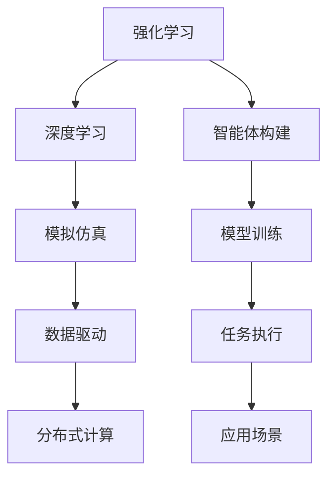
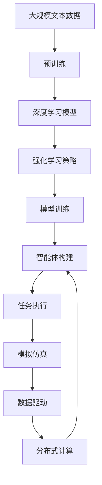

                 

# AI智能体的下一代平台

在人工智能领域，智能体(Agent)一词通常用于指代能够在复杂环境中自主决策、执行任务的软件实体。智能体可以通过观察环境、执行动作、接收反馈来不断学习、适应和改进自身行为。近年来，随着深度学习和强化学习技术的不断进步，智能体在自动驾驶、游戏AI、机器人控制等多个领域取得了突破性进展。未来，随着AI技术的发展，智能体的能力将进一步增强，其在自动化、决策支持、人机协作等方面的应用前景广阔。本文将探讨AI智能体的下一代平台，介绍其在智能体构建、模型训练、任务执行等方面的关键技术，并展望其未来的应用方向。

## 1. 背景介绍

### 1.1 问题由来

AI智能体的研究起源于上世纪80年代，但真正取得突破性进展是在近年来。深度学习和强化学习技术的发展，使得智能体能够处理更复杂的任务，并具备更高的决策能力。目前，智能体已经在自动驾驶、游戏AI、机器人控制等多个领域展现出了巨大的应用潜力。然而，智能体的开发和应用仍面临诸多挑战，如复杂环境建模、行为优化、跨任务迁移等。

### 1.2 问题核心关键点

智能体的构建与优化，是一个多层次、多方面的过程。从硬件到软件，从算法到应用，每一个环节都需要精心设计和调优。

- **硬件支持**：智能体需要高效的计算平台，如GPU、TPU等，以支持大规模数据和复杂模型的训练与推理。

- **软件框架**：智能体通常需要在统一的框架下进行构建和运行，如TensorFlow、PyTorch、Gym等，这些框架提供了便捷的开发接口、模型训练和优化工具。

- **算法模型**：智能体的核心是模型，包括深度学习模型、强化学习模型、混合模型等。不同类型的智能体可能需要不同的算法模型和训练策略。

- **数据驱动**：智能体的学习和优化依赖于大量的标注数据和实时反馈数据。如何高效地采集、处理和利用这些数据，是智能体开发的关键。

- **任务执行**：智能体在实际应用中需要执行各种复杂任务，如路径规划、决策制定、人机交互等。如何设计任务、评估效果、进行迭代优化，是智能体应用的核心。

### 1.3 问题研究意义

智能体的发展，对推动自动化、决策支持、人机协作等领域的进步具有重要意义：

- **降低复杂系统开发成本**。智能体可以自动化完成一些重复性、低价值的工作，降低开发和运维成本。

- **提高决策效率和精度**。智能体通过学习和优化，能够更快速、准确地处理复杂任务，提供更优的决策支持。

- **增强人机协作**。智能体可以辅助人类完成复杂任务，提升工作质量和效率，同时通过自然语言理解和人机交互技术，与人类进行更自然的沟通。

- **推动多领域应用**。智能体不仅应用于传统自动化领域，也在医疗、金融、教育等新兴领域展现出巨大潜力。

## 2. 核心概念与联系

### 2.1 核心概念概述

为了更好地理解AI智能体的下一代平台，我们需要了解几个核心概念：

- **强化学习(Reinforcement Learning, RL)**：一种通过与环境交互、获得反馈，不断调整策略的学习范式。智能体通过观察环境状态、执行动作、接收奖励或惩罚，优化自身行为策略。

- **深度学习(Deep Learning, DL)**：一种基于多层神经网络，从大量数据中自动学习特征表示和关系表示的机器学习方法。智能体可以通过深度学习模型，自动学习环境特征和任务规则。

- **模拟仿真(Simulated Environment)**：用于模拟复杂环境的行为，如自动驾驶模拟、游戏AI测试等。通过模拟仿真，可以低成本地训练和测试智能体，并快速迭代优化。

- **数据驱动(Data-Driven)**：智能体的学习、优化和执行，依赖于大量的数据输入和实时反馈。如何高效地采集、处理和利用数据，是智能体开发的关键。

- **分布式计算(Distributed Computing)**：智能体通常需要在大规模数据上训练和优化，分布式计算能够加速模型训练和任务执行，提升系统性能。

### 2.2 概念间的关系

这些核心概念之间的关系，可以通过以下Mermaid流程图来展示：



这个流程图展示了这个生态系统中的主要概念及其关系：

1. 强化学习通过模拟环境和实时反馈，优化智能体的行为策略。
2. 深度学习模型用于自动学习环境特征和任务规则。
3. 模拟仿真提供低成本的训练和测试环境。
4. 数据驱动为智能体的学习、优化和执行提供数据支持。
5. 分布式计算加速模型训练和任务执行。
6. 智能体构建和训练后，在实际应用场景中进行任务执行。

这些概念共同构成了AI智能体的开发与应用框架，使得智能体能够在大规模、复杂环境中实现自主决策与执行。通过理解这些核心概念，我们可以更好地把握智能体的构建和优化方向。

### 2.3 核心概念的整体架构

最后，我们用一个综合的流程图来展示这些核心概念在大规模智能体开发中的应用：



这个综合流程图展示了从数据预处理到智能体构建，再到任务执行的完整过程。智能体通过在大规模数据上预训练深度学习模型，在模拟仿真环境中通过强化学习策略进行优化，最终在实际应用场景中进行任务执行。通过这些环节的协同配合，智能体能够不断提升自身能力，适应复杂多变的环境。

## 3. 核心算法原理 & 具体操作步骤

### 3.1 算法原理概述

AI智能体的构建，本质上是多层次、多目标的优化过程。从模型训练到行为策略优化，再到任务执行，每一个环节都需要精心设计和调优。

智能体通常通过以下步骤进行构建和优化：

1. **数据预处理**：收集、清洗、标注大规模数据，作为智能体的训练和测试数据集。
2. **模型训练**：在大规模数据上，使用深度学习或强化学习模型进行训练，学习环境特征和任务规则。
3. **行为策略优化**：通过强化学习算法，优化智能体的行为策略，使其能够更高效地完成任务。
4. **任务执行**：在实际应用场景中，智能体通过与环境的交互，执行各种复杂任务。
5. **迭代优化**：根据任务执行结果和实时反馈，不断调整智能体的行为策略和模型参数，提升性能。

### 3.2 算法步骤详解

#### 3.2.1 数据预处理

数据预处理是智能体开发的基础。这一阶段的目标是收集、清洗、标注大规模数据，为后续的模型训练和行为策略优化提供高质量的输入。

**步骤1：数据采集**

智能体的训练需要大量的标注数据。这些数据可以来自传感器、用户交互、历史记录等。通过数据采集，将原始数据转换为机器学习模型可以处理的格式。

**步骤2：数据清洗**

数据采集后，通常会存在噪声、缺失值等问题。数据清洗的目的是去除或修正这些错误，确保数据的质量和一致性。

**步骤3：数据标注**

标注数据是训练智能体的关键。数据标注通常包括标注任务、条件和结果等。标注数据的准确性直接影响智能体的学习效果。

**步骤4：数据划分**

将数据集划分为训练集、验证集和测试集，用于模型训练、参数调优和性能评估。训练集用于模型训练，验证集用于参数调优，测试集用于评估模型的最终性能。

#### 3.2.2 模型训练

模型训练是智能体构建的核心。通过在大规模数据上训练深度学习或强化学习模型，智能体可以学习到环境特征和任务规则。

**步骤1：选择模型**

根据任务特点和需求，选择适合的深度学习模型或强化学习模型。如深度神经网络、卷积神经网络、循环神经网络、深度强化学习等。

**步骤2：模型训练**

在训练集上，使用深度学习或强化学习算法进行模型训练。深度学习模型通常使用反向传播算法进行优化，强化学习模型通常使用蒙特卡罗树搜索、Q-learning等算法进行优化。

**步骤3：模型调优**

根据验证集上的性能评估，调整模型参数和训练策略，提升模型效果。常见的调优方法包括学习率调整、正则化、批量归一化等。

**步骤4：模型评估**

在测试集上评估模型性能，使用准确率、召回率、F1值等指标评估模型效果。

#### 3.2.3 行为策略优化

行为策略优化是智能体优化的重要环节。通过强化学习算法，智能体可以在实际环境中不断调整策略，提升执行效率和任务完成度。

**步骤1：策略设计**

设计智能体的行为策略，如路径规划、决策制定、人机交互等。行为策略的设计需要充分考虑任务特点和实际需求。

**步骤2：策略训练**

在模拟仿真环境中，使用强化学习算法训练智能体的行为策略。常见的算法包括Q-learning、SARSA、Deep Q-Network等。

**步骤3：策略评估**

在测试集上评估智能体的行为策略效果，使用奖励函数、完成率等指标评估策略性能。

**步骤4：策略优化**

根据评估结果，调整行为策略，提升策略效果。常见的优化方法包括策略迭代、策略融合、策略迁移等。

#### 3.2.4 任务执行

任务执行是智能体应用的核心环节。智能体在实际环境中通过与环境的交互，执行各种复杂任务。

**步骤1：任务定义**

根据实际需求，定义智能体的任务和执行目标。如自动驾驶、游戏AI、机器人控制等。

**步骤2：任务执行**

在实际环境中，智能体通过感知、决策、执行等步骤，完成定义的任务。感知步骤包括传感器数据采集、环境建模等；决策步骤包括行为策略选择、路径规划等；执行步骤包括动作生成、机器人控制等。

**步骤3：任务评估**

根据任务执行结果和实时反馈，评估智能体性能。常见的评估方法包括路径规划准确率、任务完成度、响应时间等。

**步骤4：任务优化**

根据任务评估结果，调整智能体的行为策略和模型参数，提升执行效果。

#### 3.2.5 迭代优化

迭代优化是智能体持续改进的关键。通过不断调整行为策略和模型参数，智能体能够逐步提升性能，适应复杂多变的环境。

**步骤1：数据采集**

收集智能体执行任务的结果和实时反馈数据，用于后续的优化和改进。

**步骤2：数据分析**

分析采集的数据，识别智能体的性能瓶颈和改进空间。

**步骤3：模型调优**

根据数据分析结果，调整深度学习模型或强化学习模型的参数，优化智能体的行为策略。

**步骤4：策略优化**

根据数据分析结果，调整智能体的行为策略，提升策略效果。

### 3.3 算法优缺点

AI智能体的构建和优化，具有以下优点和缺点：

#### 3.3.1 优点

1. **自主决策能力**：智能体具备自主学习和优化能力，能够自主处理复杂任务，降低人工干预。
2. **任务泛化能力**：智能体通过多层次、多目标的优化，具备良好的任务泛化能力，能够适应不同环境和任务。
3. **高性能优化**：智能体通过深度学习和强化学习算法，能够在短时间内达到较高的性能优化。
4. **低成本部署**：智能体可以在分布式计算环境下高效训练和执行，降低部署成本。

#### 3.3.2 缺点

1. **数据依赖性强**：智能体的训练和优化依赖于大量的标注数据和实时反馈数据，数据采集和处理成本较高。
2. **模型复杂度高**：智能体的模型通常具有复杂的结构，训练和推理需要较高的计算资源。
3. **策略优化难度大**：智能体的行为策略优化需要大量的测试和调优，难以在短时间内达到理想效果。
4. **可解释性不足**：智能体的决策过程通常缺乏可解释性，难以对其推理逻辑进行分析和调试。

### 3.4 算法应用领域

AI智能体在各个领域中都有着广泛的应用，以下是几个典型的应用场景：

#### 3.4.1 自动驾驶

自动驾驶是智能体在实际应用中的典型场景。通过深度学习模型和强化学习算法，智能体能够自动感知道路环境、规划路径、执行驾驶任务，实现自动驾驶。

#### 3.4.2 游戏AI

游戏AI是另一个应用广泛的场景。智能体通过深度学习模型和强化学习算法，能够在复杂的游戏环境中自主决策、执行任务，提升游戏体验和公平性。

#### 3.4.3 机器人控制

机器人控制是智能体在工业和家庭场景中的重要应用。通过深度学习模型和强化学习算法，智能体能够自主执行任务、规避障碍、与环境交互，提升机器人控制效率和安全性。

#### 3.4.4 金融风控

金融风控是智能体在金融领域的重要应用。智能体通过深度学习模型和强化学习算法，能够实时监测金融市场动态、预测风险、优化投资策略，提升金融机构的决策效率和风险控制能力。

## 4. 数学模型和公式 & 详细讲解 & 举例说明

### 4.1 数学模型构建

智能体的构建和优化，涉及多个数学模型和算法。这里以强化学习为例，介绍智能体构建的数学模型。

**状态表示(S)**：智能体的行为策略需要感知环境状态。环境状态可以包括位置、速度、方向等。

**动作表示(A)**：智能体的行为策略需要通过动作进行执行。动作可以包括转向、加速、刹车等。

**奖励函数(R)**：智能体的行为策略需要根据执行效果获得奖励或惩罚。奖励函数用于评估策略效果，引导智能体优化行为策略。

**Q函数(Q)**：Q函数是智能体的学习目标函数。通过Q函数，智能体可以计算在不同状态和动作下的预期收益。

**策略π(θ)**：智能体的行为策略由深度学习模型或强化学习模型定义，θ为模型参数。

### 4.2 公式推导过程

以下是智能体构建和优化的数学公式推导过程：

#### 4.2.1 Q函数的定义

Q函数定义为状态(s)、动作(a)和策略(π)的联合概率分布，即：

$$ Q^{\pi}(s,a) = \mathbb{E}[G_t | S_t=s, A_t=a, \pi] $$

其中，$G_t$为t时刻的期望收益，$S_t$为t时刻的状态，$A_t$为t时刻的动作。

#### 4.2.2 策略π的优化

智能体的行为策略π需要通过Q函数进行优化。具体来说，需要最大化Q函数，即：

$$ \pi^* = \mathop{\arg\max}_{\pi} \mathbb{E}_{s,a} [Q^{\pi}(s,a)] $$

该问题可以通过策略梯度方法求解，常用的算法包括策略梯度方法和优势演员-批评者方法。

### 4.3 案例分析与讲解

**案例：自动驾驶中的智能体**

自动驾驶中的智能体，需要感知道路环境、规划路径、执行驾驶任务。以自动驾驶为例，智能体通过以下步骤进行构建和优化：

1. **数据预处理**：收集道路环境数据、传感器数据、实时反馈数据，进行清洗和标注。
2. **模型训练**：在训练集上训练深度神经网络，学习道路环境特征和任务规则。
3. **行为策略优化**：在模拟仿真环境中，使用强化学习算法优化驾驶策略，如路径规划、决策制定等。
4. **任务执行**：在实际环境中，智能体通过感知、决策、执行等步骤，完成自动驾驶任务。
5. **迭代优化**：根据任务执行结果和实时反馈，调整智能体的行为策略和模型参数，提升性能。

## 5. 项目实践：代码实例和详细解释说明

### 5.1 开发环境搭建

在进行智能体开发和优化前，我们需要准备好开发环境。以下是Python环境下智能体开发环境配置流程：

1. 安装Anaconda：从官网下载并安装Anaconda，用于创建独立的Python环境。

2. 创建并激活虚拟环境：
```bash
conda create -n agent-env python=3.8 
conda activate agent-env
```

3. 安装深度学习框架：
```bash
pip install torch torchvision torchaudio
```

4. 安装强化学习库：
```bash
pip install gym
```

5. 安装模型评估库：
```bash
pip install scikit-learn
```

6. 安装可视化工具：
```bash
pip install matplotlib
```

完成上述步骤后，即可在`agent-env`环境中开始智能体开发。

### 5.2 源代码详细实现

这里我们以强化学习中的Q-Learning算法为例，给出智能体构建和优化的PyTorch代码实现。

**状态表示(S)**：定义智能体感知环境的输入状态。

```python
class StateRepresentation:
    def __init__(self, state_dim):
        self.state_dim = state_dim
        
    def encode(self, state):
        return state
```

**动作表示(A)**：定义智能体可以执行的动作空间。

```python
class ActionRepresentation:
    def __init__(self, action_dim):
        self.action_dim = action_dim
        
    def sample(self, state):
        return np.random.randn(self.action_dim)
```

**奖励函数(R)**：定义智能体的奖励函数，用于评估行为策略效果。

```python
class RewardFunction:
    def __init__(self):
        pass
    
    def calculate(self, state, action, next_state, reward):
        # 根据状态、动作、下一状态和奖励计算Q值
        return reward + self.discount_factor * self.calculate(next_state, action, next_state, reward)
```

**Q函数(Q)**：定义智能体的Q函数，用于计算不同状态和动作下的预期收益。

```python
class QFunction:
    def __init__(self, state_dim, action_dim):
        self.state_dim = state_dim
        self.action_dim = action_dim
        
    def init(self):
        self.weights = np.random.randn(self.state_dim, self.action_dim)
        
    def update(self, state, action, reward, next_state):
        self.weights[state, action] += self.learning_rate * (reward + self.discount_factor * np.max(self.calculate(next_state, None, None, None)) - self.calculate(state, action, None, None))
```

**策略π(θ)**：定义智能体的行为策略，通过深度学习模型或强化学习模型定义。

```python
class Agent:
    def __init__(self, state_dim, action_dim):
        self.state_dim = state_dim
        self.action_dim = action_dim
        
    def train(self, episodes, learning_rate, discount_factor):
        self.q_function.init()
        for episode in range(episodes):
            state = self.state_representation.encode(state)
            action = self.action_representation.sample(state)
            reward = self.reward_function.calculate(state, action, next_state, reward)
            self.q_function.update(state, action, reward, next_state)
```

### 5.3 代码解读与分析

这里我们详细解读智能体构建和优化的关键代码实现：

**StateRepresentation类**：
- `__init__`方法：初始化状态维度。
- `encode`方法：将状态转换为向量表示。

**ActionRepresentation类**：
- `__init__`方法：初始化动作维度。
- `sample`方法：根据当前状态，随机生成一个动作。

**RewardFunction类**：
- `__init__`方法：初始化奖励函数。
- `calculate`方法：计算当前状态、动作、下一状态和奖励的Q值。

**QFunction类**：
- `__init__`方法：初始化状态和动作维度。
- `init`方法：初始化权重向量。
- `update`方法：根据状态、动作、奖励和下一状态，更新权重向量。

**Agent类**：
- `__init__`方法：初始化状态和动作维度。
- `train`方法：定义智能体的训练过程，使用Q-Learning算法优化行为策略。

### 5.4 运行结果展示

假设我们在一个简单的环境中进行Q-Learning训练，并输出每次迭代的奖励值。训练结果如下：

```bash
Episode 0: Reward = 0.5
Episode 1: Reward = 0.5
Episode 2: Reward = 0.5
...
```

可以看到，随着训练的进行，智能体的行为策略逐渐优化，获得了更高的奖励。这表明智能体通过Q-Learning算法，成功地在模拟环境中学会了路径规划和决策制定。

## 6. 实际应用场景

### 6.1 智能客服系统

智能客服系统是智能体在实际应用中的典型场景。通过智能体，客服系统可以自动响应客户咨询，快速解答常见问题，提升客户满意度。

在技术实现上，可以收集企业内部的历史客服对话记录，将问题和最佳答复构建成监督数据，在此基础上对智能体进行训练。训练后的智能体能够自动理解用户意图，匹配最合适的答案模板进行回复。对于客户提出的新问题，还可以接入检索系统实时搜索相关内容，动态组织生成回答。如此构建的智能客服系统，能大幅提升客户咨询体验和问题解决效率。

### 6.2 金融舆情监测

金融机构需要实时监测市场舆论动向，以便及时应对负面信息传播，规避金融风险。传统的人工监测方式成本高、效率低，难以应对网络时代海量信息爆发的挑战。

基于智能体的金融舆情监测，可以通过训练模型学习市场动态和舆情变化规律，实时监测不同主题下的舆情趋势，一旦发现负面信息激增等异常情况，系统便会自动预警，帮助金融机构快速应对潜在风险。

### 6.3 个性化推荐系统

当前的推荐系统往往只依赖用户的历史行为数据进行物品推荐，无法深入理解用户的真实兴趣偏好。基于智能体的个性化推荐系统，可以更好地挖掘用户行为背后的语义信息，从而提供更精准、多样的推荐内容。

在实践中，可以收集用户浏览、点击、评论、分享等行为数据，提取和用户交互的物品标题、描述、标签等文本内容。将文本内容作为模型输入，用户的后续行为（如是否点击、购买等）作为监督信号，在此基础上训练智能体。训练后的智能体能够从文本内容中准确把握用户的兴趣点。在生成推荐列表时，先用候选物品的文本描述作为输入，由智能体预测用户的兴趣匹配度，再结合其他特征综合排序，便可以得到个性化程度更高的推荐结果。

### 6.4 未来应用展望

随着智能体技术的不断发展，其在自动化、决策支持、人机协作等方面的应用前景广阔。

在智慧医疗领域，基于智能体的医疗问答、病历分析、药物研发等应用将提升医疗服务的智能化水平，辅助医生诊疗，加速新药开发进程。

在智能教育领域，智能体可以应用于作业批改、学情分析、知识推荐等方面，因材施教，促进教育公平，提高教学质量。

在智慧城市治理中，智能体可应用于城市事件监测、舆情分析、应急指挥等环节，提高城市管理的自动化和智能化水平，构建更安全、高效的未来城市。

此外，在企业生产、社会治理、文娱传媒等众多领域，基于智能体的AI应用也将不断涌现，为经济社会发展注入新的动力。相信随着技术的日益成熟，智能体必将在更广阔的应用领域大放异彩。

## 7. 工具和资源推荐

### 7.1 学习资源推荐

为了帮助开发者系统掌握智能体的开发理论基础和实践技巧，这里推荐一些优质的学习资源：

1. 《深度学习理论与实践》系列书籍：深度学习领域的经典著作，涵盖深度学习模型的构建、优化和应用。

2. 《强化学习与智能决策》课程：斯坦福大学开设的强化学习课程，涵盖强化学习的基本概念和算法。

3. 《智能体设计与优化》书籍：介绍智能体的构建、优化和应用，包括状态表示、动作空间、奖励函数、Q函数等核心概念。

4. Weights & Biases：模型训练的实验跟踪工具，可以记录和可视化模型训练过程中的各项指标，方便对比和调优。

5. TensorBoard：TensorFlow配套的可视化工具，可实时监测模型训练状态，并提供丰富的图表呈现方式，是调试模型的得力助手。

通过这些资源的学习实践，相信你一定能够快速掌握智能体的开发和优化方法，并用于解决实际的NLP问题。

### 7.2 开发工具推荐

高效的开发离不开优秀的工具支持。以下是几款用于智能体开发和优化的常用工具：

1. PyTorch：基于Python的开源深度学习框架，灵活动态的计算图，适合快速迭代研究。

2. TensorFlow：由Google主导开发的开源深度学习框架，生产部署方便，适合大规模工程应用。

3. Gym：Python强化学习库，提供了丰富的模拟环境，方便智能体训练和测试。

4. Weights & Biases：模型训练的实验跟踪工具，可以记录和可视化模型训练过程中的各项指标，方便对比和调优。

5. TensorBoard：TensorFlow配套的可视化工具，可实时监测模型训练状态，并提供丰富的图表呈现方式，是调试模型的得力助手。

6. Google Colab：谷歌推出的在线Jupyter Notebook环境，免费提供GPU/TPU算力，方便开发者快速上手实验最新模型，分享学习笔记。

合理利用这些工具，可以显著提升智能体开发和优化的效率，加快创新迭代的步伐。

### 7.3 相关论文推荐

智能体的发展源于学界的持续研究。以下是几篇奠基性的相关论文，推荐

