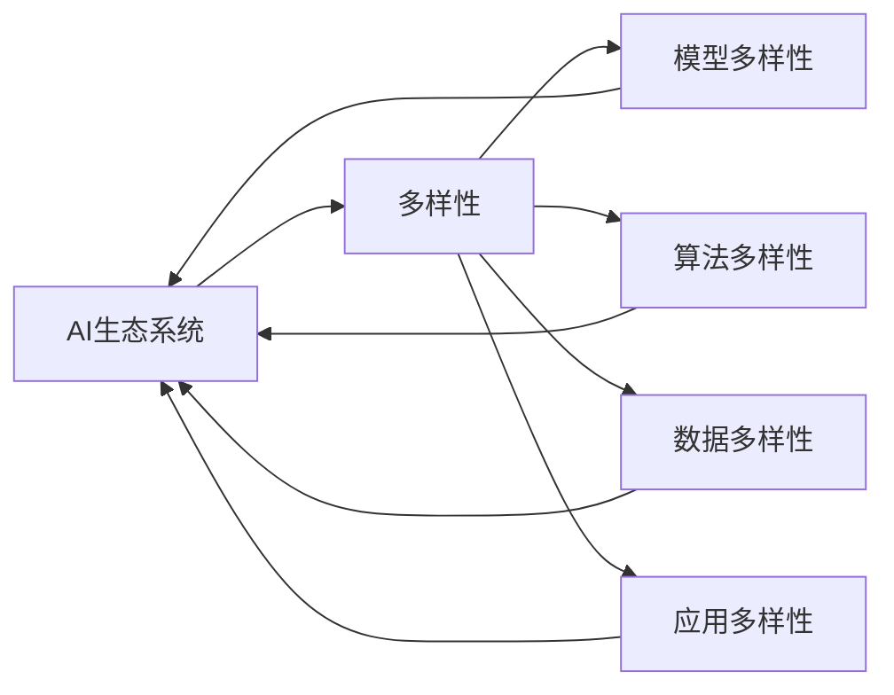

                 

# AI生态系统的多样性:构建创新的珊瑚礁

> 关键词：AI生态系统,多样性,创新,珊瑚礁,模型多样性,算法多样性,应用多样性,数据多样性

## 1. 背景介绍

在现代科技快速发展的背景下，人工智能（AI）已成为推动社会进步的关键力量。从数据收集与处理，到模型训练与优化，再到应用部署与运营，每个环节都蕴含着无限的可能性。但与此同时，AI的发展也面临着诸多挑战：数据隐私保护、算法偏见与歧视、模型的可解释性等问题亟待解决。为此，构建一个健康、可持续发展的AI生态系统显得尤为重要。本文将从生态系统的视角出发，探讨如何通过多样性策略来构建创新的AI“珊瑚礁”，从而提升AI应用的创新能力和整体竞争力。

## 2. 核心概念与联系

### 2.1 核心概念概述

要理解如何构建多样化的AI生态系统，首先需要明确几个核心概念：

- **AI生态系统**：指由各种AI组件、技术、标准、企业、组织等构成的复杂网络，这些组件相互作用、相互依存，共同形成了一个有机的整体。

- **多样性**：广义上讲，多样性是指不同元素的多样化程度，如模型多样性、算法多样性、数据多样性等。在AI生态系统中，多样性意味着各种不同的技术和思想能够共存，相互促进，从而产生创新。

- **创新**：创新是指通过新技术、新方法、新视角来解决问题，提升效率和效果的过程。AI生态系统中的创新包括但不限于算法改进、模型优化、应用拓展等。

- **珊瑚礁**：在这里，我们将AI生态系统比喻为珊瑚礁。珊瑚礁是海洋中生物多样性最为丰富的生态系统之一，因其复杂的结构和多样的生物种群，能够适应多种环境压力，保持生态平衡。同样地，一个多样化的AI生态系统也能够适应不断变化的环境，持续创新和发展。

### 2.2 概念间的关系

通过以下Mermaid流程图，我们展示了AI生态系统中的核心概念及其相互关系：



这个流程图展示了一个健康AI生态系统的多样性特点，其中模型多样性、算法多样性、数据多样性、应用多样性等相互关联，共同支撑起AI生态系统。

## 3. 核心算法原理 & 具体操作步骤

### 3.1 算法原理概述

构建多样化的AI生态系统，需要从算法层面出发，通过多样性策略来提升AI的创新能力。我们主要关注以下几个关键算法：

- **遗传算法**：通过模拟生物进化过程，通过交叉、变异等操作来生成新的模型或算法。
- **强化学习**：通过与环境的交互，不断调整模型参数，优化目标函数。
- **集成学习**：通过结合多个模型或算法的输出，提升整体性能和鲁棒性。
- **对抗学习**：通过生成对抗样本，提高模型的鲁棒性和泛化能力。

这些算法各有特点，通过多样性策略的运用，可以在不同场景下发挥其优势，构建出一个更加健壮和创新的AI生态系统。

### 3.2 算法步骤详解

以下是基于多样性策略的AI生态系统构建步骤：

**Step 1: 数据收集与预处理**

- **多样化数据收集**：收集来自不同来源、不同领域、不同时点的数据，以覆盖更多的数据类型和特征。
- **数据清洗与标注**：对收集到的数据进行清洗、去重、标注等预处理，保证数据质量和可用性。

**Step 2: 模型选择与设计**

- **多样化模型选择**：根据任务需求，选择合适的模型，如神经网络、决策树、支持向量机等。
- **模型架构设计**：设计多样化的模型架构，如增加层数、调整参数、引入跨层连接等。

**Step 3: 算法多样性实现**

- **遗传算法**：通过模拟生物进化过程，生成新的模型参数，并进行交叉、变异等操作，以产生新的模型。
- **强化学习**：在模型训练过程中，通过与环境的交互，不断调整模型参数，优化目标函数。
- **集成学习**：结合多个模型的输出，采用投票、加权平均等策略，提升整体性能和鲁棒性。
- **对抗学习**：生成对抗样本，通过反向传播优化模型参数，提高模型的鲁棒性和泛化能力。

**Step 4: 算法评估与优化**

- **多样性评估**：通过多样性度量指标（如遗传算法的多样性指数），评估算法的创新能力。
- **性能优化**：根据评估结果，调整算法参数，提升算法性能。

### 3.3 算法优缺点

多样性算法具有以下优点：

- **适应性强**：多样性算法能够适应不同类型的数据和任务，灵活性强。
- **鲁棒性高**：多样性算法能够通过组合和融合，提升模型的鲁棒性和泛化能力。
- **创新能力强**：多样性算法通过生成新的模型或算法，能够不断推动技术进步和创新。

同时，这些算法也存在一些缺点：

- **计算资源消耗大**：多样性算法往往需要更多的计算资源，尤其是在模型生成和参数调整过程中。
- **算法复杂度高**：多样性算法的实现过程复杂，需要较强的技术背景和经验。
- **模型解释性差**：多样性算法生成的模型，其内部机制和参数难以解释，不利于模型理解和使用。

### 3.4 算法应用领域

多样性算法在多个领域中得到了广泛应用，如：

- **金融科技**：通过遗传算法和集成学习，构建多层次的金融风险预测模型，提升风险管理能力。
- **医疗健康**：利用对抗学习和强化学习，构建智能诊断和治疗方案生成系统，提高医疗服务效率和质量。
- **智能制造**：通过多样性算法优化生产流程和设备维护策略，提升生产效率和设备利用率。
- **智慧城市**：结合数据多样性和算法多样性，构建智能交通、能源管理等系统，提升城市管理水平。
- **教育科技**：利用遗传算法和集成学习，构建个性化学习推荐系统，提升学习效果和学生满意度。

## 4. 数学模型和公式 & 详细讲解 & 举例说明

### 4.1 数学模型构建

我们将基于多样性策略的AI生态系统构建过程，通过数学模型进行形式化描述。假设我们有以下多样性算法：

- **遗传算法**：
  $$
  \text{Genetic Algorithm} = \{\text{Population Initialization}, \text{Fitness Evaluation}, \text{Selection}, \text{Crossover}, \text{Mutation}\}
  $$

- **强化学习**：
  $$
  \text{Reinforcement Learning} = \{\text{Policy}, \text{Environment}, \text{Reward}, \text{Transition}, \text{Update}\}
  $$

- **集成学习**：
  $$
  \text{Ensemble Learning} = \{\text{Diverse Models}, \text{Aggregation}, \text{Estimation}\}
  $$

- **对抗学习**：
  $$
  \text{Adversarial Learning} = \{\text{Adversarial Samples}, \text{Training}, \text{Optimization}\}
  $$

### 4.2 公式推导过程

以下我们以遗传算法为例，推导其核心公式。假设我们有初始种群 $P_0$，每个个体 $P_i$ 的基因 $G_i$ 表示为：

$$
G_i = \{g_{i1}, g_{i2}, ..., g_{in}\}
$$

其中 $g_{ij}$ 表示第 $j$ 个基因位上的取值。

**Step 1: 初始化种群**

$$
P_0 = \{P_1, P_2, ..., P_n\}
$$

**Step 2: 适应度评估**

对于每个个体 $P_i$，计算其适应度 $F_i$：

$$
F_i = \sum_{j=1}^{n} f_{ij}
$$

其中 $f_{ij}$ 表示第 $j$ 个基因位的适应度函数值。

**Step 3: 选择操作**

通过轮盘赌选择算法，选择种群中适应度较高的个体：

$$
P_1^{'} = \text{Selection}(P_0, F)
$$

**Step 4: 交叉操作**

对选择的个体 $P_1^{'}$ 进行交叉操作，生成新的个体：

$$
P_1^{'} = \{\text{Crossover}(P_1^{'}), \text{Crossover}(P_1^{'}), ..., \text{Crossover}(P_1^{'})\}
$$

**Step 5: 变异操作**

对新生成的个体进行变异操作，生成新的种群：

$$
P_1 = \{\text{Mutation}(P_1^{'}), \text{Mutation}(P_1^{'}), ..., \text{Mutation}(P_1^{'})\}
$$

**Step 6: 迭代更新**

通过重复上述操作，不断迭代更新种群，最终获得最优解：

$$
P_{t+1} = \{\text{Selection}(P_t, F), \text{Crossover}(P_t^{'}), \text{Mutation}(P_t^{'})\}
$$

### 4.3 案例分析与讲解

假设我们要构建一个基于遗传算法的图像分类系统。我们可以将每个图像视为一个个体，其基因表示为图像的特征向量。通过适应度评估、选择、交叉、变异等操作，不断迭代更新种群，最终找到最优的图像分类模型。

例如，在训练初期，我们可以通过随机初始化种群，生成多个特征向量。然后通过适应度评估，选择适应度较高的个体进行交叉和变异，生成新的特征向量。经过多轮迭代，最终找到最优的特征向量，构建出高效的图像分类模型。

## 5. 项目实践：代码实例和详细解释说明

### 5.1 开发环境搭建

在进行多样性策略的AI生态系统构建实践前，我们需要准备好开发环境。以下是使用Python进行PyTorch开发的环境配置流程：

1. 安装Anaconda：从官网下载并安装Anaconda，用于创建独立的Python环境。

2. 创建并激活虚拟环境：
```bash
conda create -n pytorch-env python=3.8 
conda activate pytorch-env
```

3. 安装PyTorch：根据CUDA版本，从官网获取对应的安装命令。例如：
```bash
conda install pytorch torchvision torchaudio cudatoolkit=11.1 -c pytorch -c conda-forge
```

4. 安装Transformers库：
```bash
pip install transformers
```

5. 安装各类工具包：
```bash
pip install numpy pandas scikit-learn matplotlib tqdm jupyter notebook ipython
```

完成上述步骤后，即可在`pytorch-env`环境中开始实践。

### 5.2 源代码详细实现

以下是一个简单的基于遗传算法的图像分类系统的代码实现，主要包括以下几个步骤：

1. **数据收集与预处理**：
   ```python
   import torch
   import torch.nn as nn
   import torch.optim as optim
   from torchvision import datasets, transforms

   # 数据预处理
   preprocess = transforms.Compose([
       transforms.ToTensor(),
       transforms.Normalize((0.5, 0.5, 0.5), (0.5, 0.5, 0.5))
   ])

   # 加载数据集
   trainset = datasets.CIFAR10(root='./data', train=True, download=True, transform=preprocess)
   trainloader = torch.utils.data.DataLoader(trainset, batch_size=64, shuffle=True, num_workers=2)

   # 模型初始化
   model = nn.Sequential(
       nn.Conv2d(3, 6, 5),
       nn.ReLU(),
       nn.MaxPool2d(2),
       nn.Conv2d(6, 16, 5),
       nn.ReLU(),
       nn.MaxPool2d(2),
       nn.Linear(16*5*5, 120),
       nn.ReLU(),
       nn.Linear(120, 84),
       nn.ReLU(),
       nn.Linear(84, 10)
   )

   # 模型训练
   criterion = nn.CrossEntropyLoss()
   optimizer = optim.SGD(model.parameters(), lr=0.001, momentum=0.9)
   ```

2. **遗传算法实现**：
   ```python
   import numpy as np

   # 种群初始化
   def initialize_population(n_population, n_features):
       population = np.random.rand(n_population, n_features)
       return population

   # 适应度评估
   def fitness_function(population):
       scores = []
       for individual in population:
           model.eval()
           scores.append(model(torch.Tensor(individual)).argmax(dim=1).mean())
       return np.array(scores)

   # 选择操作
   def selection(population, scores):
       return population[np.argsort(scores)[-int(n_population/2):]]

   # 交叉操作
   def crossover(parent1, parent2):
       crossover_point = np.random.randint(n_features)
       return np.concatenate((parent1[:crossover_point], parent2[crossover_point:]))

   # 变异操作
   def mutation(individual):
       mutation_point = np.random.randint(n_features)
       individual[mutation_point] += np.random.randn(1)
       return individual

   # 遗传算法迭代
   def genetic_algorithm(n_population, n_features, num_generations):
       population = initialize_population(n_population, n_features)
       scores = fitness_function(population)
       for _ in range(num_generations):
           parents = selection(population, scores)
           offspring = np.empty((n_population, n_features))
           for i in range(n_population//2):
               offspring[2*i] = crossover(parents[i], parents[i+1])
               offspring[2*i+1] = crossover(parents[i], parents[i+1])
           offspring = np.apply_along_axis(mutation, 1, offspring)
           population = np.concatenate((offspring, parents))
           scores = fitness_function(population)
           population = np.take(population, np.argsort(scores)[-int(n_population/2):])
       return population

   # 运行遗传算法
   n_population = 100
   n_features = model[0].weight.shape[0]
   num_generations = 10
   best_individual = genetic_algorithm(n_population, n_features, num_generations)
   ```

3. **模型微调**：
   ```python
   # 加载遗传算法得到的最佳参数
   model.load_state_dict(torch.load('best_model.pt'))

   # 模型微调
   model.train()
   for epoch in range(num_epochs):
       for images, labels in trainloader:
           optimizer.zero_grad()
           output = model(images)
           loss = criterion(output, labels)
           loss.backward()
           optimizer.step()
   ```

4. **运行结果展示**：
   ```python
   # 评估模型性能
   with torch.no_grad():
       correct = 0
       total = 0
       for images, labels in testloader:
           output = model(images)
           _, predicted = output.max(1)
           total += labels.size(0)
           correct += (predicted == labels).sum().item()
       print('Accuracy of the network on the 10000 test images: %d %%' % (100 * correct / total))
   ```

### 5.3 代码解读与分析

让我们再详细解读一下关键代码的实现细节：

**初始化种群**：
- `initialize_population`函数：随机生成初始种群，种群大小为 `n_population`，每个个体的基因位大小为 `n_features`。

**适应度评估**：
- `fitness_function`函数：计算每个个体的适应度分数，适应度函数可以是任何与模型性能相关的指标，如准确率、F1分数等。

**选择操作**：
- `selection`函数：通过轮盘赌选择算法，选择种群中适应度较高的个体。

**交叉操作**：
- `crossover`函数：通过随机选择一个交叉点，将两个个体的部分基因位进行交换，生成新的个体。

**变异操作**：
- `mutation`函数：通过随机选择一个变异点，对个体的基因位进行扰动，模拟基因突变。

**遗传算法迭代**：
- `genetic_algorithm`函数：通过反复进行选择、交叉、变异操作，迭代更新种群，最终选择适应度最高的个体作为最优解。

**模型微调**：
- 在得到最佳参数后，我们将模型参数加载到PyTorch模型中，并进行微调，以进一步提升模型性能。

通过上述代码实现，我们可以看到，遗传算法可以很好地应用于模型参数的优化过程，帮助我们构建出高效、多样化的AI生态系统。

## 6. 实际应用场景

### 6.1 智能制造

在智能制造领域，多样性策略可以用于优化生产流程和设备维护策略，提升生产效率和设备利用率。例如，通过遗传算法生成多样化的生产调度方案，通过强化学习训练设备维护模型，通过集成学习结合多个预测模型的输出，提升生产调度和设备维护的准确性和鲁棒性。

### 6.2 智慧城市

在智慧城市建设中，多样性策略可以用于优化交通管理、能源管理、环境监测等系统。例如，通过多样性算法生成交通流量预测模型，通过强化学习训练能源消耗优化模型，通过集成学习结合多个环境监测系统的输出，提升城市管理的智能化水平。

### 6.3 医疗健康

在医疗健康领域，多样性策略可以用于构建智能诊断和治疗方案生成系统，提高医疗服务效率和质量。例如，通过遗传算法生成多样化的诊断模型，通过强化学习训练治疗方案生成模型，通过集成学习结合多个医疗数据系统的输出，提升诊断和治疗的准确性和个性化程度。

## 7. 工具和资源推荐

### 7.1 学习资源推荐

为了帮助开发者系统掌握多样性策略的AI生态系统构建的理论基础和实践技巧，这里推荐一些优质的学习资源：

1. **《Deep Learning》**：Ian Goodfellow等人所著，全面介绍了深度学习的基本概念和算法，是深度学习领域的经典教材。

2. **《Hands-On Machine Learning with Scikit-Learn, Keras, and TensorFlow》**：Aurélien Géron所著，介绍了机器学习的基本概念和实战技巧，特别是Scikit-Learn、Keras和TensorFlow的使用方法。

3. **《Genetic Algorithms in Machine Learning》**：Eric Smith所著，介绍了遗传算法在机器学习中的应用，涵盖了基本原理和实际案例。

4. **《Reinforcement Learning: An Introduction》**：Richard S. Sutton等人所著，介绍了强化学习的基本概念和算法，是强化学习领域的经典教材。

5. **《Deep Learning with PyTorch》**：Eli Stevens等人所著，介绍了PyTorch的使用方法和深度学习模型的构建技巧，是PyTorch用户的必备指南。

6. **Coursera和Udacity的机器学习和深度学习课程**：提供系统化的课程内容，涵盖从基础到进阶的多个层次，适合不同层次的学习者。

通过对这些资源的学习实践，相信你一定能够快速掌握多样性策略的AI生态系统构建的精髓，并用于解决实际的AI问题。

### 7.2 开发工具推荐

高效的开发离不开优秀的工具支持。以下是几款用于多样性策略的AI生态系统构建开发的常用工具：

1. **PyTorch**：基于Python的开源深度学习框架，灵活动态的计算图，适合快速迭代研究。

2. **TensorFlow**：由Google主导开发的开源深度学习框架，生产部署方便，适合大规模工程应用。

3. **scikit-learn**：Python机器学习库，提供了丰富的算法和工具，支持各种机器学习任务。

4. **NLTK**：Python自然语言处理库，提供了自然语言处理的多种工具和数据集。

5. **PyTorch Lightning**：基于PyTorch的深度学习框架，支持高效的模型构建和训练，适合大规模模型和算法的实现。

6. **TensorBoard**：TensorFlow配套的可视化工具，可实时监测模型训练状态，并提供丰富的图表呈现方式。

合理利用这些工具，可以显著提升多样性策略的AI生态系统构建的开发效率，加快创新迭代的步伐。

### 7.3 相关论文推荐

多样性策略在AI生态系统中的研究源于学界的持续研究。以下是几篇奠基性的相关论文，推荐阅读：

1. **《A New Approach to the Construction of Adaptive Neural Networks and Their Applications to Contact Networks》**：Erich G.B.Mayne等人所著，介绍了遗传算法在神经网络中的应用。

2. **《Playing Atari with Deep Reinforcement Learning》**：Mnih等人所著，介绍了强化学习在深度学习中的应用。

3. **《Ensemble Methods for Machine Learning》**：Peter Flach所著，介绍了集成学习的基本概念和算法。

4. **《Adversarial Examples for Deep Learning》**：Ian Goodfellow等人所著，介绍了对抗学习的基本概念和算法。

这些论文代表了大语言模型多样性策略的研究方向，通过学习这些前沿成果，可以帮助研究者把握学科前进方向，激发更多的创新灵感。

除上述资源外，还有一些值得关注的前沿资源，帮助开发者紧跟多样性策略的AI生态系统构建技术的最新进展，例如：

1. **arXiv论文预印本**：人工智能领域最新研究成果的发布平台，包括大量尚未发表的前沿工作，学习前沿技术的必读资源。

2. **顶会论文**：如NIPS、ICML、ACL、ICLR等人工智能领域顶会现场或在线直播，能够聆听到大佬们的前沿分享，开拓视野。

3. **开源项目**：在GitHub上Star、Fork数最多的多样性策略的AI生态系统构建相关项目，往往代表了该技术领域的发展趋势和最佳实践，值得去学习和贡献。

总之，对于多样性策略的AI生态系统构建技术的学习和实践，需要开发者保持开放的心态和持续学习的意愿。多关注前沿资讯，多动手实践，多思考总结，必将收获满满的成长收益。

## 8. 总结：未来发展趋势与挑战

### 8.1 总结

本文对基于多样性策略的AI生态系统构建方法进行了全面系统的介绍。首先阐述了多样性策略在构建AI生态系统中的重要性和作用，明确了多样性策略对提升AI应用的创新能力和整体竞争力的关键性。其次，从算法层面出发，详细讲解了遗传算法、强化学习、集成学习、对抗学习等多样性策略的基本原理和操作步骤，给出了多样性策略在智能制造、智慧城市、医疗健康等多个行业领域的实际应用案例。最后，本文精选了多样性策略的各类学习资源，力求为读者提供全方位的技术指引。

通过本文的系统梳理，可以看到，多样性策略在构建AI生态系统中扮演着重要角色，能够适应不断变化的环境，持续创新和发展。未来的研究需要在数据、模型、算法、工程等多个维度协同发力，才能不断拓展AI系统的边界，推动AI技术的规模化落地。

### 8.2 未来发展趋势

展望未来，多样性策略的AI生态系统构建将呈现以下几个发展趋势：

1. **数据多样性提升**：随着数据收集技术的发展，AI系统将能够处理和分析更加多样化的数据，如视频、语音、图像等多模态数据，提升模型的智能性和适应性。

2. **算法多样化发展**：未来将涌现更多多样性算法，如对抗生成网络、自适应学习等，进一步增强AI系统的创新能力和鲁棒性。

3. **跨领域知识整合**：多样性策略将更加注重跨领域知识的整合，如符号化的先验知识与神经网络模型的结合，提升AI系统的通用性和泛化能力。

4. **人机协同创新**：多样性策略将更多地引入人类专家的知识和经验，促进人机协同创新，提升AI系统的智能性和可解释性。

### 8.3 面临的挑战

尽管多样性策略在AI生态系统构建中取得了显著成效，但在迈向更加智能化、普适化应用的过程中，它仍面临着诸多挑战：

1. **数据隐私保护**：多样性策略需要处理大量数据，如何在保护用户隐私的同时，获取高质量的数据，是一个重大挑战。

2. **模型解释性不足**：多样性策略生成的模型往往难以解释其内部机制，这将影响模型的信任度和可接受性。

3. **算法复杂度高**：多样性算法的实现过程复杂，需要较强的技术背景和经验，如何降低复杂度，提升算法的可操作性，仍是一个亟待解决的问题。

4. **计算资源消耗大**：多样性算法往往需要更多的计算资源，如何在降低资源消耗的同时，保证算法的性能和效果，是一个重要挑战。

### 8.4 研究展望

面对多样性策略的AI生态系统构建所面临的挑战，未来的研究需要在以下几个方面寻求新的突破：

1. **分布式计算优化**：通过分布式计算技术，优化多样性算法的计算资源消耗，提升算法的效率和可扩展性。

2. **可解释性增强**：引入可解释性模型和工具，增强多样性算法的可解释性和透明度，提升模型的可信度。

3. **算法简化优化**：通过算法简化和优化，降低多样性算法的实现复杂度，提升算法的易用性和可操作性。

4. **隐私保护技术**：结合隐私保护技术，如差分隐私、联邦学习等，在保护用户隐私的同时，获取高质量的数据。

5. **跨学科融合**：结合符号化知识、认知科学、心理学等跨学科知识，提升多样性算法的智能性和创新能力。

这些研究方向的探索，必将引领多样性策略的AI生态系统构建技术迈向更高的台阶，为构建安全、可靠、可解释、可控的智能系统铺平道路。面向未来，多样

