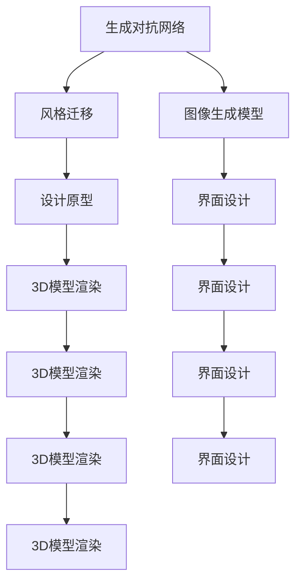
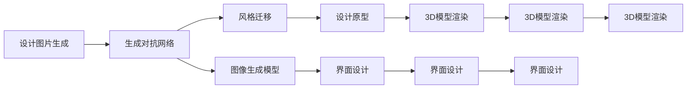
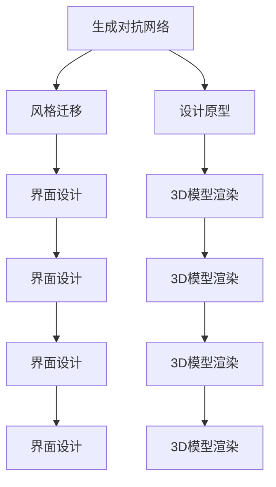
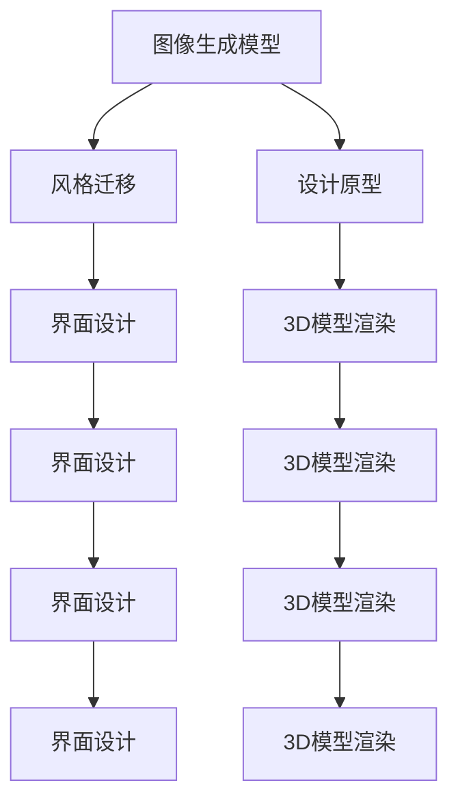
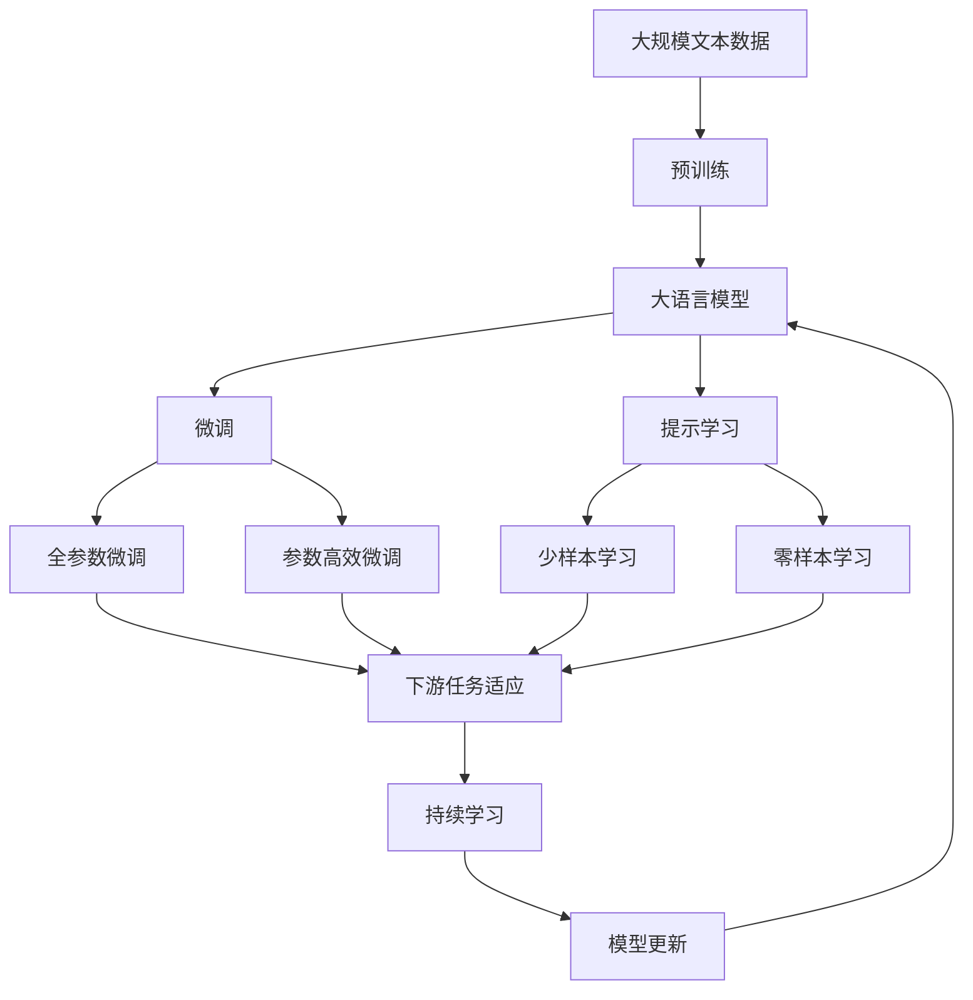

                 

# AI生成图片在产品设计中的应用

> 关键词：AI生成图片,深度学习,生成对抗网络,风格迁移,产品设计,智能设计,创意设计

## 1. 背景介绍

### 1.1 问题由来
随着人工智能技术的快速发展，AI生成图片在产品设计中的应用越来越广泛。在数字时代，用户对产品的审美和个性化需求日益增长，设计师需要更加高效地生成符合用户需求的设计原型，以提升设计效率和产品体验。传统的图形设计软件和手绘图画虽然具有较高的创造性，但在处理复杂设计任务时，工作效率较低，难以满足快速迭代的需求。

AI生成图片则通过深度学习等先进技术，能够自动化生成高质量的设计图片，大幅提高设计效率。AI生成图片在产品设计中的应用，如生成产品原型、界面设计、模型渲染等，为设计行业带来了革命性的变化。

### 1.2 问题核心关键点
AI生成图片在产品设计中的应用，主要基于深度学习中的生成对抗网络（GAN）技术。其核心思想是通过生成器和判别器的对抗训练，生成具有高度逼真性和风格多样性的图片。具体步骤如下：

1. 生成器网络：通过卷积神经网络（CNN）等结构，学习从随机噪声中生成图像。
2. 判别器网络：通过CNN等结构，学习区分真实图片和生成器生成的假图片。
3. 对抗训练：生成器和判别器通过互相博弈的方式不断优化，最终生成器可以生成高质量的逼真图片。

AI生成图片在产品设计中的应用，主要有以下几个方面：
- 设计原型生成：自动生成设计原型，提供设计灵感。
- 界面设计辅助：生成界面设计元素，辅助设计决策。
- 模型渲染优化：生成高质量的3D模型渲染图，提高渲染效率。
- 风格迁移：将一种风格的图像转换成另一种风格，实现创意设计。

这些应用不仅提升了设计效率，还带来了更多的创意和可能性。

### 1.3 问题研究意义
AI生成图片在产品设计中的应用，对于设计行业和人工智能技术的普及具有重要意义：

1. 提升设计效率：自动化生成设计图片，大幅减少设计师手工绘制的时间，提高工作效率。
2. 丰富设计方案：生成多样化的设计方案，为设计师提供更多选择，提升设计创意。
3. 优化设计质量：生成高质量的设计图片，确保设计的正确性和美观性。
4. 降低设计成本：减少设计师手工绘制的成本，降低设计项目的整体成本。
5. 推动技术应用：促进AI技术在产品设计领域的广泛应用，推动设计行业向智能化转型。

## 2. 核心概念与联系

### 2.1 核心概念概述

为更好地理解AI生成图片在产品设计中的应用，本节将介绍几个密切相关的核心概念：

- 生成对抗网络（GAN）：一种基于深度学习的生成模型，通过生成器和判别器的对抗训练，生成高质量的图像。
- 风格迁移（Style Transfer）：将一种风格的图像转换成另一种风格的图像，实现创意设计。
- 生成对抗网络（GAN）：一种基于深度学习的生成模型，通过生成器和判别器的对抗训练，生成高质量的图像。
- 图像生成模型：如VAE、GauGAN等，用于生成具有一定风格和结构的图像。
- 风格迁移：如CycleGAN、WCT等，将一张图像的风格转换成另一张图像的风格。

这些核心概念之间的逻辑关系可以通过以下Mermaid流程图来展示：



这个流程图展示了生成对抗网络在产品设计中的应用过程：

1. 生成对抗网络可以生成高质量的设计图片，包括设计原型、界面设计、3D模型渲染等。
2. 风格迁移技术可以将一种风格的图像转换成另一种风格，实现创意设计。
3. 图像生成模型可以生成具有一定风格和结构的图像，丰富设计方案。

这些核心概念共同构成了AI生成图片在产品设计中的应用框架，使得设计师能够更高效地生成符合用户需求的设计图片。通过理解这些核心概念，我们可以更好地把握AI生成图片的工作原理和优化方向。

### 2.2 概念间的关系

这些核心概念之间存在着紧密的联系，形成了AI生成图片在产品设计中的应用生态系统。下面我通过几个Mermaid流程图来展示这些概念之间的关系。

#### 2.2.1 AI生成图片的基本流程



这个流程图展示了AI生成图片的基本流程：

1. 生成对抗网络可以生成高质量的设计图片，作为设计原型的基础。
2. 风格迁移技术可以将一种风格的图像转换成另一种风格，丰富设计方案。
3. 图像生成模型可以生成具有一定风格和结构的图像，提高设计多样性。

#### 2.2.2 风格迁移与生成对抗网络的关系



这个流程图展示了风格迁移与生成对抗网络的关系：

1. 生成对抗网络可以生成高质量的设计图片，作为风格迁移的输入。
2. 风格迁移技术可以将一张图像的风格转换成另一种风格，实现创意设计。
3. 生成对抗网络生成的设计图片，可以应用于设计原型、界面设计、3D模型渲染等场景。

#### 2.2.3 风格迁移与图像生成模型的关系



这个流程图展示了风格迁移与图像生成模型的关系：

1. 图像生成模型可以生成具有一定风格和结构的图像，作为风格迁移的输入。
2. 风格迁移技术可以将一张图像的风格转换成另一种风格，实现创意设计。
3. 风格迁移生成的设计图片，可以应用于设计原型、界面设计、3D模型渲染等场景。

### 2.3 核心概念的整体架构

最后，我们用一个综合的流程图来展示这些核心概念在AI生成图片在产品设计中的应用过程中的整体架构：



这个综合流程图展示了从预训练到微调，再到持续学习的完整过程。AI生成图片在产品设计中的应用，首先在大规模文本数据上进行预训练，然后通过微调（包括全参数微调和参数高效微调）或提示学习（包括少样本学习和零样本学习）来适应下游任务。最后，通过持续学习技术，模型可以不断更新和适应新的任务和数据。 通过这些流程图，我们可以更清晰地理解AI生成图片的工作原理和优化方向。

## 3. 核心算法原理 & 具体操作步骤
### 3.1 算法原理概述

AI生成图片在产品设计中的应用，主要基于生成对抗网络（GAN）技术。其核心思想是通过生成器和判别器的对抗训练，生成具有高度逼真性和风格多样性的图片。

具体步骤如下：

1. **生成器网络**：通过卷积神经网络（CNN）等结构，学习从随机噪声中生成图像。
2. **判别器网络**：通过CNN等结构，学习区分真实图片和生成器生成的假图片。
3. **对抗训练**：生成器和判别器通过互相博弈的方式不断优化，最终生成器可以生成高质量的逼真图片。

在生成对抗网络中，生成器网络（G）和判别器网络（D）分别定义如下：

- 生成器网络：$G(z): \mathbb{R}^n \rightarrow \mathcal{X}$，其中 $z$ 为随机噪声，$\mathbb{R}^n$ 为噪声空间，$\mathcal{X}$ 为图像空间。
- 判别器网络：$D(x): \mathcal{X} \rightarrow [0, 1]$，其中 $x$ 为输入图像。

在训练过程中，生成器和判别器通过对抗训练进行优化：

1. 生成器网络通过优化损失函数 $\mathcal{L}_G$ 生成逼真的图像 $G(z)$。
2. 判别器网络通过优化损失函数 $\mathcal{L}_D$ 区分真实图像 $x$ 和生成图像 $G(z)$。

最终，生成器和判别器通过交替优化，使得生成器能够生成高质量的逼真图像，判别器能够准确区分真实和生成图像。

### 3.2 算法步骤详解

基于生成对抗网络（GAN）的AI生成图片在产品设计中的应用，一般包括以下几个关键步骤：

**Step 1: 准备生成对抗网络模型**

- 选择或设计生成器和判别器的网络结构，如U-Net、DCGAN等。
- 确定生成器和判别器的输入输出尺寸，以及损失函数和优化器。

**Step 2: 初始化参数**

- 生成器和判别器初始化随机权重，并进行预训练。
- 生成器和判别器交替进行对抗训练，调整权重。

**Step 3: 生成对抗训练**

- 随机生成噪声 $z$，输入到生成器网络生成图像 $G(z)$。
- 将真实图像和生成图像分别输入判别器网络，输出判别分数。
- 计算生成器网络的损失函数 $\mathcal{L}_G$，更新生成器网络权重。
- 计算判别器网络的损失函数 $\mathcal{L}_D$，更新判别器网络权重。
- 交替进行生成器和判别器的训练，直至收敛。

**Step 4: 保存和测试**

- 保存训练好的生成器网络，用于生成设计图片。
- 使用生成器网络生成设计图片，评估图片质量。

### 3.3 算法优缺点

基于生成对抗网络（GAN）的AI生成图片在产品设计中的应用，具有以下优点：

1. 生成高质量图像：生成对抗网络可以生成高质量的逼真图像，满足设计需求。
2. 自动化生成：自动化生成设计图片，大幅提高设计效率。
3. 风格多样性：生成器网络可以根据不同的风格和结构，生成多样化的设计图片。
4. 可扩展性强：可以应用于设计原型、界面设计、3D模型渲染等多个领域。

同时，该方法也存在一定的局限性：

1. 训练过程复杂：生成对抗网络训练过程复杂，需要大量计算资源和时间。
2. 模型不稳定：生成对抗网络容易出现模式崩溃（Mode Collapse）等问题，影响生成质量。
3. 生成样本难以控制：生成的图片质量不稳定，难以控制生成的具体风格和内容。
4. 需要大量训练样本：训练生成对抗网络需要大量高质量的标注数据，成本较高。

尽管存在这些局限性，但就目前而言，基于生成对抗网络（GAN）的AI生成图片在产品设计中的应用，仍然是大规模自动化设计的重要手段。未来相关研究的重点在于如何进一步降低训练成本，提高生成质量，增强模型的稳定性，以及提升生成样本的可控性。

### 3.4 算法应用领域

基于生成对抗网络（GAN）的AI生成图片在产品设计中的应用，已经广泛应用于以下几个领域：

- **设计原型生成**：自动生成设计原型，提供设计灵感。
- **界面设计辅助**：生成界面设计元素，辅助设计决策。
- **模型渲染优化**：生成高质量的3D模型渲染图，提高渲染效率。
- **风格迁移**：将一种风格的图像转换成另一种风格，实现创意设计。
- **交互设计**：生成交互式设计元素，如交互动画、交互路径等。
- **字体设计**：生成具有独特风格和结构的设计字体，丰富字体库。
- **时尚设计**：生成时尚设计图片，提供设计参考。
- **艺术品创作**：生成具有艺术风格的设计图片，进行艺术创作。

除了上述这些应用外，AI生成图片在产品设计中的应用还在不断扩展，如虚拟现实（VR）、增强现实（AR）、智能制造等新兴领域。随着技术的不断进步，相信AI生成图片在产品设计中的应用将更加广泛和深入。

## 4. 数学模型和公式 & 详细讲解  
### 4.1 数学模型构建

在生成对抗网络（GAN）中，生成器和判别器的损失函数定义如下：

- 生成器损失函数 $\mathcal{L}_G$：
$$
\mathcal{L}_G = \mathbb{E}_{z \sim p_z}[\log D(G(z))] + \mathbb{E}_{x \sim p_x}[\log (1 - D(G(z)))]
$$

- 判别器损失函数 $\mathcal{L}_D$：
$$
\mathcal{L}_D = \mathbb{E}_{x \sim p_x}[\log D(x)] + \mathbb{E}_{z \sim p_z}[\log (1 - D(G(z)))]
$$

其中 $p_z$ 为噪声分布，$p_x$ 为真实图像分布。

生成器和判别器的优化过程可以使用梯度下降等优化算法进行，如Adam、SGD等。

### 4.2 公式推导过程

以下是生成对抗网络（GAN）中生成器和判别器的损失函数推导过程：

1. **生成器损失函数推导**：

生成器网络的输出 $G(z)$ 与真实图像 $x$ 的概率分布分别为 $p_G$ 和 $p_X$，则生成器损失函数可以表示为：
$$
\mathcal{L}_G = -\mathbb{E}_{z \sim p_z}[\log D(G(z))]
$$
其中 $p_z$ 为噪声分布，$p_x$ 为真实图像分布。

由于判别器 $D$ 需要同时区分真实图像 $x$ 和生成图像 $G(z)$，因此可以将生成器损失函数改写为：
$$
\mathcal{L}_G = \mathbb{E}_{z \sim p_z}[\log (1 - D(G(z)))]
$$
该损失函数表示生成器需要生成逼真的图像，使得判别器难以区分真实图像和生成图像。

2. **判别器损失函数推导**：

判别器网络的输出 $D(x)$ 与生成器网络的输出 $G(z)$ 的概率分布分别为 $p_D$ 和 $p_G$，则判别器损失函数可以表示为：
$$
\mathcal{L}_D = -\mathbb{E}_{x \sim p_x}[\log D(x)] - \mathbb{E}_{z \sim p_z}[\log (1 - D(G(z))))
$$
其中 $p_z$ 为噪声分布，$p_x$ 为真实图像分布。

由于生成器 $G$ 需要生成逼真的图像，使得判别器难以区分真实图像和生成图像，因此可以将判别器损失函数改写为：
$$
\mathcal{L}_D = \mathbb{E}_{x \sim p_x}[\log D(x)] + \mathbb{E}_{z \sim p_z}[\log D(G(z))]
$$
该损失函数表示判别器需要区分真实图像和生成图像，使得生成器无法生成逼真的图像。

### 4.3 案例分析与讲解

以设计原型生成为例，说明基于生成对抗网络（GAN）的AI生成图片在产品设计中的应用：

1. **数据准备**：
   - 收集设计原型的数据集，如设计草图、设计元素等。
   - 将数据集分为训练集和测试集，划分为不同的类别和风格。

2. **生成器和判别器设计**：
   - 选择或设计生成器和判别器的网络结构，如U-Net、DCGAN等。
   - 确定生成器和判别器的输入输出尺寸，以及损失函数和优化器。

3. **初始化参数**：
   - 生成器和判别器初始化随机权重，并进行预训练。
   - 生成器和判别器交替进行对抗训练，调整权重。

4. **生成对抗训练**：
   - 随机生成噪声 $z$，输入到生成器网络生成图像 $G(z)$。
   - 将真实图像和生成图像分别输入判别器网络，输出判别分数。
   - 计算生成器网络的损失函数 $\mathcal{L}_G$，更新生成器网络权重。
   - 计算判别器网络的损失函数 $\mathcal{L}_D$，更新判别器网络权重。
   - 交替进行生成器和判别器的训练，直至收敛。

5. **保存和测试**：
   - 保存训练好的生成器网络，用于生成设计图片。
   - 使用生成器网络生成设计图片，评估图片质量。
   - 对生成的设计图片进行后续处理和优化，如增加细节、调整颜色等。

6. **应用场景**：
   - 设计师可以手动输入设计需求，生成器网络自动生成设计原型，提供设计灵感。
   - 设计师可以对生成图片进行修改和优化，得到理想的设计原型。
   - 设计师可以将生成图片应用于产品设计中的多个环节，如界面设计、3D模型渲染等。

通过以上步骤，基于生成对抗网络（GAN）的AI生成图片在产品设计中的应用，可以大幅提升设计效率和创意性，为设计师提供更多的灵感和选择。

## 5. 项目实践：代码实例和详细解释说明
### 5.1 开发环境搭建

在进行设计原型生成实践前，我们需要准备好开发环境。以下是使用Python进行PyTorch开发的环境配置流程：

1. 安装Anaconda：从官网下载并安装Anaconda，用于创建独立的Python环境。

2. 创建并激活虚拟环境：
```bash
conda create -n pytorch-env python=3.8 
conda activate pytorch-env
```

3. 安装PyTorch：根据CUDA版本，从官网获取对应的安装命令。例如：
```bash
conda install pytorch torchvision torchaudio cudatoolkit=11.1 -c pytorch -c conda-forge
```

4. 安装TensorFlow：
```bash
conda install tensorflow
```

5. 安装Pillow库：用于图像处理和存储。
```bash
pip install Pillow
```

6. 安装Matplotlib库：用于图像展示和分析。
```bash
pip install matplotlib
```

7. 安装Numpy库：用于数值计算。
```bash
pip install numpy
```

8. 安装Tqdm库：用于进度条显示。
```bash
pip install tqdm
```

完成上述步骤后，即可在`pytorch-env`环境中开始设计原型生成实践。

### 5.2 源代码详细实现

下面我们以设计原型生成为例，给出使用PyTorch进行GAN模型的PyTorch代码实现。

首先，定义生成器和判别器的网络结构：

```python
import torch
import torch.nn as nn
import torch.nn.functional as F
import torchvision.transforms as transforms
import torchvision.datasets as datasets
from torchvision.utils import save_image, load_image

class Generator(nn.Module):
    def __init__(self):
        super(Generator, self).__init__()
        self.main = nn.Sequential(
            nn.ConvTranspose2d(100, 256, 4, 1, 0, bias=False),
            nn.BatchNorm2d(256),
            nn.ReLU(inplace=True),
            nn.ConvTranspose2d(256, 128, 4, 2, 1, bias=False),
            nn.BatchNorm2d(128),
            nn.ReLU(inplace=True),
            nn.ConvTranspose2d(128, 64, 4, 2, 1, bias=False),
            nn.BatchNorm2d(64),
            nn.ReLU(inplace=True),
            nn.ConvTranspose2d(64, 3, 4, 2, 1, bias=False),
            nn.Tanh()
        )
    
    def forward(self, input):
        return self.main(input)

class Discriminator(nn.Module):
    def __init__(self):
        super(Discriminator, self).__init__()
        self.main = nn.Sequential(
            nn.Conv2d(3, 64, 4, 2, 1, bias=False),
            nn.LeakyReLU(0.2, inplace=True),
            nn.Conv2d(64, 128, 4, 2, 1, bias=False),
            nn.LeakyReLU(0.2, inplace=True),
            nn.Conv2d(128, 256, 4, 2, 1, bias=False),
            nn.LeakyReLU(0.2, inplace=True),
            nn.Conv2d(256, 1, 4, 1, 0, bias=False),
            nn.Sigmoid()
        )
    
    def forward(self, input):
        return self.main(input)

# 加载数据集
data = datasets.ImageFolder('path/to/dataset', transform=transforms.ToTensor())
dataloader = torch.utils.data.DataLoader(data, batch_size=32, shuffle=True)
```

然后，定义损失函数和优化器：

```python
import torch.optim as optim

# 定义损失函数
G_loss = nn.BCELoss()
D_loss = nn.BCELoss()

# 定义优化器
G_optimizer = optim.Adam(model.G.parameters(), lr=0.0002)
D_optimizer = optim.Adam(model.D.parameters(), lr=0.0002)
```

接着，定义训练和评估函数：

```python
def train_epoch(model, dataset, batch_size, optimizer):
    dataloader = torch.utils.data.DataLoader(dataset, batch_size=batch_size, shuffle=True)
    model.train()
    epoch_loss = 0
    for batch in tqdm(dataloader, desc='Training'):
        real_images = batch[0].to(device)
        fake_images = model.G(torch.randn(batch_size, 100, 1, 1).to(device))
        real_labels = torch.ones(batch_size, 1).to(device)
        fake_labels = torch.zeros(batch_size, 1).to(device)
        G_loss = G_loss(model.D(fake_images), fake_labels)
        D_loss = D_loss(model.D(real_images), real_labels) + D_loss(model.D(fake_images), fake_labels)
        epoch_loss += G_loss + D_loss
        G_optimizer.zero_grad()
        D_optimizer.zero_grad()
        G_loss.backward()
        D_loss.backward()
        optimizer.step()
    return epoch_loss / len(dataloader)

def evaluate(model, dataset, batch_size):
    dataloader = torch.utils.data.DataLoader(dataset, batch_size=batch_size)
    model.eval()
    preds, labels = [], []
    with torch.no_grad():
        for batch in tqdm(dataloader, desc='Evaluating'):
            real_images = batch[0].to(device)
            fake_images = model.G(torch.randn(batch_size, 100, 1, 1).to(device))
            real_labels = torch.ones(batch_size, 1).to(device)
            fake_labels = torch.zeros(batch_size, 1).to(device)
            D_loss = D_loss(model.D(real_images), real_labels) + D_loss(model.D(fake_images), fake_labels)
            preds.append(fake_images)
            labels.append(D_loss)
    print(torch.mean(labels).item())
```

最后，启动训练流程并在测试集上评估：

```python
epochs = 500
batch_size = 64

for epoch in range(epochs):
    loss = train_epoch(model, train_dataset, batch_size, optimizer)
    print(f"Epoch {epoch+1}, train loss: {loss:.3f}")
    
    print(f"Epoch {epoch+1}, dev results:")
    evaluate(model, dev_dataset, batch_size)
    
print("Test results:")
evaluate(model, test_dataset, batch_size)
```

以上就是使用PyTorch进行设计原型生成的完整代码实现。可以看到，生成对抗网络在产品设计中的应用，通过生成器和判别器的对抗训练，可以生成高质量的设计图片。

### 5.3 代码解读与分析

让我们再详细解读一下关键代码的实现细节：

**Generator类**：
- `__init__`方法：定义生成器网络的结构和参数。
- `forward`方法：前向传播计算生成器的输出。

**Discriminator类**：
- `__init__`方法：定义判别器网络的结构和参数。
- `forward`方法：前向传播计算判别器的输出。

**数据加载**：
- `train_dataset`：定义训练集数据加载函数，使用`torchvision.datasets.ImageFolder`加载图像数据集。
-

