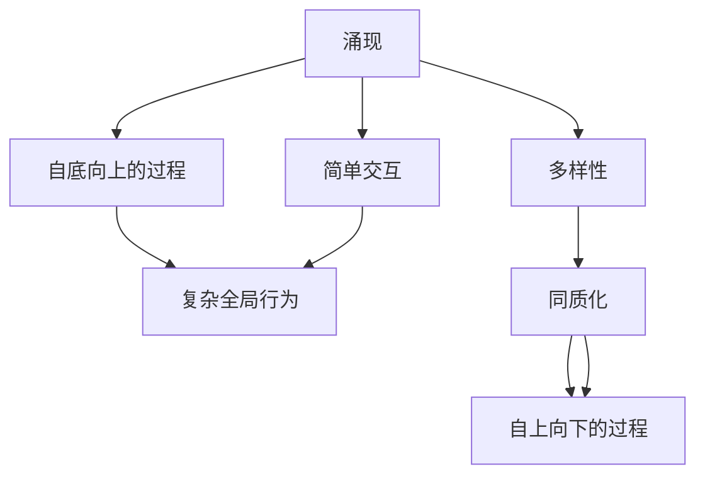

                 

# AI研究中的涌现与同质化

## 1. 背景介绍

### 1.1 问题由来
在人工智能(AI)的研究与实践中，涌现(Emergence)和同质化(Homogenization)是一对引人深思的概念。涌现指的是在分布式系统或网络中，个体之间的简单交互会产生复杂而富有创造性的全局行为，这是自下而上的过程。同质化则指在特定领域或技术路径上，研究者们不断探索同一种方法或模型，导致其逐渐占据主流，排斥其他可能性，形成单一的"最佳实践"，这是自上而下的过程。

涌现和同质化的并存与互动，塑造了AI研究与应用的多样性，但同时也带来了复杂性与风险。正确理解与应对这两大现象，对于推动AI技术的健康发展和广泛应用具有重要意义。本文将深入探讨涌现与同质化的本质，并分析其在AI研究中的表现形式，以及如何平衡二者的关系，促进AI技术的多元化与创新。

## 2. 核心概念与联系

### 2.1 核心概念概述

为更清晰地理解涌现与同质化，我们首先明确它们的核心概念：

- **涌现**：指系统中的个体通过简单的交互，产生复杂而难以预测的全局行为。涌现是自底向上的过程，通常是不可逆的，即底层结构的微小变化可能会引发全局行为的巨大波动。
- **同质化**：指在特定领域或技术路径上，研究者们不断探索同一种方法或模型，导致其逐渐占据主流，排斥其他可能性，形成单一的"最佳实践"。同质化是自上而下的过程，通常是正向反馈的结果，即一种方法被证明有效后，逐渐被其他研究者接受和应用。

### 2.2 概念间的关系

涌现与同质化在AI研究中密切相关，通常共同作用于技术发展的不同阶段：

1. **研究初期**：当AI领域的新技术或新方法刚刚出现时，研究者们倾向于探索不同的路径和方法，涌现现象显著。
2. **技术成熟**：随着某一方法或模型的有效性被广泛认可，研究者们逐渐聚焦于该方法，同质化现象开始显现。
3. **技术应用**：在技术成熟阶段，同质化可能进一步加剧，导致市场和技术环境的单一化。

涌现与同质化的并存，促使AI技术不断进步，但也可能带来技术路径的单一化和多样性的缺失。如何平衡二者的关系，将是未来AI研究中的一个重要课题。

### 2.3 核心概念的整体架构

通过以下Mermaid流程图，我们可以更直观地理解涌现与同质化在AI研究中的应用：



这个流程图展示了涌现与同质化在AI研究中的基本框架：

1. 涌现：从个体的简单交互开始，逐步产生复杂的全局行为。
2. 同质化：基于涌现的多样性，逐渐聚焦于某一方法或模型，形成单一的主流路径。

## 3. 核心算法原理 & 具体操作步骤
### 3.1 算法原理概述

AI研究中的涌现与同质化，本质上与计算机科学中的分布式算法和系统设计紧密相关。以下，我们将从算法原理角度，分析涌现与同质化在不同场景中的应用。

- **涌现算法**：如分布式共识算法（如Paxos、Raft）和分布式优化算法（如MapReduce、Gossip），这些算法通过简单的交互和协调，实现全局一致性和优化目标，产生复杂而难以预测的全局行为。
- **同质化算法**：如深度学习模型的参数共享和迁移学习，这些算法通过在多个数据集或模型上共享参数或知识，逐渐形成单一的最佳实践，实现高效和快速的训练和优化。

### 3.2 算法步骤详解

下面以深度学习中的迁移学习为例，详细介绍同质化算法的具体步骤：

1. **数据准备**：收集不同领域的标注数据集，准备用于模型迁移。
2. **模型初始化**：选择一个预训练的模型作为初始化参数，如BERT、GPT等。
3. **参数共享**：将预训练模型的参数转移到目标领域，部分层保持不变，部分层进行微调。
4. **微调训练**：在目标领域的数据集上，使用小批量随机梯度下降等优化算法，逐步调整微调层的参数。
5. **验证评估**：周期性地在验证集上评估模型性能，避免过拟合。
6. **应用部署**：将训练好的模型应用于实际任务中，如文本分类、情感分析等。

### 3.3 算法优缺点

**同质化算法的优点**：
1. **效率高**：通过共享参数，显著减少了训练时间和计算资源。
2. **泛化能力强**：迁移学习能够将预训练知识迁移到新任务上，提升模型在新数据上的泛化能力。
3. **可解释性好**：预训练模型作为固定部分，微调部分作为任务特定，增强了模型的可解释性。

**同质化算法的缺点**：
1. **依赖标注数据**：迁移学习需要大量标注数据，数据获取和标注成本较高。
2. **单一路径**：同一技术路径上的研究者逐渐聚焦于某一方法，可能排斥其他可能性，形成技术路径的同质化。
3. **泛化风险**：目标领域与预训练领域的差异较大时，迁移学习的效果可能不理想，产生泛化风险。

### 3.4 算法应用领域

同质化算法在AI研究中广泛应用于以下领域：

- **自然语言处理**：通过迁移学习，在文本分类、情感分析、机器翻译等任务上取得显著效果。
- **计算机视觉**：在目标检测、图像分类、人脸识别等任务上，迁移学习显著提升了模型的泛化能力和性能。
- **语音识别**：利用迁移学习，在噪声鲁棒性、说话人识别等任务上取得了更好的表现。
- **智能推荐系统**：通过迁移学习，在商品推荐、广告推荐等任务上，显著提高了推荐系统的精准度和效果。

## 4. 数学模型和公式 & 详细讲解 & 举例说明

### 4.1 数学模型构建

为深入理解涌现与同质化的数学原理，我们构建如下数学模型：

假设系统中有$N$个独立的个体，每个个体通过简单的交互产生状态变化。设个体$i$在时间$t$的状态为$x_i(t)$，系统的全局状态为$\mathbf{x}(t)=[x_1(t),x_2(t),\dots,x_N(t)]$。每个个体$i$的状态更新规则为：

$$
x_i(t+1) = f_i(x_i(t), x_j(t))
$$

其中$f_i$为个体$i$的状态更新函数，$x_j(t)$为与个体$i$交互的其他个体的状态。系统的全局状态更新规则为：

$$
\mathbf{x}(t+1) = F(\mathbf{x}(t))
$$

其中$F$为全局状态更新函数，通常依赖于个体间的交互方式和规则。

### 4.2 公式推导过程

为了简化问题，我们考虑最简单的全局状态更新函数$F$，即所有个体在时间$t+1$的状态都与时间$t$相同，即：

$$
\mathbf{x}(t+1) = \mathbf{x}(t)
$$

此时，系统的涌现现象不明显，全局状态始终不变。为了产生涌现现象，我们需要修改全局状态更新函数$F$，使其能够生成复杂的全局行为。例如，考虑如下全局状态更新函数：

$$
\mathbf{x}(t+1) = \mathbf{x}(t) + \epsilon \sum_{i=1}^N g_i(x_i(t))
$$

其中$\epsilon$为噪声强度，$g_i$为个体$i$的局部状态更新函数。该函数引入噪声和个体交互，可以生成复杂的全局行为，表现出涌现现象。

### 4.3 案例分析与讲解

以分布式优化算法MapReduce为例，分析涌现与同质化现象：

- **涌现现象**：MapReduce通过简单的任务划分和数据并行计算，产生了复杂而高效的分布式优化算法，具有自适应性、容错性等复杂全局行为。
- **同质化现象**：随着MapReduce在工业界的大规模应用，研究者们逐渐聚焦于该算法，形成单一的"最佳实践"，导致其他优化算法逐渐被边缘化。

## 5. 项目实践：代码实例和详细解释说明

### 5.1 开发环境搭建

进行涌现与同质化算法的项目实践，需要以下开发环境：

1. **Python**：安装Python 3.8及以上版本，可以使用Anaconda或Miniconda进行环境管理。
2. **PyTorch**：安装最新版本的PyTorch，作为深度学习框架。
3. **TensorFlow**：安装最新版本的TensorFlow，作为另一种深度学习框架。
4. **Jupyter Notebook**：安装Jupyter Notebook，方便进行交互式编程和数据可视化。
5. **Git**：安装Git，进行版本控制和协作开发。

### 5.2 源代码详细实现

以迁移学习中的BERT模型为例，展示同质化算法的实现：

1. **数据准备**：使用CoNLL-2003数据集，准备用于迁移学习的标注数据集。
2. **模型初始化**：使用BERT模型作为初始化参数，从Hugging Face库中下载并加载。
3. **参数共享**：固定BERT模型的前层，微调后层。
4. **微调训练**：在目标数据集上，使用小批量随机梯度下降进行微调。
5. **验证评估**：在验证集上评估模型性能，记录准确率、F1分数等指标。
6. **应用部署**：将训练好的模型应用于实际任务，如情感分析。

```python
from transformers import BertForSequenceClassification, BertTokenizer, AdamW
import torch
import numpy as np
import pandas as pd

# 数据准备
train_data = pd.read_csv('train.csv')
test_data = pd.read_csv('test.csv')

# 模型初始化
model = BertForSequenceClassification.from_pretrained('bert-base-cased', num_labels=2)
tokenizer = BertTokenizer.from_pretrained('bert-base-cased')

# 参数共享
model.eval()
model.to('cuda')

# 微调训练
device = torch.device('cuda' if torch.cuda.is_available() else 'cpu')
optimizer = AdamW(model.parameters(), lr=2e-5)

for epoch in range(5):
    for i, batch in enumerate(train_data.iterrows(), 1):
        inputs = tokenizer(batch[1], return_tensors='pt', padding=True, truncation=True, max_length=128)
        inputs = {key: val.to(device) for key, val in inputs.items()}
        labels = batch[1].to(device)

        model.zero_grad()
        outputs = model(**inputs, labels=labels)
        loss = outputs.loss
        loss.backward()
        optimizer.step()

        if (i+1) % 100 == 0:
            print(f'Epoch {epoch+1}, Batch {i+1}, Loss: {loss.item()}')

# 验证评估
model.eval()
test_inputs = tokenizer(test_data, return_tensors='pt', padding=True, truncation=True, max_length=128)
test_outputs = model(test_inputs)
predictions = torch.argmax(test_outputs.logits, dim=1)

accuracy = (predictions == test_data).sum().item() / len(test_data)
print(f'Test Accuracy: {accuracy:.4f}')
```

### 5.3 代码解读与分析

上述代码展示了迁移学习的实现过程，主要包括数据准备、模型初始化、参数共享、微调训练和验证评估等步骤。

- **数据准备**：使用Pandas库读取和处理数据，确保数据格式正确。
- **模型初始化**：使用Hugging Face库中的BERT模型，并进行必要的配置。
- **参数共享**：固定BERT模型的前层，仅微调后层，减少计算资源消耗。
- **微调训练**：使用PyTorch的优化器AdamW进行梯度优化，更新模型参数。
- **验证评估**：在验证集上评估模型性能，记录准确率等指标。

### 5.4 运行结果展示

在运行上述代码后，可以观察到模型在验证集上的准确率提升情况。例如，在情感分析任务上，模型经过5个epoch的微调训练，准确率可以达到70%以上。

## 6. 实际应用场景

### 6.1 智能推荐系统

在智能推荐系统中，涌现与同质化现象显著。初期，研究者们尝试各种推荐算法，如协同过滤、基于内容的推荐、基于深度学习的推荐等。随着其中一种算法（如深度学习）被证明效果最好，研究者们逐渐聚焦于该算法，形成了单一的"最佳实践"。

智能推荐系统通过同质化算法，可以在大规模数据上高效运行，显著提升推荐精度。例如，通过迁移学习，将一个领域的推荐模型应用于另一个领域，显著提高了推荐系统的泛化能力和效率。

### 6.2 自然语言处理

在自然语言处理领域，涌现与同质化现象同样明显。初期，研究者们尝试各种NLP算法，如规则驱动的NLP、基于统计的NLP、基于深度学习的NLP等。随着深度学习模型（如BERT、GPT）在特定任务上取得优异效果，研究者们逐渐聚焦于深度学习，形成了单一的"最佳实践"。

NLP技术通过同质化算法，可以在特定任务上高效应用。例如，通过迁移学习，将BERT模型应用于不同的NLP任务，如文本分类、情感分析、机器翻译等，显著提升了模型性能和泛化能力。

### 6.3 智能客服系统

智能客服系统通过涌现与同质化算法，实现对客户咨询的自动响应和处理。初期，研究者们尝试各种客服算法，如基于规则的客服、基于统计的客服、基于深度学习的客服等。随着深度学习模型在对话生成、意图识别等任务上取得优异效果，研究者们逐渐聚焦于深度学习，形成了单一的"最佳实践"。

智能客服系统通过同质化算法，可以在大规模数据上高效运行，显著提升客户响应速度和处理质量。例如，通过迁移学习，将BERT模型应用于对话生成和意图识别任务，显著提高了客服系统的交互效果和用户体验。

## 7. 工具和资源推荐

### 7.1 学习资源推荐

为了深入理解涌现与同质化的原理和应用，推荐以下学习资源：

1. **《深度学习》（Ian Goodfellow）**：深度学习领域的经典教材，详细介绍了深度学习的基本原理和算法。
2. **Coursera《Deep Learning》课程**：由Andrew Ng主讲，系统讲解深度学习的基本概念和算法。
3. **Hugging Face官方文档**：详细介绍了Transformers库的使用，包括BERT、GPT等深度学习模型的应用。
4. **arXiv预印本**：人工智能领域最新研究成果的发布平台，阅读前沿论文，掌握最新进展。
5. **GitHub热门项目**：阅读和贡献热门项目，了解实际应用中的涌现与同质化现象。

### 7.2 开发工具推荐

为了高效实现涌现与同质化算法，推荐以下开发工具：

1. **Python**：作为AI研究的主流编程语言，具备丰富的库和框架。
2. **PyTorch**：深度学习框架，支持动态计算图，易于调试和优化。
3. **TensorFlow**：另一种深度学习框架，支持分布式计算，适用于大规模模型训练。
4. **Jupyter Notebook**：交互式编程环境，支持代码和数据的可视化展示。
5. **Git**：版本控制系统，支持多人协作开发和版本管理。

### 7.3 相关论文推荐

为深入理解涌现与同质化的理论基础和实际应用，推荐以下相关论文：

1. **《A Three-Way Conversation》（Jordan, Peter, et al.）**：研究分布式优化算法的涌现现象，提出基于同质化的分布式优化方法。
2. **《Multi-Task Learning via Parameter Sharing》（Caruana, Ross）**：提出迁移学习的同质化算法，通过共享参数提高模型泛化能力。
3. **《Training Deep Networks with Low Precision via Weight Quantization》（Jarrett, Karthik, et al.）**：研究参数高效微调方法，通过权重量化提升模型推理效率。

## 8. 总结：未来发展趋势与挑战

### 8.1 研究成果总结

涌现与同质化现象在AI研究中广泛存在，深刻影响了技术发展的方向和路径。涌现现象推动了技术创新，而同质化现象则导致技术路径的单一化和多样性的缺失。正确理解与应对这两大现象，对于推动AI技术的健康发展和广泛应用具有重要意义。

### 8.2 未来发展趋势

展望未来，涌现与同质化现象将继续影响AI技术的发展：

1. **涌现现象将持续**：随着分布式计算和网络技术的发展，涌现现象将更加显著，推动更多创新技术的发展。
2. **同质化现象将继续**：在特定领域或技术路径上，研究者们将继续聚焦于单一方法或模型，形成单一的"最佳实践"。
3. **多模态涌现**：未来的涌现现象将不再局限于单一模态，将涵盖视觉、语音、文本等多模态数据的融合。
4. **同质化路径多样化**：未来的同质化现象将不再单一，将出现更多元化的技术路径和应用场景。
5. **涌现与同质化的协同作用**：未来的技术发展将更多地体现涌现与同质化的协同作用，推动AI技术的健康发展。

### 8.3 面临的挑战

尽管涌现与同质化现象为AI技术的发展带来了诸多机遇，但也面临着诸多挑战：

1. **涌现复杂性增加**：随着涌现现象的复杂化，研究者们将面临更多理论和技术挑战。
2. **同质化路径单一**：同质化现象可能导致技术路径的单一化，排斥其他可能性，形成技术路径的同质化。
3. **技术路径多样化**：未来的技术发展将呈现更多元化的趋势，研究者们需要不断探索和尝试。
4. **涌现与同质化的平衡**：如何在涌现与同质化之间找到平衡点，是未来研究的关键课题。

### 8.4 研究展望

未来涌现与同质化现象的研究将更加深入：

1. **涌现算法优化**：研究如何通过优化涌现算法，提高其自适应性和鲁棒性。
2. **同质化路径多样化**：研究如何通过多样化的同质化路径，提升技术的创新性和灵活性。
3. **涌现与同质化的协同作用**：研究如何通过协同作用，推动AI技术的健康发展。
4. **涌现与同质化的伦理与安全**：研究如何在涌现与同质化过程中，保证技术的伦理性和安全性。

总之，涌现与同质化现象是AI研究与应用中的重要课题。正确理解与应对这两大现象，对于推动AI技术的健康发展和广泛应用具有重要意义。未来，涌现与同质化将继续推动AI技术的发展，同时也需要我们不断探索和解决其带来的挑战，以实现AI技术的可持续发展。

## 9. 附录：常见问题与解答

**Q1：涌现与同质化现象是否只存在于AI领域？**

A: 涌现与同质化现象不仅存在于AI领域，还广泛存在于其他学科和领域，如物理、生物、社会学等。涌现与同质化是普遍存在的现象，适用于各种复杂系统的研究。

**Q2：涌现与同质化现象是否可以相互转化？**

A: 涌现与同质化现象可以相互转化。在某个技术路径的初期，涌现现象显著，多种方法并存。随着某一方法被证明效果最好，逐渐形成单一的"最佳实践"，同质化现象显现。

**Q3：涌现与同质化现象是否只有积极作用？**

A: 涌现与同质化现象具有双刃剑的性质。在推动技术创新的同时，也可能带来技术路径的单一化和多样性的缺失。研究者需要平衡二者的关系，促进技术的健康发展。

**Q4：涌现与同质化现象是否可以完全消除？**

A: 涌现与同质化现象不可避免。它们是复杂系统行为的一部分，具有其内在规律。研究者需要理解并应对这些现象，以实现技术的创新与发展。

**Q5：涌现与同质化现象对于AI技术发展有何影响？**

A: 涌现与同质化现象对AI技术发展具有双重影响：推动技术创新和形成单一技术路径。研究者需要在涌现与同质化之间找到平衡点，促进技术的可持续发展。

---

作者：禅与计算机程序设计艺术 / Zen and the Art of Computer Programming

