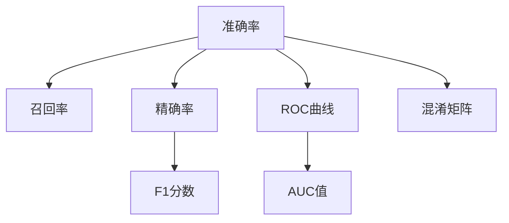
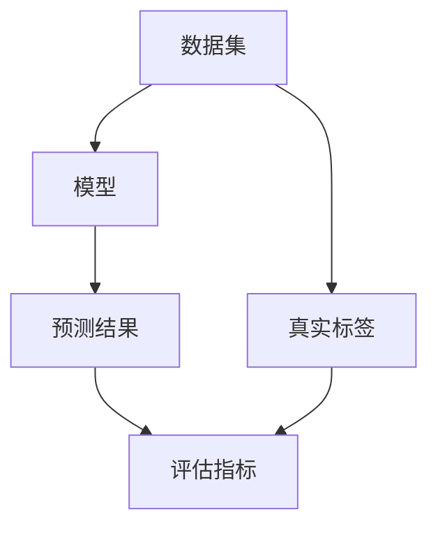
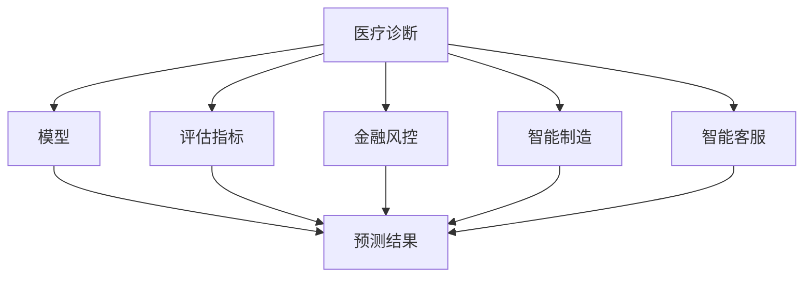
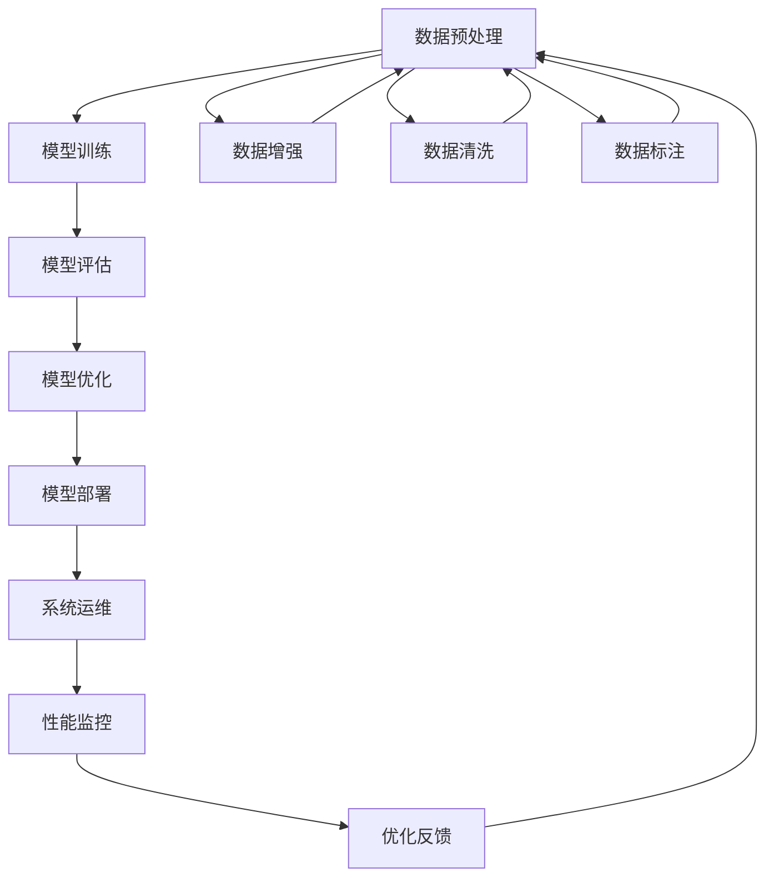

                 

# AI系统性能评估的关键指标

## 1. 背景介绍

### 1.1 问题由来

在人工智能(AI)技术快速发展的背景下，AI系统被广泛应用于各个领域，如医疗、金融、智能制造等。然而，高效的AI系统构建不仅依赖于先进的算法，更离不开科学合理的性能评估指标。性能评估是AI系统设计、开发、部署、运维不可或缺的一环。一个科学合理的性能评估指标，不仅可以帮助开发者发现系统漏洞，优化模型算法，更能够有效衡量系统的实际应用价值，指导后续的改进和升级。

### 1.2 问题核心关键点

一个科学合理的AI系统性能评估指标，需要具备以下特点：

1. **全面覆盖**：应覆盖AI系统从数据预处理、模型训练、推理部署到运维监控各个环节的关键性能参数。
2. **量化具体**：各项指标应有明确的量化定义和计算公式，确保评估结果可量化、可对比。
3. **客观公正**：指标应客观公正，不受人为因素影响，避免主观偏见。
4. **可操作性强**：评估方法应简单高效，易于操作和实施，不增加系统负担。
5. **动态可调**：指标应能随着系统迭代升级而动态调整，适应不同的应用场景和需求。

### 1.3 问题研究意义

科学合理的性能评估指标，对于AI系统的开发、部署和运维具有重要意义：

1. **优化模型性能**：通过各项评估指标，可以及时发现模型缺陷，指导模型优化，提升AI系统的预测准确率和鲁棒性。
2. **指导算法选择**：不同算法在数据分布、模型复杂度等方面表现各异，科学的评估指标有助于选择最合适的算法。
3. **评估系统价值**：通过评估指标，可以客观评估AI系统的应用价值和市场潜力，为后续投资决策提供依据。
4. **指导运维调整**：评估指标可帮助运维团队监控系统状态，及时调整资源配置，保障系统稳定运行。

## 2. 核心概念与联系

### 2.1 核心概念概述

为更好地理解AI系统性能评估指标的构建，本节将介绍几个密切相关的核心概念：

1. **准确率(Accuracy)**：模型预测正确的样本数占总样本数的比例，即 $Accuracy = \frac{TP + TN}{TP + TN + FP + FN}$。
2. **召回率(Recall)**：模型预测的正样本数占实际正样本数的比例，即 $Recall = \frac{TP}{TP + FN}$。
3. **精确率(Precision)**：模型预测为正的样本中，实际为正的样本数占总正样本数的比例，即 $Precision = \frac{TP}{TP + FP}$。
4. **F1分数(F1 Score)**：精确率和召回率的调和平均数，用于综合评估模型的性能，即 $F1 Score = 2 \times \frac{Precision \times Recall}{Precision + Recall}$。
5. **ROC曲线**：以假正率为横轴，真正率为纵轴，绘制的曲线，用于评估二分类模型的性能。
6. **AUC值**：ROC曲线下的面积，值越大表示模型性能越好。
7. **混淆矩阵(Confusion Matrix)**：用于可视化分类模型的预测结果和真实标签之间的差异。

这些核心概念之间的关系可以通过以下Mermaid流程图来展示：



这个流程图展示了一些核心概念之间的逻辑关系：

1. 准确率、召回率和精确率是分类模型的三项基本指标，用于衡量模型预测的准确性和全面性。
2. F1分数是对精确率和召回率的调和平均，综合考虑了模型在精确性和全面性上的表现。
3. ROC曲线和AUC值用于评估二分类模型的性能，AUC值越大表示模型性能越好。
4. 混淆矩阵用于可视化分类模型的预测结果和真实标签之间的差异，便于分析和改进。

### 2.2 概念间的关系

这些核心概念之间存在着紧密的联系，形成了AI系统性能评估的完整生态系统。下面我通过几个Mermaid流程图来展示这些概念之间的关系。

#### 2.2.1 AI系统的开发与评估流程


这个流程图展示了AI系统开发、评估、优化、部署、运维的完整流程，评估指标在其中扮演着重要角色。

#### 2.2.2 模型性能评估范式



这个流程图展示了模型性能评估的基本流程，从数据集到真实标签再到评估指标的计算过程。

#### 2.2.3 模型评估指标的应用领域



这个流程图展示了评估指标在不同领域的应用场景，包括医疗诊断、金融风控、智能制造和智能客服等。

### 2.3 核心概念的整体架构

最后，我们用一个综合的流程图来展示这些核心概念在AI系统性能评估中的整体架构：



这个综合流程图展示了从数据预处理到性能监控的完整流程，评估指标在其中起到了承上启下的作用。

## 3. 核心算法原理 & 具体操作步骤

### 3.1 算法原理概述

AI系统性能评估指标的构建，本质上是一个多目标优化问题。其核心思想是：通过多维度的评估指标，全面衡量系统的性能，帮助开发者发现问题，优化模型，提升系统价值。

假设AI系统针对一个二分类问题进行评估，其输入为 $x$，真实标签为 $y$，模型预测结果为 $\hat{y}$。则系统性能可以通过以下指标进行衡量：

1. **准确率(Accuracy)**：
   $$
   Accuracy = \frac{TP + TN}{TP + TN + FP + FN}
   $$

2. **召回率(Recall)**：
   $$
   Recall = \frac{TP}{TP + FN}
   $$

3. **精确率(Precision)**：
   $$
   Precision = \frac{TP}{TP + FP}
   $$

4. **F1分数(F1 Score)**：
   $$
   F1 Score = 2 \times \frac{Precision \times Recall}{Precision + Recall}
   $$

5. **ROC曲线**：
   $$
   TPR = \frac{TP}{TP + FN}, FPR = \frac{FP}{FP + TN}
   $$

   以 $TPR$ 为横轴， $FPR$ 为纵轴，绘制的曲线。

6. **AUC值**：
   $$
   AUC = \int_0^1 \frac{TPR}{TPR + (1 - TPR)} d(1 - FPR)
   $$

   ROC曲线下的面积。

7. **混淆矩阵(Confusion Matrix)**：
   $$
   \begin{bmatrix}
   TN & FP \\
   FN & TP
   \end{bmatrix}
   $$

   可视化分类模型的预测结果和真实标签之间的差异。

### 3.2 算法步骤详解

AI系统性能评估指标的构建，一般包括以下几个关键步骤：

**Step 1: 确定评估指标**  
- 根据具体应用场景，选择合适的评估指标。如分类问题常用准确率、召回率、精确率、F1分数等。

**Step 2: 设计评估流程**  
- 根据评估指标，设计系统评估流程。如将数据集划分为训练集、验证集和测试集，分别进行模型训练、验证和测试。

**Step 3: 实现评估算法**  
- 根据评估指标的定义和公式，编写评估算法的代码。如实现混淆矩阵、计算ROC曲线和AUC值等。

**Step 4: 进行模型评估**  
- 将模型在验证集和测试集上进行评估，计算各项指标。如计算准确率、召回率、精确率等。

**Step 5: 分析评估结果**  
- 根据评估结果，分析模型性能，发现问题。如哪些类别预测效果不佳，模型是否存在过拟合等。

**Step 6: 优化模型**  
- 根据分析结果，调整模型参数，优化模型性能。如调整正则化参数、增加训练轮数等。

**Step 7: 重新评估**  
- 经过优化后，再次在验证集和测试集上进行评估，确保性能提升。

### 3.3 算法优缺点

AI系统性能评估指标构建的优势在于：

1. **全面覆盖**：多个评估指标可以全面衡量模型的性能，发现不同方面的问题。
2. **量化具体**：各项指标有明确的量化定义和计算公式，确保评估结果可量化、可对比。
3. **客观公正**：评估指标基于数据和模型表现，不受人为因素影响，避免主观偏见。

其缺点在于：

1. **计算复杂**：部分指标的计算较为复杂，需要大量计算资源。
2. **依赖数据**：指标的计算依赖于数据质量，数据偏差可能导致评估结果失真。
3. **动态性差**：部分指标难以随模型迭代升级而动态调整。

### 3.4 算法应用领域

AI系统性能评估指标在各个领域都有广泛应用，包括但不限于：

- **医疗诊断**：用于评估疾病诊断模型的准确性和召回率，提升诊断效果。
- **金融风控**：用于评估贷款、信用评分模型的精确率和AUC值，规避风险。
- **智能制造**：用于评估质量检测模型的准确率和ROC曲线，提升检测准确度。
- **智能客服**：用于评估客户满意度模型的召回率和F1分数，提升服务质量。

## 4. 数学模型和公式 & 详细讲解 & 举例说明

### 4.1 数学模型构建

假设AI系统针对一个二分类问题进行评估，其输入为 $x$，真实标签为 $y$，模型预测结果为 $\hat{y}$。则系统性能可以通过以下指标进行衡量：

1. **准确率(Accuracy)**：
   $$
   Accuracy = \frac{TP + TN}{TP + TN + FP + FN}
   $$

2. **召回率(Recall)**：
   $$
   Recall = \frac{TP}{TP + FN}
   $$

3. **精确率(Precision)**：
   $$
   Precision = \frac{TP}{TP + FP}
   $$

4. **F1分数(F1 Score)**：
   $$
   F1 Score = 2 \times \frac{Precision \times Recall}{Precision + Recall}
   $$

5. **ROC曲线**：
   $$
   TPR = \frac{TP}{TP + FN}, FPR = \frac{FP}{FP + TN}
   $$

6. **AUC值**：
   $$
   AUC = \int_0^1 \frac{TPR}{TPR + (1 - TPR)} d(1 - FPR)
   $$

7. **混淆矩阵(Confusion Matrix)**：
   $$
   \begin{bmatrix}
   TN & FP \\
   FN & TP
   \end{bmatrix}
   $$

### 4.2 公式推导过程

以F1分数的计算为例，进行详细推导：

1. **精确率(Precision)**：
   $$
   Precision = \frac{TP}{TP + FP}
   $$

2. **召回率(Recall)**：
   $$
   Recall = \frac{TP}{TP + FN}
   $$

3. **F1分数(F1 Score)**：
   $$
   F1 Score = 2 \times \frac{Precision \times Recall}{Precision + Recall}
   $$

   将精确率和召回率的公式代入，得到：
   $$
   F1 Score = 2 \times \frac{\frac{TP}{TP + FP} \times \frac{TP}{TP + FN}}{\frac{TP}{TP + FP} + \frac{TP}{TP + FN}}
   $$

   化简后得到：
   $$
   F1 Score = \frac{2TP \times TP}{(TP + FP) \times (TP + FN) + 2TP^2}
   $$

### 4.3 案例分析与讲解

以医疗诊断系统为例，分析各项评估指标的应用：

1. **准确率(Accuracy)**：
   $$
   Accuracy = \frac{TP + TN}{TP + TN + FP + FN}
   $$

   用于衡量医疗诊断系统的总体准确性，即正确诊断的病例数占总诊断数。

2. **召回率(Recall)**：
   $$
   Recall = \frac{TP}{TP + FN}
   $$

   用于衡量医疗诊断系统对疾病的诊断全面性，即正确诊断的病例数占实际患病数。

3. **精确率(Precision)**：
   $$
   Precision = \frac{TP}{TP + FP}
   $$

   用于衡量医疗诊断系统对疾病的诊断准确性，即正确诊断的病例数占预测为患病的病例数。

4. **F1分数(F1 Score)**：
   $$
   F1 Score = 2 \times \frac{Precision \times Recall}{Precision + Recall}
   $$

   综合衡量医疗诊断系统的准确性和全面性，即综合考虑精确率和召回率的表现。

5. **ROC曲线**：
   $$
   TPR = \frac{TP}{TP + FN}, FPR = \frac{FP}{FP + TN}
   $$

   用于评估医疗诊断系统的诊断能力，特别是在正负样本分布不均衡的情况下。

6. **AUC值**：
   $$
   AUC = \int_0^1 \frac{TPR}{TPR + (1 - TPR)} d(1 - FPR)
   $$

   用于综合评估医疗诊断系统的诊断能力，值越大表示诊断能力越强。

7. **混淆矩阵(Confusion Matrix)**：
   $$
   \begin{bmatrix}
   TN & FP \\
   FN & TP
   \end{bmatrix}
   $$

   用于可视化医疗诊断系统的预测结果和真实标签之间的差异，便于分析和改进。

## 5. 项目实践：代码实例和详细解释说明

### 5.1 开发环境搭建

在进行AI系统性能评估指标的构建和评估时，需要一定的开发环境支持。以下是使用Python进行Scikit-learn开发的环境配置流程：

1. 安装Anaconda：从官网下载并安装Anaconda，用于创建独立的Python环境。

2. 创建并激活虚拟环境：
```bash
conda create -n sklearn-env python=3.8 
conda activate sklearn-env
```

3. 安装Scikit-learn：
```bash
pip install scikit-learn
```

4. 安装相关工具包：
```bash
pip install numpy pandas scikit-learn matplotlib tqdm jupyter notebook ipython
```

完成上述步骤后，即可在`sklearn-env`环境中进行AI系统性能评估指标的构建和评估。

### 5.2 源代码详细实现

下面我们以二分类问题为例，给出使用Scikit-learn评估模型的代码实现。

首先，定义数据集和模型：

```python
from sklearn.datasets import load_breast_cancer
from sklearn.model_selection import train_test_split
from sklearn.linear_model import LogisticRegression
from sklearn.metrics import accuracy_score, recall_score, precision_score, f1_score, roc_auc_score, confusion_matrix

# 加载数据集
data = load_breast_cancer()
X = data.data
y = data.target

# 划分数据集
X_train, X_test, y_train, y_test = train_test_split(X, y, test_size=0.2, random_state=42)

# 构建模型
model = LogisticRegression()

# 训练模型
model.fit(X_train, y_train)

# 预测结果
y_pred = model.predict(X_test)
```

然后，定义评估指标和计算过程：

```python
# 计算评估指标
accuracy = accuracy_score(y_test, y_pred)
recall = recall_score(y_test, y_pred, average='weighted')
precision = precision_score(y_test, y_pred, average='weighted')
f1 = f1_score(y_test, y_pred, average='weighted')
roc_auc = roc_auc_score(y_test, y_pred)
confusion = confusion_matrix(y_test, y_pred)

# 打印评估结果
print(f"Accuracy: {accuracy:.2f}")
print(f"Recall: {recall:.2f}")
print(f"Precision: {precision:.2f}")
print(f"F1 Score: {f1:.2f}")
print(f"ROC AUC: {roc_auc:.2f}")
print("Confusion Matrix:\n", confusion)
```

最后，启动评估流程：

```python
# 启动评估流程
accuracy = accuracy_score(y_test, y_pred)
recall = recall_score(y_test, y_pred, average='weighted')
precision = precision_score(y_test, y_pred, average='weighted')
f1 = f1_score(y_test, y_pred, average='weighted')
roc_auc = roc_auc_score(y_test, y_pred)
confusion = confusion_matrix(y_test, y_pred)

# 打印评估结果
print(f"Accuracy: {accuracy:.2f}")
print(f"Recall: {recall:.2f}")
print(f"Precision: {precision:.2f}")
print(f"F1 Score: {f1:.2f}")
print(f"ROC AUC: {roc_auc:.2f}")
print("Confusion Matrix:\n", confusion)
```

以上就是使用Scikit-learn对Logistic Regression模型进行二分类问题评估的完整代码实现。可以看到，Scikit-learn提供了丰富的评估函数，能够快速计算各类性能指标，便于开发者进行系统评估。

### 5.3 代码解读与分析

让我们再详细解读一下关键代码的实现细节：

**数据集处理**：
- 使用Scikit-learn的`load_breast_cancer`函数加载乳腺癌数据集，将其分为特征矩阵`X`和标签向量`y`。
- 使用`train_test_split`函数将数据集分为训练集和测试集。

**模型构建和训练**：
- 使用Scikit-learn的`LogisticRegression`函数构建逻辑回归模型。
- 在训练集上使用`fit`函数训练模型。

**评估指标计算**：
- 使用Scikit-learn的评估函数`accuracy_score`、`recall_score`、`precision_score`、`f1_score`、`roc_auc_score`、`confusion_matrix`计算各项评估指标。
- 使用`average='weighted'`参数计算多类别情况下的平均指标值。

**评估结果打印**：
- 将各项评估指标的值打印输出，便于分析和比较。

**完整评估流程**：
- 在模型训练后，使用测试集进行评估，计算各项评估指标。
- 将评估结果打印输出，以供后续分析改进。

通过Scikit-learn提供的评估函数，开发者可以轻松计算各类性能指标，进行系统评估和优化。在实际应用中，还可以通过Scikit-learn的`GridSearchCV`等函数进行超参数调优，进一步提升模型性能。

## 6. 实际应用场景

### 6.1 医疗诊断系统

AI系统性能评估指标在医疗诊断系统中的应用，具有重要意义。在医疗诊断中，精确性和召回率是评估模型性能的关键指标。

例如，在乳腺癌检测中，模型需要具备高召回率，以确保所有潜在病例都被及时发现。同时，模型也需要具备高精确率，避免将正常病例误诊为疾病。通过综合评估准确率、召回率和精确率，可以全面衡量模型的诊断能力。

### 6.2 金融风控系统

金融风控系统中，模型的精确率和AUC值是评估性能的重要指标。精确率用于衡量模型对风险的识别能力，AUC值用于衡量模型在正负样本分布不均衡情况下的综合性能。

例如，在信用评分模型中，精确率用于评估模型的违约识别能力，AUC值用于评估模型在低违约率情况下的性能。通过精确率和AUC值的综合评估，可以确保模型能够准确识别高风险客户，同时避免对低风险客户的误判。

### 6.3 智能客服系统

智能客服系统中的AI模型，需要进行文本分类和情感分析等任务。F1分数和召回率是评估模型性能的关键指标。

例如，在情感分析任务中，模型需要具备高召回率，以确保所有情感信息都被识别出来。同时，模型也需要具备高F1分数，综合考虑精确率和召回率的表现，以确保情感分析的准确性和全面性。

### 6.4 未来应用展望

未来，AI系统性能评估指标将随着AI技术的发展和应用场景的扩展，呈现出以下趋势：

1. **多模态评估**：随着多模态数据的普及，AI系统性能评估指标将从单一模态扩展到多模态，如文本、图像、声音等，综合衡量系统的综合性能。
2. **动态评估**：随着模型迭代的不断进行，AI系统性能评估指标将从静态评估向动态评估转变，实时跟踪系统性能变化，及时调整优化。
3. **自动化评估**：随着自动化技术的发展，AI系统性能评估指标将更加自动化，减少人工干预，提高评估效率。
4. **公平性评估**：随着公平性、可解释性等伦理问题的重视，AI系统性能评估指标将更加注重公平性评估，确保模型的决策过程透明、公正。
5. **跨领域评估**：随着跨领域应用场景的增多，AI系统性能评估指标将更加注重跨领域的综合评估，确保模型在不同领域的一致性。

## 7. 工具和资源推荐

### 7.1 学习资源推荐

为帮助开发者系统掌握AI系统性能评估指标的理论基础和实践技巧，这里推荐一些优质的学习资源：

1. 《Python机器学习》书籍：详细介绍了Scikit-learn等Python机器学习库的使用方法和评估指标的计算。
2. 《机器学习实战》书籍：通过实际案例，深入浅出地介绍了各类评估指标的计算和应用。
3. Coursera《机器学习基础》课程：斯坦福大学开设的机器学习课程，涵盖了多项评估指标的计算和优化。
4. Kaggle机器学习竞赛：参加各类竞赛，通过实践深入理解评估指标的计算和应用。
5. 学术论文：如Jaccard相似系数、Jensen-Shannon距离等评估指标的计算方法，可以通过学术论文深入了解。

通过对这些资源的学习实践，相信你一定能够快速掌握AI系统性能评估指标的构建和应用，从而提升模型的实际应用价值。

### 7.2 开发工具推荐

高效的开发离不开优秀的工具支持。以下是几款用于AI系统性能评估指标开发的常用工具：

1. Scikit-learn：基于Python的开源机器学习库，提供丰富的评估函数和算法实现。
2. TensorFlow：由Google主导开发的开源深度学习框架，提供动态图计算和评估功能。
3. PyTorch：基于Python的开源深度学习框架，支持动态图和静态图计算，提供灵活的评估接口。
4. Jupyter Notebook：交互式Python编程环境，便于开发者进行模型训练和评估。
5. Visual Studio Code：轻量级开发工具，支持代码编写、版本控制和评估结果展示。

合理利用这些工具，可以显著提升AI系统性能评估指标的构建和应用效率，加速模型优化和迭代。

### 7.3 相关论文推荐

AI系统性能评估指标的研究源于学界的持续探索。以下是几篇奠基性的相关论文，推荐阅读：

1. "Accuracy and Error Rates: Their Use in the Design and Validation of Medical Test" 论文：介绍了准确率和召回率在医疗诊断中的应用，奠定了分类问题评估指标的基础。
2. "Precision-Recall Tradeoffs: Theory and Applications to Information Retrieval" 论文：讨论了精确率和召回率之间的权衡，以及其在信息检索中的应用。
3. "AUC: A Tutorial" 论文：详细介绍了ROC曲线和AUC值的计算方法，以及其在机器学习中的应用。
4. "ROC Curve for Multiple Class Classification" 论文：讨论了多类别情况下的ROC曲线计算方法，以及其在多分类问题中的应用。
5. "A Survey of Performance Measures for Recommender Systems" 论文：介绍了推荐系统中的各类评估指标，以及它们之间的权衡和应用。

这些论文代表了大模型评估指标的发展脉络。通过学习这些前沿成果，可以帮助研究者把握学科前进方向，激发更多的创新灵感。

除上述资源外，还有一些值得关注的前沿资源，帮助开发者紧跟大模型评估指标的最新进展，例如：

1. arXiv论文预印

