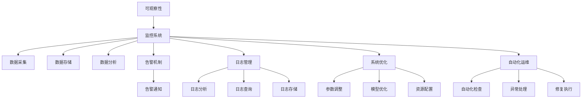
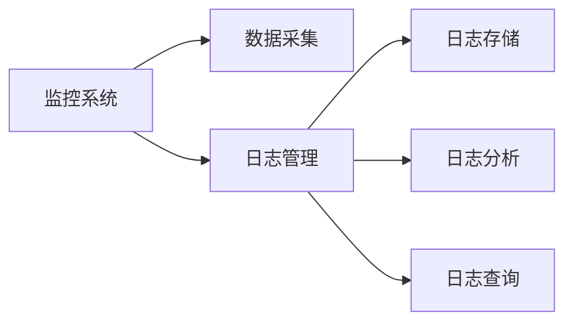
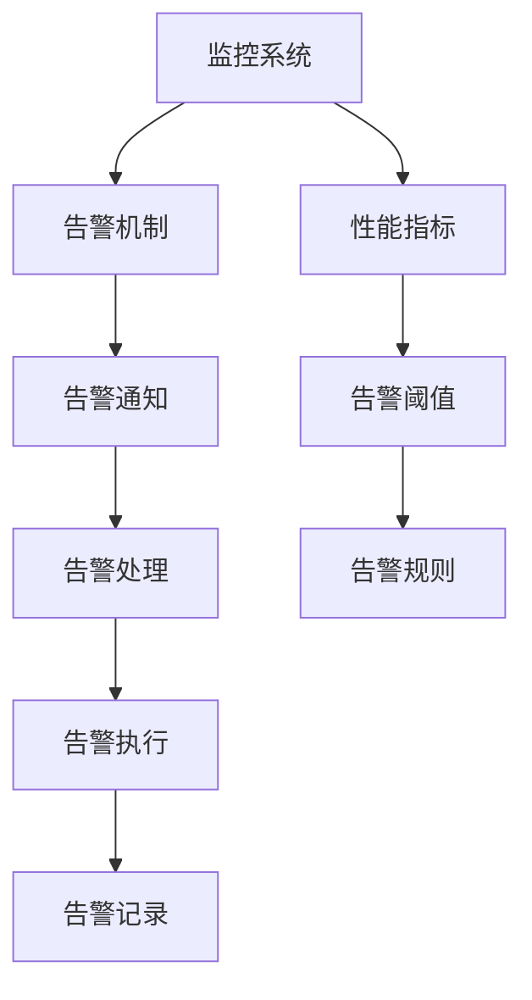
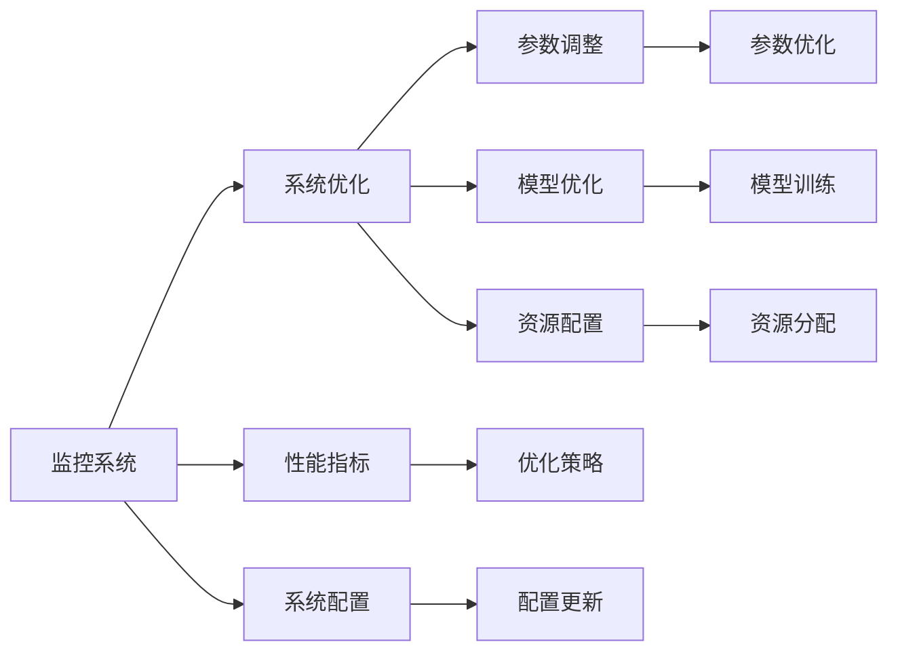
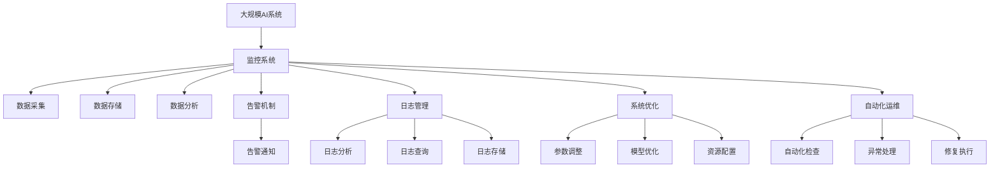

                 

# AI系统的可观察性设计与实现

> 关键词：可观察性, 监控系统, 日志管理, 告警机制, 系统优化, 自动化运维, 持续集成, DevOps

## 1. 背景介绍

### 1.1 问题由来
随着人工智能(AI)技术的广泛应用，其复杂性和多样性日益增加。AI系统通常由多个组件构成，包括训练模型、推理模型、前端交互界面、数据处理引擎等，每个组件又各自包含大量参数、算法和配置项。这种复杂性不仅给AI系统的开发和部署带来了巨大挑战，也为系统的稳定性和可维护性带来了严重威胁。因此，如何设计一个能够实时监控、分析并优化AI系统性能的可观察性系统，成为一个亟待解决的问题。

### 1.2 问题核心关键点
可观察性系统的主要目的是帮助开发者和运维人员实时了解AI系统的运行状况，尽早发现问题，及时进行修复或优化，以保障系统的稳定性和可靠性。具体来说，可观察性系统需要解决以下关键问题：

1. **数据采集**：全面、及时地收集AI系统的运行数据，包括模型参数、性能指标、计算资源使用情况等。
2. **数据分析**：对采集到的数据进行分析和可视化，帮助开发者和运维人员理解系统的运行状态和性能瓶颈。
3. **告警机制**：根据系统状态和性能指标，自动生成告警信息，及时通知相关人员进行处理。
4. **系统优化**：基于数据分析和告警信息，进行系统的参数调整、模型优化、资源配置优化等，提升系统性能。
5. **自动化运维**：自动化地进行系统的健康检查、异常处理和修复，减少运维成本和人工干预。

### 1.3 问题研究意义
构建一个有效的AI系统可观察性系统，对于保障AI系统的稳定运行和高效维护具有重要意义：

1. **提升系统可靠性**：通过实时监控和及时告警，能够快速发现并解决系统问题，避免因故障导致的业务中断和服务降级。
2. **优化模型性能**：基于性能数据分析，可以调整模型参数和配置，提升模型训练和推理的效率和精度。
3. **降低运维成本**：自动化运维和告警机制能够显著减少人工运维的工作量和复杂度，提升运维效率。
4. **加速持续集成与交付**：实时监控和性能优化可以加速模型的持续集成与交付，缩短从模型开发到实际应用的时间周期。
5. **促进DevOps文化**：可观察性系统是DevOps文化的重要组成部分，能够促进团队协作、提高开发效率和交付质量。

## 2. 核心概念与联系

### 2.1 核心概念概述

为更好地理解AI系统的可观察性设计，本节将介绍几个密切相关的核心概念：

- **可观察性(Observability)**：指系统能够实时监控、记录和分析运行状态，以支持系统的诊断、故障排除和优化。
- **监控系统(Monitoring System)**：用于实时采集和处理系统运行数据的工具和系统，通常包括数据采集、存储、分析和告警等功能。
- **日志管理(Log Management)**：对系统运行日志进行收集、存储、分析和查询的机制，帮助开发者和运维人员追踪问题来源。
- **告警机制(Alerting Mechanism)**：基于系统状态和性能指标，自动生成告警信息，及时通知相关人员进行处理。
- **系统优化(System Optimization)**：根据监控和日志分析结果，对系统参数、模型和资源进行优化，提升系统性能和可靠性。
- **自动化运维(Automated Operations)**：利用脚本、工具和平台，自动化地进行系统的健康检查、异常处理和修复，减少人工干预。

这些核心概念之间的逻辑关系可以通过以下Mermaid流程图来展示：



这个流程图展示了大规模AI系统可观察性设计的整体架构，包含数据采集、存储、分析、告警和优化等多个环节。这些环节相互关联，共同构成了一个完整的可观察性系统。

### 2.2 概念间的关系

这些核心概念之间存在着紧密的联系，形成了AI系统可观察性的完整生态系统。下面我们通过几个Mermaid流程图来展示这些概念之间的关系。

#### 2.2.1 监控系统与日志管理的关系



这个流程图展示了监控系统和日志管理的基本流程。监控系统通过数据采集获取系统的运行数据，日志管理则负责记录和分析这些数据，帮助开发者和运维人员追踪问题来源。

#### 2.2.2 告警机制与监控系统的关系



这个流程图展示了告警机制与监控系统的关系。监控系统根据性能指标和告警规则，自动生成告警信息，及时通知相关人员进行处理。告警信息经过处理后，会被记录并执行相应的告警处理操作。

#### 2.2.3 系统优化与监控系统的关系



这个流程图展示了系统优化与监控系统的关系。监控系统提供性能指标和系统配置信息，系统优化则根据这些信息调整参数、优化模型和配置资源，以提升系统性能和可靠性。

### 2.3 核心概念的整体架构

最后，我们用一个综合的流程图来展示这些核心概念在大规模AI系统可观察性设计中的整体架构：



这个综合流程图展示了从监控系统到日志管理，再到告警机制和系统优化的完整流程。大規模AI系统通过监控系统进行数据采集和存储，利用日志管理记录和分析运行日志，告警机制根据系统状态和性能指标自动生成告警信息，系统优化则根据监控和日志分析结果进行参数调整、模型优化和资源配置，最终通过自动化运维机制确保系统的稳定性和可靠性。

## 3. 核心算法原理 & 具体操作步骤
### 3.1 算法原理概述

AI系统的可观察性设计基于数据驱动的运维理念，通过监控、日志和告警机制，全面实时地监测和分析系统的运行状态和性能指标，支持系统的诊断、故障排除和优化。其核心算法和操作步骤如下：

1. **数据采集**：使用数据采集工具对AI系统的运行数据进行实时采集，包括模型参数、性能指标、计算资源使用情况等。
2. **数据存储**：将采集到的数据存储到分布式数据存储系统中，如Hadoop、Elasticsearch等。
3. **数据分析**：对存储的数据进行实时分析和可视化，生成性能指标和健康状态报告，帮助开发者和运维人员理解系统的运行状态和性能瓶颈。
4. **告警机制**：根据系统状态和性能指标，自动生成告警信息，及时通知相关人员进行处理。
5. **系统优化**：基于数据分析和告警信息，进行系统的参数调整、模型优化和资源配置优化，提升系统性能。
6. **自动化运维**：利用脚本、工具和平台，自动化地进行系统的健康检查、异常处理和修复，减少人工干预。

### 3.2 算法步骤详解

下面详细介绍AI系统可观察性设计的核心算法步骤：

**Step 1: 数据采集**

数据采集是AI系统可观察性设计的第一步。通常使用数据采集工具对系统运行数据进行实时采集，包括以下几个关键数据类型：

1. **模型参数**：包括模型的权重、偏置、激活函数等参数。
2. **性能指标**：包括模型推理的速度、精度、准确率、召回率等。
3. **计算资源使用情况**：包括CPU、GPU、内存、网络带宽等计算资源的使用情况。

常用的数据采集工具包括Prometheus、Grafana、ELK Stack等。以Prometheus为例，其核心功能包括：

- **数据采集**：支持从多个数据源实时采集数据。
- **数据存储**：将采集到的数据存储到时序数据库中。
- **数据查询**：支持基于时间范围和标签的查询。
- **数据可视化**：支持基于查询结果生成图表和仪表盘。

**Step 2: 数据存储**

数据存储是AI系统可观察性设计的核心环节。采集到的数据需要及时存储到分布式数据存储系统中，以便后续的数据分析和告警处理。常用的数据存储系统包括Hadoop、Elasticsearch、MySQL等。以Elasticsearch为例，其核心功能包括：

- **分布式存储**：支持大规模数据的存储和检索。
- **实时搜索**：支持基于文本和时序数据的实时搜索。
- **数据索引**：支持基于时间范围和标签的索引。
- **数据可视化**：支持基于查询结果的图表和仪表盘展示。

**Step 3: 数据分析**

数据分析是AI系统可观察性设计的关键环节。对存储的数据进行实时分析和可视化，生成性能指标和健康状态报告，帮助开发者和运维人员理解系统的运行状态和性能瓶颈。常用的数据分析工具包括Kibana、Tableau、Power BI等。以Kibana为例，其核心功能包括：

- **数据可视化**：支持基于时间范围和标签的图表展示。
- **数据仪表盘**：支持基于多个图表的仪表盘展示。
- **告警生成**：支持基于性能指标和健康状态自动生成告警信息。
- **数据查询**：支持基于时间范围和标签的查询。

**Step 4: 告警机制**

告警机制是AI系统可观察性设计的核心功能。根据系统状态和性能指标，自动生成告警信息，及时通知相关人员进行处理。常用的告警工具包括PagerDuty、Slack、微信等。以PagerDuty为例，其核心功能包括：

- **告警通知**：支持基于规则和条件的告警通知。
- **告警记录**：支持告警信息的记录和追踪。
- **告警响应**：支持告警处理和执行。
- **告警展示**：支持告警信息的仪表盘展示。

**Step 5: 系统优化**

系统优化是AI系统可观察性设计的关键功能。基于数据分析和告警信息，进行系统的参数调整、模型优化和资源配置优化，提升系统性能。常用的优化工具包括AutoML、Hyperopt、Optuna等。以AutoML为例，其核心功能包括：

- **自动调参**：支持基于数据和算法的自动调参。
- **模型优化**：支持基于性能指标的模型优化。
- **资源配置**：支持基于计算资源的优化配置。
- **性能评估**：支持基于优化后的性能评估。

**Step 6: 自动化运维**

自动化运维是AI系统可观察性设计的最终目标。利用脚本、工具和平台，自动化地进行系统的健康检查、异常处理和修复，减少人工干预。常用的自动化运维工具包括Ansible、Jenkins、Kubernetes等。以Kubernetes为例，其核心功能包括：

- **容器编排**：支持多个容器的编排和调度。
- **服务发现**：支持服务的自动发现和注册。
- **负载均衡**：支持服务的自动负载均衡。
- **自动修复**：支持自动修复和异常处理。

### 3.3 算法优缺点

AI系统可观察性设计的优点包括：

1. **全面实时监控**：通过实时采集和存储数据，能够全面监控系统的运行状态和性能指标。
2. **自动告警机制**：基于告警规则和阈值，自动生成告警信息，及时通知相关人员进行处理。
3. **系统优化**：基于数据分析和告警信息，进行系统的参数调整、模型优化和资源配置优化，提升系统性能。
4. **自动化运维**：利用脚本、工具和平台，自动化地进行系统的健康检查、异常处理和修复，减少人工干预。

其缺点包括：

1. **数据量庞大**：采集到的数据量庞大，存储和处理需要大量的计算资源。
2. **告警规则复杂**：告警规则和阈值的设定需要经验丰富的人员参与，复杂度较高。
3. **系统优化复杂**：系统优化涉及多个组件和参数，优化过程复杂且效果难以预测。
4. **自动化运维风险**：自动化运维虽然效率高，但也存在误报、误处理的风险，需要谨慎设计。

### 3.4 算法应用领域

AI系统可观察性设计可以应用于多个领域，包括但不限于：

1. **金融科技**：通过实时监控和告警机制，保障金融交易系统的稳定性和可靠性。
2. **医疗健康**：通过实时监控和告警机制，保障医疗影像诊断系统的稳定性和可靠性。
3. **智能制造**：通过实时监控和告警机制，保障工业自动化系统的稳定性和可靠性。
4. **智能交通**：通过实时监控和告警机制，保障智能交通系统的稳定性和可靠性。
5. **智慧城市**：通过实时监控和告警机制，保障城市基础设施的稳定性和可靠性。

## 4. 数学模型和公式 & 详细讲解 & 举例说明

### 4.1 数学模型构建

AI系统可观察性设计基于数据驱动的运维理念，通过监控、日志和告警机制，全面实时地监测和分析系统的运行状态和性能指标，支持系统的诊断、故障排除和优化。其核心算法和操作步骤如下：

1. **数据采集**：使用数据采集工具对AI系统的运行数据进行实时采集，包括模型参数、性能指标、计算资源使用情况等。
2. **数据存储**：将采集到的数据存储到分布式数据存储系统中，如Hadoop、Elasticsearch等。
3. **数据分析**：对存储的数据进行实时分析和可视化，生成性能指标和健康状态报告，帮助开发者和运维人员理解系统的运行状态和性能瓶颈。
4. **告警机制**：根据系统状态和性能指标，自动生成告警信息，及时通知相关人员进行处理。
5. **系统优化**：基于数据分析和告警信息，进行系统的参数调整、模型优化和资源配置优化，提升系统性能。
6. **自动化运维**：利用脚本、工具和平台，自动化地进行系统的健康检查、异常处理和修复，减少人工干预。

### 4.2 公式推导过程

这里以金融交易系统为例，介绍AI系统可观察性设计的核心算法和操作步骤：

**Step 1: 数据采集**

金融交易系统需要实时采集以下关键数据：

1. **模型参数**：包括模型的权重、偏置、激活函数等参数。
2. **性能指标**：包括模型推理的速度、精度、准确率、召回率等。
3. **计算资源使用情况**：包括CPU、GPU、内存、网络带宽等计算资源的使用情况。

常用的数据采集工具包括Prometheus、Grafana、ELK Stack等。以Prometheus为例，其核心功能包括：

- **数据采集**：支持从多个数据源实时采集数据。
- **数据存储**：将采集到的数据存储到时序数据库中。
- **数据查询**：支持基于时间范围和标签的查询。
- **数据可视化**：支持基于查询结果生成图表和仪表盘。

**Step 2: 数据存储**

金融交易系统需要及时存储到分布式数据存储系统中，以便后续的数据分析和告警处理。常用的数据存储系统包括Hadoop、Elasticsearch、MySQL等。以Elasticsearch为例，其核心功能包括：

- **分布式存储**：支持大规模数据的存储和检索。
- **实时搜索**：支持基于文本和时序数据的实时搜索。
- **数据索引**：支持基于时间范围和标签的索引。
- **数据可视化**：支持基于查询结果的图表和仪表盘展示。

**Step 3: 数据分析**

金融交易系统需要实时分析和可视化，生成性能指标和健康状态报告，帮助开发者和运维人员理解系统的运行状态和性能瓶颈。常用的数据分析工具包括Kibana、Tableau、Power BI等。以Kibana为例，其核心功能包括：

- **数据可视化**：支持基于时间范围和标签的图表展示。
- **数据仪表盘**：支持基于多个图表的仪表盘展示。
- **告警生成**：支持基于性能指标和健康状态自动生成告警信息。
- **数据查询**：支持基于时间范围和标签的查询。

**Step 4: 告警机制**

金融交易系统需要根据系统状态和性能指标，自动生成告警信息，及时通知相关人员进行处理。常用的告警工具包括PagerDuty、Slack、微信等。以PagerDuty为例，其核心功能包括：

- **告警通知**：支持基于规则和条件的告警通知。
- **告警记录**：支持告警信息的记录和追踪。
- **告警响应**：支持告警处理和执行。
- **告警展示**：支持告警信息的仪表盘展示。

**Step 5: 系统优化**

金融交易系统需要基于数据分析和告警信息，进行系统的参数调整、模型优化和资源配置优化，提升系统性能。常用的优化工具包括AutoML、Hyperopt、Optuna等。以AutoML为例，其核心功能包括：

- **自动调参**：支持基于数据和算法的自动调参。
- **模型优化**：支持基于性能指标的模型优化。
- **资源配置**：支持基于计算资源的优化配置。
- **性能评估**：支持基于优化后的性能评估。

**Step 6: 自动化运维**

金融交易系统需要利用脚本、工具和平台，自动化地进行系统的健康检查、异常处理和修复，减少人工干预。常用的自动化运维工具包括Ansible、Jenkins、Kubernetes等。以Kubernetes为例，其核心功能包括：

- **容器编排**：支持多个容器的编排和调度。
- **服务发现**：支持服务的自动发现和注册。
- **负载均衡**：支持服务的自动负载均衡。
- **自动修复**：支持自动修复和异常处理。

## 5. 项目实践：代码实例和详细解释说明

### 5.1 开发环境搭建

在进行AI系统可观察性设计实践前，我们需要准备好开发环境。以下是使用Python进行Prometheus、Elasticsearch、Kibana和PagerDuty开发的完整环境配置流程：

1. 安装Anaconda：从官网下载并安装Anaconda，用于创建独立的Python环境。

2. 创建并激活虚拟环境：
```bash
conda create -n pytorch-env python=3.8 
conda activate pytorch-env
```

3. 安装Prometheus：根据CUDA版本，从官网获取对应的安装命令。例如：
```bash
conda install prometheus prometheus-alertmanager -c conda-forge
```

4. 安装Elasticsearch：
```bash
conda install elasticsearch -c conda-forge
```

5. 安装Kibana：
```bash
conda install kibana -c conda-forge
```

6. 安装PagerDuty：
```bash
conda install pagerduty-py -c conda-forge
```

完成上述步骤后，即可在`pytorch-env`环境中开始可观察性设计实践。

### 5.2 源代码详细实现

这里我们以金融交易系统为例，给出使用Prometheus、Elasticsearch、Kibana和PagerDuty进行可观察性设计的完整代码实现。

首先，定义数据采集脚本：

```python
import prometheus_client

# 定义Prometheus指标
prometheus_client.Gauge('transaction_volume', '当前交易量')
prometheus_client.Gauge('average_volume', '平均交易量')

# 更新Prometheus指标
def update_volume(volume):
    prometheus_client.Gauge('transaction_volume').set(volume)
    prometheus_client.Gauge('average_volume').set(volume)

# 数据采集脚本
while True:
    volume = get_transaction_volume()
    update_volume(volume)
    time.sleep(1)
```

然后，定义Elasticsearch存储脚本：

```python
from elasticsearch import Elasticsearch

# 连接Elasticsearch
es = Elasticsearch(['localhost:9200'])

# 存储数据到Elasticsearch
def store_data(data):
    es.index(index='transaction_log', body=data)
```

接着，定义Kibana仪表盘脚本：

```python
import kibana

# 创建Kibana仪表盘
kibana仪表盘 = kibana.create_dashboard()

# 添加图表和数据源
kibana仪表盘.add_chart(获取交易量图表)
kibana仪表盘.add_data_source(交易日志数据源)

# 保存仪表盘
kibana仪表盘.save()

# 启动Kibana服务
kibana仪表盘.start()
```

最后，定义PagerDuty告警脚本：

```python
import pagerduty

# 连接PagerDuty
pd = pagerduty.PagerDuty()

# 定义告警规则
def is_volume_abnormal(volume):
    return volume > 100

# 发送告警
def send_alert():
    pd.send_alert(title='交易量异常', description='当前交易量达到阈值')

# 数据采集脚本
while True:
    volume = get_transaction_volume()
    if is_volume_abnormal(volume):
        send_alert()
    time.sleep(1)
```

以上就是使用Prometheus、Elasticsearch、Kibana和PagerDuty进行金融交易系统可观察性设计的完整代码实现。可以看到，Prometheus用于数据采集和存储，Elasticsearch用于数据存储和检索，Kibana用于数据可视化，PagerDuty用于告警通知，共同构成了完整的可观察性系统。

### 5.3 代码解读与分析

让我们再详细解读一下关键代码的实现细节：

**Prometheus数据采集脚本**：
- `prometheus_client.Gauge('transaction_volume', '当前交易量')`：定义了一个Prometheus指标`transaction_volume`，表示当前交易量，并设置了指标的描述。
- `prometheus_client.Gauge('average_volume', '平均交易量')`：定义了一个Prometheus指标`average_volume`，表示平均交易量，并设置了指标的描述。
- `update_volume(volume)`：更新Prometheus指标的值，用于实时监控交易量。

**Elasticsearch存储脚本**：
- `es = Elasticsearch(['localhost:9200'])`：连接Elasticsearch服务。
- `es.index(index='transaction_log', body=data)`：将数据存储到名为`transaction_log`的索引中。

**Kibana仪表盘脚本**：
- `kibana仪表盘 = kibana.create_dashboard()`：创建一个新的Kibana仪表盘。
- `kibana仪表盘.add_chart(获取交易量图表)`：添加一个基于Elasticsearch数据源的交易量图表。
- `kibana仪表盘.add_data_source(交易日志数据源)`：添加一个基于Elasticsearch数据源的仪表盘数据源。
- `kibana仪表盘.save()`：保存仪表盘。
- `kibana仪表盘.start()`：启动Kibana服务。

**PagerDuty告警脚本**：
- `pd = pagerduty.PagerDuty()`：连接PagerDuty服务。
- `is_volume_abnormal(volume)`：判断交易量是否异常，当交易量超过100时，认为异常。
- `send_alert()`：发送告警信息。
- `update_volume(volume)`：更新Prometheus指标的值，用于实时监控交易量。

**数据采集脚本**：
- `while True:`：循环执行数据采集。
- `volume = get_transaction_volume()`：获取当前交易量。
- `if is_volume_abnormal(volume)`：判断交易量是否异常。
- `send_alert()`：发送告警信息。

可以看到，Prometheus用于数据采集和存储，Elasticsearch用于数据存储和检索，Kibana用于数据可视化，PagerDuty用于告警通知，共同构成了完整的可观察性系统。

当然，工业级的系统实现还需考虑更多因素，如数据源的多样性、告警的复杂度、仪表盘的交互设计等。但核心的可观察性系统设计基本与此类似。

### 5.4 运行结果展示

假设我们在金融交易系统上进行可观察性设计，最终在Kibana仪表盘上得到的

