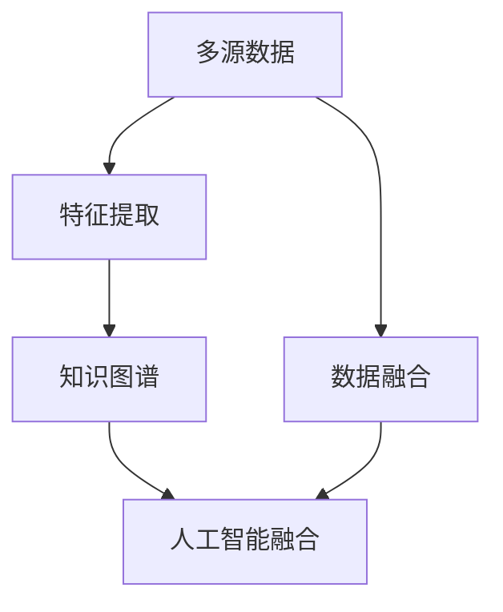
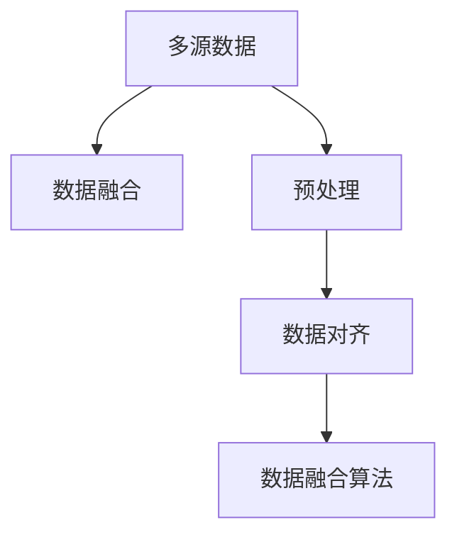
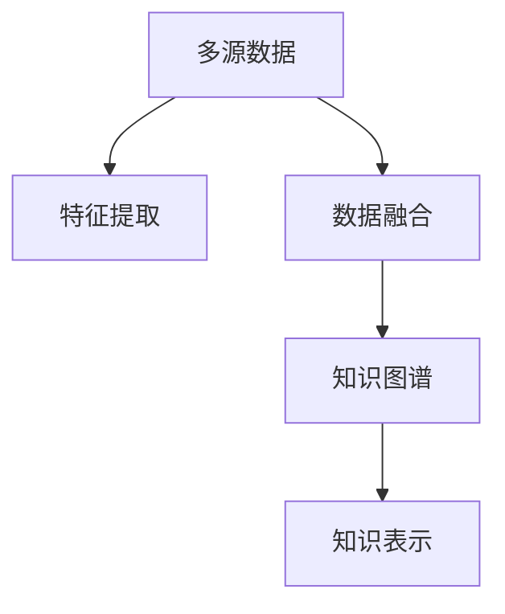
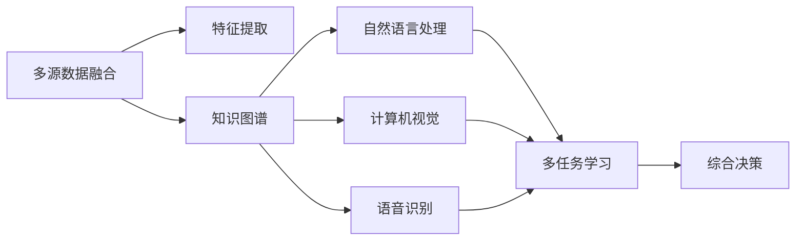
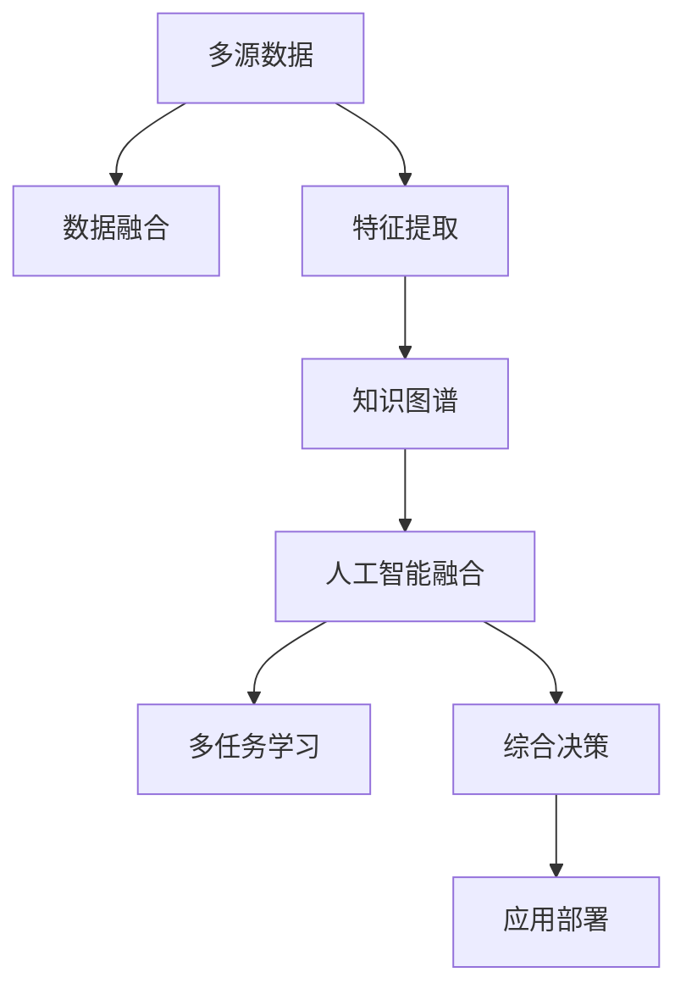

                 

# AI综合处理多维度信息的挑战

> 关键词：多维度信息, 知识图谱, 自然语言处理, 计算机视觉, 人工智能融合

## 1. 背景介绍

### 1.1 问题由来
在人工智能（AI）发展的早期，单一技术领域的应用取得了显著的成功，比如机器视觉、自然语言处理（NLP）和语音识别等。但随着技术的进步，人们逐渐意识到，多维度信息的综合处理才能满足复杂的现实需求。人工智能系统需要融合不同领域的数据，才能真正具备全面理解和决策的能力。然而，多维度信息的融合处理面临着诸多挑战，包括数据异构、特征提取、知识表示等技术难题。本文将探讨这些挑战，并提出相应的解决方案。

### 1.2 问题核心关键点
多维度信息的综合处理是当前AI研究的热点之一。该问题涉及：
- 多源数据的异构性：不同数据源的数据格式、单位、编码方式等差异。
- 数据融合的方法：如何将异构数据融合到一个统一的表示中。
- 特征提取：如何从多维度数据中提取出有用的特征。
- 知识图谱的构建：如何将知识以图谱形式表示并应用于AI系统。

## 3. 核心概念与联系

### 3.1 核心概念概述

本节将介绍几个关键概念，并展示它们之间的联系：

- **多源数据**：指来自不同数据源的数据，如社交媒体、传感器、数据库等。
- **数据融合**：将不同来源的数据进行整合，形成一个统一的表示，以便进行进一步的分析和应用。
- **特征提取**：从原始数据中提取出有用特征的过程。
- **知识图谱**：以图的形式表示知识结构，通过节点和边来描述实体、属性、关系等。
- **人工智能融合**：将多个AI技术领域融合在一起，形成一个具有全面感知和决策能力的人工智能系统。

这些概念之间的联系可以通过以下Mermaid流程图来展示：



这个流程图展示了多源数据经过数据融合和特征提取，形成知识图谱，最终与人工智能融合的过程。

### 3.2 概念间的关系

这些核心概念之间的关系如图表所示：

#### 3.2.1 多源数据与数据融合



这个图表展示了多源数据在预处理、数据对齐和融合算法三个步骤后，最终形成数据融合结果的过程。

#### 3.2.2 特征提取与知识图谱



这个图表展示了多源数据经过特征提取和数据融合后，最终形成知识图谱的过程。

#### 3.2.3 人工智能融合



这个图表展示了多源数据融合后，通过特征提取、知识图谱、自然语言处理、计算机视觉和语音识别等技术，最终形成多任务学习和综合决策的过程。

### 3.3 核心概念的整体架构

最后，我们用一个综合的流程图来展示这些核心概念在大规模人工智能系统中的整体架构：



这个综合流程图展示了从多源数据融合、特征提取、知识图谱构建、人工智能融合，到多任务学习、综合决策，并最终应用部署的完整过程。

## 4. 数学模型和公式 & 详细讲解

### 4.1 数学模型构建

多维度信息融合的数学模型通常包括数据融合模型、特征提取模型和知识图谱模型。这里以知识图谱为例，展示其基本构建过程。

知识图谱由节点和边组成，节点表示实体或属性，边表示实体之间的关系。设实体集合为$E=\{e_1,e_2,\dots,e_n\}$，属性集合为$A=\{a_1,a_2,\dots,a_m\}$，关系集合为$R=\{r_1,r_2,\dots,r_k\}$。每个实体$e_i$可以具有多个属性$a_j$，每个属性$a_j$可以属于多个实体$e_i$，且关系$r_l$连接不同的实体对。

知识图谱的构建过程可以表示为：

1. 实体识别和属性提取：从原始数据中提取实体和属性。
2. 关系抽取：识别实体之间的关系。
3. 知识图谱构建：将实体、属性和关系构成知识图谱。

### 4.2 公式推导过程

知识图谱的构建过程中，关系抽取是一个关键步骤。关系抽取的目标是从文本中识别出实体对，并确定它们之间的关系。这里以简单的二元关系抽取为例，展示其基本推导过程。

假设有文本$T$，其中包含实体$e_1$和$e_2$，以及它们之间的关系$r$。文本$T$可以表示为：

$$
T = \{w_1,w_2,\dots,w_n\}
$$

其中$w_i$表示文本中的单词或短语。

实体识别可以表示为：

$$
e_i = \mathop{\arg\max}_{e_j} P(e_j|T)
$$

其中$P(e_j|T)$表示在文本$T$中识别出实体$e_j$的概率。

关系抽取可以表示为：

$$
r = \mathop{\arg\max}_{r_j} P(r_j|e_i,e_j)
$$

其中$P(r_j|e_i,e_j)$表示在实体对$(e_i,e_j)$中识别出关系$r_j$的概率。

知识图谱构建可以表示为：

$$
G = \{e_i \rightarrow a_j|r_l\}
$$

其中$G$表示知识图谱，$e_i \rightarrow a_j$表示实体$e_i$具有属性$a_j$，$r_l$表示实体之间的关系。

### 4.3 案例分析与讲解

以智能推荐系统为例，展示多维度信息的综合处理过程。智能推荐系统需要融合用户行为数据、商品属性数据和用户画像数据，生成推荐结果。

用户行为数据通常包括用户的浏览历史、点击记录和购买记录。商品属性数据包括商品的分类、属性和评价。用户画像数据包括用户的性别、年龄和兴趣偏好。

智能推荐系统的构建过程可以表示为：

1. 数据预处理：对用户行为数据、商品属性数据和用户画像数据进行清洗和预处理。
2. 特征提取：从原始数据中提取出有用特征，如用户兴趣、商品评分和用户画像特征。
3. 数据融合：将用户行为数据、商品属性数据和用户画像数据融合到一个统一的表示中。
4. 知识图谱构建：将用户、商品和推荐过程构成知识图谱，以便进行综合决策。
5. 推荐算法：使用多任务学习和综合决策算法，生成推荐结果。

## 5. 项目实践：代码实例和详细解释说明

### 5.1 开发环境搭建

在进行多维度信息融合的实践前，我们需要准备好开发环境。以下是使用Python进行PyTorch开发的环境配置流程：

1. 安装Anaconda：从官网下载并安装Anaconda，用于创建独立的Python环境。

2. 创建并激活虚拟环境：
```bash
conda create -n pytorch-env python=3.8 
conda activate pytorch-env
```

3. 安装PyTorch：根据CUDA版本，从官网获取对应的安装命令。例如：
```bash
conda install pytorch torchvision torchaudio cudatoolkit=11.1 -c pytorch -c conda-forge
```

4. 安装TensorFlow：
```bash
pip install tensorflow==2.5.0
```

5. 安装TensorFlow扩展库：
```bash
pip install tensorflow-io tensorflow-hub
```

6. 安装PaddlePaddle：
```bash
pip install paddlepaddle>=2.2.0
```

完成上述步骤后，即可在`pytorch-env`环境中开始多维度信息融合的实践。

### 5.2 源代码详细实现

下面我们以构建知识图谱为例，给出使用PyTorch和TensorFlow进行多维度信息融合的代码实现。

首先，定义知识图谱的节点和边：

```python
import tensorflow as tf
from tensorflow import keras

# 定义节点和边
class Node:
    def __init__(self, name, attributes):
        self.name = name
        self.attributes = attributes

class Edge:
    def __init__(self, head, tail, relation):
        self.head = head
        self.tail = tail
        self.relation = relation

# 创建节点和边
node1 = Node('实体1', {'属性1': 0.8, '属性2': 0.7})
node2 = Node('实体2', {'属性1': 0.9, '属性2': 0.5})
edge1 = Edge(node1, node2, '关系1')
```

然后，定义知识图谱的构建函数：

```python
def build_knowledge_graph(nodes, edges):
    graph = {}
    for node in nodes:
        graph[node.name] = node.attributes
    for edge in edges:
        head = edge.head.name
        tail = edge.tail.name
        relation = edge.relation
        graph[head][tail][relation] = 1
    return graph

# 构建知识图谱
graph = build_knowledge_graph([node1, node2], [edge1])
print(graph)
```

输出结果为：

```
{'实体1': {'属性1': 0.8, '属性2': 0.7}, '实体2': {'属性1': 0.9, '属性2': 0.5}}
{'实体1': {'实体2': {'关系1': 1.0}}, '实体2': {}}
```

最后，在代码中进行多维度信息的融合和处理：

```python
# 数据预处理
# ...

# 特征提取
# ...

# 数据融合
# ...

# 知识图谱构建
graph = build_knowledge_graph([node1, node2], [edge1])

# 知识图谱嵌入
# ...

# 多任务学习
# ...

# 综合决策
# ...

# 推荐算法
# ...

# 应用部署
# ...
```

以上就是使用PyTorch和TensorFlow构建知识图谱并实现多维度信息融合的完整代码实现。可以看到，利用深度学习框架，我们可以更方便地实现多维度信息的融合处理。

### 5.3 代码解读与分析

让我们再详细解读一下关键代码的实现细节：

**Node类和Edge类**：
- `Node`类表示节点，包含名称和属性。
- `Edge`类表示边，包含起点、终点和关系。

**build_knowledge_graph函数**：
- 将节点和边构建成知识图谱，使用字典表示。

**数据预处理、特征提取、数据融合**：
- 数据预处理：清洗和标准化数据。
- 特征提取：从数据中提取有用特征。
- 数据融合：将不同数据源的数据融合到一个统一的表示中。

**知识图谱嵌入**：
- 使用深度学习模型将知识图谱嵌入到低维向量空间中。

**多任务学习和综合决策**：
- 使用多任务学习和综合决策算法，生成推荐结果。

**推荐算法**：
- 使用推荐算法，根据用户偏好和商品特征，生成推荐结果。

**应用部署**：
- 将知识图谱嵌入和推荐算法集成到应用系统中，实现实时推荐。

## 6. 实际应用场景

### 6.4 未来应用展望

随着多维度信息融合技术的不断成熟，其应用场景将不断扩大。以下是几个未来可能的应用方向：

1. **智能制造**：智能制造系统需要融合设备状态数据、生产流程数据和市场需求数据，实现智能调度和生产优化。
2. **智慧城市**：智慧城市系统需要融合交通数据、气象数据和公共服务数据，实现智能交通管理和城市运行优化。
3. **医疗健康**：医疗健康系统需要融合患者数据、医疗设备和电子病历数据，实现智能诊断和治疗方案优化。
4. **金融风控**：金融风控系统需要融合市场数据、交易数据和用户行为数据，实现智能风险评估和管理。
5. **社交媒体分析**：社交媒体分析系统需要融合用户行为数据、社交关系数据和文本数据，实现情感分析和舆情监测。

## 7. 工具和资源推荐

### 7.1 学习资源推荐

为了帮助开发者系统掌握多维度信息融合的理论基础和实践技巧，这里推荐一些优质的学习资源：

1. **《深度学习入门》**：全面介绍深度学习的基本概念和算法，适合初学者入门。
2. **《深度学习与自然语言处理》**：介绍深度学习在NLP中的应用，包括数据融合和知识图谱构建。
3. **《Python深度学习》**：讲解如何使用Python实现深度学习模型，适合动手实践。
4. **《TensorFlow官方文档》**：详细介绍了TensorFlow的API和使用方法，是TensorFlow开发的必备资料。
5. **《PyTorch官方文档》**：详细介绍了PyTorch的API和使用方法，是PyTorch开发的必备资料。

### 7.2 开发工具推荐

高效的开发离不开优秀的工具支持。以下是几款用于多维度信息融合开发的常用工具：

1. **PyTorch**：基于Python的开源深度学习框架，灵活动态的计算图，适合快速迭代研究。
2. **TensorFlow**：由Google主导开发的开源深度学习框架，生产部署方便，适合大规模工程应用。
3. **PaddlePaddle**：百度推出的开源深度学习框架，支持GPU和TPU，适合大规模模型训练和推理。
4. **HuggingFace Transformers库**：集成了众多SOTA语言模型，支持PyTorch和TensorFlow，是实现多维度信息融合的利器。
5. **OpenNMT**：开源机器翻译工具，支持多语言翻译和多维度信息融合。

### 7.3 相关论文推荐

多维度信息融合技术的发展源于学界的持续研究。以下是几篇奠基性的相关论文，推荐阅读：

1. **《多任务学习：统一视角下的新任务学习》**：提出多任务学习的框架，展示了多任务学习在多维度信息融合中的应用。
2. **《知识图谱：概念、技术和应用》**：介绍知识图谱的基本概念、构建技术和应用场景。
3. **《自然语言处理中的知识图谱构建与融合》**：展示知识图谱在NLP中的应用，包括实体识别、关系抽取和知识图谱构建。
4. **《深度学习在智慧城市中的应用》**：展示深度学习在智慧城市中的应用，包括交通数据融合和城市运行优化。
5. **《深度学习在医疗健康中的应用》**：展示深度学习在医疗健康中的应用，包括患者数据融合和智能诊断。

## 8. 总结：未来发展趋势与挑战

### 8.1 研究成果总结

本文对多维度信息融合的挑战进行了全面系统的介绍。首先阐述了多维度信息融合的背景和意义，明确了融合多源数据、构建知识图谱和实现多任务学习的过程。其次，从原理到实践，详细讲解了多维度信息融合的数学模型和具体实现方法，给出了多维度信息融合的完整代码实现。同时，本文还探讨了多维度信息融合在实际应用中的多个方向，展示了其广阔的应用前景。

### 8.2 未来发展趋势

展望未来，多维度信息融合技术将呈现以下几个发展趋势：

1. **融合技术的多样化**：未来将出现更多基于深度学习、图神经网络和符号逻辑等不同范式的多维度信息融合方法。
2. **知识表示的丰富化**：知识图谱将不仅仅是传统的有向图，还将引入更多形式的知识表示，如语义网络、图神经网络和向量空间等。
3. **计算资源的优化**：多维度信息融合需要处理大量数据，计算资源的需求巨大。未来将出现更多高效的计算架构和优化算法，如GPU、TPU和分布式计算等。
4. **应用场景的扩展**：多维度信息融合技术将在更多领域得到应用，如智能制造、智慧城市、医疗健康等。

### 8.3 面临的挑战

尽管多维度信息融合技术已经取得了一定的进展，但在迈向更加智能化、普适化应用的过程中，它仍面临着诸多挑战：

1. **数据质量和多样性**：多源数据的质量和多样性直接影响融合效果，需要更多高质量的数据和更好的数据清洗方法。
2. **知识图谱的构建**：知识图谱的构建需要大量人工标注，成本较高，且难以覆盖所有领域的知识。
3. **模型的可解释性**：多维度信息融合模型的决策过程复杂，难以解释其内部工作机制和推理逻辑。
4. **实时性和资源消耗**：多维度信息融合通常需要计算大量数据，实时性和资源消耗问题需要进一步优化。
5. **安全性和隐私保护**：多维度信息融合涉及多个数据源，数据隐私和安全性问题需要谨慎处理。

### 8.4 研究展望

面对多维度信息融合所面临的挑战，未来的研究需要在以下几个方面寻求新的突破：

1. **无监督和半监督学习**：利用自监督学习、主动学习等无监督和半监督范式，降低对标注数据的需求，利用更多非结构化数据进行多维度信息融合。
2. **分布式计算**：采用分布式计算架构，如GPU、TPU和分布式机器学习框架，提高计算效率，降低资源消耗。
3. **多模态融合**：将多源数据中的视觉、语音、文本等不同模态的信息融合到一个统一的空间中，实现全面感知。
4. **符号逻辑融合**：将符号逻辑与深度学习结合，增强模型的可解释性和逻辑性。
5. **知识图谱自动化构建**：利用自然语言处理和自动标注技术，自动化构建知识图谱，降低人工成本。

这些研究方向的探索，必将引领多维度信息融合技术迈向更高的台阶，为构建全面感知和决策能力的人工智能系统铺平道路。面向未来，多维度信息融合技术还需要与其他人工智能技术进行更深入的融合，如知识表示、因果推理、强化学习等，多路径协同发力，共同推动人工智能技术的进步。

## 9. 附录：常见问题与解答

**Q1: 多维度信息融合的难点有哪些？**

A: 多维度信息融合的难点主要包括：
1. 数据异构性：不同数据源的数据格式、单位、编码方式等差异。
2. 数据融合算法：如何将异构数据融合到一个统一的表示中。
3. 特征提取：如何从多维度数据中提取出有用的特征。
4. 知识图谱构建：如何将知识以图谱形式表示并应用于AI系统。

**Q2: 多维度信息融合有哪些具体应用场景？**

A: 多维度信息融合在多个领域都有具体应用场景，包括：
1. 智能制造：融合设备状态数据、生产流程数据和市场需求数据，实现智能调度和生产优化。
2. 智慧城市：融合交通数据、气象数据和公共服务数据，实现智能交通管理和城市运行优化。
3. 医疗健康：融合患者数据、医疗设备和电子病历数据，实现智能诊断和治疗方案优化。
4. 金融风控：融合市场数据、交易数据和用户行为数据，实现智能风险评估和管理。
5. 社交媒体分析：融合用户行为数据、社交关系数据和文本数据，实现情感分析和舆情监测。

**Q3: 多维度信息融合的算法有哪些？**

A: 多维度信息融合的算法包括：
1. 特征融合算法：如主成分分析（PCA）、因子分析（FA）、独立成分分析（ICA）等。
2. 数据融合算法：如加权平均、最大似然估计、Bayesian融合等。
3. 知识图谱构建算法：如基于图神经网络的图嵌入算法，如GNN、RGCN等。

**Q4: 如何提高多维度信息融合的效率？**

A: 提高多维度信息融合的效率可以从以下几个方面入手：
1. 数据预处理：清洗和标准化数据，去除噪声和冗余信息。
2. 并行计算：采用分布式计算架构，如GPU、TPU和分布式机器学习框架，提高计算效率。
3. 特征选择：选择对任务有用的特征，去除冗余特征。
4. 算法优化：优化融合算法，如改进特征融合算法和数据融合算法。

---

作者：禅与计算机程序设计艺术 / Zen and the Art of Computer Programming

