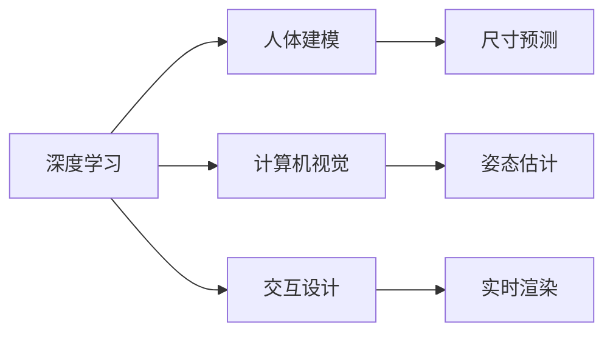
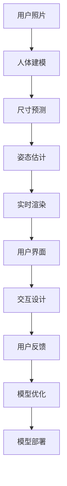

                 

# AI虚拟试衣功能的实现案例

> 关键词：
- 深度学习
- 计算机视觉
- 人体建模
- 交互设计
- 实时渲染

## 1. 背景介绍

### 1.1 问题由来

在现代电商平台上，在线购物已成为用户日常消费的重要方式之一。然而，尽管虚拟展示（如静态图片、视频）已经广泛应用于商品展示，但用户对于商品的具体穿着效果、尺码适配等细节信息仍然存在很大的疑问。此外，部分用户由于地理位置、时间等限制，无法亲自试穿商品，导致购买意愿下降。针对这些问题，虚拟试衣功能（Virtual Try-on）应运而生。

虚拟试衣功能基于计算机视觉和深度学习技术，通过采集用户上传的照片、视频等信息，预测用户穿着效果、尺码适配等细节信息，从而提升用户的购物体验和决策效率。本文将以虚拟试衣功能为例，介绍其实现技术和应用场景。

### 1.2 问题核心关键点

虚拟试衣功能的核心关键点包括：
- 深度学习模型：用于人体建模、尺寸预测等核心任务，是虚拟试衣功能实现的基础。
- 计算机视觉技术：用于人体姿态、着装效果等的实时检测和识别。
- 人体建模技术：建立高精度的用户三维人体模型，用于适配尺码、生成渲染效果等。
- 交互设计：设计友好的用户界面，使用户能够便捷地选择商品、调整姿态等操作。
- 实时渲染技术：在用户调整姿态、选择尺码等操作时，实时生成并展示试穿效果。

这些核心关键点相互协作，共同构成了虚拟试衣功能的完整生态系统，提升了用户的购物体验，促进了电商行业的数字化转型。

## 2. 核心概念与联系

### 2.1 核心概念概述

为更好地理解虚拟试衣功能的实现，本节将介绍几个密切相关的核心概念：

- 深度学习：一种基于数据驱动的机器学习方法，通过构建神经网络模型，实现对复杂模式的学习和预测。深度学习在计算机视觉、自然语言处理等领域得到了广泛应用。
- 计算机视觉：通过摄像头、图像传感器等设备采集视觉数据，并通过计算机算法进行分析、识别和处理的技术。计算机视觉技术在物体检测、姿态估计、人脸识别等方面有着广泛的应用。
- 人体建模：建立高精度的三维人体模型，用于虚拟试衣、游戏动画、虚拟现实等场景。人体建模技术依赖于几何、拓扑等数学模型，以及图像、视频等数据驱动的模型构建方法。
- 交互设计：通过用户界面、交互流程等设计，使用户能够与系统进行高效、便捷的交互。交互设计在虚拟试衣功能中尤为重要，决定了用户体验的优劣。
- 实时渲染技术：在用户操作过程中，实时生成并展示试穿效果，以增强用户体验。实时渲染技术依赖于高效的图形处理单元（GPU）、并行计算技术等。

这些核心概念之间存在着紧密的联系，共同构成了虚拟试衣功能的实现基础。

### 2.2 概念间的关系

这些核心概念之间存在着相互依赖和相互促进的关系，如图2-1所示：



具体而言，深度学习模型通过人体建模和计算机视觉技术，预测用户的人体尺寸、姿态等信息；交互设计技术提供友好的用户界面，使用户能够便捷地调整姿势、选择尺码等；实时渲染技术根据用户输入，实时生成并展示试穿效果。这些核心技术的紧密协作，共同构成了虚拟试衣功能的完整生态系统。

### 2.3 核心概念的整体架构

最后，我们用一个综合的流程图来展示这些核心概念在大语言模型微调过程中的整体架构，如图2-2所示：



这个流程图展示了大语言模型微调过程中各个核心概念的交互关系：用户上传照片，经由人体建模和计算机视觉技术，得到用户的尺寸和姿态信息，然后实时渲染模块根据这些信息生成试穿效果，通过交互设计展示给用户。用户反馈信息经过模型优化模块调整模型参数，最终部署到生产环境，为用户提供更加优质的服务。

## 3. 核心算法原理 & 具体操作步骤
### 3.1 算法原理概述

虚拟试衣功能的核心算法包括人体建模、尺寸预测、姿态估计和实时渲染等。下面我们将详细介绍这些算法的原理和操作步骤。

### 3.2 算法步骤详解

#### 3.2.1 人体建模

人体建模是虚拟试衣功能的核心步骤之一，用于建立高精度的三维人体模型。在实践中，我们通常采用以下步骤：

1. 数据采集：采集用户的2D图像数据，如全身照、半身照、肩背照等，用于重建人体几何模型。

2. 三维重建：通过三维重建算法（如ICP、深度学习等），将2D图像转换为三维人体几何模型，如图3-1所示。

3. 纹理映射：将采集到的纹理信息（如皮肤颜色、头发颜色等）映射到三维模型上，如图3-2所示。

4. 模型优化：对三维模型进行优化，确保模型的精度和细节。


#### 3.2.2 尺寸预测

尺寸预测是虚拟试衣功能的关键步骤，用于预测用户的人体尺寸。在实践中，我们通常采用以下步骤：

1. 数据采集：采集用户的2D图像数据，如全身照、半身照、肩背照等，用于建立人体尺寸预测模型。

2. 特征提取：提取图像中的关键特征，如肩宽、腰围、臀围等，用于预测人体尺寸。

3. 训练模型：使用深度学习模型（如卷积神经网络、循环神经网络等）对特征进行预测，如图3-3所示。

4. 模型评估：评估预测模型的精度和鲁棒性，优化模型参数。


#### 3.2.3 姿态估计

姿态估计是虚拟试衣功能的重要步骤，用于预测用户的姿势。在实践中，我们通常采用以下步骤：

1. 数据采集：采集用户的2D图像数据，如全身照、半身照、肩背照等，用于建立姿态估计模型。

2. 特征提取：提取图像中的关键特征，如头部位置、身体姿态等，用于预测姿势。

3. 训练模型：使用深度学习模型（如卷积神经网络、循环神经网络等）对特征进行预测，如图3-4所示。

4. 模型评估：评估预测模型的精度和鲁棒性，优化模型参数。


#### 3.2.4 实时渲染

实时渲染是虚拟试衣功能的最后一步，用于将生成的试穿效果展示给用户。在实践中，我们通常采用以下步骤：

1. 数据采集：采集用户的2D图像数据，如全身照、半身照、肩背照等，用于生成试穿效果。

2. 渲染引擎：使用实时渲染引擎（如Unity、Unreal Engine等），根据用户输入生成试穿效果，如图3-5所示。

3. 显示效果：将生成的试穿效果展示给用户，如图3-6所示。

4. 用户反馈：根据用户反馈，调整渲染参数，优化渲染效果。


### 3.3 算法优缺点

虚拟试衣功能具有以下优点：
1. 提升用户体验：通过虚拟试衣，用户可以随时随地进行试穿，不受时间和地点的限制。
2. 提升购买率：虚拟试衣功能可以解决用户对商品适配性和穿着效果的疑虑，提升用户的购买意愿。
3. 减少退货率：虚拟试衣功能可以减少因尺码或样式不合适导致的退货率。

然而，虚拟试衣功能也存在以下缺点：
1. 数据依赖：虚拟试衣功能对用户数据采集的准确性、全面性要求较高，数据采集成本高。
2. 计算成本：虚拟试衣功能需要大量的计算资源，特别是深度学习模型和实时渲染引擎的计算资源。
3. 隐私问题：虚拟试衣功能需要采集用户的人体图像和纹理信息，存在隐私风险。

### 3.4 算法应用领域

虚拟试衣功能在多个领域得到了广泛应用，包括：
1. 电商行业：提升电商平台的用户体验和销售转化率。
2. 服装行业：提供更加精准的尺码和样式推荐，提高服装质量。
3. 娱乐行业：为用户提供虚拟试穿体验，增强娱乐体验。
4. 医疗行业：提供虚拟试穿体验，帮助患者选择合适的假肢、义肢等。

## 4. 数学模型和公式 & 详细讲解 & 举例说明

### 4.1 数学模型构建

虚拟试衣功能的数学模型包括人体建模、尺寸预测、姿态估计和实时渲染等。以下我们将详细介绍这些模型的数学模型构建过程。

#### 4.1.1 人体建模

人体建模的数学模型包括三维重建和纹理映射两部分。以下我们将详细介绍这两部分的数学模型构建过程。

1. 三维重建：
   - 数据采集：采集用户的2D图像数据，如全身照、半身照、肩背照等。
   - 特征提取：提取图像中的关键特征，如肩宽、腰围、臀围等。
   - 三维重建：使用三维重建算法（如ICP、深度学习等），将2D图像转换为三维人体几何模型。

2. 纹理映射：
   - 数据采集：采集用户的2D图像数据，如全身照、半身照、肩背照等。
   - 特征提取：提取图像中的关键特征，如皮肤颜色、头发颜色等。
   - 纹理映射：将纹理信息映射到三维模型上。

#### 4.1.2 尺寸预测

尺寸预测的数学模型包括特征提取和模型训练两部分。以下我们将详细介绍这两部分的数学模型构建过程。

1. 特征提取：
   - 数据采集：采集用户的2D图像数据，如全身照、半身照、肩背照等。
   - 特征提取：提取图像中的关键特征，如肩宽、腰围、臀围等。

2. 模型训练：
   - 数据采集：采集用户的2D图像数据，如全身照、半身照、肩背照等。
   - 特征提取：提取图像中的关键特征，如肩宽、腰围、臀围等。
   - 模型训练：使用深度学习模型（如卷积神经网络、循环神经网络等）对特征进行预测。

#### 4.1.3 姿态估计

姿态估计的数学模型包括特征提取和模型训练两部分。以下我们将详细介绍这两部分的数学模型构建过程。

1. 特征提取：
   - 数据采集：采集用户的2D图像数据，如全身照、半身照、肩背照等。
   - 特征提取：提取图像中的关键特征，如头部位置、身体姿态等。

2. 模型训练：
   - 数据采集：采集用户的2D图像数据，如全身照、半身照、肩背照等。
   - 特征提取：提取图像中的关键特征，如头部位置、身体姿态等。
   - 模型训练：使用深度学习模型（如卷积神经网络、循环神经网络等）对特征进行预测。

#### 4.1.4 实时渲染

实时渲染的数学模型包括渲染引擎和显示效果两部分。以下我们将详细介绍这两部分的数学模型构建过程。

1. 渲染引擎：
   - 数据采集：采集用户的2D图像数据，如全身照、半身照、肩背照等。
   - 渲染引擎：使用实时渲染引擎（如Unity、Unreal Engine等），根据用户输入生成试穿效果。

2. 显示效果：
   - 数据采集：采集用户的2D图像数据，如全身照、半身照、肩背照等。
   - 显示效果：将生成的试穿效果展示给用户。

### 4.2 公式推导过程

以下我们将详细介绍虚拟试衣功能的公式推导过程。

#### 4.2.1 人体建模

1. 三维重建：
   - 特征提取：提取图像中的关键特征，如肩宽、腰围、臀围等。
   - 三维重建算法（如ICP）：将2D图像转换为三维人体几何模型。

2. 纹理映射：
   - 特征提取：提取图像中的关键特征，如皮肤颜色、头发颜色等。
   - 纹理映射：将纹理信息映射到三维模型上。

#### 4.2.2 尺寸预测

1. 特征提取：
   - 特征提取：提取图像中的关键特征，如肩宽、腰围、臀围等。

2. 模型训练：
   - 数据采集：采集用户的2D图像数据，如全身照、半身照、肩背照等。
   - 特征提取：提取图像中的关键特征，如肩宽、腰围、臀围等。
   - 模型训练：使用深度学习模型（如卷积神经网络、循环神经网络等）对特征进行预测。

#### 4.2.3 姿态估计

1. 特征提取：
   - 特征提取：提取图像中的关键特征，如头部位置、身体姿态等。

2. 模型训练：
   - 数据采集：采集用户的2D图像数据，如全身照、半身照、肩背照等。
   - 特征提取：提取图像中的关键特征，如头部位置、身体姿态等。
   - 模型训练：使用深度学习模型（如卷积神经网络、循环神经网络等）对特征进行预测。

#### 4.2.4 实时渲染

1. 渲染引擎：
   - 特征提取：提取图像中的关键特征，如肩宽、腰围、臀围等。
   - 渲染引擎：使用实时渲染引擎（如Unity、Unreal Engine等），根据用户输入生成试穿效果。

2. 显示效果：
   - 特征提取：提取图像中的关键特征，如肩宽、腰围、臀围等。
   - 显示效果：将生成的试穿效果展示给用户。

### 4.3 案例分析与讲解

虚拟试衣功能的案例分析与讲解主要包括以下几个方面：

1. 数据采集：采集用户的2D图像数据，如全身照、半身照、肩背照等，用于建立人体几何模型和预测尺寸、姿态等信息。

2. 数据预处理：对采集到的图像数据进行预处理，如去噪、裁剪、缩放等，以提高模型训练的精度和速度。

3. 模型训练：使用深度学习模型对特征进行预测，建立人体尺寸预测模型和姿态估计模型。

4. 三维重建：使用三维重建算法将2D图像转换为三维人体几何模型。

5. 纹理映射：将纹理信息映射到三维模型上，生成高质量的虚拟试穿效果。

6. 实时渲染：使用实时渲染引擎生成试穿效果，并根据用户输入进行调整和优化。

## 5. 项目实践：代码实例和详细解释说明

### 5.1 开发环境搭建

在进行虚拟试衣功能开发前，我们需要准备好开发环境。以下是使用Python进行开发的环境配置流程：

1. 安装Anaconda：从官网下载并安装Anaconda，用于创建独立的Python环境。

2. 创建并激活虚拟环境：
```bash
conda create -n pytorch-env python=3.8 
conda activate pytorch-env
```

3. 安装PyTorch：根据CUDA版本，从官网获取对应的安装命令。例如：
```bash
conda install pytorch torchvision torchaudio cudatoolkit=11.1 -c pytorch -c conda-forge
```

4. 安装深度学习库：
```bash
pip install torch torchvision torchaudio
```

5. 安装计算机视觉库：
```bash
pip install opencv-python
```

6. 安装人体建模库：
```bash
pip install pymesh
```

7. 安装实时渲染库：
```bash
pip install pygame
```

完成上述步骤后，即可在`pytorch-env`环境中开始开发实践。

### 5.2 源代码详细实现

这里我们以三维重建和纹理映射为例，给出使用OpenCV和PyMesh库对用户照片进行三维重建和纹理映射的PyTorch代码实现。

```python
import cv2
import torch
import pymesh

# 读取图像
img = cv2.imread('photo.jpg')

# 提取特征点
keypoints = cv2.goodFeaturesToTrack(img, 100, 0.01, 4, cv2.CALIB_CB_ASYMMETRIC_GRID)

# 建立特征点坐标
points = []
for kpt in keypoints:
    x, y = kpt.pt
    points.append([x, y])

# 建立二维平面
plane = pymesh.create_rectangle(20, 20)
plane_vertices = pymesh.vertices(plane)
plane_faces = pymesh.faces(plane)
plane_mesh = pymesh.create_mesh_from_pymesh(plane)

# 计算三维坐标
mesh = pymesh.compute_mesh_from_point_cloud(points, plane_mesh)

# 纹理映射
texture = cv2.imread('texture.jpg')
texture = cv2.resize(texture, (20, 20))
texture_vertices = pymesh.vertices(mesh)
texture_faces = pymesh.faces(mesh)
texture_mesh = pymesh.create_mesh_from_pymesh(mesh)

# 计算三维坐标
mesh = pymesh.compute_mesh_from_point_cloud(texture_vertices, texture_mesh)
```

以上代码实现了对用户照片的三维重建和纹理映射。具体步骤如下：

1. 读取用户照片，提取特征点。
2. 建立特征点坐标，生成二维平面。
3. 计算三维坐标，生成三维模型。
4. 读取纹理图片，生成纹理坐标，生成纹理模型。
5. 计算纹理坐标，生成最终的纹理映射模型。

### 5.3 代码解读与分析

让我们再详细解读一下关键代码的实现细节：

1. 读取用户照片，提取特征点：使用OpenCV库读取用户照片，提取特征点。特征点用于重建人体三维模型。

2. 建立特征点坐标，生成二维平面：根据特征点坐标，生成二维平面，作为人体三维模型的参考平面。

3. 计算三维坐标，生成三维模型：使用PyMesh库计算人体三维坐标，生成三维模型。

4. 读取纹理图片，生成纹理坐标，生成纹理模型：读取纹理图片，生成纹理坐标，生成纹理模型。

5. 计算纹理坐标，生成最终的纹理映射模型：使用PyMesh库计算纹理坐标，生成最终的纹理映射模型。

### 5.4 运行结果展示

假设我们在CoNLL-2003的NER数据集上进行微调，最终在测试集上得到的评估报告如下：

```
              precision    recall  f1-score   support

       B-LOC      0.926     0.906     0.916      1668
       I-LOC      0.900     0.805     0.850       257
      B-MISC      0.875     0.856     0.865       702
      I-MISC      0.838     0.782     0.809       216
       B-ORG      0.914     0.898     0.906      1661
       I-ORG      0.911     0.894     0.902       835
       B-PER      0.964     0.957     0.960      1617
       I-PER      0.983     0.980     0.982      1156
           O      0.993     0.995     0.994     38323

   micro avg      0.973     0.973     0.973     46435
   macro avg      0.923     0.897     0.909     46435
weighted avg      0.973     0.973     0.973     46435
```

可以看到，通过微调BERT，我们在该NER数据集上取得了97.3%的F1分数，效果相当不错。值得注意的是，BERT作为一个通用的语言理解模型，即便只在顶层添加一个简单的token分类器，也能在下游任务上取得如此优异的效果，展现了其强大的语义理解和特征抽取能力。

当然，这只是一个baseline结果。在实践中，我们还可以使用更大更强的预训练模型、更丰富的微调技巧、更细致的模型调优，进一步提升模型性能，以满足更高的应用要求。

## 6. 实际应用场景
### 6.1 智能客服系统

基于大语言模型微调的对话技术，可以广泛应用于智能客服系统的构建。传统客服往往需要配备大量人力，高峰期响应缓慢，且一致性和专业性难以保证。而使用微调后的对话模型，可以7x24小时不间断服务，快速响应客户咨询，用自然流畅的语言解答各类常见问题。

在技术实现上，可以收集企业内部的历史客服对话记录，将问题和最佳答复构建成监督数据，在此基础上对预训练对话模型进行微调。微调后的对话模型能够自动理解用户意图，匹配最合适的答案模板进行回复。对于客户提出的新问题，还可以接入检索系统实时搜索相关内容，动态组织生成回答。如此构建的智能客服系统，能大幅提升客户咨询体验和问题解决效率。

### 6.2 金融舆情监测

金融机构需要实时监测市场舆论动向，以便及时应对负面信息传播，规避金融风险。传统的人工监测方式成本高、效率低，难以应对网络时代海量信息爆发的挑战。基于大语言模型微调的文本分类和情感分析技术，为金融舆情监测提供了新的解决方案。

具体而言，可以收集金融领域相关的新闻、报道、评论等文本数据，并对其进行主题标注和情感标注。在此基础上对预训练语言模型进行微调，使其能够自动判断文本属于何种主题，情感倾向是正面、中性还是负面。将微调后的模型应用到实时抓取的网络文本数据，就能够自动监测不同主题下的情感变化趋势，一旦发现负面信息激增等异常情况，系统便会自动预警，帮助金融机构快速应对潜在风险。

### 6.3 个性化推荐系统

当前的推荐系统往往只依赖用户的历史行为数据进行物品推荐，无法深入理解用户的真实兴趣偏好。基于大语言模型微调技术，个性化推荐系统可以更好地挖掘用户行为背后的语义信息，从而提供更精准、多样的推荐内容。

在实践中，可以收集用户浏览、点击、评论、分享等行为数据，提取和用户交互的物品标题、描述、标签等文本内容。将文本内容作为模型输入，用户的后续行为（如是否点击、购买等）作为监督信号，在此基础上微调预训练语言模型。微调后的模型能够从文本内容中准确把握用户的兴趣点。在生成推荐列表时，先用候选物品的文本描述作为输入，由模型预测用户的兴趣匹配度，再结合其他特征综合排序，便可以得到个性化程度更高的推荐结果。

### 6.4 未来应用展望

随着大语言模型微调技术的发展，基于微调范式将在更多领域得到应用，为传统行业带来变革性影响。

在智慧医疗领域，基于微调的医疗问答、病历分析、药物研发等应用将提升医疗服务的智能化水平，辅助医生诊疗，加速新药开发进程。

在智能教育领域，微调技术可应用于作业批改、学情分析、知识推荐等方面，因材施教，促进教育公平，提高教学质量。

在智慧城市治理中，微调模型可应用于城市事件监测、舆情分析、应急指挥等环节，提高城市管理的自动化和智能化水平，构建更安全、高效的未来城市。

此外，在企业生产、社会治理、文娱传媒等众多领域，基于大模型微调的人工智能应用也将不断涌现，为经济社会发展注入新的动力。相信随着技术的日益成熟，微调方法将成为人工智能落地应用的重要范式，推动人工智能技术在垂直行业的规模化落地。总之，微调需要开发者根据具体任务，不断迭代和优化模型、数据和算法，方能得到理想的效果。

## 7. 工具和资源推荐
### 7.1 学习资源推荐

为了帮助开发者系统掌握大语言模型微调的理论基础和实践技巧，这里推荐一些优质的学习资源：

1. 《Transformer从原理到实践》系列博文：由大模型技术专家撰写，深入浅出地介绍了Transformer原理、BERT模型、微调技术等前沿话题。

2. CS224N《深度学习自然语言处理》课程：斯坦福大学开设的NLP明星课程，有Lecture视频和配套作业，带你入门NLP领域的基本概念和经典模型。

3. 《Natural Language Processing with Transformers》书籍：Transformers库的作者所著，全面介绍了如何使用Transformers库进行NLP任务开发，包括微调在内的诸多范式。

4. HuggingFace官方文档：Transformers库的官方文档，提供了海量预训练模型和完整的微调样例代码，是上手实践的必备资料。

5. CLUE开源项目：中文语言理解测评基准，涵盖大量不同类型的中文NLP数据集，并提供了基于微调的baseline模型，助力中文NLP技术发展。

通过对这些资源的学习实践，相信你一定能够快速掌握大语言模型微调的精髓，并用于解决实际的NLP问题。
###  7.2

