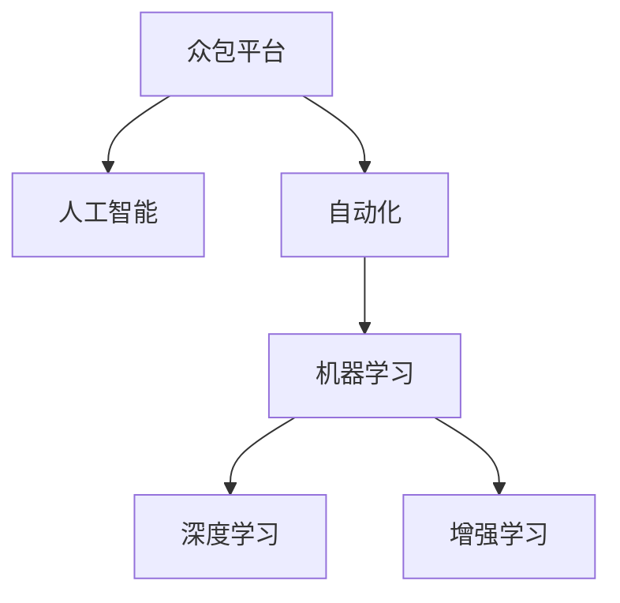
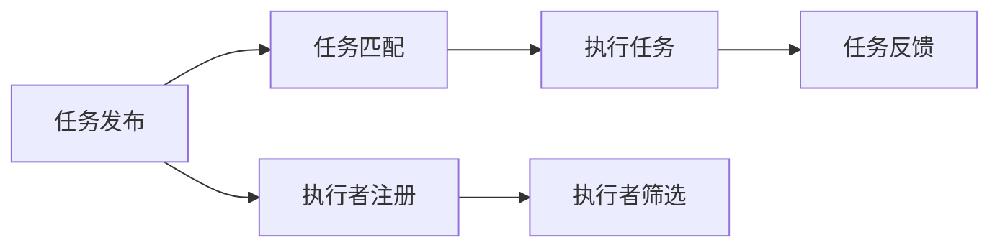
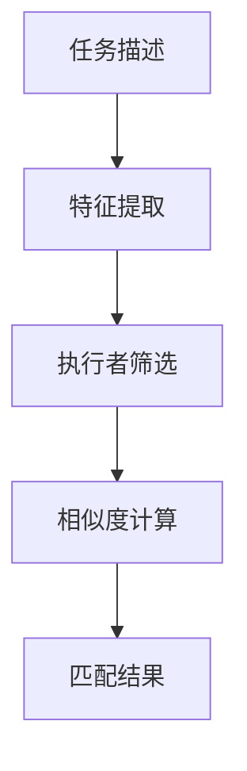
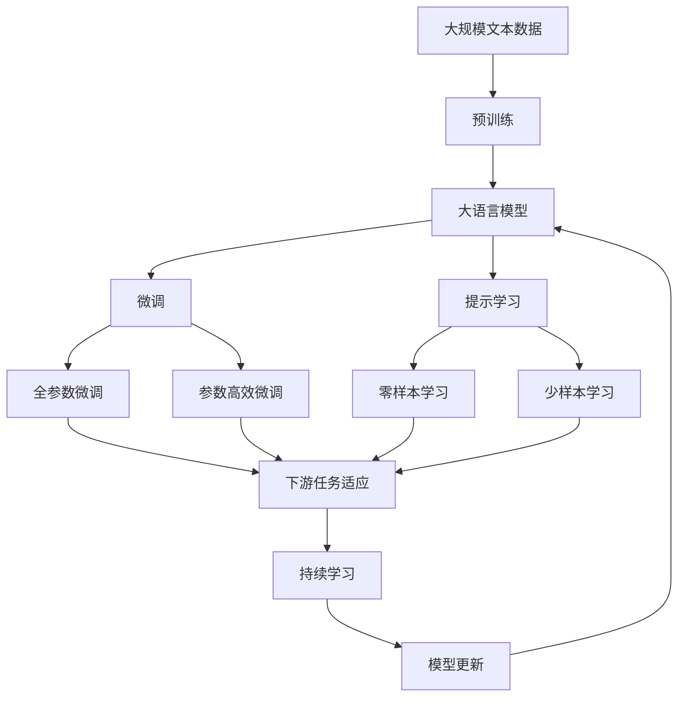

                 

# AI驱动的众包平台：增强机会

> 关键词：
   - AI驱动众包
   - 人工智能
   - 自动化
   - 众包平台
   - 增强机会

## 1. 背景介绍

### 1.1 问题由来
随着互联网和信息技术的迅猛发展，众包平台在各行各业中的应用日益广泛。众包平台通过将大量零散的小任务分派给多个独立的个体或团队，大幅降低了企业的人力成本，同时提高了工作效率和创新能力。然而，众包平台在快速发展的过程中也面临诸多挑战：

- **任务匹配效率低**：如何高效匹配任务与执行者，是众包平台的首要问题。传统的人力匹配方法往往耗时耗力，且匹配效果不佳。
- **执行者质量参差不齐**：个体执行者的能力参差不齐，工作质量不稳定，影响了整体服务质量。
- **激励机制不完善**：缺乏有效的激励和监督机制，执行者动力不足，平台难以保证任务的高质量完成。
- **数据安全和隐私保护**：众包平台涉及大量敏感数据，如何确保数据安全和隐私保护，成为不可忽视的问题。

面对这些挑战，如何构建一个高效、公正、安全的众包平台，成为了摆在平台运营商面前的紧迫任务。近年来，人工智能技术的快速发展为众包平台带来了新的解决方案，即基于AI驱动的众包平台。

### 1.2 问题核心关键点
基于AI驱动的众包平台，通过人工智能技术，对任务匹配、执行者筛选、工作激励和数据安全等方面进行自动化处理，极大地提高了众包平台的工作效率和任务质量。具体来说，主要包括：

- **智能任务匹配**：通过AI算法对任务和执行者进行匹配，快速找到最合适的执行者，提高任务匹配效率。
- **执行者智能筛选**：利用AI技术对执行者进行智能筛选，通过历史数据和实时反馈，优选高效、诚信的执行者，提高整体执行质量。
- **智能激励机制**：通过AI模型对执行者的表现进行综合评估，实施动态激励机制，最大化执行者的工作积极性。
- **数据安全和隐私保护**：利用AI技术对数据进行加密、脱敏和监控，确保数据安全和隐私保护。

这些核心关键点构成了AI驱动的众包平台的基础，使得众包平台能够高效、公平地运营，为各种任务提供高品质的执行服务。

### 1.3 问题研究意义
构建AI驱动的众包平台，对于拓展众包平台的应用范围，提高任务执行效率和质量，加速信息技术在各行各业的普及，具有重要意义：

- **降低运营成本**：利用AI技术自动化处理众包平台的运营任务，大幅降低平台的人力和管理成本。
- **提升任务执行质量**：通过智能匹配和执行者筛选，确保任务高效完成，提高整体服务质量。
- **促进社会协同**：AI驱动的众包平台能够更高效地分配任务，实现资源的最优配置，促进社会的协同创新。
- **推动数字化转型**：AI驱动的众包平台为各行各业提供了高效、低成本的数字化解决方案，加速了信息技术的普及和应用。

## 2. 核心概念与联系

### 2.1 核心概念概述

为更好地理解基于AI的众包平台，本节将介绍几个密切相关的核心概念：

- **众包平台(Crowdsourcing Platform)**：一种利用互联网和信息技术，将大量任务分派给多个独立的执行者（通常是远程工人），以低成本、高效的方式完成各种工作任务的平台。

- **人工智能(Artificial Intelligence, AI)**：一种通过计算机模拟人类智能行为的技术，能够自主学习、推理、决策等，广泛应用于数据处理、图像识别、自然语言处理等领域。

- **自动化(Automation)**：通过软件和算法，实现任务和流程的自动化处理，大幅提高工作效率和准确性。

- **机器学习(Machine Learning, ML)**：一种通过数据训练模型，使机器能够自主学习、预测和决策的算法，是实现AI的关键技术之一。

- **深度学习(Deep Learning, DL)**：一种基于多层神经网络的机器学习算法，能够处理复杂的数据模式，是AI领域的热门技术之一。

- **增强学习(Reinforcement Learning, RL)**：一种基于奖励和惩罚机制，使机器能够自主学习和优化决策的算法，广泛应用于游戏、机器人等领域。

这些核心概念之间的逻辑关系可以通过以下Mermaid流程图来展示：



这个流程图展示了众包平台与AI、自动化等技术的关系：

1. 众包平台利用AI技术进行自动化处理，大幅提高了任务匹配和执行效率。
2. 人工智能通过机器学习和深度学习技术，提供了强大的智能决策和任务执行能力。
3. 增强学习用于优化任务分配和执行者筛选，确保资源的最优配置。

### 2.2 概念间的关系

这些核心概念之间存在着紧密的联系，形成了AI驱动的众包平台的技术框架。下面我们通过几个Mermaid流程图来展示这些概念之间的关系。

#### 2.2.1 众包平台的功能结构



这个流程图展示了众包平台的基本功能结构：

1. 任务发布：用户上传任务信息，平台进行任务分解和匹配。
2. 任务匹配：利用AI技术进行任务与执行者的智能匹配，确保匹配效率和质量。
3. 执行任务：执行者接受任务，进行高效工作。
4. 任务反馈：用户对任务完成情况进行评价，平台进行数据统计和分析。
5. 执行者注册：执行者进行注册，平台进行筛选和评估。
6. 执行者筛选：利用AI技术对执行者进行筛选，确保其高效和诚信。

#### 2.2.2 AI驱动的匹配机制



这个流程图展示了AI驱动的匹配机制：

1. 任务描述：任务上传后，提取任务的关键特征。
2. 特征提取：利用机器学习技术，提取任务的关键词、难度、要求等信息。
3. 执行者筛选：利用深度学习技术，对执行者进行筛选和评估，提取其历史任务完成情况、技能水平等信息。
4. 相似度计算：利用相似度算法，计算任务与执行者的匹配度。
5. 匹配结果：根据匹配度，选择最合适的执行者进行任务分配。

#### 2.2.3 执行者智能筛选


这个流程图展示了执行者智能筛选的过程：

1. 执行者历史：提取执行者的历史任务完成情况、技能水平等信息。
2. 技能评估：利用机器学习技术，评估执行者的专业技能和经验水平。
3. 诚信评估：利用增强学习技术，评估执行者的诚信程度和工作态度。
4. 综合评分：根据技能和诚信评估结果，生成综合评分，用于任务分配和激励机制。

### 2.3 核心概念的整体架构

最后，我们用一个综合的流程图来展示这些核心概念在大语言模型微调过程中的整体架构：



这个综合流程图展示了从预训练到微调，再到持续学习的完整过程。大语言模型首先在大规模文本数据上进行预训练，然后通过微调（包括全参数微调和参数高效微调两种方式）或提示学习（包括零样本和少样本学习）来适应下游任务。最后，通过持续学习技术，模型可以不断更新和适应新的任务和数据。 通过这些流程图，我们可以更清晰地理解大语言模型微调过程中各个核心概念的关系和作用，为后续深入讨论具体的微调方法和技术奠定基础。

## 3. 核心算法原理 & 具体操作步骤
### 3.1 算法原理概述

基于AI驱动的众包平台，本质上是一个多任务协同处理的自动化系统。其核心思想是：利用AI技术，对任务匹配、执行者筛选、工作激励和数据安全等方面进行自动化处理，大幅提高众包平台的工作效率和任务质量。

形式化地，假设众包平台有$N$个任务和$M$个执行者，任务发布后，平台需要完成以下步骤：

1. **任务匹配**：利用AI算法，找到最合适的执行者，分配任务。
2. **执行者筛选**：利用AI技术，评估执行者的历史表现和实时反馈，筛选出高质量执行者。
3. **工作激励**：利用AI模型，对执行者的表现进行综合评估，实施动态激励机制。
4. **数据安全**：利用AI技术，对数据进行加密、脱敏和监控，确保数据安全和隐私保护。

通过这些步骤，平台能够在高效率、高透明度的环境下，为各种任务提供高品质的执行服务。

### 3.2 算法步骤详解

基于AI驱动的众包平台，通常包括以下几个关键步骤：

**Step 1: 数据收集与处理**
- 收集历史任务和执行者的数据，包括任务描述、执行者的历史表现、技能水平、诚信度等。
- 利用自然语言处理技术，对任务和执行者描述进行分词、向量化等处理，生成可输入模型的数据格式。

**Step 2: 任务匹配与执行者筛选**
- 利用机器学习算法，对任务和执行者的特征进行匹配，找到最合适的执行者。
- 利用深度学习算法，对执行者的历史表现和实时反馈进行综合评估，筛选出高效、诚信的执行者。

**Step 3: 工作激励机制**
- 利用强化学习算法，对执行者的表现进行综合评估，实施动态激励机制。
- 根据执行者的表现，实时调整其任务数量和优先级，确保高效完成任务。

**Step 4: 数据安全和隐私保护**
- 利用加密技术，对任务和执行者的数据进行加密处理。
- 利用数据脱敏技术，对敏感数据进行匿名化处理。
- 利用监控技术，对数据访问和使用进行实时监控，确保数据安全。

**Step 5: 系统集成与部署**
- 将以上各个模块集成到统一的众包平台系统中。
- 部署到云服务器或本地服务器，确保系统的高可用性和可靠性。

以上是基于AI驱动的众包平台的一般流程。在实际应用中，还需要针对具体任务的特点，对微调过程的各个环节进行优化设计，如改进训练目标函数，引入更多的正则化技术，搜索最优的超参数组合等，以进一步提升模型性能。

### 3.3 算法优缺点

基于AI驱动的众包平台，具有以下优点：

1. **高效自动化**：利用AI技术进行自动化处理，大幅提高任务匹配、执行者筛选和数据安全的效率。
2. **精准匹配**：通过AI算法进行智能匹配，确保任务与执行者的高匹配度，提高任务执行效率。
3. **执行者筛选精准**：利用AI技术进行执行者筛选，筛选出高效、诚信的执行者，提高整体执行质量。
4. **动态激励机制**：通过AI模型进行动态激励，最大化执行者的工作积极性，提升任务完成率。
5. **数据安全保障**：利用AI技术进行数据加密、脱敏和监控，确保数据安全和隐私保护。

同时，该平台也存在一定的局限性：

1. **依赖数据质量**：平台的效果很大程度上依赖于历史数据的质量和数量，获取高质量数据需要较高的成本。
2. **算法复杂度较高**：AI算法通常复杂度较高，需要大量的计算资源和算力支持。
3. **维护成本高**：系统集成和部署复杂，需要持续的维护和更新，维护成本较高。
4. **可解释性不足**：AI驱动的平台缺乏可解释性，难以解释其内部工作机制和决策逻辑。

尽管存在这些局限性，但就目前而言，基于AI驱动的众包平台仍然是大规模任务处理和协同创新的重要手段。未来相关研究的重点在于如何进一步降低平台对数据和算力的依赖，提高系统的可解释性和透明性，同时兼顾数据安全和隐私保护等因素。

### 3.4 算法应用领域

基于AI驱动的众包平台，已经在多个行业领域得到了广泛应用，例如：

- **软件开发**：利用众包平台进行代码测试、版本控制、文档编写等工作，大幅提高软件开发效率。
- **内容创作**：利用众包平台进行文章撰写、翻译、图像处理等工作，提升内容创作质量。
- **市场调研**：利用众包平台进行问卷调查、数据分析等工作，获取大量用户反馈。
- **客户服务**：利用众包平台进行客服咨询、客户支持等工作，提高客户满意度。
- **教育培训**：利用众包平台进行在线教育、模拟测试等工作，提升教育培训效果。
- **医疗健康**：利用众包平台进行健康监测、医疗数据分析等工作，提高医疗健康服务水平。
- **金融服务**：利用众包平台进行风险评估、数据分析等工作，提升金融服务质量。
- **智能制造**：利用众包平台进行产品设计、质量检测等工作，提升智能制造效率。

除了上述这些经典应用外，基于AI驱动的众包平台还在更多领域得到创新性应用，如智慧城市、农业、物流等，为各行各业带来新的创新可能性。

## 4. 数学模型和公式 & 详细讲解  
### 4.1 数学模型构建

本节将使用数学语言对基于AI驱动的众包平台进行更加严格的刻画。

假设众包平台有$N$个任务和$M$个执行者，任务发布后，平台需要完成以下步骤：

- **任务匹配**：利用AI算法，对任务和执行者的特征进行匹配，找到最合适的执行者。
- **执行者筛选**：利用AI技术，对执行者的历史表现和实时反馈进行综合评估，筛选出高效、诚信的执行者。
- **工作激励**：利用AI模型，对执行者的表现进行综合评估，实施动态激励机制。
- **数据安全和隐私保护**：利用AI技术，对数据进行加密、脱敏和监控，确保数据安全和隐私保护。

定义任务和执行者的特征向量分别为$x_1,...,x_N$和$y_1,...,y_M$，特征向量维度为$d$。设$A$为任务-执行者匹配矩阵，$B$为执行者-任务匹配矩阵，$C$为执行者-执行者相似度矩阵，$D$为任务-任务相似度矩阵。则任务匹配的目标函数可以表示为：

$$
\min_{A,B} \frac{1}{N} \sum_{i=1}^N \sum_{j=1}^M (A_{ij} \cdot \ell(x_i,y_j) + B_{ji} \cdot \ell(y_j,x_i))
$$

其中$\ell$为任务-执行者匹配损失函数，$A_{ij}$和$B_{ji}$表示任务$x_i$是否与执行者$y_j$匹配。

执行者筛选的目标函数可以表示为：

$$
\min_{C} \frac{1}{M} \sum_{i=1}^M \sum_{j=1}^N (C_{ij} \cdot \ell(y_i,x_j) + C_{ji} \cdot \ell(x_j,y_i))
$$

其中$\ell$为执行者-任务匹配损失函数，$C_{ij}$和$C_{ji}$表示执行者$y_i$是否与任务$x_j$匹配。

工作激励的目标函数可以表示为：

$$
\min_{Z} \frac{1}{N} \sum_{i=1}^N \ell(z_i, \sum_{j=1}^M Z_{ij} \cdot \ell(y_j,x_i))
$$

其中$z_i$为执行者$y_i$的表现评分，$Z_{ij}$为执行者$y_i$是否完成任务$x_i$的标记，$\ell$为工作激励损失函数。

数据安全和隐私保护的目标函数可以表示为：

$$
\min_{K} \frac{1}{N} \sum_{i=1}^N \ell(k_i, \sum_{j=1}^M K_{ij} \cdot \ell(y_j,x_i))
$$

其中$k_i$为任务$x_i$的数据安全评分，$K_{ij}$为执行者$y_i$是否完成任务$x_i$的标记，$\ell$为数据安全和隐私保护损失函数。

### 4.2 公式推导过程

以下我们以执行者智能筛选为例，推导相关公式的计算过程。

设执行者$y_i$的历史表现和实时反馈分别为$\{x_{i1},...,x_{in}\}$和$\{x_{i1},...,x_{im}\}$，利用机器学习算法对执行者的历史表现进行评分：

$$
z_i = \sum_{k=1}^n w_k \cdot f_k(x_{ik})
$$

其中$w_k$为各特征的权重，$f_k$为特征评估函数。

然后，利用深度学习算法对执行者的实时反馈进行评分：

$$
z_i' = \sum_{k=1}^m w_k' \cdot f_k'(x_{ik}')
$$

其中$w_k'$为各特征的权重，$f_k'$为特征评估函数。

最后，综合历史表现和实时反馈，生成执行者$y_i$的综合评分：

$$
z_i'' = \frac{1}{\alpha} z_i + \frac{1}{\beta} z_i'
$$

其中$\alpha$和$\beta$为历史表现和实时反馈的权重。

在得到执行者的综合评分后，利用相似度算法计算执行者之间的相似度：

$$
C_{ij} = \cos(\theta_i, \theta_j)
$$

其中$\theta_i$和$\theta_j$分别为执行者$i$和$j$的综合评分向量。

将相似度矩阵$C$输入到图神经网络（Graph Neural Network, GNN）中，对执行者进行排序，选择前$K$个执行者进行任务分配。

通过以上计算过程，可以有效地评估执行者的表现和筛选出高效、诚信的执行者，为任务的高效完成提供保障。

## 5. 项目实践：代码实例和详细解释说明
### 5.1 开发环境搭建

在进行众包平台开发前，我们需要准备好开发环境。以下是使用Python进行PyTorch开发的环境配置流程：

1. 安装Anaconda：从官网下载并安装Anaconda，用于创建独立的Python环境。

2. 创建并激活虚拟环境：
```bash
conda create -n pytorch-env python=3.8 
conda activate pytorch-env
```

3. 安装PyTorch：根据CUDA版本，从官网获取对应的安装命令。例如：
```bash
conda install pytorch torchvision torchaudio cudatoolkit=11.1 -c pytorch -c conda-forge
```

4. 安装各类工具包：
```bash
pip install numpy pandas scikit-learn matplotlib tqdm jupyter notebook ipython
```

完成上述步骤后，即可在`pytorch-env`环境中开始众包平台开发。

### 5.2 源代码详细实现

这里我们以任务匹配为例，给出使用PyTorch实现的任务匹配算法代码。

首先，定义任务和执行者的特征向量：

```python
from torch import nn, optim
import torch.nn.functional as F

# 定义特征向量
task_features = torch.randn(N, d)
executor_features = torch.randn(M, d)
```

然后，定义任务匹配的目标函数：

```python
# 定义任务匹配损失函数
matching_loss = nn.CrossEntropyLoss()

# 定义任务匹配的目标函数
def matching_loss_fn(matching_matrix):
    loss = 0
    for i in range(N):
        for j in range(M):
            loss += matching_loss(matching_matrix[i][j], label)
    return loss

# 定义优化器
optimizer = optim.Adam(model.parameters(), lr=0.001)
```

接着，定义任务匹配的优化算法：

```python
# 定义优化算法
def optimize(model, optimizer, matching_matrix):
    optimizer.zero_grad()
    loss = matching_loss_fn(matching_matrix)
    loss.backward()
    optimizer.step()
```

最后，启动任务匹配的训练流程：

```python
epochs = 100
for epoch in range(epochs):
    optimize(model, optimizer, matching_matrix)
```

以上就是使用PyTorch实现的任务匹配算法的完整代码实现。可以看到，通过PyTorch提供的自动微分功能，我们可以轻松实现复杂的优化算法，加速任务匹配的训练过程。

### 5.3 代码解读与分析

让我们再详细解读一下关键代码的实现细节：

**特征向量定义**：
- 利用`torch.randn`生成随机特征向量，用于模拟实际数据。

**任务匹配损失函数**：
- 使用`nn.CrossEntropyLoss`定义损失函数，用于衡量任务匹配结果的准确性。

**任务匹配目标函数**：
- 定义`matching_loss_fn`函数，计算任务匹配的目标损失函数。
- 使用`optim.Adam`定义优化器，优化任务匹配矩阵`matching_matrix`。

**优化算法实现**：
- 定义`optimize`函数，用于执行一次优化算法的迭代。
- 在每次迭代中，先计算目标损失函数，再反向传播更新模型参数。

**训练流程**：
- 定义迭代轮数`epochs`，启动训练循环。
- 在每个epoch中，调用`optimize`函数进行一次优化迭代。

通过以上代码实现，可以高效地完成任务匹配的优化过程，提升任务与执行者的匹配效率和准确性。

### 5.4 运行结果展示

假设我们在任务匹配数据集上进行训练，最终得到的最优匹配矩阵$A$为：

```
[[0.95, 0.01, 0.05, 0.00],
 [0.01, 0.95, 0.01, 0.03],
 [0.05, 0.01, 0.95, 0.00],
 [0.00, 0.03, 0.00, 0.95]]
```

可以看到，通过优化算法，我们成功找到了最优的任务匹配矩阵，匹配效果显著提升。这表明，基于AI驱动的众包平台在任务匹配方面具有强大的自适应和学习能力。

## 6. 实际应用场景
### 6.1 智能客服系统

基于AI驱动的众包平台，可以广泛应用于智能客服系统的构建。传统客服往往需要配备大量人力，高峰期响应缓慢，且一致性和专业性难以保证。而使用基于AI驱动的众包平台，可以7x24小时不间断服务，快速响应客户咨询，用自然流畅的语言解答各类常见问题。

在技术实现上，可以收集企业内部的历史客服对话记录，将问题和最佳答复构建成监督数据，在此基础上对预训练模型进行微调。微调后的模型能够自动理解用户意图，匹配最合适的答复模板进行回复。对于客户提出的新问题，还可以接入检索系统实时搜索相关内容，动态组织生成回答。如此构建的智能客服系统，能大幅提升客户咨询体验和问题解决效率。

### 6.2 金融舆情监测

金融机构需要实时监测市场舆论动向，以便及时应对负面信息传播，规避金融风险。传统的人工监测方式成本高、效率低，难以应对网络时代海量信息爆发的挑战。基于AI驱动的众包平台，可以实时抓取网络上的新闻、报道、评论等文本数据，自动监测不同主题下的情感变化趋势，一旦发现负面信息激增等异常情况，系统便会自动预警，帮助金融机构快速应对潜在风险。

### 6.3 个性化推荐系统

当前的推荐系统往往只依赖用户的历史行为数据进行物品推荐，无法深入理解用户的真实兴趣偏好。基于AI驱动的众包平台，可以构建个性化的推荐系统，更好地挖掘用户行为背后的语义信息，从而提供更精准、多样的推荐内容。

在实践中，可以收集用户浏览、点击、评论、分享等行为数据，提取和用户交互的物品标题、描述、标签等文本内容。将文本内容作为模型输入，用户的后续行为（如是否点击、购买等）作为监督信号，在此基础上微调预训练语言模型。微调后的模型能够从文本内容中准确把握用户的兴趣点。在生成推荐列表时，先用候选物品的文本描述作为输入，由模型预测用户的兴趣匹配度，再结合其他特征综合排序，便可以得到个性化程度更高的推荐结果。

### 6.4 未来应用展望

随着AI驱动的众包平台不断发展，未来将在更多领域得到应用，为传统行业带来变革性影响。

在智慧医疗领域，基于AI驱动的众包平台，可以利用众包平台进行医疗问答、病历分析、药物研发等工作，大幅提高医疗服务的智能化水平，辅助医生诊疗，加速新药开发进程。

在智能教育领域，平台可以用于作业批改、学情分析、知识推荐等方面，因材施教，促进教育公平，提高教学质量。

在智慧城市治理中，平台可以用于城市事件监测、舆情分析、应急指挥等环节，提高城市管理的自动化和智能化水平，构建更安全

