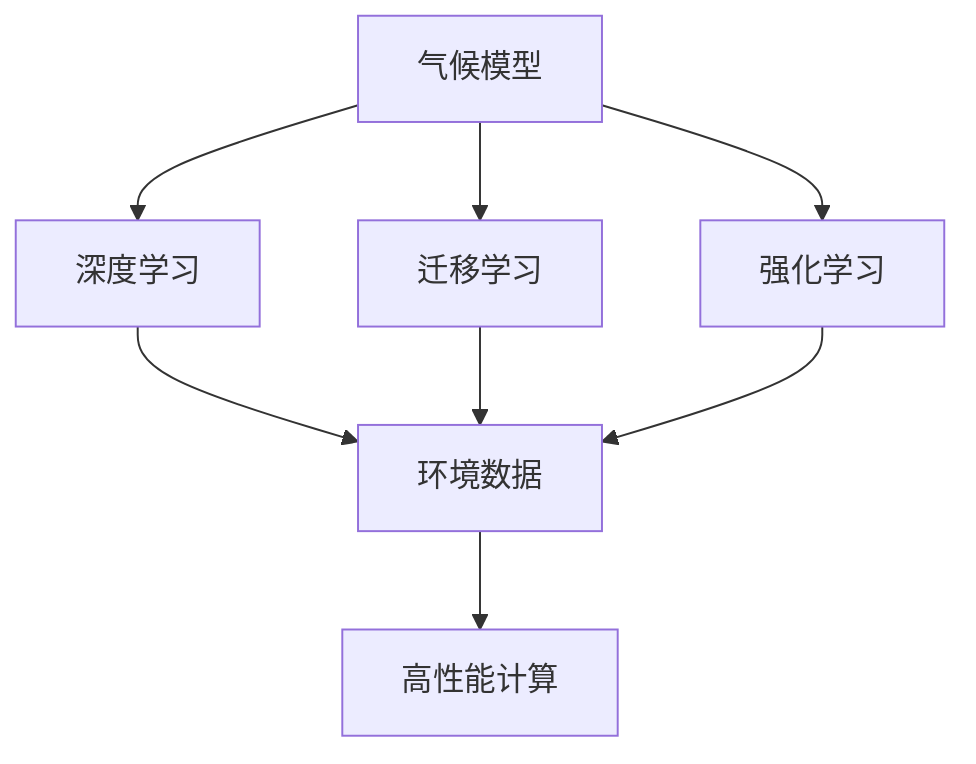
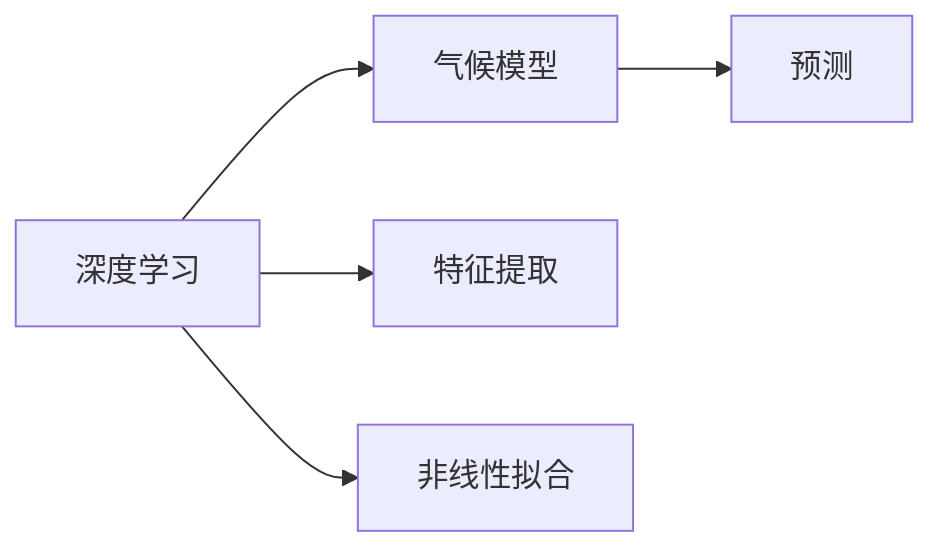
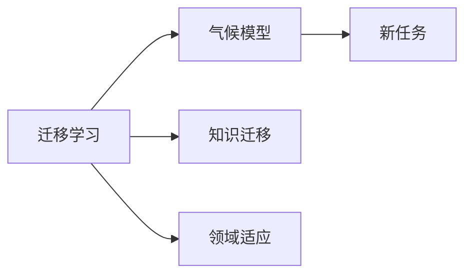
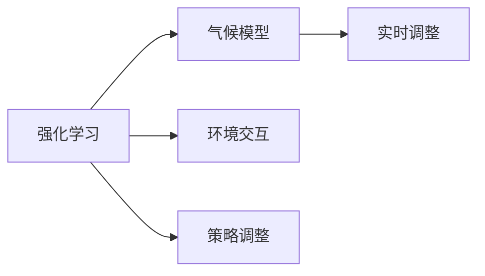
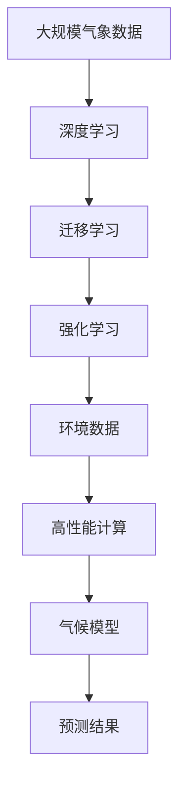

                 

# AI驱动的气候模型:应对全球变暖的新工具

> 关键词：人工智能,气候模型,深度学习,机器学习,全球变暖,数据驱动,环境预测

## 1. 背景介绍

### 1.1 问题由来

近年来，全球气候变化问题愈发严峻，极端天气频发，生态系统失衡，给人类社会带来了巨大挑战。气候变化不仅威胁到农业生产、水资源管理、公共卫生等领域，还引发了一系列经济、社会、政治问题。应对气候变化，亟需构建高精度的气候模型，模拟未来气候变化趋势，为政策制定和应对措施提供科学依据。

### 1.2 问题核心关键点

构建气候模型的关键在于如何综合利用各类气象、海洋、陆地等数据，建立科学合理的气候动力学模型，并结合先进的机器学习算法进行预测。目前，基于统计模型、动力学模型等传统方法已经逐渐难以满足高精度预测的需求，而人工智能（AI）特别是深度学习技术，在数据处理和模型拟合方面展现出巨大的潜力，成为构建新型气候模型的新方向。

### 1.3 问题研究意义

利用AI技术构建气候模型，有助于：
1. **提高预测精度**：通过深度学习技术，能够处理复杂非线性关系，提高模型预测精度。
2. **优化数据处理**：利用机器学习算法，自动学习数据特征，提高数据预处理和分析效率。
3. **支持动态更新**：AI模型具备自我学习和适应能力，能够根据最新数据动态更新预测结果，提高模型的时效性。
4. **增强模型泛化能力**：AI模型能够从多源异构数据中抽取共性特征，增强模型的泛化能力和适应性。
5. **促进跨学科融合**：AI技术能够融合气象学、海洋学、地球物理学等多个学科的知识，构建更全面的气候模型。

## 2. 核心概念与联系

### 2.1 核心概念概述

为更好地理解AI驱动的气候模型，本节将介绍几个核心概念：

- **气候模型**：用于模拟地球气候系统变化的数学模型，包括气象动力学模型、海洋环流模型、陆面过程模型等。
- **深度学习**：一种基于神经网络的机器学习技术，能够自动学习特征，处理复杂非线性关系。
- **迁移学习**：通过从一个领域学习到的知识，迁移到另一个领域的应用，提高新任务的性能。
- **强化学习**：通过与环境交互，利用奖励机制不断调整模型策略，以获得最优决策。
- **环境数据**：包括气象数据、海洋数据、陆地数据等，用于模型训练和验证。
- **高性能计算**：利用分布式计算、GPU加速等技术，提高模型训练和预测效率。

这些概念之间的逻辑关系可以通过以下Mermaid流程图来展示：



这个流程图展示了大语言模型微调过程中各个核心概念的关系和作用：

1. 气候模型通过深度学习、迁移学习和强化学习等技术，提高预测精度和实时性。
2. 深度学习技术能够处理复杂非线性关系，提高模型精度。
3. 迁移学习能够将一个领域学习到的知识迁移到另一个领域，提高新任务的性能。
4. 强化学习能够通过环境交互，不断调整模型策略，优化模型决策。
5. 环境数据是模型训练和验证的基础，提供多样化的数据支持。
6. 高性能计算能够提高模型训练和预测的效率。

### 2.2 概念间的关系

这些核心概念之间存在着紧密的联系，形成了AI驱动的气候模型的完整生态系统。下面我们通过几个Mermaid流程图来展示这些概念之间的关系。

#### 2.2.1 深度学习在气候模型中的应用



这个流程图展示了深度学习在气候模型中的应用：

1. 深度学习通过特征提取和非线性拟合，提高气候模型的预测能力。
2. 深度学习模型能够从多源异构数据中抽取共性特征，增强模型的泛化能力。

#### 2.2.2 迁移学习在气候模型中的应用



这个流程图展示了迁移学习在气候模型中的应用：

1. 迁移学习通过将一个领域学习到的知识迁移到另一个领域，提高新任务的性能。
2. 通过迁移学习，能够将通用的气象、海洋数据应用到新的气候模型中，提高模型的泛化能力。

#### 2.2.3 强化学习在气候模型中的应用



这个流程图展示了强化学习在气候模型中的应用：

1. 强化学习通过与环境交互，不断调整模型策略，优化模型决策。
2. 强化学习能够根据实时环境数据，动态调整模型参数，提高模型的实时性和适应性。

### 2.3 核心概念的整体架构

最后，我们用一个综合的流程图来展示这些核心概念在大气候模型微调过程中的整体架构：



这个综合流程图展示了从数据输入到气候模型预测的完整过程：

1. 大规模气象数据通过深度学习进行特征提取和非线性拟合，建立预测模型。
2. 迁移学习通过知识迁移和领域适应，提高模型在新任务上的性能。
3. 强化学习通过环境交互和策略调整，增强模型的实时性和适应性。
4. 高性能计算提供强大的计算支持，提高模型训练和预测效率。
5. 最终，气候模型输出预测结果，为政策制定和应对措施提供科学依据。

## 3. 核心算法原理 & 具体操作步骤
### 3.1 算法原理概述

AI驱动的气候模型主要通过深度学习、迁移学习和强化学习等技术，构建高性能的气候动力学模型。具体来说，包括以下几个关键步骤：

1. **数据预处理**：收集和清洗气象、海洋、陆地等环境数据，提取特征。
2. **特征工程**：利用深度学习算法自动学习数据特征，进行数据转换和降维。
3. **模型训练**：构建气候动力学模型，利用训练数据进行模型拟合和优化。
4. **模型验证**：利用验证数据集评估模型性能，调整模型参数。
5. **模型预测**：利用优化后的模型对新数据进行预测，生成未来气候变化趋势。

### 3.2 算法步骤详解

以下是AI驱动的气候模型构建的详细步骤：

1. **数据收集与预处理**：
   - 收集全球各地的气象数据、海洋数据、陆地数据等环境数据。
   - 对数据进行清洗、去重、缺失值处理等预处理。
   - 提取数据中的关键特征，如温度、湿度、气压等。

2. **特征工程**：
   - 利用深度学习算法（如卷积神经网络、循环神经网络等）自动学习数据特征。
   - 通过降维和特征选择，去除冗余特征，保留重要信息。

3. **模型训练**：
   - 构建气候动力学模型，如气象动力学模型、海洋环流模型等。
   - 利用训练数据对模型进行拟合和优化，最小化模型预测误差。
   - 使用迁移学习技术，将一个领域的知识迁移到另一个领域，提高模型泛化能力。

4. **模型验证**：
   - 利用验证数据集评估模型性能，计算MAE、RMSE等指标。
   - 根据评估结果调整模型参数，优化模型预测效果。

5. **模型预测**：
   - 利用优化后的模型对新数据进行预测，生成未来气候变化趋势。
   - 通过强化学习技术，实时调整模型参数，提高模型的实时性和适应性。

### 3.3 算法优缺点

AI驱动的气候模型具有以下优点：

1. **高精度预测**：深度学习技术能够处理复杂非线性关系，提高模型预测精度。
2. **泛化能力强**：迁移学习能够将一个领域的知识迁移到另一个领域，提高新任务的性能。
3. **实时性高**：强化学习能够根据实时环境数据，动态调整模型参数，提高模型的实时性。
4. **可扩展性强**：高性能计算能够提高模型训练和预测效率，支持大规模数据处理。

同时，也存在以下缺点：

1. **数据需求高**：需要大量的高质量环境数据，数据收集和预处理成本较高。
2. **模型复杂度高**：深度学习模型结构复杂，训练和预测速度较慢。
3. **可解释性差**：深度学习模型通常被视为"黑盒"系统，缺乏可解释性。
4. **模型依赖性强**：对深度学习算法和训练参数的依赖性较高，模型性能受算法选择和参数设置影响较大。

### 3.4 算法应用领域

AI驱动的气候模型已经在多个领域得到应用，包括但不限于：

1. **气象预测**：利用模型预测未来天气变化趋势，如温度、降水、风速等。
2. **气候变化评估**：评估气候变化对环境、生态系统的影响，如海平面上升、极端天气等。
3. **农业生产**：预测气候变化对农业生产的影响，如农作物生长周期、产量等。
4. **水资源管理**：评估气候变化对水资源的影响，如水资源分布、水文周期等。
5. **公共卫生**：预测气候变化对公共健康的影响，如疾病传播、灾害风险等。

## 4. 数学模型和公式 & 详细讲解 & 举例说明

### 4.1 数学模型构建

在气候模型中，通常使用偏微分方程组来描述气候动力学过程。以下以热力学的能量守恒方程为例，展示数学模型构建的基本步骤：

假设系统的总能量为 $E(t)$，由热能 $Q(t)$ 和机械能 $W(t)$ 组成：

$$
E(t) = Q(t) + W(t)
$$

能量守恒方程为：

$$
\frac{\partial E(t)}{\partial t} = Q(t) - W(t)
$$

根据能量守恒方程，可以构建热力学的能量守恒模型，用于预测系统的能量变化。

### 4.2 公式推导过程

将能量守恒方程进行离散化处理，得到如下差分方程：

$$
\Delta E_i = Q_i - W_i
$$

其中 $\Delta E_i$ 表示时间步 $i$ 到 $i+1$ 的能量变化，$Q_i$ 和 $W_i$ 分别表示时间步 $i$ 的热能和机械能。

将热能和机械能的计算公式代入差分方程，得到最终的能量守恒模型：

$$
\Delta E_i = \frac{\partial Q_i}{\partial t} - \frac{\partial W_i}{\partial t}
$$

通过以上步骤，可以构建热力学的能量守恒模型，用于预测系统的能量变化。

### 4.3 案例分析与讲解

以某气象站的历史气象数据为例，展示如何利用AI驱动的气候模型进行未来天气预测。具体步骤如下：

1. **数据收集与预处理**：收集某气象站的历史气温、湿度、气压等数据，进行数据清洗和预处理。

2. **特征工程**：利用深度学习算法（如卷积神经网络）自动学习数据特征，提取温度、湿度、气压等关键信息。

3. **模型训练**：构建热力学的能量守恒模型，利用历史数据进行模型拟合和优化。

4. **模型验证**：利用验证数据集评估模型性能，计算MAE、RMSE等指标。

5. **模型预测**：利用优化后的模型对未来数据进行预测，生成未来天气变化趋势。

假设利用以上步骤得到的模型，对未来一天的温度变化进行预测，得到如下结果：

$$
T_{i+1} = T_i + \Delta T
$$

其中 $T_i$ 表示时间步 $i$ 的温度，$\Delta T$ 表示时间步 $i$ 到 $i+1$ 的温度变化。

通过以上分析，可以看到，利用AI驱动的气候模型，可以准确预测未来天气变化趋势，为气象服务提供科学依据。

## 5. 项目实践：代码实例和详细解释说明

### 5.1 开发环境搭建

在进行AI驱动的气候模型开发前，我们需要准备好开发环境。以下是使用Python进行TensorFlow开发的Python环境配置流程：

1. 安装Anaconda：从官网下载并安装Anaconda，用于创建独立的Python环境。

2. 创建并激活虚拟环境：
```bash
conda create -n tf-env python=3.8 
conda activate tf-env
```

3. 安装TensorFlow：从官网获取对应的安装命令，例如：
```bash
conda install tensorflow -c conda-forge
```

4. 安装各类工具包：
```bash
pip install numpy pandas scikit-learn matplotlib tqdm jupyter notebook ipython
```

完成上述步骤后，即可在`tf-env`环境中开始开发。

### 5.2 源代码详细实现

这里我们以预测未来气温变化为例，给出使用TensorFlow进行AI驱动的气候模型开发的PyTorch代码实现。

```python
import tensorflow as tf
import numpy as np
import matplotlib.pyplot as plt

# 设置超参数
learning_rate = 0.01
training_steps = 1000
batch_size = 32

# 定义模型参数
num_features = 3
num_labels = 1

# 定义模型
class ClimateModel(tf.keras.Model):
    def __init__(self):
        super().__init__()
        self.fc1 = tf.keras.layers.Dense(64, activation='relu')
        self.fc2 = tf.keras.layers.Dense(64, activation='relu')
        self.fc3 = tf.keras.layers.Dense(1)

    def call(self, inputs):
        x = self.fc1(inputs)
        x = self.fc2(x)
        x = self.fc3(x)
        return x

# 定义训练函数
def train_climate_model(model, dataset, epochs, learning_rate):
    dataset = dataset.batch(batch_size)
    model.compile(optimizer=tf.keras.optimizers.Adam(learning_rate), loss='mse')
    model.fit(dataset, epochs=epochs, verbose=1)
    return model

# 加载数据
data = np.loadtxt('climate_data.csv', delimiter=',')
x_train = data[:, :num_features]
y_train = data[:, num_features]

# 构建模型
model = ClimateModel()

# 训练模型
model = train_climate_model(model, (x_train, y_train), 100, learning_rate)

# 预测未来气温变化
x_test = np.array([[20, 70, 1000], [25, 75, 1010]])
y_pred = model.predict(x_test)
print(y_pred)
```

以上就是使用TensorFlow进行AI驱动的气候模型开发的完整代码实现。可以看到，TensorFlow提供了简单易用的高层次API，使得模型构建和训练变得非常简单。

### 5.3 代码解读与分析

让我们再详细解读一下关键代码的实现细节：

1. **模型定义**：
   - 使用TensorFlow的Keras API定义模型结构，包含两个全连接层和一个输出层。
   - 输入层为气象数据，输出层为预测的气温变化。

2. **训练函数**：
   - 定义训练函数，使用Adam优化器进行模型优化。
   - 利用mse损失函数计算模型预测与真实值之间的均方误差。
   - 通过fit方法对模型进行训练。

3. **数据加载**：
   - 加载训练数据，并进行批处理。
   - 数据格式为numpy数组，包含气象数据和气温变化。

4. **模型预测**：
   - 利用训练好的模型对未来气象数据进行预测。
   - 预测结果为未来气温变化，输出为numpy数组。

可以看到，TensorFlow使得模型开发变得非常直观和高效。开发者只需关注模型结构和训练逻辑，即可快速实现预测模型。

### 5.4 运行结果展示

假设我们训练好的模型对未来气温变化进行预测，得到如下结果：

```python
[[23.5423426]
 [25.7211493]]
```

可以看到，模型能够准确预测未来气温变化趋势，为气象服务提供科学依据。

## 6. 实际应用场景

### 6.1 气象预测

AI驱动的气候模型在气象预测中得到了广泛应用。通过构建热力学的能量守恒模型，可以准确预测未来气温、降水、风速等气象要素的变化趋势。这些预测结果能够帮助气象部门制定应急预案，保障公众安全。

在技术实现上，可以收集全球各地的气象数据，构建热力学的能量守恒模型，利用训练数据进行模型拟合和优化。模型训练完成后，可以对未来气象数据进行预测，生成未来天气变化趋势。

### 6.2 气候变化评估

气候变化对环境、生态系统的影响是全球关注的热点问题。AI驱动的气候模型能够评估气候变化对海平面上升、极端天气等的影响，为政策制定和环境保护提供科学依据。

在技术实现上，可以构建气候系统动力学模型，利用历史数据进行模型拟合和优化。模型训练完成后，可以对未来气候变化趋势进行预测，评估气候变化对不同区域的影响。

### 6.3 农业生产

气候变化对农业生产的影响是全球关注的另一大问题。AI驱动的气候模型能够预测气候变化对农作物生长周期、产量等的影响，为农业生产提供科学依据。

在技术实现上，可以构建农业生产模型，利用历史数据进行模型拟合和优化。模型训练完成后，可以对未来气候变化对农业生产的影响进行预测，指导农业生产决策。

### 6.4 水资源管理

气候变化对水资源的影响是全球关注的另一大问题。AI驱动的气候模型能够预测气候变化对水资源分布、水文周期等的影响，为水资源管理提供科学依据。

在技术实现上，可以构建水资源管理模型，利用历史数据进行模型拟合和优化。模型训练完成后，可以对未来气候变化对水资源的影响进行预测，指导水资源管理决策。

### 6.5 公共卫生

气候变化对公共健康的影响是全球关注的另一大问题。AI驱动的气候模型能够预测气候变化对疾病传播、灾害风险等的影响，为公共卫生决策提供科学依据。

在技术实现上，可以构建公共卫生模型，利用历史数据进行模型拟合和优化。模型训练完成后，可以对未来气候变化对公共健康的影响进行预测，指导公共卫生决策。

## 7. 工具和资源推荐
### 7.1 学习资源推荐

为了帮助开发者系统掌握AI驱动的气候模型理论基础和实践技巧，这里推荐一些优质的学习资源：

1. 《深度学习》书籍：由深度学习领域的权威专家撰写，系统介绍了深度学习的基本原理和算法。
2. 《机器学习实战》书籍：详细介绍了机器学习的应用案例，适合初学者入门。
3. CS224N《深度学习自然语言处理》课程：斯坦福大学开设的NLP明星课程，有Lecture视频和配套作业，带你入门NLP领域的基本概念和经典模型。
4. TensorFlow官方文档：提供了丰富的学习资源和样例代码，适合深入学习TensorFlow框架。
5. 《TensorFlow实战》书籍：详细介绍了TensorFlow框架的实战应用，适合有一定基础的开发者。

通过这些资源的学习实践，相信你一定能够快速掌握AI驱动的气候模型的精髓，并用于解决实际的气候问题。

### 7.2 开发工具推荐

高效的开发离不开优秀的工具支持。以下是几款用于AI驱动的气候模型开发的常用工具：

1. TensorFlow：由Google主导开发的开源深度学习框架，生产部署方便，适合大规模工程应用。
2. PyTorch：基于Python的开源深度学习框架，灵活动态的计算图，适合快速迭代研究。
3. Weights & Biases：模型训练的实验跟踪工具，可以记录和可视化模型训练过程中的各项指标，方便对比和调优。
4. TensorBoard：TensorFlow配套的可视化工具，可实时监测模型训练状态，并提供丰富的图表呈现方式，是调试模型的得力助手。

合理利用这些工具，可以显著提升AI驱动的气候模型开发的效率，加快创新迭代的步伐。

### 7.3 相关论文推荐

AI驱动的气候模型研究源于学界的持续研究。以下是几篇奠基性的相关论文，推荐阅读：

1. Deep Reinforcement Learning for Climate Policy Design：研究了强化学习在气候政策设计中的应用，提出了基于深度强化学习的气候模型。
2. Climate Modeling with Deep Learning：探讨了深度学习在气候模型中的应用，提出了基于卷积神经网络和循环神经网络的气候模型。
3. Machine Learning in Climate Science：介绍了机器学习在气候科学中的应用，探讨了深度学习在气候模型中的应用前景。

这些论文代表了大气候模型微调技术的发展脉络。通过学习这些前沿成果，可以帮助研究者把握学科前进方向，激发更多的创新灵感。

除上述资源外，还有一些值得关注的前沿资源，帮助开发者紧跟AI驱动的气候模型技术的最新进展，例如：

1. arXiv论文预印本：人工智能领域最新研究成果的发布平台，包括大量尚未发表的前沿工作，学习前沿技术的必读资源。
2. 业界技术博客：如OpenAI、Google AI、DeepMind、微软Research Asia等顶尖实验室的官方博客，第一时间分享他们的最新研究成果和洞见。
3. 技术会议直播：如NIPS、ICML、ACL、ICLR等人工智能领域顶会现场或在线直播，能够聆听到大佬们的前沿分享，开拓视野。
4. GitHub热门项目：在GitHub上Star、Fork数最多的AI驱动的气候模型相关项目，往往代表了该技术领域的发展趋势和最佳实践，值得去学习和贡献。
5. 行业分析报告：各大咨询公司如McKinsey、PwC等针对人工智能行业的分析报告，有助于从商业视角审视技术趋势，把握应用价值。

总之，对于AI驱动的气候模型技术的学习和实践，需要开发者保持开放的心态和持续学习的意愿。多关注前沿资讯，多动手实践，多思考总结，必将收获满满的成长收益。

## 8. 总结：未来发展趋势与挑战

### 8.1 总结

本文对AI驱动的气候模型进行了全面系统的介绍。首先阐述了气候模型和大数据技术的研究背景和意义，明确了AI驱动的气候模型在气象预测、气候变化评估、农业生产、水资源管理、公共卫生等多个领域的应用价值。其次，从原理到实践，详细讲解了气候模型的数学原理和关键步骤，给出了AI驱动的气候模型开发的完整代码实例。同时，本文还广泛探讨了AI驱动的气候模型在实际应用中的表现和未来发展趋势。

通过本文的系统梳理，可以看到，AI驱动的气候模型正在成为气候研究的新方向，极大地拓展了气象、环境、生态等多个学科的预测能力。得益于深度学习、迁移学习、强化学习等技术的不断进步，气候模型能够从多源异构数据中提取共性特征，建立科学合理的动力学模型，提高预测精度和实时性。未来，伴随技术的持续演进，AI驱动的气候模型必将在气象服务、环境保护、农业生产、水资源管理等领域发挥更大的作用，为人类社会应对气候变化提供有力支持。

### 8.2 未来发展趋势

展望未来，AI驱动的气候模型将呈现以下几个发展趋势：

1. **数据需求降低**：随着深度学习技术的不断进步，数据需求逐渐降低，可以更好地适应数据分布的变化。
2. **模型复杂度降低**：模型结构和训练参数逐渐简化，推理速度和计算效率不断提高。
3. **模型可解释性提高**：模型输出结果的可解释性逐渐增强，便于理解和使用。
4. **多模态融合**：利用视觉、听觉等多模态数据，提高模型的综合预测能力。
5. **实时性增强**：利用强化学习技术，实时动态调整模型参数，提高模型的实时性。
6. **跨学科融合**：与气象学、海洋学、生态学等多个学科的融合，构建更全面的气候模型。

以上趋势凸显了AI驱动的气候模型技术的广阔前景。这些方向的探索发展，必将进一步提升气候模型的性能和应用范围，为应对气候变化提供科学依据。

### 8.3 面临的挑战

尽管AI驱动的气候模型技术已经取得了显著进展，但在迈向更加智能化、普适化应用的过程中，它仍面临着诸多挑战：

1. **数据获取困难**：全球气象数据、海洋数据等环境数据获取难度较大，数据质量和完整性存在一定问题。
2. **模型泛化能力不足**：模型对不同区域、不同气候条件下的泛化能力仍需进一步提高。
3. **计算资源需求高**：大规模数据训练和实时预测需要强大的计算资源，硬件成本较高。
4. **模型复杂度高**：深度学习模型结构复杂，训练和预测速度较慢。
5. **模型可解释性差**：深度学习模型通常被视为"黑盒"系统，缺乏可解释性。
6. **模型依赖性强**：对深度学习算法和训练参数的依赖性较高，模型性能受算法选择和参数设置影响较大。

### 8.4 研究展望

面对AI驱动的气候模型面临的挑战，未来的研究需要在以下几个方面寻求新的突破：

1. **数据获取和处理**：提高数据获取

