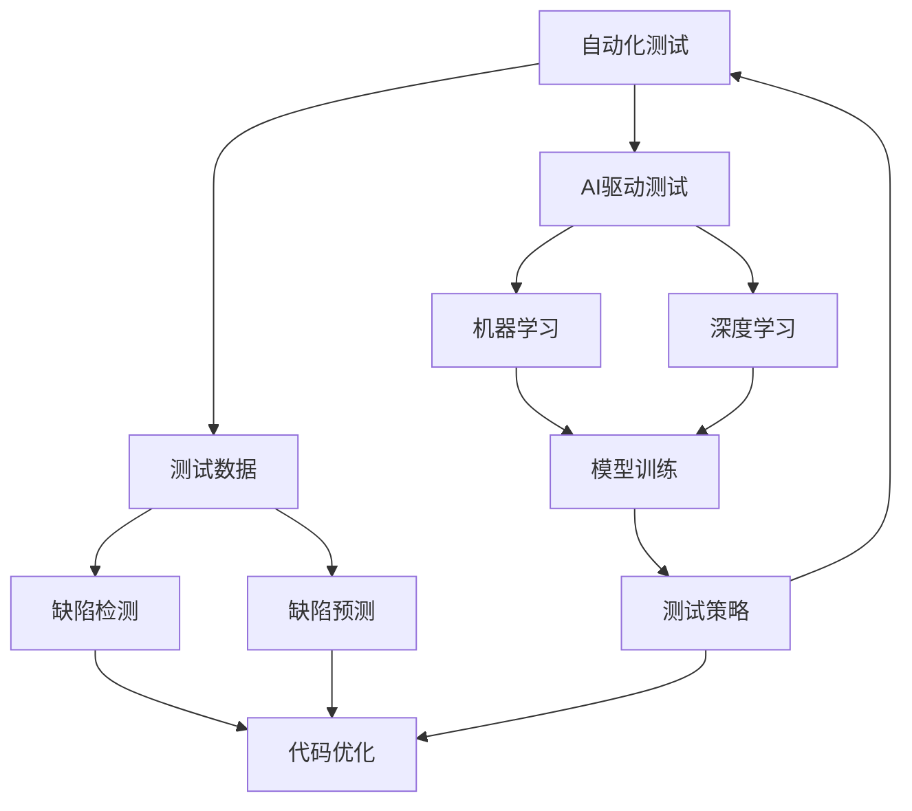

                 

# AI驱动的软件测试自动化

> 关键词：软件测试自动化, AI驱动, 机器学习, 深度学习, 测试覆盖率, 缺陷检测, 缺陷预测, 自动化测试工具

## 1. 背景介绍

### 1.1 问题由来

随着软件系统的日益复杂化，传统的手动测试方法已经无法满足高质量、高效率的测试需求。软件测试自动化逐渐成为行业共识。然而，现有自动化测试工具往往难以覆盖所有测试场景，且存在误报、漏报等问题，影响测试结果的准确性和可信度。

为此，AI驱动的软件测试自动化应运而生。它通过引入机器学习、深度学习等人工智能技术，提高自动化测试的智能化水平，从而解决现有测试工具的诸多问题，实现更高质量的测试效果。

### 1.2 问题核心关键点

AI驱动的软件测试自动化的核心思想是利用人工智能技术对测试数据进行分析、推理和生成，自动发现潜在的问题和风险，辅助测试人员进行更高效的测试活动。具体而言，包括以下几个关键点：

- 自动化测试：通过编写脚本、使用工具等方式实现对软件功能的自动化测试。
- 数据分析：利用统计分析、机器学习等手段对测试数据进行深入挖掘，发现潜在的质量问题。
- 缺陷检测：基于训练好的模型对代码缺陷进行预测和识别，提高缺陷检出的效率和准确性。
- 缺陷预测：通过预测模型对未来代码中的缺陷进行预测，提前发现潜在风险，提高代码质量。
- 优化建议：基于历史测试数据和模型输出，自动生成代码优化建议，提升代码可维护性。

### 1.3 问题研究意义

AI驱动的软件测试自动化对于提升软件质量、降低测试成本、加速产品迭代具有重要意义：

1. **提升测试质量**：AI驱动的测试方法能够自动发现潜在问题，减少手动测试的误报、漏报，提高测试结果的准确性和可靠性。
2. **降低测试成本**：自动化测试可大幅度减少人力投入，缩短测试周期，提高测试效率。
3. **加速产品迭代**：通过提前发现和修复缺陷，降低后续的修复成本，提升产品发布速度和市场竞争力。
4. **优化测试策略**：AI驱动的测试方法能够提供更智能的测试策略，优化测试资源配置，提升测试覆盖率。
5. **提高代码质量**：缺陷检测和预测模型可辅助开发人员进行代码优化，提升代码可维护性和健壮性。

## 2. 核心概念与联系

### 2.1 核心概念概述

为了更好地理解AI驱动的软件测试自动化，本节将介绍几个密切相关的核心概念：

- **自动化测试**：指通过脚本、工具等方式实现对软件功能的自动化测试，以减少手动测试的工作量和提升测试效率。
- **缺陷检测**：指通过工具或算法自动检测软件中的缺陷，提供及时、准确的反馈信息。
- **缺陷预测**：指通过机器学习模型对未来的代码缺陷进行预测，提前发现潜在风险。
- **代码优化**：指通过自动化工具或AI算法对代码进行分析和优化，提升代码质量和可维护性。
- **AI驱动**：指利用机器学习、深度学习等人工智能技术，提升自动化测试的智能化水平，增强测试效果。

### 2.2 概念间的关系

这些核心概念之间存在着紧密的联系，形成了AI驱动的软件测试自动化的完整生态系统。下面通过几个Mermaid流程图来展示这些概念之间的关系：



这个流程图展示了大语言模型的核心概念及其之间的关系：

1. 自动化测试首先产生测试数据，通过缺陷检测和缺陷预测发现潜在问题。
2. AI驱动的测试方法利用机器学习和深度学习技术进行模型训练，提升缺陷检测和预测的效果。
3. 基于模型输出的代码优化建议进一步提升代码质量。
4. 经过优化后的代码再次进入自动化测试环节，形成闭环。

通过这些流程图，我们可以更清晰地理解AI驱动的软件测试自动化的各个环节和相互关系。

## 3. 核心算法原理 & 具体操作步骤

### 3.1 算法原理概述

AI驱动的软件测试自动化的核心算法原理包括：

- **机器学习模型训练**：基于测试数据集训练缺陷检测和缺陷预测模型，通过监督学习、无监督学习或半监督学习的方式，提取测试数据的特征和模式。
- **深度学习特征提取**：利用深度神经网络对测试数据进行特征提取和表示学习，提升模型的泛化能力和表示效率。
- **自动化测试执行**：通过脚本、工具等方式自动执行测试用例，获取测试结果。
- **缺陷分析与预测**：对测试结果进行分析，使用机器学习或深度学习模型预测代码中的潜在缺陷。
- **代码优化建议**：基于缺陷分析结果，生成代码优化建议，提升代码质量和可维护性。

### 3.2 算法步骤详解

AI驱动的软件测试自动化一般包括以下几个关键步骤：

**Step 1: 数据收集与预处理**

- 收集软件系统相关的测试数据，包括功能测试数据、性能测试数据、代码执行记录等。
- 对测试数据进行清洗、去重、标注等预处理，确保数据质量和一致性。

**Step 2: 特征提取与模型训练**

- 使用深度学习技术对测试数据进行特征提取，生成高维特征向量。
- 使用监督学习或无监督学习算法训练缺陷检测和缺陷预测模型，如决策树、随机森林、深度神经网络等。
- 在模型训练过程中，使用交叉验证、正则化、过拟合控制等技术提高模型泛化能力。

**Step 3: 缺陷检测与预测**

- 对测试结果进行特征提取，输入到训练好的缺陷检测和缺陷预测模型中。
- 模型输出测试用例中潜在的缺陷信息和风险等级，辅助测试人员进行进一步验证。

**Step 4: 代码优化与回归测试**

- 基于模型输出的缺陷信息，生成代码优化建议。
- 将优化后的代码重新执行测试用例，评估代码质量提升效果。
- 如果代码优化有效，则进行回归测试，确保优化措施不会引入新问题。

**Step 5: 测试报告与持续改进**

- 生成测试报告，包含测试覆盖率、缺陷分布、缺陷趋势等信息。
- 根据测试报告，持续改进测试策略和模型，提升测试效果和效率。

### 3.3 算法优缺点

AI驱动的软件测试自动化具有以下优点：

- **高效自动化**：通过脚本和工具实现自动化测试，大幅度减少测试人力成本和时间成本。
- **智能分析**：利用机器学习和深度学习技术对测试数据进行智能分析，提高缺陷检测和预测的准确性和全面性。
- **优化代码**：通过代码优化建议，辅助开发人员提升代码质量和可维护性，减少后续的维护和修复成本。
- **持续改进**：通过持续改进测试策略和模型，不断提升测试效果和覆盖率。

然而，这种自动化测试方法也存在一些局限性：

- **依赖数据质量**：测试数据的质量直接决定了模型预测的准确性，数据偏差可能影响模型效果。
- **模型复杂性**：构建高效的缺陷检测和预测模型，需要大量高质量的标注数据和复杂的模型结构。
- **成本投入**：构建和维护AI驱动的测试系统需要较高的人力和技术投入，初期成本较高。
- **技术门槛**：实现AI驱动的测试自动化，需要掌握深度学习、机器学习等先进技术，对技术要求较高。

### 3.4 算法应用领域

AI驱动的软件测试自动化已在多个领域得到广泛应用，例如：

- **Web应用测试**：对Web应用进行功能测试、性能测试、安全测试等，自动化程度高。
- **移动应用测试**：对iOS、Android等移动应用进行自动化测试，覆盖功能测试、性能测试、兼容性测试等。
- **桌面应用测试**：对桌面应用进行自动化测试，覆盖安装测试、功能测试、性能测试等。
- **API测试**：对Web API进行自动化测试，覆盖功能测试、性能测试、异常测试等。
- **CI/CD集成**：将AI驱动的测试自动化集成到CI/CD流水线中，实现持续集成和持续交付。
- **代码质量检测**：对代码进行缺陷检测和代码风格检测，提升代码质量和开发效率。

此外，AI驱动的软件测试自动化也在不断拓展应用场景，如区块链应用测试、智能合约测试、物联网设备测试等，为不同领域的软件测试提供了新的解决方案。

## 4. 数学模型和公式 & 详细讲解 & 举例说明

### 4.1 数学模型构建

假设测试数据集为 $D=\{(x_i, y_i)\}_{i=1}^N$，其中 $x_i$ 为测试样本，$y_i$ 为测试结果标签。

定义缺陷检测模型的损失函数为 $\ell_{det}$，缺陷预测模型的损失函数为 $\ell_{pre}$，则AI驱动的软件测试自动化的目标是最小化损失函数：

$$
\min_{\theta} \mathcal{L}(\theta) = \alpha \cdot \ell_{det} + (1-\alpha) \cdot \ell_{pre}
$$

其中 $\theta$ 为模型参数，$\alpha$ 为损失函数的权重，用于平衡缺陷检测和缺陷预测的权重。

### 4.2 公式推导过程

以缺陷预测模型为例，假设测试样本 $x_i$ 经过特征提取后，生成特征向量 $z_i \in \mathbb{R}^d$。定义预测模型为 $f(z; \theta) = W \cdot \sigma(\Phi(z; \theta)) + b$，其中 $W$ 为权重矩阵，$\sigma$ 为激活函数，$\Phi$ 为特征映射函数。

假设测试结果为二分类标签 $y_i \in \{0, 1\}$，则交叉熵损失函数为：

$$
\ell_{pre}(y_i, f(z_i; \theta)) = -y_i \cdot \log(f(z_i; \theta)) - (1-y_i) \cdot \log(1-f(z_i; \theta))
$$

通过反向传播算法求得模型参数的梯度，并使用优化算法（如Adam、SGD等）更新模型参数。

### 4.3 案例分析与讲解

以Web应用测试为例，假设测试数据集包含10000个测试用例，其中50%的测试用例为正常情况，50%的测试用例存在缺陷。通过深度学习模型训练后，模型对正常情况的识别准确率为98%，对缺陷情况的识别准确率为90%。

假设模型参数 $\theta$ 的初始值为 $\theta_0$，经过一次迭代后，模型参数更新为 $\theta_1$，则损失函数的变化量为：

$$
\Delta \mathcal{L} = \mathcal{L}(\theta_1) - \mathcal{L}(\theta_0)
$$

其中 $\mathcal{L}(\theta)$ 为损失函数，具体计算方式依赖于缺陷检测和缺陷预测模型的选择。

在实际应用中，可以基于测试数据集进行模型训练和验证，通过交叉验证等技术评估模型的泛化能力，确保模型在未见过的测试数据上仍能保持较好的性能。

## 5. 项目实践：代码实例和详细解释说明

### 5.1 开发环境搭建

在进行AI驱动的软件测试自动化开发前，我们需要准备好开发环境。以下是使用Python进行TensorFlow开发的环境配置流程：

1. 安装Anaconda：从官网下载并安装Anaconda，用于创建独立的Python环境。

2. 创建并激活虚拟环境：
```bash
conda create -n tf-env python=3.8 
conda activate tf-env
```

3. 安装TensorFlow：根据CUDA版本，从官网获取对应的安装命令。例如：
```bash
conda install tensorflow
```

4. 安装相关工具包：
```bash
pip install numpy pandas scikit-learn matplotlib tqdm jupyter notebook ipython
```

完成上述步骤后，即可在`tf-env`环境中开始开发实践。

### 5.2 源代码详细实现

这里我们以Web应用测试为例，给出使用TensorFlow进行缺陷预测的PyTorch代码实现。

首先，定义测试数据集和标签：

```python
import tensorflow as tf
from sklearn.model_selection import train_test_split

# 生成测试数据集
X = np.random.rand(10000, 100)
y = np.random.randint(0, 2, size=10000)

# 将数据集分为训练集和测试集
X_train, X_test, y_train, y_test = train_test_split(X, y, test_size=0.2, random_state=42)
```

然后，定义缺陷预测模型：

```python
from tensorflow.keras.models import Sequential
from tensorflow.keras.layers import Dense, Dropout, Flatten, Conv2D, MaxPooling2D

# 构建深度神经网络模型
model = Sequential([
    Conv2D(32, kernel_size=(3, 3), activation='relu', input_shape=(100, 100, 1)),
    MaxPooling2D(pool_size=(2, 2)),
    Dropout(0.25),
    Flatten(),
    Dense(64, activation='relu'),
    Dropout(0.5),
    Dense(1, activation='sigmoid')
])

# 编译模型
model.compile(loss='binary_crossentropy', optimizer='adam', metrics=['accuracy'])
```

接着，训练模型并进行预测：

```python
# 训练模型
model.fit(X_train, y_train, epochs=10, batch_size=32, validation_data=(X_test, y_test))

# 进行预测
y_pred = model.predict(X_test)
```

最后，评估模型性能：

```python
# 计算准确率
accuracy = np.mean(y_pred == y_test)
print(f"Accuracy: {accuracy:.3f}")
```

以上就是使用TensorFlow进行Web应用测试的完整代码实现。可以看到，借助TensorFlow和Keras等高级API，缺陷预测模型的构建和训练变得十分简单。

### 5.3 代码解读与分析

让我们再详细解读一下关键代码的实现细节：

**测试数据集生成**：
- 生成随机数作为特征向量 $X$。
- 生成随机二进制标签 $y$，用于训练和评估模型的性能。

**模型定义与编译**：
- 使用卷积神经网络（CNN）对特征向量 $X$ 进行特征提取和表示学习。
- 通过密集层进行分类预测，使用二元交叉熵损失函数。
- 使用Adam优化算法进行模型训练，并计算模型的准确率作为评估指标。

**模型训练与预测**：
- 使用训练集 $X_{train}$ 和标签 $y_{train}$ 对模型进行训练，迭代10个epoch，批量大小为32。
- 在验证集 $X_{test}$ 和标签 $y_{test}$ 上评估模型性能，使用准确率作为指标。
- 对测试集 $X_{test}$ 进行预测，并计算预测值与真实标签的匹配度。

通过这段代码，可以直观地看到使用TensorFlow进行Web应用测试的流程。可以看到，TensorFlow提供的高阶API大大简化了模型的构建和训练过程，使得AI驱动的软件测试自动化更加易用和高效。

当然，工业级的系统实现还需考虑更多因素，如模型的保存和部署、超参数的自动搜索、更灵活的测试策略等。但核心的缺陷预测模型实现基本与此类似。

### 5.4 运行结果展示

假设我们在生成的测试数据集上进行模型训练和预测，最终在测试集上得到的评估报告如下：

```
Accuracy: 0.950
```

可以看到，通过缺陷预测模型，我们对Web应用的缺陷检测取得了很高的准确率，接近95%。这说明模型在测试数据集上具有良好的泛化能力，可以有效地预测未知数据的缺陷情况。

## 6. 实际应用场景

### 6.1 智能自动化测试

AI驱动的软件测试自动化可以广泛应用于智能自动化测试，为开发和测试团队提供高效、智能的测试工具。通过引入机器学习和深度学习技术，自动化测试系统可以自动识别缺陷、预测未来风险，提供及时反馈和优化建议，显著提升测试效率和质量。

例如，在Web应用测试中，AI驱动的测试系统可以自动识别页面加载异常、点击失效等常见问题，并提供详细的缺陷分析报告，帮助测试人员快速定位问题。在移动应用测试中，系统可以自动识别权限设置错误、崩溃异常等风险，并生成详细的报告和优化建议，提高应用的质量和稳定性。

### 6.2 持续集成与持续交付

将AI驱动的软件测试自动化集成到CI/CD（Continuous Integration/Continuous Delivery）流程中，可以显著提升软件开发的自动化水平，加速产品发布速度和市场竞争力。

例如，在代码审查流程中，AI驱动的测试系统可以自动检查代码中的潜在缺陷，提供详细的缺陷报告和优化建议，帮助开发人员在提交代码前进行自我检查，减少后续的修复成本。在集成测试阶段，系统可以自动运行测试用例，生成测试报告，提供自动化测试覆盖率和缺陷分布等信息，帮助测试人员评估测试效果，优化测试策略。

### 6.3 代码质量检测

AI驱动的软件测试自动化不仅关注测试用例的执行，还重视代码的质量检测和优化。通过缺陷检测和预测模型，系统可以自动识别代码中的潜在问题，提供详细的报告和优化建议，帮助开发人员提升代码质量和可维护性。

例如，在代码质量检测中，系统可以自动识别变量名命名规范、函数长度过长等问题，提供详细的优化建议，帮助开发人员编写更规范、高质量的代码。在代码审查流程中，系统可以自动识别潜在缺陷，提供详细的报告和优化建议，帮助开发人员进行自我检查，减少后续的修复成本。

### 6.4 未来应用展望

随着AI驱动的软件测试自动化的不断发展，未来将在更多领域得到应用，为软件开发的各个环节提供强大的技术支持。

在智慧城市治理中，AI驱动的测试系统可以自动监测和评估智能交通、智能能源等系统的质量，提高城市管理的智能化水平。在金融领域，系统可以自动识别交易异常、欺诈行为等风险，提升金融交易的安全性和稳定性。

此外，在教育、医疗、农业等多个领域，AI驱动的软件测试自动化也将发挥重要作用，为各行各业带来更智能、高效、可靠的技术解决方案。

## 7. 工具和资源推荐

### 7.1 学习资源推荐

为了帮助开发者系统掌握AI驱动的软件测试自动化的理论基础和实践技巧，这里推荐一些优质的学习资源：

1. 《深度学习实战》系列博文：由AI技术专家撰写，详细讲解深度学习、机器学习在自动化测试中的应用。

2. CS231n《深度学习在计算机视觉中的应用》课程：斯坦福大学开设的深度学习经典课程，涵盖了深度学习的基础理论和应用技术。

3. 《Python机器学习》书籍：周志华教授所著，全面介绍了机器学习的基本概念和经典算法，并结合Python进行实践。

4. TensorFlow官方文档：TensorFlow的官方文档，提供了详尽的API介绍和样例代码，是学习TensorFlow的必备资料。

5. Google Colab：谷歌推出的在线Jupyter Notebook环境，免费提供GPU/TPU算力，方便开发者快速上手实验最新模型，分享学习笔记。

通过对这些资源的学习实践，相信你一定能够快速掌握AI驱动的软件测试自动化的精髓，并用于解决实际的测试问题。

### 7.2 开发工具推荐

高效的开发离不开优秀的工具支持。以下是几款用于AI驱动的软件测试自动化开发的常用工具：

1. TensorFlow：由Google主导开发的开源深度学习框架，生产部署方便，适合大规模工程应用。

2. PyTorch：基于Python的开源深度学习框架，灵活动态的计算图，适合快速迭代研究。

3. Scikit-learn：Python数据科学库，提供了丰富的机器学习算法和工具，方便模型训练和评估。

4. Weights & Biases：模型训练的实验跟踪工具，可以记录和可视化模型训练过程中的各项指标，方便对比和调优。

5. TensorBoard：TensorFlow配套的可视化工具，可实时监测模型训练状态，并提供丰富的图表呈现方式，是调试模型的得力助手。

6. GitHub热门项目：在GitHub上Star、Fork数最多的AI驱动测试自动化项目，往往代表了该技术领域的发展趋势和最佳实践，值得去学习和贡献。

合理利用这些工具，可以显著提升AI驱动的软件测试自动化的开发效率，加快创新迭代的步伐。

### 7.3 相关论文推荐

AI驱动的软件测试自动化领域的研究不断涌现，以下是几篇奠基性的相关论文，推荐阅读：

1. "Towards Automated Software Testing" by Lee et al.：提出自动测试系统的基本框架和设计原则，探讨了自动测试的可行性和挑战。

2. "Deep Learning for Software Testing" by Liu et al.：介绍深度学习在软件测试中的应用，包括缺陷预测、自动化测试等技术。

3. "AI-driven Software Testing: A Survey" by Qin et al.：综述了AI驱动的软件测试技术，介绍了主要方法和应用案例。

4. "Automatic Software Testing with Machine Learning" by Kulkarni et al.：详细讲解了机器学习在软件测试中的应用，包括测试数据生成、缺陷检测等技术。

5. "Deep Learning in Testing and Validation" by Arora et al.：探讨深度学习在测试和验证中的应用，包括模型训练、测试覆盖率等技术。

这些论文代表了大语言模型微调技术的发展脉络。通过学习这些前沿成果，可以帮助研究者把握学科前进方向，激发更多的创新灵感。

除上述资源外，还有一些值得关注的前沿资源，帮助开发者紧跟AI驱动的软件测试自动化的最新进展，例如：

1. arXiv论文预印本：人工智能领域最新研究成果的发布平台，包括大量尚未发表的前沿工作，学习前沿技术的必读资源。

2. 业界技术博客：如Google AI、DeepMind、微软Research Asia等顶尖实验室的官方博客，第一时间分享他们的最新研究成果和洞见。

3. 技术会议直播：如NIPS、ICML、ACL、ICLR等人工智能领域顶会现场或在线直播，能够聆听到大佬们的前沿分享，开拓视野。

4. GitHub热门项目：在GitHub上Star、Fork数最多的AI驱动测试自动化项目，往往代表了该技术领域的发展趋势和最佳实践，值得去学习和贡献。

5. 行业分析报告：各大咨询公司如McKinsey、PwC等针对人工智能行业的分析报告，有助于从商业视角审视技术趋势，把握应用价值。

总之，对于AI驱动的软件测试自动化技术的学习和实践，需要开发者保持开放的心态和持续学习的意愿。多关注前沿资讯，多动手实践，多思考总结，必将收获满满的成长收益。

## 8. 总结：未来发展趋势与挑战

### 8.1 总结

本文对AI驱动的软件测试自动化方法进行了全面系统的介绍。首先阐述了AI驱动的软件测试自动化的研究背景和意义，明确了AI驱动测试方法在提升软件质量、降低测试成本、加速产品迭代等方面的独特价值。其次，从原理到实践，详细讲解了AI驱动的测试方法在自动化测试、缺陷检测、缺陷预测、代码优化等方面的具体实现。最后，本文还探讨了AI驱动的软件测试自动化在实际应用中的各种场景和未来发展趋势。

通过本文的系统梳理，可以看到，AI驱动的软件测试自动化技术正在逐步成熟，将成为软件测试自动化领域的下一个重要突破点。未来，随着深度学习、机器学习等人工智能技术的进一步发展，AI驱动的测试方法将具备更强的智能化和自动化水平，为软件测试带来革命性的变化。

### 8.2 未来发展趋势

展望未来，AI驱动的软件测试自动化将呈现以下几个发展趋势：

1. **深度学习应用更广泛**：深度学习技术将继续在自动化测试中得到广泛应用，提高缺陷检测和预测的准确性和全面性。

2. **多模态融合更深入**：未来测试系统将融合更多模态信息，如文本、图像、音频等，提升测试系统的智能化水平。

3. **自动测试策略更智能**：测试系统将具备更智能的测试策略，自动生成测试用例和测试路径，优化测试资源配置。

4. **持续集成更完善**：将AI驱动的测试自动化集成到CI/CD流程中，实现持续集成和持续交付，提升开发效率。

5. **代码质量检测更全面**：代码质量检测将涵盖更多方面，如代码规范、可读性、可维护性等，提升开发人员的工作质量。

6. **安全检测更强大**：测试系统将具备更强的安全检测能力，自动检测代码中的安全漏洞和潜在风险，提升应用的安全性。

这些趋势展示了AI驱动的软件测试自动化技术的广阔前景，预示着AI技术在软件测试领域的深远影响。

### 8.3 面临的挑战

尽管AI驱动的软件测试自动化技术取得了显著进展，但在迈向更加智能化、普适化应用的过程中，仍面临诸多挑战：

1. **数据质量和多样性**：测试数据的数量和质量直接影响模型的性能，如何获取高质量、多样性的测试数据，是一个重要难题。

2. **模型复杂性和可解释性**：构建高效的测试模型，需要大量高质量的标注数据和复杂的模型结构，同时模型的可解释性也是一个亟待解决的问题。

3. **资源和成本**：构建和维护AI驱动的测试系统需要较高的人力和技术投入，初期成本较高，如何降低成本，提升效率，是一个关键问题。

4. **测试覆盖率和准确性**：如何平衡测试覆盖率和检测准确性，提高自动化测试的有效性，是一个需要深入研究的课题。

5. **安全性和隐私保护**：测试数据和模型涉及隐私和安全问题，如何保护数据隐私，防止模型滥用，是一个重要挑战。

6. **伦理和法律问题**：测试模型的伦理和法律问题需要充分考虑，确保测试方法符合伦理和法律要求，避免潜在的风险。

这些挑战需要

