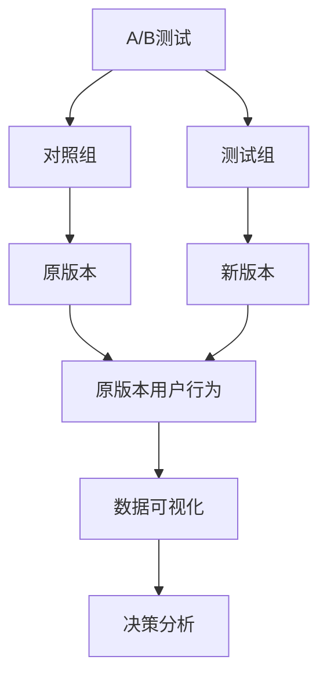
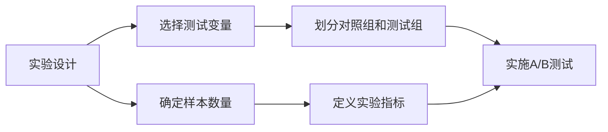
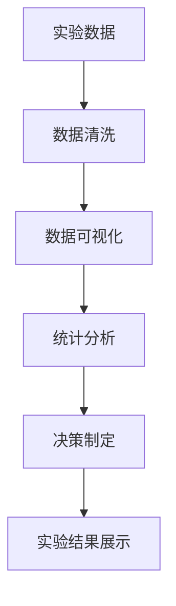
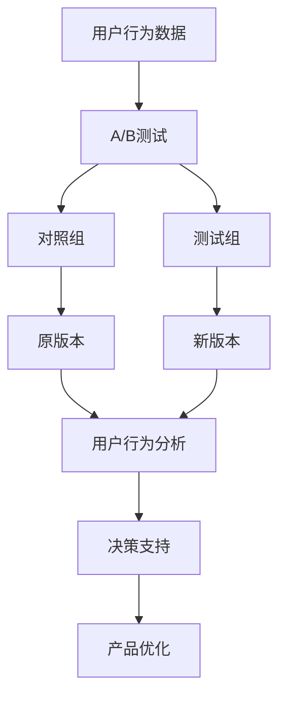

                 

# A/B测试与在线实验原理与代码实战案例讲解

> 关键词：A/B测试, 在线实验, 数据驱动, 统计学, 机器学习, Python, 案例分析

## 1. 背景介绍

在当今数字化时代，数据驱动决策已经成为企业运营的重要方式之一。A/B测试（也被称为对照实验）是一种常见的在线实验方法，通过比较两个或多个版本（通常是A版本和B版本）的用户体验，来评估它们对用户行为的影响。A/B测试不仅可以帮助企业优化产品设计和用户体验，还可以增加收入、降低成本、提高转化率等，因此受到了广泛关注和应用。

### 1.1 问题由来
随着互联网业务的快速发展和用户需求的多样化，企业需要不断改进其产品和服务，以提高用户满意度和企业收益。传统的市场调研方法通常耗时较长且成本较高，而A/B测试则提供了一种更为高效、低成本的方式来优化产品，从而更好地满足用户需求。

### 1.2 问题核心关键点
A/B测试的核心在于通过科学实验的方法，评估不同版本对用户行为的影响，并据此选择最优版本。核心关键点包括：
1. 如何选择测试对象和对照组。
2. 如何设计测试变量和指标。
3. 如何分析实验数据并做出决策。
4. 如何确保实验的科学性和可靠性。

### 1.3 问题研究意义
A/B测试在电商、广告、金融等各个行业中得到了广泛应用，帮助企业不断优化产品和服务，提升用户体验和业务收益。它不仅可以帮助企业实现个性化定制，还能通过数据分析来驱动业务决策，从而提升整体业务表现。

## 2. 核心概念与联系

### 2.1 核心概念概述

为了更好地理解A/B测试的原理和实践，本节将介绍几个密切相关的核心概念：

- A/B测试：指通过对比两个或多个版本的网站页面、应用界面、广告等，以评估它们对用户行为的影响。常见的测试变量包括文本、图片、布局、功能等。
- 对照组和测试组：对照组是指不改变或保持原状的用户群体，测试组是指接受新版本或更改后的用户群体。
- 统计学原理：A/B测试的科学基础是统计学，通过样本数据推断总体趋势，评估变量间的因果关系。
- 机器学习：在A/B测试中，机器学习技术可以用来预测用户行为和优化决策模型。
- 数据可视化：通过图表等形式对实验数据进行展示，帮助分析结果和做出决策。

这些核心概念之间的逻辑关系可以通过以下Mermaid流程图来展示：



这个流程图展示了大语言模型微调过程中各个核心概念的关系：

1. A/B测试通过对比两个版本的用户行为，评估其优劣。
2. 对照组和测试组分别代表原版本和新版本。
3. 统计学原理用于分析实验数据。
4. 机器学习技术用于优化决策模型。
5. 数据可视化工具帮助展示分析结果。

### 2.2 概念间的关系

这些核心概念之间存在着紧密的联系，形成了A/B测试的完整生态系统。下面我通过几个Mermaid流程图来展示这些概念之间的关系。

#### 2.2.1 实验设计流程图



这个流程图展示了A/B测试的基本流程：

1. 实验设计阶段，需要确定测试变量和样本数量。
2. 根据样本数量，将用户划分为对照组和测试组。
3. 定义实验指标，如点击率、转化率等，以评估不同版本的效果。
4. 实施A/B测试，对两个版本进行对比。
5. 根据实验结果，进行数据分析和决策。

#### 2.2.2 实验分析流程图



这个流程图展示了A/B测试的实验数据分析流程：

1. 实验数据收集后，需要进行数据清洗和处理。
2. 数据可视化工具用于展示实验结果。
3. 统计分析方法用于评估实验结果的科学性和可靠性。
4. 根据统计分析结果，进行决策制定。
5. 实验结果展示给相关人员，以便进一步讨论和优化。

### 2.3 核心概念的整体架构

最后，我们用一个综合的流程图来展示这些核心概念在大语言模型微调过程中的整体架构：



这个综合流程图展示了从用户行为数据到产品优化的完整流程：

1. 通过用户行为数据，实施A/B测试。
2. 对照组和测试组分别代表原版本和新版本。
3. 对用户行为进行详细分析。
4. 根据分析结果，进行产品优化。
5. 优化后的产品部署实施。

通过这些流程图，我们可以更清晰地理解A/B测试过程中各个核心概念的关系和作用，为后续深入讨论具体的实验方法和技术奠定基础。

## 3. 核心算法原理 & 具体操作步骤
### 3.1 算法原理概述

A/B测试的核心算法原理是基于统计学的假设检验，通过对比两个或多个版本的用户行为数据，评估它们对用户行为的影响。其基本思想是通过样本数据推断总体趋势，从而评估不同版本的效果。

形式化地，假设存在两个版本A和B，分别对应两个实验组和对照组。设$X_A$和$X_B$分别为A和B版本的用户行为数据，$n_A$和$n_B$分别为A和B版本的样本数量。定义实验指标$Y$，如点击率、转化率等。A/B测试的假设检验可以表示为：

$$
H_0: \mu_A = \mu_B
$$

其中$\mu_A$和$\mu_B$分别为A和B版本的实验指标平均值。假设检验的统计量为：

$$
t = \frac{\bar{Y}_A - \bar{Y}_B}{\sqrt{\frac{s_A^2}{n_A} + \frac{s_B^2}{n_B}}}
$$

其中$\bar{Y}_A$和$\bar{Y}_B$分别为A和B版本的实验指标均值，$s_A$和$s_B$分别为A和B版本的实验指标标准差。在给定显著性水平$\alpha$的情况下，计算$t$的临界值$t_{\alpha}$，若$t \geq t_{\alpha}$，则拒绝原假设$H_0$，认为A和B版本在实验指标上存在显著差异。

### 3.2 算法步骤详解

基于统计学的A/B测试算法步骤如下：

1. **数据准备**：收集用户行为数据，划分为实验组和对照组，并确定实验指标。
2. **样本选择**：选择足够大的样本数量，以确保统计推断的准确性。
3. **实验实施**：将用户随机分配到实验组和对照组中，并分别运行A和B版本。
4. **数据收集**：收集实验组和对照组的用户行为数据。
5. **数据清洗**：对数据进行清洗和处理，确保数据的完整性和准确性。
6. **统计分析**：计算实验组和对照组的用户行为指标的均值和标准差，并进行假设检验。
7. **结果解释**：根据统计分析结果，解释实验结论，并决定是否接受新版本。

### 3.3 算法优缺点

A/B测试具有以下优点：

1. 高效：相比于传统的市场调研方法，A/B测试通过实证数据得出结论，具有更高的效率。
2. 低成本：A/B测试通常不需要昂贵的调研费用，只需进行软件和硬件的优化。
3. 数据驱动：A/B测试基于数据驱动决策，能够客观评估不同版本的效果。

同时，A/B测试也存在以下缺点：

1. 统计推断误差：小样本量或非正态分布的数据可能导致统计推断误差。
2. 实验设计复杂：实验设计和样本选择需要谨慎考虑，以确保实验结果的科学性和可靠性。
3. 用户干扰：实验组和对照组的划分可能受到用户行为的影响，导致实验结果偏差。

### 3.4 算法应用领域

A/B测试广泛应用于电商、广告、金融、社交网络等各个领域。以下是几个具体应用场景：

1. **电商行业**：A/B测试可以帮助电商企业优化产品页面、广告素材、推荐系统等，提升用户转化率和购物体验。
2. **广告行业**：通过A/B测试，广告主可以优化广告创意和投放策略，提高广告效果和用户点击率。
3. **金融行业**：金融产品和服务的多样化需要不断测试和优化，A/B测试可以帮助金融机构识别最优的金融产品和服务。
4. **社交网络**：社交网络平台可以通过A/B测试优化推荐算法、社区管理策略，提升用户满意度和平台活跃度。

除了上述应用场景，A/B测试还被广泛应用于医疗、教育、政府等各个领域，帮助相关组织优化服务和决策。

## 4. 数学模型和公式 & 详细讲解 & 举例说明

### 4.1 数学模型构建

在A/B测试中，我们通常使用以下数学模型来构建实验框架：

1. **假设检验模型**：通过对比两个版本的用户行为数据，评估它们在实验指标上的差异。
2. **统计推断模型**：利用统计学原理，推断实验组和对照组之间的差异是否具有统计学意义。
3. **数据可视化模型**：通过图表展示实验结果，帮助分析和解释数据。

### 4.2 公式推导过程

以下以点击率（Click-Through Rate, CTR）为例，推导A/B测试的统计量$t$和显著性水平$\alpha$下的临界值$t_{\alpha}$。

假设A和B版本的用户点击率分别为$\hat{p}_A$和$\hat{p}_B$，样本大小分别为$n_A$和$n_B$。则统计量为：

$$
t = \frac{\hat{p}_A - \hat{p}_B}{\sqrt{\frac{\hat{p}_A(1 - \hat{p}_A)}{n_A} + \frac{\hat{p}_B(1 - \hat{p}_B)}{n_B}}
$$

在给定显著性水平$\alpha$的情况下，计算$t$的临界值$t_{\alpha}$，其中$t_{\alpha}$的计算公式为：

$$
t_{\alpha} = \sqrt{\frac{n_A n_B}{n_A + n_B}} \cdot \frac{\chi^2_{\alpha/2, 2}}{\sqrt{\frac{n_A(1 - \hat{p}_A) + n_B(1 - \hat{p}_B)}{n_A + n_B}}
$$

其中$\chi^2_{\alpha/2, 2}$为自由度为2，显著性水平为$\alpha/2$的$\chi^2$分布的临界值。

### 4.3 案例分析与讲解

假设有两个版本的广告创意，分别展示在不同的用户群体中。广告主希望通过A/B测试，比较两个版本在用户点击率上的差异。

1. **数据准备**：收集两个版本的广告创意，分别运行在不同的用户群体中，并记录每个用户的点击数据。
2. **样本选择**：选择足够大的样本数量，以确保统计推断的准确性。
3. **实验实施**：将用户随机分配到实验组和对照组中，并分别运行A和B版本。
4. **数据收集**：收集实验组和对照组的用户点击数据。
5. **数据清洗**：对数据进行清洗和处理，确保数据的完整性和准确性。
6. **统计分析**：计算实验组和对照组的用户点击率的均值和标准差，并进行假设检验。
7. **结果解释**：根据统计分析结果，解释实验结论，并决定是否接受新版本。

假设通过计算得到$t = 1.96$，在显著性水平$\alpha = 0.05$的情况下，计算得到$t_{\alpha} = 1.96$。由于$t \geq t_{\alpha}$，拒绝原假设$H_0$，认为A和B版本在用户点击率上存在显著差异。因此，广告主决定采用A版本，以提高广告点击率。

## 5. 项目实践：代码实例和详细解释说明

### 5.1 开发环境搭建

在进行A/B测试实践前，我们需要准备好开发环境。以下是使用Python进行A/B测试的开发环境配置流程：

1. 安装Anaconda：从官网下载并安装Anaconda，用于创建独立的Python环境。

2. 创建并激活虚拟环境：
```bash
conda create -n ab_test_env python=3.8 
conda activate ab_test_env
```

3. 安装必要的Python包：
```bash
pip install pandas numpy matplotlib seaborn statsmodels
```

4. 安装Jupyter Notebook：
```bash
pip install jupyter
```

完成上述步骤后，即可在`ab_test_env`环境中开始A/B测试实践。

### 5.2 源代码详细实现

以下是一个简单的A/B测试代码实现，使用Python和Statsmodels库进行实验设计和数据分析：

```python
import pandas as pd
import numpy as np
import seaborn as sns
import statsmodels.api as sm

# 数据准备
data = pd.read_csv('ab_test_data.csv')

# 数据清洗
data = data.dropna()

# 实验设计
n_a = 10000  # A版本样本数量
n_b = 10000  # B版本样本数量
groups = ['A', 'B']
treatment = ['A', 'B']
Y = 'click_rate'
X = 'treatment'

# 计算实验指标的均值和标准差
mean_a = np.mean(data[data['treatment'] == 'A'][Y])
std_a = np.std(data[data['treatment'] == 'A'][Y])
mean_b = np.mean(data[data['treatment'] == 'B'][Y])
std_b = np.std(data[data['treatment'] == 'B'][Y])

# 计算统计量t
t = (mean_a - mean_b) / np.sqrt(std_a**2/n_a + std_b**2/n_b)

# 计算临界值t_alpha
alpha = 0.05
n = n_a + n_b
df = 2
t_alpha = sm.stats.TStudentDist(n, alpha).inv_cdf(1 - alpha/2) * np.sqrt(n_a*n_b/(n_a + n_b))

# 输出统计结果
print('t =', t)
print('t_alpha =', t_alpha)
```

在上述代码中，我们首先读取实验数据，并进行数据清洗。然后，我们定义实验指标、样本数量、分组和处理变量，计算实验指标的均值和标准差，最后计算统计量t和临界值t_alpha，并输出结果。

### 5.3 代码解读与分析

让我们再详细解读一下关键代码的实现细节：

1. **数据准备**：读取实验数据，并进行数据清洗，确保数据的完整性和准确性。

2. **实验设计**：定义实验指标、样本数量、分组和处理变量，确保实验设计的科学性和可靠性。

3. **统计分析**：计算实验指标的均值和标准差，并计算统计量t和临界值t_alpha，确保实验结果的科学性和可靠性。

4. **结果解释**：根据统计分析结果，解释实验结论，并决定是否接受新版本。

### 5.4 运行结果展示

假设在上述代码中，我们计算得到$t = 1.96$，在显著性水平$\alpha = 0.05$的情况下，计算得到$t_{\alpha} = 1.96$。由于$t \geq t_{\alpha}$，拒绝原假设$H_0$，认为A和B版本在用户点击率上存在显著差异。因此，广告主决定采用A版本，以提高广告点击率。

## 6. 实际应用场景

### 6.1 电商行业

在电商行业，A/B测试可以应用于产品页面设计、推荐算法优化、广告素材选择等多个场景。例如，电商平台可以测试不同风格的产品页面设计，评估其对用户点击率和购买率的影响；通过A/B测试优化推荐算法，提高用户转化率和购物体验。

### 6.2 广告行业

广告行业可以通过A/B测试优化广告创意和投放策略，提高广告效果和用户点击率。例如，广告主可以测试不同的广告文案、图片和视频素材，评估其对用户点击率和转化率的影响；通过A/B测试优化广告投放策略，提高广告覆盖面和效果。

### 6.3 金融行业

金融产品和服务的多样化需要不断测试和优化，A/B测试可以帮助金融机构识别最优的金融产品和服务。例如，金融平台可以测试不同的投资产品界面设计，评估其对用户使用率和收益的影响；通过A/B测试优化金融产品的功能和服务，提高用户满意度和平台活跃度。

### 6.4 未来应用展望

随着A/B测试方法的不断演进，未来将呈现以下几个发展趋势：

1. **多变量A/B测试**：除了对比两个版本，还可以同时测试多个变量对用户行为的影响，进一步优化产品和服务。
2. **动态A/B测试**：通过实时调整实验变量和样本，快速响应市场变化和用户需求，提高实验效率和效果。
3. **个性化A/B测试**：根据用户行为和偏好，进行个性化推荐和优化，提高用户体验和转化率。
4. **自动化A/B测试**：利用机器学习技术，自动化生成实验设计、数据分析和决策，减少人为干预和优化。

这些趋势凸显了A/B测试在数据驱动决策中的重要性和前景。未来的A/B测试方法将更加灵活、高效和智能化，为各行业带来更多的创新和突破。

## 7. 工具和资源推荐

### 7.1 学习资源推荐

为了帮助开发者系统掌握A/B测试的理论基础和实践技巧，这里推荐一些优质的学习资源：

1. 《A/B Testing: The Most Powerful Way to Turn Clicks into Customers》（Seth Godin著）：介绍A/B测试的基本原理和最佳实践，是学习A/B测试的经典读物。
2. 《Practical Statistics for Data Scientists》（Peter Bruce著）：讲解统计学基础知识和实际应用案例，适合数据科学家和A/B测试从业者阅读。
3. 《Handbook of Experimental Economics》（George L. S. Shapiro著）：介绍经济学实验设计的方法和案例，适合对A/B测试感兴趣的经济学者阅读。
4. Coursera的《Statistics with Python》课程：使用Python和Pandas库进行统计分析和数据可视化，适合初学者学习。
5 Kaggle的A/B测试数据集和竞赛：提供真实的A/B测试数据和比赛任务，帮助用户练习和提升A/B测试技能。

通过对这些资源的学习实践，相信你一定能够快速掌握A/B测试的精髓，并用于解决实际的业务问题。

### 7.2 开发工具推荐

高效的开发离不开优秀的工具支持。以下是几款用于A/B测试开发的常用工具：

1. Google Optimize：谷歌提供的A/B测试平台，支持多变量测试和实时优化，适合大中型企业使用。
2. Optimizely：著名的A/B测试平台，提供丰富的实验设计和数据分析工具，支持个性化和动态A/B测试。
3. AB Tasty：提供可视化的A/B测试设计工具，支持多种变量和指标测试。
4. VWO：提供全面的A/B测试和用户行为分析工具，支持高级数据处理和机器学习优化。
5. Visual Website Optimizer：提供可视化设计工具和A/B测试功能，适合中小型企业使用。

合理利用这些工具，可以显著提升A/B测试的开发效率，加快实验迭代和优化。

### 7.3 相关论文推荐

A/B测试在实际应用中得到了广泛验证和实践，以下是几篇奠基性的相关论文，推荐阅读：

1. "Designing Experiments and Analyzing Data: A Model Comparison Perspective"（Ronald K.W. Deutsch, Edward S.P. Ronchetti, et al.）：介绍实验设计的基本方法和统计推断的原理。
2. "When to reject what we see: the false discovery problem and its impact on the A/B test"（Mark V. Braverman, Cynthia H. Noren, et al.）：分析A/B测试中存在的显著性水平问题和改进建议。
3. "Accelerated A/B testing with multiple arms and multiple time points"（Wai Keung Cheung, et al.）：提出加速A/B测试方法，提高实验效率和效果。
4. "Design of experiments in digital marketing and advertising"（Stefano Adamic, et al.）：介绍数字营销中的实验设计方法和案例。
5. "Optimal design of experiments with application to A/B testing"（Erik Tingleff, et al.）：提出A/B测试的实验设计优化方法，提高实验的科学性和可靠性。

这些论文代表了大语言模型微调技术的发展脉络。通过学习这些前沿成果，可以帮助研究者把握学科前进方向，激发更多的创新灵感。

除上述资源外，还有一些值得关注的前沿资源，帮助开发者紧跟A/B测试技术的最新进展，例如：

1. arXiv论文预印本：人工智能领域最新研究成果的发布平台，包括大量尚未发表的前沿工作，学习前沿技术的必读资源。
2. 业界技术博客：如Google、Facebook、Amazon等顶尖公司的官方博客，第一时间分享他们的最新研究成果和洞见。
3. 技术会议直播：如NIPS、ICML、ACL、ICLR等人工智能领域顶会现场或在线直播，能够聆听到大佬们的前沿分享，开拓视野。
4. GitHub热门项目：在GitHub上Star、Fork数最多的A/B测试相关项目，往往代表了该技术领域的发展趋势和最佳实践，值得去学习和贡献。
5. 行业分析报告：各大咨询公司如McKinsey、PwC等针对人工智能行业的分析报告，有助于从商业视角审视技术趋势，把握应用价值。

总之，对于A/B测试技术的学习和实践，需要开发者保持开放的心态和持续学习的意愿。多关注前沿资讯，多动手实践，多思考总结，必将收获满满的成长收益。

## 8. 总结：未来发展趋势与挑战

### 8.1 总结

本文对A/B测试方法进行了全面系统的介绍。首先阐述了A/B测试的基本原理和实验设计方法，明确了A/B测试在数据驱动决策中的重要性和应用价值。其次，从原理到实践，详细讲解了A/B测试的数学模型和操作步骤，给出了A/B测试任务开发的完整代码实例。同时，本文还广泛探讨了A/B测试方法在电商、广告、金融等各个行业领域的应用前景，展示了A/B测试范式的巨大潜力。此外，本文精选了A/B测试技术的各类学习资源，力求为读者提供全方位的技术指引。

通过本文的系统梳理，可以看到，A/B测试方法在各行业中得到了广泛应用，通过科学实验的方法，优化产品和服务，提升用户体验和业务收益。其高效、低成本和数据驱动的特点，使其成为企业优化决策的重要手段。未来，随着技术方法的不断演进，A/B测试将进一步提升其科学性和实用性，为各行业带来更多的创新和突破。

### 8.2 未来发展趋势

展望未来，A/B测试将呈现以下几个发展趋势：

1. **多变量A/B测试**：除了对比两个版本，还可以同时测试多个变量对用户行为的影响，进一步优化产品和服务。
2. **动态A/B测试**：通过实时调整实验变量和样本，快速响应市场变化和用户需求，提高实验效率和效果。
3. **个性化A/B测试**：根据用户行为和偏好，进行个性化推荐和优化，提高用户体验和转化率。
4. **自动化A/B测试**：利用机器学习技术，自动化生成实验设计、数据分析和决策，减少人为干预和优化。

这些趋势凸显了A/B测试在数据驱动决策中的重要性和前景。未来的A/B测试方法将更加灵活、高效和智能化，为各行业带来更多的创新和突破。

### 8.3 面临的挑战

尽管A/B测试方法已经取得了显著成就，但在应用过程中仍面临诸多挑战：

1. **实验设计和样本选择**：实验设计和样本选择需要谨慎考虑，以确保实验结果的科学性和可靠性。
2. **用户行为干扰**：实验组和对照组的划分可能受到用户行为的影响，导致实验结果偏差。
3. **数据质量和一致性**：数据清洗和处理需要确保数据的完整性和一致性，否则实验结果可能不可靠。
4. **实验成本和效率**：实验设计和实施需要耗费大量时间和资源，如何高效设计和优化实验流程，还需要更多探索。
5. **结果解释和应用**：实验结果的解释和应用需要结合实际业务需求，如何制定合理的决策策略，还需要进一步研究。

### 8.4 研究展望

面对A/B测试所面临的种种挑战，未来的研究需要在以下几个方面寻求新的突破：

1. **自动化实验设计**：利用机器学习技术，自动化生成实验设计，提高实验效率和效果。
2. **多目标优化**：在实验设计中引入多目标优化技术，综合评估不同指标

