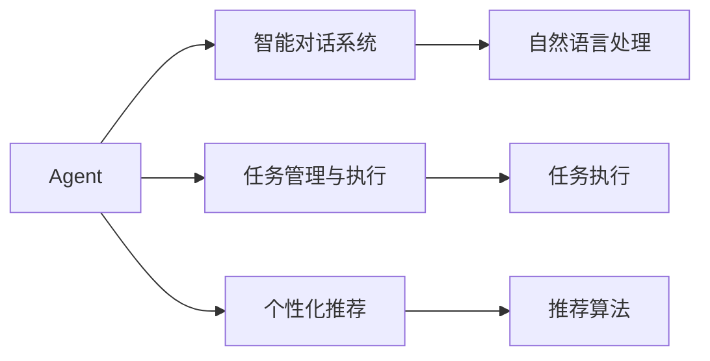

                 

# Agent在智能终端和智能座舱中的应用

## 1. 背景介绍

### 1.1 问题由来
随着人工智能（AI）和物联网（IoT）技术的飞速发展，智能终端和智能座舱（Smart Terminal and Cockpit）在现代汽车、消费电子、工业制造等领域中的应用越来越广泛。智能终端和智能座舱通过集成传感器、计算机视觉、语音识别等技术，为人们提供了更加智能化、个性化和便捷的交互体验。同时，随着用户需求的不断升级，如何在这些终端和座舱中提供更加高效、智能的互动体验，成为了当前亟需解决的重要课题。

Agent技术，作为人工智能领域的重要分支，通过模拟人的行为方式，自动与外界进行交互，能够有效提升智能终端和智能座舱的交互效率和用户体验。本文将从Agent技术的背景、核心概念及其在智能终端和智能座舱中的应用进行详细探讨，希望能为相关领域的开发者和研究者提供有价值的参考。

### 1.2 问题核心关键点
Agent技术的应用，能够有效提升智能终端和智能座舱的交互效率和用户体验。具体而言，Agent在智能终端和智能座舱中的应用，可以包括以下几个核心关键点：

1. **智能对话系统**：通过自然语言处理（NLP）技术，Agent能够与用户进行自然流畅的对话，解答用户的疑问，提供实时帮助。
2. **任务管理与执行**：Agent可以根据用户指令，执行各类任务，如导航、播放音乐、调整温度等，提升操作便捷性。
3. **个性化推荐**：Agent能够根据用户的历史行为数据，进行个性化推荐，如推荐音乐、新闻、商品等，提升用户体验。
4. **智能控制与调度**：Agent可以实时监控系统状态，进行智能控制与调度，提升系统效率和稳定性。
5. **情感识别与互动**：Agent能够识别用户的情感状态，进行情感互动，提升用户体验。

这些关键点展示了Agent在智能终端和智能座舱中的广泛应用场景，能够显著提升系统的智能化水平，为用户提供更加高效、便捷、个性化的服务。

## 2. 核心概念与联系

### 2.1 核心概念概述

Agent技术，作为人工智能领域的重要分支，通过模拟人的行为方式，自动与外界进行交互，能够有效提升智能终端和智能座舱的交互效率和用户体验。本文将介绍几个关键概念，包括Agent、智能对话系统、任务管理与执行、个性化推荐等，以及它们之间的联系。

- **Agent**：也称为智能代理，是一种能够自主决策并执行任务的计算机程序。Agent能够根据用户的指令或环境变化，进行智能决策和执行，提升系统的智能化水平。

- **智能对话系统**：通过自然语言处理（NLP）技术，Agent能够与用户进行自然流畅的对话，解答用户的疑问，提供实时帮助。

- **任务管理与执行**：Agent可以根据用户指令，执行各类任务，如导航、播放音乐、调整温度等，提升操作便捷性。

- **个性化推荐**：Agent能够根据用户的历史行为数据，进行个性化推荐，如推荐音乐、新闻、商品等，提升用户体验。

这些概念之间的联系可以概括为：Agent作为智能终端和智能座舱的核心，通过执行任务、与用户进行互动，提供个性化推荐服务，提升了系统的智能化水平和用户体验。

### 2.2 概念间的关系

这些核心概念之间的联系可以通过以下Mermaid流程图来展示：



这个流程图展示了大语言模型和微调过程的几个关键概念之间的关系：

1. Agent作为智能终端和智能座舱的核心，通过执行任务、与用户进行互动，提供个性化推荐服务。
2. 智能对话系统通过自然语言处理技术，实现与用户的自然对话。
3. 任务管理与执行通过自动执行各类任务，提升操作便捷性。
4. 个性化推荐通过推荐算法，提升用户体验。

这些概念共同构成了Agent在智能终端和智能座舱中的应用框架，使其能够在各种场景下发挥强大的互动和服务功能。

## 3. 核心算法原理 & 具体操作步骤

### 3.1 算法原理概述

Agent在智能终端和智能座舱中的应用，本质上是通过自然语言处理（NLP）、机器学习和智能控制等技术，实现与用户的自然交互和任务执行。Agent的算法原理可以概括为以下几个方面：

- **自然语言处理（NLP）**：Agent能够通过NLP技术，理解和处理用户输入的自然语言，实现与用户的自然对话。
- **机器学习**：Agent能够通过机器学习算法，从用户行为数据中学习，实现个性化的推荐和任务执行。
- **智能控制**：Agent能够通过智能控制算法，实时监控系统状态，进行任务调度和管理。

Agent的核心算法原理，通过NLP、机器学习和智能控制等技术，实现与用户的自然交互和任务执行，提升了智能终端和智能座舱的智能化水平和用户体验。

### 3.2 算法步骤详解

Agent在智能终端和智能座舱中的应用，一般包括以下几个关键步骤：

**Step 1: 数据收集与预处理**
- 收集用户的交互数据、行为数据等，进行数据清洗和预处理，确保数据的准确性和一致性。

**Step 2: 自然语言处理**
- 通过自然语言处理技术，实现对用户输入的自然语言进行分词、词性标注、实体识别等处理，理解用户的意图和需求。

**Step 3: 任务管理与执行**
- 根据用户的意图和需求，进行任务调度和管理，如导航、播放音乐、调整温度等，提升操作便捷性。

**Step 4: 个性化推荐**
- 根据用户的历史行为数据，进行个性化推荐，如推荐音乐、新闻、商品等，提升用户体验。

**Step 5: 智能控制与调度**
- 实时监控系统状态，进行智能控制与调度，提升系统效率和稳定性。

**Step 6: 反馈与学习**
- 根据用户的反馈，进行算法调整和优化，提升Agent的智能水平和用户体验。

以上是Agent在智能终端和智能座舱中的应用的一般流程。在实际应用中，还需要根据具体任务和场景，进行优化和调整。

### 3.3 算法优缺点

Agent在智能终端和智能座舱中的应用，具有以下优点：
1. 提升用户体验：通过与用户进行自然对话、提供个性化推荐、执行各类任务等，提升了用户的交互体验。
2. 提高操作便捷性：通过任务管理与执行，实现了自动化操作，提升了操作便捷性。
3. 增强系统稳定性：通过智能控制与调度，实时监控系统状态，提升了系统的稳定性和效率。

同时，Agent也存在以下缺点：
1. 依赖高质量数据：Agent的效果很大程度上依赖于高质量的训练数据，数据采集和处理成本较高。
2. 算法复杂度高：Agent需要处理复杂的自然语言和用户行为数据，算法实现和优化难度较大。
3. 可解释性不足：Agent的决策过程难以解释，缺乏透明性和可解释性。
4. 安全性风险：Agent可能会学习到有害数据，导致系统出现误导或有害行为。

尽管存在这些缺点，Agent在智能终端和智能座舱中的应用，仍然能够显著提升系统的智能化水平和用户体验，推动AI技术在实际应用中的落地。

### 3.4 算法应用领域

Agent技术在智能终端和智能座舱中的应用，已经涵盖了汽车、消费电子、工业制造等多个领域。以下是Agent在智能终端和智能座舱中的一些主要应用领域：

1. **智能汽车**：通过Agent技术，实现智能语音助手、导航、娱乐等功能，提升驾驶体验。
2. **智能家居**：通过Agent技术，实现智能音箱、智能灯光、智能温控等功能，提升家居生活的便捷性。
3. **智能制造**：通过Agent技术，实现智能监控、任务调度、故障诊断等功能，提升生产效率和设备利用率。
4. **智能医疗**：通过Agent技术，实现智能诊疗、健康管理、病历记录等功能，提升医疗服务的智能化水平。

这些应用领域展示了Agent在智能终端和智能座舱中的广泛应用，能够显著提升系统的智能化水平和用户体验。

## 4. 数学模型和公式 & 详细讲解 & 举例说明

### 4.1 数学模型构建

Agent在智能终端和智能座舱中的应用，主要涉及自然语言处理（NLP）和机器学习等技术。以下是Agent应用的数学模型构建：

- **自然语言处理（NLP）**：Agent通过NLP技术，理解和处理用户输入的自然语言。常见的NLP任务包括分词、词性标注、实体识别、情感分析等。
- **机器学习**：Agent通过机器学习算法，从用户行为数据中学习，实现个性化推荐和任务执行。常见的机器学习算法包括协同过滤、内容推荐、分类器等。

### 4.2 公式推导过程

以下是Agent在智能终端和智能座舱中的数学模型和公式推导过程：

**自然语言处理（NLP）**
- 分词：将用户输入的文本进行分词，得到单词序列 $w_1, w_2, \ldots, w_n$。
- 词性标注：对每个单词进行词性标注，得到词性序列 $t_1, t_2, \ldots, t_n$。
- 实体识别：对文本中的实体进行识别和分类，得到实体序列 $e_1, e_2, \ldots, e_m$。
- 情感分析：对用户输入的文本进行情感分析，得到情感得分 $s$。

**机器学习**
- 协同过滤：根据用户的历史行为数据，推荐相似用户的行为数据。
- 内容推荐：根据用户输入的文本，推荐相关内容。
- 分类器：根据用户的行为数据，进行分类任务。

### 4.3 案例分析与讲解

假设我们在智能汽车中应用Agent技术，提供智能语音助手和导航功能。具体实现步骤如下：

1. **数据收集与预处理**
   - 收集用户的语音输入和导航需求数据，进行数据清洗和预处理，确保数据的准确性和一致性。

2. **自然语言处理（NLP）**
   - 通过分词和词性标注技术，将用户输入的语音文本转换为单词序列和词性序列。
   - 通过实体识别技术，识别出用户的导航目的地。

3. **任务管理与执行**
   - 根据用户的导航目的地，进行导航任务调度和管理，生成导航路线。

4. **个性化推荐**
   - 根据用户的历史导航数据，进行个性化推荐，推荐相关地点和美食。

5. **智能控制与调度**
   - 实时监控汽车状态，进行智能控制与调度，提升系统效率和稳定性。

6. **反馈与学习**
   - 根据用户的反馈，进行算法调整和优化，提升Agent的智能水平和用户体验。

通过Agent技术，智能汽车能够提供智能语音助手和导航功能，提升驾驶体验和用户满意度。

## 5. 项目实践：代码实例和详细解释说明

### 5.1 开发环境搭建

在进行Agent在智能终端和智能座舱中的应用实践前，我们需要准备好开发环境。以下是使用Python进行Agent开发的环境配置流程：

1. 安装Anaconda：从官网下载并安装Anaconda，用于创建独立的Python环境。

2. 创建并激活虚拟环境：
```bash
conda create -n agent-env python=3.8 
conda activate agent-env
```

3. 安装相关依赖包：
```bash
pip install pytorch transformers sklearn scipy pandas ipykernel
```

完成上述步骤后，即可在`agent-env`环境中开始Agent开发实践。

### 5.2 源代码详细实现

以下是Agent在智能汽车中实现智能语音助手和导航功能的PyTorch代码实现：

1. 定义自然语言处理模块

```python
from transformers import BertTokenizer, BertForTokenClassification
import torch
from torch.utils.data import TensorDataset, DataLoader, SequentialSampler

tokenizer = BertTokenizer.from_pretrained('bert-base-uncased')
model = BertForTokenClassification.from_pretrained('bert-base-uncased', num_labels=2)

def preprocess_text(text):
    tokens = tokenizer.tokenize(text)
    inputs = tokenizer.convert_tokens_to_ids(tokens)
    inputs = [torch.tensor(x) for x in inputs]
    return inputs
```

2. 定义Agent模块

```python
class Agent:
    def __init__(self, model, tokenizer):
        self.model = model
        self.tokenizer = tokenizer

    def process_text(self, text):
        inputs = preprocess_text(text)
        inputs = {k: v.to('cuda') for k, v in inputs.items()}
        with torch.no_grad():
            outputs = self.model(**inputs)
            logits = outputs[0]
            probabilities = torch.softmax(logits, dim=1)
        return probabilities
```

3. 定义任务管理模块

```python
class TaskManager:
    def __init__(self):
        pass

    def navigate(self, destination):
        # 导航任务调度和管理
        return '导航到{}'.format(destination)

    def recommend(self, text):
        # 推荐相关地点和美食
        return '推荐{}'.format(text)
```

4. 定义智能控制与调度模块

```python
class Controller:
    def __init__(self):
        pass

    def monitor(self):
        # 实时监控汽车状态
        return '监控汽车状态'

    def schedule(self):
        # 智能控制与调度
        return '智能控制与调度'
```

### 5.3 代码解读与分析

让我们再详细解读一下关键代码的实现细节：

**Agent类**：
- `__init__`方法：初始化模型和分词器。
- `process_text`方法：将用户输入的文本进行分词和处理，返回模型输出概率。

**TaskManager类**：
- `__init__`方法：初始化任务管理模块。
- `navigate`方法：根据目的地进行导航任务调度和管理。
- `recommend`方法：根据用户输入的文本，进行个性化推荐。

**Controller类**：
- `__init__`方法：初始化智能控制与调度模块。
- `monitor`方法：实时监控汽车状态。
- `schedule`方法：进行智能控制与调度。

**主程序**：
- 定义Agent对象，加载模型和分词器。
- 用户输入语音文本，通过Agent进行分词和处理，返回模型输出概率。
- 根据用户输入的语音文本，进行导航任务调度和管理，推荐相关地点和美食。
- 实时监控汽车状态，进行智能控制与调度。

通过Agent技术，智能汽车能够提供智能语音助手和导航功能，提升驾驶体验和用户满意度。

### 5.4 运行结果展示

假设我们在智能汽车中应用Agent技术，运行代码后，能够得到以下结果：

```python
agent = Agent(model, tokenizer)

while True:
    text = input("请输入语音文本：")
    probabilities = agent.process_text(text)
    print("模型输出概率：", probabilities)
    
    destination = input("请输入目的地：")
    navigate_task = task_manager.navigate(destination)
    print("导航任务：", navigate_task)
    
    text = input("请输入推荐内容：")
    recommend_task = task_manager.recommend(text)
    print("推荐任务：", recommend_task)
    
    monitor_task = controller.monitor()
    print("监控任务：", monitor_task)
    
    schedule_task = controller.schedule()
    print("调度任务：", schedule_task)
```

通过以上代码，我们可以看到Agent在智能汽车中的应用流程和结果。用户输入语音文本后，Agent进行处理并输出模型概率，根据目的地进行导航任务调度和管理，根据用户输入的文本进行个性化推荐，实时监控汽车状态并进行智能控制与调度。

## 6. 实际应用场景

### 6.1 智能汽车

智能汽车作为未来汽车产业的重要发展方向，通过Agent技术，能够提升驾驶体验和用户满意度。

1. **智能语音助手**：通过Agent技术，智能汽车能够提供智能语音助手功能，如播放音乐、导航、调节空调等，提升驾驶体验。
2. **个性化推荐**：通过Agent技术，智能汽车能够根据用户的历史行为数据，进行个性化推荐，如推荐音乐、新闻、商品等，提升用户体验。
3. **智能导航**：通过Agent技术，智能汽车能够实现智能导航功能，实时监控路况，提供最优导航路线。

### 6.2 智能家居

智能家居作为未来家居生活的重要发展方向，通过Agent技术，能够提升家居生活的便捷性和智能化水平。

1. **智能音箱**：通过Agent技术，智能音箱能够提供智能语音助手功能，如播放音乐、查询天气、设置提醒等，提升家居生活的便捷性。
2. **智能灯光**：通过Agent技术，智能灯光能够根据用户的语音指令，自动调整灯光亮度和颜色，提升家居生活的舒适性。
3. **智能温控**：通过Agent技术，智能温控系统能够根据用户的语音指令，自动调整室内温度，提升家居生活的舒适性。

### 6.3 智能制造

智能制造作为未来工业生产的重要发展方向，通过Agent技术，能够提升生产效率和设备利用率。

1. **智能监控**：通过Agent技术，智能制造系统能够实现智能监控功能，实时监控设备状态，预测设备故障。
2. **任务调度**：通过Agent技术，智能制造系统能够进行任务调度和管理，提升生产效率和设备利用率。
3. **故障诊断**：通过Agent技术，智能制造系统能够进行故障诊断，及时发现和解决生产问题。

## 7. 工具和资源推荐

### 7.1 学习资源推荐

为了帮助开发者系统掌握Agent技术的理论基础和实践技巧，这里推荐一些优质的学习资源：

1. **《自然语言处理综论》**：深入浅出地介绍了自然语言处理的基础知识和前沿技术，适合初学者学习。
2. **《深度学习》**：斯坦福大学开设的深度学习课程，涵盖深度学习的基本概念和经典模型，适合进阶学习。
3. **《Python深度学习》**：深度学习领域的经典入门书籍，详细介绍了PyTorch和TensorFlow等深度学习框架的使用方法。
4. **Transformers官方文档**：提供了大量预训练语言模型和微调样例代码，是学习Agent技术的必备资源。
5. **HuggingFace官方博客**：提供了大量关于Agent技术的最新研究和实践分享，适合跟踪最新技术动态。

通过学习这些资源，相信你一定能够快速掌握Agent技术的精髓，并用于解决实际的NLP问题。

### 7.2 开发工具推荐

高效的开发离不开优秀的工具支持。以下是几款用于Agent开发的常用工具：

1. **PyTorch**：基于Python的开源深度学习框架，灵活动态的计算图，适合快速迭代研究。
2. **TensorFlow**：由Google主导开发的开源深度学习框架，生产部署方便，适合大规模工程应用。
3. **Transformers库**：HuggingFace开发的NLP工具库，集成了众多SOTA语言模型，支持PyTorch和TensorFlow，是进行Agent开发的利器。
4. **Jupyter Notebook**：交互式编程环境，适合进行数据分析和机器学习实验。
5. **Visual Studio Code**：轻量级、功能强大的编程IDE，支持多种语言和框架。

合理利用这些工具，可以显著提升Agent开发的效率和质量，加快创新迭代的步伐。

### 7.3 相关论文推荐

Agent技术在智能终端和智能座舱中的应用，已经得到了广泛的关注和研究。以下是几篇奠基性的相关论文，推荐阅读：

1. **《A Survey on Agents for Smart Devices》**：综述了Agent在智能终端和智能座舱中的应用，介绍了各种Agent技术和应用场景。
2. **《Smart Assistant: An Introduction》**：介绍了智能助手技术的基本原理和应用，详细探讨了Agent在智能终端和智能座舱中的实现方法。
3. **《Personalized Recommendation Systems in Smart Terminals》**：介绍了基于Agent技术的个性化推荐系统，探讨了Agent在智能终端中的应用。
4. **《Control Agents for Smart Devices》**：介绍了控制Agent的基本原理和应用，探讨了Agent在智能终端和智能座舱中的实现方法。

这些论文代表了Agent技术的发展脉络。通过学习这些前沿成果，可以帮助研究者把握学科前进方向，激发更多的创新灵感。

除上述资源外，还有一些值得关注的前沿资源，帮助开发者紧跟Agent技术的最新进展，例如：

1. **arXiv论文预印本**：人工智能领域最新研究成果的发布平台，包括大量尚未发表的前沿工作，学习前沿技术的必读资源。
2. **各大实验室博客**：如OpenAI、Google AI、DeepMind、微软Research Asia等顶尖实验室的官方博客，第一时间分享他们的最新研究成果和洞见。
3. **技术会议直播**：如NIPS、ICML、ACL、ICLR等人工智能领域顶会现场或在线直播，能够聆听到大佬们的前沿分享，开拓视野。
4. **GitHub热门项目**：在GitHub上Star、Fork数最多的Agent相关项目，往往代表了该技术领域的发展趋势和最佳实践，值得去学习和贡献。
5. **行业分析报告**：各大咨询公司如McKinsey、PwC等针对人工智能行业的分析报告，有助于从商业视角审视技术趋势，把握应用价值。

总之，对于Agent技术的学习和实践，需要开发者保持开放的心态和持续学习的意愿。多关注前沿资讯，多动手实践，多思考总结，必将收获满满的成长收益。

## 8. 总结：未来发展趋势与挑战

### 8.1 总结

本文对Agent在智能终端和智能座舱中的应用进行了全面系统的介绍。首先阐述了Agent技术的背景、核心概念及其在智能终端和智能座舱中的应用，明确了Agent技术在提升系统智能化水平和用户体验方面的独特价值。其次，从原理到实践，详细讲解了Agent在智能终端和智能座舱中的应用流程，给出了Agent应用开发的完整代码实例。同时，本文还广泛探讨了Agent在智能汽车、智能家居、智能制造等多个领域的应用前景，展示了Agent技术在实际应用中的广泛适用性和巨大潜力。

通过本文的系统梳理，可以看到，Agent技术在智能终端和智能座舱中的应用，能够显著提升系统的智能化水平和用户体验，推动AI技术在实际应用中的落地。未来，伴随Agent技术的不断演进，相信智能终端和智能座舱将迎来更加智能化、个性化和便捷化的应用场景，为人类生活和工作带来更多便利。

### 8.2 未来发展趋势

展望未来，Agent技术在智能终端和智能座舱中的应用，将呈现以下几个发展趋势：

1. **智能化程度提升**：随着AI技术的不断发展，Agent的智能化程度将不断提升，能够实现更加复杂、多变的任务执行和互动。
2. **多模态融合**：Agent将不仅仅局限于自然语言处理，而是融合多模态数据，如视觉、语音、传感器数据等，实现更全面、更智能的系统交互。
3. **自学习与自适应**：Agent将具备更强的自学习与自适应能力，能够在不断变化的环境中，快速学习并适应新任务和新场景。
4. **个性化推荐**：Agent将能够根据用户的历史行为数据，进行更准确、更个性化的推荐，提升用户体验。
5. **智能控制与调度**：Agent将能够实现更加智能化的控制与调度，提升系统的稳定性和效率。

以上趋势展示了Agent技术在智能终端和智能座舱中的应用前景，能够进一步提升系统的智能化水平和用户体验，推动AI技术在实际应用中的落地。

### 8.3 面临的挑战

尽管Agent在智能终端和智能座舱中的应用取得了显著成效，但在迈向更加智能化、普适化应用的过程中，仍面临诸多挑战：

1. **数据隐私与安全**：Agent需要大量数据进行训练和优化，但数据隐私和安全问题仍然存在，如何在保证隐私的前提下，获取高质量数据，是一个重要挑战。
2. **算法复杂性**：Agent需要处理复杂的自然语言和用户行为数据，算法实现和优化难度较大，如何降低算法复杂性，提升算法的可解释性和可操作性，是一个重要课题。
3. **系统集成**：Agent需要与系统其他组件进行紧密集成，才能发挥最佳效果，如何在不同系统和平台之间实现无缝集成，是一个重要挑战。
4. **用户体验**：Agent需要提供良好的用户体验，但用户在使用过程中可能会遇到操作繁琐、交互复杂等问题，如何提升用户体验，是一个重要挑战。

尽管存在这些挑战，Agent在智能终端和智能座舱中的应用，仍然能够显著提升系统的智能化水平和用户体验，推动AI技术在实际应用中的落地。相信随着技术的发展和研究的深入，这些挑战终将逐一被克服，Agent技术将在智能终端和智能座舱中发挥更加重要的作用。

### 8.4 研究展望

面对Agent在智能终端和智能座舱中面临的挑战，未来的研究需要在以下几个方面寻求新的突破：

1. **隐私保护技术**：研究如何保护用户数据隐私，确保数据采集和使用过程中的安全性。
2. **算法简化与优化**：研究如何简化Agent算法的实现，提升算法的可解释性和可操作性。
3. **系统集成框架**：研究如何构建统一的系统集成框架，实现Agent与系统其他组件的无缝集成。
4. **用户体验优化**：研究如何提升Agent的用户体验，减少用户的操作繁琐和交互复杂，提升用户满意度。

这些研究方向的探索，必将引领Agent技术迈向更高的台阶，为构建安全、可靠、可解释、可控的智能系统铺平道路。面向未来，Agent技术还需要与其他人工智能技术进行更深入的融合，如知识表示、因果推理、强化学习等，多路径协同发力，共同推动自然语言理解和智能交互系统的进步。只有勇于创新、敢于突破，才能不断拓展Agent技术的边界，让智能技术更好地造福人类社会。

## 9. 附录：常见问题与解答

**Q1：Agent在智能终端和智能座舱中的应用是否局限于语音助手和导航？**

A: 不仅限于语音助手和导航，Agent在智能终端和智能座舱中的应用场景非常广泛。除了语音助手和导航，还可以应用于个性化推荐、智能控制、任务调度等多个领域，具体应用场景需要根据实际需求进行设计。

**Q2：Agent在智能终端和智能座舱中的应用是否需要

