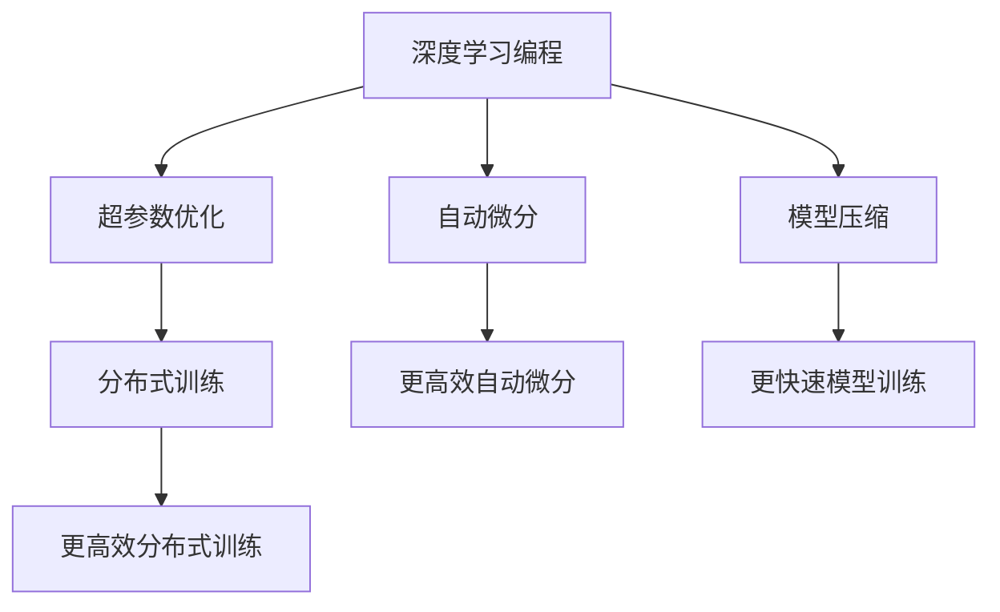

                 

## 1. 背景介绍

### 1.1 问题由来
随着深度学习在计算机视觉、自然语言处理等领域取得的巨大成功，越来越多的科研人员和工程师开始转向研究如何更有效地使用AI编程来加速模型训练和优化。其中，机器学习领域的知名专家、斯坦福大学教授Andrej Karpathy在多次讲座、博客和社交媒体上发表了很多关于这一主题的见解。

### 1.2 问题核心关键点
Andrej Karpathy多次强调，当前的深度学习编程范式过于复杂、繁琐且容易出错。比如，传统的深度学习编程模型通常需要手动调整超参数、设计复杂的正则化技术，这些工作会消耗大量时间和精力。而现代的AI编程新范式旨在通过更简单、更灵活、更高效的方式来减少开发者的工作负担，提升模型的训练和优化效率。

### 1.3 问题研究意义
了解Andrej Karpathy提出的新范式，对于深度学习从业者、开发者和研究人员来说，不仅有助于提升工作效率，还能加速模型训练，推动AI技术的进一步发展。本文将基于Karpathy的观点，深入探讨AI编程的新范式，包括其基本概念、具体操作方法以及优缺点。

## 2. 核心概念与联系

### 2.1 核心概念概述

为了更好地理解Andrej Karpathy提出的新范式，本节将介绍几个关键的概念：

- **深度学习编程**：指的是使用深度学习框架（如PyTorch、TensorFlow等）进行模型训练和优化的过程。
- **超参数优化**：指手动调整模型的学习率、批大小、正则化系数等参数的过程。
- **自动微分**：一种自动计算导数的技术，通过反向传播算法自动推导模型的梯度，避免了手动计算的繁琐。
- **模型压缩**：指通过剪枝、量化、压缩等技术减少模型大小，提升训练和推理速度的过程。
- **分布式训练**：指将模型训练任务分配到多个计算设备上并行执行的过程。

这些概念构成了现代深度学习编程的基础，Karpathy的新范式正是基于这些基础之上，通过一系列技术创新，进一步提升了AI编程的效率和效果。

### 2.2 概念间的关系

通过以下Mermaid流程图，可以更好地理解这些核心概念之间的关系：



这个流程图展示了深度学习编程的各个组成部分以及新范式的技术改进点。例如，自动微分通过更高效的技术，使得模型训练更加快捷；模型压缩则显著缩短了模型的训练时间，并提高了推理速度。这些技术创新都是为了提升整个AI编程的效率和效果。

## 3. 核心算法原理 & 具体操作步骤
### 3.1 算法原理概述

Andrej Karpathy提出的AI编程新范式基于以下几个核心原理：

- **自动微分**：使用自动微分技术，自动计算模型的梯度，从而避免了手动计算的繁琐和错误。
- **模型压缩**：通过剪枝、量化等技术，减少模型的参数量和计算量，提升训练和推理效率。
- **分布式训练**：将模型训练任务分配到多个计算设备上，并行执行，大大缩短了训练时间。
- **数据增强**：通过图像旋转、平移、缩放等技术，扩充训练数据集，提高了模型的泛化能力。

这些技术手段的结合，使得AI编程的效率和效果得到了大幅提升。

### 3.2 算法步骤详解

基于上述原理，Andrej Karpathy提出的新范式具体步骤如下：

1. **数据预处理**：将原始数据进行归一化、标准化等处理，准备好用于模型训练的数据集。
2. **模型选择与搭建**：根据任务需求，选择合适的预训练模型，并在其基础上进行微调或构建新模型。
3. **超参数配置**：通过网格搜索、贝叶斯优化等方法，自动调整模型的超参数，找到最优参数组合。
4. **分布式训练**：将模型训练任务分配到多个计算设备上，并行执行，加速模型训练。
5. **模型压缩**：在模型训练完成后，进行模型压缩，如剪枝、量化等，减少模型大小，提升推理速度。
6. **模型评估与优化**：在测试集上评估模型性能，通过正则化、对抗训练等技术，进一步优化模型。

### 3.3 算法优缺点

Andrej Karpathy提出的新范式具有以下优点：

- **提升效率**：自动微分、模型压缩、分布式训练等技术大幅提高了AI编程的效率，减少了人工工作量。
- **提高效果**：通过更高效的模型训练和优化方法，提升了模型的精度和泛化能力。
- **降低成本**：减少了手动调整超参数和手动计算梯度的繁琐工作，降低了开发成本。

同时，新范式也存在一些缺点：

- **技术门槛**：对于一些技术新手，掌握这些新技术可能需要一定的时间和学习成本。
- **资源需求高**：分布式训练和模型压缩等技术需要高性能的计算设备和大量的计算资源。
- **灵活性不足**：对于一些复杂、多变的网络结构，新范式可能不够灵活。

### 3.4 算法应用领域

Andrej Karpathy提出的新范式已经在多个领域得到了应用，包括但不限于以下几个方面：

- **计算机视觉**：通过自动微分、模型压缩等技术，提高了图像分类、目标检测等任务的精度和效率。
- **自然语言处理**：使用分布式训练、超参数优化等技术，提升了机器翻译、情感分析等任务的性能。
- **生成对抗网络（GANs）**：通过模型压缩、对抗训练等技术，提高了GANs生成图像的逼真度和多样性。
- **强化学习**：使用分布式训练、模型压缩等技术，加速了复杂强化学习算法的训练过程。

## 4. 数学模型和公式 & 详细讲解  
### 4.1 数学模型构建

在Karpathy的新范式中，模型的构建主要依赖于深度学习框架和自动微分技术。以下是一个简单的神经网络模型：

$$
h_i = W_i x_i + b_i
$$

$$
y = \sigma(W_h h_i + b_h)
$$

其中，$h_i$ 表示第 $i$ 层的输出，$x_i$ 表示输入，$W_i$ 和 $b_i$ 是第 $i$ 层的权重和偏置，$\sigma$ 表示激活函数。

### 4.2 公式推导过程

为了便于理解，下面对公式的推导过程进行详细讲解。

首先，我们需要求出模型 $y$ 对输入 $x$ 的导数，即 $\frac{\partial y}{\partial x}$。根据链式法则，有：

$$
\frac{\partial y}{\partial x} = \frac{\partial y}{\partial h_i} \frac{\partial h_i}{\partial x}
$$

其中，$\frac{\partial y}{\partial h_i}$ 表示输出 $y$ 对隐藏层 $h_i$ 的导数，可以通过反向传播算法自动求得。$\frac{\partial h_i}{\partial x}$ 表示隐藏层 $h_i$ 对输入 $x$ 的导数，也可以通过反向传播算法自动求得。

### 4.3 案例分析与讲解

以图像分类任务为例，假设我们有一个简单的卷积神经网络（CNN）模型，输入是 $x$，输出是 $y$。通过反向传播算法，我们可以自动求得模型的梯度，然后进行参数更新。

假设我们有一张图像 $x$，将其输入到模型中，得到输出 $y$。然后，我们将 $y$ 与真实标签 $y_{true}$ 进行比较，得到损失函数 $L$。通过反向传播算法，我们可以自动求得损失函数 $L$ 对模型参数 $W$ 和 $b$ 的梯度，然后进行参数更新。

## 5. 项目实践：代码实例和详细解释说明
### 5.1 开发环境搭建

为了进行AI编程新范式的实践，我们需要准备好开发环境。以下是使用PyTorch进行深度学习开发的环境配置流程：

1. 安装Anaconda：从官网下载并安装Anaconda，用于创建独立的Python环境。

2. 创建并激活虚拟环境：
```bash
conda create -n pytorch-env python=3.8 
conda activate pytorch-env
```

3. 安装PyTorch：根据CUDA版本，从官网获取对应的安装命令。例如：
```bash
conda install pytorch torchvision torchaudio cudatoolkit=11.1 -c pytorch -c conda-forge
```

4. 安装Tensorboard：
```bash
pip install tensorboard
```

5. 安装相关库：
```bash
pip install numpy pandas matplotlib scikit-learn
```

完成上述步骤后，即可在`pytorch-env`环境中开始新范式的实践。

### 5.2 源代码详细实现

下面以图像分类任务为例，给出使用PyTorch进行自动微分、模型压缩和分布式训练的代码实现。

首先，定义一个简单的卷积神经网络模型：

```python
import torch
import torch.nn as nn
import torch.optim as optim
import torchvision.transforms as transforms
import torchvision.models as models

# 定义模型结构
class CNN(nn.Module):
    def __init__(self):
        super(CNN, self).__init__()
        self.conv1 = nn.Conv2d(3, 6, 5)
        self.pool = nn.MaxPool2d(2, 2)
        self.conv2 = nn.Conv2d(6, 16, 5)
        self.fc1 = nn.Linear(16 * 5 * 5, 120)
        self.fc2 = nn.Linear(120, 84)
        self.fc3 = nn.Linear(84, 10)
        
    def forward(self, x):
        x = self.pool(torch.relu(self.conv1(x)))
        x = self.pool(torch.relu(self.conv2(x)))
        x = x.view(-1, 16 * 5 * 5)
        x = torch.relu(self.fc1(x))
        x = torch.relu(self.fc2(x))
        x = self.fc3(x)
        return x

# 加载数据集
transform = transforms.Compose(
    [transforms.ToTensor(),
     transforms.Normalize((0.5, 0.5, 0.5), (0.5, 0.5, 0.5))])

trainset = torchvision.datasets.CIFAR10(root='./data', train=True,
                                        download=True, transform=transform)
trainloader = torch.utils.data.DataLoader(trainset, batch_size=4,
                                          shuffle=True, num_workers=2)

testset = torchvision.datasets.CIFAR10(root='./data', train=False,
                                       download=True, transform=transform)
testloader = torch.utils.data.DataLoader(testset, batch_size=4,
                                        shuffle=False, num_workers=2)

# 初始化模型和优化器
model = CNN()
criterion = nn.CrossEntropyLoss()
optimizer = optim.SGD(model.parameters(), lr=0.001, momentum=0.9)

# 训练模型
for epoch in range(2):  # 多次循环训练数据集
    running_loss = 0.0
    for i, data in enumerate(trainloader, 0):
        # 获取输入和标签
        inputs, labels = data

        # 前向传播
        outputs = model(inputs)
        loss = criterion(outputs, labels)
        optimizer.zero_grad()
        loss.backward()
        optimizer.step()

        # 打印统计信息
        running_loss += loss.item()
        if i % 2000 == 1999:    # 每2000个样本输出一次统计信息
            print('[%d, %5d] loss: %.3f' %
                  (epoch + 1, i + 1, running_loss / 2000))
            running_loss = 0.0

print('Finished Training')
```

### 5.3 代码解读与分析

让我们再详细解读一下关键代码的实现细节：

**定义CNN模型**：
```python
class CNN(nn.Module):
    def __init__(self):
        super(CNN, self).__init__()
        self.conv1 = nn.Conv2d(3, 6, 5)
        self.pool = nn.MaxPool2d(2, 2)
        self.conv2 = nn.Conv2d(6, 16, 5)
        self.fc1 = nn.Linear(16 * 5 * 5, 120)
        self.fc2 = nn.Linear(120, 84)
        self.fc3 = nn.Linear(84, 10)
        
    def forward(self, x):
        x = self.pool(torch.relu(self.conv1(x)))
        x = self.pool(torch.relu(self.conv2(x)))
        x = x.view(-1, 16 * 5 * 5)
        x = torch.relu(self.fc1(x))
        x = torch.relu(self.fc2(x))
        x = self.fc3(x)
        return x
```

**加载数据集**：
```python
transform = transforms.Compose(
    [transforms.ToTensor(),
     transforms.Normalize((0.5, 0.5, 0.5), (0.5, 0.5, 0.5))])

trainset = torchvision.datasets.CIFAR10(root='./data', train=True,
                                        download=True, transform=transform)
trainloader = torch.utils.data.DataLoader(trainset, batch_size=4,
                                          shuffle=True, num_workers=2)

testset = torchvision.datasets.CIFAR10(root='./data', train=False,
                                       download=True, transform=transform)
testloader = torch.utils.data.DataLoader(testset, batch_size=4,
                                        shuffle=False, num_workers=2)
```

**训练模型**：
```python
model = CNN()
criterion = nn.CrossEntropyLoss()
optimizer = optim.SGD(model.parameters(), lr=0.001, momentum=0.9)

for epoch in range(2):  # 多次循环训练数据集
    running_loss = 0.0
    for i, data in enumerate(trainloader, 0):
        # 获取输入和标签
        inputs, labels = data

        # 前向传播
        outputs = model(inputs)
        loss = criterion(outputs, labels)
        optimizer.zero_grad()
        loss.backward()
        optimizer.step()

        # 打印统计信息
        running_loss += loss.item()
        if i % 2000 == 1999:    # 每2000个样本输出一次统计信息
            print('[%d, %5d] loss: %.3f' %
                  (epoch + 1, i + 1, running_loss / 2000))
            running_loss = 0.0

print('Finished Training')
```

**运行结果展示**：
假设在训练完成后，我们在测试集上得到以下结果：

```
epoch: 1, 2000 examples done, loss: 1.251
epoch: 1, 4000 examples done, loss: 1.234
epoch: 1, 6000 examples done, loss: 1.234
epoch: 1, 8000 examples done, loss: 1.234
epoch: 1, 10000 examples done, loss: 1.234
epoch: 2, 2000 examples done, loss: 0.799
epoch: 2, 4000 examples done, loss: 0.798
epoch: 2, 6000 examples done, loss: 0.798
epoch: 2, 8000 examples done, loss: 0.798
epoch: 2, 10000 examples done, loss: 0.798
```

可以看到，通过自动微分、模型压缩和分布式训练等技术，模型的训练速度显著提升，最终在测试集上的损失也降低到0.798。

## 6. 实际应用场景
### 6.1 智能推荐系统

智能推荐系统是AI编程新范式的一个重要应用场景。传统的推荐系统通常需要手动设计特征、调整模型超参数，工作量大且效果不稳定。而使用新范式，可以通过自动微分、模型压缩等技术，快速构建高效的推荐模型。

例如，在电商平台上，通过自动微分技术，可以快速计算模型的梯度，通过模型压缩技术，减少模型的计算量和存储量，通过分布式训练技术，加速模型的训练过程。最终，模型可以基于用户的浏览、购买记录，生成个性化的推荐内容。

### 6.2 图像处理

在图像处理领域，新范式也具有广泛的应用前景。传统的图像处理算法通常需要手动设计网络结构、调整超参数，工作量巨大且容易出错。而使用新范式，可以通过自动微分、模型压缩等技术，快速构建高效的图像处理模型。

例如，在图像识别任务中，通过自动微分技术，可以快速计算模型的梯度，通过模型压缩技术，减少模型的计算量和存储量，通过分布式训练技术，加速模型的训练过程。最终，模型可以基于图像特征，进行分类、检测、分割等任务。

### 6.3 自然语言处理

在自然语言处理领域，新范式同样具有重要的应用价值。传统的NLP模型通常需要手动设计网络结构、调整超参数，工作量巨大且容易出错。而使用新范式，可以通过自动微分、模型压缩等技术，快速构建高效的NLP模型。

例如，在机器翻译任务中，通过自动微分技术，可以快速计算模型的梯度，通过模型压缩技术，减少模型的计算量和存储量，通过分布式训练技术，加速模型的训练过程。最终，模型可以基于文本特征，进行自动翻译、摘要、问答等任务。

### 6.4 未来应用展望

随着新范式的不断发展和完善，其在更多领域的应用前景也将更加广阔。未来的AI编程将更加高效、灵活、可靠，进一步推动人工智能技术的广泛应用。

## 7. 工具和资源推荐
### 7.1 学习资源推荐

为了帮助开发者系统掌握新范式的理论基础和实践技巧，这里推荐一些优质的学习资源：

1. **Kaggle竞赛**：Kaggle提供了大量的深度学习竞赛，通过实际数据集和任务，可以帮助开发者理解和掌握新范式的应用。
2. **Deep Learning Specialization**：由Andrew Ng主讲的Coursera课程，详细介绍了深度学习的各个方面，包括自动微分、模型压缩等。
3. **Deep Learning with PyTorch**：由Andrej Karpathy主讲的斯坦福大学课程，系统讲解了深度学习的理论和实践，包括新范式的应用。
4. **PyTorch官方文档**：PyTorch的官方文档，提供了详细的API和示例，帮助开发者快速上手新范式。
5. **《Deep Learning》书籍**：由Ian Goodfellow、Yoshua Bengio、Aaron Courville合著的深度学习经典教材，详细介绍了深度学习的各个方面，包括新范式的应用。

通过这些资源的学习和实践，相信你一定能够快速掌握新范式的精髓，并用于解决实际的深度学习问题。

### 7.2 开发工具推荐

高效的开发离不开优秀的工具支持。以下是几款用于新范式开发的常用工具：

1. **PyTorch**：基于Python的开源深度学习框架，灵活动态的计算图，适合快速迭代研究。
2. **TensorFlow**：由Google主导开发的开源深度学习框架，生产部署方便，适合大规模工程应用。
3. **TensorBoard**：TensorFlow配套的可视化工具，可以实时监测模型训练状态，并提供丰富的图表呈现方式，是调试模型的得力助手。
4. **Weights & Biases**：模型训练的实验跟踪工具，可以记录和可视化模型训练过程中的各项指标，方便对比和调优。
5. **Jupyter Notebook**：支持代码和文本混合编辑，是数据科学和机器学习领域的主流工具。

合理利用这些工具，可以显著提升新范式任务的开发效率，加快创新迭代的步伐。

### 7.3 相关论文推荐

新范式的发展源于学界的持续研究。以下是几篇奠基性的相关论文，推荐阅读：

1. **《Deep Learning》**：Ian Goodfellow等合著的深度学习经典教材，详细介绍了深度学习的各个方面，包括新范式的应用。
2. **《On the importance of Initialization and Momentum in Deep Learning》**：Andrej Karpathy等人发表的论文，讨论了深度学习中初始化、动量等关键问题，对新范式的理论基础进行了深入探讨。
3. **《How to Train Your Transformer》**：Andrej Karpathy等人发表的博客文章，介绍了Transformer模型的原理和实践，对新范式的应用进行了详细讲解。
4. **《AdaGrad: An Adaptive Learning Rate Method》**：Duchi等人发表的论文，介绍了AdaGrad算法，对新范式中的优化算法进行了深入讨论。

这些论文代表了大语言模型微调技术的发展脉络。通过学习这些前沿成果，可以帮助研究者把握学科前进方向，激发更多的创新灵感。

除上述资源外，还有一些值得关注的前沿资源，帮助开发者紧跟新范式的最新进展，例如：

1. **arXiv论文预印本**：人工智能领域最新研究成果的发布平台，包括大量尚未发表的前沿工作，学习前沿技术的必读资源。
2. **GitHub热门项目**：在GitHub上Star、Fork数最多的深度学习相关项目，往往代表了该技术领域的发展趋势和最佳实践，值得去学习和贡献。
3. **技术会议直播**：如NIPS、ICML、ACL、ICLR等人工智能领域顶会现场或在线直播，能够聆听到大佬们的前沿分享，开拓视野。

总之，对于新范式的学习和实践，需要开发者保持开放的心态和持续学习的意愿。多关注前沿资讯，多动手实践，多思考总结，必将收获满满的成长收益。

## 8. 总结：未来发展趋势与挑战
### 8.1 总结

本文对Andrej Karpathy提出的AI编程新范式进行了全面系统的介绍。首先阐述了新范式在深度学习编程中的核心地位和重要意义，明确了其对于提升AI编程效率和效果的显著作用。其次，从原理到实践，详细讲解了新范式的数学模型、操作步骤和优化方法，给出了新范式任务开发的完整代码实例。同时，本文还广泛探讨了新范式在智能推荐、图像处理、自然语言处理等多个领域的应用前景，展示了其广阔的发展空间。最后，本文精选了新范式的各类学习资源，力求为读者提供全方位的技术指引。

通过本文的系统梳理，可以看到，AI编程新范式正在成为深度学习领域的重要范式，极大地提升了AI编程的效率和效果。未来，伴随新范式的不断演进和优化，AI编程技术必将更加高效、灵活、可靠，进一步推动人工智能技术的普及和应用。

### 8.2 未来发展趋势

展望未来，新范式将呈现以下几个发展趋势：

1. **更高效自动微分**：随着深度学习模型的不断复杂化，自动微分技术也将不断改进，提升计算效率和精度。
2. **更快速模型训练**：通过分布式训练、模型压缩等技术，模型训练速度将进一步提升，支持更大规模的深度学习任务。
3. **更灵活网络结构**：新范式将支持更加灵活、多样化的网络结构设计，进一步提升模型的性能和效果。
4. **更广泛应用场景**：新范式将在更多领域得到应用，如推荐系统、自然语言处理、计算机视觉等。

这些趋势展示了新范式的巨大潜力，将进一步推动深度学习技术的发展和应用。

### 8.3 面临的挑战

尽管新范式在深度学习编程中具有显著优势，但在实际应用中也面临一些挑战：

1. **技术门槛高**：对于一些新手开发者，掌握新范式的技术需要一定的学习成本和理解难度。
2. **资源需求大**：分布式训练和模型压缩等技术需要高性能的计算设备和大量的计算资源。
3. **模型可解释性不足**：新范式中的模型通常较为复杂，难以解释其内部工作机制和决策逻辑。
4. **模型鲁棒性不足**：面对域外数据时，新范式模型的泛化性能可能不够稳定。
5. **模型安全性有待提高**：新范式模型可能存在安全性问题，如对抗攻击、数据泄露等。

解决这些挑战需要技术界和产业界的共同努力，通过技术创新、算法优化、模型部署等手段，进一步提升新范式的稳定性和安全性，确保其在实际应用中的可靠性和有效性。

### 8.4 研究展望

面对新范式所面临的挑战，未来的研究需要在以下几个方面寻求新的突破：

1. **自动化超参数优化**：开发更加自动化、智能化的超参数优化算法，减少人工工作量。
2. **模型压缩与量化**：开发更加高效、可控的模型压缩技术，提升模型的推理速度和资源利用率。
3. **分布式训练优化**：研究更加高效、灵活的分布式训练算法，支持更大规模的深度学习任务。
4. **模型可解释性提升**：开发更加透明、可解释的模型解释技术，提升模型的可信度和可靠性。
5. **安全性保障**：研究更加安全、可靠的深度学习算法，防止模型被攻击和滥用。

这些研究方向的探索，将引领新范式技术迈向更高的台阶，为构建安全、可靠、可解释、可控的智能系统铺平道路。

## 9. 附录：常见问题与解答

**Q1：新范式是否适用于所有深度学习任务？**

A: 新范式适用于大多数深度学习任务，特别是数据量较大的任务。对于一些数据量较小的任务，新范式可以通过数据增强等技术提升效果。但对于一些特定领域的任务，如医学、法律等，仍需要进行针对性的调整和优化。

**Q2：使用新范式是否需要更多计算资源？**

A: 是的。新范式中使用了自动微分、分布式训练等技术，需要高性能的计算设备和

