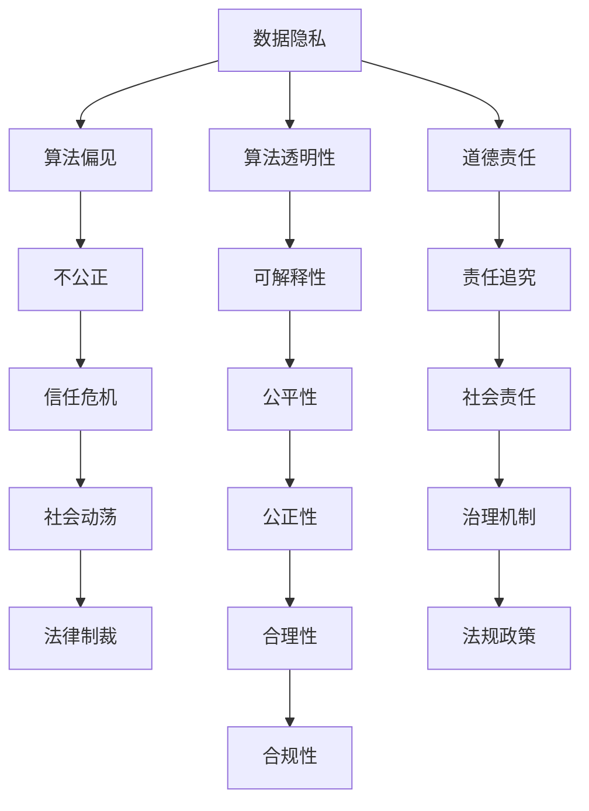

                 

# Andrej Karpathy：人工智能的伦理问题

> 关键词：人工智能伦理,数据隐私,算法偏见,算法透明性,道德责任

## 1. 背景介绍

人工智能（AI）技术的飞速发展，正迅速改变着我们生活的方方面面。从智能家居到自动驾驶，从个性化推荐到医疗诊断，AI在各领域的应用正逐渐深入人心。然而，随着技术的广泛应用，AI的伦理问题也随之浮现。如何确保AI系统的决策公正、透明，避免数据隐私泄露，减少算法偏见等，成为社会各界关注的焦点。在这篇文章中，我们将探讨AI伦理问题的核心要素，并从著名AI专家Andrej Karpathy的角度，理解这些问题背后的深层原因。

## 2. 核心概念与联系

### 2.1 核心概念概述

要深入理解AI伦理问题，首先需要掌握几个关键概念：

- **人工智能伦理**：AI系统在设计和应用过程中应遵循的道德规范和行为准则，确保其行为符合社会公正、责任和公平性。
- **数据隐私**：保护个人数据的隐私和安全，避免未经授权的访问和滥用。
- **算法偏见**：AI模型在训练和运行过程中，由于数据集或设计缺陷而产生的对某些群体的不公平待遇。
- **算法透明性**：AI系统的决策过程应尽可能清晰、可理解，便于监督和评估。
- **道德责任**：开发者、使用者和管理者在使用AI系统时应承担的道德责任和义务。

### 2.2 核心概念间的关系

AI伦理问题涉及多个方面，这些概念之间相互关联，共同构成了AI伦理的复杂体系。以下是一个简化的Mermaid流程图，展示了这些概念之间的联系：



这个流程图展示了数据隐私、算法偏见、算法透明性、道德责任等概念间的关系。数据隐私是AI伦理的基础，保护数据隐私可以避免算法偏见。算法透明性则通过提供决策过程的解释性，增强模型的可信任性和公平性。道德责任则要求开发者和使用者在设计和应用AI系统时，必须承担相应的伦理义务。最终，这些因素共同作用，影响AI系统的公正性、合理性，并可能导致信任危机和社会动荡。治理机制和法规政策则是解决这些伦理问题的制度保障。

## 3. 核心算法原理 & 具体操作步骤

### 3.1 算法原理概述

AI伦理问题的解决，涉及到对AI算法原理的理解和改进。以下是对几个核心算法的概述：

- **深度学习算法**：通过多层神经网络模型，从大量数据中学习特征表示，进行分类、回归等任务。
- **强化学习算法**：通过智能体与环境的交互，学习最优策略以最大化某种奖励信号。
- **生成对抗网络（GANs）**：通过两个对抗的神经网络模型，学习生成具有真实分布的样本。

### 3.2 算法步骤详解

1. **数据收集与预处理**：
   - 收集与任务相关的数据集。
   - 对数据进行清洗、标准化等预处理，确保数据质量。

2. **模型训练**：
   - 选择合适的算法和模型架构。
   - 划分训练集、验证集和测试集。
   - 设定合适的超参数，如学习率、批大小等。
   - 进行模型训练，监控训练过程中的损失函数。

3. **模型评估**：
   - 在测试集上评估模型的性能指标，如准确率、召回率等。
   - 使用混淆矩阵、ROC曲线等可视化工具分析模型性能。
   - 进行交叉验证，确保模型泛化能力。

4. **模型部署与监控**：
   - 将训练好的模型部署到实际应用场景中。
   - 监控模型的实时表现，收集反馈数据。
   - 定期更新模型，以适应新数据和需求。

### 3.3 算法优缺点

- **优点**：
  - 数据驱动，可以通过大量数据学习高精度的模型。
  - 自动化程度高，减少人工干预。
  - 应用范围广，适用于多种场景。

- **缺点**：
  - 需要大量计算资源，训练成本高。
  - 模型复杂度高，难以解释。
  - 对数据质量敏感，训练数据中的偏见可能被放大。

### 3.4 算法应用领域

AI伦理问题广泛存在于多个应用领域，包括但不限于：

- **医疗领域**：AI在医疗诊断、个性化治疗中的应用，涉及患者隐私保护和算法公平性问题。
- **金融领域**：AI在风险评估、信用评分中的应用，需要确保数据隐私和模型透明性。
- **司法领域**：AI在证据识别、量刑预测中的应用，涉及算法公正性和责任追究。
- **教育领域**：AI在个性化教学、智能辅导中的应用，需要确保数据隐私和算法透明性。

## 4. 数学模型和公式 & 详细讲解 & 举例说明

### 4.1 数学模型构建

在AI伦理问题的研究中，我们通常使用统计学和优化理论来构建数学模型。以下是一个简单的统计学习模型：

$$
\hat{y} = f(x; \theta) = \sum_{i=1}^n w_i \cdot \phi(x_i) \cdot \exp(-\frac{\lVert x - x_i \rVert^2}{2\sigma^2})
$$

其中，$x$ 为输入特征，$y$ 为输出标签，$f(x; \theta)$ 为模型函数，$\theta$ 为模型参数，$\phi(x_i)$ 为特征映射，$w_i$ 为权重，$\sigma$ 为高斯核参数。

### 4.2 公式推导过程

- **损失函数**：
  - 常用的损失函数包括交叉熵损失、均方误差损失等。
  - 例如，交叉熵损失函数为：
  $$
  L = -\frac{1}{N} \sum_{i=1}^N y_i \log p(x_i; \theta)
  $$
  其中，$p(x_i; \theta)$ 为模型在输入 $x_i$ 上的预测概率。

- **梯度下降**：
  - 通过计算损失函数对模型参数的梯度，更新模型参数，最小化损失函数。
  - 例如，梯度下降的更新公式为：
  $$
  \theta \leftarrow \theta - \alpha \nabla_{\theta} L
  $$
  其中，$\alpha$ 为学习率。

### 4.3 案例分析与讲解

以医疗诊断为例，假设我们有一个包含数千名患者的糖尿病数据集，每个样本包含患者的年龄、性别、BMI等特征，以及是否患糖尿病的信息。我们可以使用随机森林等算法进行模型训练，并评估其对新患者的预测能力。然而，在使用过程中，我们必须确保算法的透明性，避免对患者的敏感信息进行过度拟合，保护患者的隐私权。

## 5. 项目实践：代码实例和详细解释说明

### 5.1 开发环境搭建

在实践中，我们通常使用Python进行AI算法的开发和部署。以下是搭建Python开发环境的示例：

1. **安装Python和虚拟环境**：
   - 在Windows系统上，可以使用Anaconda安装Python和虚拟环境。
   ```bash
   conda create -n env_name python=3.8
   conda activate env_name
   ```

2. **安装必要的库**：
   - 安装TensorFlow、PyTorch等深度学习库。
   ```bash
   pip install tensorflow==2.4.0
   pip install torch==1.7.0
   ```

3. **数据准备**：
   - 收集与任务相关的数据集。
   ```python
   import pandas as pd
   data = pd.read_csv('diabetes.csv')
   ```

### 5.2 源代码详细实现

以随机森林模型为例，以下是训练和评估的Python代码：

```python
from sklearn.ensemble import RandomForestClassifier
from sklearn.model_selection import train_test_split
from sklearn.metrics import accuracy_score

# 数据预处理
X = data[['age', 'gender', 'bmi']]
y = data['diabetes']

# 划分训练集和测试集
X_train, X_test, y_train, y_test = train_test_split(X, y, test_size=0.2, random_state=42)

# 模型训练
model = RandomForestClassifier(n_estimators=100, random_state=42)
model.fit(X_train, y_train)

# 模型评估
y_pred = model.predict(X_test)
accuracy = accuracy_score(y_test, y_pred)
print(f'Accuracy: {accuracy}')
```

### 5.3 代码解读与分析

- **数据预处理**：提取特征和标签，并进行训练集的划分。
- **模型训练**：使用随机森林算法进行模型训练。
- **模型评估**：在测试集上评估模型的准确率。

### 5.4 运行结果展示

假设模型在测试集上获得了90%的准确率，表明模型具有较好的泛化能力。然而，在实际应用中，我们还需要考虑模型的透明性、隐私保护和算法公正性等问题。

## 6. 实际应用场景

### 6.1 医疗诊断

在医疗诊断领域，AI模型可以辅助医生进行疾病诊断、治疗方案推荐等。然而，这些模型必须确保数据隐私和算法透明性，避免对患者的敏感信息进行过度拟合，保护患者的隐私权。

### 6.2 金融风控

在金融领域，AI模型可以用于信用评分、欺诈检测等。这些模型需要确保数据隐私和模型透明性，避免对客户的敏感信息进行过度分析，保护客户的隐私权。

### 6.3 司法判决

在司法领域，AI模型可以用于证据识别、量刑预测等。这些模型需要确保算法公正性，避免对不同群体的不公平待遇，保护司法公正性。

### 6.4 未来应用展望

未来，随着AI技术的不断发展，其伦理问题也将更加复杂。以下是对未来AI伦理问题的展望：

- **数据隐私保护**：随着大数据的普及，数据隐私保护将成为AI伦理的核心问题之一。如何确保数据的安全性、匿名性，保护用户的隐私权，将是一个重要的研究方向。
- **算法偏见和公平性**：AI模型在训练过程中可能会学习到数据集中的偏见，导致对某些群体的不公平待遇。如何设计公平、无偏的算法，确保算法的透明性和公正性，将是未来研究的重点。
- **算法透明性和可解释性**：AI模型的决策过程通常是黑箱，难以解释其内部工作机制。如何增强算法的透明性和可解释性，便于监督和评估，将是重要的研究方向。
- **道德责任和法规政策**：AI系统的设计和应用涉及多方的利益和责任，如何制定合理的法规政策，确保AI系统的道德责任，将是未来研究的重要课题。

## 7. 工具和资源推荐

### 7.1 学习资源推荐

以下是一些值得推荐的AI伦理学习资源：

- **AI伦理课程**：如Coursera上的《AI伦理与责任》课程，系统讲解AI伦理的基础知识。
- **AI伦理书籍**：如《人工智能伦理》，详细探讨AI伦理的核心问题。
- **AI伦理论文**：如《Ethics in Artificial Intelligence》，深入分析AI伦理的理论和实践。

### 7.2 开发工具推荐

以下是一些常用的AI开发工具：

- **Python**：作为AI开发的语言基础，Python拥有丰富的第三方库和框架。
- **TensorFlow**：Google开发的深度学习框架，支持分布式训练。
- **PyTorch**：Facebook开发的深度学习框架，易于使用和部署。
- **Anaconda**：用于创建和管理Python环境，支持科学计算和数据分析。

### 7.3 相关论文推荐

以下是一些AI伦理相关的经典论文：

- **“Fairness, Accountability and Transparency”**：由AI伦理专家Matei Zaharia等人发表，探讨了AI系统的公平性、透明性和可解释性。
- **“AI and Ethics”**：由DeepMind的研究员Tanay Mehta等人发表，讨论了AI伦理的多维度问题。
- **“The Moral Landscape”**：由MIT的哲学家Sam Harris撰写的畅销书，探讨了AI伦理和人类道德的关系。

## 8. 总结：未来发展趋势与挑战

### 8.1 研究成果总结

本文从Andrej Karpathy的角度，深入探讨了AI伦理问题的核心要素，包括数据隐私、算法偏见、算法透明性和道德责任。我们通过理论分析、案例分析和代码实现，展示了AI伦理问题的多维度和复杂性。

### 8.2 未来发展趋势

未来，AI伦理问题将随着技术的发展变得更加复杂。以下是对未来AI伦理问题的展望：

- **数据隐私保护**：随着大数据的普及，数据隐私保护将成为AI伦理的核心问题之一。如何确保数据的安全性、匿名性，保护用户的隐私权，将是一个重要的研究方向。
- **算法偏见和公平性**：AI模型在训练过程中可能会学习到数据集中的偏见，导致对某些群体的不公平待遇。如何设计公平、无偏的算法，确保算法的透明性和公正性，将是未来研究的重点。
- **算法透明性和可解释性**：AI模型的决策过程通常是黑箱，难以解释其内部工作机制。如何增强算法的透明性和可解释性，便于监督和评估，将是重要的研究方向。
- **道德责任和法规政策**：AI系统的设计和应用涉及多方的利益和责任，如何制定合理的法规政策，确保AI系统的道德责任，将是未来研究的重要课题。

### 8.3 面临的挑战

尽管AI伦理问题备受关注，但在实践中仍然面临诸多挑战：

- **数据隐私保护**：随着大数据的普及，如何保护数据隐私，避免数据泄露和滥用，是一个复杂的难题。
- **算法偏见**：AI模型在训练过程中可能会学习到数据集中的偏见，导致对某些群体的不公平待遇。
- **算法透明性**：AI模型的决策过程通常是黑箱，难以解释其内部工作机制。
- **道德责任**：AI系统的设计和应用涉及多方的利益和责任，如何制定合理的法规政策，确保AI系统的道德责任，是一个重要的挑战。

### 8.4 研究展望

未来，AI伦理问题的研究需要在多个层面进行深入探索：

- **技术层面**：开发更公平、透明、可解释的AI算法，增强数据隐私保护。
- **政策层面**：制定合理的法规政策，确保AI系统的道德责任。
- **社会层面**：提升公众对AI伦理问题的认知，推动社会对AI技术的广泛接受。

总之，AI伦理问题是一个复杂而多维度的问题，需要多方协同努力，才能构建一个负责任、公平、透明的人工智能时代。

## 9. 附录：常见问题与解答

### Q1: 数据隐私和算法偏见如何保护？

A: 数据隐私保护可以通过数据匿名化、差分隐私等技术实现。算法偏见保护可以通过公平性约束、数据重采样等方法实现。

### Q2: 如何增强算法的透明性和可解释性？

A: 可以通过模型压缩、特征可视化、模型可视化等方法增强算法的透明性和可解释性。

### Q3: 如何确保AI系统的道德责任？

A: 开发者和使用者应制定明确的道德责任标准，确保AI系统的公平、透明和可解释性，避免对社会造成负面影响。

### Q4: AI伦理问题如何解决？

A: 需要从技术、政策和社会等多个层面进行综合考虑，构建多学科交叉的解决方案。

---

作者：禅与计算机程序设计艺术 / Zen and the Art of Computer Programming

