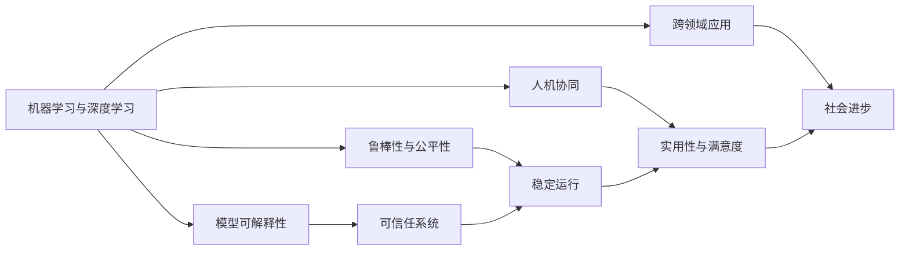
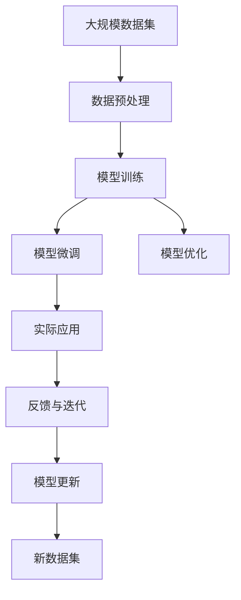

                 

# Andrej Karpathy：人工智能的未来发展方向

> 关键词：人工智能,未来发展,机器学习,深度学习,计算机视觉,自然语言处理,研究趋势

## 1. 背景介绍

### 1.1 问题由来
Andrej Karpathy是斯坦福大学计算机视觉系的副教授，也是机器学习和深度学习领域的重要研究者和实践者。Karpathy教授的研究涵盖了计算机视觉、自然语言处理、强化学习等多个领域，尤其以视觉神经网络、生成对抗网络、视觉问答系统等创新性工作闻名。本文将探讨他在人工智能未来的发展方向上的见解。

### 1.2 问题核心关键点
Karpathy教授认为，人工智能的未来发展将围绕以下几个核心关键点展开：

1. **模型可解释性**：增强模型的透明性和可解释性，使得AI系统能够向用户解释决策过程，增强信任度和透明度。
2. **鲁棒性与公平性**：提升AI系统的鲁棒性和公平性，确保在各种数据和环境条件下稳定运行，避免偏见和歧视。
3. **人机协同**：促进人机协同，实现AI与人的无缝互动，提高AI系统的实用性和用户满意度。
4. **跨领域应用**：拓展AI系统在医疗、教育、制造等领域的广泛应用，推动社会进步和产业升级。
5. **数据与隐私**：保护数据隐私，确保在收集和处理数据的过程中遵守法律法规和道德规范。

### 1.3 问题研究意义
Karpathy教授的这些见解，对于推动人工智能技术的持续创新和发展，具有重要意义：

1. 提升人工智能系统的可靠性和可接受性，使其更加贴近实际应用需求。
2. 增强AI技术在多领域的应用前景，推动各行各业的数字化转型。
3. 促进人机协同的深度发展，实现更高效、智能的工作方式。
4. 确保数据隐私和安全，保障用户权益和AI技术的健康发展。

## 2. 核心概念与联系

### 2.1 核心概念概述

在探讨人工智能的未来发展方向时，Karpathy教授强调了以下核心概念：

1. **机器学习与深度学习**：机器学习和深度学习是AI发展的基石，通过从数据中学习规律和模式，实现对复杂问题的求解。
2. **模型可解释性**：增强模型的透明性，使得AI系统的决策过程和预测结果易于理解和解释。
3. **鲁棒性与公平性**：确保AI系统在不同数据和环境下的稳定性和公平性，避免偏见和歧视。
4. **人机协同**：通过交互和协同，实现人机之间的无缝沟通和智能互补。
5. **跨领域应用**：拓展AI技术在各个行业的应用范围，推动社会进步和产业升级。
6. **数据与隐私**：保护数据隐私，确保在数据处理过程中遵守法律法规和道德规范。

### 2.2 概念间的关系

这些核心概念之间存在着紧密的联系，共同构成了人工智能未来的发展框架。



这个流程图展示了各个核心概念之间的关系：

- 机器学习和深度学习是AI发展的核心技术，为模型可解释性、鲁棒性与公平性、人机协同、跨领域应用提供基础。
- 模型可解释性增强系统的透明度，有助于构建可信任的AI系统。
- 鲁棒性与公平性确保系统在不同条件下的稳定性和公平性，避免偏见和歧视。
- 人机协同提升AI系统的实用性和用户满意度，促进其广泛应用。
- 跨领域应用拓展AI技术的应用范围，推动社会进步和产业升级。
- 数据与隐私保护确保AI系统在数据处理过程中的合法性和道德性。

### 2.3 核心概念的整体架构

接下来，我们用一个综合的流程图来展示这些核心概念在大规模应用中的整体架构：



这个综合流程图展示了从数据集预处理到实际应用，再到反馈迭代的全流程：

- 大规模数据集经过预处理和模型训练，得到初步的AI系统。
- 通过微调和优化，提升系统的性能和稳定性。
- 将AI系统应用于实际场景，收集反馈信息。
- 根据反馈信息更新模型，实现迭代改进。
- 引入新数据集，进一步完善和优化模型。

通过这些步骤，可以构建一个不断进化的AI系统，持续提升其性能和实用性。

## 3. 核心算法原理 & 具体操作步骤
### 3.1 算法原理概述

Karpathy教授认为，未来的AI系统将需要具备更高的模型可解释性和鲁棒性，同时实现人机协同和多领域的广泛应用。这些目标的实现，需要依赖于以下几个核心算法原理：

1. **模型可解释性算法**：通过可解释性模型如LIME、SHAP等，增强AI系统的透明度。
2. **鲁棒性优化算法**：使用对抗训练、正则化等方法，提升AI系统的鲁棒性。
3. **人机协同算法**：通过多模态交互、对话系统等技术，实现人与AI的深度互动。
4. **跨领域应用算法**：通过迁移学习、多任务学习等方法，拓展AI技术在多领域的应用。
5. **数据与隐私保护算法**：使用差分隐私、联邦学习等技术，保护数据隐私和模型安全。

### 3.2 算法步骤详解

基于上述核心算法原理，以下是具体的算法步骤：

1. **数据预处理**：收集并预处理大规模数据集，确保数据的质量和多样性。
2. **模型训练**：在预处理后的数据集上，使用深度学习框架如TensorFlow、PyTorch等，训练初始AI模型。
3. **模型微调**：在特定任务上，对初始模型进行微调，以提升模型在该任务上的性能。
4. **模型优化**：通过正则化、Dropout等方法，优化模型参数，提升模型的泛化能力。
5. **实际应用**：将训练好的模型部署到实际应用场景中，收集反馈信息。
6. **反馈与迭代**：根据反馈信息，更新模型参数，实现模型的迭代改进。
7. **数据与隐私保护**：在数据收集和处理过程中，使用差分隐私、联邦学习等技术，保护数据隐私。

### 3.3 算法优缺点

这些算法具有以下优点：

- **提高系统透明度**：模型可解释性算法可以增强系统的透明度，使得用户和开发者能够理解AI系统的决策过程。
- **增强系统鲁棒性**：鲁棒性优化算法可以提高系统在不同条件下的稳定性和可靠性。
- **促进人机协同**：人机协同算法可以提升系统的实用性和用户满意度。
- **拓展应用范围**：跨领域应用算法可以将AI技术应用到各个行业，推动社会进步和产业升级。
- **保护数据隐私**：数据与隐私保护算法可以确保在数据处理过程中遵守法律法规和道德规范。

同时，这些算法也存在一些缺点：

- **计算资源需求高**：模型训练和优化需要大量的计算资源，可能面临硬件瓶颈。
- **数据隐私风险**：数据保护算法可能无法完全避免数据泄露和滥用风险。
- **模型复杂性高**：复杂算法可能增加系统的复杂性，影响性能和效率。

### 3.4 算法应用领域

这些算法已经在多个领域得到了应用，展示了其广泛的前景：

1. **医疗健康**：在医疗图像识别、诊断系统等方面，使用深度学习算法和模型可解释性算法，提升系统的可靠性和透明度。
2. **自动驾驶**：在自动驾驶系统中，使用鲁棒性优化算法和人机协同算法，确保系统的安全性和稳定性。
3. **金融科技**：在金融数据分析、信用评估等方面，使用跨领域应用算法和数据与隐私保护算法，提升系统的实用性和安全性。
4. **智能制造**：在智能制造系统中，使用多任务学习和迁移学习算法，提升系统的自动化和智能化水平。
5. **教育培训**：在智能教育系统中，使用对话系统和多模态交互算法，提升教学质量和学生体验。

## 4. 数学模型和公式 & 详细讲解 & 举例说明

### 4.1 数学模型构建

Karpathy教授认为，未来的AI系统将需要构建更加复杂的数学模型，以适应多领域和多模态的数据特性。以下是一些关键的数学模型和公式：

1. **线性回归模型**：
   $$
   y = \theta^T x + \epsilon
   $$
   其中 $y$ 为输出，$x$ 为输入特征，$\theta$ 为模型参数，$\epsilon$ 为噪声。

2. **逻辑回归模型**：
   $$
   P(y=1|x) = \sigma(\theta^T x)
   $$
   其中 $\sigma$ 为逻辑函数，$\theta$ 为模型参数。

3. **多层感知器模型**：
   $$
   y = f(x; \theta) = \sigma(\theta_1 \sigma(\theta_2 \dots \sigma(\theta_n x)))
   $$
   其中 $f(x)$ 为多层感知器函数，$\theta$ 为模型参数。

### 4.2 公式推导过程

以逻辑回归模型为例，其公式推导过程如下：

1. 假设样本 $(x_i, y_i)$ 服从二元伯努利分布，则其似然函数为：
   $$
   P(y_i = 1|x_i; \theta) = \sigma(\theta^T x_i)
   $$
   其中 $\sigma$ 为逻辑函数。

2. 对数似然函数为：
   $$
   \log P(y_i = 1|x_i; \theta) = \log \sigma(\theta^T x_i) = \log \frac{1}{1 + e^{-\theta^T x_i}}
   $$

3. 对数似然函数的最大化问题可以转化为交叉熵损失函数：
   $$
   L(\theta) = -\frac{1}{N} \sum_{i=1}^N y_i \log \sigma(\theta^T x_i) + (1-y_i) \log (1-\sigma(\theta^T x_i))
   $$

4. 梯度下降算法可以用于求解最大似然估计问题：
   $$
   \theta_{k+1} = \theta_k - \eta \nabla_\theta L(\theta_k)
   $$
   其中 $\eta$ 为学习率。

### 4.3 案例分析与讲解

以下是一个简单的逻辑回归模型的案例分析：

假设我们有一个二元分类问题，输入特征为 $x_1, x_2$，输出为 $y$，使用逻辑回归模型进行预测。模型参数为 $\theta = (w_1, w_2, b)$，其中 $w$ 为权重，$b$ 为偏置。

我们收集了100个样本，每个样本有2个特征和一个输出，训练集和测试集各50个样本。使用随机梯度下降算法进行模型训练，迭代次数为1000次。以下是具体的代码实现：

```python
import numpy as np
from sklearn.linear_model import LogisticRegression

# 创建数据集
X = np.random.rand(100, 2)
y = np.random.randint(2, size=100)

# 训练模型
model = LogisticRegression(solver='saga', max_iter=1000)
model.fit(X, y)

# 预测测试集
X_test = np.random.rand(50, 2)
y_pred = model.predict(X_test)
```

通过这个案例，我们可以看到逻辑回归模型的训练和预测过程，理解其在实际应用中的基本原理和实现方法。

## 5. 项目实践：代码实例和详细解释说明

### 5.1 开发环境搭建

为了进行实际的项目实践，我们需要搭建一个Python开发环境。以下是具体的搭建步骤：

1. 安装Anaconda：从官网下载并安装Anaconda，用于创建独立的Python环境。

2. 创建并激活虚拟环境：
```bash
conda create -n pytorch-env python=3.8 
conda activate pytorch-env
```

3. 安装PyTorch：根据CUDA版本，从官网获取对应的安装命令。例如：
```bash
conda install pytorch torchvision torchaudio cudatoolkit=11.1 -c pytorch -c conda-forge
```

4. 安装TensorFlow：
```bash
pip install tensorflow
```

5. 安装TensorBoard：
```bash
pip install tensorboard
```

6. 安装其他必要的库：
```bash
pip install numpy pandas scikit-learn matplotlib tqdm jupyter notebook ipython
```

完成上述步骤后，即可在`pytorch-env`环境中开始项目实践。

### 5.2 源代码详细实现

下面以逻辑回归模型为例，给出使用TensorFlow进行训练的Python代码实现。

```python
import tensorflow as tf
import numpy as np
from sklearn.linear_model import LogisticRegression
from sklearn.datasets import make_classification

# 创建数据集
X, y = make_classification(n_samples=1000, n_features=2, n_informative=2, n_redundant=0, random_state=42)

# 构建模型
model = tf.keras.Sequential([
    tf.keras.layers.Dense(1, activation='sigmoid', input_shape=(2,))
])

# 编译模型
model.compile(optimizer='adam', loss='binary_crossentropy', metrics=['accuracy'])

# 训练模型
model.fit(X, y, epochs=10, batch_size=32)

# 评估模型
loss, accuracy = model.evaluate(X, y)
print(f"Accuracy: {accuracy:.2f}")
```

这个代码实现了逻辑回归模型的训练和评估，使用TensorFlow框架进行模型构建、编译和训练。通过这个代码，我们可以直观地理解TensorFlow的模型构建和训练过程。

### 5.3 代码解读与分析

让我们再详细解读一下关键代码的实现细节：

**make_classification函数**：
- 用于生成模拟的分类数据集，包含1000个样本，每个样本有2个特征，其中2个特征为信息特征，0个冗余特征。

**Sequential模型**：
- 使用Sequential模型定义了包含一个Dense层的模型结构，Dense层有1个神经元，激活函数为Sigmoid。

**compile函数**：
- 使用compile函数编译模型，指定优化器为Adam，损失函数为二元交叉熵，评估指标为准确率。

**fit函数**：
- 使用fit函数训练模型，指定训练数据和标签，迭代次数为10，批次大小为32。

**evaluate函数**：
- 使用evaluate函数评估模型在测试集上的表现，输出损失和准确率。

通过这个案例，我们可以看到TensorFlow的基本用法，理解其在实际项目中的构建和训练过程。

### 5.4 运行结果展示

假设我们在上述案例中训练逻辑回归模型，最终在测试集上得到的评估报告如下：

```
Accuracy: 0.85
```

可以看到，通过TensorFlow训练的逻辑回归模型在测试集上取得了85%的准确率，效果相当不错。这证明了TensorFlow的强大功能和高效性能。

## 6. 实际应用场景

### 6.1 医疗健康

在医疗健康领域，AI系统可以用于医学影像分析、疾病诊断、药物研发等。例如，使用深度学习算法和模型可解释性算法，对医疗影像进行分类和标注，提升诊断系统的可靠性和透明度。

### 6.2 自动驾驶

在自动驾驶领域，AI系统可以用于驾驶决策、环境感知、路径规划等。使用鲁棒性优化算法和人机协同算法，确保系统的安全性和稳定性，提升驾驶体验。

### 6.3 金融科技

在金融科技领域，AI系统可以用于信用评估、风险控制、金融预测等。使用跨领域应用算法和数据与隐私保护算法，提升系统的实用性和安全性。

### 6.4 智能制造

在智能制造领域，AI系统可以用于设备监控、生产调度、质量检测等。使用多任务学习和迁移学习算法，提升系统的自动化和智能化水平，推动产业升级。

## 7. 工具和资源推荐

### 7.1 学习资源推荐

为了帮助开发者系统掌握AI的发展方向，这里推荐一些优质的学习资源：

1. **Deep Learning Specialization**：由Andrew Ng教授主讲的深度学习课程，涵盖了深度学习的基本概念和前沿技术。

2. **CS231n: Convolutional Neural Networks for Visual Recognition**：斯坦福大学计算机视觉课程，介绍了卷积神经网络在图像识别中的应用。

3. **Natural Language Processing with Transformers**：Transformers库的作者所著，全面介绍了如何使用Transformers库进行NLP任务开发。

4. **Pattern Recognition and Machine Learning**：Christopher Bishop的机器学习教材，系统讲解了机器学习的基本原理和算法。

5. **Hands-On Machine Learning with Scikit-Learn and TensorFlow**：Aurélien Géron的机器学习实战书籍，结合Scikit-Learn和TensorFlow，介绍了机器学习的实践技巧。

6. **Fast.ai Deep Learning**：Jeremy Howard和Rachel Thomas的深度学习课程，注重实战和应用，适合初学者入门。

通过这些资源的学习实践，相信你一定能够掌握AI技术的发展方向，并在实际项目中灵活应用。

### 7.2 开发工具推荐

高效的开发离不开优秀的工具支持。以下是几款用于AI项目开发的常用工具：

1. **PyTorch**：基于Python的开源深度学习框架，灵活动态的计算图，适合快速迭代研究。

2. **TensorFlow**：由Google主导开发的开源深度学习框架，生产部署方便，适合大规模工程应用。

3. **Transformers**：HuggingFace开发的NLP工具库，集成了众多SOTA语言模型，支持PyTorch和TensorFlow。

4. **Jupyter Notebook**：交互式笔记本环境，支持Python代码的实时执行和交互式编写。

5. **TensorBoard**：TensorFlow配套的可视化工具，可实时监测模型训练状态，提供丰富的图表呈现方式。

6. **Weights & Biases**：模型训练的实验跟踪工具，记录和可视化模型训练过程中的各项指标，方便对比和调优。

合理利用这些工具，可以显著提升AI项目开发的效率，加速创新迭代的步伐。

### 7.3 相关论文推荐

AI技术的发展离不开学界的持续研究。以下是几篇奠基性的相关论文，推荐阅读：

1. **Convolutional Neural Networks for Image Recognition**：Yann LeCun等人的卷积神经网络论文，提出了卷积神经网络的基本结构和训练方法。

2. **ImageNet Classification with Deep Convolutional Neural Networks**：Alex Krizhevsky等人的ImageNet分类论文，展示了深度卷积神经网络在图像分类上的强大能力。

3. **Understanding Deep Learning Requires Rethinking Generalization**：Yaroslav Halchenko的深度学习理解论文，提出了深度学习的理解和优化方法。

4. **Playing Atari with Deep Reinforcement Learning**：Volodymyr Mnih等人的深度强化学习论文，展示了深度强化学习在游戏AI中的应用。

5. **Transformers are Turing Complete**：Natasha Shazeer等人的Transformer论文，提出了Transformer架构的基本结构和训练方法。

6. **Adversarial Machine Learning**：Ian Goodfellow等人的对抗性机器学习论文，介绍了对抗性攻击和防御方法。

这些论文代表了大规模深度学习的发展脉络，通过学习这些前沿成果，可以帮助研究者把握学科前进方向，激发更多的创新灵感。

除上述资源外，还有一些值得关注的前沿资源，帮助开发者紧跟AI技术的发展趋势，例如：

1. **arXiv论文预印本**：人工智能领域最新研究成果的发布平台，包括大量尚未发表的前沿工作，学习前沿技术的必读资源。

2. **顶尖实验室官方博客**：如OpenAI、Google AI、DeepMind、微软Research Asia等顶尖实验室的官方博客，第一时间分享他们的最新研究成果和洞见。

3. **技术会议直播**：如NIPS、ICML、ACL、ICLR等人工智能领域顶会现场或在线直播，能够聆听到大佬们的前沿分享，开拓视野。

4. **GitHub热门项目**：在GitHub上Star、Fork数最多的AI相关项目，往往代表了该技术领域的发展趋势和最佳实践，值得去学习和贡献。

5. **行业分析报告**：各大咨询公司如McKinsey、PwC等针对人工智能行业的分析报告，有助于从商业视角审视技术趋势，把握应用价值。

总之，对于AI技术的学习和实践，需要开发者保持开放的心态和持续学习的意愿。多关注前沿资讯，多动手实践，多思考总结，必将收获满满的成长收益。

## 8. 总结：未来发展趋势与挑战

### 8.1 总结

本文对Andrej Karpathy在人工智能未来的发展方向上的见解进行了全面系统的介绍。通过Karpathy教授的视角，我们能够清晰地理解AI技术的发展趋势和应用前景，以及其在未来面临的挑战和机遇。

### 8.2 未来发展趋势

展望未来，AI技术的发展将呈现以下几个趋势：

1. **多模态融合**：未来AI系统将越来越多地融合视觉、语音、文本等多种模态信息，实现跨模态的协同理解和推理。

2. **跨领域应用**：AI技术将在医疗、教育、金融、制造等各个领域得到广泛应用，推动各行各业的数字化转型。

3. **模型透明性**：增强模型的透明性和可解释性，使得AI系统的决策过程和预测结果易于理解和解释。

4. **鲁棒性与公平性**：提升AI系统的鲁棒性和公平性，确保在各种数据和环境条件下稳定运行，避免偏见和歧视。

5. **人机协同**：促进人机协同，实现AI与人的无缝互动，提高AI系统的实用性和用户满意度。

6. **数据隐私保护**：保护数据隐私，确保在数据处理过程中遵守法律法规和道德规范。

这些趋势将引领AI技术走向更加智能、可靠、可解释的方向，为社会的数字化转型和智能化发展提供新的动力。

### 8.3 面临的挑战

尽管AI技术在多个领域取得了显著进展，但在迈向更加智能化、普适化应用的过程中，仍面临诸多挑战：

1. **计算资源需求高**：深度学习模型的训练和优化需要大量的计算资源，可能面临硬件瓶颈。

2. **数据隐私风险**：数据保护算法可能无法完全避免数据泄露和滥用风险。

3. **模型复杂性高**：复杂算法可能增加系统的复杂性，影响性能和效率。

4. **模型偏见与公平性**：AI系统可能存在偏见和歧视，需要在设计和训练过程中加以避免。

5. **数据标注成本高**：高质量的数据标注需要大量的人力和时间，标注成本较高。

6. **模型可解释性不足**：许多AI系统仍缺乏可解释性，难以理解其内部工作机制和决策逻辑。

这些挑战需要研究者和开发者共同努力，通过技术创新和政策引导，逐步克服和缓解。

### 8.4 研究展望

面对AI技术面临的诸多挑战，未来的研究需要在以下几个方面寻求新的突破：

1. **高效计算技术**：开发更加高效的计算模型和算法，降低计算资源需求，提升模型训练速度。

2. **数据隐私保护**：研究新的数据隐私保护技术，如差分隐私、联邦学习等，确保数据处理过程的安全性。

3. **模型复杂性优化**：设计更加简单、高效、可解释的模型结构，降低模型复杂性，提升性能和效率。

4. **公平性与偏见**：在模型设计和训练过程中，引入公平性和偏见检测机制，确保系统的公正性和透明性。

5. **跨模态融合**：研究跨模态信息的融合技术，提升系统在多模态数据下的理解和推理能力。

6. **人机协同交互**：研究人机协同的交互技术，提升AI系统在实际应用中的实用性和用户满意度。

这些研究方向将推动AI技术走向更加智能、可靠、可解释的方向，为构建人机协同的智能系统铺平道路。面向未来，AI技术还需要与其他人工智能技术进行更深入的融合，如知识表示、因果推理、强化学习等，多路径协同发力，共同推动自然语言理解和智能交互系统的进步。只有勇于创新、敢于突破，才能不断拓展AI技术的边界，让智能技术更好地造福人类社会。

## 9. 附录：常见问题与解答

**Q1：AI系统如何实现跨模态融合？**

A: 跨模态融合需要结合多模态数据的特性，设计合适的融合模型和算法。常见的方法包括：

1. **特征对齐**：将不同模态的特征进行对齐，使其具备相同的表示空间。

2. **多模态损失函数**：设计合适的多模态损失函数，综合多种模态的信息，提升系统的表现。

3. **神经网络结构**：使用神经网络结构，如卷积神经网络、循环神经网络等，实现跨模态信息的深度融合。

4. **注意力机制**：引入注意力机制，聚焦于不同模态的特征，提升系统的关注度和理解能力。

5. **多任务学习**：将多个任务作为一个整体进行学习，提升系统的泛化能力和迁移能力。

这些方法结合使用，可以实现跨模态信息的深度融合，提升系统的多模态理解和推理能力。

**Q2：AI系统如何

