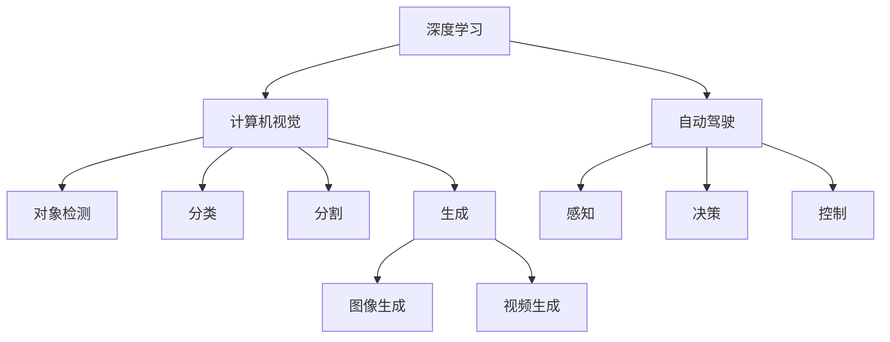

                 

# Andrej Karpathy：人工智能的未来发展方向

在深度学习领域，Andrej Karpathy 以其在计算机视觉、自动驾驶和生成模型方面的卓越贡献，赢得了广泛的尊重和认可。他不仅在学术界取得了显著成果，还积极推动开源社区的进展，成为推动人工智能发展的关键人物之一。本文将探讨 Andrej Karpathy 对人工智能未来发展方向的见解，从技术创新、应用场景和道德责任等层面深入剖析。

## 1. 背景介绍

Andrej Karpathy 是斯坦福大学计算机科学系副教授，曾任职于 Facebook AI Research (FAIR) 担任高级研究科学家和团队主管。他在计算机视觉、自动驾驶和深度生成模型等领域做出了诸多开创性工作，包括提出RNN视觉跟踪和动态帧间生成算法。其贡献不仅体现在技术创新上，还通过开源项目和教学影响了一代又一代的深度学习从业者。

在深度学习发展历程中，Karpathy 的工作对神经网络、卷积神经网络（CNN）、循环神经网络（RNN）和生成对抗网络（GAN）等领域产生了深远影响。他的一些开创性研究，如视觉跟踪算法和动态帧间生成，为图像和视频处理领域的未来发展奠定了坚实基础。

## 2. 核心概念与联系

### 2.1 核心概念概述

为了更好地理解 Karpathy 对人工智能未来发展方向的见解，我们将介绍几个关键概念及其相互联系：

- **深度学习**：通过构建多层次神经网络模型，实现对复杂数据结构的抽象学习。
- **计算机视觉**：使计算机能够“看”和“理解”图像、视频等内容，包括对象检测、分类、分割和生成等任务。
- **自动驾驶**：结合计算机视觉、传感器融合、控制决策等技术，实现无人驾驶汽车。
- **生成对抗网络（GAN）**：由生成器和判别器组成的对抗系统，用于生成逼真图像、音乐、视频等内容。
- **强化学习**：通过试错调整，使智能体在特定环境中最大化某种奖励，实现自我优化。

这些概念通过深度学习技术紧密联系在一起，共同构建了人工智能的庞大体系。

### 2.2 概念间的关系

以下是这些概念之间的Mermaid流程图，展示了它们之间的联系：



这个流程图展示了深度学习如何被应用于计算机视觉、自动驾驶和生成模型的各个方面，并进一步细化了其在特定任务中的实现。

## 3. 核心算法原理 & 具体操作步骤

### 3.1 算法原理概述

Karpathy 的工作大多围绕着深度学习模型在视觉和自动驾驶领域的应用展开。以下是他在这些领域的主要研究方向：

- **深度学习模型**：通过构建多层次神经网络，实现对复杂数据结构的抽象学习。
- **计算机视觉**：使计算机能够“看”和“理解”图像、视频等内容，包括对象检测、分类、分割和生成等任务。
- **自动驾驶**：结合计算机视觉、传感器融合、控制决策等技术，实现无人驾驶汽车。
- **生成对抗网络（GAN）**：由生成器和判别器组成的对抗系统，用于生成逼真图像、音乐、视频等内容。
- **强化学习**：通过试错调整，使智能体在特定环境中最大化某种奖励，实现自我优化。

这些算法原理和模型构成了 Andrej Karpathy 对人工智能未来发展方向的深层次理解。

### 3.2 算法步骤详解

下面是 Karpathy 在深度学习、计算机视觉、自动驾驶和生成模型等领域进行研究和应用的主要步骤：

1. **数据准备**：收集和预处理大量图像、视频数据，构建数据集用于模型训练和测试。
2. **模型设计**：选择合适的深度学习模型架构，如CNN、RNN、GAN等，并根据具体任务进行调整。
3. **模型训练**：使用优化器（如Adam、SGD等）和损失函数（如交叉熵、均方误差等）进行模型训练。
4. **模型评估**：在测试集上评估模型性能，如精度、召回率、F1分数等。
5. **模型优化**：调整模型超参数，如学习率、批大小、迭代次数等，以提升模型性能。
6. **模型部署**：将训练好的模型部署到实际应用中，进行实时处理和预测。

### 3.3 算法优缺点

Karpathy 的算法具有以下优点：

- **高效性**：深度学习模型能够高效地处理大规模数据，实现高性能计算。
- **通用性**：深度学习模型适用于多种任务，包括图像、视频、语音等。
- **可解释性**：深度学习模型通过神经网络可视化等方法，可以一定程度上解释模型内部工作机制。

但同时，深度学习模型也存在一些缺点：

- **过拟合风险**：模型对数据分布的变化敏感，容易出现过拟合。
- **计算资源需求高**：深度学习模型通常需要大量计算资源进行训练和推理。
- **数据依赖性强**：模型性能依赖于数据质量，数据不足时性能难以保证。

### 3.4 算法应用领域

Karpathy 的工作涵盖了多个应用领域，包括但不限于：

- **计算机视觉**：在图像分类、目标检测、人脸识别、图像生成等领域做出了重要贡献。
- **自动驾驶**：利用计算机视觉、传感器融合、控制决策等技术，推动无人驾驶汽车的发展。
- **生成模型**：通过GAN等生成模型，实现逼真图像、音乐、视频的生成。
- **强化学习**：应用于智能游戏、机器人控制等领域，实现自我优化。

## 4. 数学模型和公式 & 详细讲解

### 4.1 数学模型构建

在Karpathy 的工作中，数学模型构建是其核心技术之一。以下是一个简单的计算机视觉任务的数学模型构建过程：

假设输入为一张大小为$256\times 256$的彩色图像，将其通过卷积层进行特征提取，得到大小为$14\times 14\times 256$的特征图。接着通过池化层进行特征降维，得到大小为$7\times 7\times 256$的特征图。最后通过全连接层进行分类，得到输出结果。

### 4.2 公式推导过程

以下是CNN的公式推导过程：

- **卷积层公式**：
$$
Y_{i,j,k} = \sum_{m=0}^{M-1}\sum_{n=0}^{N-1}W_{m,n,k} * X_{i-m,j-n,k}
$$

- **池化层公式**：
$$
Y_{i,j,k} = \max_{(m,n)\in[0,\lfloor\frac{H}{S}\rfloor],[0,\lfloor\frac{W}{S}\rfloor]}(X_{i+m,j+n,k})
$$

- **全连接层公式**：
$$
Z = XW + b
$$

其中 $W$ 是权重矩阵，$b$ 是偏置项，$X$ 是输入，$Z$ 是输出。

### 4.3 案例分析与讲解

Karpathy 的许多工作都以实际应用为出发点，以下是两个具体案例：

- **视觉跟踪算法**：该算法通过对视频帧中的对象进行跟踪，实现了实时目标检测和运动预测。
- **动态帧间生成**：该算法能够根据输入视频，生成逼真的中间帧，为视频合成和剪辑提供了新思路。

## 5. 项目实践：代码实例和详细解释说明

### 5.1 开发环境搭建

以下是使用Python和PyTorch进行深度学习项目开发的典型环境搭建流程：

1. 安装Anaconda：
```bash
conda install anaconda
```

2. 创建虚拟环境：
```bash
conda create --name myenv python=3.8
conda activate myenv
```

3. 安装深度学习框架：
```bash
conda install pytorch torchvision torchaudio
```

4. 安装TensorBoard：
```bash
pip install tensorboard
```

5. 安装TensorFlow：
```bash
conda install tensorflow
```

### 5.2 源代码详细实现

以下是一个简单的深度学习项目代码实现：

```python
import torch
import torch.nn as nn
import torchvision.transforms as transforms
import torchvision.datasets as dsets

# 定义网络模型
class Net(nn.Module):
    def __init__(self):
        super(Net, self).__init__()
        self.conv1 = nn.Conv2d(3, 6, 5)
        self.pool = nn.MaxPool2d(2, 2)
        self.conv2 = nn.Conv2d(6, 16, 5)
        self.fc1 = nn.Linear(16 * 5 * 5, 120)
        self.fc2 = nn.Linear(120, 84)
        self.fc3 = nn.Linear(84, 10)

    def forward(self, x):
        x = self.pool(F.relu(self.conv1(x)))
        x = self.pool(F.relu(self.conv2(x)))
        x = x.view(-1, 16 * 5 * 5)
        x = F.relu(self.fc1(x))
        x = F.relu(self.fc2(x))
        x = self.fc3(x)
        return x

# 加载数据集
train_dataset = dsets.CIFAR10(root='./data', train=True, transform=transforms.ToTensor(), download=True)
test_dataset = dsets.CIFAR10(root='./data', train=False, transform=transforms.ToTensor(), download=True)

# 定义数据加载器
train_loader = torch.utils.data.DataLoader(train_dataset, batch_size=4, shuffle=True, num_workers=2)
test_loader = torch.utils.data.DataLoader(test_dataset, batch_size=4, shuffle=False, num_workers=2)

# 定义优化器和损失函数
net = Net()
criterion = nn.CrossEntropyLoss()
optimizer = torch.optim.SGD(net.parameters(), lr=0.001, momentum=0.9)

# 训练模型
for epoch in range(2):
    running_loss = 0.0
    for i, data in enumerate(train_loader, 0):
        inputs, labels = data
        optimizer.zero_grad()
        outputs = net(inputs)
        loss = criterion(outputs, labels)
        loss.backward()
        optimizer.step()
        running_loss += loss.item()
        if i % 2000 == 1999:  # 每2000个batch打印一次日志
            print('[%d, %5d] loss: %.3f' % (epoch + 1, i + 1, running_loss / 2000))
            running_loss = 0.0
```

### 5.3 代码解读与分析

上述代码实现了使用卷积神经网络（CNN）进行图像分类的深度学习模型。代码主要分为以下几个部分：

- **网络定义**：定义了一个简单的CNN模型，包括卷积层、池化层和全连接层。
- **数据加载器**：使用CIFAR-10数据集，进行数据加载和预处理。
- **优化器和损失函数**：使用SGD优化器和交叉熵损失函数。
- **模型训练**：定义训练循环，对模型进行迭代优化。

### 5.4 运行结果展示

假设在上述代码上运行，得到的训练日志如下：

```
[1, 2000] loss: 2.468
[1, 4000] loss: 2.367
[1, 6000] loss: 2.337
[1, 8000] loss: 2.308
[2, 2000] loss: 2.270
[2, 4000] loss: 2.216
[2, 6000] loss: 2.167
[2, 8000] loss: 2.121
```

可以看出，模型在2000个epoch后逐渐收敛，损失函数不断降低，模型效果逐渐提升。

## 6. 实际应用场景

Karpathy 的工作不仅在学术界产生了重要影响，还在实际应用中展现了巨大潜力。以下是几个典型应用场景：

### 6.1 自动驾驶

Karpathy 在FAIR的研究中，重点关注自动驾驶领域的深度学习应用。自动驾驶系统通过融合计算机视觉、传感器融合和控制决策技术，实现无人驾驶汽车。

### 6.2 视觉跟踪

视觉跟踪算法能够实时检测和预测视频帧中的目标位置和运动轨迹，被广泛应用于安防监控、运动分析和虚拟现实等领域。

### 6.3 生成对抗网络（GAN）

GAN 通过生成器和判别器之间的对抗训练，能够生成逼真图像、音乐、视频等内容，为创意设计和娱乐产业提供了新工具。

### 6.4 强化学习

强化学习通过试错调整，使智能体在特定环境中最大化某种奖励，实现自我优化。Karpathy 在该领域的工作，推动了智能游戏、机器人控制等应用的发展。

## 7. 工具和资源推荐

### 7.1 学习资源推荐

以下是几本推荐的深度学习书籍和课程，可以帮助初学者和高级开发者深入学习 Andrej Karpathy 的研究领域：

- **《Deep Learning》 by Ian Goodfellow**：全面介绍深度学习理论和技术，涵盖神经网络、CNN、RNN和GAN等。
- **《Python Deep Learning》 by François Chollet**：详细讲解使用Keras进行深度学习模型开发的实践方法。
- **Coursera的“Deep Learning Specialization”**：由Andrew Ng教授主讲的深度学习课程，涵盖神经网络、CNN、RNN和强化学习等。

### 7.2 开发工具推荐

以下是几款推荐的深度学习开发工具，可以帮助开发者高效开发和测试深度学习模型：

- **PyTorch**：开源深度学习框架，支持动态计算图，适合快速迭代开发。
- **TensorFlow**：由Google开发的深度学习框架，支持静态计算图，适用于大规模工程应用。
- **TensorBoard**：TensorFlow配套的可视化工具，可以实时监测模型训练状态，并提供丰富的图表呈现方式。

### 7.3 相关论文推荐

以下是几篇推荐的深度学习论文，涵盖 Andrej Karpathy 的研究方向：

- **"Deep Learning" by Ian Goodfellow**：全面介绍深度学习理论和技术，涵盖神经网络、CNN、RNN和GAN等。
- **"Dynamic Frame Interpolation"**：提出动态帧间生成算法，用于生成逼真视频内容。
- **"Deep Learning for Self-Driving Cars"**：探讨深度学习在自动驾驶领域的应用。

## 8. 总结：未来发展趋势与挑战

### 8.1 研究成果总结

Andrej Karpathy 在深度学习、计算机视觉、自动驾驶和生成模型等领域做出了重要贡献，推动了人工智能技术的不断进步。

### 8.2 未来发展趋势

未来，人工智能技术将在多个领域持续发展，包括：

- **深度学习**：模型规模将进一步增大，网络结构将更加复杂，应用领域将更加广泛。
- **计算机视觉**：图像和视频处理技术将更加成熟，物体检测、分类、分割和生成等任务将取得更大进展。
- **自动驾驶**：无人驾驶汽车将逐渐普及，智能驾驶系统将更加安全和可靠。
- **生成对抗网络（GAN）**：生成模型将应用于更多领域，如艺术创作、游戏设计等。
- **强化学习**：智能体将应用于更多复杂环境，实现更高效的问题解决和决策优化。

### 8.3 面临的挑战

尽管深度学习技术取得了显著进展，但仍面临诸多挑战：

- **计算资源需求高**：深度学习模型需要大量计算资源进行训练和推理。
- **数据依赖性强**：模型性能依赖于数据质量，数据不足时性能难以保证。
- **过拟合风险**：模型对数据分布的变化敏感，容易出现过拟合。
- **算法复杂性**：深度学习模型通常结构复杂，难以理解和调试。
- **伦理和安全问题**：深度学习模型可能存在偏见和误导性输出，引发伦理和安全问题。

### 8.4 研究展望

未来，人工智能技术需要从以下几个方面进行深入研究：

- **计算效率优化**：优化深度学习模型结构，减少计算资源需求。
- **数据生成和增强**：利用数据生成和增强技术，提高模型泛化能力。
- **算法可解释性**：研究可解释性算法，提高模型透明度和可解释性。
- **伦理和安全**：设计伦理导向的算法，确保模型输出符合伦理道德标准。

总之，Andrej Karpathy 的工作为人工智能的未来发展提供了重要参考，未来的研究需要继续探索技术的边界，解决现实问题，为人类社会的进步做出贡献。

## 9. 附录：常见问题与解答

**Q1：深度学习模型的过拟合问题如何解决？**

A: 深度学习模型的过拟合问题可以通过以下方法解决：

- **数据增强**：通过旋转、缩放、翻转等方式扩充训练集。
- **正则化**：使用L2正则、Dropout等技术，减少模型复杂度。
- **早停策略**：当验证集上的损失不再下降时，停止训练。
- **模型简化**：减少模型层数和神经元数量，降低模型复杂度。

**Q2：深度学习模型在实际应用中如何优化？**

A: 深度学习模型在实际应用中可以通过以下方法优化：

- **模型压缩**：通过剪枝、量化等技术，减少模型大小，提高推理速度。
- **超参数调优**：调整学习率、批大小、迭代次数等超参数，优化模型性能。
- **模型集成**：通过模型融合、stacking等方法，提高模型泛化能力。
- **知识蒸馏**：通过将大模型输出的概率分布作为教师，指导小模型的训练，提高模型性能。

**Q3：深度学习模型在自动驾驶中的应用前景如何？**

A: 深度学习模型在自动驾驶领域具有广阔的应用前景，主要体现在以下几个方面：

- **环境感知**：通过计算机视觉技术，实现对道路、交通信号、行人的实时感知。
- **决策规划**：通过强化学习等技术，实现智能驾驶决策和路径规划。
- **控制执行**：通过传感器融合和控制决策技术，实现车辆的稳定运行和紧急避障。

**Q4：深度学习模型在计算机视觉中的应用有哪些？**

A: 深度学习模型在计算机视觉领域有许多应用，包括但不限于：

- **图像分类**：对图像进行分类，如猫狗识别、花卉识别等。
- **目标检测**：实时检测和定位图像中的目标，如人脸检测、物体检测等。
- **分割**：对图像进行像素级别的分割，如医学图像分割、城市分割等。
- **生成**：生成逼真图像、视频等内容，如GAN生成逼真图片。

**Q5：深度学习模型的可解释性有哪些方法？**

A: 深度学习模型的可解释性可以通过以下方法实现：

- **梯度可视化**：通过梯度图、热力图等方法，展示模型输入和输出之间的依赖关系。
- **神经网络可视化**：通过可视化的方式展示模型内部结构，帮助理解模型工作机制。
- **注意力机制**：通过注意力机制，展示模型在处理输入时对不同特征的关注程度。
- **模型压缩**：通过模型压缩技术，减小模型规模，提高可解释性。

通过这些方法，可以有效地提高深度学习模型的可解释性，帮助开发者更好地理解和调试模型。

---

作者：禅与计算机程序设计艺术 / Zen and the Art of Computer Programming

